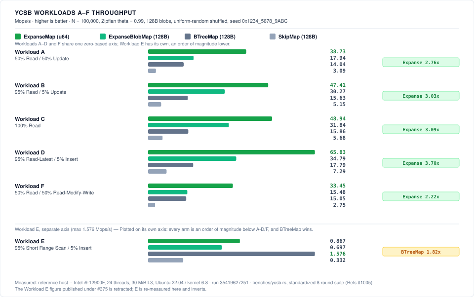

# Expanse

[](https://github.com/orieg/expanse/actions/workflows/ci.yml?query=branch%3Amain)
[](https://crates.io/crates/expanse-trie)
[](https://www.npmjs.com/package/@orieg/expanse)
[](https://www.nuget.org/packages/Orieg.Expanse)
[](https://pypi.org/project/expanse-trie/)
[](https://orieg.github.io/expanse/apt/)
[](https://orieg.github.io/expanse/rpm/)
[](#platform-support)
[-informational.svg?style=flat-square)](Cargo.toml)
[](LICENSE-MIT)
[](https://doi.org/10.5281/zenodo.22152112)

A **clean-room, pure-Rust implementation of Judy arrays**, modernized for modern 64-bit and 32-bit embedded microarchitectures, with **`libexpanse` — a high-performance, drop-in C ABI replacement for `libjudy`**.

Judy arrays (invented by Doug Baskins at Hewlett-Packard, ~2002) are sparse, dynamic associative structures built as 256-ary digital tries partitioned by **expanse** (decoding keys byte by byte over fixed digit ranges) rather than by population like comparison-based trees. Their speed comes from adaptive node compression — linear, bitmap, and uncompressed branches; linear and bitmap leaves; keys stored immediately inside pointers — tuned to keep every node traversal within a few cache-line fills.

---

## Why "Expanse"?

*Expanse* is the Judy design's own defining term — so central that the published descriptions stop to define it before anything else, and use it as the precise contrast with population-partitioned trees (B-trees, binary trees):

> "Expanse, population, and density are not commonly used terms in tree search literature, so let's define them here: **Expanse** is a range of possible keys […]"  
> — Doug Baskins, [*A 10-Minute Description of How Judy Arrays Work and Why They Are So Fast*](https://judy.sourceforge.net/doc/10minutes.htm) (2002)

> "A digital tree divides up the population (index set) uniformly **by expanse** (dividing and redividing the initial expanse evenly), while other methods, such as b-trees, divide up the population by the distribution of the population itself."  
> — Alan Silverstein, [*Judy IV Shop Manual*](https://judy.sourceforge.net/doc/shop_interm.pdf) (2002), "Digital Trees"

Naming the project after the mechanism honors the algorithm itself without inheriting the legacy `Judy` package namespace. Crate: `expanse-trie` (bare `expanse` is squatted on crates.io by an abandoned unrelated crate). C library: `libexpanse`, with a `libjudy-compat` shim for drop-in use.

---

## Key Features

- **Pure Rust & Memory Safe**: `#![no_std]` core on 32-bit embedded targets (`std` by default on 64-bit) with zero unsafe memory leaks, zero external runtime dependencies, verified under Miri & Loom.
- **Fewer Instructions than Stock Judy**: Lower Callgrind instruction counts than original `libjudy` on every measured arm (inserts, lookups, set tests, churn). Wall-clock is a win on sequential and clustered lookup at 1M keys (0.87x, 0.90x) and on insert across every distribution measured; the one real lookup loss is random 1M `get` at **1.031x, BCa 95% CI [1.024, 1.038]** *(measured: reference host, commit `4c4e852`, `results/baseline_vs_libjudy.json`)*. An earlier "~11% slower" figure here came from the harness before its measurement method was repaired and is **superseded** — see [docs/BENCHMARKING.md](docs/BENCHMARKING.md).
- **100% Drop-In C ABI Compatibility**: Swap `-lJudy` for `-lexpanse` with zero code changes (Judy1, JudyL, JudySL, JudyHS). Passes `php-judy` test suite (221/221) and differential oracle.
- **Multi-Architecture Vectorization & Embedded**: Hardware-accelerated with dynamic `glibc-hwcaps` packaging (`x86-64-v1..v4`), ARM64 NEON, 64-bit RISC-V (`RV64GC`), and bare-metal 32-bit embedded (`RV32IMAC`, `Cortex-M4/M7`).
- **Lock-Free OCC Reads (single writer)**: Optimistic concurrency control — **one writer at a time, serialized on a mutex; unlimited validated readers that take no lock**. On 100%-read, ~50%-hit workloads at 16 threads: **884.5 M ops/s (11.42×)** `SyncExpanseSet`, **424.1 M ops/s (11.40×)** `SyncExpanseMap`, **133.8 M ops/s (11.48×)** `SyncExpanseBytesMap`, **82.9 M ops/s (11.84×)** `SyncExpanseStrMap`; coarse-mutex baselines collapse to 0.14×–0.45× and `DashMap` reaches 132.1 M / 8.47× *(measured: reference host — Intel i9-12900F, run [33030152085](https://github.com/orieg/expanse/actions/runs/33030152085), ref `5fb03aa3`, load average 0.00)*. **Honest limit:** on a 50/50 read/write mix every single-writer arm *loses* throughput as threads are added (0.12×–0.55×) because writes serialize on one mutex; sharded/lock-free-write structures win that regime (`DashMap` 7.93×). See the concurrency section below.
- **Dense Memory Packing**: Down to **0.07–0.36 bytes/key** on 64-bit sets *(measured: Apple M1, `bytes_per_key` example, commit 6c63826a)* and **~0.31 bytes/key** on clustered 32-bit embedded sets *(measured: `bytes_per_key_32`, commit `7e579ac2`)*.

---

## Visual Performance Comparison




---

## API Surfaces

| Surface | Crate / Package | Deliverable |
|---|---|---|
| **Native Rust API (64-Bit)** | [`crates/expanse`](crates/expanse) (package `expanse-trie`) | Pure-Rust library: `ExpanseSet` (bit set), `ExpanseMap` (word→word), `ExpanseStrMap` (string→word), `ExpanseBytesMap` (bytes→word), `ExpanseBlobMap`, plus iterators and optimistic concurrent readers (`SyncExpanseMap`) |
| **Native Embedded Rust (32-Bit)** | [`crates/expanse`](crates/expanse) (`#![no_std]`) | 32-bit microprocessor collections: `ExpanseSet32` (bit set), `ExpanseMap32` (u32→u32 map), `ExpanseBlobMap32` with compact 8-byte `Edge32` layout and 32-byte cache line alignment |
| **C ABI (`libexpanse`)** | [`crates/expanse-capi`](crates/expanse-capi) | `cdylib`/`staticlib` exporting **both** the legacy `Judy.h` surface (`Judy1*`, `JudyL*`, `JudySL*`, `JudyHS*` — allowing consumers like [php-judy](https://github.com/orieg/php-judy) to swap `libJudy` for `libexpanse` without source changes) **and** modern `expanse.h` |
| **Modern C++20 Header** | [`include/expanse.hpp`](include/expanse.hpp) | Modern header-only C++20 STL-compatible RAII wrapper (`expanse::set`, `expanse::map`, `expanse::str_map`, `expanse::bytes_map`, `expanse::blob_map`, `expanse::sync_map`), `std::span` zero-copy access, `std::forward_iterator` ranges, and optimistic OCC readers |
| **Java / Scala FFM API** | [`bindings/java`](bindings/java) (`io.github.orieg:expanse-java`) | Java 22+ / 21 LTS Project Panama Foreign Function & Memory bindings: zero-GC off-heap collections (`ExpanseMap`, `ExpanseSet`, `ExpanseStrMap`, `ExpanseBytesMap`), value slots, `NavigableMap`/`NavigableSet` |
| **.NET / C# API** | [`bindings/dotnet`](bindings/dotnet) (`Orieg.Expanse`) | .NET 8.0/9.0+ C# bindings & NuGet package via P/Invoke: zero-GC off-heap collections (`ExpanseSet`, `ExpanseMap`, `ExpanseStrMap`, `ExpanseBytesMap`, `ExpanseBlobMap`, `ExpanseSyncMap`) |
| **Go API** | [`bindings/go`](bindings/go) (`github.com/orieg/expanse/bindings/go`) | Native Go bindings via CGO: zero-GC off-heap collections (`Set`, `Map`, `StrMap`, `BytesMap`, `BlobMap`) |
| **PHP API** | [`bindings/php`](bindings/php) (`orieg/expanse`) | Native PHP bindings via FFI & PIE: `Expanse\Set`, `Expanse\Map`, `Expanse\StrMap`, `Expanse\BytesMap`, `Expanse\BlobMap`, `Expanse\SyncMap`, `Expanse\SyncSet` |
| **Python API** | [`bindings/python`](bindings/python) (`pip install expanse-trie`) | High-performance Python extension via PyO3: `ExpanseSet`, `ExpanseMap`, `SyncExpanseMap`, GIL-released queries |
| **Node.js / Bun / Deno API** | [`crates/expanse-node`](crates/expanse-node) (`@orieg/expanse`) | Native high-performance N-API bindings via `napi-rs`: `ExpanseSet`, `ExpanseMap`, `ExpanseStrMap`, `ExpanseBytesMap`, `ExpanseBlobMap`, `SyncExpanseMap`, `SyncExpanseSet` |
| **WebAssembly / Edge** | [`crates/expanse-wasm`](crates/expanse-wasm) (`@orieg/expanse-wasm`) | WebAssembly bindings for edge runtimes (Cloudflare Workers, Fastly) and browsers |
| **Ruby API** | [`bindings/ruby`](bindings/ruby) (`gem install expanse`) | Native Ruby extension via Fiddle / C ABI: `Expanse::Set`, `Expanse::Map`, `Expanse::StrMap`, `Expanse::BytesMap`, `Expanse::BlobMap` |
| **RocksDB Pluggable MemTable** | [`integrations/rocksdb`](integrations/rocksdb) (`rocksdb-expanse`) | Official RocksDB `MemTableRep` / `MemTableRepFactory` implementation. **1.42× higher key density in RAM** than a fair variable-height skiplist baseline (13.2 vs 18.7 B/entry, deterministic accounting, re-measured at the [#372](https://github.com/orieg/expanse/issues/372) fix commit; the earlier "11.1×" headline used a strawman fat-node baseline and is **retracted**). Fewer L0 flushes is inferred (target). Against that same fair baseline, point lookup is **1.457× (BCa 95% CI [1.444, 1.470])**, range seek **1.512× [1.492, 1.546]** and sequential scan **3.331× [3.198, 3.486]** *(measured: reference host — Intel i9-12900F, run [33398474866](https://github.com/orieg/expanse/actions/runs/33398474866), commit `6cb64b45`, 5 rounds; artifact [`results/baseline_rocksdb.json`](results/baseline_rocksdb.json))*. See [`integrations/rocksdb/README.md`](integrations/rocksdb/README.md) |

Legacy ↔ modern naming:

| Legacy C API | Modern Rust Type | Modern C Type | Description |
|---|---|---|---|
| `Judy1` | `ExpanseSet` | `expanse_set_t` | Dynamic bit set / integer presence index |
| `JudyL` | `ExpanseMap` | `expanse_map_t` | Word-to-word associative map |
| `JudySL` | `ExpanseStrMap` | `expanse_strmap_t` | Null-terminated string-to-word map |
| `JudyHS` | `ExpanseBytesMap` | `expanse_bytesmap_t` | Arbitrary byte array-to-word map |

---

## Modernization Thesis

| Component | Original Judy IV (2002) | Expanse (2026) |
|---|---|---|
| **Cache-line geometry** | Assumed 128-byte lines | Nodes sized to 64-byte lines (1 or 2 cache lines per node) |
| **Bit scan / rank** | SWAR bit hacks, unrolled loops | Hardware `POPCNT` / `TZCNT` / `LZCNT` / ARM `cnt` (runtime CPUID dispatch on hot read paths; SWAR fallback on generic baseline builds; native in `x86-64-v2`/`v3` packages) |
| **Linear search** | Scalar unrolled byte compares | Vectorized SIMD byte scans (SSE2 on x86-64, NEON on ARM64; AVX2/AVX-512 not yet implemented) |
| **Allocation** | Custom 2001 chunk/buddy allocator | High-performance slab page pooling + intrusive freelists |
| **Pointer layout** | Full 16-byte JP per edge | 16-byte `Edge`: word 0 is the raw untruncated 64-bit pointer, tag and metadata live in word 1 — zero upper-bit stealing, so it stays correct under 57-bit LA57 and 52-bit ARM64 LVA ([encoding reference](docs/ARCHITECTURE.md#10-bit-level-encoding-reference)) |
| **Concurrency** | Single-threaded, external locks | Optimistic concurrency control (OCC) for reads |

Full architectural specifications: [docs/ARCHITECTURE.md](docs/ARCHITECTURE.md) · Embedded 32-Bit design: [docs/design/32-bit-embedded.md](docs/design/32-bit-embedded.md) · Large-Value design: [docs/design/large-values.md](docs/design/large-values.md) · Database engine patterns: [docs/DATABASE.md](docs/DATABASE.md) · CI/CD: [docs/CI.md](docs/CI.md).

---

## Database Engine Subsystems & Architecture

Expanse provides modern, hardware-vectorized digital trie primitives tailored for core database engine subsystems:

- **Inverted Indexes & Posting Lists (`ExpanseSet`)**: Doc-ID tracking at **0.07–0.36 bytes/docID** on clustered/dense sets — denser than Roaring Bitmaps on those distributions — with bitwise set algebra directly over compressed trie edges and $O(\text{depth})$ skip-scan acceleration.
- **MVCC Visibility Maps & Active Transaction Tracking (`SyncExpanseSet`)**: Optimistic active transaction (`xid`) tracking with no reader-side lock on the common path, and safe epoch reclamation under continuous OLTP churn.
- **Columnar String & Symbol Dictionaries (`ExpanseStrMap`)**: High-cardinality string deduplication and symbol tables using 8-byte chunk decomposition and tail collapse, preserving lexicographical order while sharing common prefix nodes.
- **Secondary Indexes & MemTables (`ExpanseMap` / `ExpanseMemTableRep`)**: Rebalance-free ordered key indexing, **2.9×–14.5× faster point lookups** than `std::collections::BTreeMap` at 1M keys, and full ordered `iter()` faster than `BTreeMap::iter()` for dense keys — sparse-key iteration is still slower, see [docs/DATABASE.md](docs/DATABASE.md) §7.1. Ships an official [RocksDB Pluggable MemTable (`integrations/rocksdb`)](integrations/rocksdb) integration.
- **Zero-Copy Shared-Memory Analytics** *(roadmap)*: Position-independent base-relative layouts for cross-worker IPC and parallel query execution with zero serialization — a design target; not yet implemented (see [docs/DATABASE.md](docs/DATABASE.md) §6).

See [docs/DATABASE.md](docs/DATABASE.md) and [integrations/rocksdb/README.md](integrations/rocksdb/README.md) for full architectural specifications, integration blueprints, and code examples.

---

## Comparative Performance vs Industry Primitives

Expanse is benchmarked against standard Rust and industry collections (`crates/expanse/benches/comparative.rs`). Untagged speedup multipliers below are load-sensitive wall-clock figures awaiting a clean-host re-measurement; memory-footprint figures are deterministic. Full treatment: [docs/DATABASE.md](docs/DATABASE.md) §7.

### 1. `ExpanseSet` vs `RoaringBitmap`
- **Sparse / clustered (<0.1% density)**: Expanse point lookups (`contains`) are **~2.2×–2.8× faster** than Roaring Bitmaps due to direct tagged-pointer immediate storage *(measured: reference host, commit 695b98d, `benches/comparative.rs`)*. On **dense** sets Roaring's bit containers win `contains` (~1.4×–1.9×). Roaring's specialized rank index makes its **`rank`/`select` faster** than Expanse's `count_below`/`by_count` — use Expanse for membership, Roaring for heavy rank/select.
- **Clustered / Dense (>50% density)**: `ExpanseSet` achieves **0.07–0.36 bytes/key** *(measured: Apple M1, `bytes_per_key` example, commit 6c63826a — deterministic allocator accounting)*, matching Roaring's run/bit container compression while providing $O(\text{depth})$ forward and backward iteration.

### 2. `ExpanseMap` vs `hashbrown::HashMap` & `BTreeMap`
- **Point Lookups vs BTreeMap**: `ExpanseMap` point lookups are **2.9×–14.5× faster** than `std::collections::BTreeMap` at 1M keys (sequential 11.9 ns vs 108.9 ns, clustered 12.9 ns vs 110.2 ns; workload: `core_compare`) *(measured: reference host, commit 695b98d, `benches/compare.rs`)*. Full ordered `iter()` is **faster than `BTreeMap::iter()` for dense key distributions** at 1M keys — sequential **0.7×**, clustered **0.8×**, random **0.5×** the time of `BTreeMap::iter()`. **Sparse-key iteration remains ~4.7× slower**, a structural residual tracked in [#270](https://github.com/orieg/expanse/issues/270) *(measured: reference host — Intel i9-12900F, 24 threads, commit 46529f19, `benches/compare.rs`)*; full treatment in [docs/DATABASE.md](docs/DATABASE.md) §7.1.
- **Random Lookups vs Swiss Tables**: on uniform-random 64-bit keys `hashbrown::HashMap` (Swiss Table) is faster for raw membership — its $O(1)$ probe beats trie descent by ~1.7×–3.1× on 1M random keys. `ExpanseMap` trades that for **strict key ordering, ordered iteration, $O(1)$ prefix search, and a smaller memory footprint on clustered integer sets**. On **sequential** keys the two are near parity (11.9 ns vs 12.1 ns at 1M; workload: `core_compare`). The random-key gap is a working-set-vs-cache crossover, not a fixed weakness: within ~1.1× of hashbrown while the set is cache-resident (10k: 10.0 ns vs 8.9 ns; workload: `core_compare`), widening to ~2.9× at 1M once the working set exceeds L2/L3 and each of the ~5 trie descents misses to DRAM against hashbrown's single probe. Verified stable, no regression *(measured: reference host, commit 4a12f046)*.

---

## Multithreaded OCC Concurrency Scalability

Expanse provides optimistic concurrency control for readers (`SyncExpanseMap` / `SyncExpanseSet` / `SyncExpanseStrMap` / `SyncExpanseBytesMap` in `benches/concurrency.rs`).

**The concurrency model, stated plainly.** One writer at a time, serialized on a mutex; any number of readers, which take no lock in the common path. OCC solves the *reader* problem — a reader samples a version, walks, and re-validates, so it never needs a lock to get a consistent view. It does not make writes concurrent: two writers restructuring overlapping subexpanses would corrupt the trie, so mutations serialize.

The protocol is **blocking**, not lock-free and not obstruction-free. `SeqVersion::sample` spins without bound while a writer's bracket is open, so a reader running in complete isolation against a writer suspended mid-update never completes — which fails the isolation criterion obstruction-freedom requires. After `MAX_RETRIES` restarts a reader additionally falls back to taking the writer mutex.

This is [optimistic lock coupling](https://db.in.tum.de/~leis/papers/artsync.pdf) (Leis, Scheibner, Kemper & Neumann, DaMoN 2016), the same protocol those authors describe for adaptive radix trees; the bounded-restart-then-lock fallback is what they prescribe for forward progress. They do not claim lock-freedom for it, and call a lock-free ART an open question. What the design buys is that reads take no lock **in the common case** — that is a fast path, not a progress guarantee.

How often the fallback actually fires is **not currently measured**: the `read_fallbacks` counter is compiled out by default (`--features occ-stats`), is not exercised by any CI job, and until recently was wired at only 2 of the 8 retry-exhaustion sites. The `locked_reads` counter added alongside it counts every route to the writer mutex, including the unconditional `with_locked` / `len` / `mem_used` paths that never attempt an optimistic walk. No ratio from either is published here until it is measured under a dedicated-writer workload with a provenance tag.

Multi-writer support (per-subtree write locks, or sharding) is the standing follow-up; see `docs/ARCHITECTURE.md`. All arms use bounded ~50%-hit keyspaces *(measured: reference host — Intel i9-12900F, 24 threads, 30 MiB L3, run [33030152085](https://github.com/orieg/expanse/actions/runs/33030152085), ref `5fb03aa3`, load average 0.00; workload: `core_concurrency`)*. Correction history for the earlier unbounded-keyspace figures: [docs/BENCHMARKING.md](docs/BENCHMARKING.md).

| arm | 1 Thread | 4 Threads | 16 Threads | Scaling |
|---|---:|---:|---:|---:|
| `SyncExpanseSet` (100% read) | 77.5 M ops/s | 295.2 M ops/s | **884.5 M ops/s** | **11.42×** |
| `SyncExpanseMap` (100% read) | 37.2 M ops/s | 138.9 M ops/s | **424.1 M ops/s** | **11.40×** |
| `SyncExpanseBlobMap` (100% read) | 31.4 M ops/s | 120.5 M ops/s | **332.4 M ops/s** | **10.60×** |
| `SyncExpanseBytesMap` (100% read) | 11.7 M ops/s | 40.9 M ops/s | **133.8 M ops/s** | **11.48×** |
| `SyncExpanseStrMap` (100% read) | 7.0 M ops/s | 26.6 M ops/s | **82.9 M ops/s** | **11.84×** |
| `DashMap<Vec<u8>, u64>` (100% read) | 15.6 M ops/s | 50.4 M ops/s | 132.1 M ops/s | 8.47× |
| `Mutex<Expanse*>` baselines (100% read) | 9–40 M ops/s | 6–10 M ops/s | 3.5–5.6 M ops/s | 0.14×–0.45× (collapse) |
| `SyncExpanseMap` (50R/50W mixed) | 10.9 M ops/s | 3.0 M ops/s | 2.0 M ops/s | **0.19× (negative scaling)** |
| `DashMap` (50R/50W mixed) | 5.6 M ops/s | 17.3 M ops/s | 44.5 M ops/s | **7.93×** |

- **Read-only OCC scaling is near-linear on hit-bearing workloads** (10.6×–11.8× at 16 threads) — ahead of `DashMap` in both absolute throughput and scaling, while retaining ordered iteration and range/rank queries a sharded hash map cannot serve; coarse-mutex baselines fall below their single-thread throughput under contention.
- **The 50R/50W rows are a mixed-op rate, not read scaling.** Every thread alternates reads and writes in one loop, so the reported read-op rate is pinned 1:1 to write handoffs and cannot exceed the rate at which writes retire.
- **Write-mixed workloads do not scale, and that is the honest limit**: at 50/50 every single-writer arm *loses* throughput as threads are added (0.12×–0.55×) because writes serialize on the wrapper mutex and invalidate concurrent readers' snapshots. `DashMap` (7.93×) and `SkipMap` (6.94×) scale here because they admit **many concurrent writers**, where Expanse admits **one writer at a time** — the comparison measures that architectural difference. Multi-writer support (sharding or per-node write locks) is the standing follow-up — see `docs/ARCHITECTURE.md` §6.
- **Mechanism**: Fine-grained per-node version bracketing and epoch-based pointer reclamation let concurrent readers validate subtrees hand-over-hand without acquiring mutexes. Only the read-only path realizes full scaling today.

---

## Microarchitecture Scaling: x86-64-v1 vs v3

**Higher ISA tiers do not uniformly help.** On the measured arch sweep — run [33030463060](https://github.com/orieg/expanse/actions/runs/33030463060) on the idle reference host — clustered lookups gain **1.08×–1.14×** over the portable baseline, random is flat to slightly worse (**0.87×–0.95×**), and sequential regresses. The sequential **0.34×** `x86-64-v2` cell has no plausible ISA mechanism and reads as code-layout sensitivity at N = 10k; it is published as measurement, not finding. Full table, caveats, and correction history: [docs/BENCHMARKING.md](docs/BENCHMARKING.md).

Per-tier instruction counts are deterministic: [`docs/visualizer_data.json`](docs/visualizer_data.json) carries Callgrind counts for `x86-64-v1` and `x86-64-v3` across every instruction-benchmark routine — v1→v3 deltas span **−1.9% to −42.6%** (largest on `map_remove/random`).

---

## Performance vs Stock libjudy

Instructions retired and wall-clock latency through the identical C ABI on identical key streams, both libraries `dlopen`'d — measured via paired A/B rounds (interleaved median of 5 rounds). **Below 1.00 = libexpanse does less work / runs faster than original libjudy.**

> **Provenance.** Two column families with different bases: the **instruction-retired columns** (`M inst`, `.so / rlib` ratios; workload: `capi_vs_stock`) are deterministic Callgrind counts on the portable `x86-64-v1` baseline, and the `B/k` columns are deterministic byte accounting. The **wall-clock `ns` rows** (the two 1M-population rows; workload: `capi_bench_vs_libjudy`) are measured on the dedicated quiet host — Intel i9-12900F, 24 threads, 30 MiB L3, Linux 6.8, commit `4c4e852`, [run 33151981386](https://github.com/orieg/expanse/actions/runs/33151981386), load average 0.16 — via `crates/expanse-capi/examples/bench_vs_libjudy.rs`: **15 paired rounds, arms interleaved per round, `2 × population` distinct probes at reuse 1.0, 50% hit rate, value slot dereferenced**, both libraries `dlopen`'d. Ratios carry BCa 95% intervals; per-round data is in [`results/baseline_vs_libjudy.json`](results/baseline_vs_libjudy.json). Rows measured before the harness repair (commit `43b46f38`, 4,096 probes reused 8×, 100% hit, median of 5) are **superseded** and have been replaced rather than rescaled.
>
> **Random 1M lookup is the engine's one measured wall-clock loss:** **1.031× slower than stock libjudy, BCa 95% CI [1.024, 1.038]** (workload: `capi_bench_vs_libjudy`) — the interval excludes parity, so the deficit is real. It wins sequential 1M lookup (0.87×), clustered 1M lookup (0.90×), and insert on every distribution measured. An earlier "~11% slower" figure here predates the harness repair and is **superseded**, not adjusted — it measured a different workload (workloads differ: `capi_vs_stock` vs `capi_bench_vs_libjudy`). Full matrix, intervals and correction history: [docs/BENCHMARKING.md](docs/BENCHMARKING.md); per-round data: [`results/baseline_vs_libjudy.json`](results/baseline_vs_libjudy.json).

| Benchmark Workload | Wall-Clock Latency (Expanse vs Stock) | Ratio (.so / rlib) | Memory Overhead (Expanse vs Stock) | Status |
|---|---|---:|---|---|
| **Sequential 1,000,000 insert** | **12.2 ns** vs 22.4 ns (workload: `capi_bench_vs_libjudy`) | **0.545×** [0.544, 0.546] | **8.56 B/k** vs 8.32 B/k (1.03×) | 🟢 **~1.84× faster insert** |
| **Sequential 100,000 insert** | **6.40M** vs 12.84M inst (workload: `capi_vs_stock`) | **0.50× / 0.49×** | **8.57 B/k** vs 8.41 B/k (1.02×) | 🟢 **2× faster than Judy** |
| **Sequential 30,000 lookup** | **4.37M** vs 5.07M inst (workload: `capi_vs_stock`) | **0.86× / 0.85×** | **8.57 B/k** vs 8.41 B/k (1.02×) | 🟢 **14% faster than Judy** |
| **Random 1,000,000 lookup** | 41.0 ns vs **39.8 ns** (workload: `capi_bench_vs_libjudy`) | **1.031×** [1.024, 1.038] | **16.70 B/k** vs 17.67 B/k (0.95×) | 🟡 **3% slower lookup, 5% less memory** |
| **Random 3,000,000 lookup** | **318.5M** vs 389.7M inst (workload: `capi_vs_stock`) | **0.82× / 0.81×** | **16.80 B/k** vs 17.80 B/k (0.94×) | 🟢 **18% faster than Judy** |
| **Random 30,000 lookup** | **4.53M** vs 5.09M inst (workload: `capi_vs_stock`) | **0.89× / 0.88×** | **24.63 B/k** vs 24.81 B/k (0.99×) | 🟢 **11% faster than Judy** |
| **Random 30,000 set test** | **3.78M** vs 3.83M inst (workload: `capi_vs_stock`) | **0.988× / 0.98×** | **0.36 B/k** vs 0.36 B/k (1.00×) | 🟢 **Faster than Judy** |
| **Random 30,000 churn (del+ins)** | **38.14M** vs 50.78M inst (workload: `capi_vs_stock`) | **0.751× / 0.75×** | **Dynamic exact accounting** | 🟢 **24.9% faster than Judy** |
| **Clustered 100,000 set insert** | **7.54M** vs 10.38M inst (workload: `capi_vs_stock`) | **0.727× / 0.72×** | **0.36 B/k** vs 0.36 B/k (1.00×) | 🟢 **27.3% faster than Judy** |
| **Clustered 1,000,000 insert** | **19.9 ns** vs 21.6 ns (workload: `capi_bench_vs_libjudy`) | **0.92×** | **8.61 B/k** vs 9.32 B/k (0.92×) | 🟢 **~8% faster insert, 8% less memory** |
| **Clustered 1,000,000 lookup** | **8.5 ns** vs 10.4 ns (workload: `capi_bench_vs_libjudy`) | **0.82×** | **8.61 B/k** vs 9.32 B/k (0.92×) | 🟢 **~18% faster lookup** |
| **Clustered 30,000 lookup** | **3.71M** vs 3.97M inst (workload: `capi_vs_stock`) | **0.94× / 0.92×** | **8.63 B/k** vs 8.87 B/k (0.97×) | 🟢 **6% faster than Judy** |
| **Clustered 100,000 map insert** | **11.42M** vs 12.01M inst (workload: `capi_vs_stock`) | **0.951× / 0.95×** | **8.63 B/k** vs 8.87 B/k (0.97×) | 🟢 **4.9% faster than Judy** |
| **Random 100,000 set insert** | **15.10M** vs 15.69M inst (workload: `capi_vs_stock`) | **0.962× / 0.96×** | **0.36 B/k** vs 0.36 B/k (1.00×) | 🟢 **3.8% faster than Judy** |
| **Random 100,000 map insert** | **17.52M** vs 17.76M inst (workload: `capi_vs_stock`) | **0.986× / 0.997×** | **16.70 B/k** vs 17.67 B/k (0.95×) | 🟢 **Faster than Judy across rlib and .so** |

---

## Compatibility Gates (Standing CI, 100% Green)

| Gate | Verification Target | Status |
|---|---|---|
| **G1: Differential Oracle** | Randomized operation sequences through `libexpanse` and stock `libjudy` must agree identically | 🟢 Passing |
| **G2: `php-judy` Drop-in** | `php-judy` compiles unmodified against `libexpanse`; entire test suite passes (221/221 on Linux + macOS) | 🟢 Passing |
| **G3: Windows Parity** | `php-judy` compiles on Windows MSVC against `expanse.dll` / `expanse.lib` and passes full suite | 🟢 Passing |
| **G4: `LD_PRELOAD` Parity** | Unmodified binaries built against stock Judy run identically under `LD_PRELOAD=libexpanse.so` | 🟢 Passing |

---

## Platform Support

| Platform | Target Triple | Distribution & Packaging |
|---|---|---|
| **Linux x86-64** | `x86_64-unknown-linux-gnu` | `libexpanse` APT/RPM package (`glibc-hwcaps` for `v2`/`v3`/`v4`), `.tar.gz` |
| **Linux ARM64** | `aarch64-unknown-linux-gnu` | `libexpanse` APT/RPM package (Graviton, Raspberry Pi 4/5), `.tar.gz` |
| **Linux RISC-V 64-bit** | `riscv64gc-unknown-linux-gnu` | `libexpanse` APT/RPM package (RV64GC edge/server), `.tar.gz` |
| **Linux x86-64 Static** | `x86_64-unknown-linux-musl` | Static musl archives, Alpine Linux compatible `.tar.gz` |
| **macOS Apple Silicon** | `aarch64-apple-darwin` | Universal / Native AArch64 `.tar.gz` |
| **macOS Intel** | `x86_64-apple-darwin` | x86-64 `.tar.gz` |
| **Windows x86-64** | `x86_64-pc-windows-msvc` | Precompiled `expanse.dll` / `expanse.lib` `.zip`, vcpkg, NuGet |
| **RISC-V 32-Bit (RV32)** | `riscv32imac-unknown-none-elf` | `#![no_std]` staticlib / embedded crate ([design #109](docs/design/32-bit-embedded.md)) |
| **ARM Cortex-M (M4/M7)** | `thumbv7em-none-eabihf` | `#![no_std]` staticlib / embedded crate ([design #109](docs/design/32-bit-embedded.md)) |
| **Espressif RISC-V (ESP-IDF)** | `riscv32imc-unknown-none-elf` (C2/C3), `riscv32imac-unknown-none-elf` (C6/H2/P4) | ESP-IDF Component (`components/expanse/`), `#![no_std]`. RISC-V parts only — the Xtensa ESP32/S2/S3 have no mainline rustc target. No `Judy*` symbols at 32-bit ([docs](components/expanse/README.md)) |
| **WebAssembly (wasm32)** | `wasm32-unknown-unknown` | npm `@orieg/expanse-wasm` (`WasmExpanseMap32`, `WasmExpanseSet32`) |
| **WebAssembly Memory64 (wasm64)** | `wasm64-unknown-unknown` | 64-bit engine (`ExpanseMap`, `ExpanseSet`), Node.js Memory64 (`--experimental-wasm-memory64`) |

---

## 32-Bit Embedded Microprocessor Architecture (`#![no_std]`)

Expanse provides first-class support for 32-bit embedded microprocessors (`ExpanseSet32`, `ExpanseMap32`, `ExpanseBlobMap32`) designed to operate in tightly constrained internal SRAM:

- **Compact 8-Byte `Edge32`**: 50% structural SRAM reduction vs 64-bit descriptors (`[ptr (4B) | aux (3B) | tag (1B)]`), packing up to 7 immediate keys with zero heap allocations.
- **32-Byte Cache Alignment**: Nodes are sized for embedded microarchitectures (`BranchL2_32` = 32B = 1 cache line on Cortex-M7/ESP32; `BranchL6_32` = 64B = 2 cache lines).
- **Polymorphic `ValueSlot32`**: Payloads $\le 3\text{ bytes}$ (CAN-bus flags, status codes, checksums) fit inline with zero heap allocations.
- **Microcontroller SRAM Footprint** — real `mem_used()` byte accounting from `cargo run --release --example bytes_per_key_32` *(measured, commit `7e579ac2`; deterministic — host-independent for the fixed 8-byte `Edge32` layout)*:
  - Clustered sensor timestamps (10k consecutive): **$0.3088\text{ B/key}$**.
  - Sparse 29-bit CAN IDs (500 IDs): **$8.704\text{ B/key}$** (genuinely sparse — a handful of keys spread across the 29-bit space).
  - IPv4 subnet /24 routing map (2k routes): **$8.416\text{ B/key}$**.
  - Dense consecutive map (10k, `u32→u32`): **$4.424\text{ B/key}$**.

---

## Distribution & Quick Start

### 1. Rust / Cargo (64-Bit & 32-Bit)
```toml
[dependencies]
expanse-trie = "0.5.0"
```

```rust
use expanse_trie::{ExpanseMap, ExpanseMap32};

fn main() {
    // 64-bit server map
    let mut map = ExpanseMap::new();
    map.insert(42, 100);
    assert_eq!(map.get(42), Some(100));

    // 32-bit embedded map
    let mut map32 = ExpanseMap32::new();
    map32.insert(100, 500);
    assert_eq!(map32.get(100), Some(500));
}
```

### 2. Debian / Ubuntu Official APT Repository
```bash
# Add official repository
echo "deb [trusted=yes] https://orieg.github.io/expanse/apt/ stable main" | sudo tee /etc/apt/sources.list.d/expanse.list

# Update & install runtime, dev headers, and legacy Judy compatibility symlinks
sudo apt-get update
sudo apt-get install -y libexpanse1 libexpanse-dev libjudy-compat
```

### 3. Enterprise Linux Official RPM Repository (RHEL / CentOS / Fedora / Rocky / Amazon Linux)
```bash
# 1. Add official repository configuration
sudo dnf config-manager --add-repo https://orieg.github.io/expanse/rpm/expanse.repo

# 2. Update & install runtime, dev headers, and legacy Judy compatibility symlinks
sudo dnf install -y libexpanse libexpanse-devel libjudy-compat
```

### 4. Modern C API (`expanse.h`)
```c
#include <stdio.h>
#include <expanse.h>

int main(void) {
    expanse_map_t *map = expanse_map_new();
    
    // Insert key -> value
    expanse_map_insert(map, 42, 100, NULL);
    
    // Fast O(depth) lookup
    uint64_t val;
    if (expanse_map_get(map, 42, &val)) {
        printf("Key 42 -> %lu\n", val);
    }
    
    // Exact byte memory accounting
    printf("Memory: %zu bytes\n", expanse_map_mem_used(map));
    
    expanse_map_free(map);
    return 0;
}
```
Compile and link directly:
```bash
gcc main.c -lexpanse -o main
```

### 5. Modern C++20 Header-Only API (`expanse.hpp`)
```cpp
#include <iostream>
#include <string_view>
#include <expanse.hpp>

int main() {
    // 1. Bitset (Judy1) with range iteration & O(depth) rank/select
    expanse::set s;
    s.insert(42);
    s.insert(100);
    for (uint64_t key : s) {
        std::cout << "Key: " << key << "\n";
    }
    std::cout << "Rank of 50: " << s.rank(50) << "\n";

    // 2. Word map (JudyL) with operator[] and structured binding iteration
    expanse::map<uint64_t, uint64_t> m;
    m[42] = 1000;
    for (auto [k, v] : m) {
        std::cout << k << " -> " << v << "\n";
    }

    // 3. String trie (JudySL) with std::string_view keys
    expanse::str_map<uint64_t> sm;
    sm["apple"] = 10;
    sm["banana"] = 20;

    // 4. Large-value off-heap blob map with zero-copy views
    expanse::blob_map bm;
    bm.insert(1, std::string_view("arbitrary payload bytes"), 0x01);
    if (auto view = bm.get(1)) {
        std::cout << "Blob: " << view->as_string_view() << "\n";
    }

    // 5. Multi-threaded OCC concurrent map
    expanse::sync_map sync_m;
    sync_m.insert(10, 500);
    auto reader = sync_m.make_reader();
    std::cout << "Read concurrent: " << reader.get(10).value_or(0) << "\n";
    return 0;
}
```
Compile with any C++20 compiler:
```bash
clang++ -std=c++20 main.cpp -Iinclude -lexpanse -lpthread -ldl -lm -o main
```

### 6. Drop-in Legacy C API (`Judy.h`)
```c
#include <stdio.h>
#include <Judy.h>

int main(void) {
    Pvoid_t judy = (Pvoid_t)NULL;
    Word_t *val;
    
    // JudyL insert macro
    JLI(val, judy, 42);
    *val = 100;
    
    // JudyL lookup macro
    JLG(val, judy, 42);
    printf("Value: %lu\n", *val);
    
    // Exact memory used macro
    Word_t bytes;
    JLMU(bytes, judy);
    printf("Memory: %lu bytes\n", bytes);
    
    // Free array macro
    Word_t freed;
    JLFA(freed, judy);
    return 0;
}
```
Compile with `-lexpanse` or drop-in `-lJudy`:
```bash
gcc legacy.c -lJudy -o legacy
```

### 7. Windows MSVC / vcpkg / NuGet
- **Release Bundle**: `expanse-v0.5.0-x86_64-pc-windows-msvc.zip` with DLL, import lib, and headers.
- **vcpkg**: `vcpkg install expanse` using `extra/vcpkg/`.
- **NuGet**: Visual Studio C++ package template in `extra/nuget/`.

### 8. Python Quickstart (`pip install expanse-trie`)
```python
from expanse_trie import ExpanseSet, ExpanseMap, SyncExpanseMap

# 1. Dynamic sparse 64-bit integer set (Judy1)
s = ExpanseSet([10, 20, 50, 100])
assert 20 in s
assert s.next_at_or_after(25) == 50
assert s.count_range(10, 50) == 3

# 2. Key-value associative map (JudyL)
m = ExpanseMap({1: 100, 2: 200})
m[42] = 1000
assert m.range(0, 50) == [(1, 100), (2, 200), (42, 1000)]

# 3. Multithreaded optimistic OCC map (GIL-free queries)
sync_m = SyncExpanseMap({10: 100})
assert sync_m[10] == 100
```
See [docs/bindings/python.md](docs/bindings/python.md) for full Python documentation and benchmarks.

### 9. Java & Scala Quickstart (`io.github.orieg:expanse-java`)

> **Not yet on Maven Central.** No `io.github.orieg` artifact is published (Maven Central returns 404 / `numFound:0`), and no release-workflow job currently builds or deploys the Java bindings. Build from `bindings/java` locally until first publish. The coordinates below are the planned ones.

```xml
<dependency>
    <groupId>io.github.orieg</groupId>
    <artifactId>expanse-java</artifactId>
    <version>0.5.0</version>
</dependency>
```

```java
import io.github.orieg.expanse.ExpanseMap;
import io.github.orieg.expanse.ExpanseSet;

// Zero-allocation, off-heap ordered map & set (Project Panama FFM)
try (ExpanseMap map = new ExpanseMap();
     ExpanseSet set = new ExpanseSet()) {
    // Inserts & lookups with zero JVM heap allocations
    map.put(42L, 1000L);
    long val = map.getOrDefault(42L, -1L);

    set.add(100L);
    set.add(200L);
    long count = set.countRange(50L, 250L); // O(depth) rank
}
```
See [docs/bindings/java.md](docs/bindings/java.md) for Panama FFM architecture, GC elimination benchmarks, and Spark/Flink off-heap integration patterns.

### 10. .NET & C# Quickstart (`Orieg.Expanse`)

```bash
dotnet add package Orieg.Expanse
```

```csharp
using Expanse;

// Zero-GC, off-heap ordered bit set & word map
using var set = new ExpanseSet();
using var map = new ExpanseMap();

set.Add(42);
map[42] = 1000;

ulong rank = set.Rank(100); // O(depth) rank
bool found = map.TryGet(42, out ulong value);
```
See [bindings/dotnet/README.md](bindings/dotnet/README.md) for full .NET documentation and guides.

See [bindings/go/README.md](bindings/go/README.md) for full Go documentation.

### 11. PHP Quickstart (`orieg/expanse`)
```bash
composer require orieg/expanse
```

```php
use Expanse\Set;
use Expanse\Map;

$set = new Set();
$set->add(42);
$rank = $set->rank(100);

$map = new Map();
$map->set(42, 1000);
$val = $map->get(42);
```
See [docs/bindings/php.md](docs/bindings/php.md) and [bindings/php/README.md](bindings/php/README.md) for full PHP documentation.

### 12. Node.js, Bun & Deno Quickstart (`npm i @orieg/expanse`)
```bash
npm install @orieg/expanse
# or bun add @orieg/expanse
```

```javascript
import { ExpanseSet, ExpanseMap, ExpanseBlobMap } from '@orieg/expanse';

// 1. Dynamic sparse 64-bit integer set (Judy1)
const set = new ExpanseSet([10n, 20n, 50n, 100n]);
console.log(set.has(20n));               // true
console.log(set.next(25n));              // 50n
console.log(set.countRange(10n, 50n));   // 3n

// 2. Key-value associative map (JudyL)
const map = new ExpanseMap();
map.set(42n, 1000n);
console.log(map.get(42n));               // 1000n

// 3. High-performance polymorphic blob map (inline packing + arena)
const blobmap = new ExpanseBlobMap();
blobmap.set(1n, Buffer.from('inline'), 10 /* 32-bit hot metadata */);
const res = blobmap.getWithMeta(1n);
console.log(res.isInline);               // true (0 heap allocations)
```
See [crates/expanse-node/README.md](crates/expanse-node/README.md) for full Node.js documentation.

### 13. Espressif ESP-IDF Component (ESP32-C2/C3/C6/H2/P4)

Add `expanse` to your ESP-IDF project's `main/idf_component.yml`:
```yaml
dependencies:
  expanse:
    version: "^0.5.0"
```
Or clone directly into your project's `components/` directory:
```bash
git clone https://github.com/orieg/expanse.git components/expanse
```

```c
#include "expanse.h"
#include "expanse_esp_idf.h"
#include "esp_log.h"

void app_main(void) {
    // 32-bit digital map (compact 8-byte Edge32, 32-byte aligned nodes).
    // Keys and values are expanse_word_t — one machine word, uint32_t here.
    expanse_map_t *map = expanse_map_new();
    expanse_map_insert(map, 0x18FF50E5 /* CAN ID */, 42 /* value */, NULL);

    expanse_word_t val = 0;
    if (expanse_map_get(map, 0x18FF50E5, &val)) {
        ESP_LOGI("expanse", "Found CAN ID 0x18FF50E5 -> Value %u", (unsigned int)val);
    }
    expanse_map_free(map);
}
```

The 32-bit library exports the ordered `expanse_set_*` / `expanse_map_*` core
and **no `Judy*` symbols** — the drop-in ABI is a 64-bit-only guarantee. See the
[surface matrix](docs/COMPAT.md#build-configuration-surface-matrix).
See [components/expanse/README.md](components/expanse/README.md) for full ESP-IDF component documentation and `Kconfig` options.
See [docs/PACKAGING.md](docs/PACKAGING.md) for full packaging instructions across all platforms.

---

## Clean-Room Statement

The original Judy C library is LGPL. **No code from it has been consulted or ported.** This implementation derives strictly from published algorithm papers and shop manuals:
- Doug Baskins, [*A 10-Minute Description of How Judy Arrays Work and Why They Are So Fast*](https://judy.sourceforge.net/doc/10minutes.htm) (Hewlett-Packard, 2002)
- Alan Silverstein, [*Judy IV Shop Manual*](https://judy.sourceforge.net/doc/shop_interm.pdf) (Hewlett-Packard, 2002)

C API compatibility is defined by the documented API contract (man pages, published documentation) and validated by black-box differential testing. Licensed under **MIT OR Apache-2.0**.

---

## Citation

Expanse is archived on Zenodo. Machine-readable metadata is in [`CITATION.cff`](CITATION.cff); GitHub renders it under **Cite this repository**.

Two DOIs are minted. Cite the **concept DOI** for the project as a whole — it always resolves to the latest release — or a **version DOI** to pin the exact release you used:

| Scope | DOI |
|---|---|
| Concept (all versions) | [`10.5281/zenodo.22152112`](https://doi.org/10.5281/zenodo.22152112) |
| v0.5.0 | [`10.5281/zenodo.22152113`](https://doi.org/10.5281/zenodo.22152113) |

```bibtex
@software{brousse_expanse,
  author  = {Brousse, Nicolas},
  title   = {{Expanse: clean-room, pure-Rust Judy arrays with a
             drop-in libjudy-compatible C ABI}},
  year    = {2026},
  version = {0.5.0},
  doi     = {10.5281/zenodo.22152112},
  url     = {https://github.com/orieg/expanse}
}
```

If your claim depends on a measured number, cite the version DOI rather than the concept DOI: figures are re-measured between releases, and several changed in v0.5.0.

---

## License

Dual-licensed under [MIT](LICENSE-MIT) or [Apache-2.0](LICENSE-APACHE), at your option.
