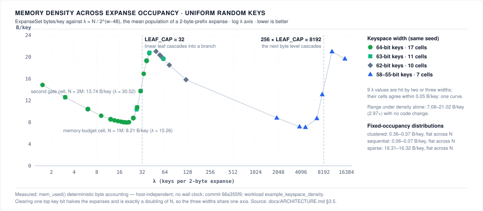

# Expanse

[](https://github.com/orieg/expanse/actions/workflows/ci.yml?query=branch%3Amain)
[](https://crates.io/crates/expanse-trie)
[](https://www.npmjs.com/package/@orieg/expanse)
[](https://www.nuget.org/packages/Orieg.Expanse)
[](https://pypi.org/project/expanse-trie/)
[](https://orieg.github.io/expanse/apt/)
[](https://orieg.github.io/expanse/rpm/)
[](#platform-support)
[-informational.svg?style=flat-square)](Cargo.toml)
[](LICENSE-MIT)
[](https://doi.org/10.5281/zenodo.22152112)

A **clean-room, pure-Rust implementation of Judy arrays**, modernized for modern 64-bit and 32-bit embedded microarchitectures, with **`libexpanse` — a high-performance, drop-in C ABI replacement for `libjudy`**.

Judy arrays (invented by Doug Baskins at Hewlett-Packard, ~2002) are sparse, dynamic associative structures built as 256-ary digital tries partitioned by **expanse** (decoding keys byte by byte over fixed digit ranges) rather than by population like comparison-based trees. Their speed comes from adaptive node compression — linear, bitmap, and uncompressed branches; linear and bitmap leaves; keys stored immediately inside pointers — tuned to keep every node traversal within a few cache-line fills.

---

## Why "Expanse"?

*Expanse* is the Judy design's own defining term — so central that the published descriptions stop to define it before anything else, and use it as the precise contrast with population-partitioned trees (B-trees, binary trees):

> "Expanse, population, and density are not commonly used terms in tree search literature, so let's define them here: **Expanse** is a range of possible keys […]"  
> — Doug Baskins, [*A 10-Minute Description of How Judy Arrays Work and Why They Are So Fast*](https://judy.sourceforge.net/doc/10minutes.htm) (2002)

> "A digital tree divides up the population (index set) uniformly **by expanse** (dividing and redividing the initial expanse evenly), while other methods, such as b-trees, divide up the population by the distribution of the population itself."  
> — Alan Silverstein, [*Judy IV Shop Manual*](https://judy.sourceforge.net/doc/shop_interm.pdf) (2002), "Digital Trees"

Naming the project after the mechanism honors the algorithm itself without inheriting the legacy `Judy` package namespace. Crate: `expanse-trie` (bare `expanse` is squatted on crates.io by an abandoned unrelated crate). C library: `libexpanse`, with a `libjudy-compat` shim for drop-in use.

---

## Key Features

- **Pure Rust & Memory Safe**: `#![no_std]` core on 32-bit embedded targets (`std` by default on 64-bit) with zero unsafe memory leaks, zero external runtime dependencies, verified under Miri & Loom.
- **Fewer Instructions than Stock Judy**: Lower Callgrind instruction counts than original `libjudy` on every measured arm (inserts, lookups, set tests, churn). Wall-clock is a win on sequential and clustered lookup at 1M keys (0.87x, 0.90x) and on insert across every distribution measured; the one real lookup loss is random 1M `get` at **1.031x, BCa 95% CI [1.024, 1.038]** *(measured: reference host, commit `4c4e852`, `results/baseline_vs_libjudy.json`)*.
- **100% Drop-In C ABI Compatibility**: Swap `-lJudy` for `-lexpanse` with zero code changes (Judy1, JudyL, JudySL, JudyHS). Passes `php-judy` test suite (221/221) and differential oracle.
- **Multi-Architecture Vectorization & Embedded**: Hardware-accelerated with runtime CPUID dispatch on x86-64, ARM64 NEON, 64-bit RISC-V (`RV64GC`), and bare-metal 32-bit embedded (`RV32IMAC`, `Cortex-M4/M7`). `glibc-hwcaps` variants (`x86-64-v2`/`v3`/`v4`) are a documented build recipe (`scripts/build_hwcaps.sh`, [docs/COMPAT.md](docs/COMPAT.md)), not something the released packages carry (#762).
- **OCC Reads, Optimistic Writers (optimistic lock coupling)**: Optimistic concurrency control — **validated readers take no lock on the common path**, and every `Sync*` wrapper now admits concurrent writers through optimistic lock coupling (`docs/ARCHITECTURE.md` §4.2): the integer maps and sets since #568, the string wrapper since #1001, the blob wrapper since #1024 and the bytes wrapper since #1038. At 100% read on bounded-keyspace workloads at 16 threads, `SyncExpanseMap` reaches **342 M ops/s** on u64 keys, `SyncExpanseSet` 581 and 443 M (a level the two runs do not agree on), `SyncExpanseBlobMap` 296–301 M, and on one shared set of byte-string keys `SyncExpanseBytesMap` serves 129–130 M and `SyncExpanseStrMap` 76 M, where `DashMap` serves 130–131 M and a `SkipMap` 39 M. **At 50/50 the picture splits.** The integer arms lead: `SyncExpanseSet` 112–113 M and `SyncExpanseMap` 47–51 M against `DashMap`'s 42 M on its own key type. The string wrapper is the largest movement in this re-measure — 26.1 and 26.2 M, against 2.03 M on the pre-#1001 build, and against 1.2 M for the same map behind one mutex. **`SyncExpanseBytesMap` is the outlier and is a loss:** 0.57 and 0.68 M, *below* its own `Mutex<ExpanseBytesMap>` twin at 1.15–1.38 M and below the 1.56 M the optimistic build measured before its multi-writer path landed. Both runs move the same way, so it is not spread ([#1047](https://github.com/orieg/expanse/issues/1047)); the §22 gate that passed measured fresh-insert writer scaling at up to eight writers, not a 16-thread mixed workload on shared keys, and no cause is attributed here *(measured: reference host — Intel Core i9-12900F, runs [35533221725](https://github.com/orieg/expanse/actions/runs/35533221725) and [35534176465](https://github.com/orieg/expanse/actions/runs/35534176465), commit `e7c97580`, 18 rounds, pin `0-15`, `docs/benchmarks/concurrency/results/baseline_concurrent_mixed{,_run2}.json`; workload: `core_concurrency`)*. This suite sweeps 1, 4 and 16 threads, so it refuses the one-writer-per-physical-core pin and is published at `0-15` only.
- **Dense Memory Packing**: Down to **0.07–0.36 bytes/key** on 64-bit sets *(measured: Apple M1, `bytes_per_key` example, commit 6c63826a)* and **~0.31 bytes/key** on clustered 32-bit embedded sets *(measured: `bytes_per_key_32`, commit `27019b23`)*. Those are the dense and clustered distributions the target names; on **uniform random keys** per-key cost is a sawtooth in expanse occupancy λ = N / 2¹⁶, and the same `ExpanseSet` spans **7.08–21.02 bytes/key** under density alone *(measured: deterministic byte accounting, `keyspace_density` example, commit 66a355f9; [docs/ARCHITECTURE.md §3.5](docs/ARCHITECTURE.md#35-per-key-memory-is-a-sawtooth-in-expanse-occupancy-and-leaf_cap-sets-the-tooth))*.

---

## Visual Performance Comparison




---

## API Surfaces

| Surface | Crate / Package | Deliverable |
|---|---|---|
| **Native Rust API (64-Bit)** | [`crates/expanse`](crates/expanse) (package `expanse-trie`) | Pure-Rust library: `ExpanseSet` (bit set), `ExpanseMap` (word→word), `ExpanseStrMap` (string→word), `ExpanseBytesMap` (bytes→word), `ExpanseBlobMap`, plus iterators and optimistic concurrent readers (`SyncExpanseMap`) |
| **Native Embedded Rust (32-Bit)** | [`crates/expanse`](crates/expanse) (`#![no_std]`) | 32-bit microprocessor collections: `ExpanseSet32` (bit set), `ExpanseMap32` (u32→u32 map), `ExpanseBlobMap32` with compact 8-byte `Edge32` layout and 32-byte cache line alignment |
| **C ABI (`libexpanse`)** | [`crates/expanse-capi`](crates/expanse-capi) | `cdylib`/`staticlib` exporting **both** the legacy `Judy.h` surface (`Judy1*`, `JudyL*`, `JudySL*`, `JudyHS*` — allowing consumers like [php-judy](https://github.com/orieg/php-judy) to swap `libJudy` for `libexpanse` without source changes) **and** modern `expanse.h` |
| **Modern C++20 Header** | [`include/expanse.hpp`](include/expanse.hpp) | Modern header-only C++20 STL-compatible RAII wrapper (`expanse::set`, `expanse::map`, `expanse::str_map`, `expanse::bytes_map`, `expanse::blob_map`, `expanse::sync_map`), `std::span` zero-copy access, `std::forward_iterator` ranges, and optimistic OCC readers |
| **Java / Scala FFM API** | [`bindings/java`](bindings/java) (`io.github.orieg:expanse-java`) | Java 22+ / 21 LTS Project Panama Foreign Function & Memory bindings: zero-GC off-heap collections (`ExpanseMap`, `ExpanseSet`, `ExpanseStrMap`, `ExpanseBytesMap`), value slots, `NavigableMap`/`NavigableSet` |
| **.NET / C# API** | [`bindings/dotnet`](bindings/dotnet) (`Orieg.Expanse`) | .NET 8.0/9.0+ C# bindings & NuGet package via P/Invoke: zero-GC off-heap collections (`ExpanseSet`, `ExpanseMap`, `ExpanseStrMap`, `ExpanseBytesMap`, `ExpanseBlobMap`, `ExpanseSyncMap`) |
| **Go API** | [`bindings/go`](bindings/go) (`github.com/orieg/expanse/bindings/go`) | Native Go bindings via CGO: zero-GC off-heap collections (`Set`, `Map`, `StrMap`, `BytesMap`, `BlobMap`) |
| **PHP API** | [`bindings/php`](bindings/php) (`orieg/expanse`) | Native PHP bindings via FFI & PIE: `Expanse\Set`, `Expanse\Map`, `Expanse\StrMap`, `Expanse\BytesMap`, `Expanse\BlobMap`, `Expanse\SyncMap`, `Expanse\SyncSet` |
| **Python API** | [`bindings/python`](bindings/python) (`pip install expanse-trie`) | High-performance Python extension via PyO3: `ExpanseSet`, `ExpanseMap`, `SyncExpanseMap`, GIL-released queries |
| **Node.js / Bun / Deno API** | [`crates/expanse-node`](crates/expanse-node) (`@orieg/expanse`) | Native high-performance N-API bindings via `napi-rs`: `ExpanseSet`, `ExpanseMap`, `ExpanseStrMap`, `ExpanseBytesMap`, `ExpanseBlobMap`, `SyncExpanseMap`, `SyncExpanseSet` |
| **WebAssembly / Edge** | [`crates/expanse-wasm`](crates/expanse-wasm) (`@orieg/expanse-wasm`) | WebAssembly bindings for edge runtimes (Cloudflare Workers, Fastly) and browsers |
| **Ruby API** | [`bindings/ruby`](bindings/ruby) (`gem install expanse`) | Native Ruby extension via Fiddle / C ABI: `Expanse::Set`, `Expanse::Map`, `Expanse::StrMap`, `Expanse::BytesMap`, `Expanse::BlobMap` |
| **RocksDB Pluggable MemTable** | [`integrations/rocksdb`](integrations/rocksdb) (`rocksdb-expanse`) | Official RocksDB `MemTableRep` / `MemTableRepFactory` implementation. **1.42× higher key density in RAM** than a fair variable-height skiplist baseline (13.2 vs 18.7 B/entry, deterministic accounting). Fewer L0 flushes is inferred (target). Against that same fair baseline, point lookup is **1.4915× (BCa 95% CI [1.4901, 1.4939]) and 1.4985× [1.4913, 1.5073]** across two runs, range seek **1.5318× [1.5225, 1.5377] and 1.5348× [1.5268, 1.5414]**, sequential scan **3.1426× [3.1061, 3.2269] and 3.0744× [3.0480, 3.1095]**, and batch scan **2.1376× [2.0452, 2.3111] and 2.1301× [2.0820, 2.1930]** *(measured: reference host — Intel i9-12900F, pin `0-15`, commit `7cd5140e`, 5 rounds per run, runs [35547165132](https://github.com/orieg/expanse/actions/runs/35547165132) and [35547235205](https://github.com/orieg/expanse/actions/runs/35547235205); artifacts [`docs/benchmarks/rocksdb_memtable/results/baseline_rocksdb.json`](docs/benchmarks/rocksdb_memtable/results/baseline_rocksdb.json) and [`…_run2.json`](docs/benchmarks/rocksdb_memtable/results/baseline_rocksdb_run2.json))*. The earlier `6cb64b45` figures are superseded; **batch scan is a loss against them** (`2.524×` → 2.13× in both runs) and point lookup a gain, and the re-measurement spans an engine, runner and estimator change at once, so no cause is attributed. See [`docs/benchmarks/rocksdb_memtable/`](docs/benchmarks/rocksdb_memtable/README.md) and [`integrations/rocksdb/`](integrations/rocksdb/README.md) |

Legacy ↔ modern naming:

| Legacy C API | Modern Rust Type | Modern C Type | Description |
|---|---|---|---|
| `Judy1` | `ExpanseSet` | `expanse_set_t` | Dynamic bit set / integer presence index |
| `JudyL` | `ExpanseMap` | `expanse_map_t` | Word-to-word associative map |
| `JudySL` | `ExpanseStrMap` | `expanse_strmap_t` | Null-terminated string-to-word map |
| `JudyHS` | `ExpanseBytesMap` | `expanse_bytesmap_t` | Arbitrary byte array-to-word map |

---

## Modernization Thesis

| Component | Original Judy IV (2002) | Expanse (2026) |
|---|---|---|
| **Cache-line geometry** | Assumed 128-byte lines | Nodes sized to 64-byte lines (1 or 2 cache lines per node) |
| **Bit scan / rank** | SWAR bit hacks, unrolled loops | Hardware `POPCNT` / `TZCNT` / `LZCNT` / ARM `cnt` (runtime CPUID dispatch on hot read paths; SWAR fallback on generic baseline builds; native in `x86-64-v2`/`v3` packages) |
| **Linear search** | Scalar unrolled byte compares | Vectorized SIMD byte scans (SSE2 on x86-64, NEON on ARM64; AVX2/AVX-512 not yet implemented) |
| **Allocation** | Custom 2001 chunk/buddy allocator | High-performance slab page pooling + intrusive freelists |
| **Pointer layout** | Full 16-byte JP per edge | 16-byte `Edge`: word 0 is the raw untruncated 64-bit pointer, tag and metadata live in word 1 — zero upper-bit stealing, so it stays correct under 57-bit LA57 and 52-bit ARM64 LVA ([encoding reference](docs/ARCHITECTURE.md#10-bit-level-encoding-reference)) |
| **Concurrency** | Single-threaded, external locks | Optimistic concurrency control (OCC) for reads |

Full architectural specifications: [docs/ARCHITECTURE.md](docs/ARCHITECTURE.md) · Embedded 32-Bit design: [docs/design/32-bit-embedded.md](docs/design/32-bit-embedded.md) · Large-Value design: [docs/design/large-values.md](docs/design/large-values.md) · Database engine patterns: [docs/DATABASE.md](docs/DATABASE.md) · CI/CD: [docs/CI.md](docs/CI.md).

---

## Database Engine Subsystems & Architecture

Expanse provides modern, hardware-vectorized digital trie primitives tailored for core database engine subsystems:

- **Inverted Indexes & Posting Lists (`ExpanseSet`)**: Doc-ID tracking at **0.07–0.36 bytes/docID** on clustered/dense sets — denser than Roaring Bitmaps on those distributions — with bitwise set algebra directly over compressed trie edges and $O(\text{depth})$ skip-scan acceleration.
- **MVCC Visibility Maps & Active Transaction Tracking (`SyncExpanseSet`)**: Optimistic active transaction (`xid`) tracking with no reader-side lock on the common path, and safe epoch reclamation under continuous OLTP churn.
- **Columnar String & Symbol Dictionaries (`ExpanseStrMap`)**: High-cardinality string deduplication and symbol tables using 8-byte chunk decomposition and tail collapse, preserving lexicographical order while sharing common prefix nodes.
- **Secondary Indexes & MemTables (`ExpanseMap` / `ExpanseMemTableRep`)**: Rebalance-free ordered key indexing, **2.9×–14.5× faster point lookups** than `std::collections::BTreeMap` at 1M keys, and full ordered `iter()` faster than `BTreeMap::iter()` for dense keys — sparse-key iteration is still slower, see [docs/DATABASE.md](docs/DATABASE.md) §7.1. Ships an official [RocksDB Pluggable MemTable (`integrations/rocksdb`)](integrations/rocksdb) integration.
- **Zero-Copy Shared-Memory Analytics** *(roadmap)*: Position-independent base-relative layouts for cross-worker IPC and parallel query execution with zero serialization — a design target; not yet implemented (see [docs/DATABASE.md](docs/DATABASE.md) §6).

See [docs/DATABASE.md](docs/DATABASE.md) and [integrations/rocksdb/README.md](integrations/rocksdb/README.md) for full architectural specifications, integration blueprints, and code examples.

---

## Comparative Performance vs Industry Primitives

Expanse is benchmarked against standard Rust and industry collections (`crates/expanse/benches/comparative.rs`). Untagged speedup multipliers below are load-sensitive wall-clock figures awaiting a clean-host re-measurement; memory-footprint figures are deterministic. Full treatment: [docs/DATABASE.md](docs/DATABASE.md) §7.

### 1. `ExpanseSet` vs `RoaringBitmap`
- **Sparse / clustered (<0.1% density)**: Expanse point lookups (`contains`) are **1.24×–2.09× faster** than Roaring Bitmaps on direct tagged-pointer immediate storage — per cell, sparse 1.77× [1.76, 1.77] at 10k and 2.09× [2.08, 2.09] at 100k, clustered 1.59× [1.59, 1.60] and 1.24× [1.24, 1.24]. On **dense** sets Roaring's bit containers win `contains` decisively, by **7.86× [7.84, 7.89]** at 10k and **3.11× [3.11, 3.13]** at 100k. Roaring's specialized rank index also makes its **`rank`/`select` faster** than Expanse's `count_below`/`by_count` in every cell measured — use Expanse for membership on sparse and clustered sets, Roaring for dense sets and for heavy rank/select *(measured: reference host — Intel i9-12900F, 24 threads, P-core pin, commit 7ab53cc8, `benches/comparative.rs`; BCa 95% intervals over 100 samples per arm, artifact [`results/baseline_comparative.json`](results/baseline_comparative.json); workload: `core_comparative`)*.
  These supersede the withheld figures of #758, which read ~2.2×–2.8× on sparse/clustered. That range was measured at a 100% hit rate; the harness now probes 50% hit with misses drawn from the population's own generator, and the miss half is where a trie and a bitmap diverge most. Re-run, not re-estimated.
- **Clustered / Dense (>50% density)**: `ExpanseSet` achieves **0.07–0.36 bytes/key** *(measured: Apple M1, `bytes_per_key` example, commit 6c63826a — deterministic allocator accounting)*, matching Roaring's run/bit container compression while providing $O(\text{depth})$ forward and backward iteration.

### 2. `ExpanseMap` vs `hashbrown::HashMap` & `BTreeMap`
- **Point Lookups vs BTreeMap**: `ExpanseMap` point lookups are **2.9×–14.5× faster** than `std::collections::BTreeMap` at 1M keys (sequential 11.9 ns vs 108.9 ns, clustered 12.9 ns vs 110.2 ns; workload: `core_compare`) *(measured: reference host, commit 695b98d, `benches/compare.rs`)*. Full ordered `iter()` is **faster than `BTreeMap::iter()` for dense key distributions** at 1M keys — sequential **0.7×**, clustered **0.8×**, random **0.5×** the time of `BTreeMap::iter()`. **Sparse-key iteration remains ~4.7× slower**, a structural residual tracked in [#270](https://github.com/orieg/expanse/issues/270) *(measured: reference host — Intel i9-12900F, 24 threads, commit 46529f19, `benches/compare.rs`)*; full treatment in [docs/DATABASE.md](docs/DATABASE.md) §7.1.
- **Random Lookups vs Swiss Tables**: on uniform-random 64-bit keys `hashbrown::HashMap` (Swiss Table) is faster for raw membership — its $O(1)$ probe beats trie descent by ~1.7×–3.1× on 1M random keys. `ExpanseMap` trades that for **strict key ordering, ordered iteration, $O(1)$ prefix search, and a smaller memory footprint on clustered integer sets**. On **sequential** keys the two are near parity (11.9 ns vs 12.1 ns at 1M; workload: `core_compare`). The random-key gap is a working-set-vs-cache crossover, not a fixed weakness: within ~1.1× of hashbrown while the set is cache-resident (10k: 10.0 ns vs 8.9 ns; workload: `core_compare`), widening to ~2.9× at 1M once the working set exceeds L2/L3 and each of the ~5 trie descents misses to DRAM against hashbrown's single probe. Verified stable, no regression *(measured: reference host, commit 4a12f046)*.

### 3. Trie competitors: ART, HOT and Masstree

Three trie baselines are measured through the same pre-registered, interval-gated discipline (BCa 95% intervals on every cell; losses reported first). Full treatment: [`docs/benchmarks/art_comparison/`](docs/benchmarks/art_comparison/README.md), [`docs/benchmarks/hot_comparison/`](docs/benchmarks/hot_comparison/README.md) and [`docs/benchmarks/masstree_comparison/`](docs/benchmarks/masstree_comparison/README.md) — the last against the reference C++ implementation of the trie of B+-trees, in both its single-threaded and concurrent configurations.

- **Ordered range scans are the systematic loss against HOT, and no longer against ART.** The ART short-scan loss published here before #745 is **formally retracted**: it was measured from a single start key on every round, so a k = 10 window held ten element visits between two clock reads. Re-measured with starts that scale as `max(1000, 10^6/k)`, every ART scan cell at 1M keys goes to Expanse, k = 10 by **1.50×–1.53×** on structured keys and 2.67× on random, and the full-iteration cells are unchanged *(measured: reference host, `b447dbc0`; workload: `art_scan`; the k = 0 control reproduces the superseded run within 2%)*. Against HOT the loss is wider than pre-registered: 28 of HOT's 31 integer-key wins are scan cells, still losing at k=1000 (HOT ÷ Expanse 0.39–0.52 on random keys at 100k across two runs; *measured: reference host, commit `ae9e716e`, `results/baseline_latency.json`; workload: `hot_latency`*), and on string keys HOT wins **72 of 72** scan cells in both of two runs, HOT ÷ Expanse from 0.646 [0.643, 0.650] (`counter`, `ExpanseStrMap` → `u64`, k = 10, 1M keys) down to 0.050 [0.049, 0.050] (`skewed`, k = 1000, 100k keys), and 0.646 [0.643, 0.649] and 0.049 [0.049, 0.050] in run 2 *(measured: reference host — Intel i9-12900F, HOT `96bf6fb`, commit `b868fb2e`, two runs, `docs/benchmarks/hot_comparison/results/baseline_string_latency.json`; workload: `hot_string_latency`)*. **Correction:** the 0.017 floor previously published here, and the description of this scan as a root re-descent that allocates a key per element, predate [#722](https://github.com/orieg/expanse/issues/722), which gave `ExpanseStrMap` a cursor; every string scan cell moved in Expanse's favour and none changed winner.
- **Point lookup and insertion mostly go to Expanse.** ART: point lookups 1.54×–3.21× and sequential insert 4.84× in Expanse's favour at 1M keys. HOT integer keys: 112 of 144 latency cells to Expanse, 31 to HOT and 1 within the interval of parity, identical in two runs. Uniform-random map lookup at 1M is a HOT win in both, 0.946 [0.934, 0.960] and 0.954 [0.941, 0.968] *(measured: reference host — Intel i9-12900F, HOT `96bf6fb`, harness commit `ae9e716e` twice; workload: `hot_latency`)*. **Correction:** that cell was an Expanse win at 1.399 while HOT was timed first in every round, and was published after the arm timed first began alternating as claiming no winner, at 0.993 [0.977, 1.009] and 0.992 [0.977, 1.007]; those boundary figures are superseded by the re-measurement, and which engine change moved the cell is unmeasured. HOT string keys, at 1M and by arm: `skewed` point lookup 1.22×–2.00× to Expanse on the two `ExpanseStrMap` arms, while the `ExpanseBytesMap` arm splits (0.99× to HOT on the hit path, 1.17× to Expanse at 50/50); `prefixed` insert 1.34×–1.43× to Expanse on those same two arms and 0.74× to HOT on the bytes arm; `prefixed` point lookup goes to HOT on the shipped string arm (0.80× on the hit path, 0.93× at 50/50) — HOT's design regime *(measured: reference host — Intel i9-12900F, HOT `96bf6fb`, commit `b868fb2e`, two runs agreeing on every winner quoted and each range covering both, BCa 95% intervals in `docs/benchmarks/hot_comparison/results/baseline_string_latency.json`; workload: `hot_string_latency`)*. **Correction:** these supersede figures measured at `0f4fd40c` — `skewed` 1.15×–1.95×, `prefixed` insert 1.21×–1.29×, `prefixed` lookup 0.77× and bytes-arm 50/50 1.16× — and no winner changed.
- **Memory depends on which side of the density cascade the cell sits.** HOT's set arm holds a flat 11.7–12.1 bytes/key across a 2.6× swing in Expanse's footprint, and its map arm is flat too at 35.7–35.9 where the heap-allocated value pair dominates; Expanse wins the integer-set census only for λ ∈ [8, 23] and loses outside it (§3.5 above) *(measured: reference host — Intel i9-12900F, harness commit `ae9e716e`, deterministic allocator census identical in two runs; workload: `hot_memory_curve`)*. On short string keys HOT's ownership footprint is **36.2 bytes/key against Expanse's 48.2** *(measured: reference host — Intel i9-12900F, commit `b868fb2e`, deterministic allocator census identical in two runs, `docs/benchmarks/hot_comparison/results/baseline_string_memory.json`; workload: `hot_str_ptr`)*. **Correction:** the 69.2 previously published here was measured at `0f4fd40c` against an `ExpanseStrMap` leaf that allocated twice per key not resolved in a terminal chunk; [#723](https://github.com/orieg/expanse/issues/723) made that leaf a single allocation, so that explanation no longer describes the engine. HOT truncates string keys at 255 bytes and silently drops longer ones (1 of 1,000 held on the `beyond` shape); that is reported as a capability finding about HOT, and the Expanse arm is not restricted to match it.
- **Against Masstree the integer-key regimes split by operation, and insertion order decides two of them.** Point lookup goes to Expanse by **2.9×–13.5×** at 1M keys on every distribution (3.2×–13.3× in a second run at the same commit). Ordered scan goes to Expanse on every structured distribution at every population and on `random` at 1M (1.08×–2.54×) — the pre-registered scan loss refuted on 20 of 24 registered cells in both runs — and to Masstree on `random` at 10k and 100k from k = 100 (0.49×–0.67×); the two `random` k = 10 cells below 1M change winner between the two runs, so neither is settled, and the earlier `7fe02c0b` measurement had the 100k one as an Expanse win. Insertion at 1M in the sorted order every suite builds in goes to Masstree on `random` and `sparse` keys (0.68×–0.75×), an unpredicted loss in both runs, and on `clustered` to Masstree in one run and to parity in the other; on a shuffled permutation of the same keys the `random` cell is 1.89× to Expanse, because sorted insertion is a B+-tree's best case — and the shuffled order moves both arms' insertion cost and Expanse's allocator footprint as well, so every latency verdict here is a sorted-order verdict. Memory: Masstree holds a flat 22.8 bytes/key of nodes at every density in that sorted build (33.1 at random-order leaf fill); Expanse is below it for λ ∈ [8, 30] (17.6–20.0) and above it past the `LEAF_CAP` cascade (23.8–24.7) *(measured: reference host — Intel i9-12900F, Masstree `1119842`, commit `b868fb2e`, two runs; workload: `masstree_map_64bit`)*.
- **On string keys Masstree wins insertion at 1M and most scans, Expanse wins most lookups, and the long-shared-prefix loss the issue expected did not land.** At 1M keys insertion goes to Masstree on every shape (0.43×–0.96×), though `prefixed` insertion at 100k is Expanse's (1.09×); ordered scan goes to Masstree in 33 of 36 cells from 10k to 1M (0.09×–0.83×), Expanse taking `prefixed` at k = 10 at every population (1.53×–2.27×); at 1M 100%-hit point lookup goes to Expanse on `short` (1.33×), `skewed` (1.47×) and `prefixed` (1.12×, the registered loss refuted narrowly) and to Masstree on `counter` (0.95×), an unpredicted loss that the earlier `7fe02c0b` measurement had at parity, the move being on Masstree's side (median 148 → 144 ns, cause unmeasured); `short`-key memory 33.9 bytes/key against Expanse's 48.2 to Masstree *(measured: reference host — Intel i9-12900F, Masstree `1119842`, commit `b868fb2e`, two runs agreeing on every winner quoted here; workload: `masstree_str_map`)*. Masstree's declared key limit is 255 bytes; keys beyond it are refused at the call and the `beyond` shape publishes Expanse alone, as a predicate on the competitor rather than a restriction on the arm.
- **Concurrency against HOT-ROWEX and Masstree splits by role**: writer scaling is a measured loss, integer-key readers alongside writers are a measured win, and the string-key arm loses both; see the next section.

---

## Multithreaded OCC Concurrency Scalability

Expanse's `Sync*` wrappers give readers optimistic concurrency control on every wrapper, and give writers concurrency on `SyncExpanseSet` and `SyncExpanseMap` (`SyncExpanseMap` / `SyncExpanseSet` / `SyncExpanseStrMap` / `SyncExpanseBytesMap` in `benches/concurrency.rs`).

**The concurrency model, stated plainly.** It differs by wrapper. `SyncExpanseSet` and `SyncExpanseMap` admit concurrent writers: an insert or remove uses optimistic lock coupling over per-node version words and locks only the parent node it changes, so writers on disjoint subexpanses proceed in parallel ([`docs/ARCHITECTURE.md`](docs/ARCHITECTURE.md) §4.2). A writer whose root is not yet a tree, whose change needs a structural conversion the lock-coupled path does not cover, or that exhausts its retries falls back to an exclusive section: it takes the fallback mutex, drains the writers still in flight, and runs under the writer mutex. `SyncExpanseStrMap`, `SyncExpanseBytesMap` and `SyncExpanseBlobMap` do not have that path: every mutation runs under the writer mutex, so their writers serialize. On every wrapper, any number of readers take no lock in the common path — a reader samples a version, walks, and re-validates, so it never needs a lock to get a consistent view.

The protocol is **blocking**, not lock-free and not obstruction-free. `SeqVersion::sample` spins without bound while a writer's bracket is open, so a reader running in complete isolation against a writer suspended mid-update never completes — which fails the isolation criterion obstruction-freedom requires. After `MAX_RETRIES` restarts a reader additionally falls back to the same exclusive section, taking the fallback mutex, draining writers, and reading under the writer mutex.

This is [optimistic lock coupling](https://db.in.tum.de/~leis/papers/artsync.pdf) (Leis, Scheibner, Kemper & Neumann, DaMoN 2016), the same protocol those authors describe for adaptive radix trees; the bounded-restart-then-lock fallback is what they prescribe for forward progress. They do not claim lock-freedom for it, and call a lock-free ART an open question. What the design buys is that reads take no lock **in the common case** — that is a fast path, not a progress guarantee.

How often the fallback fires has been measured on dedicated-writer workloads, and the answer carries a caveat. In both FFI suites' health cells — one to eight writers with eight readers, on the diagnostic `occ-stats` build, two runs each — the integer arms restart on 0.02%–0.84% of walks, a share that rises with writer count in both runs, and readers did take the writer mutex, rarely: at most 40 fallbacks in a round, against a median fallback share of at most 0.0001% in every integer cell. The `short`-string reader restarts on 0.01%–0.07% of walks, rising with writer count, and recorded no fallback below eight writers and at most one in a round at eight *(measured: reference host — Intel i9-12900F, commit `929574b5`, pin `0-15`, [`docs/benchmarks/hot_comparison/README.md` §7.3](docs/benchmarks/hot_comparison/README.md) and [`docs/benchmarks/masstree_comparison/README.md` §7](docs/benchmarks/masstree_comparison/README.md); workloads: `hot_rowex_set_63bit`, `hot_rowex_map_64bit`, `masstree_conc_map_64bit`, `masstree_conc_str`)*. The health cells previously published here were taken at `6f8d6ba5`, before the string wrapper's per-node write path ([#1001](https://github.com/orieg/expanse/pull/1001)): there the string reader previously restarted on 62%–93% of walks with a median fallback share peaking at 0.25%. Those, and the cells before them, are superseded. **Where no round recorded a fallback, the zero is true by construction, not by measurement.** A fallback needs 64 consecutive failed optimistic walks, so in those cells the falsifier would have read zero whatever the engine did; they are labelled `PASS_categorical_by_design` and license no claim that the fallback is rare in general. The `read_fallbacks` and `locked_reads` counters remain compiled out by default (`--features occ-stats`) and are not exercised by CI; `locked_reads` also counts the unconditional `with_locked` / `len` / `mem_used` paths that never attempt an optimistic walk, and that unconditional share read zero at these cells.

What the readers were doing under one writer on the single-writer engine was measured rather than inferred. With one writer and eight readers, the readers spent **53–60% of their time spinning on the odd tree-level version** — the pre-registered floor was 50% — which is 64–76% of their per-probe slowdown against the same readers alone; restarts were 2–4% of it and 20–34% was unattributed. The writer, for its part, retired almost the same instructions per insert with readers present and took 2.6× the cycles, with RFO misses per insert rising from about 2 to about 12; `perf c2c` puts about half of all contended-line samples on the one line holding the tree version and the writer mutex, and an eighth on the root-snapshot line *(measured: reference host — Intel i9-12900F, tree at `a1982ff2`, two runs of every sweep cell, seven rounds of every per-thread counter cell, the pre-registration and every table in [`docs/benchmarks/concurrency/`](docs/benchmarks/concurrency/README.md); workloads: `hot_rowex_set_63bit`, `hot_rowex_map_64bit`, `masstree_conc_map_64bit`)*.

**Against tries that admit concurrent writers, the multi-writer engine wins every writer and reader cell through eight writers against HOT-ROWEX, and against Masstree loses the writers and wins the readers.** HOT's ROWEX variant (concurrent insert and lookup, no deletion) against `SyncExpanseSet` / `SyncExpanseMap` on the reference host: Expanse wins with one writer (1.385–1.392 set, 1.324–1.326 map across two runs), at two writers (1.315–1.328 and 1.216–1.220) and at four and eight, by 1.11×–1.45×; at sixteen writers, which was not pre-registered, the set arm is Expanse's (1.423–1.425) and the map arm claims no winner in either run. Eight readers alongside one to eight writers go to Expanse in every cell of both runs, 1.200–2.094 *(measured: reference host — Intel i9-12900F, 8 P-cores, pin `0-15`, commit `929574b5`, two runs of 15 interleaved rounds, BCa 95% intervals and the between-run table in [docs/benchmarks/hot_comparison/README.md §7](docs/benchmarks/hot_comparison/README.md), `results/baseline_concurrent.json` and its second run; workloads: `hot_rowex_set_63bit`, `hot_rowex_map_64bit`)*. Masstree, the second measurement: on integer keys the single writer is direction-only (0.977 [0.956, 1.000], no winner, then 0.977 [0.958, 0.999], Masstree's) and Masstree wins from two writers, 0.743–0.751 at eight and 0.812–0.847 at sixteen, while eight integer readers alongside writers go to Expanse at 2.355–2.625 and alone at 2.293–2.314; on `short` string keys Masstree wins every writer cell, 0.678–0.726 with one writer and 0.802–0.804 at sixteen, and eight string readers alongside one to eight writers go to Expanse at 1.189–1.299 *(measured: reference host — Intel i9-12900F, 8 P-cores, pin `0-15`, commit `929574b5`, two runs of 15 interleaved rounds, BCa 95% intervals in [docs/benchmarks/masstree_comparison/README.md §7](docs/benchmarks/masstree_comparison/README.md); workloads: `masstree_conc_map_64bit`, `masstree_conc_str`)*. What sets any of these levels is unmeasured: neither arm carries hardware counters. Both suites also publish the sweep under one thread per physical core; that pin has eight CPUs, so its cells with more than eight threads are oversubscribed and no cell is compared across the two pins. **Correction:** this paragraph previously quoted the two runs at `6f8d6ba5`, which precede the promoted allocator shards ([#997](https://github.com/orieg/expanse/pull/997)) and the string wrapper's per-node write path ([#1001](https://github.com/orieg/expanse/pull/1001)) and are superseded: there ROWEX previously won every cell from four writers, by 1.09×–2.23×; Masstree previously held eight integer writers to 0.350–0.355 and sixteen to 0.282–0.284, sixteen string writers to 0.016–0.017, and string readers under one writer to 0.045. Every writer-only cell at two or more writers moved up in both new runs in both suites, each new interval clear of both earlier ones, as did Masstree's four string reader cells under writers; no integer reader cell is claimed to have moved. The pairs are separate runs at two commits, so the movement is attributed to no one change here. The Masstree string single writer's published median fell from 3.66–3.88 to 2.79–2.83 M inserts/s, which is not claimed as a regression of that size: the earlier cell was bimodal by which arm a round timed first (3.00 and 4.11 M inserts/s), and the same-commit A/B in the native harness measured the single-writer price of the new write path at 3.9%–4.8% ([docs/benchmarks/concurrency/README.md §18](docs/benchmarks/concurrency/README.md)) *(workloads differ: `concurrency_writer_str` vs `masstree_conc_str`)*; the cause of the order dependence is unmeasured. All arms use bounded keyspaces *(measured: reference host — Intel i9-12900F, runs [34881026495](https://github.com/orieg/expanse/actions/runs/34881026495) and [34882381735](https://github.com/orieg/expanse/actions/runs/34882381735), commit `76432c5c`; workload: `core_concurrency`)*. Correction history for the earlier unbounded-keyspace figures: [docs/BENCHMARKING.md](docs/BENCHMARKING.md).

| arm | keys → values | 1 Thread | 16 Threads, run 1 | 16 Threads, run 2 | Scaling, run 1 / run 2 |
|---|---|---:|---:|---:|---:|
| `SyncExpanseMap` (100% read) | u64 → u64, 1M draws | 38.2 M ops/s | **361 M ops/s** | **361 M ops/s** | **9.44× / 9.44×** |
| `SyncExpanseSet` (100% read) | u64, 1M draws | 76.4 M ops/s | 562 M ops/s | 415 M ops/s | 7.36× / 5.44× (runs disagree) |
| `SyncExpanseMap` (50R/50W mixed) | u64 → u64, 1M draws | 28.0 M ops/s | **62.5 M ops/s** | **62.2 M ops/s** | **2.23× / 2.23×** |
| `SyncExpanseSet` (50R/50W mixed) | u64, 1M draws | 42.9 M ops/s | 82.9 M ops/s | 84.8 M ops/s | 1.93× / 1.98× |
| `SyncExpanseBlobMap` (100% read) | u64 → 128-byte payload, 200k draws | 31.0 M ops/s | 306 M ops/s | 307 M ops/s | 9.86× / 9.87× |
| `SkipMap` (100% read) | u64 → 128-byte payload, 200k draws | 3.46 M ops/s | 38.3 M ops/s | 38.4 M ops/s | 11.05× / 11.10× |
| `SyncExpanseBlobMap` (50R/50W mixed) | u64 → 128-byte payload, 200k draws | 27.2 M ops/s | 7.31 M ops/s | 7.21 M ops/s | 0.27× / 0.27× |
| `SkipMap` (50R/50W mixed) | u64 → 128-byte payload, 200k draws | 2.05 M ops/s | 17.5 M ops/s | 17.5 M ops/s | 8.54× / 8.54× |
| `SyncExpanseBytesMap` (100% read) | 37-byte string → u64, 100k draws | 11.4 M ops/s | 126 M ops/s | 126 M ops/s | 11.08× / 11.03× |
| `SyncExpanseStrMap` (100% read) | 37-byte string → u64, 100k draws | 6.89 M ops/s | 73.3 M ops/s | 75.6 M ops/s | 10.63× / 10.99× |
| `DashMap<Vec<u8>, u64>` (100% read) | 37-byte string → u64, 100k draws | 15.4 M ops/s | 130 M ops/s | 129 M ops/s | 8.46× / 8.39× |
| `SyncExpanseBytesMap` (50R/50W mixed) | 37-byte string → u64, 100k draws | 4.81 M ops/s | 3.12 M ops/s | 3.11 M ops/s | 0.65× / 0.65× |
| `DashMap` (50R/50W mixed) | 37-byte string → u64, 100k draws | 10.7 M ops/s | 83.6 M ops/s | 83.6 M ops/s | 7.80× / 7.77× |
| `Mutex<Expanse*>` baselines (100% read) | blob and string keys | 8.88–41.2 M ops/s | 2.68–5.41 M ops/s | 2.67–5.27 M ops/s | 0.13×–0.30× (collapse) |

- **Rows compare only within a key type.** The arms fall into three: u64 → u64 over 1M draws (`SyncExpanseMap`, `SyncExpanseSet`, with no third-party arm), u64 → 128-byte payload over 200k (`SyncExpanseBlobMap`, `Mutex<ExpanseBlobMap>`, `RwLock<BTreeMap>`, `SkipMap`), and 37-byte string keys → u64 over 100k (`SyncExpanseStrMap`, `SyncExpanseBytesMap`, their `Mutex` twins, `DashMap`). Populations and key widths differ between the types, so a level or a scaling factor from one type says nothing about another.
- **Read-only OCC scaling holds to sixteen threads on bounded-keyspace workloads.** `SyncExpanseMap` scales to C(16) = 9.44 [9.43, 9.46] in both runs; `SyncExpanseBlobMap` scales 9.86–9.87× against `SkipMap`'s 11.05–11.10× while serving 306–307 against 38.3–38.4 M ops/s; `SyncExpanseStrMap` and `SyncExpanseBytesMap` scale 10.63–11.08× against `DashMap`'s 8.39–8.46×, with `DashMap` serving the higher level (129–130 against 126 M ops/s for `SyncExpanseBytesMap`). The `Mutex<Expanse*>` baselines fall below their single-thread throughput (0.13–0.30). `SyncExpanseSet` scales in both runs, but its level does not reproduce: 7.36 [7.25, 7.46] and 5.44 [4.37, 6.47] (`docs/benchmarks/concurrency/results/baseline_concurrent_mixed.json`; workload: `core_concurrency`).
- **The 50R/50W rows are a mixed-operation rate, not read scaling.** Every thread picks a read or a write per operation in one loop, so a thread waiting on a write is not reading.
- **Write-mixed scaling is the honest limit.** At 50/50 the two multi-writer integer arms scale — `SyncExpanseMap` C(16) = 2.23 [1.92, 2.43] and `SyncExpanseSet` 1.93 [1.78, 2.07] in run 1, with run 2's estimates inside both intervals — and have no baseline of their key type here. The arms that serialise writers lose throughput as threads are added, and the concurrent-write structures of their own key types scale far further: `SyncExpanseBlobMap` 0.27 against `SkipMap`'s 8.54, `SyncExpanseStrMap` and `SyncExpanseBytesMap` 0.65 against `DashMap`'s 7.77–7.80 (workload: `core_concurrency`; `docs/benchmarks/concurrency/results/baseline_concurrent_mixed.json`).
- **Mechanism**: readers validate per-node version words hand-over-hand and retired memory is reclaimed through epochs, so reads take no lock in the common case; on the common write path, `SyncExpanseSet` and `SyncExpanseMap` writers lock only the direct parent branch of what they mutate (`docs/ARCHITECTURE.md` §4.2).

---

## Microarchitecture Scaling: x86-64-v1 vs v3

**Higher ISA tiers do not uniformly help.** On the measured arch sweep — run [33030463060](https://github.com/orieg/expanse/actions/runs/33030463060) on the idle reference host — clustered lookups gain **1.08×–1.14×** over the portable baseline, random is flat to slightly worse (**0.87×–0.95×**), and sequential regresses. The sequential **0.34×** `x86-64-v2` cell has no plausible ISA mechanism and reads as code-layout sensitivity at N = 10k; it is published as measurement, not finding. Full table and caveats: [docs/BENCHMARKING.md](docs/BENCHMARKING.md).

Per-tier instruction counts are deterministic: [`docs/visualizer_data.json`](docs/visualizer_data.json) carries Callgrind counts for `x86-64-v1` and `x86-64-v3` across every instruction-benchmark routine — v1→v3 deltas span **−1.9% to −42.6%** (largest on `map_remove/random`).

---

## Performance vs Stock libjudy

Instructions retired and wall-clock latency through the identical C ABI on identical key streams, both libraries `dlopen`'d — measured via paired A/B rounds (interleaved median of 5 rounds). **Below 1.00 = libexpanse does less work / runs faster than original libjudy.**

> **Provenance.** Two column families with different bases: the **instruction-retired columns** (`M inst`, `.so / rlib` ratios; workload: `capi_vs_stock`) are deterministic Callgrind counts on the portable `x86-64-v1` baseline, and the `B/k` columns are deterministic byte accounting. The **wall-clock `ns` rows** (the two 1M-population rows; workload: `capi_bench_vs_libjudy`) are measured on the dedicated quiet host — Intel i9-12900F, 24 threads, 30 MiB L3, Linux 6.8, commit `4c4e852`, [run 33151981386](https://github.com/orieg/expanse/actions/runs/33151981386), load average 0.16 — via `crates/expanse-capi/examples/bench_vs_libjudy.rs`: **15 paired rounds, arms interleaved per round, `2 × population` distinct probes at reuse 1.0, 50% hit rate, value slot dereferenced**, both libraries `dlopen`'d. Ratios carry BCa 95% intervals; per-round data is in [`results/baseline_vs_libjudy.json`](results/baseline_vs_libjudy.json).
>
> **Random 1M lookup is the engine's one measured wall-clock loss:** **1.031× slower than stock libjudy, BCa 95% CI [1.024, 1.038]** (workload: `capi_bench_vs_libjudy`) — the interval excludes parity, so the deficit is real. It wins sequential 1M lookup (0.87×), clustered 1M lookup (0.90×), and insert on every distribution measured. Full matrix and intervals: [docs/BENCHMARKING.md](docs/BENCHMARKING.md); per-round data: [`results/baseline_vs_libjudy.json`](results/baseline_vs_libjudy.json).

| Benchmark Workload | Wall-Clock Latency (Expanse vs Stock) | Ratio (.so / rlib) | Memory Overhead (Expanse vs Stock) | Status |
|---|---|---:|---|---|
| **Sequential 1,000,000 insert** | **12.2 ns** vs 22.4 ns (workload: `capi_bench_vs_libjudy`) | **0.545×** [0.544, 0.546] | **8.56 B/k** vs 8.32 B/k (1.03×) | 🟢 **~1.84× faster insert** |
| **Sequential 100,000 insert** | **6.40M** vs 12.84M inst (workload: `capi_vs_stock`) | **0.50× / 0.49×** | **8.57 B/k** vs 8.41 B/k (1.02×) | 🟢 **2× faster than Judy** |
| **Sequential 30,000 lookup** | **4.37M** vs 5.07M inst (workload: `capi_vs_stock`) | **0.86× / 0.85×** | **8.57 B/k** vs 8.41 B/k (1.02×) | 🟢 **14% faster than Judy** |
| **Random 1,000,000 lookup** | 41.0 ns vs **39.8 ns** (workload: `capi_bench_vs_libjudy`) | **1.031×** [1.024, 1.038] | **16.70 B/k** vs 17.67 B/k (0.95×) | 🟡 **3% slower lookup, 5% less memory** |
| **Random 3,000,000 lookup** | **318.5M** vs 389.7M inst (workload: `capi_vs_stock`) | **0.82× / 0.81×** | **16.80 B/k** vs 17.80 B/k (0.94×) | 🟢 **18% faster than Judy** |
| **Random 30,000 lookup** | **4.53M** vs 5.09M inst (workload: `capi_vs_stock`) | **0.89× / 0.88×** | **24.63 B/k** vs 24.81 B/k (0.99×) | 🟢 **11% faster than Judy** |
| **Random 30,000 set test** | **3.78M** vs 3.83M inst (workload: `capi_vs_stock`) | **0.988× / 0.98×** | **0.36 B/k** vs 0.36 B/k (1.00×) | 🟢 **Faster than Judy** |
| **Random 30,000 churn (del+ins)** | **38.14M** vs 50.78M inst (workload: `capi_vs_stock`) | **0.751× / 0.75×** | **Dynamic exact accounting** | 🟢 **24.9% faster than Judy** |
| **Clustered 100,000 set insert** | **7.54M** vs 10.38M inst (workload: `capi_vs_stock`) | **0.727× / 0.72×** | **0.36 B/k** vs 0.36 B/k (1.00×) | 🟢 **27.3% faster than Judy** |
| **Clustered 1,000,000 insert** | **19.9 ns** vs 21.6 ns (workload: `capi_bench_vs_libjudy`) | **0.92×** | **8.61 B/k** vs 9.32 B/k (0.92×) | 🟢 **~8% faster insert, 8% less memory** |
| **Clustered 1,000,000 lookup** | **8.5 ns** vs 10.4 ns (workload: `capi_bench_vs_libjudy`) | **0.82×** | **8.61 B/k** vs 9.32 B/k (0.92×) | 🟢 **~18% faster lookup** |
| **Clustered 30,000 lookup** | **3.71M** vs 3.97M inst (workload: `capi_vs_stock`) | **0.94× / 0.92×** | **8.63 B/k** vs 8.87 B/k (0.97×) | 🟢 **6% faster than Judy** |
| **Clustered 100,000 map insert** | **11.42M** vs 12.01M inst (workload: `capi_vs_stock`) | **0.951× / 0.95×** | **8.63 B/k** vs 8.87 B/k (0.97×) | 🟢 **4.9% faster than Judy** |
| **Random 100,000 set insert** | **15.10M** vs 15.69M inst (workload: `capi_vs_stock`) | **0.962× / 0.96×** | **0.36 B/k** vs 0.36 B/k (1.00×) | 🟢 **3.8% faster than Judy** |
| **Random 100,000 map insert** | **17.52M** vs 17.76M inst (workload: `capi_vs_stock`) | **0.986× / 0.997×** | **16.70 B/k** vs 17.67 B/k (0.95×) | 🟢 **Faster than Judy across rlib and .so** |

---

## Compatibility Gates (Standing CI, 100% Green)

| Gate | Verification Target | Status |
|---|---|---|
| **G1: Differential Oracle** | Randomized operation sequences through `libexpanse` and stock `libjudy` must agree identically | 🟢 Passing |
| **G2: `php-judy` Drop-in** | `php-judy` compiles unmodified against `libexpanse`; entire test suite passes (221/221 on Linux + macOS) | 🟢 Passing |
| **G3: Windows Parity** | `php-judy` compiles on Windows MSVC against `expanse.dll` / `expanse.lib` and passes full suite | 🟢 Passing |
| **G4: `LD_PRELOAD` Parity** | Unmodified binaries built against stock Judy run identically under `LD_PRELOAD=libexpanse.so` | 🟢 Passing |

---

## Platform Support

| Platform | Target Triple | Distribution & Packaging |
|---|---|---|
| **Linux x86-64** | `x86_64-unknown-linux-gnu` | `libexpanse` APT/RPM package, `.tar.gz` |
| **Linux ARM64** | `aarch64-unknown-linux-gnu` | `libexpanse` APT/RPM package (Graviton, Raspberry Pi 4/5), `.tar.gz` |
| **Linux RISC-V 64-bit** | `riscv64gc-unknown-linux-gnu` | `libexpanse` APT/RPM package (RV64GC edge/server), `.tar.gz` |
| **Linux x86-64 Static** | `x86_64-unknown-linux-musl` | Static musl archives, Alpine Linux compatible `.tar.gz` |
| **macOS Apple Silicon** | `aarch64-apple-darwin` | Universal / Native AArch64 `.tar.gz` |
| **macOS Intel** | `x86_64-apple-darwin` | x86-64 `.tar.gz` |
| **Windows x86-64** | `x86_64-pc-windows-msvc` | Precompiled `expanse.dll` / `expanse.lib` `.zip`, vcpkg, NuGet |
| **RISC-V 32-Bit (RV32)** | `riscv32imac-unknown-none-elf` | `#![no_std]` staticlib / embedded crate ([design #109](docs/design/32-bit-embedded.md)) |
| **ARM Cortex-M (M4/M7)** | `thumbv7em-none-eabihf` | `#![no_std]` staticlib / embedded crate ([design #109](docs/design/32-bit-embedded.md)); C ABI measured on-target on an STM32H747I-DISCO Cortex-M7 and Cortex-M4 ([harness](integrations/stm32h747/README.md), [results](docs/benchmarks/stm32h747/README.md)); executed on every PR on an emulated Cortex-M3 (`thumbv7m-none-eabi`, QEMU `mps2-an385`, [smoke](integrations/qemu-cortex-m3/README.md)) |
| **Espressif RISC-V (ESP-IDF)** | `riscv32imc-unknown-none-elf` (C2/C3 — RV32IMC, no A extension), `riscv32imac-unknown-none-elf` (C6/H2), `riscv32imafc-unknown-none-elf` (P4 — hard-float ilp32f, matching ESP-IDF) | ESP-IDF Component (`components/expanse/`), `#![no_std]`. RISC-V parts only — the Xtensa ESP32/S2/S3 have no mainline rustc target. No `Judy*` symbols at 32-bit ([docs](components/expanse/README.md)). Per-part ISA, HP/LP core counts and CAS soundness are sourced to the Espressif datasheets/TRMs in [docs/HARDWARE.md §4.3](docs/HARDWARE.md#43-espressif-risc-v-per-part-core-inventory--cas-soundness--validated-567) |
| **WebAssembly (wasm32)** | `wasm32-unknown-unknown` | npm `@orieg/expanse-wasm` (`WasmExpanseMap32`, `WasmExpanseSet32`) |
| **WebAssembly Memory64 (wasm64)** | `wasm64-unknown-unknown` | 64-bit engine (`ExpanseMap`, `ExpanseSet`), Node.js Memory64 (`--experimental-wasm-memory64`) |

---

## 32-Bit Embedded Microprocessor Architecture (`#![no_std]`)

Expanse provides first-class support for 32-bit embedded microprocessors (`ExpanseSet32`, `ExpanseMap32`, `ExpanseBlobMap32`) designed to operate in tightly constrained internal SRAM:

- **Compact 8-Byte `Edge32`**: 50% structural SRAM reduction vs 64-bit descriptors (`[ptr (4B) | aux (3B) | tag (1B)]`), packing up to 7 immediate keys with zero heap allocations.
- **32-Byte Cache Alignment**: Nodes are sized for embedded microarchitectures (`BranchL2_32` = 32B = 1 cache line on Cortex-M7/ESP32; `BranchL6_32` = 64B = 2 cache lines).
- **Polymorphic `ValueSlot32`**: Payloads $\le 3\text{ bytes}$ (CAN-bus flags, status codes, checksums) fit inline with zero heap allocations.
- **Microcontroller SRAM Footprint** — real `mem_used()` byte accounting from `cargo run --release --example bytes_per_key_32` *(measured, commit `f48dcc6e`; deterministic — host-independent for the fixed 8-byte `Edge32` layout)*:
  - Clustered sensor timestamps (10k consecutive): **$0.31\text{ B/key}$** (0.3120 B/key).
  - Sparse 29-bit CAN IDs (500 IDs): **$9.86\text{ B/key}$** (9.8560 B/key — genuinely sparse, keys spread across 29-bit space).
  - IPv4 subnet /24 routing map (2k routes): **$8.42\text{ B/key}$** (8.4160 B/key).
  - Dense consecutive map (10k, `u32→u32`): **$4.42\text{ B/key}$** (4.4240 B/key).

---

## Distribution & Quick Start

### 1. Rust / Cargo (64-Bit & 32-Bit)
```toml
[dependencies]
expanse-trie = "0.7.0"
```

```rust
use expanse_trie::{ExpanseMap, ExpanseMap32};

fn main() {
    // 64-bit server map
    let mut map = ExpanseMap::new();
    map.insert(42, 100);
    assert_eq!(map.get(42), Some(100));

    // 32-bit embedded map
    let mut map32 = ExpanseMap32::new();
    map32.insert(100, 500);
    assert_eq!(map32.get(100), Some(500));
}
```

### 2. Debian / Ubuntu Official APT Repository
```bash
# Add official repository
echo "deb [trusted=yes] https://orieg.github.io/expanse/apt/ stable main" | sudo tee /etc/apt/sources.list.d/expanse.list

# Update & install runtime, dev headers, and legacy Judy compatibility symlinks
sudo apt-get update
sudo apt-get install -y libexpanse1 libexpanse-dev libjudy-compat
```

### 3. Enterprise Linux Official RPM Repository (RHEL / CentOS / Fedora / Rocky / Amazon Linux)
```bash
# 1. Add official repository configuration
sudo dnf config-manager --add-repo https://orieg.github.io/expanse/rpm/expanse.repo

# 2. Update & install runtime, dev headers, and legacy Judy compatibility symlinks
sudo dnf install -y libexpanse libexpanse-devel libjudy-compat
```

### 4. Modern C API (`expanse.h`)
```c
#include <stdio.h>
#include <expanse.h>

int main(void) {
    expanse_map_t *map = expanse_map_new();
    
    // Insert key -> value
    expanse_map_insert(map, 42, 100, NULL);
    
    // Fast O(depth) lookup
    uint64_t val;
    if (expanse_map_get(map, 42, &val)) {
        printf("Key 42 -> %lu\n", val);
    }
    
    // Exact byte memory accounting
    printf("Memory: %zu bytes\n", expanse_map_mem_used(map));
    
    expanse_map_free(map);
    return 0;
}
```
Compile and link directly:
```bash
gcc main.c -lexpanse -o main
```

### 5. Modern C++20 Header-Only API (`expanse.hpp`)
```cpp
#include <iostream>
#include <string_view>
#include <expanse.hpp>

int main() {
    // 1. Bitset (Judy1) with range iteration & O(depth) rank/select
    expanse::set s;
    s.insert(42);
    s.insert(100);
    for (uint64_t key : s) {
        std::cout << "Key: " << key << "\n";
    }
    std::cout << "Rank of 50: " << s.rank(50) << "\n";

    // 2. Word map (JudyL) with operator[] and structured binding iteration
    expanse::map<uint64_t, uint64_t> m;
    m[42] = 1000;
    for (auto [k, v] : m) {
        std::cout << k << " -> " << v << "\n";
    }

    // 3. String trie (JudySL) with std::string_view keys
    expanse::str_map<uint64_t> sm;
    sm["apple"] = 10;
    sm["banana"] = 20;

    // 4. Large-value off-heap blob map with zero-copy views
    expanse::blob_map bm;
    bm.insert(1, std::string_view("arbitrary payload bytes"), 0x01);
    if (auto view = bm.get(1)) {
        std::cout << "Blob: " << view->as_string_view() << "\n";
    }

    // 5. Multi-threaded OCC concurrent map
    expanse::sync_map sync_m;
    sync_m.insert(10, 500);
    auto reader = sync_m.make_reader();
    std::cout << "Read concurrent: " << reader.get(10).value_or(0) << "\n";
    return 0;
}
```
Compile with any C++20 compiler:
```bash
clang++ -std=c++20 main.cpp -Iinclude -lexpanse -lpthread -ldl -lm -o main
```

### 6. Drop-in Legacy C API (`Judy.h`)
```c
#include <stdio.h>
#include <Judy.h>

int main(void) {
    Pvoid_t judy = (Pvoid_t)NULL;
    Word_t *val;
    
    // JudyL insert macro
    JLI(val, judy, 42);
    *val = 100;
    
    // JudyL lookup macro
    JLG(val, judy, 42);
    printf("Value: %lu\n", *val);
    
    // Exact memory used macro
    Word_t bytes;
    JLMU(bytes, judy);
    printf("Memory: %lu bytes\n", bytes);
    
    // Free array macro
    Word_t freed;
    JLFA(freed, judy);
    return 0;
}
```
Compile with `-lexpanse` or drop-in `-lJudy`:
```bash
gcc legacy.c -lJudy -o legacy
```

### 7. Windows MSVC / vcpkg / NuGet
- **Release Bundle**: `expanse-v0.7.0-x86_64-pc-windows-msvc.zip` with DLL, import lib, and headers.
- **vcpkg**: `vcpkg install expanse` using `extra/vcpkg/`.
- **NuGet**: Visual Studio C++ package template in `extra/nuget/`.

### 8. Python Quickstart (`pip install expanse-trie`)
```python
from expanse_trie import ExpanseSet, ExpanseMap, SyncExpanseMap

# 1. Dynamic sparse 64-bit integer set (Judy1)
s = ExpanseSet([10, 20, 50, 100])
assert 20 in s
assert s.next_at_or_after(25) == 50
assert s.count_range(10, 50) == 3

# 2. Key-value associative map (JudyL)
m = ExpanseMap({1: 100, 2: 200})
m[42] = 1000
assert m.range(0, 50) == [(1, 100), (2, 200), (42, 1000)]

# 3. Multithreaded optimistic OCC map (GIL-free queries)
sync_m = SyncExpanseMap({10: 100})
assert sync_m[10] == 100
```
See [docs/bindings/python.md](docs/bindings/python.md) for full Python documentation and benchmarks.

### 9. Java & Scala Quickstart (`io.github.orieg:expanse-java`)

> **Not yet on Maven Central.** No `io.github.orieg` artifact is published yet (Maven Central returns 404 / `numFound:0`); publication is wired into `.github/workflows/release.yml` (`package-maven`) to deploy on release tags. Build from `bindings/java` locally until first publish. The coordinates below are the planned ones.

```xml
<dependency>
    <groupId>io.github.orieg</groupId>
    <artifactId>expanse-java</artifactId>
    <version>0.7.0</version>
</dependency>
```

```java
import io.github.orieg.expanse.ExpanseMap;
import io.github.orieg.expanse.ExpanseSet;

// Zero-allocation, off-heap ordered map & set (Project Panama FFM, Java 22+)
try (ExpanseMap map = new ExpanseMap();
     ExpanseSet set = new ExpanseSet()) {
    // Inserts & lookups with zero JVM heap allocations
    map.put(42L, 1000L);
    long val = map.getOrDefault(42L, -1L);

    set.add(100L);
    set.add(200L);
    long count = set.countRange(50L, 250L); // O(depth) rank
}
```
**JDK Baseline**: Java 22+ (finalized Project Panama FFM - [JEP 454](https://openjdk.org/jeps/454)). Requires `--enable-native-access=ALL-UNNAMED`. Java 21 LTS supported for source builds with `--enable-preview`. See [docs/bindings/java.md](docs/bindings/java.md) for Panama FFM architecture, bundled multi-arch native platform matrix, GC elimination benchmarks, and Spark/Flink off-heap integration patterns.

### 10. .NET & C# Quickstart (`Orieg.Expanse`)

```bash
dotnet add package Orieg.Expanse
```

```csharp
using Expanse;

// Zero-GC, off-heap ordered bit set & word map
using var set = new ExpanseSet();
using var map = new ExpanseMap();

set.Add(42);
map[42] = 1000;

ulong rank = set.Rank(100); // O(depth) rank
bool found = map.TryGet(42, out ulong value);
```
See [bindings/dotnet/README.md](bindings/dotnet/README.md) for full .NET documentation and guides.

See [bindings/go/README.md](bindings/go/README.md) for full Go documentation.

### 11. PHP Quickstart (`orieg/expanse`)
```bash
composer require orieg/expanse
```

```php
use Expanse\Set;
use Expanse\Map;

$set = new Set();
$set->add(42);
$rank = $set->rank(100);

$map = new Map();
$map->set(42, 1000);
$val = $map->get(42);
```
See [docs/bindings/php.md](docs/bindings/php.md) and [bindings/php/README.md](bindings/php/README.md) for full PHP documentation.

### 12. Node.js, Bun & Deno Quickstart (`npm i @orieg/expanse`)
```bash
npm install @orieg/expanse
# or bun add @orieg/expanse
```

```javascript
import { ExpanseSet, ExpanseMap, ExpanseBlobMap } from '@orieg/expanse';

// 1. Dynamic sparse 64-bit integer set (Judy1)
const set = new ExpanseSet([10n, 20n, 50n, 100n]);
console.log(set.has(20n));               // true
console.log(set.next(25n));              // 50n
console.log(set.countRange(10n, 50n));   // 3n

// 2. Key-value associative map (JudyL)
const map = new ExpanseMap();
map.set(42n, 1000n);
console.log(map.get(42n));               // 1000n

// 3. High-performance polymorphic blob map (inline packing + arena)
const blobmap = new ExpanseBlobMap();
blobmap.set(1n, Buffer.from('inline'), 10 /* 32-bit hot metadata */);
const res = blobmap.getWithMeta(1n);
console.log(res.isInline);               // true (0 heap allocations)
```
See [crates/expanse-node/README.md](crates/expanse-node/README.md) for full Node.js documentation.

### 13. Espressif ESP-IDF Component (ESP32-C2/C3/C6/H2/P4)

Add `expanse` to your ESP-IDF project's `main/idf_component.yml`:
```yaml
dependencies:
  expanse:
    version: "^0.7.0"
```
Or clone directly into your project's `components/` directory:
```bash
git clone https://github.com/orieg/expanse.git components/expanse
```

```c
#include "expanse.h"
#include "expanse_esp_idf.h"
#include "esp_log.h"

void app_main(void) {
    // 32-bit digital map (compact 8-byte Edge32, 32-byte aligned nodes).
    // Keys and values are expanse_word_t — one machine word, uint32_t here.
    expanse_map_t *map = expanse_map_new();
    expanse_map_insert(map, 0x18FF50E5 /* CAN ID */, 42 /* value */, NULL);

    expanse_word_t val = 0;
    if (expanse_map_get(map, 0x18FF50E5, &val)) {
        ESP_LOGI("expanse", "Found CAN ID 0x18FF50E5 -> Value %u", (unsigned int)val);
    }
    expanse_map_free(map);
}
```

The 32-bit library exports the ordered `expanse_set_*` / `expanse_map_*` core
and **no `Judy*` symbols** — the drop-in ABI is a 64-bit-only guarantee. See the
[surface matrix](docs/COMPAT.md#build-configuration-surface-matrix).
See [components/expanse/README.md](components/expanse/README.md) for full ESP-IDF component documentation and `Kconfig` options.
See [docs/PACKAGING.md](docs/PACKAGING.md) for full packaging instructions across all platforms.

---

## Clean-Room Statement

The original Judy C library is LGPL. **No code from it has been consulted or ported.** This implementation derives strictly from published algorithm papers and shop manuals:
- Doug Baskins, [*A 10-Minute Description of How Judy Arrays Work and Why They Are So Fast*](https://judy.sourceforge.net/doc/10minutes.htm) (Hewlett-Packard, 2002)
- Alan Silverstein, [*Judy IV Shop Manual*](https://judy.sourceforge.net/doc/shop_interm.pdf) (Hewlett-Packard, 2002)

C API compatibility is defined by the documented API contract (man pages, published documentation) and validated by black-box differential testing. Licensed under **MIT OR Apache-2.0**.

---

## Citation

Expanse is archived on Zenodo. Machine-readable metadata is in [`CITATION.cff`](CITATION.cff); GitHub renders it under **Cite this repository**.

Two DOIs are minted. Cite the **concept DOI** for the project as a whole — it always resolves to the latest release — or a **version DOI** to pin the exact release you used:

| Scope | DOI |
|---|---|
| Concept (all versions) | [`10.5281/zenodo.22152112`](https://doi.org/10.5281/zenodo.22152112) |
| v0.6.0 | [`10.5281/zenodo.22569440`](https://doi.org/10.5281/zenodo.22569440) |
| v0.5.0 | [`10.5281/zenodo.22152113`](https://doi.org/10.5281/zenodo.22152113) |

```bibtex
@software{brousse_expanse,
  author  = {Brousse, Nicolas},
  title   = {{Expanse: clean-room, pure-Rust Judy arrays with a
             drop-in libjudy-compatible C ABI}},
  year    = {2026},
  version = {0.7.0},
  doi     = {10.5281/zenodo.22152112},
  url     = {https://github.com/orieg/expanse}
}
```

If your claim depends on a measured number, cite the version DOI rather than the concept DOI: figures are re-measured between releases, and several changed in v0.5.0.

---

## Contributing

[`CONTRIBUTING.md`](CONTRIBUTING.md) covers what a mergeable change looks like: the clean-room rule, `scripts/gate.sh`, the pull request flow, and the evidence standard any performance number has to meet. [`AGENTS.md`](AGENTS.md) is the full engineering guide behind it, for humans and coding agents alike. Bug, performance, and feature reports have [issue forms](.github/ISSUE_TEMPLATE) that ask for the evidence triage needs; suspected vulnerabilities go through the private channel in [`SECURITY.md`](SECURITY.md), never a public issue. Participation is covered by the [Code of Conduct](CODE_OF_CONDUCT.md).

---

## License

Dual-licensed under [MIT](LICENSE-MIT) or [Apache-2.0](LICENSE-APACHE), at your option.
