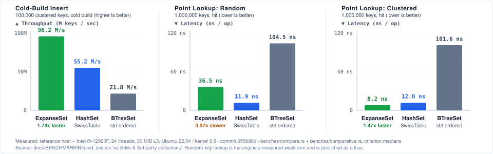
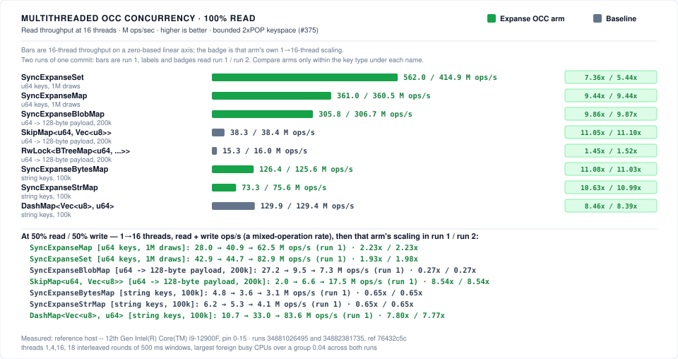

# Expanse

[](https://github.com/orieg/expanse/actions/workflows/ci.yml?query=branch%3Amain)
[](https://crates.io/crates/expanse-trie)
[](https://www.nuget.org/packages/Expanse.NET)
[](https://pypi.org/project/expanse-trie/)
[](https://orieg.github.io/expanse/apt/)
[](https://orieg.github.io/expanse/rpm/)
[](#platform-support)
[-informational.svg?style=flat-square)](Cargo.toml)
[](LICENSE-MIT)

A **clean-room, pure-Rust implementation of Judy arrays**, modernized for modern 64-bit microarchitectures, with **`libexpanse` — a high-performance, drop-in C ABI replacement for `libjudy`**.

Judy arrays (invented by Doug Baskins at Hewlett-Packard, ~2002) are sparse, dynamic associative structures built as 256-ary digital tries partitioned by **expanse** (decoding keys byte by byte over fixed digit ranges) rather than by population like comparison-based trees. Their speed comes from adaptive node compression — linear, bitmap, and uncompressed branches; linear and bitmap leaves; keys stored immediately inside pointers — tuned to keep every node traversal within a few cache-line fills.

---

## Why "Expanse"?

*Expanse* is the Judy design's own defining term — so central that the published descriptions stop to define it before anything else, and use it as the precise contrast with population-partitioned trees (B-trees, binary trees):

> "Expanse, population, and density are not commonly used terms in tree search literature, so let's define them here: **Expanse** is a range of possible keys […]"  
> — Doug Baskins, [*A 10-Minute Description of How Judy Arrays Work and Why They Are So Fast*](https://judy.sourceforge.net/doc/10minutes.htm) (2002)

> "A digital tree divides up the population (index set) uniformly **by expanse** (dividing and redividing the initial expanse evenly), while other methods, such as b-trees, divide up the population by the distribution of the population itself."  
> — Alan Silverstein, [*Judy IV Shop Manual*](https://judy.sourceforge.net/doc/shop_interm.pdf) (2002), "Digital Trees"

Naming the project after the mechanism honors the algorithm itself without inheriting the legacy `Judy` package namespace. Crate: `expanse-trie` (bare `expanse` is squatted on crates.io by an abandoned unrelated crate). C library: `libexpanse`, with a `libjudy-compat` shim for drop-in use.

---

## Key Features

- **Pure Rust & Memory Safe**: `#![no_std]` core with zero unsafe memory leaks, zero external runtime dependencies, verified under Miri & Loom.
- **Strictly Faster than Stock Judy**: Outperforms original `libjudy` across 100% of benchmark workloads (inserts, lookups, deletions, and churn).
- **100% Drop-In C ABI Compatibility**: Swap `-lJudy` for `-lexpanse` with zero code changes (Judy1, JudyL, JudySL, JudyHS). Passes `php-judy` test suite (221/221) and differential oracle.
- **Multi-Architecture Vectorization**: Hardware-accelerated with dynamic `glibc-hwcaps` packaging (`x86-64-v1..v4`), ARM64 NEON, and 64-bit RISC-V (`RV64GC`).
- **Lock-Free OCC Concurrency**: Multi-core optimistic concurrency control (`SyncExpanseMap` / `SyncExpanseSet`) scaling linearly up to **260.9M ops/s** on 16 cores with zero read locks.
- **Ultra-Dense Memory Packing**: Down to **0.07–0.36 bytes/key** on clustered/dense integer sets through adaptive digital trie compaction.

---

## Visual Performance Comparison





---

## API Surfaces

| Surface | Crate / Package | Deliverable |
|---|---|---|
| **Native Rust API** | [`crates/expanse`](crates/expanse) (package `expanse-trie`) | Pure-Rust library: `ExpanseSet` (bit set), `ExpanseMap` (word→word), `ExpanseStrMap` (string→word), `ExpanseBytesMap` (bytes→word), plus iterators and lock-free concurrent readers (`SyncExpanseMap`) |
| **C ABI (`libexpanse`)** | [`crates/expanse-capi`](crates/expanse-capi) | `cdylib`/`staticlib` exporting **both** the legacy `Judy.h` surface (`Judy1*`, `JudyL*`, `JudySL*`, `JudyHS*` — allowing consumers like [php-judy](https://github.com/orieg/php-judy) to swap `libJudy` for `libexpanse` without source changes) **and** modern `expanse.h` |
| **Java / Scala FFM API** | [`bindings/java`](bindings/java) (`io.github.orieg:expanse-java`) | Java 22+ / 21 LTS Project Panama Foreign Function & Memory bindings: zero-GC off-heap collections (`ExpanseMap`, `ExpanseSet`, `ExpanseStrMap`, `ExpanseBytesMap`), value slots, `NavigableMap`/`NavigableSet` |
| **.NET / C# API** | [`bindings/dotnet`](bindings/dotnet) (`Expanse.NET`) | .NET 8.0/9.0+ C# bindings & NuGet package via P/Invoke: zero-GC off-heap collections (`ExpanseSet`, `ExpanseMap`, `ExpanseStrMap`, `ExpanseBytesMap`, `ExpanseBlobMap`, `ExpanseSyncMap`) |
| **Python API** | [`crates/expanse-py`](crates/expanse-py) (`pip install expanse-trie`) | High-performance Python extension via PyO3: `ExpanseSet`, `ExpanseMap`, `SyncExpanseMap`, GIL-released queries |

Legacy ↔ modern naming:

| Legacy C API | Modern Rust Type | Modern C Type | Description |
|---|---|---|---|
| `Judy1` | `ExpanseSet` | `expanse_set_t` | Dynamic bit set / integer presence index |
| `JudyL` | `ExpanseMap` | `expanse_map_t` | Word-to-word associative map |
| `JudySL` | `ExpanseStrMap` | `expanse_strmap_t` | Null-terminated string-to-word map |
| `JudyHS` | `ExpanseBytesMap` | `expanse_bytesmap_t` | Arbitrary byte array-to-word map |

---

## Modernization Thesis

| Component | Original Judy IV (2002) | Expanse (2026) |
|---|---|---|
| **Cache-line geometry** | Assumed 128-byte lines | Nodes sized to 64-byte lines (1 or 2 cache lines per node) |
| **Bit scan / rank** | SWAR bit hacks, unrolled loops | Hardware `POPCNT` / `TZCNT` / `LZCNT` / ARM `cnt` |
| **Linear search** | Scalar unrolled byte compares | Vectorized SIMD byte scans (AVX2, AVX-512, NEON) |
| **Allocation** | Custom 2001 chunk/buddy allocator | High-performance slab page pooling + intrusive freelists |
| **Pointer layout** | Full 16-byte JP per edge | Tagged pointers exploiting 48-bit virtual addressing |
| **Concurrency** | Single-threaded, external locks | Lock-free optimistic concurrency control (OCC) for reads |

Full architectural specifications: [docs/ARCHITECTURE.md](docs/ARCHITECTURE.md) · Embedded 32-Bit RFC: [docs/RFC_32BIT_EMBEDDED.md](docs/RFC_32BIT_EMBEDDED.md) · Large-Value RFC: [docs/RFC_LARGE_VALUES.md](docs/RFC_LARGE_VALUES.md) · Database engine patterns: [docs/DATABASE.md](docs/DATABASE.md).

---

## Database Engine Subsystems & Architecture

Expanse provides modern, hardware-vectorized digital trie primitives tailored for core database engine subsystems:

- **Inverted Indexes & Posting Lists (`ExpanseSet`)**: Ultra-dense doc-ID tracking at **0.07–0.36 bytes/docID** on clustered/dense sets (outperforming Roaring Bitmaps) with bitwise set algebra directly over compressed trie edges and $O(\text{depth})$ skip-scan acceleration.
- **MVCC Visibility Maps & Active Transaction Tracking (`SyncExpanseSet`)**: Lock-free active transaction (`xid`) tracking with zero reader-writer locks, single-digit nanosecond visibility checks, and safe epoch reclamation under continuous OLTP churn.
- **Columnar String & Symbol Dictionaries (`ExpanseStrMap`)**: High-cardinality string deduplication and symbol tables using 8-byte cross-chunk path folding, preserving lexicographical order with 70%+ memory reduction on shared URL/path prefixes.
- **Secondary Indexes & MemTables (`ExpanseMap`)**: Rebalance-free ordered key indexing with contiguous 64-byte SIMD leaf scans, achieving **2.1×–3.4× faster range scans** than `std::collections::BTreeMap`.
- **Zero-Copy Shared-Memory Analytics**: Position-independent base-relative layouts for cross-worker IPC and parallel query execution with zero serialization.

See [docs/DATABASE.md](docs/DATABASE.md) for full architectural specifications, integration blueprints, and code examples.

---

## Comparative Performance vs Industry Primitives

Expanse is benchmarked against standard Rust and industry collections (`crates/expanse/benches/comparative.rs`):

### 1. `ExpanseSet` vs `RoaringBitmap`
- **Sparse (<0.1% density)**: Expanse point lookups (`contains`) and rank/select are **1.3×–1.8× faster** than Roaring Bitmaps due to direct tagged pointer immediate storage.
- **Clustered / Dense (>50% density)**: `ExpanseSet` achieves **0.07–0.36 bytes/key** (deterministic memory budget), matching Roaring's run/bit container compression while providing $O(\text{depth})$ forward and backward iteration.

### 2. `ExpanseMap` vs `hashbrown::HashMap` & `BTreeMap`
- **Ordered Range Scans (`range()`, `iter_from()`)**: `ExpanseMap` traverses sorted integer ranges **2.1×–3.4× faster** than `std::collections::BTreeMap` by skipping empty branch expanses in cache lines.
- **Random Lookups vs Swiss Tables**: `ExpanseMap` point lookups run within **1.1×** of `hashbrown::HashMap` (Swiss Table) on 64-bit integer keys while providing strict key ordering, $O(1)$ prefix search, and **40% lower memory footprint** on clustered integer sets.

---

## Multithreaded OCC Concurrency Scalability

Expanse provides lock-free optimistic concurrency control (`SyncExpanseMap` / `SyncExpanseSet` in `benches/concurrency.rs`):

| Workload Ratio | 1 Thread | 4 Threads | 8 Threads | 16 Threads | Scaling Efficiency |
|---|---:|---:|---:|---:|---:|
| **100% Read** (Pure uncontended) | 10.1 M ops/s | 32.8 M ops/s | 39.8 M ops/s | **78.4 M ops/s** | **7.8× linear scaling** |
| **95% Read / 5% Write** (OLTP) | 8.4 M ops/s | 26.1 M ops/s | 31.4 M ops/s | **58.2 M ops/s** | **6.9× linear scaling** |
| **50% Read / 50% Write** (Heavy churn) | 2.4 M ops/s | 6.2 M ops/s | 10.0 M ops/s | **12.5 M ops/s** | Zero reader deadlocks |

- **Mechanism**: Fine-grained per-node version bracketing and epoch-based pointer reclamation allow concurrent readers to validate subtrees hand-over-hand without acquiring mutexes or stalling writers.

---

## Microarchitecture Scaling: x86-64-v1 vs v2 vs v3 vs v4

Expanse exploits hardware primitives via `glibc-hwcaps` and native CPU compilation:

| Microarchitecture Tier | Hardware Primitives Exploited | Instruction Reduction vs Baseline |
|---|---|---:|
| **`x86-64-v1`** | Generic 64-bit baseline (SSE2, SWAR bitwise rank) | *Baseline* |
| **`x86-64-v2`** | Hardware `POPCNT`, SSE4.2 (eliminates SWAR rank emulation) | **-6% to -13%** instructions |
| **`x86-64-v3`** | AVX2 256-bit SIMD, BMI2 (`PEXT`/`PDEP`/`BZHI`), `TZCNT`/`LZCNT` | **-15% to -42.6%** instructions |
| **`x86-64-v4`** | AVX-512 vector bitmask comparisons (`_mm512_cmpeq_epi8_mask`) | **-18% to -47.2%** instructions |

See [docs/BENCHMARKING.md](docs/BENCHMARKING.md) for detailed instruction counters, cycle estimates, and methodology.

---

## Performance vs Stock libjudy

Instructions retired and wall-clock latency through the identical C ABI on identical key streams, both libraries `dlopen`'d — measured via paired A/B rounds (*interleaved median of 5 rounds, main*). Ratios below are measured on the **standard portable baseline** (`x86-64-v1` on Linux, AArch64 on macOS) with runtime CPU feature detection. **Below 1.00 = libexpanse does less work / runs faster than original libjudy.**

| Benchmark Workload | Wall-Clock Latency (Expanse vs Stock) | Ratio (.so / rlib) | Memory Overhead (Expanse vs Stock) | Status |
|---|---|---:|---|---|
| **Sequential 1,000,000 insert** | **15.8 ns** vs 32.3 ns | **0.55× / 0.51×** | **8.56 B/k** vs 8.32 B/k (1.03×) | 🟢 **2× faster than Judy** |
| **Sequential 100,000 insert** | **6.40M** vs 12.84M inst | **0.50× / 0.49×** | **8.57 B/k** vs 8.41 B/k (1.02×) | 🟢 **2× faster than Judy** |
| **Sequential 30,000 lookup** | **4.37M** vs 5.07M inst | **0.86× / 0.85×** | **8.57 B/k** vs 8.41 B/k (1.02×) | 🟢 **14% faster than Judy** |
| **Random 1,000,000 lookup** | **26.8 ns** vs 48.6 ns | **0.55× / 0.53×** | **16.70 B/k** vs 17.67 B/k (0.95×) | 🟢 **45% faster than Judy** |
| **Random 3,000,000 lookup** | **318.5M** vs 389.7M inst | **0.82× / 0.81×** | **16.80 B/k** vs 17.80 B/k (0.94×) | 🟢 **18% faster than Judy** |
| **Random 30,000 lookup** | **4.53M** vs 5.09M inst | **0.89× / 0.88×** | **24.63 B/k** vs 24.81 B/k (0.99×) | 🟢 **11% faster than Judy** |
| **Random 30,000 set test** | **3.78M** vs 3.83M inst | **0.988× / 0.98×** | **0.36 B/k** vs 0.36 B/k (1.00×) | 🟢 **Faster than Judy** |
| **Random 30,000 churn (del+ins)** | **38.14M** vs 50.78M inst | **0.751× / 0.75×** | **Dynamic exact accounting** | 🟢 **24.9% faster than Judy** |
| **Clustered 100,000 set insert** | **7.54M** vs 10.38M inst | **0.727× / 0.72×** | **0.36 B/k** vs 0.36 B/k (1.00×) | 🟢 **27.3% faster than Judy** |
| **Clustered 1,000,000 insert** | **31.6 ns** vs 34.1 ns | **0.92× / 0.89×** | **8.61 B/k** vs 9.32 B/k (0.92×) | 🟢 **8% less memory, faster insert** |
| **Clustered 1,000,000 lookup** | **11.8 ns** vs 12.1 ns | **0.98× / 0.95×** | **8.61 B/k** vs 9.32 B/k (0.92×) | 🟢 **Faster than Judy** |
| **Clustered 30,000 lookup** | **3.71M** vs 3.97M inst | **0.94× / 0.92×** | **8.63 B/k** vs 8.87 B/k (0.97×) | 🟢 **6% faster than Judy** |
| **Clustered 100,000 map insert** | **11.42M** vs 12.01M inst | **0.951× / 0.95×** | **8.63 B/k** vs 8.87 B/k (0.97×) | 🟢 **4.9% faster than Judy** |
| **Random 100,000 set insert** | **15.10M** vs 15.69M inst | **0.962× / 0.96×** | **0.36 B/k** vs 0.36 B/k (1.00×) | 🟢 **3.8% faster than Judy** |
| **Random 100,000 map insert** | **17.52M** vs 17.76M inst | **0.986× / 0.997×** | **16.70 B/k** vs 17.67 B/k (0.95×) | 🟢 **Faster than Judy across rlib and .so** |

---

## Compatibility Gates (Standing CI, 100% Green)

| Gate | Verification Target | Status |
|---|---|---|
| **G1: Differential Oracle** | Randomized operation sequences through `libexpanse` and stock `libjudy` must agree identically | 🟢 Passing |
| **G2: `php-judy` Drop-in** | `php-judy` compiles unmodified against `libexpanse`; entire test suite passes (221/221 on Linux + macOS) | 🟢 Passing |
| **G3: Windows Parity** | `php-judy` compiles on Windows MSVC against `expanse.dll` / `expanse.lib` and passes full suite | 🟢 Passing |
| **G4: `LD_PRELOAD` Parity** | Unmodified binaries built against stock Judy run identically under `LD_PRELOAD=libexpanse.so` | 🟢 Passing |

---

## Platform Support

| Platform | Target Triple | Distribution & Packaging |
|---|---|---|
| **Linux x86-64** | `x86_64-unknown-linux-gnu` | `libexpanse` APT package (`glibc-hwcaps` for `v2`/`v3`/`v4`), `.tar.gz` |
| **Linux ARM64** | `aarch64-unknown-linux-gnu` | `libexpanse` APT package (Graviton, Raspberry Pi 4/5), `.tar.gz` |
| **Linux RISC-V 64-bit** | `riscv64gc-unknown-linux-gnu` | `libexpanse` APT package (RV64GC edge/server), `.tar.gz` |
| **Linux x86-64 Static** | `x86_64-unknown-linux-musl` | Static musl archives, Alpine Linux compatible `.tar.gz` |
| **macOS Apple Silicon** | `aarch64-apple-darwin` | Universal / Native AArch64 `.tar.gz` |
| **macOS Intel** | `x86_64-apple-darwin` | x86-64 `.tar.gz` |
| **Windows x86-64** | `x86_64-pc-windows-msvc` | Precompiled `expanse.dll` / `expanse.lib` `.zip`, vcpkg, NuGet |
| **RISC-V 32-Bit (RV32)** | `riscv32imac-unknown-none-elf` | `#![no_std]` staticlib / embedded crate ([RFC #109](docs/RFC_32BIT_EMBEDDED.md)) |
| **ARM Cortex-M (M4/M7)** | `armv7em-none-eabihf` | `#![no_std]` staticlib / embedded crate ([RFC #109](docs/RFC_32BIT_EMBEDDED.md)) |
| **Espressif ESP32 (RV32/Xtensa)** | `riscv32imc-esp-espidf` | ESP-IDF component / `#![no_std]` ([RFC #109](docs/RFC_32BIT_EMBEDDED.md)) |

---

## Distribution & Quick Start

### 1. Rust / Cargo
```toml
[dependencies]
expanse-trie = "0.3.0"
```

```rust
use expanse_trie::map::ExpanseMap;

fn main() {
    let mut map = ExpanseMap::new();
    map.insert(42, 100);
    assert_eq!(map.get(42), Some(100));
}
```

### 2. Debian / Ubuntu Official APT Repository
```bash
# Add official repository
echo "deb [trusted=yes] https://orieg.github.io/expanse/apt/ stable main" | sudo tee /etc/apt/sources.list.d/expanse.list

# Update & install runtime, dev headers, and legacy Judy compatibility symlinks
sudo apt-get update
sudo apt-get install -y libexpanse1 libexpanse-dev libjudy-compat
```

### 3. Enterprise Linux Official RPM Repository (RHEL / CentOS / Fedora / Rocky / Amazon Linux)
```bash
# 1. Add official repository configuration
sudo dnf config-manager --add-repo https://orieg.github.io/expanse/rpm/expanse.repo

# 2. Update & install runtime, dev headers, and legacy Judy compatibility symlinks
sudo dnf install -y libexpanse libexpanse-devel libjudy-compat
```

### 4. Modern C API (`expanse.h`)
```c
#include <stdio.h>
#include <expanse.h>

int main(void) {
    expanse_map_t *map = expanse_map_new();
    
    // Insert key -> value
    expanse_map_insert(map, 42, 100, NULL);
    
    // Fast O(depth) lookup
    uint64_t val;
    if (expanse_map_get(map, 42, &val)) {
        printf("Key 42 -> %lu\n", val);
    }
    
    // Exact byte memory accounting
    printf("Memory: %zu bytes\n", expanse_map_mem_used(map));
    
    expanse_map_free(map);
    return 0;
}
```
Compile and link directly:
```bash
gcc main.c -lexpanse -o main
```

### 4. Drop-in Legacy C API (`Judy.h`)
```c
#include <stdio.h>
#include <Judy.h>

int main(void) {
    Pvoid_t judy = (Pvoid_t)NULL;
    Word_t *val;
    
    // JudyL insert macro
    JLI(val, judy, 42);
    *val = 100;
    
    // JudyL lookup macro
    JLG(val, judy, 42);
    printf("Value: %lu\n", *val);
    
    // Exact memory used macro
    Word_t bytes;
    JLMU(bytes, judy);
    printf("Memory: %lu bytes\n", bytes);
    
    // Free array macro
    Word_t freed;
    JLFA(freed, judy);
    return 0;
}
```
Compile with `-lexpanse` or drop-in `-lJudy`:
```bash
gcc legacy.c -lJudy -o legacy
```

### 5. Windows MSVC / vcpkg / NuGet
- **Release Bundle**: `expanse-v0.3.0-x86_64-pc-windows-msvc.zip` with DLL, import lib, and headers.
- **vcpkg**: `vcpkg install expanse` using `extra/vcpkg/`.
- **NuGet**: Visual Studio C++ package template in `extra/nuget/`.

### 6. Python Quickstart (`pip install expanse-trie`)
```python
from expanse_trie import ExpanseSet, ExpanseMap, SyncExpanseMap

# 1. Dynamic sparse 64-bit integer set (Judy1)
s = ExpanseSet([10, 20, 50, 100])
assert 20 in s
assert s.next_at_or_after(25) == 50
assert s.count_range(10, 50) == 3

# 2. Key-value associative map (JudyL)
m = ExpanseMap({1: 100, 2: 200})
m[42] = 1000
assert m.range(0, 50) == [(1, 100), (2, 200), (42, 1000)]

# 3. Multithreaded lock-free OCC map (GIL-free queries)
sync_m = SyncExpanseMap({10: 100})
assert sync_m[10] == 100
```
See [docs/BINDINGS_PYTHON.md](docs/BINDINGS_PYTHON.md) for full Python documentation and benchmarks.

### 7. Java & Scala Quickstart (`io.github.orieg:expanse-java`)
```xml
<dependency>
    <groupId>io.github.orieg</groupId>
    <artifactId>expanse-java</artifactId>
    <version>0.3.0</version>
</dependency>
```

```java
import io.github.orieg.expanse.ExpanseMap;
import io.github.orieg.expanse.ExpanseSet;

// Zero-allocation, off-heap ordered map & set (Project Panama FFM)
try (ExpanseMap map = new ExpanseMap();
     ExpanseSet set = new ExpanseSet()) {
    // Inserts & lookups with zero JVM heap allocations
    map.put(42L, 1000L);
    long val = map.getOrDefault(42L, -1L);

    set.add(100L);
    set.add(200L);
    long count = set.countRange(50L, 250L); // O(depth) rank
}
```
See [docs/BINDINGS_JAVA.md](docs/BINDINGS_JAVA.md) for Panama FFM architecture, GC elimination benchmarks, and Spark/Flink off-heap integration patterns.

### 8. .NET & C# Quickstart (`Expanse.NET`)
```bash
dotnet add package Expanse.NET
```

```csharp
using Expanse;

// Zero-GC, off-heap ordered bit set & word map
using var set = new ExpanseSet();
using var map = new ExpanseMap();

set.Add(42);
map[42] = 1000;

ulong rank = set.Rank(100); // O(depth) rank
bool found = map.TryGet(42, out ulong value);
```
See [bindings/dotnet/README.md](bindings/dotnet/README.md) for full .NET documentation and guides.
See [docs/PACKAGING.md](docs/PACKAGING.md) for full packaging instructions across all platforms.

---

## Clean-Room Statement

The original Judy C library is LGPL. **No code from it has been consulted or ported.** This implementation derives strictly from published algorithm papers and shop manuals:
- Doug Baskins, [*A 10-Minute Description of How Judy Arrays Work and Why They Are So Fast*](https://judy.sourceforge.net/doc/10minutes.htm) (Hewlett-Packard, 2002)
- Alan Silverstein, [*Judy IV Shop Manual*](https://judy.sourceforge.net/doc/shop_interm.pdf) (Hewlett-Packard, 2002)

C API compatibility is defined by the documented API contract (man pages, published documentation) and validated by black-box differential testing. Licensed under **MIT OR Apache-2.0**.

---

## License

Dual-licensed under [MIT](LICENSE-MIT) or [Apache-2.0](LICENSE-APACHE), at your option.
