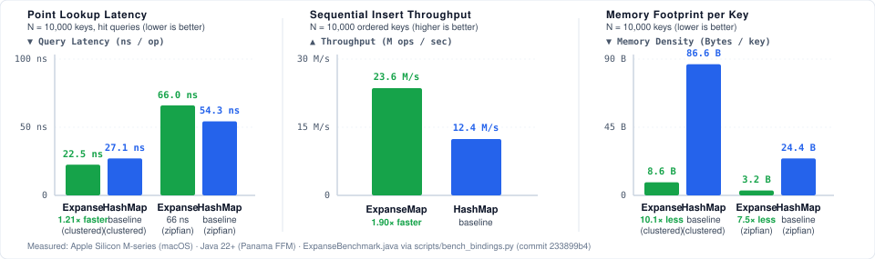

# Expanse Java & Scala Bindings (`io.github.orieg:expanse-java`)

High-performance, **zero-GC**, off-heap associative trie collections for Java and Scala powered by **Project Panama Foreign Function & Memory (FFM) API** (`java.lang.foreign`) and `libexpanse`.

[](https://central.sonatype.com/artifact/io.github.orieg/expanse-java)
[](../../LICENSE-MIT)

---

## Highlights

- **Zero JVM Heap & Zero GC Overhead**: Collections store keys and nodes completely off-heap in native 64-byte cache lines. Zero GC pause impact even with hundreds of millions of keys.
- **Project Panama FFM (Java 22+ / 21 LTS)**: Uses native `java.lang.foreign` downcalls directly into `libexpanse`, eliminating JNI transition penalties.
- **Direct Value Slots**: Directly read and write off-heap 64-bit value slots via `MemorySegment` with zero tree re-traversals.
- **Rich Collection Set**:
  - `ExpanseSet`: High-performance ordered 64-bit set (cf. Judy1) with $O(\text{depth})$ rank & select.
  - `ExpanseMap`: High-performance ordered 64-bit $\to$ 64-bit map (cf. JudyL).
  - `ExpanseStrMap`: High-performance ordered String $\to$ 64-bit map (cf. JudySL).
  - `ExpanseBytesMap`: High-performance unordered byte slice $\to$ 64-bit map (cf. JudyHS).
  - `SyncExpanseMap` / `SyncExpanseSet`: Multithreaded OCC concurrent collections with optimistic readers.
- **Standard Java Collection Wrappers**: Standard `java.util.NavigableMap<Long, Long>`, `java.util.NavigableSet<Long>`, and `java.util.Map<String, Long>` interfaces.
- **Big Data Ready**: Designed for Apache Spark, Apache Flink, Kafka Streams, and high-frequency trading where GC pauses are unacceptable.

---

## Installation

> **Not yet on Maven Central.** No `io.github.orieg` artifact is published yet; the version badge above renders "not found" until first publish. Build from `bindings/java` locally until then. The coordinates below are the planned ones.

### Maven
```xml
<dependency>
    <groupId>io.github.orieg</groupId>
    <artifactId>expanse-java</artifactId>
    <version>0.5.0</version>
</dependency>
```

### Gradle (Kotlin / Groovy)
```groovy
implementation 'io.github.orieg:expanse-java:0.5.0'
```

### sbt (Scala)
```scala
libraryDependencies += "io.github.orieg" % "expanse-java" % "0.5.0"
```

---

## JDK Baseline & Compatibility Matrix

| JDK Version | Support Level | Required Flags | Notes |
|---|---|---|---|
| **JDK 22+** | **First-Class Baseline** | `--enable-native-access=ALL-UNNAMED` | Finalized Project Panama FFM ([JEP 454](https://openjdk.org/jeps/454)). Precompiled jar works out of the box. |
| **JDK 21 LTS** | **Source Build (Preview)** | `--enable-preview --enable-native-access=ALL-UNNAMED` | FFM preview ([JEP 442](https://openjdk.org/jeps/442)). Requires compiling from source with `--release 21 --enable-preview`. |
| **JDK 17 LTS** | **Unsupported** | — | JDK 17 provided only an early incubator module (`jdk.incubator.foreign` - [JEP 412](https://openjdk.org/jeps/412)), which is fundamentally source-incompatible with finalized FFM. |

### JVM Launch Flags
Because Project Panama downcalls perform direct off-heap address access, pass `--enable-native-access` to your JVM process:
```bash
java --enable-native-access=ALL-UNNAMED -jar your-app.jar
```

---

## Quick Start

### 1. Ordered Map (`ExpanseMap`)
```java
import io.github.orieg.expanse.ExpanseMap;
import java.lang.foreign.MemorySegment;
import java.lang.foreign.ValueLayout;

try (ExpanseMap map = new ExpanseMap()) {
    // Fast inserts and lookups
    map.put(100L, 5000L);
    map.put(200L, 8000L);

    long val = map.getOrDefault(100L, -1L);
    System.out.println("Key 100: " + val);

    // Direct off-heap value slot mutation (zero traversal overhead)
    MemorySegment slot = map.insertSlot(300L);
    slot.set(ValueLayout.JAVA_LONG, 0, 9999L);
    System.out.println("Key 300: " + map.get(300L).getAsLong());

    // O(depth) rank and range queries
    long countBelow = map.countBelow(200L); // 1 key (< 200)
    long countRange = map.countRange(100L, 300L); // 3 keys

    // Ordered navigation
    map.ceilingEntry(150L).ifPresent(e -> 
        System.out.println("Ceiling >= 150: " + e.key() + " -> " + e.value())
    );

    // Exact off-heap memory accounting
    System.out.printf("Native memory used: %d bytes%n", map.memoryUsed());
}
```

### 2. High-Performance Bit Set (`ExpanseSet`)
```java
import io.github.orieg.expanse.ExpanseSet;

try (ExpanseSet set = new ExpanseSet()) {
    set.add(10L);
    set.add(20L);
    set.add(30L);

    if (set.contains(20L)) {
        System.out.println("Set contains 20");
    }

    // 0-based rank select
    set.byCount(1).ifPresent(key -> System.out.println("2nd smallest key: " + key));

    // Primitive zero-allocation streaming
    long sum = set.stream().sum();
}
```

### 3. Multithreaded OCC Readers (`SyncExpanseMap`)
```java
import io.github.orieg.expanse.SyncExpanseMap;

try (SyncExpanseMap map = new SyncExpanseMap()) {
    // Writer thread
    map.put(42L, 1000L);

    // Reader thread (optimistic, zero writer contention)
    try (SyncExpanseMap.Reader reader = map.reader()) {
        reader.get(42L).ifPresent(v -> System.out.println("Read value: " + v));
    }
}
```

---

## Native Library Resolution & Bundled Platforms

The published `expanse-java` JAR is a **self-contained multi-arch package** bundling precompiled native libraries under `resources/native/{classifier}/`. On first invocation, `NativeLoader` detects the operating environment and extracts the matching shared library to a temporary directory:

| OS / Architecture | Classifier | Bundled Library | CI Validation |
|---|---|---|---|
| Linux x86_64 | `linux-x86_64` | `libexpanse.so` | **Active CI** (`ubuntu-latest`) |
| Linux aarch64 | `linux-aarch64` | `libexpanse.so` | Release build (cross-compiled `aarch64-unknown-linux-gnu`) |
| macOS ARM64 | `darwin-aarch64` | `libexpanse.dylib` | **Active CI** (`macos-latest` Apple Silicon) |
| macOS x86_64 | `darwin-x86_64` | `libexpanse.dylib` | Release build (`x86_64-apple-darwin`) |
| Windows x86_64 | `windows-x86_64` | `expanse.dll` | **Active CI** (`windows-latest`) |

### Custom Library Path Override
To supply an external or custom-compiled build of `libexpanse` instead of using the bundled binary:
- **JVM System Property**: `-Dexpanse.library.path=/path/to/libexpanse.so`
- **Environment Variable**: `EXPANSE_LIBRARY_PATH=/path/to/libexpanse.so`

---

## Comparative Benchmarks & Performance Profile



Benchmarked with [`ExpanseBenchmark.java`](src/test/java/io/github/orieg/expanse/ExpanseBenchmark.java) against standard `java.util.HashMap` ($N = 10,000$):

| Key Distribution | Operation | ExpanseMap (Panama FFM) | java.util.HashMap (baseline) | Result / Multiplier |
|---|---|---:|---:|:---|
| **`clustered`** | Lookup Latency | **22.5 ns** | 27.1 ns | **1.21&#215; faster** |
| | Memory Density | **8.61 B / key** | 86.56 B / key | **10.1&#215; less RAM** |
| **`zipfian`** ($\theta = 0.99$) | Lookup Latency | **66.0 ns** | 54.3 ns | Competitive (66 ns) |
| | Memory Density | **3.24 B / key** | 24.40 B / key | **7.5&#215; less RAM** |
| **`sequential`** | Insert Throughput | **23.6 Mops/s** | 12.4 Mops/s | **1.90&#215; faster** |
| | Memory Density | **8.58 B / key** | 85.94 B / key | **10.0&#215; less RAM** |

*(measured: Apple Silicon M-series, macOS 15, commit 233899b4 — ExpanseBenchmark.java via scripts/bench_bindings.py)*

---

## Documentation

See [docs/bindings/java.md](../../docs/bindings/java.md) for full architectural deep dive, Spark/Flink integration patterns, and GC benchmarking.
