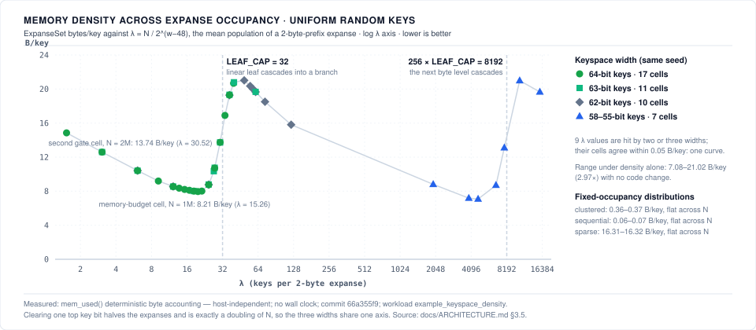

# Expanse Architecture

> Canonical design doc. Bit-level encoding reference: [§10](#10-bit-level-encoding-reference) · Release & Environments: [§11](#11-release-pipeline-repository-settings--key-maintenance) · Compat contract: [COMPAT.md](COMPAT.md) · Testing: [TESTING.md](TESTING.md) · Benchmarks: [BENCHMARKING.md](BENCHMARKING.md) · Database Engines: [DATABASE.md](DATABASE.md) · 32-Bit & Embedded: [design/32-bit-embedded.md](design/32-bit-embedded.md) · Large Values: [design/large-values.md](design/large-values.md)

Expanse is a clean-room reimplementation of the Judy array family (Judy1 bit set, JudyL word→word map, JudySL string→word map), redesigned for 2026 hardware and named for Judy's defining idea: partitioning keys by *expanse* rather than by population. Derived from published algorithm descriptions only; no libjudy source consulted (see COMPAT.md for the clean-room rules).

## 1. The structure in one page

The trie is 256-ary: each level decodes one byte ("digit") of a 64-bit key, most-significant byte first (level 8 → level 1). Every edge is an **`Edge`**, a 16-byte tagged descriptor saying what it points to. The original literature calls this a "Judy Pointer"/JP; Judy names are reserved for the `expanse-capi` compat layer, and core code and docs use `Edge`. Adaptive compression keeps memory near-proportional to population:

```
 Root ── (pop ≤ ROOT_LEAF_CAP) ──> root leaf: sorted full-width keys
      └─ (larger) ──> Tree { top: Edge } ──> level-8 branch
                      (population kept beside it in `tree_pop`)

 Branch flavors (by subexpanse density):
   LinearBranch   — few children: sorted digit array + Edge array
   BitmapBranch   — moderate: 256-bit membership bitmap + packed Edge arrays
   UncompBranch   — dense: flat array of 256 Edges

 Leaf flavors (by remaining key bytes and population):
   Immediate      — keys packed inside the 16-byte Edge itself
   LinearLeaf     — packed undecoded key remainders (1..7 bytes each)
   BitmapLeaf     — level 1, high pop: 256-bit mask over the last byte
```

Two further compressions: **narrow pointers** (an `Edge` records skipped common bytes in its decode field, collapsing single-child chains) and **full-expanse** tags (set flavor: a completely populated subexpanse needs no node at all).

## 2. What changes vs. Judy IV (2002)

| Component | Judy IV | Expanse | Why |
|---|---|---|---|
| Cache lines | 128-byte assumption | Fixed-size nodes 64-aligned: branches and bitmap leaves 64 B or 128 B (1–2 lines), `BranchU` 4,160 B (a version line + 256 edges); linear leaves and subarrays sized by capacity class, 16-aligned (`RAW_ALIGN`) | A fixed-size node other than `BranchU` is 1–2 line fills and never straddles a line; a linear leaf can |
| Bit scan/rank | SWAR + lookup tables | `u64::count_ones`/`trailing_zeros` | Single-cycle on AArch64 (`cnt`/`rbit`). On x86-64 runtime CPUID dispatch selects `popcnt` and BMI2 `pdep` on hot read paths, with a portable SWAR fallback on generic baseline builds; native instructions available through the `glibc-hwcaps` variants (`x86-64-v2`/`v3`/`v4`), which the released `.deb`/`.rpm` packages carry (#762) |
| Byte search | Unrolled scalar compares | SIMD splat-compare-movemask (128-bit SSE2/NEON via `core::arch`, 64-bit loads for 8-byte windows, portable fallback) | Up to 16 bytes per compare, no branchy loop |
| Allocator | Custom word-bucket chunk allocator | 62 size classes with $O(1)$ static `RAW_CLASS_TABLE` lookup and byte-exact accounting. Classes ≤ 256 B are carved from intrusive 4 KiB `SlabPage`s; larger nodes (a `BranchU`, big leaves) go to the system allocator, and a tree shared through a `Sync*` wrapper carves no slab pages at all (`alloc.rs` module docs, `NodeAlloc::defer_to`) | Within the slab classes, recycling is a freelist head swap with no size search or coalescing pass. Through the C ABI it retires 27% fewer instructions than stock libjudy on `judyl_churn/random` (37,620,794 vs 51,572,661; instructions retired, not wall clock; workload: `capi_vs_stock`) *(measured: CI `Perf / Callgrind Deterministic Instructions`, `x86-64-v1`, [run 36103996513](https://github.com/orieg/expanse/actions/runs/36103996513), commit `22baf854`)* |
| Edge representation | 16 B hybrid pointer stealing | Dual-word 16 B Edge: Word 0 holds raw unmasked 64-bit pointer / immediate; Word 1 holds aux + tag | Full 57-bit (PML5/LA57) & 52-bit (ARM64-LVA) virtual address safety with zero upper-bit pointer stealing |
| Concurrency | None (external mutex) | Per-node version counters, optimistic lock-coupling readers and writers (§4) | Readers take no lock on the common path; read scaling is measured per wrapper in [`benchmarks/concurrency/`](benchmarks/concurrency/README.md), not assumed |

> The 64-byte cache-line assumption behind the node layouts above is validated against primary sources in [`docs/HARDWARE.md` §1.4](HARDWARE.md#14-64-byte-cache-line--validated-correct-on-x86) (x86) and [§2.4](HARDWARE.md#24-64-byte-cache-line---portability--perf-risk-on-arm) (⚠️ ARM portability note: Apple Silicon uses 128-byte lines).

## 3. Core layouts

### 3.1 Edge (16 B)

```
offset 0: word 0     8 B   child node pointer, or immediate key payload
offset 8: aux        7 B   level-split: low L bytes pop0, high bytes decode
offset 15: tag       1 B   edge type tag
```

The 7-byte aux field is **level-split** (as in the published Judy IV
design): for a child at level `L`, its low `L` bytes hold `pop0` (a
level-`L` subtree holds at most `256^L` keys, so `L` bytes always suffice)
and the remaining high bytes hold the narrow-pointer decode bytes — the two
never overlap, and no branch header needs a wide population field.
Implemented in `crates/expanse/src/node.rs`.

Byte-exact field positions, per-tag word-0 contents, and why the pointer is stored unmasked are in [§10.1](#101-edge--the-16-byte-tagged-descriptor-64-bit-targets).

Tag encoding (implemented in `crates/expanse/src/types.rs`):

- Structural tags `0x00..=0x0C`, `0x7F`: null, 4 branch flavors, linear leaves for 1–7 remaining bytes, bitmap leaf, full expanse.
- Immediate tags, nibble-packed `(key_bytes << 4) | (count - 1)`, valid when `key_bytes * count <= 15`. Disjoint from structural tags by construction.

### 3.2 Branches

Linear branches share a 16-byte header:
```
offset 0: version     4 B (u32)    OCC seqlock version counter
offset 4: num         1 B (u8)     active child count
offset 5: level       1 B (u8)     node level (1..8)
offset 6: presence    2 B (u16)    16-bit bloom presence filter (bit 1 << (digit & 0x0F))
offset 8: digits      8 B ([u8;8]) sorted digit array searched as 64-bit word
```
Geometry note: the naive "8 B header + 4 edges" one-line branch is arithmetically impossible (8 + 4×16 = 72 > 64); capacity 3 with the 16-byte header is exact — and buys the OCC version and 16-bit presence filter slots.

- **BranchL3** (64 B = 1 line): 16 B header + 3 edges. The single-threaded lookup compares its three digits directly. Overflow → BranchL7.
- **BranchL7** (128 B = 2 lines): 16 B header + 7 edges. Overflow → BranchB.

Both linear forms keep the presence filter. `BranchHeader::find` rejects an absent digit on it before scanning the 8-byte digit array (`bits::find_byte_8`: scalar compares for up to 3 children, one SSE2/NEON 8-byte compare above that); the single-threaded lookup uses it for `BranchL7`, and the shared-tree walks (`BranchHeader::find_at`) for both forms.
- **BranchB** (128 B = 2 lines): line 0 = 256-bit bitmap (32 B) + first 4 of 8 subarray pointers; line 1 = remaining pointers + cached per-subexpanse pop counts (`[u16; 8]`, rank acceleration) + OCC version. Slot lookup = bitmap test + popcount rank. A BranchB holds up to 192 populated digits (`BITMAP_TO_UNCOMPRESSED_THRESHOLD`); the 193rd converts it to BranchU.
- **BranchU** (4 KiB + 1 line): a header line (OCC version; a `BranchU` never skips, so no level) + flat 256 edges, direct index. The diagnostic `ablation-branchu-header-count` feature (#1202) adds a child count to the header line, beside the version, kept only on shared trees: a branch built on a shared tree starts counted, one built before its tree was shared is counted under its lock the first time an optimistic removal meets it, and the plain walks never touch it. The default header carries only the version.

### 3.3 Leaves

- **Immediate**: up to 15 key-remainder bytes inside the edge (e.g. 15×1-byte, 7×2-byte, 2×7-byte). Map-flavor immediates keep keys in the 7 aux bytes: a single key's value lives in word 0, several keys point to a value array.
- **LinearLeaf1..7**: header-less variable-length allocations — population lives in the parent edge's `pop0`, so a leaf is nothing but payload (as in the original). Set flavor: `[keys: L×pop]`; map flavor: `[values: u64×cap][keys: L×cap]` in one allocation (values first = free 8-alignment). Both are sized by `cap_class(pop)`, not `pop`, and aligned to `RAW_ALIGN` = 16. Search (`leaf::search_fixed`, `leaf::lower_bound_fixed`) is per key width: a 128-bit SIMD compare or a 64-bit-load kernel at the populations whose capacity class covers the bytes that load reads, unrolled compares at `pop ≤ 4`, and binary search otherwise.
- **LeafBitmap1** (level 1, 64 B): 32-byte bitmask + OCC version (set flavor). **LeafBitmapL** (128 B): bitmask + 8 value-subarray pointers addressed by popcount rank + OCC version (map flavor).

The per-width immediate capacity tables, the bitmap rank/select addressing, and the `ValueSlot` encodings are in [§10.4](#104-immediate-capacity)–[§10.6](#106-bitmap-structures).

How much this ladder costs per key is not a function of population alone: for the `random` distribution it is a sawtooth in expanse occupancy, with its tooth set by `LEAF_CAP` — [§3.5](#35-per-key-memory-is-a-sawtooth-in-expanse-occupancy-and-leaf_cap-sets-the-tooth).

### 3.4 Tagged pointers (read-optimized paths) — *design note, not shipped*

> **Nothing in this subsection is implemented.** The shipped 64-bit `Edge` is the full 16-byte descriptor of §3.1, whose word 0 holds the raw untruncated pointer with zero bit-stealing ([§10.1](#why-word-0-is-stored-unmasked-gated)). Do not cite this subsection as a description of the current representation.

x86-64/AArch64/RISC-V 64-bit user VAs fit in 48 (or 57) bits; 8-byte alignment frees the low 3 bits. A compact 8-byte edge variant would pack `[type:16][address:45][level:3]` for read-dominated structures and for caching branch metadata without extra line fills. It would have to stay behind an abstraction that also supports full 16-byte edges (LAM/TBI/Sv57 and 57-bit VA systems change the free-bit budget — feature-detected, never assumed).

### 3.5 Per-key memory is a sawtooth in expanse occupancy, and `LEAF_CAP` sets the tooth

For a structure that partitions by key expanse, **keyspace width and population are one parameter.** Per-key cost is not a function of $N$; it is a function of how many keys share each expanse at the level where the ladder above does its packing. For uniform random keys the top two key bytes saturate once $N \gg 2^{16}$, so the controlling quantity is the occupancy of a 2-byte-prefix expanse:

```math
\lambda = \frac{N}{2^{16}} \text{ at 64 bits}, \qquad \frac{N}{2^{15}} \text{ at 63 bits}, \qquad \lambda = \frac{N}{2^{\,w-48}} \text{ for a } w\text{-bit uniform keyspace.}
```

Clearing one top key bit halves the number of expanses, which is arithmetically the same as doubling $N$. That follows from decoding a fixed 8-bit digit per level and does not depend on any constant below. The general form, which also covers non-uniform generators, is $`\lambda = N \,/\, (\text{populated 2-byte-prefix expanses})`$.

**Where the tooth comes from.** Below a 2-byte prefix a linear leaf holds the remaining six key bytes (`Leaf6`). A set-flavor leaf has no header (§3.3, `leaf.rs::size_set`), so a `Leaf6` holding $p$ keys costs exactly $`6 \cdot \text{cap\_class}(p)`$ bytes plus the one 16-byte edge in its parent — a little over 6 B/key once $p$ is in the tens. `LEAF_CAP = 32` (`types.rs`, [§10.8](#108-pinned-constants)) caps that leaf. The 33rd key cascades it into a branch whose children are the level-5 sub-expanses, and at these densities those hold one key each: an immediate edge per key at 16 bytes, plus the branch. A cascaded expanse costs roughly 17–21 B/key where the packed leaf cost 6–8 B/key.

Occupancy across expanses is Poisson-distributed with mean $\lambda$ and $\sigma = \sqrt{\lambda}$, so the cascade turns on over an interval rather than at a step. The model is committed as `scripts/density_poisson.py` (pinned tests): $P(X > 32 \mid \lambda = 15.26) = 0.0001$, $P(X > 32 \mid 30.52) = 0.3503$ with $0.4182$ of the *keys* in cascaded expanses, and the cascade is 10% on at $\lambda = 25.9$ and 90% on at $\lambda = 40.5$. The engine's own node census agrees with it: at $N = 2 \times 10^6$ @64 the walk counts **22,970** level-6 branches out of 65,536 expanses (35.05%) against the model's 22,945 at the cell's exact $\lambda = 30.5176$ (35.01%; 22,955 with the share rounded to 0.3503), a residual of +25 expanses or +0.11%; at $N = 10^6$ it counts 7 against a predicted 3.6 *(measured: `ExpanseSet::stats()` on the same build, `branch_depth_histogram[6]`; workload: `example_keyspace_density`; `docs/assets/data/bench_assets.json` → `density_sweep.census`, commit 66a355f9)*. The measured 13.74 B/key at 2M is that mixture, and the census attributes it by node form: 18.67 MB of the 27.47 MB (68.0%) sits in the 22,970 cascaded bitmap branches and their 780,905 single-key immediate edges, 7.73 MB (28.2%) in the 42,639 packed linear leaves that hold the rest (42,566 `Leaf6`, 73 at level 5), and 1.07 MB in the 257 uncompressed branches of levels 8 and 7. Past the cascade the cost falls again as the cascaded branches' own children fill — and one byte level down the same tooth repeats at $\lambda \approx 256 \cdot$ `LEAF_CAP`, measured below.

**Measured.** Same `ExpanseSet`, same PRNG and seed, keyspace narrowed by masking the top key bits. The keyspace columns collapse onto one curve when indexed by $\lambda$ *(measured: `mem_used()` deterministic byte accounting, host-independent; `crates/expanse/examples/keyspace_density.rs` at commit `66a355f9`, which reproduces every cell of `docs/assets/data/bench_assets.json` → `density_sweep`; workload: `example_keyspace_density`. The HOT-suite probe sweep this table began from, [`docs/benchmarks/hot_comparison/METHODOLOGY.md` §9.4](benchmarks/hot_comparison/METHODOLOGY.md), predates #826's capacity-class ladder and is not comparable cell for cell)*:

| $\lambda$ | $`\lambda / \text{LEAF\_CAP}`$ | `ExpanseSet` B/key | cells ($N$ @ keyspace bits) |
|---:|---:|---|---|
| 1.53 | 5% | 14.85 | 100k @64 |
| 3.05 | 10% | 12.59 · 12.60 | 200k @64 · 100k @63 |
| 6.10 | 19% | 10.41 · 10.41 · 10.42 | 400k @64 · 200k @63 · 100k @62 |
| 9.16 | 29% | 9.19 | 600k @64 |
| 12.21 | 38% | 8.54 · 8.55 · 8.56 | 800k @64 · 400k @63 · 200k @62 |
| 13.73 | 43% | 8.35 | 900k @64 |
| 15.26 | 48% | **8.21** | 1M @64 — the committed `bytes/key` cell and the `memory-budget` calibration point |
| 16.78 | 52% | 8.10 | 1.1M @64 |
| 18.31 | 57% | 8.01 · 8.01 | 1.2M @64 · 600k @63 |
| 19.84 | 62% | **7.96** | 1.3M @64 — the trough |
| 21.36 | 67% | 8.01 | 1.4M @64 |
| 24.41 | 76% | 8.75 · 8.79 · 8.77 | 1.6M @64 · 800k @63 · 400k @62 |
| 27.00 | 84% | 10.35 | 884,736 @63 (exact λ) |
| 27.47 | 86% | 10.72 · 10.75 | 1.8M @64 · 900k @63 — the knee |
| 30.52 | 95% | 13.74 · 13.74 | 2M @64 · 1M @63 — the `memory-budget` gate's second `random` cell, in the cascade's mixture regime |
| 33.57 | 105% | 16.90 | 2.2M @64 |
| 36.62 | 114% | 19.29 · 19.33 · 19.28 | 2.4M @64 · 1.2M @63 · 600k @62 |
| 39.67 | 124% | 20.68 | 2.6M @64 |
| 40.00 | 125% | 20.80 | 1,310,720 @63 (exact λ) |
| 48.83 | 153% | 21.02 | 800k @62 — the peak |
| 54.93 | 172% | 20.35 | 900k @62 |
| 58.00 | 181% | 20.00 | 950,272 @62 (exact λ) |
| 61.04 | 191% | 19.67 · 19.66 | 2M @63 · 1M @62 |
| 73.24 | 229% | 18.51 | 1.2M @62 |
| 122.07 | 381% | 15.81 | 2M @62 |
| 1,953 | 61× | 8.81 | 2M @58 — every level-6 expanse is a `BranchU` over packed `Leaf5` leaves |
| 3,906 | 122× | 7.18 | 2M @57 |
| 4,688 | 146× | **7.08** | 1.2M @56 — the second trough, below the first |
| 6,641 | 208× | 8.70 | 1.7M @56 — the second knee: 10% of level-5 sub-expanses cascaded |
| 7,812 | 244× | 13.11 | 2M @56 — the second tooth: 34.9% of level-5 sub-expanses cascaded |
| 10,547 | 330× | 20.99 | 2.7M @56 — 91.7% cascaded; the second peak |
| 15,625 | 488× | 19.66 | 2M @55 — every level-5 sub-expanse cascaded; the λ = 61.04 figure, one level down |



*(derived from `docs/assets/data/bench_assets.json` → `density_sweep` by `scripts/generate_asset_svgs.py`; the block is written by `EXPANSE_COMMIT=<sha> cargo run --release -p expanse-trie --example keyspace_density -- --json <path>` and merged into that file, and `tests/test_visualizer_sync.rs` recomputes the 64-bit column and three cross-width pairs from the engine so it cannot drift. The same curve, measured against HOT's flat one, is the HOT suite's [memory chart](benchmarks/hot_comparison/results/chart_memory_curve.svg).)*

Cells that share a $\lambda$ agree to within 0.05 B/key although they differ in $N$ by up to 4×: one curve, sampled three times. Under density alone, with no code change, the same structure spans **7.08–21.02 B/key**. The first trough is at $\lambda = 19.8$ ($0.62 \cdot$ `LEAF_CAP`), the knee at $\lambda \approx 27$ and the peak at $\lambda = 48.8$, so the curve is flat to within 0.3 B/key from $\lambda = 15$ to $21$ and climbs 13 B/key between $\lambda = 21$ and $49$. The cells are not seed artifacts: re-drawing the 1M @64, 2M @64 and 800k @62 cells under a second XorShift64 seed moves them by 0.00, −0.03 and −0.02 B/key (set) and 0.00, −0.01, −0.01 (map) *(measured: same instrument; `density_sweep.seed_sensitivity`)*.

**The second tooth.** Below a cascaded 2-byte expanse the level-5 sub-expanses hold $\lambda / 256$ keys each, in `Leaf5` leaves under the same cap, so the cascade repeats when $\lambda / 256$ approaches `LEAF_CAP`. The four 2M cells at 58–55 bits sit at sub-expanse occupancies of 7.6, 15.3, 30.5 and 61.0 — the same four occupancies as the first tooth's λ = 6.10, 15.26, 30.52 and 61.04 cells — and they reproduce its shape: 8.81, 7.18, 13.11 and 19.66 B/key against 10.41, 8.21, 13.74 and 19.66 one level up (workload: `example_keyspace_density`). The 56-bit ladder locates the second trough at $\lambda = 4{,}688$ (7.08 B/key, sub-expanse occupancy 18.3 — the first trough's 19.8, one level down) and the second peak at $\lambda = 10{,}547$ (20.99), with the ramp 8.70 → 13.11 between $\lambda = 6{,}641$ and $7{,}812$, where the Poisson model puts this tooth's 10% point at 6,627 and its 90% point at 10,379. The census says why the second trough is lower and the second peak is identical: at $\lambda = 4{,}688$ each level-6 expanse is one 4,160-byte `BranchU` amortised over thousands of keys and its children are `Leaf5` leaves at 5 bytes per key rather than 6; at $\lambda = 15{,}625$ every one of the 32,768 sub-expanses has cascaded into a bitmap branch of single-key immediates, which is exactly the level-6 structure at $\lambda = 61$ *(measured: `density_sweep.census`, cells 2M @58…55 and 1.2M–2.7M @56; `branch_depth_histogram[5]` = 0, 4, 22,894 and 32,768 at the 2M cells; `branch_depth_histogram[6]` = 1,024, 512, 256 and 128, every one a `BranchU`)*. At the 2M @56 cell 22,894 of the 65,536 sub-expanses have cascaded, 34.9%, against the 35.0% the Poisson model gives for an occupancy of 30.52 — the first tooth's 2M @64 fraction, reproduced one level down. `BranchU` nodes appear at level 6 in all seven second-tooth cells, because a cascaded expanse with more than `BITMAP_TO_UNCOMPRESSED_THRESHOLD` = 192 populated sub-expanses converts; at the first-tooth cells the only uncompressed branches are the 257 (64-bit) or 64 (62-bit) of levels 8 and 7.

**Causal test.** At `86daaddf`, before #826 changed the capacity-class ladder, changing `LEAF_CAP` alone from 32 to 48, everything else identical, moved the $\lambda = 30.52$ cells from 13.60 to 6.99–7.00 B/key and left the $\lambda = 15.26$ cell at 7.92 (same instrument and workload; METHODOLOGY §9.4). Extended across the sweep, the tooth moves with the constant rather than flattening: under cap 48 the trough is 6.99 B/key at $\lambda = 30.5$ (a floor flat to 0.1 B/key from $\lambda = 27$ to $34$), the ramp runs 8.38 → 14.45 → 18.78 across $\lambda = 40$, $48.8$ and $58$ (the model's 10% and 90% points for a cap of 48 are $\lambda = 40.3$ and $58.2$) and the peak is 19.12 at $\lambda = 61$; the second tooth moves the same way, 5.99 at $\lambda = 7{,}812$ and 19.06 at $15{,}625$ *(measured: same instrument at `86daaddf`, build-time patch of `types.rs`; `density_sweep.leaf_cap_48_control`; full table in [`docs/benchmarks/hot_comparison/METHODOLOGY.md` §9.10](benchmarks/hot_comparison/METHODOLOGY.md))*. The tooth is the cascade, and the cascade is this constant. That is **not** a recommendation to raise it. What the constant costs the read path was measured at the committed 1M @64 cell, where neither cap is reached and the two builds hold the same structure: the Callgrind `set_contains` arm retires an identical 6,139,088 instructions under both caps, and on the reference host the two builds' `contains` latencies agree within their intervals (METHODOLOGY §9.10). The write path is not free of it: the Callgrind insert arms retire 7.2–7.8% more instructions under cap 48 at a population where no leaf ever holds 33 keys, so the constant sizes something on the mutation path whose cost is paid below the cap — cause unmeasured. The read-path cost *in the cascaded regime*, where a linear leaf of up to 48 keys replaces a bitmap-branch descent to single-key immediates, is measured at $\lambda = 30.52$ (1,000,000 keys at 63 bits — the structure the 13.60 → 6.99 B/key cells describe, 35% of expanses cascaded under cap 32 and 0.1% under cap 48): the Callgrind `contains` and `get` arms retire 17.0–19.2% more instructions under cap 48, 171.71 → 200.95 Ir per hit probe and 168.69 → 200.09 per miss on the set, 176.84 → 207.94 and 172.02 → 205.08 on the map (workload: `core_leaf_cap_cascaded_instructions`) *(measured: x86_64 dev host — Intel Xeon E5-2697 v4, Callgrind in a `rust:1.98` container, commit c81eaf5d; [`docs/benchmarks/hot_comparison/results/leaf_cap_cascaded_callgrind.json`](benchmarks/hot_comparison/results/leaf_cap_cascaded_callgrind.json), table in METHODOLOGY §9.10.5)*. So the trade the constant sets is a measured pair rather than an argument: at this λ cap 48 halves the set's bytes per key and costs a sixth more instructions per lookup (workloads differ: `example_keyspace_density` vs `core_leaf_cap_cascaded_instructions`). Ir is the cost column, not the verdict ([`docs/BENCHMARKING.md`](BENCHMARKING.md) rule 16); the wall clock agrees: on the reference host, interleaved A/B/A/B with a same-build repeat that reproduced to within 0.5%, cap 48 runs the four arms at 0.82–0.86× the speed of cap 32 (set hit 0.8496× [0.8467, 0.8538], map miss 0.8243× [0.8232, 0.8253]; workload: `core_leaf_cap_cascaded_wallclock`) *(measured: hybrid desktop, Intel Core i9-12900F, P-core pinned, commit fa1704d4; `docs/benchmarks/hot_comparison/results/leaf_cap_cascaded_contains_cap{32,48}_{a,repeat,b}.json`, table in METHODOLOGY §9.10.5)*. At this λ the structure fits the host's L3 under either cap, so the trade is instructions for bytes with no memory-traffic offset; `LEAF_CAP` stays 32 by that pair, which rules on nothing beyond this λ and the read path.

**Which published anchors move.** Derivable from the generators in `crates/expanse/examples/bytes_per_key.rs`, and checked across a 20× range of $N$ (METHODOLOGY §9.5):

| Distribution | Generator | Occupancy per 2-byte expanse | Moves with $N$? |
|---|---|---|---|
| `sequential` | `i` | contiguous, fully packed | no |
| `clustered` (256- and 4096-key runs) | `base + (i % run)` | fixed by the run length | no |
| `sparse` | `i << 40` | exactly 256 — the top two bytes are `i >> 8` | no — permanently past the cascade at 8× `LEAF_CAP`, which is why it sits flat near 16.3 B/key at every $N$: one 16-byte edge per key. That is the saturated regime of this curve, not a floor of the structure |
| `random` | full-width draw | $\lambda = N / 2^{16}$ | **yes** — the only committed distribution that does |

**What this obliges.** A per-key memory figure on `random` keys — or on any workload whose occupancy is not fixed by construction — is under-specified without its $\lambda$. Two cells at different $\lambda$ are two points on this curve, not a before/after: a keyspace restriction, a population change and a change to `LEAF_CAP` all move the same number. Every published `bytes/key` cell states its $\lambda$ ([`BENCHMARKING.md`](BENCHMARKING.md) rule 17), and the `memory-budget` gate records the density it was calibrated at (`examples/bytes_per_key.rs`).

### 3.6 Low-cardinality key bytes: leaf layout evaluation (#1257) — *evaluation, no layout change shipped*

> **Status.** Nothing here changes the default layout. The section records the evaluation [#1257](https://github.com/orieg/expanse/issues/1257) asks for: what the current layout costs, the byte model for each candidate, two measured checks of that model, and the gate a candidate must pass. Time costs are **unmeasured** for every candidate; the plan below is the pre-registration for measuring them.

**The case.** Keys whose byte at a trie level takes few of its 256 values fill leaves poorly. #1257's example is 10⁷ sorted keys `t%03d:orders:%010d` in an `ExpanseStrMap` with 8-byte values. Its last word-map chunk is six decimal digits and two NUL bytes, so every range below one hundreds digit holds 100 keys whose two top remainder bytes each take 10 values. 100 exceeds `LEAF_CAP` = 32, so the range cascades into a `BranchB` whose ten children are 10-key `Leaf3` leaves in the 12-slot capacity class. One such range costs 128 B (branch) + 192 B (a 12-edge subarray) + 10 × 144 B (`size_map(3, 10)` = 132, rounded to 16) = **1,760 B, 17.60 B/key**. On current `main` the case is unchanged from 0.8.2: `mem_used()` = 179,699,624 B, **17.97 B/key**, and the census attributes 176,000,000 B (97.9%) to exactly 100,000 such ranges *(measured: `mem_used()` and `layout_census()`, deterministic byte accounting, host-independent; engine at c5a6f6886; workload: `example_leaf_layout_census`; [`results/leaf_layout_census_c5a6f688.json`](../results/leaf_layout_census_c5a6f688.json) record `strmap/orders_10000000`)*. The remaining 3,699,624 B are 11,011 upper-level `BranchB` nodes of 320 B, 1,001 `BranchL3`, 1,000 one-entry root leaves, 100 `Leaf5` leaves and 2,001 node shells of 40 B.

**Instruments.** Two, and the second is only as good as its agreement with the first.

- **`layout_census()`** (feature `layout-census`, diagnostic, compiled out by default) on `ExpanseMap`, `ExpanseSet` and `ExpanseStrMap` decomposes `mem_used()` into allocation *shapes*: linear leaves by (slot level, key bytes, population) — the joint histogram of [#1256](https://github.com/orieg/expanse/issues/1256), whose row sums are pinned equal to `stats().leaf_depth_histogram` — subarrays by entry count, branch forms, and for a string map the node shells and suffix leaves ([#1255](https://github.com/orieg/expanse/issues/1255)). Its byte total is pinned equal to `mem_used()` on every shape and flavor (`census::tests`; deleting the subarray byte term from the walk turns both sum tests red). Given a merge rule (at most `max_keys` keys, at most `max_digits` values of the decoded byte), it also reports every **topmost** branch the rule would keep as one leaf, with its key count, the number of distinct values at each remainder byte, and the bytes of the subtree it would replace. `examples/leaf_layout_census.rs` writes it as JSON. It is also reachable on `SyncExpanseMap`, `SyncExpanseSet` and `SyncExpanseStrMap`, as a `layout_census` method taken with writers excluded (as `with_locked` reads). There the string map counts strings from the walk, because an optimistic writer can leave a population field stale. `census::tests` pin it after multi-threaded inserts through each wrapper, and after a random half of a loaded tree is removed.
- **`scripts/leaf_layout_model.py`** (pinned tests, `--self-test`) mirrors every engine size function and re-prices a census under each option. Under the current layout it reproduces `mem_used()` exactly for every record, which it checks on load. An option's figure is therefore the same tree with only the named allocations re-priced.

**Two checks of the model against engines.** Both builds reproduced the model's figure **to the byte on every record they share**. What each check can and cannot catch differs:

1. **Pricing consistency, class-10 ladder.** Built as the diagnostic `ablation-leaf-class-10` feature (`cap_class` gains a class at 10 slots): 14 of 14 records, all shapes and flavors *(measured: [`results/leaf_layout_census_c5a6f688_class10.json`](../results/leaf_layout_census_c5a6f688_class10.json); `leaf_layout_model.py <census> --check <totals> class_10 128 16`)*. The ladder changes no node form, so the tree shape is identical by construction. The match proves the model applies the class at every site the engine does (linear and root leaves, subarrays, immediate and bitmap-leaf value arrays). It cannot catch a shape error, a transient peak, or allocator overhead beyond `mem_used()` ([#1095](https://github.com/orieg/expanse/issues/1095) records how RSS departs from it).
2. **Merge projection, where the key bound alone decides.** Built with the build-time patch [`results/leaf_layout_census_c5a6f688_cap128.patch`](../results/leaf_layout_census_c5a6f688_cap128.patch) (`LEAF_CAP = 128`), on the 10 records where every range of at most 128 keys has at most 10 (or 16) values of its split byte. There a uniform cap builds the same tree as the adaptive rule, and all 10 match *(measured: [`results/leaf_layout_census_c5a6f688_cap128.json`](../results/leaf_layout_census_c5a6f688_cap128.json))*. This validates the priced leaf, the narrow leaf's key width, and topmost selection by key count. Two of the 10 (`sequential`) do not change at all, and `uuid_hex` moves by 1,104 B. The **digit bound was never the deciding clause** on any checked record. `adversarial`, the one shape where it decides, is excluded, because there the uniform patch also merges the 17-value ranges. The rule's behaviour with qualifying and non-qualifying siblings side by side is therefore unvalidated, and every figure that depends on the digit bound is a projection.

The grouped and product forms are priced by the same census but built by no engine, so their figures are projections.

**Options.** Bytes per key, `map` and `strmap` with 8-byte values, `set` with none. Merge options use the rule (at most 128 keys, at most 16 values of the split byte). The random rows sit at a single $\lambda = 15.26$ (§3.5), in the sawtooth's trough, and move with $\lambda$. Legend:

- **Measured:** current, class 10, and leaf cap on the rows check 2 covers (the three `orders` rows and both `decimal8` rows).
- **Projected** by the model from the same census: every other cell.
- Percentages are the share of entries inside merged ranges. String-map entries are chunk entries.
- Engine at c5a6f6886; workload: `example_leaf_layout_census`.

| engine / shape | keys | current | exact classes | even classes | class 10 | leaf cap (adaptive) | grouped leaf | product leaf |
|---|---:|---:|---:|---:|---:|---:|---:|---:|
| strmap `orders` (#1257) | 10⁷ | **17.97** | 14.41 | 14.41 | **14.41** | **12.37** | 11.73 | 8.85 |
| strmap `orders` | 10⁶ | 18.10 | 14.55 | 14.55 | 14.55 | 12.49 | 11.85 | 8.97 |
| strmap `orders_sparse` (random 10-digit ids) | 10⁶ | 38.41 | 36.79 | 37.28 | 37.63 | 34.45 (95%) | 33.71 (95%) | 38.39 (0%) |
| strmap `uuid_hex` (random, 16 values per byte) | 10⁶ | 60.02 | 58.08 | 59.46 | 59.81 | 60.02 (0%) | 60.02 (0%) | 60.02 |
| map `decimal8` (ASCII `%08d` words) | 10⁶ | 14.76 | 12.80 | 12.80 | 12.80 | 10.44 | 9.64 | 8.84 |
| set `decimal8` | 10⁶ | 3.56 | 3.20 | 3.20 | 3.20 | 2.44 | 1.64 | 0.84 |
| map `decimal8_sparse` | 994,982 | 17.17 | 14.96 | 15.63 | 15.99 | 12.55 | 11.84 | 17.17 (0%) |
| map `random` | 10⁶ | 17.58 | 15.53 | 17.22 | 17.42 | 17.58 (0%) | 17.58 (0%) | 17.58 |
| set `random` | 10⁶ | 8.21 | 7.53 | 8.13 | 8.13 | 8.21 (0%) | 8.21 (0%) | 8.21 |
| map `sequential` | 10⁶ | 8.56 | 8.56 | 8.56 | 8.56 | 8.56 | 8.56 | 8.56 |
| map `adversarial` (projected) | 10⁶ | 18.51 | 18.26 | 18.51 | 18.51 | 14.88 (50%) | 14.76 (50%) | 13.63 (50%) |
| set `adversarial` (projected) | 10⁶ | 6.63 | 6.38 | 6.63 | 6.63 | 5.01 (50%) | 4.88 (50%) | 3.76 (50%) |

**Real sorted keys (SOSD).** The four SOSD `u64` datasets were each inserted whole and in order, as map (value = index) and set. Every census summed to `mem_used()` and prices to it in the model. The data is SOSD's `fb`, `wiki_ts`, `books` and `osm_cellids` (200M keys each, 90,437,011 distinct in `wiki_ts`), from the Harvard Dataverse deposit `doi:10.7910/DVN/JGVF9A`. The SHA-256 of each `.zst` is recorded in the artifact's commit message. Merge options use the same rule as above. *(measured: current; projected: every other column; engine sources of c5a6f6886, built with this change's census tooling; workload: `example_leaf_layout_census`; [`results/leaf_layout_census_sosd.json.gz`](../results/leaf_layout_census_sosd.json.gz))*

| engine / dataset | keys | current | exact classes | even classes | class 10 | leaf cap | grouped leaf | product leaf |
|---|---:|---:|---:|---:|---:|---:|---:|---:|
| map `fb` | 200M | 15.25 | 13.61 | 14.42 | 15.02 | 15.24 (0%) | 15.24 (0%) | 15.25 (0%) |
| set `fb` | 200M | 6.86 | 6.01 | 6.58 | 6.77 | 6.85 (0%) | 6.85 (0%) | 6.86 (0%) |
| map `wiki_ts` | 90.4M | 9.98 | 9.14 | 9.85 | 9.93 | 9.98 (0%) | 9.98 (0%) | 9.98 |
| map `books` | 200M | 21.33 | 18.75 | 19.92 | 20.91 | 21.33 (0%) | 21.33 (0%) | 21.33 |
| set `books` | 200M | 15.85 | 13.75 | 14.62 | 15.46 | 15.85 (0%) | 15.85 (0%) | 15.85 |
| map `osm_cellids` | 200M | 19.79 | 17.79 | 18.95 | 19.56 | 19.78 (0%) | 19.78 (0%) | 19.79 |
| set `osm_cellids` | 200M | 11.98 | 10.73 | 11.50 | 11.82 | 11.97 (0%) | 11.97 (0%) | 11.98 |

**What the real keys say.**

- **Merge options.** On all four datasets they touch well under 1% of entries. Low-cardinality ranges of the #1257 kind do not occur in them. The merge options are a remedy for keys built from small alphabets, such as decimal or hex text and composite string keys, not for real numeric keys.
- **Ladder options.** These help on every dataset:
  - class 10 saves 0.5–2.5% (map `books` 21.33 → 20.91);
  - even classes save 1.3–7.8% (map `fb` 15.25 → 14.42, set `books` 15.85 → 14.62);
  - exact classes, the lower bound, save 8.4–13.2%.
- **A range can grow.** On map `osm_cellids`, four merged ranges would grow by 16–32 B each under the leaf cap. They are ranges of 33–37 keys whose split byte takes 2–7 values, where a small branch over narrower leaves beats one leaf with an extra key byte. A merge rule that admits by digit count alone is therefore not monotone in bytes. An implementation would also need a byte test, or would accept these losses.

**Downstream string shapes (the #1257 follow-up).** Two string shapes, each 10⁷ keys, in an `ExpanseStrMap` with 8-byte values:

- **`orders`** is #1257's `t%03d:orders:%010d`.
- **`composite`** is `prefix(5 B) ‖ name ‖ '/' ‖ id(10 B)`, where:
  - the prefix and id use a 7-bit big-endian encoding offset by +1, so every byte is in `0x01..=0x80` and byte order is numeric order;
  - names match `[A-Za-z0-9_]{1,32}`.

  The distribution is this harness's choice: 100 prefixes × 100 seeded names × 1,000 sequential ids per name.

Each shape is loaded sorted and shuffled (a Fisher–Yates permutation). From the sorted load, a seeded random half is then removed (`churned`), and a fresh sorted build of the same survivors is kept beside it (`survivors`).

The report sets a need of **≤ 13.2 B/key** on these shapes. It is derived from a resident-bytes ratio against a compressed LSM baseline; it is arithmetic, not a measurement of any layout. *(measured: current, class 10 and leaf cap; projected: every other cell; engine sources of c5a6f6886, built with this change's census tooling; workload: `example_leaf_layout_census`; [`results/leaf_layout_census_downstream.json`](../results/leaf_layout_census_downstream.json), totals under both builds in `results/leaf_layout_census_downstream_{class10,cap128}.json`, model output in [`results/leaf_layout_model_downstream.txt`](../results/leaf_layout_model_downstream.txt))*

| strmap shape (10⁷ loaded) | current | exact classes | even classes | class 10 | leaf cap | grouped leaf | product leaf |
|---|---:|---:|---:|---:|---:|---:|---:|
| `orders`, sorted or shuffled | 17.97 | 14.41 | 14.41 | **14.41** | **12.37** (128 keys, 10 digits) | 11.73 | 8.85 |
| `orders`, random half removed | 22.58 | 19.19 | 20.35 | **21.80** | **13.10** | 12.68 | 9.94 |
| `orders`, survivors built fresh | 22.43 | 19.05 | 20.21 | **21.66** | **13.10** | 12.68 | 9.94 |
| `composite`, sorted or shuffled | 18.36 | 18.19 | 18.32 | **18.33** | **14.78** (128 keys, 128 digits) | 15.64 | 12.24 |
| `composite`, random half removed | 22.58 | 19.75 | 22.13 | **22.53** | **16.33** | 17.14 | 13.77 |
| `composite`, survivors built fresh | 22.58 | 19.75 | 22.13 | **22.53** | **16.33** | 17.14 | 13.77 |

The class-10 and leaf-cap columns (bold) were built and matched the model to the byte on all 16 records. That includes the removal phase, so what a removal phase leaves behind under the leaf cap is **measured, not assumed**. On `composite` the cap-128 build is exactly the (128 keys, 128 digits) rule, because 7-bit bytes take at most 128 values.

What the table shows:

- **Load order does not change memory.** Sorted and shuffled loads give identical `mem_used()` on both shapes, under every build.
- **A removal phase leaves little behind.**
  - Under the current layout a removed half leaves 0.14 B/key (0.6%) more than a fresh build of the survivors on `orders`, and nothing on `composite`.
  - Under the leaf cap it leaves nothing on either. Merged leaves shrink in place; they are not stranded as branches.
  - This does not cover removal patterns that empty whole ranges and then refill them. That is the churn stress shape of step 1.
- **`composite` is not a low-cardinality case of the #1257 kind.**
  - 16.05 of its 18.36 B/key are bitmap branches whose children are single-key immediates (9,202,000 of the 10⁷ keys), one 16-byte edge per key. This is the cascaded regime of §3.5, caused by a dense 7-bit id byte (128 values) rather than by random density.
  - The ladder options cannot reach that cost (−0.2% at best), and a 16-digit merge rule excludes it by design.
  - A leaf-cap rule admitting up to 128 values (measured, 14.78) and the product leaf (projected, 12.24) do reach it. The grouped leaf is worse than the leaf cap here, because its directory costs 2 × 128 + 1 bytes per range.
  - The 23% of entries left unmerged sit in ranges of about 1,000 ids over an 8 × 128 product space. Only a product leaf with a larger key bound reaches them; that is unexplored.
- **Against the ≤ 13.2 B/key need:**

  | option | `orders` loaded | `orders` after removal | `composite` loaded | `composite` after removal |
  |---|---|---|---|---|
  | leaf cap (measured) | 12.37, meets it | 13.10, meets it narrowly | 14.78, misses | 16.33, misses |
  | product leaf (projected) | 8.85, meets it | 9.94, meets it | 12.24, meets it | 13.77, misses |
  | ladder options | miss | miss | miss | miss |

  The 128-digit rule needed for `composite` is a dense-range rule, not a low-cardinality one. Its lookup cost is the cascaded-regime trade §3.5 measured for `LEAF_CAP = 48` (+17–19% Ir per lookup), at a larger leaf.

**The bar and the acceptance conditions, as the report states them.**

- **The ≤ 13.2 B/key need is a load-time bar**, taken after a bulk load. The post-removal figures above are reported, not gated on. A candidate that meets the bar at load and degrades gracefully after removals is acceptable to the report.
- **A product-space leaf is acceptable to the report** only if all of these hold. They are added to that option's clauses below:
  - lookup-neutral against current `main` under W3: hit and miss, sorted and shuffled loads;
  - ordered iteration, successor/predecessor and prefix/range scans keep their semantics and order;
  - bounded insert cost, with no whole-leaf rebuild on the common append-at-end path;
  - `Edge` stays 16 B and `ValueSlot` one machine word;
  - descent stays $O(k)$ over key bytes.

**A skewed `composite` distribution (assumed).** The report has no production traffic, so both distributions are assumptions. The skewed one:

- 100 prefixes, each with its own 5–20 names of 4–20 bytes (1,158 names in all);
- sequential ids per name, sized by a power law over name rank, $`\min(10^6, \lfloor A\, r^{-1.4} \rfloor)`$, with $A$ chosen so the sizes sum to 10⁷ and ranks assigned to names by a seeded shuffle;
- that gives a median of 696 ids per name, 61% of names under 1,000, and 16 names at 10⁵ or more, 3 of them at the 10⁶ cap (derived by replaying the generator's PRNG).

On the report's 7-bit ids it behaves as the uniform case does *(measured, same instrument and workload; [`results/leaf_layout_census_downstream.json`](../results/leaf_layout_census_downstream.json))*:

- Current layout: 18.48 B/key, identical for sorted and shuffled loads; 22.29 after removal against 22.28 for the survivors built fresh.
- Class 10: 18.48.
- Leaf cap at 128 digits: 14.90 at load and 16.04 after removal.
- Product leaf: 12.43 at load, projected.

**Choosing the id encoding (the report's question).** The report controls the id encoding and would rather change it than depend on a new leaf form. The census compares five order-preserving, NUL-free encodings. Each writes the id at a fixed width as big-endian digits, one per byte, with byte = base + digit. It covers both distributions, 10⁷ keys, sorted, same prefixes and names *(measured: current, class 10, and leaf cap on every encoding whose bytes take at most 128 values; projected: product leaf; engine sources of c5a6f6886, built with this change's census tooling; workload: `example_leaf_layout_census`; [`results/leaf_layout_census_encodings.json`](../results/leaf_layout_census_encodings.json), totals in `results/leaf_layout_census_encodings_{class10,cap128}.json`, model output in [`results/leaf_layout_model_encodings.txt`](../results/leaf_layout_model_encodings.txt))*:

| id encoding | values per byte | bytes | uniform: current | uniform: leaf cap | skewed: current | skewed: leaf cap |
|---|---:|---:|---:|---:|---:|---:|
| `enc7x10` (the report's) | 128 | 10 | 18.36 | 14.78 | 18.48 | 14.90 |
| `b255x3` | 255 | 3 | 17.92 | 17.91 | 17.75 | 17.73 |
| `b16x5` | 16 | 5 | 17.58 | 17.60 | 16.87 | 16.87 |
| `b32x4` | 32 | 4 | 15.87 | 15.86 | 14.94 | 14.94 |
| **`b32x4a7`**: base 32, width per name so the key is 7 (mod 8) bytes | 32 | ≥ 4 | **10.88** | 10.87 | **10.70** | 10.70 |

(`b255x3` under the cap-128 build is not the 128-digit rule, since its bytes take up to 255 values.)

- **Answer: base-32 digits, with the id width chosen per name so the whole key is 7 (mod 8) bytes long.** That encoding meets the ≤ 13.2 B/key bar on the **current layout**: 10.88 B/key uniform and 10.70 skewed, with no engine change. Class 10 and the leaf cap add nothing to it (10.88 and 10.87). What is left is close to the layout's floor: 8 B of value, about 2 B of key, and under 1 B of branches and shells.
- **Why it works — two effects, both measured by the census:**
  - **The low byte's alphabet decides whether a range fits a leaf.** A range whose last id byte takes 32 values holds at most 32 keys, which fills one linear leaf at `LEAF_CAP` = 32. At 128 values (`enc7x10`) or 255 (`b255x3`), the range cascades into a branch of single-key 16-byte edges. At 16 values (`b16x5`), two digits of 256 keys fall into more, smaller leaves under more branches.
  - **Where the id's last byte lands in the string map's final 8-byte chunk decides the key width of those leaves.** The final chunk ends in the terminating NUL, so its data bytes sit at word levels 2 and up. When the key is 7 (mod 8) bytes long, the id's low byte sits at level 2, and each leaf key costs 2 bytes beside its 8-byte value. At other lengths the leaf keys are wider. When the key is 0 (mod 8) bytes long, every string ends in a separate suffix leaf. When it is 1 (mod 8), the last byte sits alone in its chunk, where 32 values cascade into single-key edges. Unaligned `b32x4` pays both costs on the names whose length puts it there: 15.87 against 10.88.
- **Conditions and caveats:**
  - The width is fixed per name, so ids stay order-preserving within a name, and the leading zero digits it adds are shared by every id of the name.
  - The width has to be chosen for the largest id a name will ever hold. At the minimum of 4 digits that is 32⁴ = 1,048,576; a name that outgrows its width has to be re-encoded.
  - **The alignment is a published contract.** `strmap::CHUNK_BYTES` (8) is public. An encoder derives its alignment from it: key length ≡ `CHUNK_BYTES - 1` (mod `CHUNK_BYTES`). Changing the value is a breaking change, so an encoder that derives from it sees the change at compile time. `census::tests::chunk_bytes_alignment_contract` pins the effect on the engine: 1,024 aligned keys with a 32-valued last byte fill exactly 32 two-byte-key leaves. `leaf_layout_census.rs` derives the alignment from the same constant.

**Full-width ids, and `orders` transcoded (the report's second follow-up).** Both use base-32 digits `0x01..=0x20` with the 7 (mod 8) whole-key alignment, and both are in `leaf_layout_census.rs --encodings`, which re-runs them on any release.

- **`b32full`** is for ids that are full `u64`, so no width can be outgrown. The prefix is 7 digits (31 bits), and the id is at least 13 digits (32¹³ > 2⁶⁴), widened per name to the alignment, so 13–20 digits.
- **`orders_b32a7`** keeps the `orders` key structure and rewrites each fixed-width decimal field in base 32: `%03d` → 2 digits, and `%010d` → 7 digits (32⁷ = 2³⁵), padded to 12 for the alignment.

Figures are at 10⁷ keys *(measured on all three builds; engine at 45eb0f6ac, whose engine sources are those of c5a6f6886; workload: `example_leaf_layout_census`; [`results/leaf_layout_census_encodings.json`](../results/leaf_layout_census_encodings.json) and its `_class10` / `_cap128` totals)*:

| B/key, 10⁷, sorted = shuffled | current | class 10 | leaf cap |
|---|---:|---:|---:|
| `composite` uniform, `b32x4a7` | 10.88 | 10.88 | 10.87 |
| `composite` uniform, **`b32full`** | **10.93** | 10.93 | 10.93 |
| `composite` skewed, `b32x4a7` | 10.70 | 10.70 | 10.70 |
| `composite` skewed, **`b32full`** | **10.71** | 10.71 | 10.71 |
| `orders`, text (#1257) | 17.97 | 14.41 | 12.37 |
| `orders`, **`orders_b32a7`** | **10.71** | 10.70 | 10.71 |

- **The constant high digits cost almost nothing per key; what they add is a per-name cost at the level of the 8-byte chunk.**
  - Full-width ids cost +0.046 B/key over 4-digit ids on the uniform shape and +0.008 on the skewed one. Leaves and branches are unchanged (10.00 and 0.72 B/key).
  - The difference is string-map nodes. The longer constant prefix spans one more 8-byte chunk, which adds a node per name: 28,001 → 36,701 nodes on the uniform shape, about 53 B each (a 40-byte shell and a small root leaf).
  - That cost is per name, not per key. It is negligible at hundreds of ids per name, but approaches 53 B/key for names holding a single id.
- **Transcoded `orders` meets the ≤ 13.2 B/key bar on the current layout:** 10.71 B/key against 17.97, with no engine change. That is 10.00 B/key of leaves (8 B value + 2 B key), 0.70 of branches and under 0.02 of everything else. Neither class 10 nor the leaf cap adds anything once the keys are transcoded.
- **What this says about a key codec inside the engine.** It is an upper bound only: the census measures what the transcoded bytes cost, not what a codec would cost. A codec that stored `orders` this way would have to do three things:
  - decode on every read that returns a key;
  - keep JudySL's byte order, which a fixed-width field allows and a variable-width decimal run does not without a length prefix;
  - pay its encode and decode cost on every operation, which is unmeasured.
  It is a different trade from a leaf form, and the census cannot price it.
- **Model check.** Class 10 matches the engine to the byte on all 28 records of this run. The leaf-cap projection matches on 14 of the 24 records the 128-digit rule applies to; the 4 base-255 records are outside it. The residuals are the eight composite cells above, now on shuffled loads too and identical to the sorted ones, plus +528 B on both `orders_b32a7` loads. They are unexplained and pinned exactly in the model's self-test.

**Mixed ranges: transcoded `orders` with escaped text keys.** A codec needs an escape form for keys that do not match a range's template. The census models it as follows:

- A seeded random fraction of ids stays as text `orders` keys.
- The rest are transcoded behind a leading `0x01` marker, which sorts every encoded key below every text key. With the marker, the id pads to 11 base-32 digits for the alignment.
- Each cell is censused as one map and as each part alone.

*(measured: `mem_used()`, current layout, 10⁷ keys, sorted; engine sources of c5a6f6886; workload: `example_leaf_layout_census`; [`results/leaf_layout_census_mixed.json`](../results/leaf_layout_census_mixed.json))*

| escaped to text | whole map, B/key | encoded part, B/key | escaped part, B/key |
|---:|---:|---:|---:|
| 0% | 10.71 | 10.71 | — |
| 1% | 10.91 | 10.81 | 20.51 |
| 10% | 12.44 | 11.86 | 17.59 |
| 50% | 17.89 | 13.35 | 22.44 |

- **Escaped keys do not break the encoded region's leaf fill; they dilute it.**
  - The whole map costs its two parts together to within 104 B, so neither part changes the other's layout.
  - At 1% the encoded part's bytes are identical to the unescaped map's: a 32-key range that loses a key keeps its 32-slot class.
  - The cost is a mixture: slack in the encoded leaves as holes grow, and 17.6–22.4 B for each escaped text key. The text keys cost more than dense text `orders` because they are sparse.
- **The ≤ 13.2 B/key load-time bar holds up to 10% escaped** (12.44), and fails at 50% (17.89, close to all-text `orders`).

**W3 timing of the encodings: do they cost lookups?** The report asked whether the memory the encodings save costs lookups or inserts. `benches/leaf_layout_timing.rs`, driven by `scripts/leaf_layout_timing.py`, times the census's own key sets, byte for byte (`leaf_layout_census.rs --dump-keys`). Each process runs one cell:

- a single-writer insert load into a `SyncExpanseStrMap`;
- then 16 reader threads, each registering one `StrReader` before the timed region, on pre-generated Zipfian (θ = 0.99) probe streams: hits, then misses drawn from each shape's own generator and absent by construction (§8.6).

The run design:

- One process per arm, load order and round; 8 rounds with the arm order rotated each round, and two independent runs.
- Each process has its own load window.
- Every metric is reported as a per-round paired ratio with its BCa 95% interval.
- A text-vs-text A/A arm measures how far two identical arms separate.

*(measured: AMD Ryzen 9 9955HX, 16 cores, one reader per physical core, CPUs 0–15; `powersave` governor; 10⁷ keys per arm; commit 39c36d1a on branch `fix/leaf-layout-timing-reader`, whose harness squash-merged into `main` as 291d64cf2; foreign load at most 0.04 busy CPUs in any of the 160 windows; workload: `bench_leaf_layout_timing`; [`results/leaf_layout_timing_39c36d1a_ryzen_runa.json`](../results/leaf_layout_timing_39c36d1a_ryzen_runa.json) and [`…_runb.json`](../results/leaf_layout_timing_39c36d1a_ryzen_runb.json).)* This is not the reference host, and the figures are not comparable with its artifacts.

Encoded over text, run A · run B, each a mean of per-round ratios with its 95% interval. For throughput, above 1 means the encoded keys are faster; for time and latency, above 1 means they are slower:

| metric | `orders` transcoded / text, sorted | `orders` transcoded / text, shuffled | `composite` aligned base-32 / 7-bit, sorted | `composite` aligned base-32 / 7-bit, shuffled |
|---|---|---|---|---|
| insert time | 0.83 [0.83, 0.84] · 0.84 [0.83, 0.84] | 0.81 [0.81, 0.81] · 0.81 [0.80, 0.81] | 1.03 [1.02, 1.04] · 1.03 [1.03, 1.03] | 0.99 [0.99, 0.99] · 0.99 [0.98, 1.00] |
| hit throughput | 1.27 [1.25, 1.28] · 1.27 [1.26, 1.30] | 1.32 [1.25, 1.39] · 1.33 [1.29, 1.36] | 1.07 [1.02, 1.10] · 1.03 [1.02, 1.05] | 1.16 [1.13, 1.20] · 1.15 [1.09, 1.17] |
| hit median latency | 0.84 [0.83, 0.85] · 0.84 [0.82, 0.85] | 0.80 [0.80, 0.80] · 0.80 [0.80, 0.80] | 0.91 [0.90, 0.91] · 0.91 [0.90, 0.91] | 0.88 [0.88, 0.88] · 0.88 [0.88, 0.88] |
| hit p99 latency | 0.80 [0.80, 0.80] · 0.80 [0.79, 0.80] | 0.78 [0.77, 0.78] · 0.77 [0.77, 0.78] | 0.97 [0.97, 0.97] · 0.97 [0.97, 0.97] | 0.96 [0.95, 0.96] · 0.95 [0.94, 0.96] |
| miss throughput | 0.85 [0.79, 0.91] · 0.87 [0.83, 0.90] | 0.97 [0.91, 1.07] · 0.96 [0.91, 1.05] | 1.04 [1.00, 1.07] · 1.02 [0.98, 1.06] | 1.05 [0.98, 1.14] · 1.02 [0.96, 1.06] |
| miss median latency | 1.21 [1.14, 1.25] · 1.24 [1.18, 1.30] | 1.14 [1.14, 1.14] · 1.14 [1.14, 1.14] | 0.88 [0.88, 0.88] · 0.88 [0.88, 0.88] | 0.96 [0.93, 0.98] · 0.94 [0.92, 0.96] |
| miss p99 latency | 1.21 [1.20, 1.23] · 1.21 [1.20, 1.23] | 1.07 [1.04, 1.08] · 1.08 [1.06, 1.11] | 0.94 [0.94, 0.94] · 0.94 [0.94, 0.94] | 0.93 [0.92, 0.94] · 0.92 [0.92, 0.92] |

- **The control.** The A/A arm stays within 3% of 1 on every metric. It excludes 1 only on sorted hit throughput, in both runs (1.02 [1.01, 1.06] and 1.02 [1.00, 1.06]), so a hit-throughput difference of about 2% is within this setup's noise. The latency percentiles are the timed probes' values, quantized by the host's timer: a median miss on `orders` is 70–91 ns. Five ratios of such percentiles repeat exactly across rounds, and their intervals are zero-width (`ci_method` `degenerate`, not BCa).
- **Aligned base-32 `composite` costs no lookup time.** Hits are 3–16% faster in throughput and 9–12% faster in median latency, misses are equal or faster, and inserts are equal (shuffled) or 3% slower (sorted).
- **Transcoded `orders` speeds up hits and inserts and slows misses.**
  - Hit throughput is 27–33% higher, hit latency 16–23% lower, and inserts 16–19% faster.
  - Misses are slower after a sorted load: median latency 1.21–1.24×, p99 1.21×, throughput 0.85–0.87×. After a shuffled load, miss latency is 1.07–1.14× and throughput is not distinguishable from 1.
  - Why the misses slow down is **unmeasured**. A hypothesis: with the transcoded key, a miss shares a longer prefix with the present keys before it diverges, so its lookup descends further before failing. It has not been tested against a depth count.
- **Discarded runs, disclosed (§8.17).** Two earlier sets of runs are not used.
  - The first harness called `SyncExpanseStrMap::get` in the timed loop. That call registers a reader per call, which set every arm's cost at about 8.8 µs per probe (fixed in #1285).
  - A run of the fixed harness on a 72-thread Xeon host had a median of 1.9–5.1 foreign busy CPUs per window. Its direction agreed with the table, but its A/A arm separated by up to 13%.

No option raises `mem_used()` on any record. Under the merge options no single range grows on the synthetic shapes; on SOSD `osm_cellids` four do (below). These are **bytes at rest after an insert-only build**. What each option costs on the write path, and what memory it leaves after removals, is not in the table.

The shapes cover the cases unevenly:

- They are either complete dense decimal ranges, which are the product leaf's best case, or uniformly sparse. Partly filled ranges are unprobed: counters with deletions, timestamps, sharded sequences.
- `adversarial` stresses only the digit bound. Every range holds 64 keys, is dense, and is built sorted, so the key bound never binds.
- At a single λ some verdicts sit on a cliff. `uuid_hex` merges 0% of its entries at a 128-key bound and 77% at 256.

What each option is, and when a node enters and leaves it:

- **Exact classes** size every class-sized array to its population. They are the lower bound of the ladder options, not a candidate: every insert and removal would reallocate, which the ladder exists to avoid (`leaf.rs::cap_class`).
- **Even classes** (…, 8, 10, 12, 14, 16, then as now) are the alphabet-neutral form of the next option. They also help `random` (17.58 → 17.22) and `uuid_hex` (60.02 → 59.46), at the cost of more reallocation boundaries.
- **Class 10** adds one class, so populations 9 and 10 take 10 slots rather than 12. That fixes #1257's slack exactly, because a decimal digit range holds 10 keys.
  - **Reallocations.** A leaf growing to 10 reallocates as often as today (at 1, 2, 4, 8, 10 rather than 1, 2, 4, 8, 12). Only a leaf that grows past 10 pays one more reallocation. As with every class boundary today, grow and shrink share the boundary with no band.
  - **SIMD safety.** No SIMD gate reads through the new class: the gates in `lower_bound_fixed` and `search_fixed` cover populations 3–8 and 13–16 only. `simd_gate_safety` enumerates those gate ranges only, so a gate later widened into 9–12 would not be caught by it.
  - **Lookup path.** `cap_class` runs on the map-leaf lookup path (`map_keys_offset`), and one more arm there is an unmeasured cost. The disassembly of that path is read before any timing. If the arm compiles to a branch, a table-lookup `cap_class` is measured as its own increment.
  - **Tests.** Two tests are pinned to the current ladder: a Miri UB-site churn fixture, and `slot_calls_on_a_warm_insert_path`, which appends 10 → 11 → 12 in place. Under the arm the first is re-pinned and the second compiled out. The memory pins in `test_visualizer_sync.rs` move by design.
- **Leaf cap (adaptive)** keeps a linear leaf past `LEAF_CAP` while it holds at most `LOWCARD_LEAF_CAP` keys and its **split byte** takes at most `LOWCARD_MAX_DIGITS` values. It cascades as now when either bound is crossed.
  - **The split byte** is the byte a cascade would branch on: the first remainder byte below the prefix all the leaf's keys share. It is not the leaf's first remainder byte, which a narrow-pointer leaf's keys may all share. The census counts that byte, and an implementation has to count the same one.
  - **Constants.** Proposed: `LOWCARD_LEAF_CAP = 4 * LEAF_CAP` (128, derived) and `LOWCARD_MAX_DIGITS = 16` (a primary constant: the hex alphabet, which also covers decimal). 128 is chosen to admit #1257's 100-key ranges, so it is fitted to that case. 64 and 96 have to be priced against it in bytes and in lookup cost before it is fixed.
  - **Implementation scope.** It adds no tag, so no §2.3 audit. But it is not a threshold change alone. The cascade decision changes in the flat and the OCC insert walks (§2.1 invariant 5), and three fixed 32-slot stack buffers have to be checked, and sized from the cap wherever they can hold a whole linear leaf. They are the shared-tree key rewrite (`leaf.rs`, `[MaybeUninit<u64>; 32]`, commented as sized for `LEAF_CAP` keys), `StackEntries32` (`mutate_map.rs`) and `StackKeys32` (`mutate.rs`). For the same reason, the cap-128 patch is a valid instrument only for plain, single-threaded trees.
  - **Write amplification.** Above `LEAF_CAP` the class ladder steps by 4. A leaf growing to 128 keys is therefore reallocated and copied about every 4 inserts, and an in-place insert or removal moves up to about 1.5 KB. The bytes-at-rest saving is bought with write traffic that no figure above counts. On a shared tree that traffic also sits inside a version bracket and in the epoch bins.
  - **Hysteresis.** No interior branch condenses back into a leaf on removal today: the remove walks of both flavors demote only leaves (linear leaf → immediate, bitmap leaf → `Leaf1`) and branch forms, and only a whole tree condenses, into a root leaf. Form conversion is therefore one-way. It cannot thrash, but a range that once crossed a bound stays branched after removals bring it back under. If branch→leaf condensation is ever added, its thresholds are `LOWCARD_LEAF_CAP - LEAF_CAP` keys and `LOWCARD_MAX_DIGITS - 4` values, derived, never new literals (§2.1 invariant 6).
- **Grouped leaf** holds the same ranges in one allocation: the $d$ present values of the split byte with a key count each ($2d + 1$ bytes), then $(L-1)$-byte suffixes. It is a bitmap branch and its leaves merged into one block. It saves about one key byte per key over the adaptive leaf cap, and needs a new leaf tag.
- **Product leaf** keeps a dictionary per remainder byte, a presence bitmap over the product of the dictionaries, and values in rank order.
  - **Scope.** It applies where the range fills at least 1/8 of that product space, and otherwise leaves the range unchanged. It is the only form that also drops the two constant NUL bytes below #1257's digits: 8.85 against 12.37 B/key on #1257's case (workload: `example_leaf_layout_census`). The 8 B/key of values is the floor any layout keeps, since the JudyL `*mut Word` contract needs one value slot per key.
  - **Why the sparse shapes gain nothing.** A dense decimal range fills its product space; random decimal ids do not.
  - **The figure is a lower bound.** It is a steady-state, insert-only figure, and the pricing omits a rank directory over bitmaps of up to 1,024 bits.
  - **Unspecified transitions.** A value new to any byte's alphabet multiplies the product space and rewrites the bitmap. The density test can then fail and demand a conversion. Removal leaves alphabet entries stale unless it compacts. None of this has entry/exit thresholds or a hysteresis band yet.
  - **Lookup mechanics (unmeasured).** Its lookup reads a few dictionary bytes, one bitmap word and a popcount, with no data-dependent search loop. That may make it the best lookup form as well as the smallest, which is the case for revisiting it.
  - **Acceptance.** It is acceptable to the downstream report only under the conditions listed with the downstream results above: lookup-neutral under W3, ordered semantics kept, bounded insert cost with no whole-leaf rebuild on append, `Edge` and `ValueSlot` unchanged, and $O(k)$ descent.
  - **Audit.** It needs a new `EdgeType`, and so the full §2.3 five-subsystem audit: OCC reader decode inside the bracket, the binary-image format version, the C ABI value-pointer lifetime (values stay in rank order in one array, as in a linear leaf, so "valid until the next mutation" holds), and every binding's iteration.
- **NUL-tail encoding (not evaluated).** Two of the three key bytes in #1257's leaves are the terminal chunk's constant NUL padding. A string-map change to how the last chunk is keyed could remove them with no new node form. Whether any such encoding keeps JudySL's byte-lexicographic order is unverified.

**Measurement plan and proposed gate.** The maintainer ratifies the thresholds; nothing below has been run. The plan is fixed before any timing and not changed after it (§8.19). Every clause is stated per candidate, and the combination of class 10 with the adaptive cap is a candidate of its own.

1. **Before any timing.**
   - Run ASan, the Tier-1 Miri filter and the C-ABI tests under `ablation-leaf-class-10`.
   - Read the disassembly of the map lookup path's `cap_class`.
   - Add Callgrind arms for the string `orders` shape, with their `Sync*` twins, registered in `perf_report.py`: lookup (50% hit; misses drawn from the same generator and rejected on membership, §8.6), insert sorted and shuffled, remove, ordered scan, next/prev.
   - Add to the census a λ sweep over one sawtooth period for `random`, `uuid_hex` and `orders_sparse` ($n = 10^6 \cdot 2^{k/8}$, $k = 0..8$).
   - Add a fill-fraction sweep: decimal ranges with 10–90% of keys kept.
   - Add stress shapes: ranges of exactly `LOWCARD_LEAF_CAP` keys, ranges whose digit count grows after they are full, and churn (load, remove 50%, reload; a sliding window over the oldest ids).
2. **Memory (deterministic).**
   - **M1:** `mem_used()` is at most the current layout's on every cell. It is strictly lower on each cell where the model predicts a decrease for that candidate: class 10 on `orders` and `decimal8`, and the merge options also on `adversarial`. It equals the model's prediction to the byte.
   - **M2:** on the `orders` 10⁷ cell, `mem_held()` and RSS are not higher than the current layout's.
   - **M3:** on the churn shapes, the bytes left after removal and reload are reported against the insert-only projection. A merge option does not lose its saving there.
3. **Write amplification (deterministic).** **A1:** the candidate's allocations and bytes copied per insert and per removal are reported against the current layout on sorted, shuffled and churn workloads, and so are retired bytes per operation on `Sync*` trees. Pre-registered bounds: class 10, at most one extra reallocation per leaf that grows past 10 keys. The adaptive cap's bound is set by the maintainer before its run. **A2:** on a workload oscillating across one class boundary, reallocations per operation are counted. This replaces a form-conversion count, which one-way conversion makes vacuous.
4. **Instructions (review gate, beside the CI gate).**
   - **I1:** no untargeted arm above +0.1% unless a base-vs-head `callgrind_annotate` diff attributes it (§6), and none above +0.5%.
   - The arms expected to lose are named with their bounds now: for class 10, the insert and remove arms whose leaves cross 10 ↔ 11 (≤ +0.5%); for the adaptive cap, lookup Ir per probe on the merged ranges. The `LEAF_CAP = 48` analogue measured +17–19% (§3.5). The bound is set by the maintainer before the run, together with the bytes per key it buys.
   - Callgrind `--cache-sim=yes --branch-sim=yes` is the deterministic twin for the counters in step 5.
5. **Wall clock and counters** on the reference host, pinned, with load snapshots (§8.17), interleaved A/B, fixed seeds, paired BCa 95% intervals, two runs (rule 18).
   - **Ratio and calibration.** The ratio is candidate time over current time. An A/A run of identical builds comes first, to measure the false-separation rate across the cells.
   - **W1 (equivalence):** on every existing-suite cell, the interval's upper bound is at most 1.02 in both runs.
   - **W2 (target):** on `orders` 10⁷, which is larger than L3 on both layouts, lookup time does not rise.
   - **Counters:** branch misses, L1D and LLC load misses and dTLB misses per probe are reported beside it (`perf stat`), so a pass or a fail can be attributed.
   - **Concurrency:** under `SyncExpanseMap` / `SyncExpanseStrMap` at 1, 4 and 8 readers and 1, 2 and 8 writers, OCC fallback counts are reported (`occ-stats`), as are p99 for shuffled insert and remove.
   - **W3 (downstream serving profile):** on `orders` and `composite` at 10⁷, loaded sorted and loaded shuffled, the following are reported against current `main` on the same host:
     - lookup latency and throughput, hit and miss, with 16 reader threads on `SyncExpanseStrMap` under a skewed (Zipfian) key choice;
     - insert cost during the load.

     Lookups must not regress (W1's bound, on these cells). Extra reallocation on the load path is accepted only when they do not.
6. **No re-tuning.** A candidate that fails a clause is rejected and recorded here with its number (§8.19).

**Recommendation.**

- **No default change now.** Every candidate's time cost and write cost is unmeasured.
- **Measure the class-10 ladder first**, after the step-1 checks.
  - It is one function, already built as `ablation-leaf-class-10`, and the `expanse-trie` test suite passes under it. Miri, ASan and the C-ABI crate have not yet been run under it.
  - It recovers 3.56 of the 5.60 B/key the adaptive cap would, on #1257's case (−19.8%), and never costs bytes.
  - Its expected costs (unmeasured) are one more reallocation for a leaf that grows past 10, and one more arm in `cap_class`.
  - **Run even classes in the same round.** They are the alphabet-neutral alternative. On the SOSD datasets they save 2.6–3.7× what class 10 saves (map `fb` −5.4% against −1.5%), at the price of more reallocation boundaries, so their write-side cost (A1) decides between the two.
  - Whichever ladder passes every clause is the proposal for a default.
- **For the downstream keys, change the encoding first.** Aligned base-32 digits meet the bar on the current layout for `composite`, with 4-digit or full-width ids, and for transcoded `orders` (10.71 against 17.97). A leaf form or an in-engine key codec becomes a question for keys whose encoding cannot be chosen. Measured on a 16-core host (W3 above): aligned base-32 `composite` costs no lookup time, and transcoded `orders` makes hits and inserts faster but misses up to 1.24× slower after a sorted load.
- **Then measure the adaptive cap.** The cap-128 patch measures its lookup and scan costs on plain trees at no code cost, on both downstream shapes. Its insert, reallocation and bracket-length costs need A1 and the concurrency cells. It also carries the 32-slot buffer work above. It meets the downstream need on `orders` and misses it on `composite` (14.78 B/key measured), so it cannot be the whole answer for that workload.
- **Then prototype the product leaf** if the adaptive cap's lookup or insert costs are unacceptable, or if `composite` must meet the need:
  - It is the only candidate that meets ≤ 13.2 B/key on both downstream shapes as loaded (projected: 8.85 and 12.24). It misses on `composite` after a removal phase (13.77).
  - It saves nothing on sparse ranges, and its lookup may be the cheapest of the forms.
  - Its transitions are unspecified, and it needs the full §2.3 audit, so its design comes before any code.
  - The grouped leaf is dominated on both shapes and is dropped.
- **What the SOSD census already settles.** The merge options (adaptive cap, grouped and product leaves) do not apply to real numeric keys. Their case rests on string and text-encoded keys alone, which is what #1257 reported. The ladder options are the only candidates with a general memory effect.
- **What would reverse this.** A ladder regression on untargeted arms. A λ or fill-fraction sweep where the savings vanish. Real string-key datasets where low-cardinality ranges turn out to be rare.

### 3.7 String and byte maps: key domains, tail collapse, and ordered arbitrary-byte keys (#808)

Expanse provides dedicated digital trie containers for string and byte-sequence keys beyond the integer-keyed `ExpanseSet` and `ExpanseMap`. Their structural designs balance Judy drop-in C ABI compatibility, key expanse compression, and lexicographical ordering:

- **`ExpanseStrMap` (compat: `JudySL`)**: An ordered string map representing keys as a meta-trie of word-map nodes (`MapCore`, the engine behind `ExpanseMap`) over 8-byte big-endian chunks (`CHUNK_BYTES = 8`, `crates/expanse/src/strmap.rs:68`). Big-endian chunk packing ensures that the underlying word map's numeric order is byte-lexicographical order. Sub-tries allocate through a single shared `NodeAlloc` (`crates/expanse/src/strmap.rs:12`), keeping internal trie nodes cache-dense. A NUL (`0x00`) byte functions as the terminal sentinel ending a key. Non-terminal chunks (8 non-NUL bytes) branch via pointer tagging: tag `0` points to a child `StrNode` branch, while tag `1` points to a `StrSuffix` leaf (`crates/expanse/src/strmap.rs:104`). The `StrSuffix` leaf achieves tail collapse by packing remaining key bytes and the user `u64` value into a single heap allocation (`#[repr(C)] struct StrSuffix { value: u64, len: usize }` followed by inline suffix bytes). Its key domain is strictly NUL-free byte strings (`NulFreeStr`, `crates/expanse/src/strmap.rs:689`), directly mirroring C string semantics.
- **`ExpanseBytesMap` (compat: `JudyHS`)**: An unordered byte-string map (`crates/expanse/src/bytesmap.rs`) implemented as a 64-bit-hash-keyed `ExpanseMap` over byte-exact collision buckets. In `std` builds, `DefaultBuildHasher` uses process-randomized `RandomState` for DoS resistance; in `no_std` builds, it defaults to deterministic FNV-1a. Its key domain is arbitrary byte slices (`&[u8]`, including embedded NULs), but it provides no ordered navigation (`first`, `next_after`, cursors).

#### 3.7.1 The ordered arbitrary-byte key gap

Real-world database and indexing workloads frequently require *ordered* navigation over keys containing arbitrary binary sequences with embedded NUL (`0x00`) bytes:
1. **Binary UUIDs**: 16-byte raw UUIDs where the probability of at least one NUL byte in a single key is `1 - (255/256)^16 ≈ 6.07%` (derived from independent byte probabilities). Across a collection of $N \ge 100$ random keys, the probability that at least one key carries a NUL byte is `P(≥ 1 key carries NUL) ≈ 1.000` (virtual certainty).
2. **Composite Binary Keys**: Packed composite keys combining fixed-width numeric fields (e.g. `[tenant_id: u32, timestamp: u64, sequence: u32]`) or variable-length byte components separated by delimiter bytes, where zero-valued fields introduce interior NUL bytes.
3. **Serialized Binary Encodings**: Protobuf, FlatBuffers, CBOR, or MsgPack payloads stored as index keys.

Under `ExpanseStrMap`, storing arbitrary byte sequences directly is invalid:
- When using the safe constructor `NulFreeStr::new(bytes)`, any key containing `0x00` is rejected with `None` / `NulInKey`.
- If an unescaped key containing NUL were inserted via unsafe unchecked paths, `ExpanseStrMap`'s chunk scanner would treat the first NUL as the string terminator sentinel. Two distinct keys sharing a prefix up to the first NUL would alias to the same prefix and overwrite or corrupt each other (the defect addressed by `NulFreeStr` in #794).

#### 3.7.2 Order-preserving escape encoding

To store arbitrary byte slices in an ordered trie without changing the underlying engine, Expanse uses an order-preserving, prefix-free byte-stuffing transformation (first implemented for the domain dictionary in `crates/expanse/src/domain.rs:183`, refs #611):
- `0x00 -> [0x01, 0x01]`
- `0x01 -> [0x01, 0x02]`
- `b    -> [b]` for `b in 0x02..=0xFF`

**Mathematical and structural properties**:
1. **Order-Preserving**: Lexicographical order is strictly invariant under the transformation:
   - `0x00` maps to `[0x01, 0x01]`, and `0x01` maps to `[0x01, 0x02]`. Since `0x01 < 0x02`, `0x00` sorts before `0x01`.
   - Both escaped sequences begin with `0x01`, which sorts strictly before every unescaped byte (`0x02..=0xFF`).
   - For all byte sequences $A$ and $B$, $A <_{\text{lex}} B \iff \text{escape}(A) <_{\text{lex}} \text{escape}(B)$.
2. **Prefix-Free**: No valid encoded byte or multi-byte escape sequence is a prefix of another single-byte encoding.
3. **NUL-Free by Construction**: The byte `0x00` never appears in the output. The encoded key safely resides within `NulFreeStr`'s domain, never prematurely triggering the `ExpanseStrMap` terminal sentinel.
4. **Zero Engine Modifications**: Unlike proposals requiring terminal indicator bits in node headers or length-prefixed chunk headers, this encoding operates entirely above the digital tree engine. It requires no §2.3 five-subsystem audit, no `Edge` or `ValueSlot` modifications, and preserves cache-dense 64-byte node alignments.

#### 3.7.3 Architectural design decision: wrapper map vs key type

The critical design decision for issue #808 governs where escaping takes place:

> **Design Decision (Binding)**: Escaping must be an internal property of a dedicated wrapper map type (`ExpanseByteMap` / `OrderedBytesMap`), and MUST NEVER be a property of the key type.

**Rationale**:
- **Cross-Surface Protocol Invariance (§2.2)**: If escaping were attached to a key type (e.g. `struct OrderedByteKey(&[u8])` that automatically escaped during conversion or hashing), a Rust caller inserting `OrderedByteKey([0x01])` would write `[0x01, 0x02]` into the trie. If a C ABI caller inserted `[0x01]` via `JudySLIns`, or another Rust caller inserted `NulFreeStr::new(&[0x01])`, raw bytes would be written directly. The two callers would observe divergent contents in the same map, and a raw `[0x01, 0x02]` key would collide with an escaped `0x01` key.
- **Contract Segregation**: `ExpanseStrMap` remains the frozen, unescaped, NUL-free C ABI `JudySL` drop-in type. Its key domain remains `NulFreeStr`. The escaped byte-keyed map is a distinct, dedicated wrapper type built on top of `ExpanseStrMap`. Two types, two distinct contracts.
- **Compile-Time Guidance**: A caller holding arbitrary byte slices who attempts to insert into `ExpanseStrMap` encounters `NulInKey` from `NulFreeStr::new`. The type signature and doc comments direct the caller directly to `ExpanseByteMap` (for ordered keys) or `ExpanseBytesMap` (for unordered hash keys).

#### 3.7.4 Wrapper architecture & transcoding lifecycle

The dedicated wrapper type (`ExpanseByteMap` / `OrderedBytesMap`, along with its concurrent twin `SyncExpanseByteMap`) manages transcoding transparently across all operations:

1. **Write Path (`insert`, `remove`)**:
   - Accepts arbitrary `key: &[u8]`.
   - Encodes via `escape_encode(key)`.
   - Inserts the escaped bytes into the underlying `ExpanseStrMap` using `unsafe { NulFreeStr::new_unchecked(&encoded) }`.
2. **Point Read Path (`get`, `contains_key`)**:
   - Fast-path check: `!key.iter().any(|&b| b <= 1)`. When the key contains neither `0x00` nor `0x01`, no escaping is required, and the key is borrowed directly as `NulFreeStr` with zero heap allocation.
   - Slow-path: When `0x00` or `0x01` is present, encodes into a small stack buffer (for keys $\le 64$ B) or temporary `Vec<u8>` to query `ExpanseStrMap`.
3. **Ordered Navigation & Iteration (`first`, `last`, `next_after`, `next_at_or_after`, `prev_before`, `prev_at_or_before`, cursors, iterators)**:
   - Traversal over the underlying `ExpanseStrMap` yields escaped byte slices.
   - The wrapper intercepts yielded keys and decodes them via `escape_decode` back into the caller's raw arbitrary byte representation.
   - In accordance with AGENTS.md §2.4 (anti-pattern: no sized ring buffers for invariant contracts), iteration provides:
     - Owned iterators yielding `(Vec<u8>, u64)`.
     - Caller-allocated buffer APIs (`*_decode_into(..., &mut [u8]) -> usize`) for zero-allocation streaming traversals without latent pointer-invalidation hazards.

#### 3.7.5 Decoding mechanics (`escape_decode`)

The decoding function inverts the transformation deterministically:
- Scans the encoded byte stream:
  - If byte is `0x01`: inspect the subsequent byte:
    - `0x01` -> emits `0x00`
    - `0x02` -> emits `0x01`
    - Any other byte (or end-of-slice): represents a malformed/corrupted sequence. Handled safely by either returning an explicit error or emitting the literal byte without unsafe indexing; never causes undefined behavior or out-of-bounds reads.
  - If byte $b \ge \text{0x02}$: emits $b$ directly.
- **Length Invariant**: For all inputs, `len(escape_decode(s)) <= len(s)`. Decoding never expands, allowing in-place decoding into caller-provided buffers of the input length.

#### 3.7.6 Performance profile & benchmark prerequisites

- **Fast-Path Efficiency**: Keys lacking `0x00` and `0x01` pay only a single SIMD or SWAR scan `any(|b| b <= 1)` on lookup, with zero memory allocations and identical tree traversal instructions to `ExpanseStrMap`.
- **Expansion Overhead**: Keys containing $k$ bytes $\le 1$ expand by exactly $k$ bytes (at most $2\times$ length in the theoretical worst case of all-NUL keys).
- **Measurement Prerequisite (AGENTS.md §6)**: Because transcoding introduces byte inspection and potential buffer allocation, landing a public `ExpanseByteMap` requires:
  1. Registering dedicated Callgrind benchmark arms in `crates/expanse/benches/instructions.rs` (covering insert, get, and cursor walks for both clean and escaped workloads).
  2. Registering ops counts in `scripts/perf_report.py`.
  3. Establishing zero regression on scalar paths before publishing performance claims.

## 4. Algorithms

- **Lookup** (`get::test_set` / `get::get_map`): iterative tag-dispatched descent. Zero allocation, zero locks. The branch step is a direct digit compare (`BranchL3`) or a presence-filter test and an 8-byte digit find (`BranchL7`), a bitmap test plus subexpanse popcount rank (bitmap), or a direct index (uncompressed). The terminal step is a linear-leaf scan, a bitmap-leaf test/rank, or an immediate key scan, with narrow-pointer decode validation on leaf children. Leaves skip via decode bytes, branches via header-stored levels (see §6 step 3). Immediates never skip — their key size *is* their level. Full-expanse edges cover their whole current expanse, and `BranchU`/level-8 slots never skip.
- **Insert** (`mutate::insert` / `mutate_map::map_insert`): descend to the failing point, then grow along the least-compressed-form ladder: Immediate → LinearLeaf → (level 1) BitmapLeaf → FullExpanse / (level ≥2) cascade into BranchL3 → L7 → BranchB → BranchU. Multi-level descent uses monomorphic match arms with direct scalar comparisons: branchless `linear_insert_slot_l3` for BranchL3, 16-bit presence filtering for BranchL7, zero-loop `const fn new_immed_single_map`, compile-time tag-specialized `locate_fixed::<KB>` and `map_insert_at_fixed::<KB>` for linear leaves, and depth-guarded bypass paths (`InsertPath::clear`). Map flavor: immediates keep keys in the 7 aux bytes (value in word 0 for one key, value-array pointer for several, capacity `7 / key_bytes`); map leaves are `[values][keys]`; level-1 overflow goes to `LeafBitmapL` (no map full expanse — values must exist). Narrow-pointer creation: cascades place their branch (or bitmap leaf) at the keys' divergence level; divergence inside a skipped prefix splits at the highest diverging decode level (§6 step 3).
- **Delete** (`mutate::remove` / `mutate_map::map_remove`): inverse ladder with **hysteresis** — every down-conversion runs below its up-convert twin, preventing thrash on alternating insert/delete at a boundary. The linear and bitmap branch transitions are one index apart: L7→L3 at 2 children and B→L7 at 6 (up at 4 and 8). U→B is at 160 (up at 193), a band one bitmap subexpanse (32 digits) wide, for the shared-tree cost below (§4.2). The leaf transitions are wider: a leaf becomes an immediate at `max_count − 1` (up at `max_count + 1`), and a level-1 bitmap leaf returns to a linear leaf when its population drops below `LEAFB1_DOWN` = 21, while a linear level-1 leaf holds up to `LEAF1_CAP` = 25 — a band of 26 up, 20 down. Deleting from a full expanse first materializes one decompression step.
- **Count/rank** (compat: `Judy1Count`/`JudyLCount`/`ByCount`): O(depth) using edge `pop0` fields plus bitmap-branch cached segment counts.

### 4.1 Concurrent reads (`occ` + `sync`)

Readers are optimistic and validated. How writers exclude each other depends on the wrapper: per-node version locks (multi-writer optimistic lock coupling, §4.2) on the inserts of every 64-bit wrapper and on the removals of every 64-bit wrapper, and a writer mutex on the serialised paths each of them keeps (fallbacks, root-state changes, whole-tree operations).

**Base protocol.** Every branch header carries a **per-node seqlock version** (Boehm fence construction), and the tree has one **tree-level version**, the `word` of the `TreeHead` that heads the wrapper's `Shared` block (§10.7). A writer brackets each store with the version of the node that contains the stored address, and only when the tree is concurrently shared; a bracket is open only while that frame stores into that node, never across the recursion into a branch child (#568 PR 3 — before it, every branch on the path stayed odd for the whole write, and the wrapper held the tree word odd across every operation; readers under one writer measured 53–60% of their time waiting on it, `docs/benchmarks/concurrency/`).

**The covering function, and obsolete nodes.** For every store to an address `x` in a shared tree, the bracket open at that moment is the version of `node(x)`: the branch whose allocation contains `x`, or — for a linear leaf, an immediate, a `BranchB` subarray or a bitmap-leaf value array, none of which carry a version — the branch whose slot points at it; for the root state (the `Root` variant, a root leaf, the `top` edge) it is the tree-level version. The engine expresses this as a `Cover` threaded down the descent: a frame receives the word covering its own edge, brackets its stores to that edge and to the payload behind it with that word, and passes its node's own word to a branch child's frame. What a child frame never does is open its parent's word — the population bump on the way out is a separate, brief bracket by the frame that owns that edge. A subtree that is not yet reachable (a cascade rebuild, a root-leaf promotion) is built on a private edge under a scratch word and published with one covered store. Readers rely on exactly that: a reader that has moved its cover to node `C` will accept anything it reads beneath `C` as long as `C`'s version is unchanged. A branch that is replaced (any `upgrade_*` / `downgrade_*`, `free_branch_node`) therefore has its version made **permanently odd** (`occ::OBSOLETE`, top bit set) *before* the slot pointing at it is rewritten and before it is retired: a rebuild copies the old header into its replacement and EBR keeps the old node mapped for every pinned reader, so without the mark a reader descheduled with `cover = C` would keep validating against a word nobody will ever bump again, while a later mutation of a leaf both `C` and its replacement point at runs under the replacement's bracket. The mark is Leis et al.'s `writeUnlockObsolete`; the store is followed by a release fence (the `version_begin` construction), so a reader whose acquire-fenced re-read still returns the old even value cannot have observed any later store. It is compiled out of unshared trees like every other bracket (`version_obsolete_if::<OCC>`), and it is never applied inside the node's own bracket, since `version_end` would make the word even again. Readers validate hand-over-hand: each node is sampled before its fields are read, and re-validated before anything read from it is dereferenced. Terminal payloads are covered by their parent's version; the tree-level version covers the root snapshot, which readers load together with the root population — an atomic word the writer bumps under no bracket, so a reader's `len` is a point-in-time count and never a torn one. Epoch-deferred reclamation keeps every pinned pointer live, and bounded retries fall back to the writer mutex.

**Ordered reads (#900).** A predecessor or successor search is not shaped like a lookup: when a child subtree holds nothing on the searched side of the key, the search returns to the parent and descends a sibling, so its answer depends on several subtrees. Moving one cover down the path is then unsound, because a search that has left `C` no longer notices a later insert into `C` while it reads the sibling (`loom_ordered_read_hand_over_hand_is_not_enough`), and the lazy census rollup below means that insert does not move the parent's version either. `sync_nav::next_validated` and `sync_nav::prev_validated` keep a *retained read set* instead: every branch version the search samples stays in a bounded set, and the whole set is validated again with the tree version after the search's last load, so the answer and every empty subtree it passed over held at one instant. Memory safety is argued separately and as in the lookup walk: the node holding a pointer is validated after the pointer is loaded and before it is dereferenced. A consistent search retains at most ℓ + 5 branch versions for a backtrack at level ℓ (`scripts/olc_bounds.py`); the set holds 16, and a search that needs more restarts. The walks are separate from `nav.rs`, which the single-threaded API keeps using. They are reached through `optimistic_read`, so they share the lookup's retry budget, counters and writer-mutex fallback. `sync::ordered_read_tests` replays the backtrack interleaving on the real walk with a park point, in an insert and a remove variant, and a negative control that forgets the child's snapshots returns a key that was never the predecessor.

**Who holds the tree word.** The word heads the wrapper's `Shared` block, which is `repr(C)`, line-aligned and boxed, so a reader reaches it at a fixed offset from the pointer it already holds, and the writer-private words (the mutex, the holder token, the advance tick) follow the tree on lines no reader samples. Since the padded writer state was promoted to the default (Refs #568, #930, AGENTS.md §2.7) the word sits on a cache line of its own. For every wrapper that line also holds the root state readers load (`TreeHead`: the word, then a published copy of the root as three atomic words; for the bytes and blob maps, the root of their index trie; for `SyncExpanseStrMap`, the meta-trie's root node pointer), so their sample, root load and validate touch it alone and never the engine behind it (#1086). The bytes map's readers and optimistic writers also hash with the wrapper's own clone of the hasher, taken at construction, rather than the map's; the blob map's load the arena's reader table from a heap cell the arena and the wrapper share (`blobmap::ArenaDeferred`), since a shared-path allocation holds `&mut` to the arena itself. A string node's own sub-map root lives in the node and is read by value through a raw pointer (`MapCore::occ_snapshot_of`); the holder of that node's cover lock stores to it through a raw pointer as well. `ablation-unpadded-lock` restores the unpadded layout. What this costs or buys a reader is not measured here (§8.9), and the offsets are pinned by `layout_report`'s test. The engine reaches the word through a pointer bound once at construction (`NodeAlloc::bind_tree_word`), which is why the block is boxed — the address must survive the wrapper moving (`layout_report`'s test pins the layout). The engine is monomorphized per sharing mode, decided once per operation where the runtime dispatch always sat, so the unshared path pays one load and one branch and nothing else. `SyncExpanseSet` and `SyncExpanseMap` defer their tree's allocator (`occ_root().1.defer_to(..)`) and then let the engine cover the root state (`NodeAlloc::cover_root`), and an ordinary tree-state insert or remove takes the optimistic path and never stores to the tree word — readers on other subtrees never wait on it, and every per-node bracket is *brief*, around the frame's own stores. A covered write (a fallback, a root-state change, a serialised operation) holds the tree word for its whole operation in either root state and republishes the root before closing it, and the engine's own tree bracket is a no-op meanwhile (`NodeAlloc::hold_tree_word`); readers retry across it (#1086). Holding the word only while the root is a leaf, as before #1086, lets readers copy the root out of the engine while a covered writer holds `&mut` to it. `SyncExpanseBytesMap`'s and `SyncExpanseBlobMap`'s covered writes hold the word and republish the same way; their engines never cover the root, so there is no engine bracket to hand over. On their serialised paths, `SyncExpanseBytesMap` and `SyncExpanseBlobMap` keep the whole-operation tree bracket (the root-covered sections `Shared::remove_root_covered` and `Shared::write_quiesced`, or `Shared::write` under their `ablation-*-serial-writers` features) — their reads validate the hash trie and the arena metadata against that one word — and their inner trees run the engine's *nested* mode, which `by_mode!` selects because their engines never cover the root: a node's word stays odd across the whole descent beneath it, as before #568 PR 3. Their optimistic paths (both maps' inserts and removals, the bytes map's overwrites) do not enter that mode: they run the OLC bodies of §4.2 under per-node version locks and never bracket the tree word. That is not a leftover: with brief brackets under a whole-operation tree word, a reader that used to wait at an odd node instead restarts its whole walk (measured as a reader loss on the string wrapper during #568 PR 3's development; the PR records it). The two modes are one engine with a compile-time flag; a tree in one mode never sees the other's brackets. `clear` on every wrapper is a root-state change the wrapper covers with the tree word. On `SyncExpanseBlobMap`, inserts run multi-writer OLC by default (per-writer private arenas, the index descent under per-node version locks, `olc_insert_map`), and removals likewise (#1280: `olc_remove_map` over the same host, the unlinked record charged as dead to the writer slot's own arena delta through `charge_dead`, which takes the writer-gate guard so a charge cannot land after a compaction), while `compact`, `clear`, root-leaf removals and fallbacks take the serialised path, which folds the writers' deltas first; `ablation-blob-serial-writers` restores the writer mutex for every mutation. On `SyncExpanseSet` and `SyncExpanseMap`, Stage B multi-writer OLC (§4.2) replaces the writer mutex on common write paths with per-node version locks; on `SyncExpanseBytesMap`, multi-writer OLC (Refs #929 Task C) replaces the writer mutex on common insert/overwrite paths with optimistic CAS bucket publication, while `ablation-bytes-serial-writers` preserves the serial writer mutex; `SyncExpanseStrMap` runs the same bodies on each `StrNode`'s sub-map under that node's own cover word (§4.2, *The string wrapper*), and its serialised path — the fallbacks, `with_exclusive`, and every mutation under `ablation-str-serial-writers` — brackets each `StrNode`'s cover around each sub-map mutation, which it runs in the engine's nested mode (selected explicitly, not by `by_mode!`), while holding the tree word for the whole operation.

The properties the design rests on, each with the instrument that falsifies it:

| | property | falsified by |
|---|---|---|
| S1 | a reader never returns a value read under a cover whose word changed or went odd (torn reads) | `loom_seqlock_no_torn_reads`, `loom_hand_over_hand_node_bracket_safety`, `linearizability.rs` |
| S2 | every store to an address in a shared tree is bracketed by the version of the node containing it | `assert_bracketed_by` at every leaf, immediate and subarray store (debug builds, per-thread bracket stack); `negative_control_wrong_node_bracket_must_fire` |
| S3 | a node that ceases to be reachable is obsolete before the slot pointing at it changes | `loom_obsolete_mark_covers_replaced_node`, `reader_restarts_after_its_cover_is_replaced` |
| S4 | a pinned reader never dereferences freed memory | `loom_pin_blocks_second_advance`, ASan, the nightly TSan shard |
| S5 | every answer a validated read returns, an absence included, depends only on loads a successful validation covers: in a point lookup the check follows the answer's last load on its path, and an ordered read validates its whole retained read set and the tree version before answering | `test_validated_answers` (every answer site of `walk_validated_body!` and of the two `sync_nav` entry points, read from the source), `sync::validated_answer_tests` (a writer injected at the root-leaf search, a linear-leaf find, a set bitmap-leaf test and an ordered read's final check must produce a retry). The 64-bit walks only: the 32-bit `trie32` validated readers are not scanned |
| S4a | a live pin stays registered until its own `Pin` drops: a reader handle is used by one thread at a time | by type: `occ::Reader` is `Send` and not `Sync`, and so is every `sync` handle that embeds one — `assert_not_sync!` at the definitions and a `compile_fail` doctest on each public handle type; `loom_separate_reader_handles_sibling_pin_drop_keeps_pin`, and `loom_shared_reader_handle_sibling_pin_drop_clears_pin`, which expects the violation when one handle is shared |
| L1 | a reader completes once no bracket it samples is open (the protocol is blocking, §2.2) | `MAX_RETRIES` fallback to the writer mutex, `read_fallbacks` counter |
| L2 | a writer never waits for a reader | by construction: readers take no lock on the common path |
| L3 | a word is odd only while one frame stores into that node | `bracket_enter` refuses to open a word twice; the `sample_spin_cycles` share at C2 W=1 R=8 (`docs/benchmarks/concurrency/`) |

**One reader handle per thread.** `Collector::register` gives each `occ::Reader` one epoch slot. `Reader::pin` stores the epoch into it and `Pin::drop` stores `INACTIVE`, with no count and no owner, so two pins through one reader are not independent: whichever drops first unpins both, and two epoch advances later the collector frees what the other is still reading. The handles are therefore `Send`, not `Sync` — `occ::Reader`, and `MapReader`, `OwnedMapReader`, `DetachedMapReader`, `SetReader`, `StrReader`, `BytesReader` and `BlobReader` through it — so a handle can be moved to another thread and cannot be shared by reference between two. Within one thread every read pins and unpins inside the call, and the one long-lived guard, `BlobReadGuard`, borrows its reader `&mut`; `occ::Pin` stays `Send`, because an overlap of two pins from one reader does not need a second thread and the guard's `&mut` borrow is what excludes it. The alternative, a pin count beside the epoch, was not taken: it puts atomic read-modify-write work on every pin and unpin of the reader path. The C ABI cannot express the bound, so `include/expanse.h` states it as a contract (`docs/COMPAT.md`, *Reader-handle ownership*).

Two assumptions are stated rather than proven: a per-node word is a `u32`, so a reader descheduled across 2³¹ brackets of one node could validate a stale sample (the ABA window, bounded by that count and the bracket rate); and the fallback is a lock, so a reader's worst case is the writer's critical section, never unbounded.

**Retirement is an `unsafe` hand-over.** `Collector::retire(ptr, bytes, align)` transfers ownership of an allocation to the collector, which later frees it with `Layout::from_size_align(bytes, align)` or, when the pair is a node size class, reuses it as a node of a tree deferring to the same collector. The call is therefore `unsafe fn`: its `# Safety` contract requires a pointer returned by the global allocator for exactly that layout (non-zero size, whole-allocation provenance), retired once, unreachable to new readers before the call, and afterwards accessed only under a continuous pin of a reader of that collector. The engine reaches it only through the deferred `NodeAlloc` free path and the blob, bytes and string wrappers' retirement paths, each of which states that contract at its call site; `try_advance`, `register`, `pin` and `retained_bytes` stay safe, since they free only what `retire` was handed.

**Reclamation contract for locator values (#1141).** When `u64` values stored in `SyncExpanseMap` or `SyncExpanseStrMap` are addresses or locators into a caller's external epoch-reclaimed store, expanse's internal epoch pin protects **expanse's internal memory only** (trie nodes and suffix leaves). Lookup methods (`MapReader::get`, `OwnedMapReader::get`, `DetachedMapReader::get`, `SyncExpanseMap::get`, `StrReader::get`, `SyncExpanseStrMap::get`) unpin from expanse's private collector before returning the `u64` value, and expanse's collector cannot defer reclamation of caller-owned memory. To keep caller records alive across lookup and dereference, the caller must compose epochs using standard epoch composition:
1. **Pin the caller's store before `get`**: The reading thread must pin its own epoch reclaimer prior to calling `get`. The locator returned by `get` is loaded after that pin in program order and validated against node/tree version words.
2. **Dereference under the caller pin**: The caller accesses the record payload while its store pin remains active.
3. **Writer retirement order**: When a writer overwrites or removes a key via `insert` or `remove`, the writer must retire the replaced or removed record in the caller's store **only after** `insert` / `remove` returns. Expanse validates and unlinks/publishes the new entry under version bracketing before returning; retiring after return ensures that any concurrent reader that observed the old locator was pinned in the caller's store at or before the retirement epoch (`SeqCst` ordering of epoch load and retired store).

This contract is verified by single-threaded Miri Tier-1 tests (`sync_locator_reclamation_caller_pin_preserves_sentinel_under_miri` and its seeded loser `sync_locator_reclamation_unpin_before_use_clobbers_sentinel_under_miri` in `crates/expanse/src/sync.rs`) and modeled under Loom (`loom_sync_locator_reclamation_reader_pin_protects_use` and its seeded loser `loom_sync_locator_reclamation_unpin_before_use_fails` in `crates/expanse/src/occ.rs`).

**`SyncExpanseBlobMap`** (issue #219) extends the protocol to variable-length payloads. The validated index walk yields the 64-bit `ValueSlot`, from which inline payloads of ≤ 7 B decode by value. Arena payloads resolve through an RCU-published immutable chunk table, so readers never touch the arena's chunk vector. Dead chunks and superseded tables retire through the same epoch collector. A reader detecting a locator outside its sampled table reloads the published table pointer and retries the read if the table advanced (Refs #929). An epoch-pinned read guard (`BlobReadGuard`) hands out zero-copy payload borrows that stay byte-stable across concurrent compaction; holding the guard defers reclamation tree-wide until dropped, with pending uncollected memory observable via `occ_stats` (`retained_bytes`, `retained_hwm`) and `Collector::retained_bytes()` (#525). Whole-tree operations that rebuild the arena or purge all state (`compact`, `clear`, fallback insert) execute under writer quiescence with the tree-level version word bracketed unconditionally (`write_quiesced`), ensuring readers never resolve freshly rewritten slot locators against stale chunk tables. *What its multi-writer insert path delivers, as gated* (`benchmarks/concurrency/METHODOLOGY.md` §21, verdict in `benchmarks/concurrency/README.md` §19): **the gate is met at `7feac604`** (superseding `378fe3a3` where it was not met; all forty cells pass across two pins in two runs). On fresh 32-byte inserts one writer pays about 6.1–6.5% compared to the serialised protocol (ratio 0.935–0.939, floor 0.90), two writers deliver about 1.44× the serialised build's best cell, four writers deliver 2.23–2.27×, and eight writers deliver 3.35–3.51× that cell, peak ratio X(8)/X(4) 1.50–1.55 *(measured: reference host — Intel Core i9-12900F, commit `7feac604`, 8 rounds, two pins, two runs; (workloads: `concurrency_writer_blob_64bit` for G1–G3 and the peak ratio, `concurrency_writer_blob_overwrite_64bit` for G4); artifacts `benchmarks/concurrency/results/gate_929_blob_writer_scaling*_7feac604_run{1,2}.json`)*. Promotion of per-writer private arenas (#1030) eliminated the shared mutex bottleneck on chunk allocation; `ablation-blob-shared-arena` restores the single shared arena as the comparison build.

**`SyncExpanseStrMap`** extends it to string keys. A lookup cascades across the meta-trie's sub-maps: one validated hand-over-hand walk per 8-byte chunk, each entered under the cover word of the `StrNode` it descends — sampled before the hop, validated after the entry it loaded — with the tree word validated once before an answer, since only the meta-trie root's own creation and removal and `clear` are covered by it (Refs #929). The terminal value carries the same per-node-cover linearizability as a `SyncExpanseMap` read. Suffix leaves are write-once after publication — a split publishes a replacement child and retires the old suffix, while a value update mutates one word in place under the cover of the node whose entry points at it. An unlinked node is marked obsolete before it retires; nodes and suffixes retire through the same collector.

**`SyncExpanseBytesMap`** completes the family for unordered byte keys: one validated walk over the hash trie, then a byte-exact comparison against a collision bucket that is write-once after publication. Structural changes publish a replacement bucket and retire the old shell, entries and key buffers through the same collector. Only value words mutate in place, through their atomic view. Under multi-writer OLC (Refs #929 Task C, #1047), concurrent writers take one of four publishes by what the operation changes: a chain change (a fresh hash, a colliding key) allocates an immutable replacement bucket and publishes it into the hash trie with atomic CAS under `OlcHost`, retiring the superseded bucket through the epoch collector; an overwrite of a key already in its bucket stores its one value word in place, with no allocation and nothing retired; a removal either removes the terminal with the single-entry bucket it names, or publishes a replacement one entry shorter. All four take the terminal's parent version lock, which is what orders them against each other (§4.2, *The bytes wrapper*). Root transitions, trie conversions, structural shrinks and retry exhaustion fall back to serial writer mutex synchronization; `ablation-bytes-serial-writers` restores the single serial writer mutex.

**Deferred mode must be entered before an allocator ever slab-carves** (`NodeAlloc::defer_to` asserts this). The sync wrappers therefore share a populated structure by rebuilding it through pre-deferred allocators.

### 4.2 Multi-writer optimistic lock coupling (Stage B, issue #568)

Stage B replaces the single writer mutex with optimistic lock coupling (OLC) over per-node version words (Leis, Scheibner, Kemper & Neumann, DaMoN 2016) on `SyncExpanseSet` and `SyncExpanseMap`, allowing concurrent writers on disjoint subtrees to proceed in parallel. Implemented across Phases 4A–4F (Refs #568); its gates are pre-registered in [`benchmarks/concurrency/METHODOLOGY.md`](benchmarks/concurrency/METHODOLOGY.md) §10 and its bounds are in `scripts/olc_bounds.py`.

**Words.** Every branch node header keeps its 32-bit version word (§4.1): even is stable, odd is locked or obsolete (`occ::OBSOLETE`, top bit set). A lock is an acquire CAS to odd **followed by a release fence** — `version_begin`'s construction — so the odd word is visible before any store made under it and a reader that loaded such a store and re-reads the word restarts (S1); the fence was missing until the string wrapper's models exercised the lock against a reader (`loom_str_suffix_value_read_validates_the_node_cover`, `loom_str_prune_locks_the_child_before_unlinking_it`, Refs #929), and it is a compiler barrier on x86. The tree word heads the wrapper's boxed `Shared` block and covers root-state transitions (empty ↔ leaf ↔ trie) and the top edge. A third word, `WriterGate`, is a quiescence flag distinct from the tree word: `with_locked` and fallback paths close it, so an exclusive section never holds the tree word odd across every lookup (L2).

**Zero-Sharing Common Write Path (#822).** To eliminate cache-line bouncing on the common write path ($k = 0$), disjoint writers lock *only the direct parent branch* of the mutated leaf or slot. Ancestor branch nodes and the root's cache lines are read on common inserts and removals (the descent's validations, the tree word, the dirty mask) but not written.

**Descent validation.** Because the terminal step locks or validates only the direct parent, nothing after it re-checks an ancestor, so a writer's descent validates each branch *after* loading the child edge it follows. A check taken only before the load is not enough: a new digit's linear insert, or `BranchB` subarray growth within its capacity class, shifts that branch's edges in place and can move a neighbouring digit's edge into the slot being loaded, and a descent into that live subtree passes every later check and resolves the operation against a different key with the same low bytes. `BranchB` validates both before the load, which guards the subarray and rank it dereferences, and after it. The `olc_*_revalidates_*_after_child_edge_load` tests in `sync.rs` park a writer between the two and fail when the post-load check is removed. An absence decided from a `BranchB`'s own bitmap is likewise validated against that branch before it is returned, and a null subarray under a set bit restarts the descent, as the readers' walk does; `olc_{set,map}_remove_validates_bitmap_absence_before_returning` hold a remover across its bitmap read while a lock-holder clears and restores the bit.

**Lazy Census Rollup & Sharded Population (#822).** Instead of serializing writers on bottom-up ancestor edge locks for every insert:
- Writers flag dirty subtrees in `Shared::mark_dirty_digit(digit(key, 8))`, one bit per top digit (`DirtyDigits`, 256 bits). The mask is read only at the top level: a dirty digit's subtree is refolded whole, so keys that share one top byte make every fold a full one (#1144).
- Total tree population is tracked in `ShardedTreePop`, sharded across 64 atomic counters (`Line<AtomicI64>` over a `Line<AtomicU64>` base). Since #568/#930 each counter is cache-line-padded in the default build, so no two writers' counters share a line; `ablation-unpadded-lock` packs 8 per line again.
- Subtree populations roll up lazily into branch edge `pop0` words (`fold_branch_pop0_selective`) only in `with_locked` and `with_locked_pre`, the routes to `count_below`, `count_range` and `by_count`, which take the fallback mutex and quiesce the writers first. `read_locked`, `write` and `write_root_covered` do not fold. The string map folds each node's sub-map in its own resync (`strmap.rs`). The quiescence drains writers only: optimistic readers keep running while the fold stores `pop0` words they may load, so it stores each through `Edge::set_pop0_at`, an atomic word store (§4.2).

**Phase 4 OLC Concurrency Paths Landed:**
1. **Phase 4A (`BranchU` Null-Slot Insertion, #827):** Insertions into unoccupied slots of an already-allocated uncompressed branch (`BranchU`) execute in-place under the local node version lock with zero heap allocation, zero ancestor locking, zero EBR retirement, and zero obsolete marking.
2. **Phase 4D (`BranchB` Subarray Growth, #840):** When a bitmap branch (`BranchB`) expands its subarray across capacity classes, the writer allocates the larger subarray, locks the parent version word, validates the edge invariant, copies elements around the insertion rank, writes the new child edge, advances the version word (`version + 2`), and retires the superseded subarray through EBR.
3. **Phase 4C (Concurrent Leaf Capacity Expansion, #858):**
   - **Linear Leaf Growth (`Leaf1`..`Leaf7`):** When a linear leaf grows to a larger capacity class within the same leaf type (`cap_class(pop + 1) != cap_class(pop)` for `pop < cap`), the writer allocates the new leaf buffer, locks the parent branch version cell, validates the edge, copies and inserts elements into the new buffer (`set_realloc_insert` / `map_realloc_insert`), atomically updates the parent edge with `Edge::new_node`, advances the parent version (`version + 2`), and retires the old leaf buffer through EBR.
   - **Map Bitmap Leaf Subarray Growth (`LeafB1` `values[sub]`):** Initial allocation or capacity-class growth of value subarrays in level-1 bitmap leaves executes under the parent version lock, updating `(*node).values[sub]` and retiring the old subarray through EBR.
   - **Speculative Abort Recycling (`free_bytes_unpublished`):** If a writer's version try-lock fails or an edge validation detects an intervening modification, the newly allocated buffer—having never been published to any reader—is recycled immediately into the allocator freelist via `NodeAlloc::free_bytes_unpublished` / `Collector::recycle_unpublished`. This bypasses EBR epoch queues entirely and preserves single-writer allocator invariants.
4. **Phase 4B (Concurrent Immediate Expansion & Conversion, #863):**
   - **Immediate In-Place Expansion:** Single-word immediate key growth executes directly in the 16-byte edge under the parent version lock with zero heap allocation.
   - **Immediate-to-Leaf Conversion:** Speculatively pre-allocates linear leaf or value array memory, couples with the parent version lock, performs atomic edge replacement inside the version bracket, and frees unpublished buffers on abort, eliminating `FallbackImmediateConversion` to 0.00%.
5. **Phase 4E (Concurrent Linear Leaf Full Split & Branch Conversion, #873):**
   - **Bitmap Leaf Conversion:** When a level-1 linear leaf reaches capacity (`pop >= cap`), converts to `LeafB1` under the parent version lock.
   - **Branch Conversion & Split:** For levels $\ge 2$, full linear leaves convert to a branch (`BranchL3`, `BranchL7`, `BranchB` or `BranchU` — the four branch tags `EdgeType` has) under the parent version lock, populating temporary private subtrees with exact pop0 tracking.
   - **Subtree Recycling:** All speculative aborts recycle unpublished subtrees via `free_subtree_unpublished` / `free_node_unpublished` / `free_bytes_unpublished` without polluting EBR queues, eliminating `CapExpansionLeafFull` to 0.00% and reducing uniform random insert structural fallbacks to **0.00%**.
6. **Phase 4F (Concurrent Remove-Side Capacity Shrink & Demotion, Refs #568):**
   - **Leaf Capacity Shrink & Demotion:** When keys are removed from a linear leaf (`Leaf1`..`Leaf7`) or level-1 bitmap leaf (`LeafB1`), capacity-class shrinks and demotions to multi-key or single-key immediate descriptors execute under the parent branch version lock with atomic edge replacement and EBR retirement of superseded nodes/subarrays.
   - **Immediate In-Place Removal & Inlining:** For multi-key immediates, deletions execute in-place within the edge (or within the value array under parent version lock); $2 \rightarrow 1$ map immediate removals transition to single-key inlined format and retire the superseded value array via EBR.
   - **Speculative Abort Recycling:** All speculative aborts on removal paths recycle unpublished buffers via `free_bytes_unpublished` without polluting EBR queues.
   - **Zero Remove-Side Capacity Fallbacks:** Eliminates `CapExpansionKind::Remove` to **0.00%** across both `set` and `map`.

**An optimistic writer never changes the form of the branch it locks (#1079).** It locks the direct parent of the slot it changes, and it may replace that slot's child by publishing a new edge: a leaf reallocated, split into a branch, or demoted to an immediate (Phases 4B–4F). The locked branch's own form never changes on the optimistic path. A linear branch that overflows (`BranchSplitLinear`), a bitmap branch pushed past `BRANCHB_UP` (`BranchSplitUpgrade`), a removal that would empty a child of a linear or bitmap branch (`BranchSplitRemove`), and a removal that would leave a `BranchU` at `BRANCHU_TO_B_DOWN` (`BranchSplitDemoteU`) all fall back, and the exclusive path changes the form: replacing a branch means storing to its parent, whose lock the optimistic writer does not hold. `sync::null_branch_u_slot` is the one place an optimistic removal nulls a `BranchU` slot. It counts the branch's non-null slots before any lock, from each slot's tag word and only until the count passes the floor by two (under the `ablation-branchu-header-count` feature it reads the header child count instead once the branch has one, which changes under the same lock as the slots), and falls back without locking when the store would reach the floor (`mutate::branch_u_below_floor`, the predicate the exclusive walks' U → B demotion and the validator also read); otherwise it locks by compare-exchange from the descent's snapshot, which validates the count, since every change of a `BranchU` slot between null and non-null is a store under that branch's lock. `loom_branch_u_null_stores_stay_above_the_floor` models two such stores on one branch, with a negative control whose lock expects no snapshot and reaches the floor. No plain-tree path reaches the routine.

**Known shared-path cost: crossing the U ↔ B band.** A `BranchU` is created above `BRANCHB_UP` = 192 digits and demoted at `BRANCHU_TO_B_DOWN` = 160. Each crossing falls back, `Upgrade` up and `DemoteU` down, to an exclusive section that quiesces the writers and rebuilds the branch, and while a branch is a `BranchB` every optimistic removal that empties one of its children falls back as `Remove`. The band is 32 digits wide so that a branch whose digit count drifts around the promotion point settles as a `BranchU`. A hash trie's second level drifts there: the concurrency bench's `bytes` arm holds about 100,000 keys under 256 top digits, which puts its level-7 branches at a mean of 200 digits *(derived: 256 × (1 − e^(−390/256)))*, and with a one-digit band a share of them sat as `BranchB` and fell back on their removals. `bytesmap::tests::sync_bytes_map_hash_trie_settles_uncompressed` pins that every level-7 branch of that workload settles as a `BranchU`. The Callgrind arm `sync_map_branchu_band` carries one top branch across the band both ways each cycle; its instructions per crossing include the 32 optimistic removals and insertions between the two crossings. Most of a crossing's own cost is `upgrade_b_to_u` and `downgrade_u_to_b`.

**Fallback Partitioning (#854) & Starvation Freedom:**
Capacity expansion fallbacks are partitioned into 5 engine-condition sub-causes:
- `CapExpansionClass`: Linear leaf capacity class growth (eliminated by Phase 4C; measured 0 on concurrent paths).
- `CapExpansionLeafFull`: Leaf full (`pop >= cap`), converting to a branch or bitmap leaf (eliminated by Phase 4E; measured 0 on concurrent paths).
- `CapExpansionBitmapNearFull`: Level-1 bitmap leaf near capacity (`pop0 >= 254`).
- `CapExpansionMapBitmapSub`: Map bitmap subarray growth (eliminated by Phase 4C; measured 0 on concurrent paths).
- `CapExpansionRemove`: Capacity shrinkage or demotion on key removal (eliminated by Phase 4F; measured 0 on concurrent paths).

When a remaining structural conversion (`BitmapNearFull`, root transition), branch collapse (`BranchSplitRemove`), a `BranchU` demotion (`BranchSplitDemoteU`), or retry exhaustion (`MAX_RETRIES = 64`) occurs, the writer cleanly drops its in-flight guard and falls back to `write_root_covered` behind `fallback_mutex`, guaranteeing starvation freedom.

**Safety and liveness, with the instrument that falsifies each.**

| | property | falsified by |
|---|---|---|
| S5 | two writers never store into the same node or slot concurrently | `loom_multi_writer_mutual_exclusion` — red when the CAS in `try_lock` becomes a load and a store |
| S6 | lock acquisition is acyclic; a writer never waits for an ancestor while holding a descendant | `linearizability.rs` at W ≥ 2 with a widened key set |
| S7 | ancestor `pop0` equals the exact subtree population after the census fold `with_locked` runs once writers drain (optimistic writers do not bump ancestors; see *Lazy Census Rollup* above) | the census tests `test_multi_writer_parallel_disjoint_and_census` and `test_multi_writer_str_parallel_disjoint_and_census` (`linearizability.rs`): after W writers drain, `with_locked` folds and the invariant validator checks `pop0(e) + 1 == |keys under e|` for every edge; `sync::miri_ub_sites::map_fold_reader_counter` runs the fold beside an optimistic reader (a Miri undefined-behaviour workload, not a count check) |
| S8 | a lock's `Acquire` and an unlock's `Release` publish the locked node's stores to the next writer | `loom_multi_writer_fence_pairing` — red when either ordering is relaxed |
| S3 | a replaced node is obsolete before the slot pointing at it changes | `loom_obsolete_mark_covers_replaced_node` (#806), re-run against the new primitives |
| S4 | a retired node is never freed while a reader pinned before the retire can reach it, with a retirer that is not the advancer | `loom_multi_writer_ebr_safety` — red when the `SeqCst` fence before the retire-side epoch load is removed |
| S9 | the writer drain never completes while a writer is in flight, including two writers sharing one slot | `loom_shared_slot_quiescence` — red when `exit_writer` or the closed-gate back-out stores 0 instead of decrementing; `loom_shared_enter_writer_quiescence` drives the same property through the production `Shared::enter_writer` / `Shared::quiesce_writers` pair, and `quiesce_waits_for_a_writer_sharing_an_exhausted_slot` through an exhausted `WriterTable` on real threads |
| S10 | a drained writer's stores happen before the exclusive section that drained it | `loom_quiesce_drain_acquires_writer_exit` — red when the load in `WriterGate::wait_drained` is `Relaxed`; `loom_shared_enter_writer_quiescence` again through `Shared::quiesce_writers` |
| S14 | an exclusive section's reads happen before the stores of a writer its reopen admits | `loom_writer_entry_acquires_gate_reopen` — red when the re-check in `WriterGate::enter_writer` is `Relaxed` (#1295) |
| L4 | writers on disjoint expanses make progress concurrently | the FFI C1 cells at W ∈ {2, 4, 8, 16} (§10) |
| L5 | `with_locked` and reader fallback complete without stalling readers still within their retries | `loom_with_locked_quiescence` — red when a writer publishes its slot without re-checking the gate after the fence |
| S11 | two string writers never publish over one continuation entry from the same cover snapshot | `loom_str_cover_lock_serialises_entry_writers` — red when `version_try_lock_expect` becomes a load and a store |
| S12 | a validated read of a suffix value is never torn: the reader validates the `StrNode` cover its writer bumps | `loom_str_suffix_value_read_validates_the_node_cover`, with `loom_str_suffix_value_read_on_the_tree_word_is_torn` as the negative control that validates the tree word instead |
| S13 | a pruned `StrNode` is odd — locked, then obsolete — before its parent's entry changes, and disposed only after | `loom_str_prune_locks_the_child_before_unlinking_it` — red when the child's lock and mark are deleted |

Two assumptions stated, not proven: the per-node word is a `u32`, so a reader or writer descheduled across 2³¹ lock cycles on one node could see the same even value twice (ABA; the rate that bounds it is the node's lock rate); and a reader's latency is bounded by the writers' drain after `MAX_RETRIES`, which is the blocking fallback §2.2 already names.

**Loom models, each with the line whose deletion turns it red.**

1. `loom_multi_writer_mutual_exclusion` (S5): two writers `try_lock` one node and enter a critical section that asserts it is empty; red when the CAS becomes a load and a store.
2. `loom_obsolete_mark_covers_replaced_node` (S3): #806's model on the new primitives; red when `version_obsolete` before the slot rewrite is deleted.
3. `loom_multi_writer_fence_pairing` (S8): writer 1 locks, stores a payload with relaxed stores, unlocks; writer 2 locks and reads it; red when the `Acquire` on the CAS or the `Release` on the unlock is relaxed.
4. `loom_multi_writer_pop0_convergence` (S5, applied to a read-modify-write): two writers each bump one counter under one version lock; the final count is the initial plus two; red when the bump does not take the lock. It models the lock's exclusion, not the production census: optimistic writers no longer bump ancestor `pop0`, which the fold recomputes (S7).
5. `loom_with_locked_quiescence` (L5): two writers in mutation loops and one `with_locked`; no writer store overlaps the closure and the model terminates when a writer needs the tree word; red when the gate is checked before, not after, the slot is published.
6. `loom_multi_writer_ebr_safety` (S4): writer 1 unlinks and retires, writer 2 advances, a reader stays pinned at the earlier epoch and never loads a freed pointer; red without the `SeqCst` fence before the retire-side epoch load (the existing `loom_pin_blocks_second_advance` asserts only `now ≤ pinned_at + 1`, which this interleaving satisfies).
7. `loom_shared_slot_quiescence` (S9): two writers enter through one in-flight word and each writes its own cell under its guard; the coordinator closes, drains, and reads both cells; red (a causality violation on a cell) when either decrement becomes a store of 0.
8. `loom_quiesce_drain_acquires_writer_exit` (S10): one writer writes a cell under its guard; the coordinator closes, drains through the production `wait_drained`, and reads it; red when the drain load is `Relaxed`.
9. `loom_shared_enter_writer_quiescence` (S9, S10, through the production entry points): three writer threads take slots from a real tree's `WriterTable` through `Shared::enter_writer` and each writes a cell it owns under its guard; the coordinator runs `Shared::quiesce_writers` and reads every cell. Red when the drain mask omits a slot a writer entered on, when the drain does not acquire the writer's exit — both as a causality violation on that writer's cell — and when the per-thread slot cache stops being per thread and per model iteration, which the closing assertion on `allocated` states directly.
10. `loom_str_cover_lock_serialises_entry_writers` (S11): two writers read one continuation entry under one cover snapshot and both try to publish over it; exactly one does, the other restarts.
11. `loom_str_suffix_value_read_validates_the_node_cover` (S12): a two-word suffix is replaced under the cover; a reader validating the cover never sees the words disagree, and the negative control, which validates the tree word the string wrapper's writers no longer bump, does.
12. `loom_str_prune_locks_the_child_before_unlinking_it` (S13): the emptied child is locked before its parent's entry is rewritten, marked obsolete through the lock, then disposed; a reader that loaded the entry never returns the disposed contents.
13. `loom_writer_entry_acquires_gate_reopen` (S14): a writer started before the close loops on `enter_writer`; the coordinator closes, drains, reads a cell, and reopens; the writer that enters after the reopen writes the cell. Its first check may read the gate's state from before the close, so only the re-check after the fence reads the reopen; red (a causality violation on the cell) when that re-check is `Relaxed`.
14. `loom_sync_locator_reclamation_reader_pin_protects_use` (S4, applied to caller-store locators, #1141): a reader pins the caller store before reading the map locator, writer overwrites key and retires old record in caller store, advancing epochs; reader holds pin across the record dereference and observes valid payload. Red with `loom_sync_locator_reclamation_unpin_before_use_fails`, where the reader drops its caller store pin before dereferencing the locator.

**Diagnostic entry points (`diag-entry`, off by default).** For calibrating the write path's two service classes from outside the crate, `SyncExpanseMap` and `SyncExpanseSet` expose, behind the `diag-entry` cargo feature, `insert_serialized` / `remove_serialized` — the mutation forced down the serialised route a structural fallback takes (`write_root_covered`: the fallback mutex, writer quiescence, the writer mutex, and the tree word where the root state decides), with the result `insert` / `remove` would give and no optimistic attempt first, counted as one `LockFallbacks` with the cause `FallbackForced`, which the engine itself never bumps — and `optimistic_probe` / `optimistic_probe_on`, the optimistic protocol's fixed steps (gate entry and the slot's in-flight count, the writer pin, the per-retry gate check, a per-node version lock by CAS, the unlock with the version advanced by two, the slot exit) around a caller closure on a private word or on a caller's `ProbeCell`, with no tree mutation, counted under `LockSpins`, `LockRestarts` and `GateBlockedEntries` as a mutation is and never as a fallback: the probe retries until it holds the lock. Threads sharing one `ProbeCell` contend as writers to one node do; a private cell is the uncontended control. The feature is compiled out entirely otherwise, the same policy as `occ-stats`, so the `sync_*` Callgrind arms are its zero-cost gate; `loom_diag_entry_probe_excludes_and_drains` runs the probe on the production entry points against `Shared::quiesce_writers` (S9, S10, in the `loom` job's `--features diag-entry` pass; the lock's exclusion on one word is `loom_multi_writer_mutual_exclusion`'s, S5, since two probes spinning on one word is a loop loom cannot bound), and `scripts/test_diag_entry.sh` runs its counter tests. Not a stability surface: a patch release may change or remove them.

**Conditional publish (`SyncExpanseMap::compare_exchange`, Refs #929, #1006).** `compare_exchange(key, expected, new)` stores `new` under `key` only if the key's current word is `expected`, as one linearizable step; `None` is "absent" on both sides, so `(None, Some(v))` is insert-if-absent and `(Some(e), None)` is remove-if-equals. `Ok(previous)` means the store happened; `Err(observed)` means nothing was stored and carries the word the compare saw. It is a *mode* of the two OLC bodies above, not a third body: `olc_insert_map_body!` takes the keep decision as an expression over the word read under the parent's version lock, and `olc_remove_map_body!` reads the word between two validations of the parent and then locks with the sampled version, so a store in between makes the lock fail. No engine entry point is added, so there is no new `by_mode!` twin (AGENTS.md §2.1 invariant 5); the exclusive fallback re-reads and re-compares under the tree word and never trusts the optimistic observation. Root-leaf state and the prefix-mismatch absent path take the exclusive fallback; the second is correct but needlessly exclusive. The compare is on the 64-bit word alone: a caller whose words are addresses must keep the expected one from being freed and reused between its read and the call (hold an epoch pin across both and retire through the same collector), or an equal word can name a different object. A wrapper built on it must not nest `with_writer_pin` on one thread. Multi-writer scaling of a read-then-`compare_exchange` loop is unmeasured. *(Correction: PR #1033 previously claimed family F evaluated this loop under METHODOLOGY §20; family F actually measured `get` + `insert` under the D1 external striped lock ($`S = 1,024`$) rather than `compare_exchange`, per `crates/expanse/benches/ycsb_concurrent_common/mod.rs:113-115, 641-736`. Multi-writer scaling of a `compare_exchange` loop remains unmeasured; see `docs/benchmarks/concurrency/README.md` §20.)*

**The string wrapper (Refs #929).** *What it costs and buys, as gated* (`benchmarks/concurrency/METHODOLOGY.md` §19, verdict in `benchmarks/concurrency/README.md` §18): on fresh 8–16 byte inserts a single writer is 3.9%–4.8% slower than under the serialised protocol (ratio 0.952–0.961, BCa 95% intervals within [0.944, 0.971], floor 0.90), and two, four and eight writers deliver about 1.55–1.59×, 2.79–2.84× and 5.0–5.2× the serialised build's best throughput at any writer count *(measured: reference host — Intel Core i9-12900F, commits `1abfb7ff` and `d78bc172`, the gate evaluated whole at each, 8 rounds, two pins, two runs; (workload: `concurrency_writer_str`); artifacts `benchmarks/concurrency/results/gate_929_str_v2_writer_scaling*_{1abfb7ff,d78bc172}_run{1,2}.json`)*. Multi-hop keys, removals, churn and skewed access are not measured by that gate. `ablation-str-serial-writers` restores the serialised protocol and is the comparison build, a diagnostic inverse (AGENTS.md §2.7), not a deployment option: a cargo feature unifies across the dependency graph. `SyncExpanseStrMap` runs the OLC bodies above on each `StrNode`'s sub-map: `olc_insert_map` and `olc_remove_map` ask their tree for an `OlcHost` — the tree word's parity, the top edge, the allocator, the dirty mark and the edge-tag decode — and a `StrNode` hosts them with its **cover word** standing where the tree word stands for the map wrapper. The bodies are expanded per host (`olc_insert_map_body!` / `olc_remove_map_body!`) rather than shared as one generic function, and the decode is a host method with the map host forcing it inline: under one codegen unit a second body changes what LLVM inlines into the first (`Edge::tag` costs 725 against the 325 hint threshold and was inlined into the map's body only as the sole live use of a local function), which cost the map wrapper's `sync_map_insert/random` +4.9% with its own code unchanged before it was pinned (#1001). The word is a `u32` of the kind every branch header carries, at offset 0 of the node, so a reader or writer holding only the `*mut StrNode` it decoded from a parent's tagged entry reaches it with no field arithmetic. A writer enters the gate, pins an epoch and couples hand-over-hand down the chunk chain: at each node it samples the cover, copies the sub-map root state and looks the chunk up under that cover. Which transition follows (`benchmarks/concurrency/METHODOLOGY.md` §17.2.1) decides the store's cover:

| transition | sub-map in tree state | sub-map in leaf or empty state |
|---|---|---|
| T1 / T7, a terminal entry | the engine's OLC body, under its per-node locks | the plain path under the cover taken as a lock (`lockVersionOrRestart` at the lookup's snapshot) |
| T2, a fresh suffix | the engine's body in its insert-if-absent mode: a suffix another writer published first is returned, not clobbered, and the speculative one freed | the cover lock |
| T3, a suffix value replace; T4, a split; T8, a suffix removal | the cover lock, with the entry's own store through the engine's body underneath it | the cover lock |
| T5, a child | no store; the cover is re-validated before the hop leaves the node | — |
| T9, an emptied node | pruned under its own lock and its parent's — child then parent, both `try_lock`s, at most two held — marked obsolete through the lock and retired; when the parent cannot be taken, or the engine's removal of the entry falls back, the node stays linked and empty and the serialised path prunes the key's chain | — |
| T10, T11, T12 | the serialised root-covered path (`RootGrowth`), which quiesces the optimistic writers and holds the tree word | — |

The cover lock is what serialises the writers of one entry — T3 against T4 against T8 against a prune of the node's children — and what readers of a suffix validate; the engine's inserts only add entries, so an entry read under the snapshot the lock was then taken at is still what it was. A sub-map's own population (`MapCore::tree_pop`) is left stale by the engine's bodies, exactly as the map wrapper's is; the wrapper counts in its sharded `tree_pop`, and each node records that its count is stale in a **dirty flag** in the cover word's alignment padding, which the serialised path clears by a census fold before a removal decides from that population, since it is the count the engine condenses a tree back to a root leaf from and a stale one would size that leaf wrong. A serialised insert only adds one to the stale count and leaves the flag set, because the fold recounts from the leaves whatever was added: the fold walks the whole sub-map, and running it on every serialised insert made an ascending load quadratic (#1162). A dirty node is always in tree state: leaf-state sub-maps mutate only under the cover, which keeps their population exact, and an optimistic writer never condenses a tree or changes its root state. Nor does it empty one: the engine's removal nulls a `BranchU` slot only while the branch stays above its demotion floor, and a removal that would empty a child of any other branch, or cross that floor, falls back (#1079). The removal of a sub-map's last key is therefore exclusive, and the serialised path decides the prune: it re-syncs a dirty node before a removal, and it tests a dirty node for empty with an early-exit walk that stops at the first key (`sync::subtree_vacant`) rather than a full fold. The single-threaded `ExpanseStrMap` is untouched: its mutations dispatch once, on the state they already load, to a plain twin that touches no cover and no flag, and to the deferred twin only on a map the wrapper switched to deferred reclamation. `ablation-str-serial-writers` restores the serialised protocol — every mutation on the writer mutex under the whole-operation tree bracket, through the deferred twin — so the default can be measured against it (AGENTS.md §2.7); the gate that decides the design is `benchmarks/concurrency/METHODOLOGY.md` §17.

Models 1–8 and 13 exercise the gate primitives; model 9 the `sync` functions above them; models 10–12 the string wrapper's cover word. Under `--cfg loom` the writer-slot cache is a `loom::thread_local!` and gate ids come from a `loom::lazy_static!` counter, so each model thread holds its own cache and both restart with the model iteration, and `MAX_WRITER_SLOTS` is 2, so three writers exhaust the table and the last hashes onto a slot another owns. The slot-allocation mask is a loom atomic there too, which is what puts the ordering between `allocate_slot` and the drain's mask load under the model. `Shared`'s writer mutex is not loom's, so a model drives `enter_writer` and `quiesce_writers` directly rather than through `insert` or `with_locked`.

**The bytes wrapper (Refs #929).** `SyncExpanseBytesMap` implements Task C of #929 for arbitrary byte keys (`&[u8]`). It hashes each key to 64 bits with its `S: BuildHasher` (`RandomState` in `std` builds, deterministic FNV-1a in `no_std` builds; §5) and maps the hash through an `ExpanseMap` whose values point to immutable collision `Bucket` structures. Under multi-writer OLC, writers on disjoint hash expanses insert and overwrite without serializing on the global writer mutex:
- **Four publishes, by what the operation changes.** An overwrite of a key already in its bucket changes exactly one `u64`, and `olc_bucket_value_inplace_map` stores it *inside* the published bucket — no allocation, no trie-word store, no retirement, no advance tick. Everything that changes the **chain** — a fresh hash, and a key colliding into an existing bucket — allocates a replacement `Bucket` and publishes it with `olc_cas_publish_bucket_map` (atomic CAS on the parent node's value slot or edge). A removal is the mirror pair (Refs #1047): a bucket of one entry — every bucket, absent a real 64-bit hash collision — goes with its trie terminal, removed by `olc_cas_remove_bucket_map`; a colliding bucket publishes a replacement one entry shorter through `olc_cas_publish_shorter_bucket_map`, and the terminal stays.
- **What a removal returns, and why it is read after the unlink.** The value the removed key held is read from the bucket *after* the publish has unlinked it (`bytesmap::read_entry_value`), not inside the compare. Once the trie no longer names a bucket no writer can reach it, so its value words are final. Reading the word at the compare instead would be wrong, and the reason is the in-place publish's unlock: an overwrite stores no trie word, so it unlocks the terminal **unmodified** and the version returns to the value a removal sampled — `version_try_lock_expect` then still succeeds across a completed, acknowledged overwrite, and the value read before it is stale. `loom_bucket_removal_reading_before_the_lock_returns_a_stale_value` is the negative control for that, beside `loom_bucket_removal_reads_the_value_the_unlink_froze`.
- **What makes the two mutually exclusive.** Both run inside the `$keep` expression of `olc_insert_map_body!`, which every terminal form evaluates while holding the terminal's parent version lock, with the word the compare just read in hand. A replacement's entry copy is built *outside* that lock, so `olc_cas_publish_bucket_map` re-reads the published bucket's value words under it (`refresh_replacement_values`) immediately before its store; without that re-read an overwrite acknowledged between the copy and the store is dropped, which `loom_bucket_replacement_without_the_refresh_loses_an_overwrite` models as a negative control. A colliding removal's shorter replacement refreshes the same way, over the mapping that skips the removed entry (`refresh_replacement_values_removing`). The value word is the one field two threads may touch, so both sides reach it through `AtomicU64::from_ptr`; a reader's load can return the value before or after an in-place publish, and both are values the key held. An unlinked bucket's value words are frozen — a writer stores only after its locked compare has seen its own bucket word still published — so a pinned reader that had already taken a replaced bucket's word returns the value that key held when it took it. The in-place publish moves no version at all, and the OLC replacement moves node versions rather than the tree word, so `get_validated`'s final tree-version check is not what covers either: it covers the serialised paths, which bracket the tree word.
- **Contention and Backoff:** If another writer updates the bucket concurrently, the compare under the lock fails; the writer discards any unpublished bucket, re-reads the bucket state, and retries with exponential backoff up to `MAX_RETRIES`.
- **Reclamation & Population:** Superseded buckets retire through `Collector::retire` under epoch protection. Trie node population is decoupled from byte entry count via `entry_pop: Box<ShardedTreePop>`.
- **Serial Fallback:** Root-state transitions (empty ↔ leaf ↔ trie), whole-map operations (`clear`), structural trie shrinks a removal triggers, and retry exhaustion fall back to serial writer mutex synchronization (`write_root_covered` / `remove_root_covered`); `--features ablation-bytes-serial-writers` restores the serial writer mutex across all operations as a diagnostic baseline (AGENTS.md §2.7). That fallback is not merely the writer mutex — it takes the fallback mutex, closes the writer gate and drains every allocated writer slot — so a mutation on it costs more the more optimistic writers exist. Leaving `remove` on it unconditionally is what made the 16-thread 50/50 mixed cell fall below its own `Mutex` twin (issue #1047, `benchmarks/concurrency/README.md` §12). Pre-registered in `benchmarks/concurrency/METHODOLOGY.md` §22; evaluated in `benchmarks/concurrency/README.md` §21 (measured: reference host — Intel Core i9-12900F, commit `5d017fea`). Across forty cells, multi-writer scaling delivers 12.8–13.7 M ops/s at $W = 8$ (3.9–4.1× best serial level, 6.0–24.0× over serial at $W = 8$; G1, G2, G4 `PASS`; tripwire 0 restarts `PASS`), while single-writer price $P \approx 0.857-0.859$ falls short of the floor ($F = 0.90$ `REFUTED`). That price cell is the **fresh-insert** workload `concurrency_writer_bytes` (METHODOLOGY §22.4, §22.6), whose timed region inserts keys absent from the prefill, so a fresh hash allocates a bucket and retires nothing in either build. Profiled on a Callgrind arm of that shape, the instruction gap is **58.6% the validated walk** the multi-writer insert runs before its publishing descent and **35.0%** the difference between that publishing descent and the serialised `ins_slot` descent; the allocator accounts for +801 Ir and epoch advance for +12,486 Ir, 0.12% of the gap between them *(measured: development box — 72-core x86_64, commit `0b08dd5b`; artifact `docs/benchmarks/concurrency/results/callgrind_929_bytes_price_0b08dd5b.json`; workloads differ: `core_instructions` `sync_bytesmap_insert/routes` vs `concurrency_writer_bytes`)*. Removing the second descent was costed and rejected — every design either regresses the overwrite path or moves allocation inside the version lock, and its ceiling puts $P$ on the floor rather than above it (README §21.3, §21.4). The in-place publish above does not address this cell.

**Memory-model soundness of the shared paths (#1086).** Two classes of undefined behaviour reached the shared paths: plain loads racing a writer's plain stores (the seqlock pattern, sound at the protocol level and a data race under the Rust memory model), and references over shared state. Both are closed. Every entry of the Miri census (`scripts/miri_ub_sites.py`, `.github/miri-ub-sites.json`) is `clean`: each workload under the race detector and under Stacked and Tree Borrows. Reverting any one of these shared-access helpers to a plain access brings a data race back on the workloads that reach it — the edge load and store, the header load and store, the value-word load and store, the array-pointer load and store, the `pop_counts` store, the `pop0` rewrite, the bytes bucket publication, the key-word load and the key rewrite store, and the root-leaf and sub-map root-word accesses: at seed 0 for each, except the edge store (seed 2) and the bucket publication (seed 6).

*The shared accesses.* Every location a reader or an optimistic writer loads while a writer may store to it goes through an `OCC`-generic helper whose `OCC = false` form is the plain access the unshared walks always compiled, and whose `OCC = true` form is atomic words of the same size on both sides of every race:

- **edges** (`Edge::load_at` / `store_at`): two words; word 0 is stored last with `Release` and loaded with `Acquire`, so a reader that loads a freshly published node's pointer sees its initialising stores; the `aux`/tag word is relaxed. `Edge::set_pop0_at` rewrites the `aux` word atomically;
- **linear-branch headers** (`BranchHeader::load_at` / `store_at`): three non-overlapping atomics, `version` (`u32`, locked by compare-and-swap), `num`/`level`/`presence` (one `u32`) and the digits (`u64`). A reader never copies the version word. Linear inserts and removals in place go through `linear_insert_at_shared` / `linear_remove_at_shared`;
- **`BranchB`** subarray and **`LeafBitmapL`** value-array pointers (`shared_word::load_ptr` / `store_ptr`, `Acquire` / `Release`), `pop_counts` (`pop_count_at`, 16-bit atomics), subarray shifts (`edges_shift_up_shared` / `edges_shift_down_shared`), and bitmaps (`bits::shared_bitmap`);
- **value words** of leaves, bitmap leaves, immediates and root leaves (`bits::shared_word`), the string suffix value word, and the bytes map's bucket words (`bytesmap::publish_bucket_word`); a reader dereferences a bucket only after the walk validated its word;
- **packed leaf keys** (`leaf::shared_keys`): a key is extracted from the one or two aligned words that cover it, and an in-place insert or removal loads the covering words into a stack copy, edits the copy and stores them back, each word once. A word wholly inside the key area is one 8-byte atomic; the area's last, partial word is 4-, 2- and 1-byte atomics at aligned offsets, so no access reaches past the area, which ends the allocation. Both sides derive the area from the capacity class, `kb * cap_class(pop)`, which an in-place edit never changes, so every race is between accesses of one size at one address, and plain and shared leaves have the same sizes. The search is specialised per key width like the plain one — a linear scan up to four keys, a binary search above with an early exit on a hit, the partial-word test taken once per search — but reads keys by shift from atomic words rather than with SIMD, since stable Rust has no 128-bit atomic;
- **root words**: published roots (`PublishedRoot`), and a string node's sub-map root (`map::root_word`, the tag stored last with `Release`, since an empty root leaves the other two words uninitialised).

*Covered writers.* A fallback, root-state change or serialised operation holds the tree word (or a string node's cover) while it rewrites published nodes. The four covered walks take a raw edge pointer, edit a local copy of the edge inside each bracket and publish it with one `Edge::store_at` before the bracket closes, so no `&mut Edge` spans a published slot. The insert walks (`insert_with_path_occ`, `map_insert_with_path_occ`) are only instantiated with `OCC = true` and convert in place; the remove walks serve plain trees too, so the shared form is a copy (`remove_occ`, `map_remove_occ`), chosen by the map's and set's `tree_remove` and kept out of line, since inlined beside the plain walk's callers it moved their code. The same rule holds wherever a shared writer would otherwise touch a plain body: the map's and set's shared root-leaf writers (`insert_inner_shared`, `remove_inner_shared`, `ins_slot_shared`) and the string node's (`leaf_state_insert_shared`, `leaf_state_remove_shared`) are copies, because making a plain body generic over the access mode, or changing an `OCC`-generic helper that `by_mode!` compiles into plain callers, moved the plain callers' register allocation. For the same reason `ExpanseSet::insert` and `remove` run the plain body alone on an unshared set, reaching the mode-dispatching body out of line on a shared one. `remove` tests the sharing mode first. `insert` tests for a tree root first and tests the mode only where the shared body would do something else: after the warm path, which the shared engine never arms, and before the tree walk; on an empty root or a root leaf, before anything else (#1191).

*The string map's exclusive path.* The string wrapper's fallbacks, `with_exclusive`, `clear` and `prune_empty_path` hold the tree word while readers walk the chunk chain, so they reach nodes through raw pointers as well: `ExpanseStrMap::insert_shared`, `ins_slot_shared`, `remove_shared` and `clear_shared` take the root from its slot's pointer word without moving the box out of it, bracket a node's cover with `covered_at`, and change a sub-map through `MapCore::insert_covered_at`, `ins_slot_covered_at` and `remove_covered_at`. Those take the leaf-state copies for a root leaf and the OCC walks from the top edge for a tree, and a removal that condenses a tree builds the leaf from a local copy of the top edge. A disposed node's sub-map is emptied through `MapCore::clear_at`, and `mutate::free_subtree` frees a shared tree's children through local copies of their edges, so nothing is referenced inside, or stored into, a node pinned readers may still read. The plain string paths no longer take a `SHARED` parameter: each has one body.

*Census workloads.* Besides the two-writer and reader-writer workloads per wrapper, the churn workloads put a reader under the in-place stores the insert-only ones rarely reach: overwrites, removals and reinsertions in a root leaf (`*_leaf_churn_reader_writer`), and in a tree leaf plus the emptying and refilling of a linear branch's child (`*_tree_churn_reader_writer`, whose groups overflow a leaf so the branch exists). Two string workloads drive the exclusive path under a reader through `with_exclusive` and `clear`: overwrites, removals and reinsertions in a nested sub-map (`str_covered_reader_writer`), and a sub-map promoted past a root leaf's capacity and condensed back, an emptied chain of nodes pruned, and the whole map cleared and refilled (`str_covered_teardown_reader_writer`). Before the exclusive path went through raw pointers, the first reported a data race in the root-leaf removal and an aliasing violation under both models; the second reported one under Stacked Borrows in `clear` until `clear_shared` replaced it. No workload fails without `free_subtree`'s local copies. `map_branchu_reader_writer` and `set_branchu_reader_writer` fill and empty null slots of an uncompressed top branch under a reader, the `BranchU` null-slot insert and the terminal-edge clear, and assert that the top node is a `BranchU` before and after. `map_branchu_floor_reader_writer` takes the top `BranchU` across its demotion floor under a reader: the removal that would reach the floor falls back (`DemoteU`) and the exclusive remove demotes the branch to a `BranchB`, and reinsertion promotes it back; it asserts the top node's form after each half. `bytes_exclusive_reader_writer` runs `with_exclusive`'s read-modify-write and removal under a reader; the bytes handle writes through `ExpanseBytesMap::insert_shared` and `remove_shared`, and with the plain `remove` the workload reports a data race in the index trie's root-leaf removal (`MapCore::remove_inner`) at seed 0. Five workloads that between them reach every shared helper also run at seed 0 on each pull request (`ci.yml` `miri-ub-sites-pr`); the full seed range runs nightly.

*Open.* The wall-clock cost of the shared accesses is unmeasured on x86: Callgrind counts instructions, not ordering or store-forwarding (#928). On AArch64 the `Acquire` loads of edge word 0 and array pointers are `ldar` on every hop of the default Linux build; compiling them as `ldapr` (`+rcpc`) resolved a difference in one of seven `Sync*` cells on a Neoverse-N2 runner, and none elsewhere ([`docs/benchmarks/concurrency/README.md` §23](benchmarks/concurrency/README.md), [`docs/HARDWARE.md` §2.8](HARDWARE.md)). The census workloads bound what is shown clean: a converted site no workload reaches is covered by the helper controls, not by a site-level one. The bytes and string wrappers' exclusive section, `with_exclusive`, passes its closure a handle over keyed operations (`get`, `insert`, `remove`, `update`) and never the map or a value slot: the `with_locked_mut` it replaced handed out `&mut` to the map, through which safe code could store to a slot a reader was loading, or replace the map under its readers. Ordered navigation and the string cursors take `&self` and run under `with_locked`. The 32-bit wrappers (`sync32`, which the public aliases name on 32-bit targets) are converted: readers load a published root, length and slot table (`trie32::PubSlot`) and never borrow the engine, and branch nodes are read and edited only through raw pointers and same-size atomic words (`trie32::word`; the branch owner `trie32::RawShared` has no `DerefMut`). The writer's walks are compiled once per mode (`const SHARED: bool`, with non-generic entry points in `trie32` such as `map_remove` and `map_remove_shared`): the plain engine keeps `main`'s branch helpers and plain stores, and only the concurrent wrapper's writer runs the word-store helpers. In that mode leaves are edited in place (#1233). A linear leaf is an alignment-4 allocation of its exact byte length (`trie32::LeafBytes`): an insert or removal inside its capacity class shifts its values word by word and rewrites the whole words its packed keys cover, each as one atomic word store, a value overwrite is one atomic word store, and only a capacity-class crossing builds a new leaf, publishes it through a fresh slot and retires the old one. Readers reach a linear leaf through `trie32::LeafView`: atomic word loads, bounded by the published length, never a reference; the partial trailing word of a map leaf of capacity 2 at `kb` 1 or 3 is read byte by byte, since no key-set edit of such a leaf is in place. In bitmap leaves: the bitmap is stored and loaded as `u32` word pairs (`trie32::word`), a map bitmap leaf's value subarrays are raw-owned (`trie32::SubVals`, atomic address and length words) and shift value by value through atomic word stores inside their capacity class, and a class crossing publishes the new subarray (length, then address) and retires the old one. Readers reach a bitmap leaf only through its published address and those word loads, never a reference, and validate a subarray's address and length before indexing it. An overwrite with the value already held opens no bracket. The plain engine keeps editing leaves in place (#577). The census records every 32-bit workload clean (`sync32::map_reader_writer`, `sync32::set_reader_writer`, `sync32::map_branch_reader_writer`). What #1086 still tracks is verification rather than a known site: a deterministic check that every optimistic answer is validated (#1189), and census records and workloads for paths no workload reaches (#1190).

### 4.3 Snapshots

A snapshot of an `ExpanseMap` or `ExpanseSet` is a deep copy: `Clone`. It shares no node with the original, so writes to either are invisible to the other. It costs O(n) time and one full tree of memory. The map rebuilds by ordered iteration through the sequential-run insert bypass. Because the node census depends only on the key set (`tests/test_mem_used_order_invariant.rs`), the copy's `mem_used` equals the original's for an insert-built map. The set rebuilds through `from_sorted_iter` and is never less compact than the insert path. `tests/test_snapshot_clone.rs` pins both properties, and the `map_clone` / `set_clone` Callgrind arms measure the cost per key.

**A copy of a root edge is not a snapshot.** The engine mutates nodes in place:
- leaf inserts, removals and value overwrites shift or store within the live allocation (`leaf.rs`, `mutate_map.rs`);
- every insert and remove rewrites the population count (`pop0`) held in each ancestor edge, because linear leaves carry no header (§3.1, `mutate::bump_pop0`).

So a retained root edge reaches nodes that later writes change. `map::tests::a_copied_root_edge_sees_later_writes` pins this, and it fails if writes ever become out of place.

**Structurally shared snapshots are deferred.** A copy-on-write mode inside `ExpanseMap` would have to copy the whole root-to-leaf path on every write under a shared root, because of `pop0`. Near the root that path runs through 4,160-byte `BranchU` nodes. It would also need an ownership test in both the flat and OCC walks, which is a cost on the default path (AGENTS.md §2.1.5). The analysis, the derived costs, and the gates a separate persistent type must pass (math-first bounds, a pre-registered workload, the value-pointer contract decision in `docs/COMPAT.md`, zero default-build cost) are recorded in [#1103](https://github.com/orieg/expanse/issues/1103).

### 4.4 Epoch-based reclamation

Every `Sync*` wrapper owns one `occ::Collector`, and every allocation its trees stop publishing is handed to it rather than freed. This subsection states the layout and the grace-period rule; the measurements that chose the layout are in [`benchmarks/concurrency/README.md` §11](benchmarks/concurrency/README.md) and the rules for changing it in AGENTS.md §2.6–§2.7.

**Grace period.** `Reader::pin` stores the current epoch in the reader's slot. `Collector::try_advance` moves the epoch from `e` to `e + 1` only when no pinned reader is behind `e`, and then drains the bin of epoch `e − 1`; with `BINS` = 3 bins indexed `epoch % BINS`, a block is reclaimed only after the epoch has advanced twice past its retirement, so every reader pinned when it was retired has unpinned. A `SeqCst` fence before the retire-side epoch load pairs with the pin and advance fences (S4, `loom_multi_writer_ebr_safety`). Writers attempt an advance once every `ADVANCE_EVERY` = 32 mutations (`sync.rs`): the serialised path counts under the writer mutex, and an optimistic writer counts in its own slot of the tree's writer table (`WriterGuard::tick_advance`), attempting an advance on every 32nd of its mutations on that tree. The count is per tree, not per thread, so a thread writing several wrappers advances each on that wrapper's own writes (`interleaved_wrappers_keep_their_own_advance_cadence`). An advance already in progress makes the attempt return at once.

**Retirement is an `unsafe` hand-over** — see §4.1: `Collector::retire` is an `unsafe fn` whose contract names the provenance, single retirement, unreachability and pin rules a caller must meet.

**Bins and freelists are striped.** The bins are `bins[e % BINS][stripe]`, with `NUM_EPOCH_STRIPES` = 16 cache-line-padded stripes per bin, and a retire goes to `writer_slot() % 16`. A drained block whose `(bytes, align)` is a node size class goes onto that stripe's freelist (`NUM_FREELIST_STRIPES` = 16, const-asserted equal to the bin stripes, so a drain feeds the freelist of the stripe it drains); any other block goes back to the system allocator. A writer allocates from its own stripe's freelist first. `ablation-unstriped-freelist` restores one shared freelist array. Under `--cfg loom` both stripe counts are 2.

**Writer slots are recycled.** A thread claims the lowest free bit of the process-wide `ALLOC_SLOTS_MASK` on its first `writer_slot()` call and clears it when the thread exits, so N live threads occupy slots `0..N` and, up to 16 threads, never share a stripe. `STRIPE_BOUND` records the highest stripe any thread has claimed, so an advance scans only those stripes, and a per-stripe `nonempty` flag lets it skip empty ones without taking their lock.

**A deferred tree's allocator.** `NodeAlloc::defer_to` publishes one boxed cell holding the collector handle and one cache-line-aligned accounting shard per writer slot (`MAX_WRITER_SLOTS` = 64), so a tree that never becomes concurrent carries neither (`alloc.rs`, `Deferred`); `ablation-unsharded-alloc` never allocates the shards. A deferred tree carves no slab pages — `defer_to` asserts the allocator has none — so every block that reaches a collector freelist is a system allocation of exactly its class's layout. An allocation that was never published (a speculative OLC buffer whose lock or validation failed) skips the bins: `NodeAlloc::free_bytes_unpublished` / `Collector::recycle_unpublished` put it straight back on a freelist, since no reader can hold it.

**Returning memory.** A wrapper's `mem_held` is the tree's own held bytes plus what its collector holds: blocks on the freelists and retired blocks still in their grace period (`Collector::free_list_bytes`, `Collector::retained_bytes`). `shrink_to_fit` on a wrapper calls `Collector::release_free_lists`, which detaches each freelist under its stripe's lock and frees every block to the global allocator; blocks still in their grace period stay in their bins until a later advance. It runs beside readers and writers without excluding either, and it releases only blocks past their grace period: a reader pinned in an older epoch holds the epoch, so blocks retired since then stay in their bins and a later call releases them once advances have reclaimed them. **Where the collector's bytes sit.** `collector_census()` on each 64-bit `Sync*` wrapper (`Collector::census`) walks every freelist and epoch bin under its own lock, one at a time, and reports per size class the blocks on the freelists and the retired blocks still in their grace period, a bucket for retired blocks no class serves (string-map suffix leaves among them; the advance that ends their grace period frees them, so they never reach a freelist), and the freelist blocks per writer stripe. It adds nothing to any read or write path. On a quiesced wrapper its total equals `mem_held()` minus the tree's own share; that equals `mem_held() - mem_used()` only when the tree's share equals its used bytes. Freelist bytes accumulate where allocations stop taking the classes on a list: a reclaimed block goes to the freelist of the stripe that retired it and is reused only by allocations from that stripe, so blocks wait on the stripe of a writer that has stopped; and a class the workload no longer allocates keeps its blocks until `shrink_to_fit`. Grace bytes accumulate while advances are refused (a lagging pinned reader) or not attempted (an advance is attempted on every `ADVANCE_EVERY`th write a writer slot makes to that tree, `WriterGuard::tick_advance`). The census tells these apart: per-stripe totals for the first, per-class freelist blocks (with the counters below, a class whose `reused` count stops rising) for the second, grace bytes for the third. With the `collector-census` feature, `collector_counters()` adds cumulative per-class counts of blocks retired, reclaimed, recycled unpublished, reused and released by `shrink_to_fit`, and for unclassed blocks retired and released after their grace period; `drain` counts nothing, since nothing can read a drained collector's counters. They are plain integers updated inside the bin and freelist critical sections those paths already hold, so the feature adds no atomic and no thread-local read; it does add work under those locks and grows the collector, and with it off `Collector`'s layout is unchanged (a compile-time assertion in `occ.rs`). On a quiesced collector that has not drained, each class satisfies `free = reclaimed + recycled - reused - released` and `grace = retired - reclaimed` (`tests/test_collector_counters.rs`). On an unshared `ExpanseMap` / `ExpanseSet`, `shrink_to_fit` is `NodeAlloc::release_free` instead: freed blocks of the larger classes and slab pages with no live node. Nothing moves, so a slab page that keeps one live node stays held. `compact()` on an unshared 64-bit `ExpanseMap` / `ExpanseSet` is the moving alternative: it collects the ascending iteration into a buffer of exact capacity, builds a new tree bottom-up into a new `NodeAlloc` (the set through `algebra_build::build_subtree`, the map through `algebra_build::build_map_subtree`, which emits the forms the map insert path converges to), swaps it in and drops the old tree. The new allocator never frees during the build, so it holds the fewest slab pages its live blocks fit on. Every node moves, so every value pointer and node-derived pointer is invalidated; the call is O(n) and peaks at the old and new trees' held bytes plus the buffer (8 B per key, 16 B per entry). It is a no-op on a tree deferred to a collector. Its gates and measurements are `docs/benchmarks/remove_retention/METHODOLOGY.md` §12 and `README.md` §4; the wrappers, the 32-bit engine, the string, bytes and blob maps and the C ABI do not have it. Dropping a wrapper drops the tree first, which retires its nodes into the collector's bins, and then drains every bin and freelist (`Collector::drain`). The order matters because the collector can outlive the wrapper: each writer thread caches a `Reader`, and with it an `Arc<Collector>`, until the thread's next cache miss or its exit, so a tree dropped after the drain stayed resident that long. `tests/test_sync_bulk_load_accounting.rs` pins both halves on counted live bytes: a random-order bulk load's collector blocks are in `mem_held` and `shrink_to_fit` brings it to the ascending build's footprint, and a dropped wrapper returns its tree while the writer thread lives.

### 4.5 Persistence

One container has an on-disk format: `ExpanseBlobMap`. `save_to_writer` / `save_to_file` write, and `from_bytes_slice` / `load_from_file` parse, a little-endian image with a 64-byte header (`EXPANSE_MAGIC`, `EXPANSE_FORMAT_VERSION` = 2, entry and chunk counts, section offsets), a flat `(key, raw ValueSlot)` index in key order, and each arena chunk's records up to its cursor. The byte layout is specified in [design/large-values.md §7.1](design/large-values.md#71-relocatable-base-relative-offset-architecture), which this section does not repeat. An image with another format version is refused with `ArenaError::UnsupportedFormatVersion`, and bad magic, size or chunk geometry with `CorruptedHeader`; nothing migrates between versions. Loading reads the whole file and rebuilds the index by inserting every entry — the image is not memory-mapped and holds no trie nodes.

What is not persisted: the index trie's node layout (it is rebuilt, and `mem_used` after a load is the rebuilt tree's), allocator and collector state, and the concurrent wrapper's per-writer arenas — `SyncExpanseBlobMap` has no save method; a loaded map is shared by wrapping it. `ExpanseSet`, `ExpanseMap`, `ExpanseStrMap`, `ExpanseBytesMap` and the 32-bit containers have no binary image at all. The Python and Node bindings expose the blob map's `save_to_file` / `load_from_file`; the C ABI does not.

## 5. Crate structure

`crates/expanse` (package `expanse-trie`) is the core engine (`std` by default, full `#![no_std]` supported via `default = ["std"]`). Its principal modules:

| Module | Contents |
|---|---|
| `types` | Key/value word types, node geometry constants, the edge tag encoding, digit extraction |
| `bits` | SIMD/SWAR byte find, `Bitmap256` rank/select/navigation |
| `node` | Edge + branch/bitmap-leaf layouts, compile-time layout asserts |
| `alloc` | Cache-line-aligned allocation + byte accounting behind one handle |
| `leaf` | Linear-leaf layout (variable-length, allocator-backed) + search |
| `get` | Set/map lookup walk including linear leaves |
| `mutate` | Set flavor: insert/remove ladder + hysteresis, subtree free, invariant validator |
| `set` | `ExpanseSet`, root-leaf → level-8 trie organization |
| `mutate_map` + `map` | Map-flavor engine sharing the branch machinery; `ExpanseMap` |
| `nav` | Flavor-generic ordered navigation — next/prev/first/last, O(depth) rank via pop0, 0-based select; public iterators and count_range/by_count on both types |
| `strmap` | `ExpanseStrMap`, a meta-trie of word-map nodes over big-endian 8-byte chunks (numeric order = byte-lexicographic order); backs the exported `JudySL*`. See §3.7 for the ordered arbitrary-byte wrapper design (#808) |
| `bytesmap` | `ExpanseBytesMap`, the unordered byte-string map — a 64-bit-hash-keyed `ExpanseMap` over byte-exact collision buckets; backs the exported `JudyHS*`. In `std` builds, `DefaultBuildHasher` uses process-randomized `RandomState` (DoS-resistant); in `no_std` builds, it defaults to deterministic FNV-1a (supply your own `S: BuildHasher` via `with_hasher` if keys are untrusted). |
| `slot` | Polymorphic 64-bit `ValueSlot`: inline payloads up to 7 B, or 24-bit hot metadata plus a 32-bit arena locator in one word; columnar predicate filter kernels |
| `blobmap` | `ExpanseBlobMap` — variable-length payloads: ≤ 7 B inline in the slot, larger ones bump-allocated in 16-byte-aligned `BlobArena` slabs ([design/large-values.md](design/large-values.md)) |
| `occ` + `sync` | Seqlock/EBR primitives and the `SyncExpanseSet`/`SyncExpanseMap`/`SyncExpanseBlobMap`/`SyncExpanseStrMap`/`SyncExpanseBytesMap` wrappers (§4.1) |
| `trie32` + `set32`/`map32`/`blobmap32` | The parallel 32-bit engine (§8); compiled unconditionally |

`crates/expanse-capi` (`libexpanse`) is the `extern "C"` surface per [COMPAT.md](COMPAT.md) — legacy `Judy.h` compat plus the modern `expanse.h` API. Thin translation layer only: no logic beyond ABI marshaling and `JError_t` mapping.

## 6. Phase roadmap

| Phase | Deliverable | Gate to next |
|---|---|---|
| 1. Foundation types | Tags, constants, digit math (done) | Tests green |
| 2. Bit/vector engine | popcount/ctz/SIMD byte-find + portable fallbacks (done) | Unit tests incl. edge lanes; parity between SIMD and fallback |
| 3. Node layouts | 64 B/128 B structs, layout `const` asserts (done; linear-leaf layout deferred to Phase 5 alloc) | `size_of`/`align_of`/`offset_of` asserts green |
| 4. Lookup engine | `get`/`test` over hand-built trees (done) | Differential vs `BTreeMap` model on fixed corpora |
| 5. Allocation | Cache-line-aligned alloc + accounting; linear-leaf layout + lookup integration (done) | Miri-clean; leak checks |
| 6. Mutation engine | insert/delete cascades + hysteresis (done: `ExpanseSet` + `ExpanseMap`) | Property tests + invariant validator (TESTING.md) green |
| 7. OCC reads | Seqlock + EBR (done: `occ` + `sync` — single writer, validated optimistic readers, per-node versions) | Loom/stress suites green (done — CI `loom` job + thread stress) |
| 8. Hardening | capi surface, differential oracle vs C libjudy, fuzzing, benches | COMPAT.md acceptance gates; php-judy suite green against libexpanse |

### Sequencing after external architect review (2026-08-18)

An external review confirmed Phases 1–6b and identified five gaps: narrow-pointer synthesis, asymmetric root-leaf lifecycle, missing ordered navigation/rank APIs, `NodeAlloc` `Cell` counters, and the capi stub. Agreed order, with rationale:

1. **Ordered navigation + rank/count** — done. The `nav` module plus public APIs (`first`/`last`/`next_at_or_after`/`next_after`/`prev_at_or_before`/`prev_before`, `iter()`, `count_below`/`count_range`, 0-based `by_count`) on both `ExpanseSet` and `ExpanseMap`, differentially tested against the `BTree` models. Map navigation returns values; the compat layer's `First`/`Next` hand out value pointers.
2. **Phase 8: capi exports + differential oracle + benches** — the COMPAT.md acceptance gates are the project's falsifiable criteria. The oracle also retro-tests everything above, and the bench harness produces the bytes/key evidence the next step needs.
3. **Narrow-pointer synthesis in mutation** — done, both halves.
   - *Leaf-targeted*: cascades whose keys diverge only in the last byte build one skip-carrying bitmap leaf instead of a branch chain, and shrink conversions absorb decode bytes back into slot-level immediates.
   - *Branch-targeted*, via **header-stored levels** (`BranchHeader.level` / `BranchB.level`): a leaf cascade places its branch at the keys' true divergence level with the shared prefix as decode bytes, and an insert diverging inside any skipped prefix splits at the **highest** diverging decode level (`split_skip`) instead of materializing one chain level per step. `BranchU` has no header and never skips, so a full skipping `BranchB` is first wrapped one level above its form. Level-8 slots never skip — the root edge cannot hold both pop0 and decode bytes. The `branch_skip_clusters` tests pin the result: two 512-key clusters in at most 320 bytes on the set (`set.rs`) and at most 14 B/key on the map (`map.rs`).
4. **Root-leaf shrink hysteresis** — trivially implementable once ordered iteration exists (collect ≤ 31 survivors), pointless before.
5. **Phase 7 OCC** — done, including the per-node refinement.
   - `occ` supplies the seqlock `SeqVersion` (Boehm's fence construction) and the epoch `Collector` (pin/advance SeqCst-fence pairing). Both are loom-model-checked, and loom found real ordering bugs in the first drafts of each.
   - `sync` supplies the wrappers: writers serialize on a mutex inside version brackets; readers run a validated walk with a re-check before every dereference, bounded retries and a mutex fallback; frees route through the collector. `NodeAlloc` accounting moved from `Cell` to relaxed atomics.
    - One tree-level version was the correctness landing. Readers collapsing under writer churn then justified the **per-node refinement**: `BranchU` gained a version header (4 KiB + one line), writers bracket their stores with the version of the node containing them (§4.1's covering function; until #568 PR 3 the bracket also spanned the recursion beneath the node), and readers validate hand-over-hand, node by node, falling back to the tree version only for the root snapshot. Bracketing is skipped entirely on single-threaded trees via `NodeAlloc::occ_enabled`. Stage B multi-writer OLC (#568, §4.2) then landed:
      * **Phase 4A (#827):** Insertions into unoccupied slots of an already-allocated `BranchU` execute in-place under the local node version lock with zero heap allocation, zero ancestor locking, zero EBR retirement, and zero obsolete marking.
      * **Phase 4D (#840):** `BranchB` subarray expansion across capacity classes executes under the parent branch version lock with atomic edge swap and EBR retirement of superseded subarrays.
      * **Phase 4C (#858):** Linear leaf capacity expansion (`Leaf1`..`Leaf7`) and `LeafB1` value subarray growth execute under the parent version lock with zero-leak speculative abort recycling via `free_bytes_unpublished`, eliminating `CapExpansionClass`.
      * **Phase 4B (#863):** Immediate key expansion and immediate-to-leaf conversion execute under the parent version lock, eliminating `FallbackImmediateConversion`.
      * **Phase 4E (#873):** Linear leaf full split and branch conversion (`LeafFull`) execute under the parent version lock with unpublished subtree recycling, eliminating `CapExpansionLeafFull` and the remaining insert structural fallbacks.
      * **Phase 4F (Refs #568):** Remove-side capacity shrinks, demotions to immediate, and immediate inlining execute under the parent version lock with unpublished buffer recycling, eliminating `CapExpansionRemove` to **0.00%** on both `set` and `map`.

Performance targets, measured per BENCHMARKING.md before any claim: point lookup < 15 ns on random 64-bit keys (target); < 9.5 bytes/key on dense/clustered distributions (target). `benches/comparative.rs` and `benches/concurrency.rs` implement comparison against `RoaringBitmap`, `hashbrown::HashMap` and `std::collections::BTreeMap`, plus multithreaded scaling models (1..16 threads).

---

## 7. Database Engine Subsystems & Integration

Expanse is architecturally suited as a high-density, low-latency primitive across core database subsystems:

- **Inverted Indexes & Posting Lists (`ExpanseSet`, `ExpanseSet32`)**: Tracks document IDs at **0.07–0.36 bytes/docID** (set: presence only, no value) on dense and clustered keys at 1M *(measured: deterministic `mem_used()` accounting; workload: `example_bytes_per_key`; `docs/visualizer_data.json` → `memory_budget`)*. Against `roaring::RoaringTreemap` that is mostly a loss: at N = 10⁶ the set measures 1.10 / 4.06 / 7.21 / 1.22 bits/docID on dense / clustered / sparse / shard against Roaring's 1.06 / 2.59 / 2.60 / 1.07 *(measured: reference host — Intel i9-12900F, commit `29f86ddc`; workload: `domain_search_memory`; [`benchmarks/search_inverted_index/results/baseline_memory.json`](benchmarks/search_inverted_index/results/baseline_memory.json); table and small-N cells in [DATABASE.md §2.1](DATABASE.md#21-memory-packing-expanseset-vs-roaring-bitmap))*. It offers native pairwise and $k$-way aggregate set algebra (`intersection_len_many`, `union_len_many`, `intersection_many`, `union_many`, #610) executed directly over compressed trie edges and $O(\text{depth})$ skip-scans (`next_at_or_after`).
- **MVCC Visibility Maps & Active Transaction Tracking (`SyncExpanseSet`)**: Provides optimistic reader validation over active transaction IDs (`xid`) with no reader-side lock on the common path, and epoch-based safe reclamation under continuous OLTP commit/vacuum churn.
- **Columnar String & Symbol Dictionaries (`ExpanseStrMap`)**: Maps high-cardinality strings to 32/64-bit symbol IDs using 8-byte big-endian chunk decomposition and tail collapse, preserving lexicographical sort order while sharing common prefix nodes. For arbitrary byte keys with embedded NULs (e.g. binary UUIDs), the dedicated ordered byte map wrapper (§3.7) provides order-preserving escaping without engine changes.
- **Secondary Indexes & MemTables (`ExpanseMap`)**: Serves as a rebalance-free LSM MemTable and secondary index engine with contiguous linear-leaf scans. Full ordered `iter()` is **faster than `BTreeMap::iter()` for dense key distributions** at 1M keys — sequential 0.7×, clustered 0.8×, random 0.5× (2× faster) the time of `BTreeMap::iter()` *(measured: reference host — Intel i9-12900F, 24 threads, commit 46529f19, `benches/compare.rs`)*. **Sparse-key iteration is 2.4× slower** than `BTreeMap::iter()`, a structural residual ([#270](https://github.com/orieg/expanse/issues/270)) *(measured: same host, commit 1feefadf, `benches/compare.rs`; table in [BENCHMARKING.md](BENCHMARKING.md))*.
- **Zero-Copy Shared-Memory Analytics** — *design target, not implemented*: nothing maps a structure into shared memory. Nodes and arena chunks are addressed by absolute in-process pointers, and `ExpanseBlobMap::load_from_file` reads the whole image and rebuilds the index ([design/large-values.md §7](design/large-values.md#7-zero-copy-mmap--shared-memory-ipc--design-target-not-implemented)).

For detailed architecture, integration mechanics, algorithms, and code blueprints, see [DATABASE.md](DATABASE.md).
 
---
 
## 8. 32-Bit Architecture & Embedded Microprocessor Support (RV32 / ESP32 / Cortex-M)

For 32-bit microcontrollers (RISC-V `RV32I`/`RV32EMAC`, Espressif `ESP32`/`ESP32-S3`/`ESP32-C3`, ARM `Cortex-M0+`/`M3`/`M4`/`M7`/`M33`), Expanse ships a real 32-bit trie engine (`ExpanseSet32`, `ExpanseMap32`, `ExpanseBlobMap32`) designed for severely constrained SRAM (64 KiB – 512 KiB). This shipped in v0.3.0: `trie32`/`set32`/`map32`/`blobmap32` compile unconditionally, and on 32-bit targets the public aliases re-point (`ExpanseMap` → `ExpanseMap32`, etc.).

- **4-Level Digital Tree Hierarchy**: 32-bit keys (`Key = u32`, Levels 4 $\rightarrow$ 1) halve maximum trie descent depth from 8 to 4 hops.
- **Compact 8-Byte `Edge32`**: 4-byte handle/immediate + 3-byte level-split `pop0`/decode field + 1-byte tag discriminant: half the size of the 64-bit `Edge` (byte offsets in §8.1). What that does to bytes per key is a per-distribution measurement, not a fixed ratio ([design/32-bit-embedded.md](design/32-bit-embedded.md)).
- **Immediate In-Edge Storage**: Up to 7 1-byte keys, 3 2-byte keys, or 2 3-byte keys packed directly inside a single 8-byte edge without heap allocation.
- **Polymorphic 32-Bit Value Slots (`ValueSlot32`)**: inline, arena, and raw-word modes for zero-allocation payloads and classic `JudyL` 32-bit C ABI drop-in compatibility (enumerated in §8.2).
- **32-Byte Cache Alignment & 32-Bit Atomics**: Node geometries tailored for 32-byte cache lines (Cortex-M7, ESP32) and un-cached internal SRAM, with 32-bit OCC reader validation (`SeqVersion32` over `AtomicU32`) that uses only loads, stores and fences — no read-modify-write — so it needs neither 64-bit atomics nor the RISC-V `A` extension.
- **Concurrent Wrapper (`sync32`)**: `SyncExpanseMap32`/`SyncExpanseSet32` — single-writer/many-reader point operations built on validated optimistic reads (optimistic lock coupling at tree granularity; blocking class, like the 64-bit `sync`). The whole protocol is atomic **load/store + fences only** — no mutex and no CAS, so it runs on `riscv32imc` (ESP32-C2/C3). Writer exclusion is compile-time (`split(&mut)` hands out one non-clonable writer); reads are single-attempt (`try_get` → `Busy`, never a spin) per the interrupt-handler contract; reclamation defers freed nodes into a fixed pending list drained at reader quiescence. The wrapper opts into a fixed-capacity arena (`ArenaFull`/`ReclaimBacklog` refused before the tree is touched) — a declared bounded-memory trade confined to this surface; the single-threaded engines keep expanse-proportional memory. Ordered single-key reads on the map (#900) — `try_first`, `try_last`, `try_next_at_or_after`, `try_next_after`, `try_prev_at_or_before` and `try_prev_before` on `Reader32`, the same six exact on `Writer32` — are validated walks under the one tree version, so no read set is retained: a search that backtracks out of a subtree is still covered by that word, and the answer is sealed against it after the last load. They are `#[doc(hidden)]` pending `docs/benchmarks/concurrency/METHODOLOGY.md` §12. Ordered scans on the concurrent surface are future work.

### 8.1 Node Geometries

```
========================================================================================
64-Bit Server Architecture vs. 32-Bit Embedded Architecture
========================================================================================

           64-Bit Server (x86-64 / ARM64 / RV64)          32-Bit Embedded (RV32 / ESP32 / Cortex-M)
           ------------------------------------          ----------------------------------------
Key Type:  u64 (8 Bytes)                                 u32 (4 Bytes)
Tree Depth:8 Levels (L8 -> L1)                           4 Levels (L4 -> L1)
Edge Size: 16 Bytes                                      8 Bytes
Cache Line:64 Bytes / 128 Bytes                          32 Bytes (Cortex-M7, ESP32) / Flat SRAM
Value Slot:64-bit (<=7B inline, 24-bit meta)              32-bit (<=3B inline, 12-bit meta)
Atomics:   AtomicU64 SeqVersion                          AtomicU32 SeqVersion32 (load/store + fences)
```

**Compact 8-Byte `Edge32` layout:**
```
offset 0: word 0     4 B   child node pointer, or immediate key/value payload
offset 4: aux        3 B   level-split: pop0 count + narrow pointer decode bytes
offset 7: tag        1 B   edge type discriminant tag
```

**32-byte microcontroller cache-line alignment.** Embedded cores like ARM Cortex-M7 and ESP32 MMU caches feature **32-byte cache lines**:
- **`BranchL2_32`**: 8B Header + 2B Digits + 6B Pad + 16B Child Edges = **32 Bytes** (exactly 1 cache line).
- **`BranchL6_32`**: 8B Header + 6B Digits + 2B Pad + 48B Child Edges = **64 Bytes** (exactly 2 cache lines).
- **`LeafBitmap1_32`**: 32B 256-bit bitmask + 4B pop0/level/pad = 36 declared bytes, which `#[repr(C, align(32))]` rounds to **64 bytes** — the figure the engine's own accounting and its bitmap-leaf conversion threshold use ([§10.6](#106-bitmap-structures)).

### 8.2 Polymorphic 32-Bit Value Slots (`ValueSlot32`)

- **Inline Mode ($\le 3\text{ B}$)**: Direct in-slot storage with zero heap allocation.
- **Arena Mode**: 12-bit hot metadata (TTL, flags) + 12-bit slab offset (up to 4096 entries per chunk) + the 8-bit tag — 12 + 12 + 8 = 32 bits exactly ([§10.5](#105-valueslot--the-8-byte-polymorphic-value-word)).
- **Raw Word Mode (`0xFF`)**: Drop-in 32-bit `JudyL` C ABI compatibility (`uint32_t`).

For complete struct definitions, bit layouts, cache models, and implementation phase gates, see [design/32-bit-embedded.md](design/32-bit-embedded.md).

---

## 9. 57-Bit / 64-Bit Virtual Addressing & 5-Level Paging (PML5 / LA57 / ARMv8.2-LVA)

On modern 64-bit server architectures, **48-bit virtual addressing is an obsolete assumption**:
- **x86-64 5-Level Paging (PML5 / LA57)**: Current Intel (Ice Lake, Sapphire Rapids, Emerald Rapids, Granite Rapids) and AMD (Zen 4 Genoa, Zen 5 Turin) processors widen the virtual address from 48 bits to **57 bits (128 PiB total address space)**. That space is split into a lower (user) half and an upper (kernel) half, so the Linux **userspace lower half grows from 47 bits (128 TiB) to 56 bits (64 PiB)**.
- **ARM64 Large Virtual Addressing (ARMv8.2-A+ / LVA)**: Modern ARM architectures (AWS Graviton 3/4, Apple Silicon, Neoverse V2) extend virtual addressing to **52 bits (userspace lower half up to 4 PiB)**.
- **High-Memory Nodes & ASLR**: On LA57 the Linux kernel's **default `mmap` window stays below bit 47** — this preserves compatibility with pointer-tagging schemes (LAM/TBI) and allocators that stash bits in the top of a pointer. Allocations move **above** bit 47 (`0x0000_7FFF_FFFF_FFFF`) only when a caller passes a high address hint (`mmap` with `MAP_FIXED`/hint) or exceeds the default window — as jemalloc, the Go runtime, and high-entropy ASLR do — at which point pointers legitimately occupy the full 57-bit range.

### The Classic Flaw (Upper-Bit Pointer Stealing)
Older 2002-era C implementations (including classic `libjudy` and V8-style NaN-tagging) packed metadata by assuming bits 48–63 of pointers were unused zeros. On PML5/LVA hardware, allocating heap memory above 48 bits causes pointer corruption and non-canonical address `#GP` (General Protection Fault) segfaults when dereferenced.

### Expanse's First-Principles 64-Bit Design

1. **Dual-Word 16-Byte `Edge` Representation (Zero Upper-Bit Stealing)**:
   - **Word 0 (8 Bytes)** holds the raw, untruncated 64-bit virtual pointer or integer immediate payload. All bits 0–63 are preserved intact without bit-stealing.
   - **Word 1 (8 Bytes)** holds structural metadata: 7 bytes of level-split population/decode bytes and a dedicated 1-byte discriminant tag (`EdgeTag`).
   - Pointers are always canonical and directly dereferenceable with zero masking overhead.
2. **Low-Bit Alignment Guarantees (Bottom 4 Bits, Never Top 16)**:
   - Where compact discriminant tagging is required internally, Expanse relies exclusively on **allocator-enforced low-bit alignment**:
     - All internal trie nodes (Branches, Linear Leaves, Bitmap Leaves) are 16-byte or 64-byte aligned (`#[repr(align(16))]` / `#[repr(align(64))]`).
     - By mathematical definition, bits 0..3 of valid node pointers are guaranteed to be `0b0000`.
3. **Base-Relative Offsets in Large-Value Arenas (`BlobArena`)**:
   - In `ExpanseBlobMap`, chunks and slabs are indexed via 32-bit chunk indices and relative offsets from a base arena pointer, allowing unlimited virtual memory expansion across terabytes on PML5 systems without tag collisions.

Expanse functions transparently on 48-bit legacy systems, 52-bit ARM64, and 57-bit x86-64 PML5/LA57 hardware without address truncation, bit masking, or `#GP` faults.

> **Primary-source citation.** The 57-bit VA / LA57 assumption is validated against the Intel SDM in [`docs/HARDWARE.md` §1.6](HARDWARE.md#16-la57--5-level-paging--57-bit-va--validated-intel-side); the ARM64 52-bit LVA and low-bit alignment guarantees are covered in [`docs/HARDWARE.md` §2](HARDWARE.md#2-aarch64-arm--apple-silicon).

---

## 10. Bit-level encoding reference

§2–3 give node *geometry* and [ALGORITHMS.md](ALGORITHMS.md) gives descent *flow*. This section is the layer between them: the exact bit and byte encoding of every tagged word the engine reads or writes. It is the single source for that layer; the constants below are gated against the code by `crates/expanse/tests/test_encoding_reference_sync.rs`.

**Every number below is derived from the compiled source, not from prose.** The pinned-constant table in §10.8, the tag tables in §10.3, the capacity tables in §10.4 and the behavioural claims flagged *(gated)* are asserted against the compiled crate by `crates/expanse/tests/test_encoding_reference_sync.rs`. A layout change fails that test instead of silently invalidating this text. Do not hand-edit a gated value; change the source and re-run the test, which prints the expected value.

Citations are `path:line`, or `path:first`–`last` for a range. Each one follows the code span that names its symbol, and the gate checks that the cited file and line exist and that the line, or a line of the range, mentions an identifier from that span: a `path:line` that has drifted fails the test with the symbol it was looking for (`test_encoding_prose_citations_name_their_symbol`).

### 10.1 `Edge` — the 16-byte tagged descriptor (64-bit targets)

```
byte  0 ..  7   word 0   child-node pointer, or immediate payload
byte  8 .. 14   aux      7 B, level-split: low L bytes pop0, high bytes decode
byte 15         tag      1 B type tag
```

`Edge` is declared at `crates/expanse/src/node.rs:66`; `size_of` = 16, `align_of` = 8, `aux` at offset 8, `tag` at offset 15, all const-asserted (`offset_of!(Edge, tag)`, `crates/expanse/src/node.rs:978`–`981`).

**Word 0 is a `union Word0`** (`crates/expanse/src/node.rs:51`) of `*mut u8` and `[u8; 8]`. What it carries depends on the tag class:

| Tag class | Word 0 holds |
|---|---|
| `Null` | zero (`Edge::NULL`, `crates/expanse/src/node.rs:102`) |
| Branch / linear-leaf / bitmap-leaf tags | the raw child-node pointer (`Edge::new_node`, `crates/expanse/src/node.rs:111`) |
| `FullExpanse` | unused — the tag alone states that the whole subexpanse is present |
| Set immediate | the first 8 of up to 15 packed key-remainder bytes (`Edge::imm_payload`, `crates/expanse/src/node.rs:214`) |
| Map immediate, 1 key | the value word (`Edge::new_immed_single_map`, `crates/expanse/src/node.rs:135`) |
| Map immediate, ≥ 2 keys | a pointer to a heap value array of `8 × cap_class(n)` bytes, allocated in `write_map_immed` (`map_immed_val_size`, `crates/expanse/src/mutate_map.rs:96`) and sized by `map_immed_val_size` (`crates/expanse/src/mutate_map.rs:37`) |

**Word 1 is the aux/tag word.** `Edge::aux_word` (`crates/expanse/src/node.rs:267`) reads `aux[0..7]` plus the tag byte as one little-endian `u64`: `aux[0]` is the low byte, the tag is the high byte. The little-endian requirement is const-asserted (`target_endian`, `crates/expanse/src/node.rs:985`).

The 7 aux bytes are **level-split** for a pointer-carrying edge whose child sits at level `L` (1..=7):

- low `L` bytes: `pop0`, the subtree population minus one. A level-`L` subtree holds at most `256^L` keys, so `L` bytes always suffice. Masked by `POP0_MASKS` (`crates/expanse/src/node.rs:89`), read by `Edge::pop0` (`crates/expanse/src/node.rs:246`) and written by `Edge::set_pop0` (`crates/expanse/src/node.rs:307`) as a masked read-modify-write of the same word, so the decode bytes and the tag survive.
- high `7 - L` bytes: the narrow-pointer *decode* bytes naming the digits this edge skips. `Edge::decode_bytes` (`crates/expanse/src/node.rs:407`) returns `&self.aux[L..]`.

The two regions never overlap. That is why no branch header carries a wide population field, and why level-8 slots can never skip: at `L = 8` there are no aux bytes left over for decode digits.

For **immediate** edges the aux bytes are key or value storage instead, and there is no `pop0` (the tag's key count *is* the population). See §10.4.

#### Why word 0 is stored unmasked *(gated)*

Word 0 holds the full, untruncated 64-bit pointer. No bit of it is stolen for metadata — the tag has its own byte, and the population and decode fields have their own word. `Edge::node_ptr` (`crates/expanse/src/node.rs:183`) reads the union member and returns it with no masking, shifting or sign-extension.

This is the deliberate opposite of the classic 48-bit-virtual-address assumption, and it is what keeps the representation correct on 57-bit x86-64 (LA57 / PML5) and 52-bit ARM64 (LVA) hardware, where a heap pointer can legitimately use bits above 47. §9 gives the hardware background and the primary-source citations.

Two things are commonly confused with this and are **not** shipped:

- The compact 8-byte edge variant sketched in §3.4 (`[type:16][address:45][level:3]`) is a **design note, not implemented**. No type in `crates/expanse/src/` packs an address into a bitfield on a 64-bit target.
- `Edge32` (§10.2) *is* 8 bytes, but that is the 32-bit-target descriptor, and even there word 0 is a whole 32-bit word — an arena handle in the shipped engine — not a packed address field.

The gate asserts the round trip directly: an `Edge::new_node` built over a pointer value with every bit above 47 set returns bit-identical from `node_ptr()`, and the tag byte is unaffected.

### 10.2 `Edge32` — the 8-byte descriptor (32-bit targets)

```
byte 0 .. 3   word 0   child handle / pointer, or immediate payload
byte 4 .. 6   aux      3 B, decode digits / population / more payload
byte 7        tag      1 B tag discriminant
```

`Edge32` is declared at `crates/expanse/src/types32.rs:167`; `size_of` = 8, `align_of` = 4, const-asserted (`size_of::<Edge32>`, `crates/expanse/src/types32.rs:176`–`177`). `trie32`/`set32`/`map32`/`blobmap32` compile unconditionally on every target; on a 32-bit target the public aliases re-point (`ExpanseMap` → `ExpanseMap32`, and so on, `crates/expanse/src/lib.rs:162`–`176`).

Three divergences from the 64-bit `Edge` matter:

1. **Word 0 is a handle, not a pointer, in the shipped engine.** `Edge32::new_node` (`crates/expanse/src/types32.rs:210`) will store a truncated `*mut u8`, but the real 32-bit trie keeps nodes in a per-tree arena and stores a 32-bit arena index in word 0 instead, so the engine behaves identically on a 64-bit host and on RV32 — and so `Arena::bytes_in_use` is an exact memory figure. The rationale is stated beside `Arena::bytes_in_use` (`crates/expanse/src/trie32.rs:13`–`24`).
2. **The aux field is 3 bytes, not 7**, and `Edge32::aux_u24` (`crates/expanse/src/types32.rs:232`) reads it as one little-endian 24-bit value. There are only 4 decode levels (`MAX_LEVEL_32 = 4`, `crates/expanse/src/types32.rs:18`), so the level-split budget is correspondingly smaller.
3. **The tag space is different, and there are two of them.** `Tag32` (`crates/expanse/src/types32.rs:95`) is the design-document enumeration; the shipped engine writes its own raw tag bytes (`T_NULL` … `T_MAP_IMMED_BASE`, `crates/expanse/src/trie32.rs:137`–`151`) and decodes them with `kind_of` (`crates/expanse/src/trie32.rs:224`). Nothing outside its own module uses `Tag32`; the crate root only re-exports it. Both are tabulated in §10.3.3 so neither is mistaken for the other.

### 10.3 Tag discriminants

#### 10.3.1 `EdgeType` — structural tags (64-bit)

`EdgeType` is declared at `crates/expanse/src/types.rs:110`, decoded by `EdgeType::from_u8` (`crates/expanse/src/types.rs:146`). The variant names below are the compiled `Debug` names; the gate decodes every listed byte and compares.

<!-- ENCODING-TABLE edge_type -->

| Variant | Tag byte | Refers to |
|---|---|---|
| `Null` | 0x00 | empty subexpanse; no keys below this edge |
| `BranchL3` | 0x01 | one-line linear branch, ≤ 3 child edges |
| `BranchL7` | 0x02 | two-line linear branch, ≤ 7 child edges |
| `BranchB` | 0x03 | bitmap branch: 256-bit membership + 8 packed edge subarrays |
| `BranchU` | 0x04 | uncompressed branch: flat 256-edge page |
| `Leaf1` | 0x05 | linear leaf, 1-byte key remainders |
| `Leaf2` | 0x06 | linear leaf, 2-byte key remainders |
| `Leaf3` | 0x07 | linear leaf, 3-byte key remainders |
| `Leaf4` | 0x08 | linear leaf, 4-byte key remainders |
| `Leaf5` | 0x09 | linear leaf, 5-byte key remainders |
| `Leaf6` | 0x0A | linear leaf, 6-byte key remainders |
| `Leaf7` | 0x0B | linear leaf, 7-byte key remainders |
| `LeafB1` | 0x0C | level-1 bitmap leaf: 256-bit mask over the final key byte |
| `FullExpanse` | 0x7F | set flavor only: every key in this subexpanse is present, no node allocated |

<!-- /ENCODING-TABLE -->

`is_branch` (`crates/expanse/src/types.rs:176`) is true for `0x01..=0x04`; `is_leaf` (`crates/expanse/src/types.rs:186`) is true for `0x05..=0x0C`. `FullExpanse` is neither, and `leaf_key_bytes` (`crates/expanse/src/types.rs:204`) returns `Some(n)` only for `Leaf1..Leaf7`.

#### 10.3.2 Immediate tags (64-bit)

Immediate tags occupy a nibble-packed space disjoint from the structural bytes: `(key_bytes << 4) | (key_count - 1)`, built and validated by `ImmedType::new` (`crates/expanse/src/types.rs:234`) and decoded by `ImmedType::from_u8` (`crates/expanse/src/types.rs:252`). A byte is a valid immediate tag exactly when

```
1 <= key_bytes <= 7   and   1 <= key_count   and   key_bytes * key_count <= IMMED_PAYLOAD_BYTES
```

with `IMMED_PAYLOAD_BYTES = 15` (`crates/expanse/src/types.rs:88`). The raw values therefore span `0x10..=0x71`, never colliding with `0x00..=0x0C` or `0x7F`. `EdgeTag` (`crates/expanse/src/types.rs:287`) unifies both spaces and is total: every one of the 256 bytes decodes as structural, immediate, or invalid, never two of those.

Valid tag-byte counts *(gated)*: 14 structural + 37 immediate = 51 of 256.

The structural and immediate tags fall inside the 7-bit envelope `0x00..=0x7F` (with unused gaps at `0x0D..=0x0F` and `0x72..=0x7E`). Two attempts to expand tag dispatch (#433 hot-first prefilter at +4% to +9%, and #441 seven `BranchL3` level-specialised tags at +26% to +44%) showed that adding dispatch arms or branching costs significantly more in retired instructions across all operations than any unquantified ALU or load latency it was intended to save.

#### 10.3.3 32-bit tag spaces

`Tag32` (`crates/expanse/src/types32.rs:95`), the design-document enumeration:

<!-- ENCODING-TABLE tag32 -->

| Variant | Tag byte |
|---|---|
| `Null` | 0x00 |
| `LeafBitmap1` | 0x01 |
| `LeafLinear1` | 0x02 |
| `LeafLinear2` | 0x03 |
| `LeafLinear3` | 0x04 |
| `BranchL2` | 0x05 |
| `BranchL6` | 0x06 |
| `BranchB` | 0x07 |
| `BranchU` | 0x08 |
| `LeafBitmapL` | 0x09 |
| `ImmedSet` | 0x10 |
| `ImmedMap` | 0x11 |
| `ValueSlotInline` | 0x20 |
| `ValueSlotArena` | 0x21 |
| `ValueSlotRaw` | 0x22 |
| `Custom` | 0xFF |

<!-- /ENCODING-TABLE -->

`Tag32::from_u8` maps every unlisted byte to `Custom`, so `Custom` is a catch-all rather than a reserved value.

The tags the shipped 32-bit engine actually writes are module-private constants (`T_NULL` … `T_MAP_IMMED_BASE`, `crates/expanse/src/trie32.rs:137`–`151`). They are gated by a source scan rather than by symbol reference, because the engine deliberately keeps them private:

<!-- ENCODING-TABLE trie32_tags -->

| Constant | Value | Meaning |
|---|---|---|
| `T_NULL` | 0 | empty edge |
| `T_L2` | 1 | `BranchL2_32` |
| `T_L6` | 2 | `BranchL6_32` |
| `T_U` | 3 | `BranchU32` |
| `T_BITMAP` | 4 | `LeafBitmap1_32` |
| `T_SET_LEAF_BASE` | 4 | set linear leaf tag is `T_SET_LEAF_BASE + key_bytes`, so 5..=8 |
| `T_MAP_LEAF_BASE` | 8 | map linear leaf tag is `T_MAP_LEAF_BASE + key_bytes`, so 9..=12 |
| `T_B` | 13 | `BranchB32` |
| `T_MAP_BITMAP` | 14 | `LeafBitmapL_32` |
| `T_SET_IMMED_BASE` | 0x40 | set immediate tag is `0x40 \| ((key_bytes - 1) << 3) \| (key_count - 1)`, so 0x40..=0x5F |
| `T_MAP_IMMED_BASE` | 0x60 | map immediate tag is `0x60 \| (key_bytes - 1)`, single entry only, so 0x60..=0x62 |

<!-- /ENCODING-TABLE -->

`kind_of` (`crates/expanse/src/trie32.rs:224`) decodes these back into a `Kind`; any byte outside the listed ranges decodes as `Kind::Null`.

### 10.4 Immediate capacity

The budget rule is a byte count, not a key count. This is the fact most often restated wrongly: an immediate holds **15 bytes** of set-flavor key payload, which is 15 keys only when the remainder is 1 byte wide, and 2 keys when it is 7 bytes wide.

- **Set flavor, 64-bit.** Keys pack across word 0 and the aux bytes — bytes 0..14 of the edge, 15 usable bytes, byte 15 being the tag (`Edge::imm_payload`, `crates/expanse/src/node.rs:214`; writer `write_immed`, `crates/expanse/src/mutate.rs:295`). Capacity is `IMMED_PAYLOAD_BYTES / key_bytes`, i.e. `ImmedType::max_count` (`crates/expanse/src/types.rs:280`).
- **Map flavor, 64-bit.** Keys live in the 7 aux bytes only, because word 0 is spent on the value (one key) or on the value-array pointer (two or more) — `write_map_immed`, `crates/expanse/src/mutate_map.rs:79`. Capacity is `7 / key_bytes`, `mutate::map_immed_max` (`crates/expanse/src/mutate.rs:319`). The gate derives the 7 from the compiled length of `Edge::aux_bytes()` rather than from this sentence.
- **Set flavor, 32-bit.** Keys pack across word 0 and the 3 aux bytes — 7 usable bytes of an 8-byte edge. Capacity is `7 / key_bytes`, `trie32::set_immed_cap` (`crates/expanse/src/trie32.rs:98`), for `key_bytes` in 1..=4.
- **Map flavor, 32-bit.** A map immediate is single-entry by construction: the tag encodes only `key_bytes` (1..=3) and word 0 is the value (`T_MAP_IMMED_BASE`, `crates/expanse/src/trie32.rs:151`; `Edge32::new_immed_map_u8`, `crates/expanse/src/types32.rs:282`).

<!-- ENCODING-TABLE immediate_capacity -->

| Key bytes | 64-bit set max keys | 64-bit map max keys | 32-bit set max keys |
|---|---|---|---|
| 1 | 15 | 7 | 7 |
| 2 | 7 | 3 | 3 |
| 3 | 5 | 2 | 2 |
| 4 | 3 | 1 | 1 |
| 5 | 3 | 1 | n/a |
| 6 | 2 | 1 | n/a |
| 7 | 2 | 1 | n/a |

<!-- /ENCODING-TABLE -->

The `n/a` rows are widths a 32-bit key cannot produce: a 4-level trie leaves at most 4 undecoded bytes.

Pinning tests for these numbers are `immed_capacity_bounds` (`crates/expanse/src/types.rs:396`), `tag_spaces_are_disjoint_and_total` (`crates/expanse/src/types.rs:372`) and `immediate_payload_round_trips_all_widths` (`crates/expanse/src/trie32.rs:7566`), in addition to the doc gate.

### 10.5 `ValueSlot` — the 8-byte polymorphic value word

`ValueSlot` (`crates/expanse/src/slot.rs:171`) is `#[repr(transparent)]` over a `u64`, so a map leaf's value area is exactly 8 slots per 64-byte line and the `JudyL` C ABI `*mut Word` contract is preserved. The low byte is always the tag.

`SlotTag` (`crates/expanse/src/slot.rs:33`), decoded by `SlotTag::from_u8` (`crates/expanse/src/slot.rs:97`):

<!-- ENCODING-TABLE slot_tag -->

| Variant | Tag byte | Inline length | Rest of the word |
|---|---|---|---|
| `Inline0` | 0x00 | 0 | unused |
| `Inline1` | 0x01 | 1 | payload byte in bits 15:8 |
| `Inline2` | 0x02 | 2 | payload bytes in bits 23:8 |
| `Inline3` | 0x03 | 3 | payload bytes in bits 31:8 |
| `Inline4` | 0x04 | 4 | payload bytes in bits 39:8 |
| `Inline5` | 0x05 | 5 | payload bytes in bits 47:8 |
| `Inline6` | 0x06 | 6 | payload bytes in bits 55:8 |
| `Inline7` | 0x07 | 7 | payload bytes in bits 63:8 |
| `ArenaMeta` | 0x10 | — | hot metadata in bits 63:40, arena locator in bits 39:8 |
| `External` | 0x12 | — | reserved; no code path produces or consumes it |
| `CompressedZeroTrim8` | 0x20 | — | 8-byte LE integer with upper zero byte in bits 63:8 |
| `CompressedAlnum8` | 0x22 | — | 8 6-bit alphanumeric chars packed in bits 55:8 |
| `CompressedAlnum9` | 0x23 | — | 9 6-bit alphanumeric chars packed in bits 61:8 |
| `CompressedNibble8` | 0x28 | — | 8 4-bit decimal digits packed in bits 39:8 |
| `CompressedNibble9` | 0x29 | — | 9 4-bit decimal digits packed in bits 43:8 |
| `CompressedNibble10` | 0x2A | — | 10 4-bit decimal digits packed in bits 47:8 |
| `CompressedNibble11` | 0x2B | — | 11 4-bit decimal digits packed in bits 51:8 |
| `CompressedNibble12` | 0x2C | — | 12 4-bit decimal digits packed in bits 55:8 |
| `CompressedNibble13` | 0x2D | — | 13 4-bit decimal digits packed in bits 59:8 |
| `CompressedNibble14` | 0x2E | — | 14 4-bit decimal digits packed in bits 63:8 |
| `RawWord` | 0xFF | — | uninterpreted 64-bit word |

<!-- /ENCODING-TABLE -->

`from_u8` maps every unlisted byte to `RawWord`, so `RawWord` is the catch-all; `is_inline` (`crates/expanse/src/slot.rs:152`) is simply `tag <= 0x07`, and `inline_len` (`crates/expanse/src/slot.rs:159`) returns the tag itself as the length.

**Inline encoding** *(gated)*. `ValueSlot::new_inline` (`crates/expanse/src/slot.rs:191`) writes `raw = len | Σ bytes[i] << (8 * (i + 1))`: the length is the tag byte, and the payload occupies bits 63:8 little-endian. The payload is the whole word above the tag, which is precisely why an inline slot carries **no metadata field** — `ExpanseBlobMap` ignores the `hot_meta` argument for payloads of ≤ 7 bytes and reports their metadata as `0` (the module's `hot_meta` note, `crates/expanse/src/blobmap.rs:27`–`32`; `ExpanseBlobMap::insert` stores them with `ValueSlot::new_inline`, `crates/expanse/src/blobmap.rs:1797`). No cold fetch is needed for them in any case: the payload is already in the slot.

This is also where `ExpanseBlobMap` puts small payloads — in the leaf's value slot, **not** inside an edge.

**`ArenaMeta` encoding** *(gated)*. `ValueSlot::new_arena_meta` (`crates/expanse/src/slot.rs:212`) writes

```
raw = (hot_meta << 40) | (locator << 8) | 0x10

  bits 63:40   hot_meta   24 bits, capped by ARENA_META_MAX = 0x00FF_FFFF
  bits 39: 8   locator    32 bits
  bits  7: 0   tag        0x10
```

`hot_meta` above the 24-bit field is rejected (`None`), never truncated. `arena_meta_meta` (`crates/expanse/src/slot.rs:244`) and `arena_meta_locator` (`crates/expanse/src/slot.rs:252`) read the two fields back; `with_arena_meta_meta` (`crates/expanse/src/slot.rs:260`) rewrites the metadata in place without disturbing the locator. This is the sole arena encoding — there is no metadata-less spill form, so a predicate over metadata is always evaluable in-slot.

**Locator arithmetic** *(gated)*. The locator is not a chunk/offset pair; it is a flat global address in 16-byte units:

```
locator       = global_offset / ARENA_ALIGN          (ARENA_ALIGN = 16)
global_offset = locator * ARENA_ALIGN
```

`slot_from_global` (`crates/expanse/src/blobmap.rs:603`) performs the first, `resolve_meta` (`crates/expanse/src/blobmap.rs:1122`) and `resolve_meta_in_table` (`crates/expanse/src/blobmap.rs:678`) the second. The chunk/offset split is resolved by the arena geometry afterwards, so a chunk boundary must stay a multiple of 16 — a loaded image with a misaligned boundary is rejected (`ARENA_ALIGN`, `crates/expanse/src/blobmap.rs:2382`). The envelope is `ARENA_META_CEILING = 2^32 × 16` = 64 GiB (`crates/expanse/src/blobmap.rs:523`), and every arena capacity cap is clamped to it; the default cap, `DEFAULT_ARENA_CAPACITY`, is 1 GiB (`crates/expanse/src/blobmap.rs:553`), so a locator overflow cannot occur under any cap.

**`ValueSlot32`** (`crates/expanse/src/slot32.rs:47`) is the 32-bit counterpart, `#[repr(transparent)]` over a `u32`, same low-byte-is-tag convention:

<!-- ENCODING-TABLE slot_tag32 -->

| Variant | Tag byte | Rest of the word |
|---|---|---|
| `Inline0` | 0x00 | unused |
| `Inline1` | 0x01 | payload byte in bits 15:8 |
| `Inline2` | 0x02 | payload bytes in bits 23:8 |
| `Inline3` | 0x03 | payload bytes in bits 31:8 |
| `Arena` | 0x10 | hot metadata in bits 31:20, slab offset in bits 19:8 |
| `RawWord` | 0xFF | uninterpreted 32-bit word (C ABI drop-in) |

<!-- /ENCODING-TABLE -->

Both arena fields are **12 bits wide**: `ARENA_OFFSET_MASK = 0x000F_FF00` at shift 8 and `ARENA_META_MASK = 0xFFF0_0000` at shift 20 (`crates/expanse/src/slot32.rs:59`–`66`), and `ValueSlot32::new_arena` (`crates/expanse/src/slot32.rs:119`) rejects either argument above `0x0FFF`. 12 bits of metadata and 4096 addressable slab entries — not the 16 bits some older prose claimed.

### 10.6 Bitmap structures

`Bitmap256` (`crates/expanse/src/bits.rs:491`) is four `u64` words, 32 bytes, covering one decode byte's 256 values. Bit `idx` is word `idx >> 6`, bit `idx & 63` (`Bitmap256::test`, `crates/expanse/src/bits.rs:686`).

Both bitmap branches and bitmap map-leaves partition those 256 values into **eight 32-digit subexpanses**, each with its own packed array, so the rank that finds a slot is a rank *within a subexpanse*, not a global rank:

- `subexpanse_rank` (`crates/expanse/src/bits.rs:843`) reinterprets the four `u64` words as eight `u32` subwords, loads subword `idx >> 5`, and popcounts the bits below `idx & 31`. That is one 32-bit load and one popcount — no loop over preceding words.
- `test_and_subexpanse_rank` (`crates/expanse/src/bits.rs:857`) fuses the membership test with that rank, and `test_and_subexpanse_rank_with_sub` (`crates/expanse/src/bits.rs:876`) also returns the subexpanse index.
- `subexpanse_count` (`crates/expanse/src/bits.rs:895`) is the length of one subexpanse's packed array.
- `rank` (`crates/expanse/src/bits.rs:825`) is the *global* count of members below `idx`, used for ordered navigation rather than slot addressing; `select` (`crates/expanse/src/bits.rs:910`) inverts it and is the `ByCount` primitive.

**`BranchB`** (`crates/expanse/src/node.rs:784`) is 128 bytes: the bitmap at offset 0, `subarrays: [*mut Edge; 8]` at offset 32, `pop_counts: [u16; 8]` at offset 96, `version` at 112. Line 0 therefore holds the bitmap plus the first four subarray pointers, so a lookup landing in digits `0x00..0x7F` touches one line before the child edge. Reaching a child is: `test_and_subexpanse_rank(digit)` → `subarrays[digit >> 5]` → `.add(rank)`.

**`LeafBitmapL`** (`crates/expanse/src/node.rs:937`) is the map-flavor bitmap leaf, also 128 bytes: bitmap at 0, `values: [*mut u64; 8]` at offset 32, `version` at 96. Reaching a value is the same three steps against the value subarrays — bitmap test, subexpanse rank, index into `values[digit >> 5]`.

**`LeafBitmap1`** (`crates/expanse/src/node.rs:905`) is the set-flavor level-1 leaf, 64 bytes: the bitmap *is* the membership answer, so there is no subarray and no rank on the lookup path.

The 32-bit bitmap leaf `LeafBitmap1_32` (`crates/expanse/src/node32.rs:208`) stores its 256-bit mask as `[u64; 4]` plus a `u16` population and a level byte. Its declared fields total 36 bytes but `#[repr(C, align(32))]` rounds the type to 64 bytes, and 64 is the figure the engine's own accounting uses (`size_of::<LeafBitmap1_32>()`, `crates/expanse/src/trie32.rs:1110`) and its conversion threshold is set at (`SET_BITMAP_ENTER_32`, `crates/expanse/src/types32.rs:78`).

**Subarray allocation sizing.** A subexpanse's packed array is allocated at `cap_class(pop)` slots, not `pop` slots — the live entries occupy `[0, pop)` and the trailing spare slots hold filler, so a growth or shrink that stays inside a capacity class shifts in place instead of reallocating. On 64-bit that is the value-subarray sizing in `sub_vals_size` (`crates/expanse/src/mutate.rs:467`); on 32-bit, `BranchB32Data::subarrays` and `LeafBitmapL32Data::subarrays` are raw-owned `[Edge32]` / `[u32]` allocations with atomic address and length words (`SubEdges` / `SubVals`), sized the same way by the shared writer's `sub_edges_*` / `sub_vals_*_shared` helpers and by `subarray_insert` (`crates/expanse/src/trie32.rs:2601`) and `subarray_remove` (`crates/expanse/src/trie32.rs:2643`), with `cap_class` (`crates/expanse/src/trie32.rs:62`) pinned to the 64-bit schedule. `cap_class(pop)` is exact for `pop ≤ 2`, rounds in 4-slot steps for `pop ≤ 16` (4, 8, 12, 16), and coarsens to 8-slot steps in the mature tail (24, 32), halving mature boundary crossings while keeping memory within gate ceilings.

The consequence for readers is that a subarray's **length is its allocation size, never its population**. Population comes from the node's own bitmap popcount (bitmap leaves) or `pop_counts[sub]` (bitmap branches); every slot access is by a bitmap-derived rank, which is `< pop` by construction, so the spare slots are unreachable through any ordinary path. They are nonetheless always initialised (`0` for a value, `Edge32::null()` for a child) because an optimistic reader racing an in-place shift may load one before the version seal rejects its result.

### 10.7 Per-node OCC version words

Each version word is a plain `u32` seqlock counter: even means stable, odd means a mutation is in progress; a word with the top bit set (`occ::OBSOLETE`) is permanently odd — the node it belongs to has been replaced or emptied and every reader still covered by it restarts. Writers bracket each store with the word of the node containing it — a slot rewrite with the node's own word, a leaf, immediate or subarray store with the parent's — through `occ::Cover` (`Cover::begin_if` / `Cover::end_if` over `version_begin_if_ptr` / `version_end_if_ptr`), and only when the tree is concurrently shared; the recursion into a branch child runs with the parent's word closed. Readers sample and re-validate hand-over-hand with `node_sample` / `node_validate`. The tree-level `SeqVersion` is a separate `AtomicU64` heading the wrapper's boxed `Shared` block, bound to the engine's allocator by address, covering the root snapshot.

| Node type | Field | Byte offset | In the read protocol? |
|---|---|---|---|
| `BranchL3` / `BranchL7` | `hdr.version` | 0 | yes — `crates/expanse/src/sync.rs:326` |
| `BranchB` | `version` | 112 | yes |
| `BranchU` | `version` | 0 | yes |
| `LeafBitmap1` | `version` | 32 | no — field present, never bracketed |
| `LeafBitmapL` | `version` | 96 | no — field present, never bracketed |

The offsets are gated in §10.8. The last column is not: it reflects that `occ::version_cell`'s contract names exactly three carriers (`BranchHeader.version`, `BranchB.version`, `BranchU.version`), and no `Cover::Node` in `mutate.rs` or `mutate_map.rs` names a bitmap leaf's field. Bitmap-leaf payloads are covered by the parent branch's version instead, per §4.1's "terminal payloads are covered by their parent's version". The two leaf fields are reserved capacity, not live protocol state.

### 10.8 Pinned constants

Values are decimal unless prefixed `0x`. The gate asserts each against the compiled crate and checks that the cited file and line still exist and still mention the symbol.

<!-- ENCODING-CONSTANTS -->

| Symbol | Value | Source |
|---|---|---|
| `size_of::<Edge>()` | 16 | `crates/expanse/src/node.rs:978` |
| `align_of::<Edge>()` | 8 | `crates/expanse/src/node.rs:979` |
| `offset_of!(Edge, aux)` | 8 | `crates/expanse/src/node.rs:980` |
| `offset_of!(Edge, tag)` | 15 | `crates/expanse/src/node.rs:981` |
| `MAX_LEVEL` | 8 | `crates/expanse/src/types.rs:61` |
| `BRANCH_FANOUT` | 256 | `crates/expanse/src/types.rs:64` |
| `BRANCH_L3_CAP` | 3 | `crates/expanse/src/types.rs:71` |
| `BRANCH_L7_CAP` | 7 | `crates/expanse/src/types.rs:74` |
| `BRANCHB_TO_L7_DOWN` | 6 | `crates/expanse/src/types.rs:77` |
| `BITMAP_TO_UNCOMPRESSED_THRESHOLD` | 192 | `crates/expanse/src/types.rs:81` |
| `BRANCHU_TO_B_DOWN` | 160 | `crates/expanse/src/types.rs:84` |
| `IMMED_PAYLOAD_BYTES` | 15 | `crates/expanse/src/types.rs:88` |
| `LEAF1_CAP` | 25 | `crates/expanse/src/types.rs:92` |
| `LEAFB1_DOWN` | 21 | `crates/expanse/src/types.rs:95` |
| `LEAF_CAP` | 32 | `crates/expanse/src/types.rs:99` |
| `ROOT_LEAF_CAP` | 31 | `crates/expanse/src/types.rs:102` |
| `CACHE_LINE` | 64 | `crates/expanse/src/types.rs:43` |
| `RAW_ALIGN` | 16 | `crates/expanse/src/types.rs:58` |
| `size_of::<BranchHeader>()` | 16 | `crates/expanse/src/node.rs:987` |
| `offset_of!(BranchHeader, version)` | 0 | `crates/expanse/src/node.rs:443` |
| `offset_of!(BranchHeader, digits)` | 8 | `crates/expanse/src/node.rs:988` |
| `size_of::<BranchL3>()` | 64 | `crates/expanse/src/node.rs:990` |
| `offset_of!(BranchL3, edges)` | 16 | `crates/expanse/src/node.rs:992` |
| `size_of::<BranchL7>()` | 128 | `crates/expanse/src/node.rs:994` |
| `offset_of!(BranchL7, edges)` | 16 | `crates/expanse/src/node.rs:996` |
| `size_of::<BranchB>()` | 128 | `crates/expanse/src/node.rs:999` |
| `offset_of!(BranchB, subarrays)` | 32 | `crates/expanse/src/node.rs:1002` |
| `offset_of!(BranchB, pop_counts)` | 96 | `crates/expanse/src/node.rs:1004` |
| `offset_of!(BranchB, version)` | 112 | `crates/expanse/src/node.rs:1005` |
| `size_of::<BranchU>()` | 4160 | `crates/expanse/src/node.rs:1007` |
| `offset_of!(BranchU, version)` | 0 | `crates/expanse/src/node.rs:821` |
| `size_of::<LeafBitmap1>()` | 64 | `crates/expanse/src/node.rs:1014` |
| `offset_of!(LeafBitmap1, version)` | 32 | `crates/expanse/src/node.rs:909` |
| `size_of::<LeafBitmapL>()` | 128 | `crates/expanse/src/node.rs:1015` |
| `offset_of!(LeafBitmapL, values)` | 32 | `crates/expanse/src/node.rs:1016` |
| `offset_of!(LeafBitmapL, version)` | 96 | `crates/expanse/src/node.rs:943` |
| `size_of::<Bitmap256>()` | 32 | `crates/expanse/src/node.rs:998` |
| `size_of::<ValueSlot>()` | 8 | `crates/expanse/src/slot.rs:171` |
| `ValueSlot::TAG_MASK` | 0xFF | `crates/expanse/src/slot.rs:180` |
| `ValueSlot::ARENA_META_MASK` | 0xFFFFFF | `crates/expanse/src/slot.rs:182` |
| `ValueSlot::ARENA_META_MAX` | 16777215 | `crates/expanse/src/slot.rs:184` |
| `ARENA_ALIGN` | 16 | `crates/expanse/src/blobmap.rs:518` |
| `ARENA_META_CEILING` | 68719476736 | `crates/expanse/src/blobmap.rs:523` |
| `MAX_ARENA_CHUNKS` | 65536 | `crates/expanse/src/blobmap.rs:532` |
| `DEFAULT_ARENA_CAPACITY` | 1073741824 | `crates/expanse/src/blobmap.rs:553` |
| `DEFAULT_CHUNK_SIZE` | 2097152 | `crates/expanse/src/blobmap.rs:513` |
| `size_of::<Edge32>()` | 8 | `crates/expanse/src/types32.rs:176` |
| `align_of::<Edge32>()` | 4 | `crates/expanse/src/types32.rs:177` |
| `MAX_LEVEL_32` | 4 | `crates/expanse/src/types32.rs:18` |
| `CACHE_LINE_32` | 32 | `crates/expanse/src/types32.rs:27` |
| `size_of::<BranchHeader32>()` | 8 | `crates/expanse/src/node32.rs:23` |
| `size_of::<BranchL2_32>()` | 32 | `crates/expanse/src/node32.rs:53` |
| `size_of::<BranchL6_32>()` | 64 | `crates/expanse/src/node32.rs:100` |
| `size_of::<BranchB32>()` | 96 | `crates/expanse/src/node32.rs:149` |
| `size_of::<BranchU32>()` | 2080 | `crates/expanse/src/node32.rs:187` |
| `size_of::<LeafBitmap1_32>()` | 64 | `crates/expanse/src/node32.rs:219` |
| `size_of::<LeafBitmapL_32>()` | 96 | `crates/expanse/src/node32.rs:311` |
| `size_of::<ValueSlot32>()` | 4 | `crates/expanse/src/slot32.rs:47` |
| `ValueSlot32::TAG_MASK` | 0xFF | `crates/expanse/src/slot32.rs:56` |
| `ValueSlot32::ARENA_OFFSET_MASK` | 0xFFF00 | `crates/expanse/src/slot32.rs:59` |
| `ValueSlot32::ARENA_OFFSET_SHIFT` | 8 | `crates/expanse/src/slot32.rs:61` |
| `ValueSlot32::ARENA_META_MASK` | 0xFFF00000 | `crates/expanse/src/slot32.rs:64` |
| `ValueSlot32::ARENA_META_SHIFT` | 20 | `crates/expanse/src/slot32.rs:66` |

<!-- /ENCODING-CONSTANTS -->

## 11. Release Pipeline, Repository Settings & Key Maintenance

The Expanse release pipeline enforces cryptographic provenance, secret isolation across distinct environments, and fail-closed integrity gates across every supported platform and package format.

### 11.1 Release Pipeline Architecture (`.github/workflows/release.yml`)

The release workflow implements an anchor-first DAG across three phases:

1. **Phase 1 — Preflight Gate**:
   - `release_ci_gate.py` requires a successful `ci.yml` run (with green `fast-lane`) on the tagged commit before releasing. If none exists, it dispatches `ci.yml` and waits for completion.
2. **Phase 2 — Build & GitHub Release Anchor**:
   - Cross-compiles native static and shared binaries across all supported targets (`x86_64-unknown-linux-gnu` with `glibc-hwcaps` `v1`–`v4`, `x86_64-unknown-linux-musl`, `aarch64-apple-darwin`, `x86_64-apple-darwin`, `x86_64-pc-windows-msvc`).
   - Packages distribution archives, Debian `.deb` packages, and Enterprise Linux `.rpm` packages.
   - Generates CycloneDX v1.5 SBOMs (`expanse.cdx.json`, `expanse-trie.cdx.json`) and Sigstore in-toto build provenance attestations (`expanse.intoto.jsonl`).
   - Publishes the GitHub Release as the immutable release anchor before any registry jobs proceed.
3. **Phase 3 — Ecosystem Registries & Distribution**:
   - Publishes crates to crates.io (`expanse-trie`, `expanse-capi`) with OIDC trusted publishing (a short-lived token from `rust-lang/crates-io-auth-action`, no stored registry token) under `environment: release`.
   - Publishes Java artifacts to Maven Central (`io.github.orieg:expanse-java`) with GPG signing under `environment: release`.
   - Publishes npm packages (`@orieg/expanse`, `@orieg/expanse-wasm`) with OIDC trusted publishing.
   - Publishes .NET package (`Orieg.Expanse`) to NuGet.org with OIDC trusted publishing.
   - Publishes Ruby gem (`expanse`) to RubyGems with OIDC trusted publishing.
   - Updates `orieg/homebrew-tap` with signed formula and release asset checksums under `environment: release`.
   - Python wheels publish via `.github/workflows/python.yml` upon release publication.
   - Triggers the 3-job Pages pipeline on `main` to update APT and RPM repositories.

### 11.2 GitHub Pages 3-Job Pipeline (`.github/workflows/pages.yml`)

The documentation and package repository portal on GitHub Pages runs through a 3-job pipeline enforcing least-privilege egress and secret isolation:

```
┌──────────────────┐
│    Job: site     │ ──> Render static documentation portal, diagrams, visualizer
│ (no credentials) │     (outputs site artifact)
└─────────┬────────┘
          │
          ▼
┌──────────────────┐
│    Job: sign     │ ──> Environment: package-signing (main branch only)
│  (GitHub egress  │     Downloads release packages, validates SHA256SUMS,
│    only, GPG)    │     builds APT (InRelease) and RPM (repomd.xml.asc) metadata,
└─────────┬────────┘     verifies signatures with gpgv, merges into site artifact
          │
          ▼
┌──────────────────┐
│   Job: deploy    │ ──> Environment: github-pages
│ (deployment only)│     Publishes the final bundle via actions/deploy-pages
└──────────────────┘
```

- **`site`**: Renders HTML documentation and visualizers without any repository secrets or signing credentials.
- **`sign`**: Runs in the `package-signing` GitHub Environment restricted to the `main` branch. Egress is restricted to GitHub (`api.github.com`, `github.com`). It downloads release assets, verifies them against `SHA256SUMS`, imports `REPO_SIGNING_KEY` with `REPO_SIGNING_PASSPHRASE` using loopback pinentry, generates signed APT repository metadata (`InRelease`, `Release.gpg`, binary keyring) and signed RPM repository metadata (`repomd.xml.asc`, armored public key), verifies all signatures using `gpgv`, and produces the unified pages deployment artifact.
- **`deploy`**: Runs in the `github-pages` environment using the official `actions/deploy-pages` action (`build_type: workflow`).

### 11.3 Environment Matrix & Secret Scoping

Privileged operations are partitioned into GitHub Environments with explicit deployment branch and tag policies:

| Environment | Deployment Policy | Permitted Secrets | Purpose |
|---|---|---|---|
| `release` | Branches: `main`, Tags: `v*.*.*` | `MAVEN_GPG_PRIVATE_KEY`, `MAVEN_GPG_PASSPHRASE`, `MAVEN_CENTRAL_USERNAME`, `MAVEN_CENTRAL_TOKEN`, `HOMEBREW_TAP_DEPLOY_KEY` | Publishing to crates.io, Maven Central, Homebrew tap (`release.yml`); Maven Central recovery (`java.yml`) |
| `package-signing` | Branches: `main` | `REPO_SIGNING_KEY`, `REPO_SIGNING_PASSPHRASE` | Signing APT and RPM package repositories during Pages builds |
| `subsplit` | Branches: `main`, Tags: `v*.*.*` | `PHP_LIBRARY_SUBSPLIT_SSH_KEY`, `PHP_SUBSPLIT_SSH_KEY` | Pushing subsplit git mirrors (`expanse-php-library`, `php-expanse`) |
| `github-pages` | Standard Pages policy | None | Publishing deployment artifact via GitHub Pages Actions runner |

`release` admits `main` as well as release tags because two of its consumers run from `main`: the `release.yml` dry-run canary (`workflow_dispatch`, before a tag exists) and the `java.yml` recovery workflow, which must read its workflow file from `main` to pick up a fix. A job bound to an environment is rejected outright on a ref the policy does not admit, so a tag-only policy would fail both. The outward publish steps stay gated by their own conditions (a tag push, or `java.yml`'s `publish` input).

### 11.4 Signing Key Maintenance

Cryptographic signing keys for packages and registries are managed with documented lifecycles and rotation procedures:

- **APT and RPM Package Repository Key**:
  - Held in `package-signing` environment (`REPO_SIGNING_KEY`, `REPO_SIGNING_PASSPHRASE`).
  - Public keys are exported during repository generation to `/apt/expanse-archive-keyring.gpg` (binary) and `/rpm/RPM-GPG-KEY-expanse` (ASCII-armored).
  - Routine extension and secret updating procedures are documented in [PACKAGING.md §2.3.1](PACKAGING.md#231-package-repository-signing-key-maintenance).
- **Maven Central Signing Key**:
  - OpenPGP key `995C1FA9F413909685F3E91E7509E2D8A6A63BDE` (RSA 3072, created 2026-09-03, expires 2028-09-02).
  - Held exclusively in the `release` environment (`MAVEN_GPG_PRIVATE_KEY`, `MAVEN_GPG_PASSPHRASE`).
  - Routine extension and emergency replacement procedures are documented in [PACKAGING.md §2.8.1](PACKAGING.md#281-maven-central-signing-key-maintenance).

