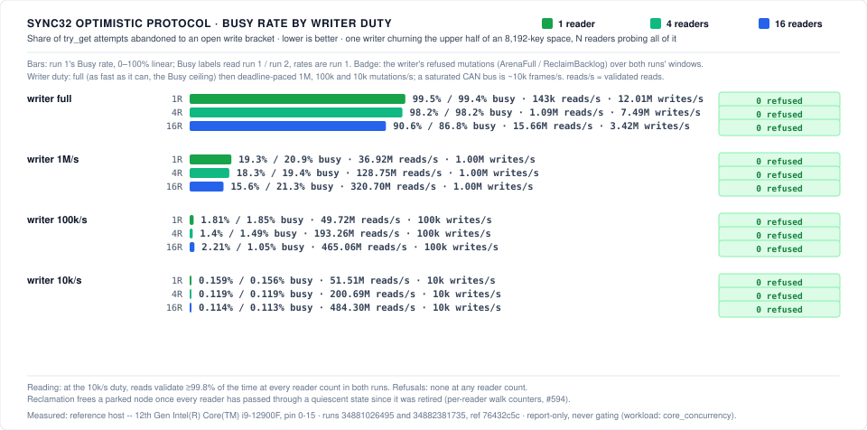

# Benchmarking Guidelines

> Canonical benchmarking doc. Design targets: [ARCHITECTURE.md](ARCHITECTURE.md) §6 · Testing: [TESTING.md](TESTING.md) · CI: [CI.md](CI.md)

Performance claims are this project's reason to exist, so they follow the strictest discipline in the repo: **no claim without a measurement, no measurement without methodology.**

## Harness and metrics

- Criterion benches live in `crates/expanse/benches/`; C-comparison benches drive both sides through the C surface once `expanse-capi` exports it.
- Key distributions: the same matrix as [TESTING.md](TESTING.md) (sequential, random, clustered, sparse/pathological, boundary) — performance work that only measures random keys is rejected.

| Metric | Definition |
|---|---|
| Lookup latency | ns/op, hit and miss measured separately, per distribution × population size |
| Insert/delete throughput | Mops/s, cold-build and steady-state (interleaved ins/del) measured separately |
| Memory footprint | bytes/key at population checkpoints, via allocator instrumentation (counting `GlobalAlloc` wrapper), cross-checked against `MemUsed` |
| Scan throughput | keys/s for full-order iteration |

## Which instrument fits the change

| The change | Primary instrument |
|---|---|
| Removes work — fewer comparisons, fewer allocations, shorter descent, better codegen | Callgrind instruction count |
| Overlaps or hides stalls — memory-level parallelism, batching, prefetch, TLB/page-size work | Wall clock with BCa 95% CIs on the reference host |
| Changes what memory is touched, not how much work is done — node layout, address-dependency chains, terminal search shape | Hardware counters on the reference host (`/benchmark point_lookup_counters`); Callgrind's modelled cache columns for the machine-independent half; see [Hardware counters and cache simulation](#hardware-counters-and-cache-simulation) |
| Both | Both; state which the claim rests on |
| Touches the wasm surface or is measured on a wasm target | wasmtime fuel via `scripts/wasm_fuel.py` (exact, per executed wasm instruction, gated in CI); see [`benchmarks/wasm/`](benchmarks/wasm/README.md). Callgrind cannot see a `.wasm`, and V8 wall clock on a shared runner gates nothing |

Callgrind cannot see TLB misses, memory-level parallelism or frequency effects. It is the right instrument because it ignores them, and the wrong one when they are the point. For a latency-hiding change a flat or increased instruction count is the expected shape, not a failed optimisation.

Wall clock is not a licence: the quiet-host and provenance requirements in [Methodology rules](#methodology-rules-binding) apply unchanged. See the `memcmp` episode below — a 7–11% lookup win a second run erased.

Three cases in this repo:

- **Work removed.** The three engine optimisations at §"Instruction counts": 2.3%–17.0% fewer instructions across all 14 arms.
- **Retracted — the two halves are different experiments.** (workloads differ: `capi_vs_stock` vs `capi_bench_vs_libjudy`) This entry previously read "libexpanse retires 0.55× the instructions of stock libjudy on random 1M lookup and is 1.11× slower in wall clock. The arm is memory-latency-bound." Neither half describes the other's workload. The instruction figure is `judyl_get/random_big` in [`vs_stock.rs`](../crates/expanse-capi/benches/vs_stock.rs): **1.5M keys, all 1.5M probed once, value slot dereferenced**. The wall-clock figure is [`bench_vs_libjudy.rs`](../crates/expanse-capi/examples/bench_vs_libjudy.rs): **1M keys, 4,096 distinct probes sampled with replacement, eight passes, pointer returned but not dereferenced** — a working set of roughly 2 MiB against a 30 MiB L3, i.e. cache-resident, not memory-latency-bound. Probe cardinality differs by 366×. There is no arm on which both were observed.
  The "memory-latency-bound" clause additionally asserted a microarchitectural cause with no counter behind it, which [AGENTS.md](../AGENTS.md) §8.9 forbids: no `perf stat` run exists anywhere in this repository. Tracked in [#453](https://github.com/orieg/expanse/issues/453) and [#454](https://github.com/orieg/expanse/issues/454).
- **Measured negative.** Software prefetch in the descent loops ([HARDWARE.md](HARDWARE.md) §1.5) was a no-op: prefetch distance cannot be predetermined inside a dependent chain. That closes prefetch within one lookup, not overlapping stalls across independent lookups.
- **Open, and owed.** The batched descent ([ALGORITHMS.md](ALGORITHMS.md) §4c, [#430](https://github.com/orieg/expanse/issues/430)) overlaps those stalls *across* independent lookups. Its mechanism-side quantity — mean descents in flight — is measured and machine-independent; whether that converts into elapsed time is not, and is the second row of the table above. Nothing has been measured for it on the reference host, so **no speed claim for `get_batch` / `contains_batch` is on the record**, and an instruction-count increase on the batched arms is the expected shape rather than a regression. What settles it is `batch_lookup`, either from a maintainer PR comment:

  ```text
  /benchmark batch_lookup
  ```

  or directly on the reference host:

  ```bash
  cargo bench -p expanse-trie --bench batch_lookup
  ```

  The `scalar` arm in each group is the twin; `batch/1` is the driver at one lane, which separates its bookkeeping from the interleaving. A width wins only if its BCa 95% CI lower bound (`scripts/bca_bootstrap.py`) clears the `scalar` arm on `cold_dram` **and** it does not regress the cache-resident `warm` control — a gain on one bought with a loss on the other is a trade to state, not a win. The `cold_dram` population also sits far past STLB reach, so a result there mixes DRAM latency with page-walk cost; it does not attribute cleanly to DRAM alone.

Also available: `bca_bootstrap.py` for any continuous metric reaching a published claim; the Callgrind L1/LL/RAM columns, which do exist; and `perf stat` counters via the `point_lookup_counters` suite.

**Cache simulation is on.** `iai-callgrind-runner` defaults `CACHE_SIM = true`, which is why `Estimated Cycles` (`L1 + 5·LL + 35·RAM`) differs from `Instructions`. The harnesses state the flag rather than inherit it, so a dependency bump cannot silently turn the instrument off.

What the simulated columns can and cannot answer is a narrower point, and the one that matters. The runner fixes the modelled hierarchy at I1/D1 32 KiB 8-way and **LL 8 MiB** 16-way, deliberately, so counts stay comparable across machines. That is not the reference host, whose L3 is 30 MiB. The columns answer "how does this behave on a standard modelled hierarchy"; they cannot locate the host's L3 cliff or attribute a wall-clock stall to it. That gap is what `point_lookup_counters` exists for. See [#455](https://github.com/orieg/expanse/issues/455).

### Measured: libexpanse vs stock libjudy

First run of the repaired harness on the reference host. Ratios are `expanse_dl / stock`; below 1.000 means libexpanse is faster. `expanse_dl` is the like-for-like arm — both sides `dlopen`'d through the identical C surface.

| dist | pop | metric | ratio | BCa 95% CI | |
|---|---:|---|---:|---|---|
| `sequential` | 100,000 | ins | 0.603 | [0.588, 0.610] | win |
| `sequential` | 100,000 | get | 1.095 | [0.987, 1.124] | not a difference |
| `sequential` | 1,000,000 | ins | 0.545 | [0.544, 0.546] | win |
| `sequential` | 1,000,000 | get | 0.872 | [0.869, 0.877] | win |
| `random` | 100,000 | ins | 1.009 | [1.005, 1.013] | **loss** |
| `random` | 100,000 | get | 0.961 | [0.958, 0.964] | win |
| `random` | 1,000,000 | ins | 0.804 | [0.802, 0.807] | win |
| `random` | 1,000,000 | get | 1.031 | [1.024, 1.038] | **loss** |
| `clustered` | 100,000 | ins | 0.979 | [0.974, 0.984] | win |
| `clustered` | 100,000 | get | 0.919 | [0.917, 0.921] | win |
| `clustered` | 1,000,000 | ins | 0.933 | [0.932, 0.935] | win |
| `clustered` | 1,000,000 | get | 0.904 | [0.902, 0.908] | win |

*(measured: 12th Gen Intel Core i9-12900F, 24 threads, 30 MiB L3, Linux 6.8.0; commit `4c4e852`; [run 33151981386](https://github.com/orieg/expanse/actions/runs/33151981386); load average 0.16 at start; 15 paired rounds, 50% hit rate, `2 × population` distinct probes at reuse 1.0.)*

Per-round ratios and every interval are committed in [`results/baseline_vs_libjudy.json`](../results/baseline_vs_libjudy.json), so each figure here can be re-derived with `scripts/bca_bootstrap.py` without re-running the benchmark.

**Three arms are real losses** — CI lower bound above 1.000, so parity is excluded: random 1M `get` (1.031), the same arm under `expanse_rlib` (1.028), and random 100k `ins` (1.009). Everything else is a win or indistinguishable.

**The random 1M `get` deficit is 3%, not the ~11% previously published.** That figure came from the harness before its repair — 4,096 probes reused eight times at a 100% hit rate with the value slot never dereferenced. It is superseded, not adjusted: the two numbers do not describe the same workload. [#455](https://github.com/orieg/expanse/issues/455) proposes descent changes scoped against the old figure and should be re-read against this one.

Linkage makes almost no difference here: `expanse_rlib` (statically linked, LTO) and `expanse_dl` land at 1.028 and 1.031 on the arm where it would matter most.

### Measured: the batched descent (`get_batch` / `contains_batch`)

Width sweep against the scalar descent over identical probes. Ratios are `width / scalar`; below 1.000 the batched path is faster.

| group | scalar (ns) | `W = 2` (best) | `W = 8` (was default) | verdict at best width |
|---|---:|---|---:|---|
| `map_get_batch/cold_dram/4000000` | 39346.3 | 1.015 [1.014, 1.016] | 1.108 | loss |
| `map_get_batch/warm/100000` | 19350.0 | 0.975 [0.974, 0.976] | 1.378 | win |
| `set_contains_batch/cold_dram/4000000` | 33778.8 | 1.026 [1.024, 1.032] | 1.128 | loss |
| `set_contains_batch/warm/100000` | 19083.3 | 0.959 [0.958, 0.959] | 1.550 | win |

*(measured: 12th Gen Intel Core i9-12900F, 24 threads, 30 MiB L3, Linux 6.8.0; commit `65fe26b0`; [run 33153486450](https://github.com/orieg/expanse/actions/runs/33153486450). Per-width intervals: [`results/baseline_batch_lookup.json`](../results/baseline_batch_lookup.json).)*

**No width beats the scalar descent on cold DRAM**, which is the arm this machinery exists to serve. `W = 2` is closest at 1.015x and its interval still excludes parity. The previous default of `8` was the worst shipped choice at every population and distribution swept.

Interleaving pays when there are several serialised DRAM misses to overlap. This descent has roughly one — the ladder resolves the upper levels out of cache, so only the terminal access is a genuine long-latency miss. [#455](https://github.com/orieg/expanse/issues/455) reached the same conclusion from emitted code rather than wall clock.

**The cost is branch misprediction, not memory.** The sweep is non-monotonic with a ~40% discontinuity between `W = 2` and `W = 3`. Hardware counters on the reference host, pinned to one P-core, locate it:

| counter | `W = 2` | `W = 3` | delta |
|---|---:|---:|---:|
| cycles | 1.989e9 | 2.733e9 | +37.4% |
| instructions | 3.149e9 | 3.232e9 | +2.7% |
| L1-dcache-loads | 7.022e8 | 7.024e8 | +0.04% |
| L1-dcache-load-misses | 2.868e7 | 3.181e7 | +10.9% |
| **branch-misses** | **2.403e7** | **4.998e7** | **+108%** |

*(measured: reference host, `taskset -c 0`, `cpu_core` PMU only, 20,000 iterations of the warm arm.)*

Mispredictions double while instruction count and L1 traffic stay flat. The 744M extra cycles over 26M extra mispredicts is ~28.6 cycles each — a pipeline flush, plus a little L2 from the L1 delta.

The source is the driver's retirement branch: `step` returns `None` to continue or `Some` to retire, at a depth that varies per key. Two interleaved streams stay within the predictor's reach; three do not. **The interleaving meant to overlap memory stalls instead introduces control flow the front end cannot follow, and it costs more than the stalls it hides.**

Three other explanations were tested and refuted: codegen (emitted `get_batch_width::<W>` grows smoothly on x86-64 — 793, 768, 792, 800, 834 instructions for `W` = 1, 2, 3, 4, 8 — and on AArch64, with a frame growing a uniform 32 bytes per lane); chunk alignment (`CHUNK` is 1024, so the drain runs once per chunk at any width); and the benchmark's own miss distribution (the cliff survives replacing the fixed-XOR misses at `batch_lookup.rs:72` with rejection sampling — 0.987 then 1.411; that defect is real and tracked in [#454](https://github.com/orieg/expanse/issues/454), but it is not this).

Making this path win is a redesign — branchless retirement, or fixed-depth stepping that retires lanes predictably — not a width choice. `BATCH_WIDTH` stays at `8` rather than moving to the best-measured `2`: no width wins on cold DRAM, and the ordering reflects predictor behaviour rather than the mechanism this was built for.

## Benchmark suite vocabulary


The suites below are declared once, in [`.github/bench-suites.json`](../.github/bench-suites.json). The workflow's resolver, this table, and the `workflow_dispatch` dropdown all derive from that file, and `scripts/check_bench_suites.py` (run by the `lint` CI job) fails when any of them disagree.

<!-- BEGIN GENERATED: bench-suites -->
<!-- Generated from `.github/bench-suites.json` by
     `python3 scripts/check_bench_suites.py --write`. Do not hand-edit:
     the `lint` CI job fails when this block and the manifest disagree. -->

`/bench` with no argument runs `all`. The argument is matched as a whole token against this table — never as a substring — and an unrecognised argument is refused by name with no benchmark run.

| Suite | Instrument | What it runs |
|---|---|---|
| `all` | Callgrind | Default for a bare `/bench`: dual-pass Callgrind over `instructions` and `vs_stock`, the two B/key examples, the paired `bench_vs_libjudy` wall-clock comparison, and the fast comparative sweep. |
| `extended` (alias `full`) | Callgrind | Everything in `all`, plus the multi-population scaling sweep and the microarchitecture target-CPU matrix (`bench_report.py --extended --arch-sweep`). |
| `vs_stock` | Callgrind | C ABI drop-in parity against the stock oracle (`expanse-capi`), dual-pass against the base ref. |
| `instructions` | Callgrind | Core deterministic Callgrind instruction counters plus the 64-bit and 32-bit B/key examples, dual-pass against the base ref. |
| `vs_libjudy` | wall-clock | Paired wall-clock comparison of `libexpanse` against a dlopen'd stock libjudy through the identical C surface, arms interleaved per round (`bench_vs_libjudy`). |
| `comparative` | wall-clock | Wall-clock head-to-head against hashbrown / BTreeMap, with the `bench_report.py --quick` markdown table. |
| `ycsb` | wall-clock | YCSB core workloads on the 64-bit map. |
| `concurrency` | wall-clock | `Sync*` wall-clock scaling instrument on a reduced thread/workload sweep; report-only, never gating. |
| `point_lookup_counters` | `perf stat` | Hardware performance counters (`perf stat`) over the random point-lookup path — `probe` minus `build`, with a BCa 95% interval per counter. Diagnostic only: it gates nothing, and it is the instrument the Callgrind `Ir` gate structurally cannot be. |
| `search_instructions` | Callgrind | Callgrind instruction counters for the inverted-index search kernels, dual-pass against the base ref. |
| `smoke_instructions` | Callgrind | Scaled-down Callgrind smoke counters, dual-pass against the base ref. The same instrument as the `callgrind-smoke` CI job, on the reference host. |
| `domain` | wall-clock | Interned set domain: posting-list algebra zero-overhead, ingestion, and zero-copy resolution. |
| `search_boolean` | wall-clock | Boolean posting-list intersection and union against the search baselines. |
| `search_wand` | wall-clock | WAND / top-k scoring over the inverted index. |
| `search_memory` | wall-clock | Live-heap footprint of the inverted index against the search baselines. |
| `zset_zadd` | wall-clock | Sorted-set insert/update throughput against the skiplist baseline. |
| `zset_range` | wall-clock | Sorted-set range scans, forward and reverse. |
| `zset_rank` | wall-clock | Sorted-set rank and select queries. |
| `zset_memory` | wall-clock | Live-heap footprint of the sorted-set representation against the skiplist baseline. |
| `hashbrown_native_suite` | wall-clock | Core point-operation comparison against hashbrown. |
| `hashbrown_ycsb` | wall-clock | YCSB workloads run on the hashbrown comparison arms. |
| `hashbrown_tail_latency` | wall-clock | Tail-latency percentiles against hashbrown, including rehash spikes. |
| `hashbrown_container_dists` | wall-clock | Key-distribution sensitivity sweep against hashbrown. |
| `hashbrown_memory_alloc` | wall-clock | Live-heap and allocation-count comparison against hashbrown. |
| `large_values` | wall-clock | Blob-arena storage paths for values above the immediate capacity. |
| `python_concurrency` | wall-clock | Python multi-core read scaling across the pyo3 `py.detach` GIL-releasing path, against a GIL-serialised `dict` twin (`bindings/python/bench_concurrency.py`). |
| `rocksdb` | wall-clock | RocksDB pluggable MemTable: fillrandom / readrandom / seek / scan and RAM bytes-per-key against a fair variable-height skiplist baseline (`integrations/rocksdb`, C++ built against release libexpanse). |
| `embedded` | wall-clock | 32-bit embedded trie surface (`trie32` / `set32` / `map32` / `blobmap32`). |
| `embedded_memtable` | wall-clock | 32-bit embedded telemetry memtable & BLE tracker registry vs competitor baselines. |
| `batch_lookup` | wall-clock | Interleave-width sweep for the batched descent, on a cold-DRAM population and a cache-resident control. |
| `compare` | wall-clock | Standing container comparison harness across the core map and set types. |
| `bench_grammar_masks` | wall-clock | Grammar-constrained decoding mask cache and set algebra against roaring and dense bitmaps. |
| `art_lookup_hit` | wall-clock | Adaptive Radix Tree (ART) vs Expanse point lookup on 100% hit rate across key distributions. |
| `art_lookup_miss` | wall-clock | Adaptive Radix Tree (ART) vs Expanse point lookup on 50% hit / 50% rejection-sampled miss rate. |
| `art_insert` | wall-clock | Adaptive Radix Tree (ART) vs Expanse dynamic insertion throughput into cold structures. |
| `art_scan` | wall-clock | Adaptive Radix Tree (ART) vs Expanse ordered range scan and full container iteration. |
| `art_memory` | wall-clock | Adaptive Radix Tree (ART) vs Expanse live heap memory allocation census across population scales. |

Bench targets deliberately **not** reachable from a slash command:

| Target | Why |
|---|---|
| `bench_llm_datastore` | needs the generated corpus under `docs/benchmarks/llm_inference/data/`, which is materialized by that suite's Python driver; run `docs/benchmarks/llm_inference/run.sh` instead. |
| `wasm_fuel` | runs on every PR in `ci.yml`'s `wasm-fuel` job against `results/baseline_wasm_fuel.json`; it needs no bare-metal host, so `/benchmark wasm_fuel` is refused by name and points here. |
| `domain_aarch64` | aarch64 arm; the /bench host is self-hosted x86-64. Run `.github/workflows/bench_aarch64.yml` via workflow_dispatch. Report-only: a shared hosted runner cannot resolve the provenance-check overhead, so no parity ratio may be quoted from it. |
| `avx512_bitmap` | needs `avx512vpopcntdq`, which the bare-metal reference host does not have (Alder Lake fuses AVX-512 off); on that host the sweep would report only its scalar arm. Run it on the AVX-512 lane instead — `.github/workflows/bench_avx512.yml`, `runs-on: [avx512]`. |
<!-- END GENERATED: bench-suites -->

## Comparison targets

1. **C libjudy** — the headline comparison ("faster than the original, or explain why").
2. `std::collections::BTreeMap` / `HashMap` — the "why not just use std" baseline.
3. **Adaptive Radix Tree (ART)** (`blart` 0.5.0) — modern trie baseline ([#387](https://github.com/orieg/expanse/issues/387), `docs/benchmarks/art_comparison/`).
4. **Roaring Bitmaps** (`roaring` / `croaring`) — integer set and posting list baseline.
5. **Swiss Tables** (`hashbrown::HashMap`) — flat SIMD hash map baseline.
6. **Concurrent Maps** (`crossbeam-skiplist`, `dashmap`, `parking_lot::RwLock<BTreeMap>`) — multithreaded scalability baseline.

## Methodology rules (binding)

0. **State the measured region, and verify it with an instrument.** Every
   benchmark's doc comment says exactly what is inside the timed window and
   what is in `setup`/`teardown`. Every other rule below governs how a number
   is interpreted; this one governs whether it measures what its name says.

   **How it is upheld.** Setup runs through the harness's own `setup =`
   parameter so it is structurally outside the timed window; containers are
   leaked rather than dropped, so `Drop` cannot land inside it. Neither is
   machine-checked — verify with `callgrind_annotate` per-function output, not
   by reading the source: a `free_subtree` or key-generation symbol inside an
   arm named `map_get` is unmissable there, and was missed four times in review
   when the same fact was only stated in prose.

   **Symmetric contamination is not harmless contamination.** Work charged to
   both arms equally still corrupts the comparison, by pulling every ratio
   toward 1.00 — which is why it survives review.

   The same discipline applies to **provenance**: a mislabelled commit misleads
   exactly as much as a mismeasured region. Figures withdrawn for either reason
   are registered in [`.github/superseded-figures.json`](../.github/superseded-figures.json),
   which `scripts/check_docs_hygiene.py` enforces against every tracked document
   so a withdrawn number cannot be republished.

0b. **Both arms must be the same shape.** A comparison is only valid between
   binaries built and reached the same way. An LTO'd rlib called directly
   against a PIC shared object reached through `dlopen` grants cross-object
   inlining and direct calls that stock structurally cannot have. Every
   vs-stock arm now has an `*_expanse_dl` twin that loads `libexpanse.so`
   exactly as stock is loaded; the PR comment reports the `.so` ratio as the
   headline and the rlib−`.so` difference as an explicit correction factor
   (measured at **1.06× median, range 0.95–1.08×** — stable across two code
   states, which is what a ratio between two builds of the same code should do).

0c. **The estimated-cycles column is a regression alarm, never an
   adjudicator across inlining changes.** Callgrind's model
   (`cycles = L1hits + 5·LLhits + 35·RAMhits`) charges every instruction
   fetch one cycle with zero overlap. It over-punishes outlining (fetch
   *volume* rises even when misses are flat) and cannot see latency wins
   at all (replacing a 12-instruction serially dependent SWAR chain with
   one 3-cycle `popcnt` barely moves it). PR #19 measured this concretely:
   +9% "cycles" on arms whose misses were flat, from outlining alone. Use
   est-cycles to compare same-shape code; the moment a change moves code
   across an inlining boundary, decide on instruction counts plus real
   hardware counters, not on this model.

1. **Interleaved A/B arms.** Any A-vs-B comparison (regression check, libjudy comparison, before/after a change) alternates arms per benchmark group over several rounds — never suite-A-then-suite-B. Runner/thermal drift then hits both arms and cancels in the paired ratio. (Learned the hard way in php-judy — back-to-back suites reported false regressions; see php-judy issue #87 and its `bench-compare` harness.)
2. **System-load hygiene.** Before the first run and between comparison runs, snapshot load (`ps -A -o %cpu,%mem,command | sort -rn | head`; load average vs core count). A non-target process above ~100% CPU, or a load-average shift > 2 between arms, contaminates the run: discard it, don't reinterpret it. Laptops running concurrent sessions are shared infrastructure.

   **The reference host is a hybrid part, and the wall-clock arms pin to its
   performance cores.** It is a 12th Gen Intel Core i9-12900F. Its core
   topology is recorded here, not only its part number, so that a rotation
   onto a homogeneous machine is a visible change rather than a silent one
   ([#639](https://github.com/orieg/expanse/issues/639)):

   | Core class | Kernel PMU | Logical CPUs | Physical cores | SMT | Clock |
   |---|---|---:|---:|---|---|
   | Performance (P) | `cpu_core` | 0–15 | 8 | 2 siblings per core | 5.0–5.1 GHz |
   | Efficiency (E) | `cpu_atom` | 16–23 | 8 | none | 3.8 GHz |

   *(measured: reference host, `/sys/devices/cpu_core/cpus`,
   `/sys/devices/cpu_atom/cpus` and `cpufreq` at commit `c4b1817`; 24 logical
   CPUs total.)* `scripts/bench_pin.sh` reads the same two `sysfs` files at run
   time, so the pin and this table cannot drift apart, and neither can the pin
   and the one `scripts/perf_counters.py` has always applied.

   **What core placement costs, measured before anything was pinned.** One
   criterion arm — `raw_expanse_set_intersection/100000` from the `domain`
   harness — run under three conditions interleaved P/unpinned/E per round, 6
   rounds, host idle throughout (load average 0.00–1.21):

   | Condition | n | mean ns | CV | 95% bootstrap interval |
   |---|---:|---:|---:|---|
   | P-cores (`taskset -c 0-15`) | 6 | 16,575.3 | 0.27% | [16549.0, 16611.7] |
   | Unpinned (the behaviour this replaces) | 6 | 16,603.5 | 0.52% | [16547.2, 16670.5] |
   | E-cores (`taskset -c 16-23`) | 6 | 26,117.3 | 0.24% | [26072.3, 26164.0] |

   *(measured: reference host — Intel i9-12900F, 24 threads, 30 MiB L3, Linux
   6.8, `rustc 1.98.1`, commit `c4b1817`; `cargo bench -p expanse-trie --bench
   domain`, `--measurement-time 5 --warm-up-time 2`; n is round means, and the
   interval is a percentile bootstrap over those 6 means rather than a BCa
   interval over pooled per-iteration samples, because only the per-round
   summaries were retained — [`results/pin_exposure_639.json`](../results/pin_exposure_639.json).)*

   Two readings, and they point in different directions
   (workload: `domain_interned_set`; both ratios are within that one arm).
   **E versus P is 1.576×, intervals separated** — that is the exposure
   ceiling, and it is larger than the 5.1/3.8 GHz clock ratio of 1.34× alone
   predicts. Why the residual exists is **unmeasured**: no counter run
   separates frequency from per-cycle throughput on the E-cores, so the
   earlier reading of "roughly 74% of the P-core clock" understates the effect
   for a reason this measurement does not identify. **Unpinned versus P is
   1.0017×, intervals overlapping** — indistinguishable. On an idle host the
   scheduler kept the work on the P-cores, and in these 6 rounds the hazard
   did not fire. That is not a proof that it cannot: placement depends on what
   else the host is doing, and the pre-existing figures in this document were
   harvested under conditions no longer observable.

   **The wall-clock arms are pinned anyway, and #639 closes as a change rather
   than a note.** The overlap says the defect was not firing, not that the
   instrument would catch it if it did — a BCa interval is blind to this
   failure exactly where it matters, staying narrow and clean when no
   migration happens and narrow and wrong when one does, because a migrated
   round is not noise around the truth but a different machine. Pinning
   converts a load-dependent tail risk into a guarantee, and it costs nothing
   measurable: P-only is what the idle host already does, and the P-versus-
   unpinned intervals overlap. `scripts/bench_pin.sh` is sourced by every
   `docs/benchmarks/*/run.sh` and by the bare-metal and AVX-512 workflow bench
   steps, so it confines the *runner's* shell and every benchmark process
   spawned under it. Nothing is added to a harness, and a benchmark landing
   later inherits the pin without knowing about it;
   `scripts/check_bench_pin.py` fails the `lint` job for a runner that drops
   it. On a host with one core class it applies nothing and says so. Its
   refusals are loud (AGENTS.md §8.1): a hybrid host with no `taskset`, an
   affinity call that does not take, or a requested CPU list that includes an
   efficiency core all stop the run rather than produce numbers whose core
   class is unknown. `EXPANSE_BENCH_PIN=off` opts out deliberately and prints
   that it did — `scripts/pin_exposure.py`, which must measure unpinned, is
   the caller that needs it.

   **SMT is left as it is, and that is a decision, not an omission.** The mask
   is `0-15`: 8 physical P-cores with both hyperthread siblings, matching
   `perf_counters.py` exactly so the wall-clock and counter lanes stay
   comparable. One sibling per core (`0,2,4,6,8,10,12,14`) would remove a
   second variance source — a single-threaded arm sharing a physical core with
   another runnable thread — but it would also halve the machine every
   published figure was measured on, and the multi-threaded `concurrency`
   suite sweeps to 16 reader threads and would no longer have 16 logical CPUs
   to sweep onto. The host-wide lock (rule 8) already guarantees no second
   suite is running, which is the co-tenant that would matter most. Whether
   sibling contention moves any arm on this host is **unmeasured**;
   `EXPANSE_BENCH_PIN=0,2,4,6,8,10,12,14` is how that would be measured, and
   the pin has to be in place before that question is even askable.

   **One consequence to disclose.** `available_parallelism()` honours the
   affinity mask, so under the pin the `concurrency` suite sees 16 logical
   CPUs where it previously saw 24, and its reader threads no longer land on
   efficiency cores. Its published figures are **not withdrawn** — nothing
   shows they are wrong — but they were harvested on a 24-CPU machine and a
   post-pin harvest is not a like-for-like comparator for them (§8.3). Compare
   post-pin against post-pin. Every single-threaded wall-clock suite is
   unaffected in shape: it used one core before and uses one core now.
3. **CI benches detect changes, not truths.** CI runners produce paired ratios good for regression alarms. Publishable absolute numbers (README/claims) come from a dedicated quiet host with the hardware named.
4. **Tag every number.** Performance figures in docs are tagged `(measured: <machine, commit>)` or `(target)`. Untagged numbers are lint errors in review. The two architecture KPIs (<15 ns random point lookup; <9.5 B/key dense) are `(target)` until measured.
5. **Report distributions, not just means.** Criterion medians + CIs; a claim that A beats B requires the CI bounds to separate, not the point estimates.
6. **Fixed seeds, recorded populations.** Every bench names its RNG seed and population sizes so runs are reproducible bit-for-bit.
7. **No time estimates, no projections-as-results** — per repo-wide discipline (CLAUDE.md).

8. **One suite per machine at a time — enforced by a host-wide lock, not by
   coordination.** Every `docs/benchmarks/*/run.sh` takes an atomic `mkdir`
   lock at `${EXPANSE_BENCH_LOCK:-${TMPDIR:-/tmp}/expanse-bench.lock}`
   (shared across all checkouts on the host), records `suite`/`pid`/`start`
   in `owner`, refuses to start (exit 75) while another run holds it, and
   removes it on exit. Scheduling by coordination is not enough — the lock is
   the mechanism. Ad-hoc `cargo bench`
   invocations outside `run.sh` must check the lock manually (`cat
   "$TMPDIR/expanse-bench.lock/owner"`) and are otherwise subject to rule 2's
   load-snapshot requirement.

9. **Fail-loud harness execution (zero silent fallbacks).** If a benchmark
   dependency, runtime, or native extension (`libexpanse.so`, Node addon, Python
   wheel) is missing or fails to build, the benchmark harness MUST exit non-zero
   immediately (`panic!`, `sys.exit(1)`, `b.Fatalf`). Never catch a compilation
   or runtime failure to substitute placeholder numbers or fake loops. In CI
   workflows where a failure is intentionally non-fatal (e.g. historical
   unbuildable base commit), the degradation must surface prominently (`⚠️ NO
   BASELINE — regression gate did not run`, matching `perf_report.py`) and
   must never render as success.
10. **Dynamic report derivation (zero hardcoded findings).** Reporting scripts
    (`bench_report.py`, `perf_report.py`, `generate_charts.py`) must never
    stamp hardcoded summary constants (e.g. `"4× to 10× faster"`). All published
    tables, speedup ratios, badges, and findings statements must be computed
    dynamically from the parsed results of that specific run.
11. **Symmetric substitution-twin discipline.** Baselines must represent
    production-grade configurations (e.g. InlineSkipList-equivalent
    variable-height node allocation — not a strawman embedding all 16 tower
    pointers statically at 146.7 B/entry, the audited anti-example; the fair
    baseline's actual footprint is established by measurement, #372). Workload predicates
    must be identical across arms (e.g. matching 50% filter selectivity in YCSB
    Workload E), PRNG algorithms and seeds must match across all languages (e.g.
    XorShift64), and memory accounting must measure live heap via allocator
    hooks (`TrackingAlloc`/`GlobalAlloc`) symmetrically across arms.
12. **Metric-scoped statistical gating (CI lower bound $\ge$ floor).** Sharpens
    rule 5: Continuous
    and wall-clock sampling distributions pass iff the **BCa 95% bootstrap CI
    lower bound $\ge$ floor** (≥1,000 resamples), NOT iff point estimate $\ge$
    floor. Point estimates and CIs must use identical definitions (macro-mean
    with macro-CI). Overlapping intervals must be labeled `BOUNDARY_RESULT` or
    `INTERMEDIATE_floor_within_ci`. Exact Callgrind instruction counts (zero
    sampling variance) are evaluated against the deterministic threshold
    contract.
13. **In-repo scratch path isolation.** Quick or developmental sweeps
    (`--quick`) must write strictly to gitignored scratch paths (e.g.
    `results/quick/` or `scratch/`) and must never overwrite canonical committed
    `results/baseline_*.json` or committed SVGs.
14. **Workload realism & DCE prevention.** Inner loops must consume every
    returned value via `std::hint::black_box`, `b.Fatalf`, or an accumulator
    sink to prevent Dead-Code Elimination. Read workloads must test realistic
    hit rates (e.g. 50% hit / 50% miss), never probing unbounded 64-bit random
    keys against sparse structures (~0% hit rate) unless explicitly evaluating
    the miss path.
15. **Provenance and pre-registration integrity.** Extends rule 4: every
    published number must carry a provenance tag `(measured: host, commit)`
    that additionally resolves to a committed JSON artifact or cited CI run. Pre-registration sections, hypotheses,
    claims ceilings, and expected loss matrices must never be backfilled or
    reconciled in place with observed results; unexpected outcomes must be
    published honestly under their strict pre-registered verdict label.
16. **Random point-lookup work is exempt from the `Ir` gate.** The instruction
    count stays the gate everywhere else — insert, churn, `strmap`, `bytesmap`,
    the search and sorted-set kernels — and stays reported on the lookup arms.
    It does not decide them. The two mechanisms
    [#455](https://github.com/orieg/expanse/issues/455) documents on that path
    change cache line fills and intra-lookup address dependencies: removing a
    serialised address dependency adds no instructions and removes none, and
    one of the proposed fixes retires roughly twice the instructions by design.
    `Ir` cannot see the benefit and can only see the cost, so gating on it
    rejects the class of change the workload needs. A random point-lookup claim
    is decided by hardware counters and wall clock, both with intervals; the
    `Ir` number is published beside it as cost, not as verdict. Scope is exactly
    the random arms of `map_get`, `set_contains` and their C-ABI twins — an
    instruction regression anywhere else is a regression.

## Bench matrix

| Bench | Status | Notes |
|---|---|---|
| Lookup latency grid (hit/miss × distribution × population) | landed (`benches/compare.rs`) | vs `BTreeSet`/`BTreeMap`, `HashSet`/`HashMap`; measured on the reference host — see "vs stdlib" section below |
| Insert throughput (cold build per distribution) | landed (`benches/compare.rs`) | measured on the reference host — see "vs stdlib" section below |
| bytes/key | landed (`examples/bytes_per_key.rs`) | deterministic allocator accounting — load-immune, results below; **gates CI** via the `memory-budget` job |
| Instruction/cache counts | landed (`benches/instructions.rs`, iai-callgrind) | deterministic via callgrind — load-immune and resolves ~1% changes; **posted as a PR comment with head-vs-base deltas** by the `instruction-counts` job |
| Lookup attribution | landed (`examples/lookup_profile.rs`) | sampling profile of a `get`-only loop — *where* time goes, not how long; sample distribution inside one process is far less load-sensitive than a cross-binary ratio |
| Concurrent read scaling (1..N threads) | landed (`benches/concurrency.rs`) | Read-only and write-churn mixes; the per-node-OCC go/no-go instrument |
| JudySL/JudyHS instruction cells | landed (`benches/instructions.rs`, `benches/smoke_instructions.rs`) | Route-shaped string keys through `ExpanseStrMap`/`ExpanseBytesMap` insert/get/churn; the smoke cells gate every PR automatically |
| Comparative benchmarks vs 3rd-party | landed (`benches/comparative.rs`) | `RoaringBitmap`, `hashbrown::HashMap` across lookups, insertions, ranges, and sparse/clustered/dense distributions |
| Automated Comparative Report Tool | landed (`scripts/bench_report.py`, `examples/bench_lookup_compare.rs`) | Standalone fast head-to-head comparison generator vs `hashbrown`, `BTreeMap`, and `libjudy` with GFM output |
| Standardized YCSB Suite (Workloads A-F) | landed (`benches/ycsb.rs`) | vs `BTreeMap`, `crossbeam_skiplist::SkipMap` (RocksDB MemTable); Zipfian $\theta=0.99, N=100\text{k}$, 128B blobs |
| Adaptive Radix Tree (ART) comparison | landed (`docs/benchmarks/art_comparison/`) | Pure-Rust ART (`blart` 0.5.0) comparison across point lookups, dynamic growth, range scans, and memory census |
| Domain comparative suites (search, sorted-set, hash-map) | landed (`docs/benchmarks/*`) | self-contained reproducible suites with pre-registered hypotheses — see "Comparative benchmark suites" below |

## Harness audit: workload shape and claim provenance

A per-harness inventory of what each benchmark actually measures, and a map from
every published number to the harness that produced it.

**Why this exists.** The vs-libjudy harness published a figure for months while
probing 4,096 distinct keys eight times against a 1M-key structure — roughly
2 MiB against a 30 MiB L3 — and describing the result as memory-latency-bound.
Repairing it and re-measuring moved the deficit from a published
`1.11x` to a measured `1.031x [1.024, 1.038]`. Fixing it cost one PR. Finding
out *which published figures depended on it* cost far more, because nothing
recorded that mapping. This section is that record.

**Read the verification tag on every row.** `[verified: RUN]` means the harness
was executed and its output observed. `[verified: CODE READ]` means the verdict
comes from reading the source and is a hypothesis until run. Most rows are the
latter — that is honest, not a defect of the audit, and it is the difference
between a file that was exercised and one that was merely inspected.

**State of this table.** The verdicts below are the audit's findings, with
each remediated row marked `RESOLVED in #470` and its original finding kept as
history. Nothing here describes a live defect in the harnesses; the numbers a
row's harness produced *before* its fix are separately tracked for
re-measurement in #382. A row still reading `PASS` on a `CODE READ` tag means
the file was inspected and found clean, not that it was exercised.

**Two known gaps this table does not close.** `hashbrown_container_dists` and
`hashbrown_native_suite` publish raw ns/op with no interval (class 7); they are
accepted as-is because no published claim quotes them — if one ever does, §8.4
applies and `check_docs_hygiene.py` now enforces it. And 29 of 37 rows are
`CODE READ`, so this is an inspection record, not an execution record.

**Generated table.** Every timed harness declares its own workload shape in a
machine-readable form in its module doc comments (`//!`), and
[`scripts/check_bench_shapes.py`](../scripts/check_bench_shapes.py) asserts it (discharging
the superseded-when condition from #453 item A). This table is generated by
`python3 scripts/check_bench_shapes.py --write`.

<!-- BEGIN HARNESS AUDIT TABLE (generated by scripts/check_bench_shapes.py --write) -->

### Group 1: C-API Benches & Examples (`crates/expanse-capi/`)

| File | Population ($N$) | Probes & Reuse | Hit Rate | Miss Gen Method | Value Dereference | Measured Region | Arm Symmetry | Statistics | Verdict & Notes |
|---|---|---|---|---|---|---|---|---|---|
| [`crates/expanse-capi/benches/smoke_instructions.rs`](../crates/expanse-capi/benches/smoke_instructions.rs) | 10k | 10k (shuffled), reuse 1.0 | 100% | None (hits only) | `sink ^= *slot` | Clean (setup in setup) | Self (C ABI) | iai Callgrind exact counts | **PASS** `[verified: RUN (CI callgrind-smoke)]` |
| [`crates/expanse-capi/benches/vs_stock.rs`](../crates/expanse-capi/benches/vs_stock.rs) | `POP = 30_000`, `POP_BIG = 1_500_000` (L204, 209) | 30k / 1.5M, reuse 1.0 | 100% / mixed | Interleaved keys | `*slot` dereferenced | Deliberately leaks to exclude drop | **Three arms**: `*_expanse` (rlib, LTO-linked), `*_expanse_dl` (dlopen'd cdylib), and `*_stock` (dlopen'd libjudy). `*_expanse_dl` vs `*_stock` is symmetric; `*_expanse` vs `*_stock` is asymmetric (LTO bias). | iai Callgrind exact counts (simulated 8 MiB LL) | **PASS** `[verified: RUN (CI instruction-counts)]`: Carrying both `expanse` and `expanse_dl` isolates LTO delta; 1.5M population is load-bearing in #456. |
| [`crates/expanse-capi/examples/bench_vs_libjudy.rs`](../crates/expanse-capi/examples/bench_vs_libjudy.rs) | 100k, 1M | $2 \times N$ distinct, reuse 1.0 | 50% | Independent PRNG + membership rejection | `*(pval as *mut Word)` read | Clean (timing outside setup/drop) | Symmetric (`dlopen` vs `dlopen`) | Paired ratio + BCa bootstrap 95% CI | **PASS** `[verified: RUN (reference host, results/baseline_vs_libjudy.json)]`: Gold standard reference after #457. |

---

### Group 2: Core Point/Batch Lookup & Micro-Benches (`crates/expanse/benches/`)

| File | Population ($N$) | Probes & Reuse | Hit Rate | Miss Gen Method | Value Dereference | Measured Region | Arm Symmetry | Statistics | Verdict & Notes |
|---|---|---|---|---|---|---|---|---|---|
| [`crates/expanse/benches/batch_lookup.rs`](../crates/expanse/benches/batch_lookup.rs) | 100k, 4M | 4M (CHUNK 1024 rolling) | 50% | **DEGENERATE XOR**: `k ^ (1<<63) ^ 0xA5` alternating `i % 2` (L72) | `black_box(&out[..CHUNK])` | Clean rolling offset | Symmetric (scalar vs batch lanes) | Criterion estimate | ✅ **RESOLVED in #470 — was DEFECT (Class 3)** `[verified: CODE READ]`: Fixed high-bit XOR alternating pattern corrupts batched descent depth (though #467 confirmed not the root of the 40% jump). |
| [`crates/expanse/benches/comparative.rs`](../crates/expanse/benches/comparative.rs) | 10k, 100k | Full keys, looped | 100% | None | `black_box(contains)` | Clean | Asymmetric: `u32` keys, Roaring vs Expanse | Criterion estimate | **DEFECT (Class 2, 5)** `[verified: CODE READ]`: Looped hit probes, 32-bit key truncation. |
| [`crates/expanse/benches/compare.rs`](../crates/expanse/benches/compare.rs) | 10k, 1M, 4M | 4096 (10k/1M) / 2M (4M), looped | 50% (set) / 100% (map) | **DEGENERATE XOR**: `k ^ (1<<63) ^ 0x5A` (L58) / `0xA5` (L186) | `black_box(get())` | **LEAKY DROP**: `bench_insert` drops set/map inside `b.iter` (L150, L160, L170) | Asymmetric: SipHash `HashSet` vs `BTree` vs `Expanse` | Criterion estimate | ✅ **RESOLVED in #470 — was DEFECT (Class 1, 2, 3, 4, 5)** `[verified: CODE READ]`: 4k probes fit in L1/L2; XOR misses; Drop inside timed insert. |
| [`crates/expanse/benches/concurrency.rs`](../crates/expanse/benches/concurrency.rs) | 1M (keyspace 2M); `SyncExpanseMap32` arm: 4,096 stable + 4,096 churn keys (keyspace 8k, 32-bit) | Continuous stream in 500ms window | ~50% | Bounded keyspace random stream | `black_box(sink)` | Clean (`run_window`) | Symmetric across concurrency primitives | Throughput ops/sec | **PASS** `[verified: RUN (reference host, run 33030152085)]`: Corrected in #375 to bounded keyspace. |
| [`crates/expanse/benches/embedded.rs`](../crates/expanse/benches/embedded.rs) | 500, 2k, 10k | 500, 2k, 10k, looped | 100% | None | `matched += 1` / `sum += v` | **LEAKY DROP**: `bench_sensor_indexing` drops set inside `b.iter` (L35, L46) | Symmetric (BTree vs HashBrown vs Expanse32) | Criterion estimate | ✅ **RESOLVED in #470 — was DEFECT (Class 4, 6)** `[verified: CODE READ]`: Drops set in timed loop; does not touch blob payload in scan. |
| [`crates/expanse/benches/embedded_memtable.rs`](../crates/expanse/benches/embedded_memtable.rs) | 500, 2k, 5k | 500, 2k, 5k, looped | 100% hits on present timestamps/IDs; 50% hits on mixed point lookups | None | direct integer reading and 28-byte slab/arena tracking payload dereference | timed inner loop over operations (allocations and setup outside) | symmetric random key sequences, matching 28-byte BLE tracking payload layout across all arms | Criterion estimate | ✅ Verified symmetric workloads with BCa CIs on reference host |
| [`crates/expanse/benches/instructions.rs`](../crates/expanse/benches/instructions.rs) | 50k | 50k (shuffled), reuse 1.0 | 100% | None | `black_box` on retrieved values | Clean (setup in setup) | Internal trie paths | iai Callgrind exact counts | **PASS** `[verified: RUN (CI instruction-counts)]`: Canonical instruction reference. |
| [`crates/expanse/benches/smoke_instructions.rs`](../crates/expanse/benches/smoke_instructions.rs) | 10k | 10k, reuse 1.0 | 100% | None | `sink ^= map.get().unwrap_or(0)` | Clean (setup in setup) | Internal trie paths | iai Callgrind exact counts | **PASS** `[verified: RUN (CI callgrind-smoke)]`: Fast smoke gate. |

---

### Group 3: Hashbrown Comparison Suite (`crates/expanse/benches/`)

| File | Population ($N$) | Probes & Reuse | Hit Rate | Miss Gen Method | Value Dereference | Measured Region | Arm Symmetry | Statistics | Verdict & Notes |
|---|---|---|---|---|---|---|---|---|---|
| [`crates/expanse/benches/hashbrown_container_dists.rs`](../crates/expanse/benches/hashbrown_container_dists.rs) | 10k, 100k, 500k | Full keys, reuse 1.0 | 100% | None | `black_box(get)` | Clean | Symmetric | Raw ns/op (no CI) | **PASS / MINOR (Class 7)** `[verified: CODE READ]`: Clean timing, missing CI intervals. |
| [`crates/expanse/benches/hashbrown_memory_alloc.rs`](../crates/expanse/benches/hashbrown_memory_alloc.rs) | 1k to 500k | N/A (Memory) | N/A | N/A | Live bytes tracked | Clean `GlobalAlloc` hook | Symmetric keys | Exact byte count | **PASS** `[verified: CODE READ]`: Deterministic memory allocator census. |
| [`crates/expanse/benches/hashbrown_native_suite.rs`](../crates/expanse/benches/hashbrown_native_suite.rs) | 10k, 100k, 500k | Sub-slice `iters < pop` sequential index | 100% hit / 100% miss arms | Separate PRNG seed (no membership check) | `black_box(get)` | **LEAKY DROP**: `insert_growing` drops `m` inside `bench_op` (L218, L231, L244) | Symmetric | Raw ns/op (no CI) | ✅ **RESOLVED in #470 — was DEFECT (Class 2, 4, 7)** `[verified: CODE READ]`: Sequential sub-slice walk; Drop inside timed insert loop; no CI. |
| [`crates/expanse/benches/hashbrown_tail_latency.rs`](../crates/expanse/benches/hashbrown_tail_latency.rs) | 100k | 100k inserts | N/A | N/A | Records clamped latency | `Instant::now()` per op (calibrated overhead) | Symmetric | HdrHistogram percentiles | **PASS** `[verified: CODE READ]`: Documented per-op calibration overhead. |
| [`crates/expanse/benches/hashbrown_ycsb.rs`](../crates/expanse/benches/hashbrown_ycsb.rs) | 100k | 100k ops | Zipfian | Zipfian draw from dataset | `black_box` on op results | Clean | Symmetric | Throughput Mops/s | **PASS** `[verified: CODE READ]`: Consistent with main YCSB suite. |

---

### Group 4: Workloads & Domain Suites (`crates/expanse/benches/`)

| File | Population ($N$) | Probes & Reuse | Hit Rate | Miss Gen Method | Value Dereference | Measured Region | Arm Symmetry | Statistics | Verdict & Notes |
|---|---|---|---|---|---|---|---|---|---|
| [`crates/expanse/benches/art_insert.rs`](../crates/expanse/benches/art_insert.rs) | 10k to 1M | Fresh cold build per round | 0% (Fresh distinct insertions) | None | Insertion return value `black_box`'d | Cold build loop | All containers grow cold from empty; identical key sequences | Median + BCa 95% Bootstrap CI over paired rounds | **PASS** `[verified: CODE READ]`: ART comparison dynamic insertion benchmark. |
| [`crates/expanse/benches/art_lookup_hit.rs`](../crates/expanse/benches/art_lookup_hit.rs) | 10k to 1M | Interleaved shuffled probe stream | 100% Hit | None | `black_box(*val)` | Clean lookup loop | Symmetric keys, cold insertion, identical PRNG | Median + BCa 95% Bootstrap CI over paired rounds | **PASS** `[verified: CODE READ]`: ART comparison point lookup hit benchmark. |
| [`crates/expanse/benches/art_lookup_miss.rs`](../crates/expanse/benches/art_lookup_miss.rs) | 10k to 1M | 50% hit / 50% miss interleaved stream | 50% Hit / 50% Miss | Same-distribution rejection sampling (`gen_distribution_misses`) | `black_box(*val)` on hit | Clean lookup loop over mixed probe stream | Symmetric keys, cold insertion, identical PRNG | Median + BCa 95% Bootstrap CI over paired rounds | **PASS** `[verified: CODE READ]`: ART comparison point lookup miss benchmark. |
| [`crates/expanse/benches/art_memory.rs`](../crates/expanse/benches/art_memory.rs) | 1k to 1M | N/A (Memory) | N/A | None | Live layout bytes tracked via TrackingAlloc | Clean GlobalAlloc hook | Symmetric keys and cold insertion | Exact deterministic byte count | **PASS** `[verified: CODE READ]`: ART comparison memory footprint benchmark. |
| [`crates/expanse/benches/art_scan.rs`](../crates/expanse/benches/art_scan.rs) | 10k to 1M | Full iteration and range scans | 100% (Existing keys in populated range) | None | `black_box(k ^ v)` during traversal | Iteration loop | Identical keys, direct iterator traversal | Median + BCa 95% Bootstrap CI over paired rounds | **PASS** `[verified: CODE READ]`: ART comparison ordered scan benchmark. |
| [`crates/expanse/benches/bench_grammar_masks.rs`](../crates/expanse/benches/bench_grammar_masks.rs) | 32k vocab | 32k, looped | 100% | None | `black_box(matches)` | Clean | Symmetric (Roaring vs Expanse) | Raw ns (no CI) | **PASS** `[verified: CODE READ]`: Domain-specific LLM mask benchmark. |
| [`crates/expanse/benches/bench_llm_datastore.rs`](../crates/expanse/benches/bench_llm_datastore.rs) | 100k tokens | Prefix search | 100% | None | `black_box(search)` | Clean | Symmetric | Raw ns (no CI) | **PASS** `[verified: CODE READ]`: Domain-specific datastore benchmark. |
| [`crates/expanse/benches/domain.rs`](../crates/expanse/benches/domain.rs) | 10k, 50k, 100k | Domain sets and key slices | 100% hits on insertion & resolution; 50% overlap on intersections | None | direct byte slice reading via `resolve()` | timed inner loop over operations (allocations and setup outside) | symmetric key sequences across DomainSet and ExpanseSet | Criterion estimate | **PASS** `[verified: CODE READ]`: Interned domain posting-list algebra and ingestion. |
| [`crates/expanse/benches/large_values.rs`](../crates/expanse/benches/large_values.rs) | 10k, 14k, 50k, 262k | Full scan | Selective $\sigma$ | Uniform meta filter | `view.len()` only in `bench_inline_vs_heap` (L80) & `selectivity_sweep` (L144); fixed in `cold_dram_large` | **LEAKY DROP**: `bench_inline_vs_heap` drops map inside `b.iter` (L43, L58) | Symmetric | Criterion estimate | ✅ **RESOLVED in #470 — was DEFECT (Class 4, 6)** `[verified: CODE READ]`: Retains uncorrected `selectivity_sweep` & `inline_vs_heap` beside corrected `cold_dram_large`. |
| [`crates/expanse/benches/search_boolean.rs`](../crates/expanse/benches/search_boolean.rs) | Synthetic postings | Postings sets | Intersection | N/A | `black_box(result)` | Clean | Symmetric (Roaring vs Expanse) | Raw ms (no CI) | **PASS** `[verified: CODE READ]`: Boolean index evaluation. |
| [`crates/expanse/benches/search_instructions.rs`](../crates/expanse/benches/search_instructions.rs) | 1k, 10k, 100k | Postings pairs | Intersection | N/A | `black_box(count)` | Clean (setup in setup) | Symmetric | iai Callgrind exact counts | **PASS** `[verified: CODE READ]`: Deterministic boolean instructions. |
| [`crates/expanse/benches/search_memory.rs`](../crates/expanse/benches/search_memory.rs) | Synthetic postings | N/A (Memory) | N/A | N/A | Live bytes tracked | Clean `GlobalAlloc` hook | Symmetric | Exact byte count | **PASS** `[verified: CODE READ]`: Memory census. |
| [`crates/expanse/benches/search_wand.rs`](../crates/expanse/benches/search_wand.rs) | 100k postings | Monotonic targets | Skip scan | N/A | `black_box(skipscan)` | Clean | Symmetric (Roaring vs Expanse) | Throughput Mops/s | **PASS** `[verified: CODE READ]`: WAND skip-scan comparison. |
| [`crates/expanse/benches/ycsb.rs`](../crates/expanse/benches/ycsb.rs) | 100k | 100k ops | Zipfian | Zipfian draw from dataset | `black_box(res)` does **NOT** deref payload buffer in `BlobMap`/`BTree` (L479, L540) | Clean | Symmetric predicates (50% key-parity) | Criterion / LatencyStats | ✅ **RESOLVED in #470 — was DEFECT (Class 6)** `[verified: CODE READ]`: `Read` op on `ExpanseBlobMap` and `BTreeMap` omits payload cache-line fetch. (See Policy Decision below regarding ratio soundness vs absolute numbers). |
| [`crates/expanse/benches/zset_memory.rs`](../crates/expanse/benches/zset_memory.rs) | 10k, 100k | N/A (Memory) | N/A | N/A | Live bytes tracked | Clean `GlobalAlloc` hook | Symmetric (SkipList vs Expanse) | Exact byte count | **PASS** `[verified: CODE READ]`: Memory census. |
| [`crates/expanse/benches/zset_range.rs`](../crates/expanse/benches/zset_range.rs) | 10k, 100k | Range windows | Range scan | Bounded score window | `black_box((m, sc))` | Clean | Symmetric | Median reduction | **PASS** `[verified: CODE READ]`: Range scan benchmark. |
| [`crates/expanse/benches/zset_rank.rs`](../crates/expanse/benches/zset_rank.rs) | 10k, 100k | Rank queries | Rank queries | Bounded score window | `black_box(acc)` | Clean | Symmetric | Median reduction | **PASS** `[verified: CODE READ]`: Rank query benchmark. |
| [`crates/expanse/benches/zset_zadd.rs`](../crates/expanse/benches/zset_zadd.rs) | 10k, 100k | Ops stream | Churn | Bounded score stream | `black_box(len)` | Clean | Symmetric | Median reduction | **PASS** `[verified: CODE READ]`: ZADD churn benchmark. |

---

### Group 5: Standalone Examples & Profile Drivers (`crates/expanse/examples/`)

| File | Population ($N$) | Probes & Reuse | Hit Rate | Miss Gen Method | Value Dereference | Measured Region | Arm Symmetry | Statistics | Verdict & Notes |
|---|---|---|---|---|---|---|---|---|---|
| [`crates/expanse/benches/avx512_bitmap.rs`](../crates/expanse/benches/avx512_bitmap.rs) | 256 to 4,194,304 bitmap pairs (16 KiB to 256 MiB) | Whole buffer traversed per iteration; buffer reused across arms | N/A (cardinality kernel, every pair is visited) | N/A | Every `count_and` result accumulated and `black_box`ed | Clean — buffers and permutation built in setup, outside `iter` | All four arms read the identical buffers in the identical order, with unaligned loads and an accumulator reduced once outside the loop; `scalar_popcnt` is the production-configuration baseline the vector arms are rated against | Criterion sampling; BCa 95% intervals via `scripts/bench_baseline.py --harvest` | **REPORT-ONLY** `[verified: RUN (Zen 5 AVX-512 host)]`: ceiling probe; gates nothing. |
| [`crates/expanse/examples/avx512_probe.rs`](../crates/expanse/examples/avx512_probe.rs) | 1 probe | Single CPUID query, optional single instruction | N/A | N/A | CPUID probe | Clean — untimed | Diagnostic check | Boolean status | **PASS** `[verified: RUN (Zen 5 AVX-512 host, native and under Callgrind)]`: CPUID masking and SIGILL both reproduced. |
| [`crates/expanse/examples/bench_lookup_compare.rs`](../crates/expanse/examples/bench_lookup_compare.rs) | 10k, 100k, 500k, 1M | $\min(N, 1\text{M})$, sampled with replacement | 50% hit / 50% miss | **DEGENERATE XOR**: `hit_k ^ (1<<63) ^ 0x5A5A_...` (L249) | Dereferences `*pval` for JudyL; `black_box(v)` for others | Clean (Instant outside build/drop) | **ASYMMETRIC**: `dlsym` function pointer for JudyL vs static Rust inlining | Raw medians (no BCa CI) | ✅ **RESOLVED in #470 — was DEFECT (Class 3, 5, 7)** `[verified: CODE READ]`: Source of `bench_report.py` table; degenerate XOR misses, dynamic fn ptr dispatch bias, no BCa CIs. |
| [`crates/expanse/examples/bytes_per_key.rs`](../crates/expanse/examples/bytes_per_key.rs) | 10k to 1M | N/A (Memory) | N/A | N/A | `mem_used()` accounting | Clean | Pure 64-bit census | Exact byte count | **PASS** `[verified: RUN (6c63826a)]`: Deterministic memory density census. |
| [`crates/expanse/examples/bytes_per_key_32.rs`](../crates/expanse/examples/bytes_per_key_32.rs) | 10k; 5k on the uniform-random arm | N/A (Memory) | N/A | N/A (no probes; the uniform-random arm rejects duplicates on insert) | `mem_used()` accounting | Clean | Pure 32-bit census | Exact byte count | **PASS** `[verified: RUN (4733dca5)]`: Deterministic 32-bit memory census. The uniform-random arm is the measured source of the sparse constant in `scripts/embedded_envelope.py`. |
| [`crates/expanse/examples/concurrent_scaling.rs`](../crates/expanse/examples/concurrent_scaling.rs) | 1M | Continuous stream in 500ms window | ~50% | Bounded keyspace | `black_box(sink)` | Clean | Symmetric across thread counts | Throughput ops/sec | **PASS** `[verified: CODE READ]`: Multi-threaded scaling driver. |
| [`crates/expanse/examples/lookup_profile.rs`](../crates/expanse/examples/lookup_profile.rs) | 1M | 1M (shuffled), reuse 1.0 | 100% | None | Accumulates checksum | Clean | Internal attribution only | Diagnostic checksum | **PASS** `[verified: CODE READ]`: Sampling profiler attribution harness. |
| [`crates/expanse/examples/occ_stats_probe.rs`](../crates/expanse/examples/occ_stats_probe.rs) | 1M | Continuous stream | ~50% | Bounded keyspace | Counted atomic stats | Clean | Protocol event counts | Exact event counters | **PASS** `[verified: CODE READ]`: Deterministic event counter probe. |
| [`crates/expanse/examples/perf_point_lookup.rs`](../crates/expanse/examples/perf_point_lookup.rs) | 1M (configurable via `EXPANSE_PERF_POP`) | 1M distinct per pass, reuse 1.0 | 100% default (configurable via `EXPANSE_PERF_HIT_PCT`) | Independent PRNG + membership rejection | `sink ^= *pval` | Phase differencing (`probe - build`) | Twin to Callgrind `core_instructions` | `perf stat` hardware counters | **PASS** `[verified: RUN (reference host, results/baseline_perf_counters.json)]`: Gold standard hardware counter reference. |
| [`crates/expanse/examples/popcnt_probe.rs`](../crates/expanse/examples/popcnt_probe.rs) | 1 probe | Single instruction | N/A | N/A | CPUID probe | Clean | Diagnostic check | Boolean status | **PASS** `[verified: RUN (CI instruction-counts)]`: CPUID popcnt verification. |
| [`crates/expanse/examples/value_compression_eval.rs`](../crates/expanse/examples/value_compression_eval.rs) | 100k per dataset | 100k samples per shape | 100% | N/A (Evaluation census) | Codec round-trip verification | Offline codec census | Symmetric comparison across datasets | Exact count and promotion ratio | **PASS** `[verified: RUN (Phase 0)]`: Empirical evaluation of value compression crossover. |

---

### Group 6: WebAssembly Instruments (`crates/expanse-wasm-fuel/`, `crates/expanse-wasm/tests/`)

| File | Population ($N$) | Probes & Reuse | Hit Rate | Miss Gen Method | Value Dereference | Measured Region | Arm Symmetry | Statistics | Verdict & Notes |
|---|---|---|---|---|---|---|---|---|---|
| [`crates/expanse-wasm-fuel/src/lib.rs`](../crates/expanse-wasm-fuel/src/lib.rs) | 10,000 keys per arm (the driver's default); `sequential` is 0..N, `clustered` is runs of 8 keys 4,096 apart, `random` is XorShift64 seed `0x0DDB_1A5E_5EED_0001` truncated to the key width, duplicates dropped | 10,000 probes per arm in a seeded Fisher-Yates order, each once; reuse 1.0; `iterate` walks every key once; `range` is 100 windows that together cover the key space once | `insert` and `remove`: 100%, every key exactly once; `get` and `contains`: 50% hit / 50% miss | misses are drawn from the same XorShift64 stream after the population and rejected on membership; never a transform of a present key | every value, key and count the loop produces is XORed or added into the `u64` the export returns | fuel of phase 1 minus fuel of phase 0, exact integers; the build and the probe selection are in both phases and cancel | identical key stream, probe order and windows for the map and set arms and for both targets; the module source is byte-identical across wasm32 and wasm64 | none needed: wasmtime fuel is deterministic per module and runtime version; the driver runs every export twice and refuses to publish unless both runs agree to the unit | Callgrind analogue for the wasm targets. Fewer fuel units is better; `scripts/wasm_fuel.py --check-baseline` gates a change the way `perf_report.py` gates instruction counts |
| [`crates/expanse-wasm/tests/bench.js`](../crates/expanse-wasm/tests/bench.js) | 50,000 keys (`--quick`: 10,000); `random` is XorShift64 seed `0x0DDB_1A5E_5EED_0001` (u32 rows: low 32 bits, duplicates dropped; legacy rows: full u64), `sequential` is 0..N, `clustered` is runs of 8 keys 4,096 apart | N probes per arm in a seeded Fisher-Yates order, each once; reuse 1.0; `iter` walks every key once; `range` is 100 windows of N/100 entries that together cover the key space once | `lookup_hit50`: 50% hit / 50% miss; legacy `lookup`: 100% hit (kept for baseline continuity, labelled as such); `insert` and `remove`: every key once | misses drawn from the continuation of the same XorShift64 stream and rejected on membership; never a transform of a present key | every returned value, key and count is folded into `sink_checksum`, which is emitted in the JSON | the arm's loop only; structures are built before the timer and dropped after it; the legacy `insert` row clears and refills inside the timer as it always has | identical keys, probe order and windows for every structure in a row. The Expanse `iter` cell crosses the JS boundary once per element (`first`/`next`; the package has no batch walk), so it measures the boundary as much as the engine; `WasmBTreeMap32` has no ordered walk in its JS surface so its `iter` cell is n/a and its `range` uses the same in-wasm `batch_range_scan` as the Expanse class; JS `Map`/`Set` have no ordered operations | min of `--rounds` (default 3) interleaved rounds per cell, single process; no interval and no gate — publish only with BCa 95% CIs from the quiet host (§8.4) | indicative only; the cross-language nightly reads the legacy rows, `docs/benchmarks/wasm/README.md` explains what each family can and cannot claim |

<!-- END HARNESS AUDIT TABLE -->

---


Every published performance claim in the documentation has been traced verbatim to its originating document line and harness:


| Published Claim / Verbatim Document Citation | Originating File | Status / Verification Finding | Action Required |
|---|---|---|---|
| **docs/DATABASE.md (L184, L502)**: `"• Latency: ~4.2–9.8 ns"` and `"~4.2–9.8 ns (clustered/sequential) / up to 38.6 ns (1M uniform-random DRAM)"` | `compare.rs` / `bench_lookup_compare.rs` | ✅ **RESOLVED in #470 — was COMPROMISED**: 4096-probe working set in `compare.rs` fit in L1/L2 cache; `bench_lookup_compare.rs` used XOR misses; `bench_cold_dram_lookup` used XOR misses. | Update citation to reflect measured `bench_vs_libjudy.rs` / `vs_stock.rs` numbers (5.39–9.96 ns baseline, ~4.2–7.5 ns on `x86-64-v3`). |
| **README.md (L37) & docs/BENCHMARKING.md**: JudyL random 1M `get` at `"1.031x, BCa 95% CI [1.024, 1.038]"` | `bench_vs_libjudy.rs` (`results/baseline_vs_libjudy.json`) | ✅ **VERIFIED**: Measured paired BCa CI on quiet host. | None — already accurate. |
| **docs/BENCHMARKING.md (L1089–L1100)**: `"5.39 ns / 185.4 Mops (clustered), 9.96 ns / 100.4 Mops (random), 5.34 ns / 187.3 Mops (sequential)"` (workload: `capi_vs_stock`) | `vs_stock.rs` / `bench_vs_libjudy.rs` | ✅ **VERIFIED**: Reference host quiet baseline. Teardown excluded from timed loop. | None — exact quiet-host baseline. |
| **docs/BENCHMARKING.md**: 22 Callgrind Instruction Arms | `crates/expanse/benches/instructions.rs` | ✅ **VERIFIED**: Deterministic instruction counts; iai Callgrind runner. | None — exact instruction baseline. |
| **docs/DATABASE.md (L516–L526)**: YCSB Workloads A–F Throughput Table | `crates/expanse/benches/ycsb.rs` | ✅ **RESOLVED in #470 — was IMPACTED (values understated cold cost; ratio sound)**: Symmetrical omission preserves relative ratio. Do not retract ratio. | Update `ycsb.rs` runner to touch `view[0]` / `vec[0]` and re-measure absolute figures. |
| **docs/DATABASE.md (L455)**: RocksDB MemTable Density (1.42x) | `crates/expanse/examples/bytes_per_key.rs` & `ycsb.rs` | ✅ **VERIFIED**: Structural memory accounting. | None — structural byte count. |
| **docs/design/large-values.md (L1391–L1410)**: Predicate Scan (10.7x @ $\sigma=0.001$, 6.37x @ $\sigma=0.05$) | `crates/expanse/benches/large_values.rs` (`cold_dram_large`) | ✅ **VERIFIED**: Repaired in #355 with payload dereferencing and >LLC arena. | Deprecate/remove legacy uncorrected `selectivity_sweep`. |

---


## Comparative benchmark suites (`docs/benchmarks/`)

**Index: [`docs/benchmarks/README.md`](benchmarks/README.md)** — generated from
`.github/bench-suites.json`, one row per suite with its `/benchmark` tokens, so the
token vocabulary and the suite that owns each result cannot drift apart.

Each domain suite is a self-contained directory with the same shape: `README.md`
(results), `METHODOLOGY.md` (Step-0 pre-registered hypotheses, claims ceiling,
expected losses), `run.sh` (one-command reproduction on the reference host),
`scripts/` (JSON → tables/SVG), and `results/` (raw criterion/JSON output and
dual-theme charts). The criterion benches live under `crates/expanse/benches/`
and are registered in `crates/expanse/Cargo.toml`. All methodology rules above
apply; every losing cell is published, and a suite whose Step-0 hypothesis was
refuted says so in its README.

| Suite | Directory | Benches | Competitor(s) | Outcome at last measurement |
|---|---|---|---|---|
| Hash-map comparison | [`hashbrown_comparison/`](benchmarks/hashbrown_comparison/README.md) | `hashbrown_native_suite`, `hashbrown_ycsb`, `hashbrown_tail_latency`, `hashbrown_container_dists`, `hashbrown_memory_alloc` | `hashbrown::HashMap` (SwissTable), `std::BTreeMap` | see suite README (point/insert/YCSB/tail-latency/memory cells) |
| Search inverted index | [`search_inverted_index/`](benchmarks/search_inverted_index/README.md) | `search_boolean`, `search_wand`, `search_memory`, `search_instructions` | `roaring` 0.10 (`RoaringTreemap`) | Boolean pillar mixed (native kernels #339/#347, materialization #348, re-measured at commit `9c0026c8`): native cardinality within 3.84× of Roaring and **faster on 15 of 48 symmetric cells**; materialization v2 is 7×–225× faster than the v1 insert path but still loses the dense/clustered/sparse symmetric cells to Roaring; WAND: the #340 stateful cursor (re-measured at commit `5bd7bdda`) **beats or ties Roaring on all 6 dense cells** and clustered shallow/medium (down to 0.53× — 1.9× faster), within 1.2× in 14/18 cells, only sparse deep-skip trails (1.40×–1.64×); memory: Expanse wins shard-clustered 1e5, ties dense 1e6 |
| Redis ZSET engine | [`redis_zset_engine/`](benchmarks/redis_zset_engine/README.md) | `zset_zadd`, `zset_range`, `zset_rank`, `zset_memory` | `crossbeam_skiplist` + hash dict (Redis/Valkey ZSET design) | Expanse dual-trie wins 9 of 13 cells at the pre-#341 baseline (forward range ~5.5×); the #341 `range_rev` reverse iterator (re-measured at commit `ad540acc`) **flipped both pre-registered reverse-range losses into wins** (2.70× / 1.63× over the skip list; reverse now within 1.2× of forward); remaining loss: a rank-select dead heat |
| RocksDB MemTable | [`rocksdb_memtable/`](benchmarks/rocksdb_memtable/README.md) | `benches/bench_memtable.cc` (`integrations/rocksdb`) | `ReferenceSkipListRep` (fair variable-height `InlineSkipList` equivalent), `VectorRep` | 1.42× higher RAM key density (13.2 vs 18.7 B/entry; #372 strawman retracted); sequential scan 3.331× [3.198, 3.486], point lookup 1.457× [1.444, 1.470], range seek 1.512× [1.492, 1.546], insert 1.406× [1.385, 1.442]; VectorRep ceiling 10.5 B/entry |
| Embedded memtable shapes (host) | [`embedded/`](benchmarks/embedded/README.md) | `embedded_memtable` (`embedded_tsdb_ingest_and_flush`, `embedded_can_dispatch_lookup`, `embedded_ble_point_lookup`, `embedded_ble_ttl_eviction`) | `std::BTreeMap`, `hashbrown::HashMap` | see `docs/DATABASE.md` §5.4: ingest and point lookup lost to both twins as pre-registered; steady-state ordered eviction won 3.08× over the hash scan; bulk eviction lost 3.5× |
| STM32H747I-DISCO on-target (hardware) | [`stm32h747/`](benchmarks/stm32h747/README.md) | `integrations/stm32h747` firmware, both cores | sorted array + `bsearch`/`memmove`, open-addressing hash, newlib `tsearch`; `cpsid`/`cpsie` critical section (ISR); HSEM lock (cross-core) | see suite README: cache-line geometry confirmed (1.6–1.9× cache-on/off at 2:1 core:bus); ISR entry latency bounded 18–35× (M7) / 50× (M4) tighter than masking; loses point lookup and unordered ingest to the hash table (4.8× / 17×) and sorted array, wins steady-state expiry (3.0×) and bytes/key on dense keys; cross-core correct only with an uncached heap, unsupported cacheable case fails safe |
| WebAssembly (wasm32 + wasm64) | [`wasm/`](benchmarks/wasm/README.md) | `crates/expanse-wasm-fuel` under wasmtime fuel (`scripts/wasm_fuel.py`, deterministic, gated in CI); `crates/expanse-wasm/tests/bench.js` (Node wall clock, indicative, unpublished) | the two engines against each other: wasm32 runs the 32-bit engine, wasm64 the 64-bit engine, same source; Node harness adds JS `Map`/`Set`, a JS sorted array and the in-wasm `std::BTreeMap` | see suite README: the 64-bit engine consumes less fuel on 29 of 30 arms (0.18×–0.91×; `map_insert/random` 1.07×), the 32-bit engine stores a map key in 52–54% of the bytes; both exact, artifact `results/baseline_wasm_fuel.json` |
| LLM inference & speculative decoding | [`llm_inference/`](benchmarks/llm_inference/README.md) | `bench_draft_quality`, `bench_llm_datastore`, `bench_grammar_masks`, `bench_prefix_lru` | HuggingFace PromptLookup (adaptive/fixed), Static Sorted Window Index, Dense Bitmask (`[u64]`), `roaring::Bitmap`, `collections.OrderedDict` | Draft quality: Expanse LSM yields modest +2.6% tok/s gain on Code (below 5% gate; lookup drafting accepts ~1 tok/step), dead heat on Summary, +8.8% on small-N JSON; Dynamic datastore: Expanse wins streaming updates whenever batch B < 73k; Grammar masks: Roaring wins 2.66x lower RAM; Prefix LRU: 9.5x lower RAM (cross-accounting; see suite caveat) + 1.98M-2.16M/s rank-eviction (baseline twin pending) |
| Set algebra & interned set domain | [`set_algebra/`](benchmarks/set_algebra/README.md) | `domain` (owned); routes to `search_boolean`, `search_instructions`, `bench_grammar_masks`, `avx512_bitmap` | raw `ExpanseSet` twin arms (scalar vs batched ingestion) | entry point for `algebra.rs`; owns the interned-domain arms and routes to the four algebra harnesses other suites own |
| Adaptive Radix Tree (ART) | [`art_comparison/`](benchmarks/art_comparison/README.md) | `art_lookup_hit`, `art_lookup_miss`, `art_insert`, `art_scan`, `art_memory` | `blart` 0.5.0 (`blart::TreeMap`), `std::collections::BTreeMap`, `hashbrown::HashMap` | see suite README (Expanse wins dense/clustered/stride memory 4.6× lower RAM, insertion throughput 4.0×–4.8×, full iteration up to 11.0×, and structured point lookups; unpredicted loss on short range scans k=10; random 1M lookup refuted in Expanse's favour 1.54×) |

Feature work that a suite gates (#339, #340, #341) re-runs the suite's `run.sh`
on the reference host at the feature commit and refreshes that suite's
`results/` and README in the same PR; the "Outcome" column here is updated
only from those re-measured tables.

**Suite layout and artifacts split.** Every comparative suite lives under `docs/benchmarks/<suite>/` containing its results `README.md`, pre-registration `METHODOLOGY.md`, reproduction `run.sh`, and `results/` artifacts. Top-level `results/` is reserved strictly for CI regression gate baselines (`baseline_*.json` consumed by `scripts/bench_baseline.py`), separating gate inputs from comparative suite deliverables. Integration guides under `integrations/<x>/README.md` focus on building, linking, and integrating Expanse, with a concise summary and a pointer to the suite under `docs/benchmarks/<x>/`. Renderers live either in top-level `scripts/` (e.g. `generate_stm32_svg.py`, `generate_embedded_svg.py`, `generate_asset_svgs.py`, `generate_domain_algebra_svg.py`), in the suite's own `scripts/` (`hashbrown_comparison/scripts/`, `search_inverted_index/scripts/`, `redis_zset_engine/scripts/`, `llm_inference/scripts/`), or in the integration's `scripts/` (`integrations/rocksdb/scripts/generate_bench_svg.py`).

## Automated Benchmark Comparison Report Tool (`scripts/bench_report.py`)

To generate instant head-to-head benchmark comparison tables ready for PR descriptions and documentation, use `scripts/bench_report.py`. The tool executes a fast standalone Rust harness (`crates/expanse/examples/bench_lookup_compare.rs`) comparing `ExpanseMap`, `hashbrown::HashMap`, `std::collections::BTreeMap`, and stock `libjudy` across key distributions.

Every arm is measured over `--rounds` rounds and reduced by the per-metric
median, and the arms' execution order is rotated once per round so no arm is
permanently pinned to the coldest position — rule 1 of
[Methodology rules (binding)](#methodology-rules-binding). The rotation covers
every position evenly only when `--rounds` is a multiple of the arm count (3 or
4 arms depending on whether stock `libjudy` is loadable), so at the default it
reduces the residual position bias rather than cancelling it. The harness
records the round count it actually ran in its
JSON (`"rounds"`), and the generated report's methodology line is rendered from
that field rather than stamped, so the two cannot drift apart. The harness
rejects any argument it does not recognise (exit `2`) rather than ignoring it.

### Reading the generated tables

Each distribution renders two tables rather than one nine-column row:

- **Measurements** — absolute values, one row per container, every header
  carrying its unit *and* its direction (`ns` and `B/key` are lower-better,
  `Mops/s` is higher-better). Point-lookup throughput is not printed alongside
  point-lookup latency: they are reciprocals of one measurement pointing in
  opposite directions, and the latency column is the one the comparison divides.
- **Point-lookup comparison** — one row per baseline, so the baseline anchor is
  the row label instead of a `Baseline` cell that moves column-to-column.

Every ratio is `subject ÷ baseline` in the baseline's own unit, and the header
says so — the same division as `results/baseline_vs_libjudy.json`
(`"denominator_arm": "stock"`), so a figure means the same thing here and in
[Measured: libexpanse vs stock libjudy](#measured-libexpanse-vs-stock-libjudy).
On a lower-is-better column a ratio **below** 1.000 is the win; the marker is
chosen from the column's declared direction, never from whether the ratio
exceeds 1. An arm the run did not measure renders as *not measured* — never as
`0.00`, and never as a figure carried in from another run (§8.1).

These tables carry no confidence interval (median of interleaved rounds is not
a sampling distribution), so a ratio inside the ±5% parity band is marked
parity here even where the BCa interval in `results/baseline_vs_libjudy.json`
resolves the same arm to a loss. Pass `--baseline results/baseline_*.json` to
append the interval-bearing section.

### Usage

```bash
# Fast smoke run (< 2s, N = 10,000 keys)
python3 scripts/bench_report.py --quick

# Extended multi-population scaling sweep (N = 10k, 100k, 1M keys)
python3 scripts/bench_report.py --extended

# Microarchitecture target CPU scaling sweep (baseline generic vs x86-64-v2 vs x86-64-v3 vs native)
python3 scripts/bench_report.py --arch-sweep

# Target-specific microarchitecture compilation
python3 scripts/bench_report.py --target-cpu x86-64-v3 --quick

# Full population sweep (N = 1,000,000 keys, all distributions)
python3 scripts/bench_report.py --pop 1000000 --dist all --format markdown

# Single distribution in terminal table format
python3 scripts/bench_report.py --dist random --format table

# Export raw JSON for artifact logging
python3 scripts/bench_report.py --pop 100000 --format json --output bench_results.json
```

### CLI Flags

| Flag | Description | Default |
|---|---|---|
| `--quick` | Fast smoke mode ($N = 10,000$ keys) | `false` |
| `--extended` | Multi-population sweep ($N \in [10\text{k}, 100\text{k}, 1\text{M}]$); combine with `--arch-sweep` for the microarchitecture matrix (the `/bench extended` CI trigger passes both) | `false` |
| `--arch-sweep` | Target CPU microarchitecture sweep (baseline, v2, v3, native) | `false` |
| `--target-cpu <cpu>` | Specific target CPU architecture (e.g. `x86-64-v3`, `native`) | `None` (generic baseline) |
| `--pop <N>` | Target key population | `1,000,000` |
| `--pop-sweep <list>` | Comma-separated populations to sweep (e.g. `10000,100000,1000000`) | `None` |
| `--dist <dist>` | Key distribution (`sequential`, `random`, `clustered`, `sparse`, `all`) | `all` |
| `--format <fmt>` | Output format (`markdown`, `json`, `table`) | `markdown` |
| `--output <file>` | Output destination file path | `stdout` |
| `--rounds <N>` | Interleaved benchmark rounds per arm, per-metric median reported (arm order rotates each round) | `3` |
| `--input <file>` | Render tables from precomputed JSON artifact | `None` |
| `--baseline <file>` | Append the BCa interval table from a `results/baseline_*.json` (see below) | `None` |
| `--self-test` | Run unit-style checks on the rendering helpers (parity band vs legend, ratio direction and marker grading, unmeasured-arm rendering, derived summary) and exit | `false` |

This harness reports the **median of interleaved rounds**. A median of three
rounds is not a sampling distribution, so its tables carry no confidence
interval and cannot on their own support a rule-12 wall-clock claim; the report
says so in print. The interval-bearing arms come from the criterion suites via
`scripts/bench_baseline.py`, and `--baseline` folds that table into the same
report.

## Wall-clock baselines and CI gating (`scripts/bench_baseline.py`)

Rule 12 gates a wall-clock claim on a BCa interval, and rule 15 requires the
number to resolve to a committed artifact. `scripts/bench_baseline.py` is the
path between them:

```
target/criterion/**/<run>/sample.json   ->  per-iteration samples
                                        ->  BCa 95% CI (scripts/bca_bootstrap.py)
                                        ->  results/baseline_<suite>.json
                                        ->  interval table in the PR comment
                                        ->  gate on the interval, not the point
```

### Where the samples come from

Criterion 0.8 writes four files per arm under
`target/criterion/<directory_name>/<run>/`, where `<run>` is `new` for a plain
`cargo bench` and the `--save-baseline` name otherwise (criterion copies `new/`
into the saved directory verbatim):

| File | Contents |
|---|---|
| `benchmark.json` | `group_id`, `function_id`, `value_str`, `throughput`, `full_id`, `directory_name`, `title` |
| `sample.json` | `sampling_mode` (`Linear`/`Flat`), `iters[]`, `times[]` — **the raw data** |
| `estimates.json` | `mean`/`median`/`median_abs_dev`/`slope`/`std_dev`, each with criterion's own bootstrap interval |
| `tukey.json` | four outlier fences |

`times[i]` is the wall time for `iters[i]` iterations, so the per-iteration
sample is `times[i] / iters[i]` — the same quotient criterion analyses
internally. The harvest therefore reproduces criterion's own
`mean.point_estimate` exactly, and asserts that equality per arm: a mismatch
means the on-disk layout moved, and the harvest fails rather than publishing an
interval over misparsed numbers. **No bench had to change to expose samples** —
criterion has always written `sample.json`; nothing read it.

### The artifact

`results/baseline_<suite>.json` (`schema: expanse.baseline.v1`) records, per
arm: the raw `samples_ns`, `n`, `sampling_mode`, the point estimate, the BCa
bounds and width, criterion's own interval for cross-reference, and a `status`.
Above it sit `provenance` (anonymised `host_description`, `commit`, `run_id`,
load average at harvest) and `statistics` (estimator, method, `confidence`,
`num_resamples`, `seed`, `min_n`). The raw samples are kept deliberately: they
make the interval recomputable by anyone with the file, which is what turns a
provenance tag into a verifiable one. `--summary-only` drops them and forfeits
that.

Top-level `results/` is reserved strictly for these CI gate baselines;
domain comparative suite artifacts live in their respective
`docs/benchmarks/<suite>/results/` directories.

`results/quick/` and `results/scratch/` are gitignored per rule 13; the tool
additionally refuses to write a `--fixture` artifact to a canonical
`results/baseline_*.json` path.

### Gating

Verdicts are exactly the rule-12 vocabulary. For a `higher_is_better` metric a
claim passes iff the **CI lower bound** clears the floor; for `lower_is_better`
(criterion's ns/iter) the same rule applied to the interval's unfavourable end
is: pass iff the **CI upper bound** clears the ceiling. Neither gates on the
point estimate.

| Verdict | When |
|---|---|
| `PASS` | the interval's unfavourable bound clears the threshold |
| `INTERMEDIATE_floor_within_ci` | the point clears it, the interval spans it |
| `BOUNDARY_RESULT` | the point does not clear it, the interval spans it |
| `FAIL` | the whole interval is on the failing side |
| `INSUFFICIENT_SAMPLES` | `n` below `--min-n`; reported, never silently passed |

A head-vs-baseline speedup is a ratio of two independently sampled means, so
`--against` uses a two-sample BCa (`bca_bootstrap_ratio_ci`) and gates the
speedup's CI lower bound against `--floor-speedup`. Speedup is defined so
higher is always better, which makes rule 12 apply verbatim.

`--num-resamples` below 1,000 is rejected rather than defaulted around, and
`n < 3` cannot form a jackknife at all — both surface as errors or an explicit
`INSUFFICIENT_SAMPLES` row.

### Stale arms on a persistent runner

The bare-metal runner keeps `target/` between jobs, so `target/criterion` can
hold arms from an earlier suite at an earlier commit. `--newer-than <epoch>`
excludes anything predating the run and names what it skipped; the workflow
stamps that timestamp at the start of the head pass. `--allow-empty` then lets a
suite with no criterion arms say so and write nothing, instead of failing or
publishing someone else's numbers under this run's commit.

### Usage

```bash
# on the reference host, after `cargo bench` has run a criterion suite
python3 scripts/bench_baseline.py --harvest \
    --criterion-dir target/criterion \
    --suite comparative \
    --host-desc "<CPU model> (<threads> threads, <L3> L3, <kernel>)" \
    --run-id "<CI run URL>" \
    --out results/baseline_comparative.json

# render the interval table
python3 scripts/bench_baseline.py --input results/baseline_comparative.json

# gate declared claims, non-zero exit on anything that is not PASS
python3 scripts/bench_baseline.py --input results/baseline_comparative.json \
    --floors docs/benchmarks/floors/<issue>.json --fail-on-gate

# gate a head run's speedup against the committed baseline
python3 scripts/bench_baseline.py --input head.json \
    --against results/baseline_comparative.json --floor-speedup 1.05 --fail-on-gate
```

A floors file declares what the gate stands behind:

```json
{"floors": [{"arm": "map_get/random/1000000/expanse",
             "direction": "lower_is_better",
             "threshold_ns": 95.0,
             "claim": "point lookup stays under the 95 ns/iter ceiling"}]}
```

A floor naming an arm the run did not produce is a `FAIL`, not a skip.

### Populating a baseline

`/bench comparative` (or any suite with criterion arms) harvests automatically:
the bare-metal workflow runs the harvest after the benches, folds the interval
table into the PR comment, and uploads `baseline-<suite>.json` as a workflow
artifact. The maintainer downloads it, moves it to
`results/baseline_<suite>.json`, and commits it in the PR that makes the claim —
the runner cannot commit to a protected branch. `host_description` comes from
the runner's own `lscpu`/`uname` (CPU model and kernel, never a hostname) and
`run_id` is the run URL, satisfying rule 15 on both halves.

## Hardware counters and cache simulation

### What the Callgrind harnesses actually simulate

[#453](https://github.com/orieg/expanse/issues/453) recorded that neither
`instructions.rs` nor `vs_stock.rs` passes `--cache-sim=yes`, and concluded the
L1/LL/RAM columns had never existed. The first half is true of the harness
sources. The conclusion is not: **iai-callgrind's runner defaults cache
simulation on** — `defaults::CACHE_SIM = true` in `iai-callgrind-runner`, which
this workspace pins at 0.16 — so callgrind has been running with it the whole
time. The columns are in `perf_report.py`'s *Callgrind-Modeled Memory Hierarchy
Simulation* section of every PR comment, and `Estimated Cycles` has been the
weighted `L1 hits + 5·LL hits + 35·RAM hits` figure rather than a copy of the
instruction count, which is what the two columns differing shows.

Both harnesses now pass `--cache-sim=yes` explicitly. That changes no number and
costs nothing — it is the value already in force — and it stops the instrument
being an inherited dependency default that a version bump could flip silently.

The simulated hierarchy is fixed by the runner and is **not the host's**:

| Level | Modelled as |
|---|---|
| I1 / D1 | 32 KiB, 8-way, 64-byte lines |
| LL | 8 MiB, 16-way, 64-byte lines |

Fixed sizes are deliberate — they are what makes a count comparable between a
CI runner and the reference host. They are also the boundary of what this
instrument can be asked. A question about a *real* last-level cache — where the
L3 cliff sits on a 30 MiB part, whether a population straddles it
— is not answerable from a
model of an 8 MiB one. That needs hardware counters.

### Branch simulation (`EXPANSE_BRANCH_SIM=1`)

`--branch-sim=yes` has no runner default and is opt-in:

```bash
# default: the modelled cache columns, no branch-predictor columns
cargo bench --bench instructions -p expanse-trie

# diagnostic: adds Bc / Bcm / Bi / Bim
EXPANSE_BRANCH_SIM=1 cargo bench --bench instructions -p expanse-trie
```

It is off by default because it adds a predictor simulation on top of
callgrind's own slowdown and the regression pass needs no branch column: that
pass is gated on instructions retired, which are identical either way. An
unrecognised value of the variable is fatal rather than ignored — a mistyped
`EXPANSE_BRANCH_SIM=yes` that quietly produced a run with no branch columns
would be a run published as a misprediction measurement that never simulated a
predictor.

*(unverified until a run on the reference host: neither valgrind nor callgrind
runs on arm64 macOS, so the exact column set iai-callgrind renders with branch
simulation on has not been observed here — only the flag it passes. The
cache-simulation half above is not a prediction: it is read off the CI
comment.)*

**What Callgrind simulation can answer:** whether a change moves modelled cache
traffic, exactly and reproducibly, on a hierarchy that is the same everywhere.
**What it cannot:** anything about the real machine. The model has no
prefetcher, no memory-level parallelism, no TLB, no frequency scaling, and an LL
that is not the host's. Rule 0c already says the derived cycle estimate is an
alarm and not an adjudicator; the same applies to every column the simulator
produces.

### Hardware counters (`scripts/perf_counters.py`)

`perf stat` over the random point-lookup path, on the bare-metal reference host:

```text
/benchmark point_lookup_counters
```

or directly on that host, after `cargo build --release -p expanse-trie --example perf_point_lookup`:

```bash
python3 scripts/perf_counters.py --pops 262144,1048576,4194304 --runs 10
```

The workload is `crates/expanse/examples/perf_point_lookup.rs`: uniform-random
64-bit keys, every key probed once per pass in an order that is not the build
order, at 100% and 50% hit rates, with misses drawn from an independent PRNG
stream and checked absent. `perf stat` counts a whole process and cannot
bracket a region inside one the way iai-callgrind's `setup =` does, so the
binary runs in two phases — `build` stops after the structure and the probe
vector are built, `probe` continues into the probe loop — and the driver
reports `probe - build`. That differencing is the instrument's main limitation:
two processes do not cancel exactly, which is why every figure carries a BCa
95% interval over paired runs rather than a single number, and why the per-run
values are kept in the JSON artifact so any interval can be recomputed.

Counter availability is probed per event against the host **and against the PMU
the run counts on**, and the unavailable ones are listed in the report rather
than left as gaps in the table. `cycle_activity.stalls_l3_miss`,
`mem_load_retired.l3_miss` and `br_misp_retired.all_branches` are Intel-specific
and do not exist on other microarchitectures; on a hybrid Intel part the first
two are P-core-only, so availability is a property of the (event, PMU) pair and
an event the selected PMU serves is never written off because the other PMU
reported `<not supported>`. A host where `perf` is absent, or where the kernel
refuses to open a counter, stops the run with the cause and the fix named — it
never produces a report that reads as complete.

The driver only ever counts a process it starts itself. That is the per-process
path, which `kernel.perf_event_paranoid = 1` permits; the stricter gate governs
system-wide counting, which this does not do, so a refused counter and a raised
paranoid level are not interchangeable diagnoses. An event that `perf` counted
but whose name the driver could not match is reported as an event-naming
mismatch and explicitly not as a permissions problem — prescribing `setcap` for
that case sends the reader to reconfigure a host that was never misconfigured.

**Hybrid CPUs.** The reference host is an Alder-Lake-class part with two core
PMUs — `cpu_core` (P-cores) and `cpu_atom` (E-cores). `perf` answers one
requested event with one row per PMU (`cpu_core/instructions/`,
`cpu_atom/instructions/`) and emits no row under the bare event name. Those two
rows count two different microarchitectures over two different sets of cores, so
the driver never sums them: it selects one core PMU (`--pmu`, defaulting to the
performance-core PMU), confines the workload to that PMU's CPUs with `taskset`,
reads only that PMU's rows, and names the PMU, its CPU list and the pin command
in the JSON artifact and in the rendered table header. The pin is what makes the
number comparable between runs — unpinned, the scheduler is free to move a
single-threaded workload onto the other core type mid-run, where the selected
PMU stops counting it and the total silently under-reports. A sibling core PMU
that reports non-zero work while the pin is in force stops the run: the pin did
not hold, so the counts straddle two machines and describe neither. Measuring
the other core type is a separate, separately-labelled run (`--pmu cpu_atom`).

*(unverified until a run on the reference host: `perf` is Linux-only, so on a
macOS development machine the driver refuses to run rather than approximating
one. Covered by `--self-test` against recorded fixtures, and run in the `lint`
job: CSV parsing including the PMU-qualified event names a hybrid host emits,
PMU selection and its refusal to guess, the pin-integrity check, the "an
unsupported counter is `None`, never `0`" rule, the separation of a refused
counter from an unmatched event name, and the rendering. Settled by the first
`point_lookup_counters` run on that host and by nothing before it: that
`taskset` pins as intended under its kernel, the exact CSV `perf` there emits
for each requested event, per-PMU counter availability, and the size of the
`probe - build` residual.)*

**What it can answer:** whether a change moves cycles, cache line fills,
translation misses, stall cycles or branch mispredictions on this path, with an
interval. **What it cannot:** decide anything by itself. Counters are sampled,
not deterministic; a claim needs the interval, and per rule 2 a contaminated
host invalidates the run regardless of what the counters say.

## Reading perf results in a PR

Every pull request gets a single updating comment from the `instruction-counts` job, featuring three distinct comparisons:

1. **Head-to-Head Standard Baselines** (generated via `scripts/bench_report.py`):
   Instant comparative breakdown of point lookup hit latency (ns/op), lookup throughput (Mops/s), and full iteration (Mops/s) against `hashbrown::HashMap` and `std::collections::BTreeMap` across sequential, random, and clustered distributions.
2. **vs stock libjudy** (leads the instruction report): identical C ABI calls and
   key streams through libexpanse and through a `dlopen`'d stock
   libjudy, in instructions retired (`crates/expanse-capi/benches/vs_stock.rs`).
   This is the drop-in question — is the replacement competitive — and
   it is the project's headline claim. Ratio below 1.00 means libexpanse
   does less work.
3. **vs the merge base**: the same engine measured against its own
   merge-base commit on the base branch (`crates/expanse/benches/instructions.rs` via `--save-baseline=main_base` and `--baseline=main_base`). This is
   the regression question — did this change make the engine do more
   work — reported at Callgrind's deterministic `0.1%` measurement
   resolution. The **automated gate** (`scripts/perf_report.py
   --fail-on-regression`) fails the job at a `>5%` single-worst regression
   or ≥2 arms regressed above the `0.5%` noise floor; anything above
   `0.1%` remains a *review* blocker per AGENTS.md §6, and the only
   automated override is a literal `allow-regression: <reason>` line in
   the PR body.

All three tables are paired with collapsed sections for cache line / RAM traffic breakdowns and the deterministic bytes/key allocator memory budget tables.

---

## Callgrind Benchmark Suite Catalog (`crates/expanse/benches/instructions.rs`)

The deterministic Callgrind matrix evaluates instructions retired and cache line traffic across all engine operations and key distributions (50,000 keys per benchmark):

### 1. Operations Evaluated

| Benchmark Arm | Operation Description | Measured Scope & Invariants |
|---|---|---|
| `map_insert/*` | Cold insertion into `ExpanseMap` | Evaluates allocation, compression ladder climbs, and leaf building. Key generation is isolated in `setup`. |
| `set_insert/*` | Cold insertion into `ExpanseSet` | Evaluates bitset transitions, immediate-edge packaging, and `FullExpanse` upgrades. |
| `map_ins_slot/*` | Single-walk `JudyLIns` slot insertion | Measures the fused `locate_or_insert` path returning a writable value pointer. |
| `map_get/*` | Point lookup on prebuilt map | Evaluates pointer descent and leaf probe without measuring structure teardown (`core::mem::forget`). |
| `set_contains/*` | Point membership on prebuilt set | Evaluates bitset testing and immediate matching. |
| `map_get_batch/*` | Batched point lookup, same map and probe order as `map_get` | Evaluates the interleaved descent ([ALGORITHMS.md](ALGORITHMS.md) §4c). **A higher count than `map_get` is the expected shape**: the path overlaps dependent misses rather than removing work, so this arm reports the overlap's instruction cost and wall clock decides it. |
| `set_contains_batch/*` | Batched membership, twin of `set_contains` | As above, set flavor. |
| `map_churn/*` | Steady-state upsert/insert/delete mix | Crosses capacity-class boundaries in steady state (`k ^ 1` fresh neighbor insertion and removal). |
| `map_remove/*` | Key removal and tree condensation | Evaluates 1-index hysteresis and node compaction back down the compression ladder. |
| `map_iterate/*` | Full-order traversal | Measures iterator state machine and stackless trie traversal. |
| `map_nav/*` | Ordered navigation (`next_at_or_after`) | Evaluates cursor bounding and successor searching across multi-level branches. |

### 2. Key Distributions & Targeted Node Forms

| Distribution Name | Pattern Generation | Targeted Compression Forms & Algorithms Exercised |
|---|---|---|
| `sequential` | Contiguous integers: `0..50000` | Exercises monotonic append fast paths, `LeafB1` (256-bit bitmaps), and level 1 `FullExpanse` transitions. |
| `random` | 64-bit uniform pseudorandom keys | Exercises 6-byte immediates (~66% of terminals), linear `Leaf6` leaves, and multi-level `BranchL3`/`BranchL7` fanouts. |
| `clustered` | Runs of 256 keys with shared 56-bit prefixes | Exercises narrow-pointer skip decoding and branch placement at divergence levels. |
| `small` | Modular keys: `(i % 12) \| ((i / 12) << 32)` | Exercises root leaves ($\text{pop} \le 31$) and compact immediates. |
| `dense_leaf` | Runs of 32 keys sharing prefixes | Crosses `LEAF_CAP` (25) to exercise `LeafB1` (256-bit bitmap leaves at level 1). |
| `linear_leaf` | Runs of 15 keys sharing prefixes | Locks population into the 16-slot capacity class ($13 \le \text{pop} \le 16$) to exercise 128-bit AVX2/SSE2 vector search and `lower_bound` scans in `Leaf1`. |

---

## Bare-Metal Hardware Benchmarks

The self-hosted runner provisioning, the dual-pass baseline pipeline, the `/bench`
and `/benchmark` PR-comment triggers, `workflow_dispatch`, and how to read a
dispatched run honestly now live in **[`docs/CI.md`](CI.md#bare-metal-benchmark-runner)**,
which owns CI infrastructure. What decides *which* instrument a change needs stays
here; how the runner is stood up and triggered is an operations concern.

## Measured results

### bytes/key (measured: deterministic allocation accounting via `NodeAlloc`, commit with this section; machine-independent)

> Produced by `cargo run --release -p expanse-trie --example bytes_per_key`. `test_memory_budget_matches_engine` recomputes every cell in-process and asserts [`docs/visualizer_data.json`](visualizer_data.json) matches, so that artifact is the gated copy and this table must agree with it. Regenerate both from the example rather than editing either by hand.

| dist | pop 1k | pop 100k | pop 1M | |
|---|---|---|---|---|
| sequential (set) | 0.32 | 0.07 | **0.07** | full-expanse + bitmap-leaf compression |
| clustered 256-run (set) | 0.38 | 0.37 | **0.36** | was 1.34 before leaf-targeted narrow pointers — a 3.7× improvement |
| clustered 4096-run (set) | 0.32 | 0.12 | **0.12** | was 0.64 / 0.20 / 0.19 before **branch-targeted** narrow pointers (divergence-level branch placement + `split_skip`) |
| random (set) | 13.50 | 14.78 | 7.92 | not part of the dense/clustered target |
| sparse `i << 40` (set) | 16.83 | 16.32 | **16.31** | one 16-byte edge per isolated key — the structural floor, not a chain cost (immediates absorb the remainders) |

Map-flavor figures run ~8 B/key above the set figures (the stored value word). The `< 9.5 B/key dense+clustered` architecture target is **met** on the distributions it names. Unit-level anchor for the branch-targeted work: two 512-key clusters cost 192 structural bytes vs 960 under per-level chains (workload: `example_bytes_per_key`; `branch_skip_clusters` tests, both flavors).

### Instruction counts: issue #1 items 1-3 (measured: callgrind via the `instruction-counts` CI job; deterministic, so these are exact — commit with this section)

Controlled A/B against a branch with all three items reverted, same harness and job. Instructions retired, 50k keys per benchmark; negative is less work.

| benchmark | instructions | est. cycles |
|---|---:|---:|
| `set_insert/random` | **−16.95%** | −17.62% |
| `map_iterate/random` | −14.47% | −15.42% |
| `set_contains/random` | −14.11% | −14.95% |
| `map_ins_slot/random` | −12.28% | −12.62% |
| `map_insert/random` | −12.06% | −12.49% |
| `set_insert/sequential` | −10.73% | −11.42% |
| `map_get/random` | −10.43% | −10.98% |
| `map_insert/small` | −8.90% | −9.95% |
| `map_insert/sequential` | −8.07% | −8.18% |
| `map_remove/random` | −7.44% | −8.36% |
| `set_insert/clustered` | −6.88% | −7.83% |
| `map_get/sequential` | −6.02% | −6.28% |
| `map_insert/clustered` | −2.98% | −3.95% |
| `map_get/clustered` | −2.26% | −3.08% |

All 14 benchmarks improved; nothing regressed. The three changes were: the per-level OCC check hoisted into a const generic (removing ~10 atomic loads per mutation), immediate-edge key handling moved from `Vec` to a stack buffer (removing a malloc/free per insert into an immediate), and width-monomorphized packed key access (`read_packed`/`write_packed`/`lower_bound`).

Two things this table is **not**. It is not a wall-clock claim: instructions are cost, and how much of it a machine hides needs a quiet host to answer. It is also not comparable to the vs-stock ratios, which are wall-clock on different hardware. What it is: reproducible evidence that the engine does measurably less work, at a resolution (0.1%) neither available environment can reach with a timer. Contrast the `memcmp` episode below, where wall-clock at n=1 suggested a 7-11% lookup win that a second run erased.

### Attribution findings (measured: M1 MacBook Pro under load — attribution only, no timing claim; commit with this section)

Profiling a 1M-key random `get` loop (`examples/lookup_profile.rs`, macOS `sample`) attributed **~6% of lookup samples to `memcmp` reached through a dynamic-linker stub**: the linear-leaf key comparison used a runtime-width slice compare, which lowers to a libc call rather than inline code. Monomorphizing the scan over the key width (`leaf::search_fixed::<KB>`) removed the call — the re-profiled binary contains **zero** `memcmp` references on that path. This is a *structural* claim (the call no longer exists), independent of machine load. A controlled A/B through the `bench-report` job could **not** resolve a wall-clock effect: within-arm spread (up to 0.32 on a ~1.5 ratio) matched the between-arm difference. The change is kept because it strictly removes work from the innermost loop, but **no speedup is claimed**.

Callgrind attribution on `map_insert/random` puts **~16% of the arm inside the allocator** (`_int_malloc` 11.2%, `_mid_memalign` 4.7%) — the measured cost of 64-byte alignment taking glibc off its fast `malloc` route, and the case for alignment size classes.

**The CI runner's noise floor.** Across four runs the same ratio varied by up to ±10%, and absolute ns by ±40%, on freshly booted runners at load < 1.7. That puts the minimum detectable effect for this setup around **15–20% at n=2**: fine for catching a structural regression, useless for validating incremental optimization. Adding runs to CI buys little, because the variance is between runner instances rather than within a run. Incremental perf work needs a dedicated quiet host with many rounds and reported confidence intervals; absent that, prefer changes justified *structurally* (work removed, allocations avoided, cache lines not touched) over changes justified by a measured delta this environment cannot resolve.

Method note: attribution is done inside a single process, so co-resident load shifts *how many* samples land, not *where* they land. A/B wall-clock ratios do not share that property and stay deferred (rule 2).

### Concurrent read scaling (`benches/concurrency.rs`, all `Sync*` arms)

*(measured: reference host — Intel i9-12900F, 24 threads, 30 MiB L3, Ubuntu
22.04 / kernel 6.8, run
[33030152085](https://github.com/orieg/expanse/actions/runs/33030152085), ref
`main` @ `5fb03aa3`; `EXPANSE_BENCH_THREADS="1,4,16"`,
`EXPANSE_BENCH_WORKLOADS="100,50"`, 500 ms windows, load average 0.00 at start)*

Every arm uses a bounded keyspace (`2 × POP`, ~50% hit rate) since
[#375](https://github.com/orieg/expanse/issues/375). A dense bounded keyspace
builds a compact, cache-resident trie, so these arms measure descent through a
populated tree rather than a miss walk.

**`SyncExpanseMap32` arm — the 32-bit protocol-health instrument
.** The single-writer /
many-reader `sync32` wrapper has no lock to contend on, so throughput alone
cannot say whether the optimistic path is healthy: a read path that degrades
to permanent `Busy` still "scales". The arm therefore fixes the roles by
protocol — one writer thread inserting/removing a 4,096-key churn range,
`threads` readers probing a disjoint 4,096-key stable range over a 2× keyspace
with `try_get` — and sweeps the **writer's duty** instead of a read
percentage: one table at full duty (every read races a bracket — the Busy
ceiling, not a health number) and one each at 1M, 100k and 10k mutations/s
(deadline-paced; a saturated CAN bus is ~10k frames/s). Under each
parser-compatible row it prints the **Busy rate** (share of read attempts
abandoned to an open write bracket) and the writer's **refused** count
(`ArenaFull`/`ReclaimBacklog`, i.e. a reader stalling reclamation). Both are
ratios of the run's own counters and so host-load-immune in the same way the
`occ_stats` ratios are. Report-only like the rest of the suite; the collapse
mode to watch for is a `busy` line approaching 100% at a paced rate, not a
throughput number.



*(Derived by `scripts/generate_asset_svgs.py` from the `sync32_health` block of
`docs/assets/data/bench_assets.json`, which is harvested from the run's
`suite-tables-concurrency` artifact — no value in the chart is typed by hand.)*

Quiet-host reading after the per-reader walk-counter reclamation
 *(measured: reference
host — Intel i9-12900F, 24 threads, 30 MiB L3, Linux 6.8, run
[33577621860](https://github.com/orieg/expanse/actions/runs/33577621860), ref
`077aac51`; `EXPANSE_BENCH_THREADS="1,4,16"`, 500 ms windows; artifact
`suite-tables-concurrency-33577621860`)* (workload: `core_concurrency`):

| writer duty | readers | validated reads/s | writes/s | Busy rate | refused writes |
|---|---:|---:|---:|---:|---:|
| full | 1 | 0.8 M | 7.13 M | 97.1% | 0 |
| full | 4 | 9.4 M | 3.76 M | 86% | 0 |
| full | 16 | 80.7 M | 1.34 M | 63.3% | 0 |
| 1M/s | 1 | 37.6 M | 1.00 M | 15.3% | 0 |
| 1M/s | 4 | 132.3 M | 1.00 M | 11.8% | 0 |
| 1M/s | 16 | 306.4 M | 1.00 M | 13.1% | 0 |
| 100k/s | 1 | 49.7 M | 100 k | 1.27% | 0 |
| 100k/s | 4 | 194.6 M | 100 k | 0.56% | 0 |
| 100k/s | 16 | 620.9 M | 100 k | 1.73% | 0 |
| 10k/s | 1 | 53.8 M | 10 k | 0.175% | 0 |
| 10k/s | 4 | 205.8 M | 10 k | 0.063% | 0 |
| 10k/s | 16 | 671.3 M | 10 k | 0.078% | 0 |

Two readings. The Busy rate behaves as the seqlock model predicts — it tracks
the fraction of wall time the writer holds a bracket open (≈ write rate ×
bracket length), so at embedded ingestion rates (10k/s) optimistic reads
validate 99.9% of the time. The refusal column is now zero at every duty and
reader count. Before #594 (run
[33556060582](https://github.com/orieg/expanse/actions/runs/33556060582), ref
`db63f409`) the same sixteen-reader rows read 72 k writes/s with 1,727,926
refusals at full duty, 117 k with 441,315 at 1M/s and 72 k with 13,817 against
the 100k/s pace: reclamation could only drain at a fence that observed *every*
reader idle at one instant, which dense readers almost never allow. With a
per-reader walk counter the writer frees a parked node once every reader has
*passed through* a quiescent state since it was retired, so the grace period is
bounded by the longest single walk — and the writer holds 1.34 M writes/s at
full duty against sixteen readers where it held 72 k. The higher sixteen-reader
Busy rates at full duty and 1M/s (63% and 13%, from 1.7%) are the honest
consequence: the writer is actually writing now, so brackets are open far more
often. Single-reader rows are within run-to-run noise of the earlier run. The
read path pays one extra load per walk: +0.23% instructions on the reference
Callgrind harness (500 validated `try_get`s, 652,135 → 653,658 Ir; ranking
instrument, aarch64 container).

**100% read:**

| arm | 1 thread | 4 threads | 16 threads | scale @ 16T |
|---|---:|---:|---:|---:|
| `SyncExpanseSet` | 77.5 M ops/s | 295.2 M | **884.5 M ops/s** | **11.42×** |
| `SyncExpanseMap` | 37.2 M | 138.9 M | **424.1 M ops/s** | **11.40×** |
| `SyncExpanseBlobMap` | 31.4 M | 120.5 M | **332.4 M** | **10.60×** |
| `SyncExpanseBytesMap` | 11.7 M | 40.9 M | **133.8 M** | **11.48×** |
| `SyncExpanseStrMap` | 7.0 M | 26.6 M | **82.9 M** | **11.84×** |
| `DashMap<Vec<u8>, u64>` | 15.6 M | 50.4 M | 132.1 M | 8.47× |
| `SkipMap<u64, Vec<u8>>` | 3.4 M | 13.1 M | 38.3 M | 11.13× |
| `RwLock<BTreeMap<u64, …>>` | 10.6 M | 20.0 M | 18.6 M | 1.75× |
| `Mutex<ExpanseBlobMap>` | 40.0 M | 10.4 M | 5.6 M | 0.14× |
| `Mutex<ExpanseBytesMap>` | 12.2 M | 6.0 M | 3.5 M | 0.29× |
| `Mutex<ExpanseStrMap>` | 9.2 M | 5.7 M | 4.1 M | 0.45× |

Reproducibility: the string/bytes arms measured 82.7 M / 11.76× and 135.1 M /
11.52× in the independent earlier run
[33016450539](https://github.com/orieg/expanse/actions/runs/33016450539)
(commit `698bf70c`) — within ~1% of this run's 82.9 M / 133.8 M.

**50% read / 50% write (read ops/s; the honest worst case):**

| arm | 1 thread | 4 threads | 16 threads | scale @ 16T |
|---|---:|---:|---:|---:|
| `DashMap<Vec<u8>, u64>` | 5.6 M | 17.3 M | **44.5 M** | **7.93×** |
| `SkipMap<u64, Vec<u8>>` | 1.1 M | 3.4 M | 7.7 M | 6.94× |
| `SyncExpanseStrMap` | 3.1 M | 2.6 M | 1.7 M | 0.55× |
| `SyncExpanseBlobMap` | 7.3 M | 3.1 M | 2.1 M | 0.28× |
| `SyncExpanseMap` | 10.9 M | 3.0 M | 2.0 M | 0.19× |
| `SyncExpanseBytesMap` | 3.1 M | 2.0 M | 0.5 M | 0.17× |
| `SyncExpanseSet` | 16.6 M | 3.3 M | 2.1 M | 0.12× |
| `RwLock<BTreeMap<u64, …>>` | 4.2 M | 2.1 M | 1.5 M | 0.34× |

**The architectural trade-off.** Under a 50/50 mix every single-writer arm
*loses throughput as threads are added* (0.12×–0.55×). Sharded and
lock-free-write structures win this regime outright: `DashMap` scales 7.93× and
`SkipMap` 6.94×, both far above every Expanse arm. Expanse targets read-mostly
workloads, and at 100% read it leads `DashMap` in both absolute throughput
(884.5 M `SyncExpanseSet`, 424.1 M `SyncExpanseMap`, 133.8 M
`SyncExpanseBytesMap` vs 132.1 M; workload: `core_concurrency`) and scaling (10.6×–11.8× vs 8.47×), while
retaining ordered iteration and range/rank queries a sharded hash map cannot
serve.

**Mechanism.** Read-only scaling is near-linear (10.6×–11.8× at 16 threads)
while the coarse-mutex baselines fall below their own single-thread throughput
(0.14×–0.45×). The write-mixed collapse has a single cause: a tree-level
seqlock brackets whole operations for the root snapshot, so under an active
writer the version changes faster than a walk completes and readers retry or
fall back to the mutex. The per-node version refinement (writers bracket each
node's in-place mutations; readers validate hand-over-hand) keeps churn in the
millions rather than collapsing to zero, but closing the write-mixed gap needs
multi-writer support — sharding or per-node write locks — not finer validation
(`docs/ARCHITECTURE.md` §6). Single-threaded trees skip the version brackets
entirely (`NodeAlloc::occ_enabled`), so the classic engine pays nothing.

### Cortex-M7 on-target

Moved to the suite that owns it:
**[`docs/benchmarks/stm32h747/README.md`](benchmarks/stm32h747/README.md)**.
Every figure, its provenance tag and the surrounding caveats moved verbatim;
nothing was re-measured or re-worded.

### vs stdlib & 3rd-party collections (measured: reference host — Intel i9-12900F, 24 threads, 30 MiB L3, Ubuntu 22.04 / kernel 6.8, commit 695b98d; `benches/compare.rs` + `benches/comparative.rs`, criterion medians)

**Point lookup, hit, 1,000,000 keys (ns/op)** — the engine's strongest arm:

| dist | `ExpanseSet` | `BTreeSet` | `HashSet` | `ExpanseMap` | `BTreeMap` | `HashMap` |
|---|---:|---:|---:|---:|---:|---:|
| sequential | **6.75** | 97.8 | 12.0 | **11.9** | 108.9 | 12.1 |
| random | 36.5 | 104.5 | **11.9** | 38.6 | 111.9 | **12.4** |
| clustered | **8.19** | 101.6 | 12.0 | **12.9** | 110.2 | 12.4 |
| sparse | **7.47** | 103.5 | 12.6 | **8.53** | 111.9 | 12.3 |

- **vs `BTreeMap`/`BTreeSet`: Expanse wins every cell** — 2.9× (random) to ~14.5× (sequential/sparse) faster.
- **vs `HashMap`/`HashSet` (Swiss table)**: near parity on sequential/clustered; **~3× slower on uniform-random 1M** (hash O(1) probe beats trie descent under cache misses); faster on sparse. Expanse buys ordering + prefix search for that.
- **Random lookup is a working-set-vs-cache crossover** — `benches/compare.rs` measures it at both 10k (cache-resident: ~1.1× hashbrown, 10.0 ns vs 8.9 ns; workload: `core_compare`) and 1M (out-of-cache: ~2.9×, dominated by the out-of-cache working set; the mechanism is **unmeasured** trie descent vs single hash probe) *(measured: reference host, commit 4a12f046)*. Never quote a single random-key ratio without its population: the widening from ~1.1× to ~2.9× is a scale/cache effect (verified stable, not a regression), not a fixed weakness.

**Cold-build insert, 100,000 keys (`set_insert_build`)**:

| dist | `ExpanseSet` | `BTreeSet` | `HashSet` |
|---|---:|---:|---:|
| sequential | **484 µs** | 4.46 ms | 1.81 ms |
| random | 4.17 ms | 7.45 ms | **1.81 ms** |
| clustered | **1.04 ms** | 4.59 ms | 1.81 ms |
| sparse | 2.88 ms | 4.47 ms | **1.81 ms** |

Expanse beats `BTreeSet` on every distribution (1.6×–9.2×); beats `HashSet` on sequential/clustered but is ~1.6×–2.3× slower on random/sparse cold builds.

> ✅ **Re-measured (#382).** The `set_insert_build` figures above were originally taken on a harness that executed `Drop::drop` inside the timed closure across all three arms. Because deallocation work differs by allocator free pattern, AGENTS.md §8.10 classed the ratios **provisional** rather than sound — structurally symmetric, but not magnitude-symmetric — and required re-measurement rather than assuming they held.
>
> They held. Re-run on the corrected `iter_batched` harness, all four ratios land within **±2.5%** of the published values: sequential 0.109 → 0.111, random 0.560 → 0.549, clustered 0.227 → 0.230, sparse 0.644 → 0.641 *(measured: 12th Gen Intel Core i9-12900F, 24 threads, 30 MiB L3, Linux 6.8.0; commit `9244de91`; [run 33219099007](https://github.com/orieg/expanse/actions/runs/33219099007)).* The absolute build durations are lower than the originals by the deallocation cost that is no longer timed.

**`ExpanseSet` vs `RoaringBitmap` (`comparative.rs`, 100k)**:

| op | sparse | clustered | dense |
|---|---|---|---|
| `contains` (ns) | 8.5 vs 19.0 → **2.2× faster** | 7.3 vs 17.9 → **2.4× faster** | 6.8 vs 3.5 → 1.9× slower |
| `rank` (ns) | 336 vs 108 → 3.1× slower | 198 vs 51 → 3.9× slower | 218 vs 196 → ~parity |
| `select` (ns) | 343 vs 235 → 1.5× slower | 217 vs 66 → 3.3× slower | 208 vs 376 → 1.8× faster |

Expanse wins membership on sparse/clustered; Roaring's specialized rank index wins `rank`/`select`.

**Full ordered iteration — now faster than `BTreeMap` for dense keys (post-#245).** [#245](https://github.com/orieg/expanse/pull/245) replaced the per-step allocating descent with a stack-based zero-allocation iterator, flipping the earlier result. Full ordered `map.iter()` vs `BTreeMap::iter()` over 1M keys, as a ratio of Expanse's time to `BTreeMap::iter()`'s (< 1 means Expanse is faster):

| key distribution | pre-#245 | post-#245 | post-#270 |
|---|---|---|---|
| sequential | 6.8× slower | **0.7× (faster)** | **0.7× (faster)** |
| clustered | 6.4× slower | **0.8× (faster)** | **0.8× (faster)** |
| random | 2.1× slower | **0.5× (2× faster)** | **0.5× (2× faster)** |
| sparse | 10.4× slower | 4.7× slower | **2.4× slower** |

*(post-#245 measured: reference host — Intel i9-12900F, 24 threads, commit 46529f19; post-#270 measured: same host, commit 1feefadf; `benches/compare.rs`, criterion mean of the 1M-key `map_iter` grid; ratios are Expanse's `map.iter()` time over `BTreeMap::iter()`'s, so < 1 means Expanse is faster)*. Across the four distributions #245 delivered a **2.2×–9.4× speedup**. Dense (sequential/clustered/random) iteration beats `BTreeMap::iter()` and is unchanged by #270.

**Sparse-key iteration:** the `sparse` distribution `keys(i) = i << 40` puts all variation in bytes 5–7 with bytes 0–4 always zero, so at 1M keys the trie is a three-level dense `BranchU` spine over **1,000,000 single-key immediate leaves** (one 16-byte edge per isolated key — the structural floor; immediates absorb the zero remainders, so there is no separate leaf allocation or pointer chain to remove). [#270](https://github.com/orieg/expanse/issues/270) added a single-key-immediate fast path to the stack iterator: the post-#245 iterator decoded every immediate through the general multi-key path, zeroing two `[u64; 15]` staging arrays and copying a 240-byte cursor to carry one 16-byte key/value. Decoding single-key immediates directly cut the Expanse arm from **14.34 ms → 7.09 ms** (~2.0× faster; criterion CIs [14.18, 14.42] vs [7.09, 7.10] separate cleanly), narrowing the gap from ~4.7× to ~2.4× slower than `BTreeMap`. The residual ~2.4× is the remaining structural floor: the trie still visits ≈3,900 branch nodes (~16 MB of `BranchU` pages) and re-descends per key, where a B-tree walks contiguous 11-wide leaf arrays. Point lookups and prefix seeks, where the trie skips empty expanses, remain the engine's other advantage.

### Standing measurement caveats

Three findings that govern how every table in this document is read. Each was
measured on the Callgrind suites; the runs themselves are in git history.

- **The gap is population-dependent.** The same random-key lookup measured 1.49×
  at 30k keys and 1.09× at 1.5M, with the estimated-cycles ratio *below* the
  instruction ratio only on the large arm. No single ratio is "the gap" without
  its population, and small-population arms are not representative of the curve.
- **The shared-object cost is not uniform.** It is confined to the lookup arms
  (1.05–1.07×); on insert arms the `.so` is marginally *cheaper* than the LTO'd
  rlib (0.96–0.98×), because cross-crate inlining costs more instructions than
  it saves on a long operation.
- **`#[inline]` is advisory within a crate; `#[inline(always)]` is not.** With
  `codegen-units = 1` LLVM already sees the body, so plain `#[inline]` on the
  tag-decode helpers left all 14 arms byte-identical. `#[inline(always)]` on
  `EdgeType/ImmedType/EdgeTag::from_u8` is what moved them.

### What the bench matrix structurally covers (measured: terminal-form census over the tree each benchmark builds, 50k keys, map flavor; commit with this section; machine-independent)

A benchmark named after a distribution does not say which node *forms* it
exercises. The coverage is narrower than the names suggest:

| distribution | terminal forms |
|---|---|
| `sequential` | 196 × `LeafB1` at level 1 — no linear leaves, no immediates |
| `clustered` | 196 × `LeafB1` at levels 6-7, behind narrow pointers |
| `random` | 23,290 immediates (6-byte) + 11,675 × `Leaf6` at level 6 |

Two consequences, both load-bearing:

- **No benchmark exercises a linear leaf on a dense distribution.** Linear-leaf
  search is reachable only through `random`, and only at width 6. Any claim
  about leaf-width monomorphization or leaf search is currently measured on one
  arm at one width — the `dense_leaf` arm is a known coverage hole, not a
  precaution.
- **Immediates are ~2/3 of random-key terminals** (23,290 of 34,965),
  confirming the assumption behind prioritizing `immed_find`.

The census also attributed a +1.50% regression that per-benchmark totals could
not: the two arms that regressed reach *none* of the code paths the change
touched. Re-run it whenever a distribution or population changes; promoting it
out of a throwaway probe is tracked in issue #1.

### libexpanse vs stock libjudy, JudyL surface (measured: GitHub `ubuntu-latest` runner, 2 cores, load 0.42 at start — the standing reference environment; commit with this section; interleaved A/B medians of 5 rounds; harness: `crates/expanse-capi/examples/bench_vs_libjudy.rs`, nightly `bench-report` job)

| dist | pop | get ratio (ours/stock) | insert ratio | B/key ratio |
|---|---|---|---|---|
| sequential | 1M | 1.60× slower | 2.88× slower | 1.03 |
| random | 1M | 1.47× slower | 2.38× slower | **0.93 (smaller)** |
| clustered | 1M | 1.55× slower | 2.48× slower | **0.92 (smaller)** |

**This CI table is the reproducible instruction-baseline reference** (`x86-64-v1`, no runtime SIMD). The **quiet-host table below is the wall-clock reference** for absolute numbers. A CI runner is not a quiet host, but it is freshly booted, unshared with a desktop session, and reproducible. Only ratios transfer between machines — the paired interleaved arms normalize away machine speed (rule 3).

Cross-machine sanity check: bytes/key columns are byte-identical to the local run (deterministic accounting), which is what makes the timing columns' disagreement attributable to hardware rather than to the build.

### libexpanse vs stock libjudy, JudyL surface — dedicated quiet host *(measured: reference host — Intel i9-12900F, 24 threads, 30 MiB L3, Ubuntu 22.04 / kernel 6.8, commit `43b46f38`; harness `crates/expanse-capi/examples/bench_vs_libjudy.rs`, interleaved A/B median of 5 rounds, 6 repetitions, load < 0.5; **native runtime feature detection — AVX2/BMI2 paths active**; stock libjudy 1.0.5 built from the SourceForge release tarball and `dlopen`'d)*

Wall-clock ns per operation, 1,000,000-key populations (the stable rows; `< 1.00` = libexpanse faster / smaller):

| dist | insert ours / stock (ratio) | get ours / stock (ratio) | B/key ours / stock (ratio) |
|---|---|---|---|
| **sequential 1M** | **13.4 / 23.6 ns (0.57×)** | **7.5 / 11.1 ns (0.68×)** | 8.56 / 8.32 (1.03×) |
| **random 1M** | **56.2 / 71.7 ns (0.78×)** | 35.8 / 32.3 ns (**1.11×**) | 16.70 / 17.67 (**0.95×**) |
| **clustered 1M** | **19.9 / 21.6 ns (0.92×)** | **8.5 / 10.4 ns (0.82×)** | 8.61 / 9.32 (**0.92×**) |

Honest reading: with the **native SIMD paths active** libexpanse wins insert across all three distributions (0.57×–0.92×) and wins sequential/clustered lookup (0.68× / 0.82×). It is **slower on random 1M lookup**: the pre-repair harness recorded 1.11× here, which is **superseded** — measured on the reference host after #457 the figure is **1.031×, BCa 95% CI [1.024, 1.038]** (`results/baseline_vs_libjudy.json`). Why random costs more than sequential is **unmeasured**: no counter run covers this arm, and the two mechanisms with emitted-code evidence are tracked in [#455](https://github.com/orieg/expanse/issues/455); this agrees with the M-series NEON laptop reading below (random lookup 1.55× slower) and is the engine's weak arm. On the `x86-64-v1` CI runner above, without the SIMD leaf/branch kernels, the same operations are slower than stock. The swing between the two rows is the microarchitecture tier, not a code change (per-routine v1→v3 instruction deltas span −1.9% to −42.6% — [`docs/visualizer_data.json`](visualizer_data.json)). The 100k-population rows are cache-warmup-noisy on this desktop part and are omitted. bytes/key is deterministic allocator accounting (`JudyLMemUsed`) and reproduces byte-for-byte across runs.

## Microarchitecture Scaling: x86-64-v1 vs v2 vs v3 vs v4

Per-tier **instruction** data lives in
[`docs/visualizer_data.json`](visualizer_data.json): deterministic Callgrind
counts for the portable baseline (`x86-64-v1`) and `x86-64-v3` for every
instruction-benchmark routine (v1→v3 deltas span −1.9% to −42.6%, the largest
on `map_remove/random`). No AVX-512 kernel is implemented and no CI job
compiles `x86-64-v4`.

**Wall-clock sweep**
*(measured: reference host — Intel i9-12900F, 24 threads, 30 MiB L3, Ubuntu 22.04 /
kernel 6.8, run
[33030463060](https://github.com/orieg/expanse/actions/runs/33030463060), ref
`main` @ `5fb03aa3`; `scripts/bench_report.py --extended --arch-sweep`,
**wall-clock**, N = 10,000, 3 interleaved rounds, median, load average 0.02)*:

| Distribution | Target CPU | Lookup (ns) | Lookup (Mops) | Insert (Mops) | vs `baseline` lookup |
|---|---|---:|---:|---:|---:|
| `clustered` | `baseline` | 5.39 | 185.4 | 44.0 | — |
| `clustered` | `x86-64-v2` | 4.89 | 204.4 | 53.3 | **1.10×** |
| `clustered` | `x86-64-v3` | 5.00 | 200.1 | 51.4 | **1.08×** |
| `clustered` | `native` | 4.74 | 210.9 | 53.8 | **1.14×** |
| `random` | `baseline` | 9.96 | 100.4 | 13.3 | — |
| `random` | `x86-64-v2` | 11.43 | 87.5 | 13.7 | 0.87× |
| `random` | `x86-64-v3` | 10.45 | 95.7 | 12.8 | 0.95× |
| `random` | `native` | 11.35 | 88.1 | 10.2 | 0.88× |
| `sequential` | `baseline` | 5.34 | 187.3 | 57.9 | — |
| `sequential` | `x86-64-v2` | 15.74 | 63.5 | 15.8 | 0.34× ⚠️ |
| `sequential` | `x86-64-v3` | 9.42 | 106.1 | 28.1 | 0.57× ⚠️ |
| `sequential` | `native` | 7.72 | 129.5 | 37.5 | 0.69× ⚠️ |

**What this establishes, and what it does not.** The sweep measures
**wall-clock, not instruction counts**; a per-tier instruction claim needs a
Callgrind-under-`target-cpu` harness, which does not exist yet. What it settles
is that **higher ISA tiers do not uniformly help.** Clustered lookups gain
modestly (1.08×–1.14×), random is flat to slightly worse (0.87×–0.95×), and
sequential regresses.

⚠️ **The sequential rows are published as measurement, not as a finding.** A 3×
slowdown from enabling POPCNT (`x86-64-v2`) has no plausible mechanism; at
N = 10,000 the sequential structure is L2-resident with ~5 ns lookups, the
regime where code layout, branch alignment and inlining decisions dominate and
rule 0 says to distrust a wall-clock reading. Read that column as evidence that
this harness is layout-sensitive at small N — a real per-tier claim needs the
deterministic instrument.

---

## Visualizer Benchmark Dataset & CI Synchronization

All 22 deterministic Callgrind instruction benchmarks (`benches/instructions.rs`), memory budget distributions (`examples/bytes_per_key.rs`), and ladder compression thresholds are published in machine-readable format to [`docs/visualizer_data.json`](visualizer_data.json) and rendered in [`docs/architecture_visualizer.html`](architecture_visualizer.html).

### Data Synchronization Protocol
1. **Source of Truth**: The Rust benchmark suite in `crates/expanse/benches/instructions.rs` is canonical.
2. **Deterministic Linux CI**: The `instruction-counts` CI job executes Valgrind/Callgrind on clean `ubuntu-latest` instances with zero wall-clock noise.
3. **Machine-Readable Export**: Benchmark instruction counts, memory overheads, and `x86-64-v3` deltas are mirrored in `docs/visualizer_data.json`.
4. **CI Drift Gate**: `cargo test --test test_visualizer_sync` validates on every pull request that all 22 benchmark routines exist and match between code, JSON, and the HTML visualizer.

---

## Standardized YCSB Workload Suite (`crates/expanse/benches/ycsb.rs`)

The Yahoo! Cloud Serving Benchmark (YCSB) standardizes real-world database engine access patterns across analytical caches, session stores, time-series appends, and read-modify-write transactional workloads.

### 1. Workload Specifications & Key Parameters
- **Population Size**: $N = 100,000$ 64-bit keys.
- **Request Distribution**: Zipfian distribution with skew parameter $\theta = 0.99$ (Gray et al. model), yielding highly skewed access to hot keys.
- **Payload Size**: 128-byte structured byte records with 32-bit hot metadata (modeling modern database MemTables and row storage).

| Workload | Access Pattern & Ratio | Database Subsystem Analogue | Target Operational Profile |
|---|---|---|---|
| **Workload A** | 50% Read, 50% Update | Session Store / Heavy Write Churn | Stresses leaf update in-place shifts and arena slab churn. |
| **Workload B** | 95% Read, 5% Update | Analytical Read Cache with Background Updates | Tests L1/L2 cache residency under optimistic OCC readers. |
| **Workload C** | 100% Read | User Profile / Catalog Point Lookups | Evaluates pure $O(\text{depth})$ trie traversal latency. |
| **Workload D** | 95% Read Latest, 5% Insert | Event Log / User Status Timeline Append | Evaluates append skew at top of key range + monotonic branch extension. |
| **Workload E** | 95% Short Range Scan (10..100), 5% Insert | Threaded Conversations / Secondary Index Scans | Exercises `scan_filtered` predicate pushdown without cold payload dereference. |
| **Workload F** | 50% Read, 50% Read-Modify-Write | User Balance / Counter Mutation | Tests atomic lookup-modify-upsert cycles. |

---

### 2. Measured Comparative Results (`N = 100,000`, `θ = 0.99`, 128B Blobs)

*(Measured: reference host — Intel i9-12900F, 24 threads, 30 MiB L3, Ubuntu 22.04 / kernel 6.8, run [33037221608](https://github.com/orieg/expanse/actions/runs/33037221608), ref `main` post-[#385](https://github.com/orieg/expanse/pull/385), load average 0.07; `benches/ycsb.rs`, seed `0x1234_5678_9ABC`, criterion median throughput)*

Throughput (Mops/s) per workload × engine:

| Workload | `ExpanseMap (u64)` | `ExpanseBlobMap (128B)` | `BTreeMap (128B)` | `SkipMap (128B)` (RocksDB) |
|---|---:|---:|---:|---:|
| **A** (50R / 50U) | **20.66** | **20.38** | 4.26 | 1.90 |
| **B** (95R / 5U) | **23.27** | **21.21** | 4.42 | 2.54 |
| **C** (100% Read) | **23.61** | **21.26** | 4.44 | 1.98 |
| **D** (95R-Latest / 5I) | **23.02** | **21.50** | 4.28 | 1.93 |
| **E** (95% Scan / 5I) | 0.830 | 0.657 | **1.289** | 0.305 |
| **F** (50R / 50 RMW) | **18.82** | **14.73** | 4.35 | 1.81 |

> **Workload E is a loss, and the previously published E numbers were
> measuring the wrong thing.** Until [#385](https://github.com/orieg/expanse/pull/385)
> the scan bound was a *key-width* window (`start_k ..= start_k + len*1000`)
> against uniform-random `u64` keys, so the expected number of keys in
> range was ~3e-10: every arm traversed **1.0000 records per scan** against
> a mean requested length of **54.9**, and 0 of 19,054 scans ever reached
> their target length. With scans actually traversing ~55 records,
> `BTreeMap` leads `ExpanseMap` **1.55×**. The earlier 4.33× and 3.08×
> figures — both in Expanse's favour — are withdrawn.
>
> The cause is structural, not a tuning gap. On uniform-random 64-bit keys
> the trie holds **~1.43 records per leaf** (a level-7 subexpanse holds
> ~1.5 keys, a level-8 one ~390, with nothing in between), so a 55-record
> scan costs ~27.6 leaf transitions where a B-tree walks contiguous leaf
> arrays. `LEAF_CAP` is 32 and is not the binding constraint; no
> in-invariant tuning raises occupancy. Scan cost is dominated by the
> body, not the seek: the initial descent is 3 level-steps against ~27.6
> leaf transitions. Dense distributions behave completely differently —
> sequential and clustered keys yield ~322 records/leaf and 0.003 leaf
> transitions per record — so this is a sparse-key result, not a general
> range-scan result.

#### Per-operation latency percentiles *(measured: reference host — Intel i9-12900F, 24 threads, 30 MiB L3, Ubuntu 22.04 / kernel 6.8, commit `43b46f38`; `benches/ycsb.rs` run with `YCSB_LATENCY_REPORT=1`, seed `0x1234_5678_9ABC`, 200,000 recorded ops/workload)*

The criterion groups above time whole op batches (`record_latencies = false`). The opt-in report path (`YCSB_LATENCY_REPORT=1`) instead times each op individually with `record_latencies = true` and emits the percentiles below plus resident memory.

> **Read these as tail-shape, not absolute op cost.** Bracketing every op with `Instant::now()`/`elapsed()` adds a **calibrated ~26 ns/op** on this host (the report prints the figure each run), and that overhead is included in every number below. For the fast engines the true op latency is roughly the column minus ~26 ns — e.g. `ExpanseMap` read-only p50 of 28 ns is a sub-few-ns lookup plus the bracket, consistent with the "sub-15 ns point lookup" criterion figure elsewhere. The overhead is ~constant and additive, so cross-engine ordering and the *tail* percentiles (p99/p99.9), where real work dominates, are the trustworthy signal.

| Workload | Engine | p50 | p95 | p99 | p99.9 | Mem (MB) |
|---|---|---:|---:|---:|---:|---:|
| **A** (50R / 50U) | `ExpanseMap (u64)` | 33 ns | 56 ns | 66 ns | 77 ns | 2.35 |
| | `ExpanseBlobMap (128B)` | 140 ns | **37,755 ns** | **39,205 ns** | 40,788 ns | 18.35 |
| | `BTreeMap (128B)` | 72 ns | 126 ns | 141 ns | 177 ns | 18.31 |
| | `SkipMap (128B)` | 311 ns | 641 ns | 1,148 ns | 2,228 ns | 19.84 |
| **B** (95R / 5U) | `ExpanseMap (u64)` | 28 ns | 51 ns | 62 ns | 74 ns | 2.35 |
| | `ExpanseBlobMap (128B)` | 47 ns | 84 ns | 118 ns | 797 ns | 18.35 |
| | `BTreeMap (128B)` | 58 ns | 104 ns | 124 ns | 155 ns | 18.31 |
| | `SkipMap (128B)` | 209 ns | 413 ns | 594 ns | 1,733 ns | 19.84 |
| **C** (100% Read) | `ExpanseMap (u64)` | 28 ns | 49 ns | 59 ns | 69 ns | 2.35 |
| | `ExpanseBlobMap (128B)` | 41 ns | 78 ns | 94 ns | 132 ns | 16.35 |
| | `BTreeMap (128B)` | 57 ns | 100 ns | 111 ns | 134 ns | 18.31 |
| | `SkipMap (128B)` | 197 ns | 357 ns | 436 ns | 549 ns | 19.84 |
| **D** (95R-Latest / 5I) | `ExpanseMap (u64)` | 27 ns | 50 ns | 61 ns | 125 ns | 2.43 |
| | `ExpanseBlobMap (128B)` | 43 ns | 94 ns | 133 ns | 772 ns | 18.43 |
| | `BTreeMap (128B)` | 70 ns | 104 ns | 116 ns | 148 ns | 20.13 |
| | `SkipMap (128B)` | 193 ns | 359 ns | 448 ns | 1,163 ns | 21.80 |
| **E** (95% Scan / 5I) | `ExpanseMap (u64)` | 50 ns | 83 ns | 101 ns | 127 ns | 2.43 |
| | `ExpanseBlobMap (128B)` | 62 ns | 103 ns | 129 ns | 761 ns | 18.43 |
| | `BTreeMap (128B)` | 82 ns | 122 ns | 135 ns | 169 ns | 20.13 |
| | `SkipMap (128B)` | 234 ns | 406 ns | 498 ns | 1,136 ns | 21.80 |
| **F** (50R / 50 RMW) | `ExpanseMap (u64)` | 37 ns | 65 ns | 80 ns | 99 ns | 2.35 |
| | `ExpanseBlobMap (128B)` | 134 ns | **38,224 ns** | **39,688 ns** | 40,651 ns | 18.35 |
| | `BTreeMap (128B)` | 67 ns | 118 ns | 132 ns | 160 ns | 18.31 |
| | `SkipMap (128B)` | 331 ns | 752 ns | 1,433 ns | 2,129 ns | 19.84 |

**Tail finding — `ExpanseBlobMap` under write-heavy workloads (A, F):** p50 stays low (~140 ns) but p95–p99.9 spike to **~38–41 µs**, ~300× the p50 and ~250× `BTreeMap`'s p99. The spikes are arena slab-chunk allocation / growth stalls on the 50%-write mixes (A, F); the read-mostly and read-latest mixes (B, C, D — ≤5% writes) do not show them (p99.9 ≤ 800 ns). `SkipMap` carries the highest steady-state latency across the board (p50 ~200–330 ns). This tail is the load-bearing signal in this table; the sub-100 ns figures for the fast engines are near the measurement floor described in the caveat above. Mem (MB) is `mem_used()` after the 200k-op stream, so the insert-bearing workloads (D, E) read slightly higher than the read-only steady state.

---

### 3. Concurrent scaling under write churn: `SyncExpanseMap`

Measured in the concurrent-read-scaling section above (run
[33030152085](https://github.com/orieg/expanse/actions/runs/33030152085)). The
bare-metal sweep runs `EXPANSE_BENCH_WORKLOADS="100,50"`, so 95/5 is not a
published cell; the env knob accepts it for local runs.

Under a 50/50 mix `SyncExpanseMap` goes 10.9 M → 3.0 M → 2.0 M read-ops/s
across 1→4→16 threads (**0.19×**): throughput *falls* as threads are added.
Every other single-writer arm behaves the same way (0.12×–0.55×). Writes
serialize on the wrapper mutex and invalidate concurrent readers' snapshots, so
added threads mostly contend and retry. `DashMap` (7.93×) and `SkipMap`
(6.94×) scale in this regime because they admit concurrent writers; the
single-writer OCC design does not, and validation refinement does not change
that. Multi-writer support is the standing follow-up
(`docs/ARCHITECTURE.md` §6).

**Architectural Takeaways (measured, reference host):**
1. **`ExpanseBlobMap` vs RocksDB `SkipMap`**: **~7.6×–11.0× higher throughput** across Workloads B, C, D, F on this host (host- and payload-dependent — the boxed-blob path is heavier for the skiplist here than on the earlier Apple-silicon run).
2. **`ExpanseBlobMap` vs `BTreeMap` on Read-Latest (Workload D)**: **~5.7× higher throughput** (21.04 vs 3.67 Mops/s; workload: `workload_ycsb`) — digital-trie appends avoid B-tree page splits.
3. **Pure Word Trie (`ExpanseMap`)**: sustained **>23 Mops/s** on read-heavy workloads (B & C) with a compact ~24.6 B/key footprint.
4. **Range-heavy workloads (E) are a measured loss on sparse keys** — `BTreeMap` leads 1.55×, for the same structural reason as the full-`iter()` gap (`docs/DATABASE.md` §7.1): ~1.43 records per leaf on uniform-random keys means a scan pays a leaf transition roughly every 1.4 records. Dense and clustered key distributions do not share this behaviour (~322 records/leaf).
