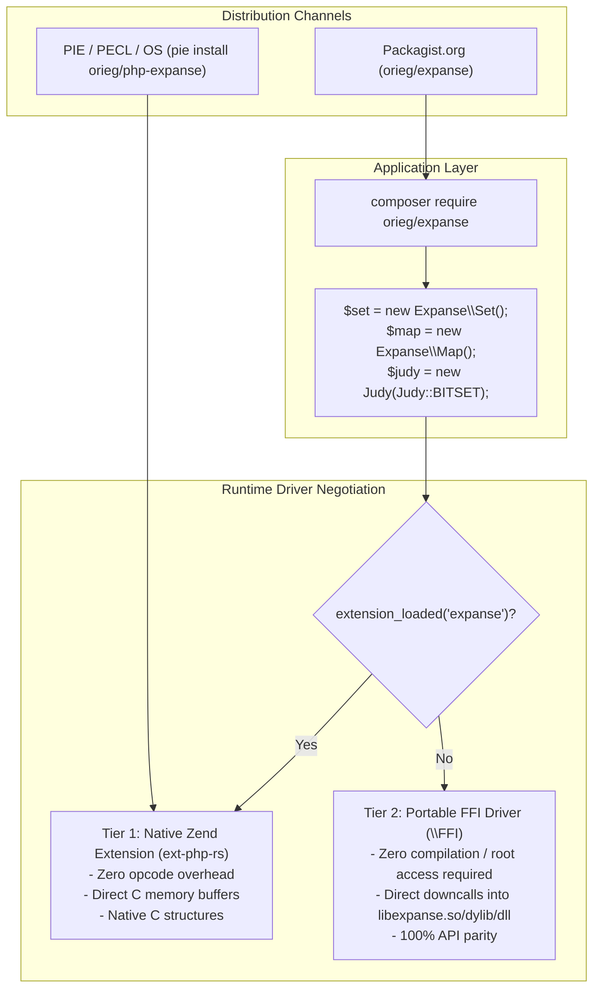

# PHP Bindings & Distribution Guide (`orieg/expanse`)

> Canonical documentation for Expanse PHP bindings, Composer / Packagist distribution, PIE Zend extension, and dual-driver runtime architecture.  
> Architecture: [ARCHITECTURE.md](ARCHITECTURE.md) · Packaging: [PACKAGING.md](PACKAGING.md) · CI Pipeline: [CI.md](CI.md)

`orieg/expanse` provides modernized, high-performance PHP bindings for **Expanse**, the clean-room, pure-Rust reimplementation of Judy arrays and digital trees modernized for modern 64-bit microarchitectures.

---

## 1. Overview & Dual-Driver Architecture

Expanse provides a **unified dual-driver architecture** for PHP 8.1–8.5+:



### Key Capabilities
- **Massive Memory Savings**: Consumes as low as **0.07–0.36 bytes/key** on clustered integer sets, compared to 32–64+ bytes/key for PHP's native associative arrays and `SplFixedArray`.
- **Zero-Copy Native Zend Engine Execution**: Compiles into a native PHP extension via `ext-php-rs` for maximum throughput.
- **Zero-Install Portable Fallback**: When compiling native extensions is not possible (e.g. shared hosting, serverless environments, CLI utilities), the package seamlessly activates its `\FFI` fallback driver with identical contracts and zero application code changes.
- **1:1 `php-judy` Drop-in Parity**: Provides complete class and constant compatibility (`Judy::BITSET`, `Judy::INT_TO_INT`, `Judy::STRING_TO_INT`, `ArrayAccess`, `byCount`) to modernize legacy codebases without rewriting application logic.

---

## 2. Installation

### 2.1 Composer Package (Packagist.org)

Install the package in any PHP 8.1+ project:

```bash
composer require orieg/expanse
```

### 2.2 Native Zend Extension (Recommended for Production)

For maximum performance, install the native Zend extension via PIE (PHP Installer for Extensions) or PECL:

```bash
# Via PIE
pie install orieg/php-expanse

# Or compile from source in monorepo
cargo build --release -p expanse-php
# Add to php.ini: extension=expanse.so (or libexpanse_php.dylib / expanse_php.dll)
```

---

## 3. Data Structures & Usage

### 3.1 `Expanse\Set` (Sparse 64-bit Integer Set / Judy1)

`Expanse\Set` stores dynamic populations of 64-bit unsigned integers:

```php
use Expanse\Set;

$set = new Set();

// Insertion & Deletion
$set->add(42);
$set->add(100_000);
$set->remove(42);

// Point Lookups & Counts
$exists = $set->contains(100_000); // true
$count = count($set);              // 1

// Ordered Navigation in O(depth)
$first = $set->first();      // 100000
$next  = $set->next(50_000); // 100000
$last  = $set->last();       // 100000
$prev  = $set->prev(200_000);// 100000

// Rank and Select
$rank   = $set->rank(100_000); // Number of keys strictly below 100,000
$key    = $set->select(0);     // 0-th key in sorted order
$inSpan = $set->countRange(10, 200_000);

// Set Algebra
$s1 = new Set(); $s1->add(1); $s1->add(2);
$s2 = new Set(); $s2->add(2); $s2->add(3);

$union        = $s1->union($s2);     // [1, 2, 3]
$intersection = $s1->intersect($s2); // [2]
$difference   = $s1->diff($s2);      // [1]
```

### 3.2 `Expanse\Map` (Ordered 64-bit Key-Value Map / JudyL)

`Expanse\Map` maps 64-bit integer keys to 64-bit integer values:

```php
use Expanse\Map;

$map = new Map();

// Insert / Update
$map->set(1001, 500);
$map[1002] = 750; // ArrayAccess support

// Lookup & Removal
$val = $map->get(1001); // 500
$has = $map->has(1002); // true
$map->delete(1001);

// Ordered Traversal
[$firstKey, $firstVal] = $map->first();
[$nextKey, $nextVal]   = $map->next(1000);

// Foreach iteration
foreach ($map as $key => $value) {
    echo "Key: $key -> Value: $value\n";
}
```

### 3.3 `Expanse\StrMap` (String Key-Value Trie / JudySL)

`Expanse\StrMap` stores string keys with path-compressed trie nodes:

```php
use Expanse\StrMap;

$dict = new StrMap();
$dict->set("/users/profile", 101);
$dict->set("/users/settings", 102);

$id = $dict->get("/users/profile"); // 101
```

### 3.4 `Expanse\BytesMap` (Arbitrary Binary Key Map / JudyHS)

`Expanse\BytesMap` supports arbitrary binary strings (including embedded `\0` bytes):

```php
use Expanse\BytesMap;

$bytes = new BytesMap();
$binKey = "prefix\x00\xFF\x00suffix";
$bytes->set($binKey, 42);

$val = $bytes->get($binKey); // 42
```

### 3.5 `Expanse\BlobMap` (Large Payloads & Hot Metadata Filtering)

`Expanse\BlobMap` stores variable-length binary payloads with 32-bit hot metadata:

```php
use Expanse\BlobMap;

$blobs = new BlobMap();

// Inline mode (<= 7 bytes): zero heap allocations
$blobs->set(1, "small");

// Arena mode (> 7 bytes): hot metadata filterable without DRAM access
$blobs->set(2, "large JSON payload or serialized object data", hotMeta: 0x01);

$meta = 0;
$payload = $blobs->get(2, $meta);
$hotMeta = $blobs->getMeta(2); // 1
```

### 3.6 `Judy` (1:1 Legacy Drop-In Compatibility)

Modernize existing `php-judy` applications with zero code changes:

```php
$judy = new Judy(Judy::INT_TO_INT);

$judy[1] = 100;
$judy[2] = 200;

echo $judy[1]; // 100
echo count($judy); // 2

$first = $judy->first(); // 1
$next  = $judy->next(1); // 2
```

---

## 4. Git Subtree Subsplit & Packagist Distribution

The PHP package source lives in `bindings/php` in the monorepo and is automatically mirrored to [`github.com/orieg/php-expanse`](https://github.com/orieg/php-expanse) on every push to `main` and release tag `v*` via [`.github/workflows/subsplit.yml`](../.github/workflows/subsplit.yml).

Packagist.org tracks `orieg/php-expanse` to distribute the package under `orieg/expanse`.
