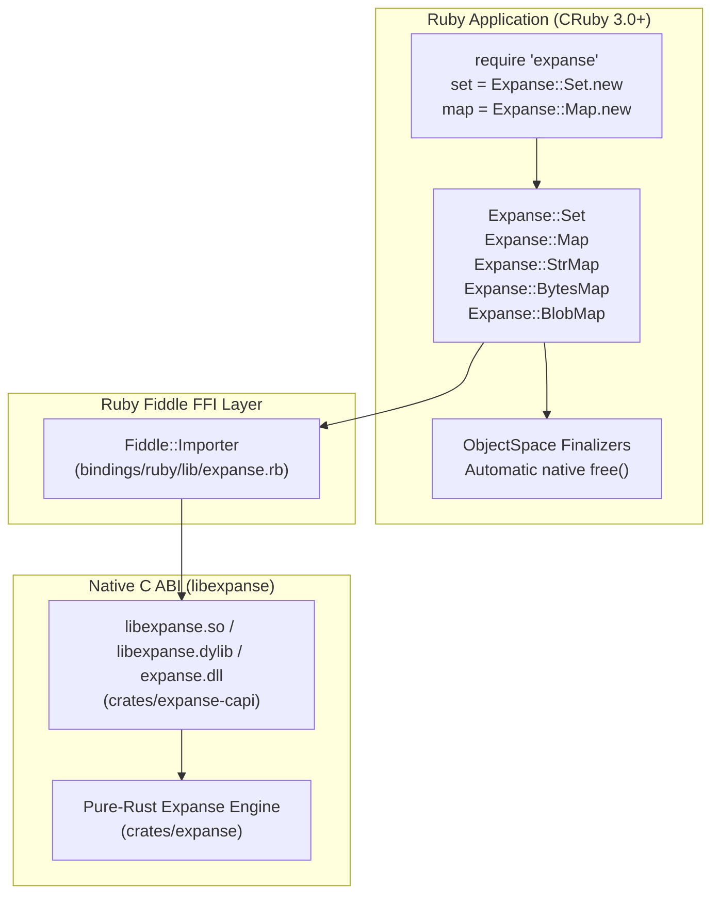

# Ruby Bindings & Distribution Guide (`expanse`)

> Canonical documentation for Expanse Ruby bindings, RubyGems distribution, and Fiddle FFI runtime architecture.  
> Architecture: [ARCHITECTURE.md](ARCHITECTURE.md) · Packaging: [PACKAGING.md](PACKAGING.md) · CI Pipeline: [CI.md](CI.md)

`expanse` provides modernized, high-performance Ruby bindings for **Expanse**, the clean-room, pure-Rust reimplementation of Judy arrays and digital tries modernized for 64-bit microarchitectures.

---

## 1. Overview & Architecture

Expanse provides idiomatic Ruby bindings utilizing the standard library's `Fiddle` (libffi wrapper) to interact with `libexpanse`:



### Key Capabilities
- **Massive Memory Savings**: Consumes as low as **0.07–0.36 bytes/key** on clustered integer sets, compared to 40+ bytes/key for Ruby's standard `Set` and `Hash`.
- **Zero-Compilation FFI Loader**: Uses Ruby's standard library `Fiddle` to dynamically discover and bind `libexpanse.dylib`, `libexpanse.so`, or `expanse.dll` without requiring local C compilers or native extension compilation during `gem install`.
- **Automatic Resource Management (RAII)**: Wraps native C pointers in `ObjectSpace.define_finalizer` hooks, ensuring native tree memory is freed when Ruby collection objects are garbage collected.
- **Full Enumerable Integration**: `Expanse::Set` and `Expanse::Map` include `Enumerable` for standard Ruby iteration (`each`, `map`, `select`, `reduce`).

---

## 2. Installation

### 2.1 From RubyGems
Add to your `Gemfile`:
```ruby
gem "expanse"
```

Or install via `gem`:
```bash
gem install expanse
```

### 2.2 Local Development in Monorepo
Build the native C ABI artifact and run the test suite:
```bash
# Build libexpanse
cargo build --release -p expanse-capi

# Run Ruby test suite
cd bindings/ruby
ruby -Ilib test/test_expanse.rb
# or: rake test
```

---

## 3. Data Structures & Usage

### 3.1 `Expanse::Set` (Sparse 64-bit Integer Set / Judy1)

`Expanse::Set` stores dynamic populations of 64-bit unsigned integers:

```ruby
require "expanse"

set = Expanse::Set.new

# Mutations
set.add(10)
set.add(42)
set.add(100)
set << 1000

# Lookups & Inquiries
set.include?(42)   # => true
set.include?(999)  # => false
set.size           # => 4
set.empty?         # => false

# Ordered Navigation (O(depth))
set.first          # => 10
set.last           # => 1000
set.next(42)       # => 100
set.prev(42)       # => 10

# Rank and Select
set.rank(42)       # => 1 (count strictly below 42: 10)
set.select(2)      # => 100 (0-based index)
set.count_range(10, 42) # => 2

# Enumerable Iteration (Strictly Ascending Order)
set.each do |key|
  puts "Element: #{key}"
end

# Deletion & Clearing
set.delete(42)     # => true
set.clear
set.size           # => 0
```

### 3.2 `Expanse::Map` (Ordered 64-bit Key-Value Map / JudyL)

`Expanse::Map` maps 64-bit integer keys to 64-bit integer values:

```ruby
map = Expanse::Map.new

# Insert & Update
map[10] = 100
map[20] = 200
map[30] = 300

# Access
map[10]            # => 100
map[99]            # => nil
map.key?(20)       # => true

# Ordered Navigation
map.first          # => [10, 100]
map.next(10)       # => [20, 200]

# Enumerable Iteration
map.each do |key, val|
  puts "#{key} => #{val}"
end

# Deletion
map.delete(10)     # => 100
map.size           # => 2
```

### 3.3 `Expanse::StrMap` (String Key-Value Trie / JudySL)

`Expanse::StrMap` indexes variable-length string keys into 64-bit integer values using digital trie branching:

```ruby
strmap = Expanse::StrMap.new

strmap["alpha"] = 1
strmap["beta"]  = 2
strmap["gamma"] = 3

strmap["beta"]     # => 2
strmap.key?("alpha") # => true
strmap.delete("alpha") # => 1
strmap.size        # => 2
```

### 3.4 `Expanse::BytesMap` (Arbitrary Binary Key Map / JudyHS)

`Expanse::BytesMap` supports arbitrary binary strings, including binary buffers containing embedded null bytes (`\x00`):

```ruby
bytesmap = Expanse::BytesMap.new

k1 = "\x00\x01\xFE\xFF".b
k2 = "\xFF\xFE\x01\x00".b

bytesmap[k1] = 42
bytesmap[k2] = 84

bytesmap[k1]       # => 42
bytesmap.delete(k1) # => true
```

### 3.5 `Expanse::BlobMap` (Large Payloads & Hot Metadata)

`Expanse::BlobMap` maps 64-bit integer keys to arbitrary variable-length byte payloads with 32-bit hot metadata:

```ruby
blobmap = Expanse::BlobMap.new

# Insert with optional hot_meta (e.g. TTL, flags, tenant id)
blobmap.set(100, "hello world", hot_meta: 1234)
blobmap.set(200, "payload data", hot_meta: 5678)

# Retrieve payload string and hot metadata integer
payload, meta = blobmap.get(100)
# => payload = "hello world", meta = 1234

blobmap.key?(100)  # => true
blobmap.delete(100) # => true
blobmap.size       # => 1
```

---

## 4. Packaging Layout

The Ruby bindings live in `bindings/ruby`:
- `bindings/ruby/lib/expanse.rb`: Pure Ruby FFI implementation using `Fiddle`.
- `bindings/ruby/expanse.gemspec`: RubyGem package specification.
- `bindings/ruby/Rakefile`: Standard Rake test task definition.
- `bindings/ruby/test/test_expanse.rb`: Comprehensive `minitest` test suite.
