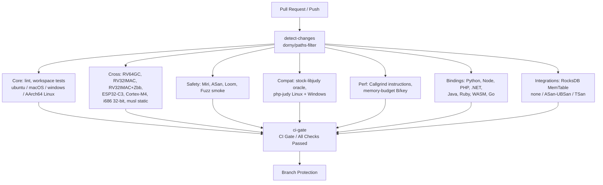

# Continuous Integration (CI) Architecture & Guidelines

> Canonical CI/CD documentation for Expanse (job catalog, rollup gate, regression gating, and the org-wide engineering standards the pipeline is built on).
> Design & Architecture: [ARCHITECTURE.md](ARCHITECTURE.md) · Testing Layers: [TESTING.md](TESTING.md) · Performance Discipline: [BENCHMARKING.md](BENCHMARKING.md) · Compatibility Gates: [COMPAT.md](COMPAT.md) · Release & Packaging: [PACKAGING.md](PACKAGING.md)

Expanse is a drop-in replacement for the 20-year-old C `libjudy` library, with bindings across many language ecosystems. It leans on `unsafe` Rust, optimistic concurrency, low-level bit manipulation and precise C ABI compatibility. The CI pipeline is therefore a layered verification harness: each job enforces a correctness, memory-safety, or performance invariant.

---

## 1. CI Pipeline Overview

Every ready pull request, and the daily scheduled run on `main`, executes a matrix of parallel checks defined in [`.github/workflows/ci.yml`](../.github/workflows/ci.yml). The branch ruleset (`main-protection`) requires exactly **one** status context — **`CI Gate / All Checks Passed`** — a rollup (`ci-gate`) that `needs:` every other job and fails if any of them failed or was cancelled. Because a job omitted from that rollup would fail open (its result unobserved), completeness is asserted in **two** places:

- the `lint` job runs `python3 scripts/check_ci_gate.py`, and
- the `ci-gate` job's own **self-check** step parses `ci.yml`, builds the set of job ids, and fails if any id (other than `ci-gate`) is missing from `ci-gate`'s `needs:`.

Because the ruleset requires only the rollup context, renaming a *non-gate* job does **not** require editing branch protection (the self-check guards completeness); only renaming `ci-gate` itself would. A push to `main` and a draft pull request run the fast lane only (§3, *The fast lane and the runner budget*). Scheduled **Nightly** workflows ([`nightly.yml`](../.github/workflows/nightly.yml)) run the deep fuzzing and full-suite Miri validation out of band.

**What triggers a run, and what it compares against.** `ci.yml` triggers on pushes to `main` and on pull requests **targeting `main`** — a pull request opened against any other branch, such as a second increment stacked on the branch holding the first, runs no jobs and produces no instruction counts. Each Callgrind job benches the **merge base** with the PR's base ref and compares the head against that, so CI answers "head versus `main`" and nothing else: comparing one increment against the increment before it is a local measurement, on the architecture whose counts the claim is stated in.



---

## 2. Job Catalog (rolled up by the CI Gate)

`ci.yml` defines **47 jobs** — 46 verification jobs plus the `ci-gate` rollup. They are grouped below by role. Each job gates on `detect-changes` so an unaffected subsystem's job cleanly skips (counting as passing) on a scoped PR, while the daily `schedule` and `workflow_dispatch` runs on `main` run everything. Every job other than `detect-changes`, `lint`, `docs-lint` and `ci-gate` also needs `fast-lane`, and skips with it.

> `bench-baremetal` appears in the Performance table below for completeness but lives in `bench_baremetal.yml`; it is `/bench`-triggered and is **not** one of `ci-gate`'s dependencies.

### Change detection
| Job | Name | Role |
|---|---|---|
| `detect-changes` | Subsystems / Change Detection | On a push to `main`, first sets `push-verified` (`scripts/push_tree_verified.py`): true only when the pushed tree is the merged pull request's head tree and that head's latest full run succeeded. On a pull request, first force-cancels that pull request's older unfinished runs (`scripts/ci_supersede.py`; see *Concurrency hygiene* in Appendix A). `dorny/paths-filter@v4` then computes per-subsystem outputs (`rust-src`, `tooling`, `perf-tooling`, `concurrency-instrument`, `visualizer`, `python`, `node`, `dotnet`, `java`, `ruby`, `php`, `wasm`, `go`, `integrations`, `esp-component`) that downstream jobs gate on, then runs `scripts/ci_job_diff.py` to add `ci-workflow-all` and `changed-jobs` — which `ci.yml` job definitions this diff touched. |

### Core
| Job | Name | Role |
|---|---|---|
| `lint` | Core / Linter & Formatting | `cargo clippy --workspace --all-targets -- -D warnings`, `cargo fmt --all --check`, plus repo-consistency scripts: `bump_version.py --check` (multi-ecosystem version lockstep), `check_abi_parity.py` (C ABI symbol parity across bindings — Java, .NET and Go by symbol name, Python and Node by a per-symbol `// abi-parity: <symbol>` marker at the implementing site, never by a generic word — and pinned symbol floor ≥100), `check_deletion_rationale.py` (fail unrationalized file deletions vs base ref), `check_test_floors.py` (workspace test count floor ≥300), `check_ci_gate.py` (gate completeness), `check_miri_shards.py` (nightly Miri shard census: every lib test in exactly one shard, every integration target listed or `#![cfg(not(miri))]`), `check_bench_suites.py` (the `/bench` suite manifest against the workflow, the docs table, the crate `[[bench]]` targets, and each callgrind suite's `arms` declarations against the `library_benchmark_group!`s its bench source declares), `check_bench_shapes.py` (every timed harness declares its 11-field workload shape, and the generated audit table matches), `check_chart_themes.py` (shared chart CSS identical across the five suite `theme.py` copies; per-suite accents declared in `DIVERGENT`), `check_chart_layout.py` (generated charts: no text or bar overflowing its card, no text collision, no bar population pinned at a scale floor or ceiling), `check_bench_pin.py` (every `docs/benchmarks/*/run.sh` and every wall-clock workflow step sources `scripts/bench_pin.sh`, so a benchmark on the hybrid reference host cannot run without a core pin — #639), and the `--self-test` suites of `perf_report.py`, `bench_report.py`, `check_docs_hygiene.py`, `check_bench_suites.py`, `check_man_pages.py`, `check_man_examples.py`, `check_abi_parity.py`, `check_deletion_rationale.py`, `check_test_floors.py`, `check_chart_themes.py`, `check_chart_layout.py`, `check_bench_pin.py` (so the §8.1 fail-loud and §8.2 no-hardcoded-prose assertions cannot rot). |
| `test` | Core / Workspace Tests (ubuntu / macOS / windows) | `cargo test --workspace --exclude expanse-php` across the three host OSes (glibc, Mach-O, PE/COFF ABI), with `PROPTEST_CASES=500` (AGENTS.md §5 gate 4). `expanse-php` needs PHP headers and is covered by `test-php` / `php-judy-*`. A second step, `scripts/test_occ_stats.sh`, runs every test that exists only with the `occ-stats` feature: the integration targets whose crate-level `cfg` names it (discovered, so a new one cannot be left out) and the lib tests, single-threaded because the counters are process-global. It fails if any binary runs zero tests. `scripts/test_diag_entry.sh` then runs the `diag-entry` entry points' counter tests (`sync::diag_entry_tests`, both features on, single-threaded) and fails when the filter matches none. A further step builds the Hypothesis D **inverse** ablation features (`ablation-unsharded-alloc`, `ablation-unpadded-lock`, `ablation-unstriped-freelist`; `docs/benchmarks/concurrency/METHODOLOGY.md` §11) — every arm is a production default now, so each feature restores the state its mechanism replaced and keeps the default ablatable (AGENTS.md §2.7) — and runs their `ablation_` unit tests (failing if the filter matches none) and `tests/test_concurrency_ablations.rs`. |
| `test-aarch64` | Core / AArch64 Linux Tests & Callgrind (Neoverse N2) | `ubuntu-24.04-arm` native execution — hardware capability census (`lscpu`, `/proc/cpuinfo`, sysfs cache-line size), asserted rather than printed so a fleet rotation fails instead of silently invalidating `docs/HARDWARE.md` §2.6; full workspace tests (`PROPTEST_CASES=500`), C ABI drop-in verification, C++20 header tests, and a Callgrind instruction **regression gate** on AArch64: on pull requests the job benches the merge base (`--save-baseline=aarch64_smoke_base`, non-fatal), compares HEAD against it, and runs the same `perf_report.py --fail-on-regression --max-regression-pct 5.0` guard as `callgrind-smoke`, with the same `allow-regression: <reason>` override. NEON kernels already execute under the `test` job's `macos-latest` runner, which is arm64; what this lane adds is AArch64 **Linux/glibc** execution and Callgrind, which cannot run on macOS. |
| `man-examples` | Docs / Man Page Examples Compile and Match | Builds the C ABI, compiles each man page's `EXAMPLES` program against it, runs it, and diffs stdout against the `Example Output` block the page documents. `check_man_pages.py` validates form (troff hygiene, symbol coverage) and cannot tell whether the prose is true — it passed a page whose example printed the 3rd key while claiming the 2nd. Compiling alone would not have caught it either: the wrong program compiled and exited 0. Pinning the output is what makes it a gate. |
| `supply-chain` | Core / Supply Chain (advisories, licences, sources) | `cargo deny check advisories bans licenses sources --all-features` against `deny.toml`. `expanse-trie` has no runtime dependencies, so the graph is small and the gate is cheap to keep green -- which is the argument for keeping it fail-closed rather than advisory: the project ships to seven package registries, and a new advisory is cheaper to see here than at publish time. The licence arm is not hygiene: Expanse is a clean-room reimplementation of an LGPL library (AGENTS.md §3), so a copyleft licence entering the dependency graph is a fact the project needs to see rather than absorb, and `deny.toml`'s `allow` list is exhaustive rather than a catch-all for that reason. Ignored advisories are listed individually with the path that reaches them, never suppressed by category, so a *new* unmaintained crate still fails. Gated on `rust-src` (which carries `Cargo.toml` and `Cargo.lock`) or `tooling` (which carries `deny.toml`); the policy file is deliberately kept out of `rust-src` so a policy edit does not wake Miri, ASan, fuzz and Callgrind (#412). |
| `public-api` | Core / Public Rust API Surface | `scripts/check_public_api.py` diffs the public Rust surface of `expanse-trie`, as `cargo public-api --simplified` renders it, against the committed snapshot in `.github/public-api/`. `check_abi_parity.py` pins the C symbols; nothing pinned the Rust surface, which is what a crates.io consumer compiles against — and that is how `ExpanseBlobMap::arena_mut` and `DomainOrdinal::new` reached a published release with no caller, no test and no documented contract (#763, #797). The gate is symmetric, and the reverse direction is the one that costs users: an accidental removal or signature change fails here too. It is a snapshot diff, not a semver classifier — it makes a surface change a reviewable line in the pull request and leaves the major/minor judgement to a reviewer, against the Cargo 0.x rule that `^0.6` spans every 0.6.x. A deliberate change is regenerated with `python3 scripts/check_public_api.py --write` and committed. Runs on a pinned nightly (`cargo public-api` reads rustdoc JSON, which is nightly-only) so a rustdoc format change lands as one deliberate regeneration rather than a surprise red run. Gated on `rust-src` or `tooling`. |
| `msrv` | Core / MSRV 1.88 Build | `cargo check --workspace --exclude expanse-php --all-targets` on the pinned floor toolchain (`dtolnay/rust-toolchain@1.88.0`). Every other job builds on `stable`, which never exercises `rust-version`. |
| `docs-lint` | Docs / Hygiene (time estimates, PII, provenance) | `scripts/check_docs_hygiene.py` over tracked markdown **and the PR body**: fatal on time estimates (§6) and on home-directory paths / private LAN IPs / denylisted hostnames (§7); advisory warning on a document that publishes unit-bearing numbers while carrying no `(measured: …)` provenance tag anywhere (§8.7 — file-scoped on purpose: the suite READMEs state provenance once in a header covering every table below, so a proximity rule would flag them and train readers to ignore the warning). Unconditional by design: the sweep reads `git ls-files`, i.e. the whole tree, so a diff-scoped filter cannot bound it, and a docs-only PR is therefore never a zero-check PR. Hostnames come from the `DOCS_HOSTNAME_DENYLIST` repository **secret** — never committed, and a secret rather than a variable because Actions echoes job `env:` values into the public run log and only secrets are masked. Fork PRs get no secrets, so the hostname check skips there and says so. On pull requests the job also runs the `orieg/discipline` action, pinned to a release tag — not on the push to `main`, because a squash merge's commit message is built from the branch's commits rather than the PR body, so the body's waiver lines are absent there — with the gates `discipline.toml` enables: assertion reduction, tests that cannot fail, newly ignored tests, `// SAFETY:` placeholders and deletions, stub bodies, proptest/fuzz budget ratchets, dependency and lockfile deltas, loosened lint or compiler configuration, weakening of `discipline.toml` itself, an edit to `AGENTS.md` or invisible Unicode in an added line (an `AGENTS.md` edit needs `allow-agent-instructions: AGENTS.md <reason>` in the PR body), a new empty error handler or discarded fallible result outside tests (`error-swallowing`, at `error` since the v0.10.2 pin — a Rust `let _ = <call>` on a callee that is neither known-fallible nor a known accessor is `Value Discarded` at `warning` and never blocks alone), and — diff-scoped, so the whole-tree sweep above is not duplicated — time estimates, PII, shell secrets, deletion rationale, and the rollup-closure and failure-masking rules over `ci.yml` (`ci-integrity`; a deliberate `\|\| true` takes `# discipline:allow(ci-integrity)` on its line). Two more report at `warning`, which does not fail the job: `suppression-delta` and `pr-checklist` (a ticked box the diff does not support — the §7 truthfulness rule). `ci-skip-set` is enabled but reports "not evaluated" here: it replaces `check_gate_floor.py` only when it runs inside `ci-gate` with the `needs` context. `provenance-tags`, `test-floor` and `bench-regression` stay off, each for a reason stated in `discipline.toml`. A configuration change or a new pinned release is measured first with `scripts/discipline_replay.py`, which rebuilds each merged pull request on a base carrying the configuration under test and runs the binary with that pull request's body (`--last N`, or `--since <ref>` for the commits after a fixed base); a case it cannot rebuild, or a discipline exit other than 0 or 1, makes it exit 2 rather than count as a pass. |
| `fast-lane` | Core / Fast Lane Passed | The one decision point for the slow lanes: every job other than `detect-changes`, `lint`, `docs-lint` and `ci-gate` lists it in `needs`, so when it is skipped they all skip. It runs when `lint` passed or was skipped, `docs-lint` passed, the pull request is not a draft, and the event is not a push whose `push-verified` is true. `scripts/check_ci_filters.py` fails when a job omits it from `needs` or when its `if:` loses one of those clauses; `scripts/check_gate_floor.py` judges its result (§3). |

### Cross-compilation & 32-bit
| Job | Name | Role |
|---|---|---|
| `test-riscv64` | Cross / RV64GC Cross-Compile (Linux) | `riscv64gc-unknown-linux-gnu` build. |
| `test-rv32` | Cross / RV32IMAC Cross-Compile (Bare-Metal) | `riscv32imac-unknown-none-elf` `#![no_std]` check, once with default features and once with the three ablation features, which are public and additive and so must build without `std`. |
| `test-rv32-zbb` | Cross / RV32IMAC + Zbb Cross-Compile (Bare-Metal) | Same target with the `Zbb` bit-manipulation extension enabled. |
| `test-esp32c3` | Cross / ESP32-C3 Cross-Compile (Bare-Metal RV32IMC) | `riscv32imc-unknown-none-elf` `#![no_std]` check. |
| `test-cortex-m` | Cross / ARM Cortex-M4 Cross-Compile (Bare-Metal) | `thumbv7em-none-eabihf` `#![no_std]` check; C ABI staticlib build; links both STM32H747 harness images (`integrations/stm32h747/build.sh`) with `arm-none-eabi-gcc -mfloat-abi=hard` and asserts the `Tag_ABI_VFP_args` tag — the ARM linker rejects a soft/hard mismatch, so the link is the float-ABI assertion. Runs on `rust-src` or `integrations` changes. |
| `test-qemu-cortex-m3` | Cross / ARM Cortex-M3 Execution (QEMU mps2-an385) | The ARM execution gate without hardware (#598 step 4): builds the C ABI staticlib for `thumbv7m-none-eabi` (soft float), links `integrations/qemu-cortex-m3/smoke.c` and runs it under `qemu-system-arm -M mps2-an385` with semihosting; the smoke exercises the narrow map/set surface, ordered iteration, `remove_range`, and the `sync32` protocol with a SysTick reader against a churning writer (any wrong value fails). Not cycle-accurate and cacheless: the M7/M4 numbers stay a hardware measurement. Runs on `rust-src` or `integrations` changes. |
| `test-x86_64-none` | Cross / x86_64 Bare-Metal Cross-Compile (x86_64-unknown-none) | `x86_64-unknown-none` 64-bit `#![no_std]` core engine check. |
| `test-i686` | Cross / i686 32-bit Test Execution (Linux) | `i686-unknown-linux-gnu` — the only host-runnable 32-bit target; runs the real 32-bit trie test suite, the `expanse-capi` narrow-surface tests, the `-m32` C smoke, and the 32-bit-only man pages' EXAMPLES programs via `check_man_examples.py --narrow` against the i686 cdylib. |
| `test-musl` | Cross / Musl Static C ABI (Linux) | `x86_64-unknown-linux-musl` static build, zero glibc leak. Retained as a deliberate concurrency diversity property: musl's distinct allocator geometry, scheduling, and static linkage widen race windows that glibc's timing hides (e.g. issue #477 surfaced on musl while passing glibc). |

### Safety
| Job | Name | Role |
|---|---|---|
| `miri` | Safety / Tier 1 Miri Fast Smoke (1 of 2, 2 of 2) | Fast per-PR Miri smoke over the unsafe core (UB, provenance, Stacked/Tree Borrows), as a two-shard matrix (§5), plus the `ablation_` unit tests with the three ablation features on (shard 2). |
| `test-asan` | Safety / ASan Core Smoke (Ubuntu) | `-Zsanitizer=address` build-std smoke on the core (the lib and every integration-test target but the docs/data-sync ones named in `ASAN_EXCLUDED_TESTS`, see §6), and `tests/test_concurrency_ablations.rs` with the three ablation features on. |
| `writer-scaling-selftest` | Perf / Writer Scaling Instrument Self-Test | `docs/benchmarks/concurrency/scripts/writer_scaling.py --self-test`, which nothing else runs. That script decides every multi-writer C(W) verdict published in `docs/benchmarks/concurrency/README.md` and the #900 ordered-read verdicts (P12.4, P12.5 in `docs/benchmarks/concurrency/METHODOLOGY.md` §12), and its self-test covers the counter identities, the fallback-cause partition, the verdict rules, the ordered-read schedule and pin refusal, the `perf c2c` pass's measured-window control (perf `--delay=-1 --control=fifo:` and the harness FIFO flags on the recorded command, the window scope in the artifact's c2c block), and the fail-loud paths (a missing `perf`, a failed `perf c2c`) that exist so a broken sweep cannot report a number (§8.1). Gated on the narrow `concurrency-instrument` filter — the driver script and the harness example it builds and parses — because the self-test builds that harness twice, and those two files are the only ones that can break the contract. Deliberately not run on `main` pushes for the same reason. |
| `ycsb-concurrent-selftest` | Perf / YCSB Concurrent Instrument Self-Test | `docs/benchmarks/concurrency/scripts/ycsb_concurrent.py --self-test`: the registered family blocks, the three-way gate verdicts and direction labels, pairing by `round`, every void rule read from what the harness reports, the schedule check, role separation between the throughput and `occ-stats` builds, the artifact's shape (no `latency` or `pmu` section unless a pass wrote one) judged by `check_bench_provenance.findings_for` with no grandfather entry, the `--quick` output guard, and one real family block through both builds (`METHODOLOGY.md` §20.12). Gated on `ycsb-concurrent-instrument`, which names the harness, its shared module under `benches/ycsb_concurrent_common/`, and every `scripts/` module the driver imports. |
| `loom` | Safety / Loom Concurrency Race Model | `--cfg loom` permutation model-checking of the OCC seqlock and EBR; a second pass enables `ablation-striped-epoch` and `ablation-unstriped-freelist`, which adds the striped-bin models (`MAX_WRITER_SLOTS` is 2 under Loom) and exercises the reclaim-side freelist push inside `try_advance` for retired raw-class blocks under concurrent Loom schedules (no Loom model calls `pop_freelist`; alloc-side stripe routing via `writer_slot` is residual coverage owned by unit tests like `ablation_striped_freelist_routes_by_stripe` and Miri); a third pass enables `diag-entry` and runs `loom_diag_entry_probe_excludes_and_drains`, the diagnostic probe on the production gate, slot and lock entry points against `quiesce_writers`, failing if the filter matches none. |
| `miri-ub-sites-pr` | Safety / Miri UB-site census subset (Sync*) | The per-PR subset of the nightly Miri UB-site census ([#1086](https://github.com/orieg/expanse/issues/1086)): `scripts/miri_ub_sites.py --check` at seed 0 over the workloads that drive every shared helper (`map_tree_churn_reader_writer`, `map_branchu_reader_writer`, `str_covered_reader_writer`, `bytes_exclusive_reader_writer`), under the race detector and both aliasing models, on the manifest's toolchain and `macos-latest` target. A shared path that regresses fails on its own PR; the full seed range and every workload stay nightly. |
| `fuzz-smoke` | Safety / Fuzz Invariants Smoke | libFuzzer smoke (60 s/target) over every target registered in `fuzz/Cargo.toml` (discovered via `cargo fuzz list`, never hand-listed; a self-check step fails the job if `fuzz/fuzz_targets/*.rs` and the `[[bin]]` registrations differ) — currently 8: `set_ops`, `set_algebra`, `map_ops`, `bytesmap_ops`, `strmap_ops`, `blobmap_image_corrupt`, `set32_ops`, `map32_ops`. |

### Compatibility
| Job | Name | Role |
|---|---|---|
| `differential-oracle` | Compat / Stock libjudy Oracle (Linux) | Black-box differential testing of `libexpanse` vs stock C `libjudy` via `dlopen`. |
| `php-judy-compat` | Compat / PHP-Judy Extension (Linux) | Builds `php-judy` (pinned SHA) against `libexpanse.so`, runs the upstream suite. |
| `php-judy-windows` | Compat / PHP-Judy Extension (Windows x64) | Same against `expanse.dll` under MSVC. |

### Performance
| Job | Name | Role |
|---|---|---|
| `instruction-counts` | Perf / Callgrind Deterministic Instructions | Valgrind/Callgrind instruction counting + `scripts/perf_report.py` regression guard. |
| `callgrind-smoke` | Perf / Callgrind Fast Smoke (Ubuntu) | Fast scaled-down (<20s) Callgrind instruction regression smoke gate ($N = 10,000$). |
| `memory-budget` | Perf / Memory Budget Invariants | Runs `examples/bytes_per_key.rs` and `examples/bytes_per_key_32.rs`; fails if deterministic B/key exceeds architectural ceilings. |
| `bench-baremetal` | Perf / Remote Bare-Metal Benchmarks | Triggered via `workflow_dispatch` or `/bench` / `/bench extended` / `/benchmark <suite>` PR comments. The suite vocabulary is declared once in [`.github/bench-suites.json`](../.github/bench-suites.json) and tabulated in [`docs/BENCHMARKING.md` §3](BENCHMARKING.md#3-triggering-via-pr-comment); a separate hosted `resolve` job matches the argument as a whole token, refuses an unrecognised one by name without starting any run, and publishes the resolved suite as the job output that both the bench job and its `concurrency` group read. Dual-pass baseline drift reporting, Callgrind profiling, and multi-arch / population sweeps on the dedicated bare-metal reference host. Takes the host-wide bench lock (exit 75 if held), captures a system-load snapshot into the report, derives an anonymized host description from the runner, fails fast when a Callgrind suite lacks `valgrind`/`iai-callgrind-runner`, and only prints a `Base Ref` when the base pass actually produced comparable output. **Comment identity is per suite** (`<!-- expanse-bench:<suite> -->`), so two suites on one PR own two comments; the result step is `if: always()` and terminates its own comment with the actual cause (lock holder, missing Callgrind tooling, build/bench failure, cancellation) rather than leaving a `⏳` marker; a run with no numbers keeps the previous result for that suite in a collapsed block. A `concurrency:` group keyed on PR + suite supersedes an in-flight run of the same suite, and `timeout-minutes: 180` bounds how long a wedged run can hold the shared host. |

### Bindings
| Job | Name | Role |
|---|---|---|
| `test-python` | Bindings / Python Fast Smoke (Py3.12) | PyO3 binding smoke. |
| `test-node` | Bindings / Node.js (matrix) | napi-rs addon: Node 20, 22 and 24 on Linux, Node 24 only on macOS and Windows. |
| `test-php` | Bindings / PHP (matrix) | FFI binding: PHP 8.2, 8.3 and 8.4 on Linux, PHP 8.4 only on macOS and Windows. |
| `test-dotnet` | Bindings / .NET (matrix) | P/Invoke binding tests. |
| `pack-dotnet` | Bindings / .NET NuGet Package | Packs the `Orieg.Expanse` `.nupkg`. |
| `test-java` | Bindings / Java 22+ Panama (matrix) | Project Panama FFM binding tests. |
| `pack-java` | Bindings / Java JAR Package | Packages the self-contained multi-arch JAR and verifies bundled resource extraction. |
| `test-ruby` | Bindings / Ruby (matrix) | magnus / C ABI extension tests. |
| `test-wasm` | Bindings / WebAssembly (wasm32) | `wasm32` binding build/test. |
| `test-wasm64` | Bindings / WebAssembly (wasm64 Memory64 Experimental) | `wasm64-unknown-unknown` build-std check and Node.js Memory64 runtime smoke test. |
| `wasm-fuel` | Perf / WebAssembly Fuel (wasm32 + wasm64, deterministic) | Exact wasmtime fuel per arm for both wasm builds of `crates/expanse-wasm-fuel` via `scripts/wasm_fuel.py`, gated against `results/baseline_wasm_fuel.json` (single-worst > 5% or two arms over the 0.5% floor fails). Both targets are measured in steps of their own and gated together in a third, so a failed step says whether the build or the gate failed (§4.4). The Callgrind analogue for the wasm targets (#629). |
| `test-go` | Bindings / Go (matrix) | Go binding tests across CGO, purego (`CGO_ENABLED=0`), and explicit `-tags expanse_purego` on Linux, macOS, and Windows. |

### Integrations
| Job | Name | Role |
|---|---|---|
| `test-rocksdb-memtable` | Integrations / RocksDB MemTable (matrix) | Builds/tests `ExpanseMemTableRep` across `sanitizer: [none, asan-ubsan, tsan]` (TSan excluded on macOS) under all three seek lock scopes; includes a differential test vs reference structures (TSan lane too) and `test_memtable_park_points`, built with `-DEXPANSE_MEMTABLE_PARK_POINTS`, which forces the interleavings and handle lifecycles of the optimistic-seek arm's soundness gates (G-O3–G-O6, `docs/benchmarks/rocksdb_memtable/METHODOLOGY.md` §5.16). The `none` cells also compile both benches with the Makefile's warning flags and smoke their CLIs: `benches/bench_memtable.cc` through its `--arm memory` census and an unknown-arm refusal, and `benches/bench_memtable_concurrent.cc` through one `idle` cell read back by the driver's `parse_row` plus its `--mode` and unknown-argument refusals. Refusals are checked by diagnostic string, not exit code alone; no timing from either is read. |
| `rocksdb-locate-ir-bound` | Integrations / RocksDB Optimistic-Seek Callgrind Bound | The single-threaded bound of `docs/benchmarks/rocksdb_memtable/METHODOLOGY.md` §5.16: `docs/benchmarks/rocksdb_memtable/scripts/locate_ir_bound.py` builds the base twice (the control, which must match exactly) and the head in sibling worktrees, each with its own release `libexpanse`, runs one `bench_memtable --arm <phase>` process per phase under `valgrind --tool=callgrind --collect-atstart=no` with collection toggled to the timed loop, and compares inclusive `Ir` per `ExpanseMemTable` entry point against a 0.1% budget. It also checks that every TLS relocation in `expanse_memtable.o` lies in the handle lookup, and that no default-scope cell calls it or an `expanse_sync_map_reader_*` symbol. On a pull request the base is the PR head's merge base; the bound is fatal only when the change touches `integrations/rocksdb/src/expanse_memtable.cc` or its header, because inclusive `Ir` also counts `libexpanse`, and otherwise the table is reported with a notice. The table goes to the job summary and the artifact `rocksdb-locate-ir-bound`. |

### Rollup gate
| Job | Name | Role |
|---|---|---|
| `ci-gate` | CI Gate / All Checks Passed | Runs `if: always()`, `needs:` all 42 other jobs, treats skipped jobs as passing, and runs both the completeness self-check and `scripts/check_gate_floor.py` — which asserts the skip set is consistent with the filter outputs that were actually observed, so an all-false filter evaluation cannot render as a green gate over a run that verified nothing. The **only** required branch-protection context. |

---

### Workflows outside `ci.yml`

`ci.yml` carries every job the `CI Gate` rolls up. These are separate workflows and are
**not** part of that rollup, so none of them gates a PR:

| Workflow | Triggers | What it is |
|---|---|---|
| [`bench_baremetal.yml`](../.github/workflows/bench_baremetal.yml) | `workflow_dispatch`, `issue_comment` | the `/bench` and `/benchmark <suite>` lane on the self-hosted x86-64 host. A comment from a collaborator with write access runs the PR's head commit; a pull request from a fork is refused, because its author could push between the comment and the checkout. To benchmark one, push its head to a branch here or dispatch the reviewed SHA |
| [`bench_avx512.yml`](../.github/workflows/bench_avx512.yml) | `workflow_dispatch`, `issue_comment` | the AVX-512 kernel sweep; the reference host fuses AVX-512 off, so it needs the `avx512` runner. Fork pull requests are refused, as on `bench_baremetal.yml` |
| [`bench_aarch64.yml`](../.github/workflows/bench_aarch64.yml) | `workflow_dispatch` | the `domain` suite on `macos-latest` (aarch64-apple-darwin). Report-only: a shared hosted runner cannot resolve the provenance-check overhead, so no parity ratio may be quoted from it |
| [`codeql.yml`](../.github/workflows/codeql.yml) | `pull_request`, `schedule`, `workflow_dispatch` | CodeQL code scanning. A pull request analyses only the languages whose files it changes, and a docs-only one analyses none; the daily schedule analyses all nine on `main`. A push to `main` does not trigger it (§3, *The fast lane and the runner budget*). Java is analysed from a traced Maven build of `bindings/java` on JDK 22 and Go from autobuild; the other seven extract without a build |
| [`nightly.yml`](../.github/workflows/nightly.yml) | `schedule`, `workflow_dispatch` | full Miri, ThreadSanitizer, the Miri UB-site census, the nightly bench report |
| [`pages.yml`](../.github/workflows/pages.yml) | `push`, `workflow_dispatch` | builds and publishes the documentation site |
| [`python.yml`](../.github/workflows/python.yml) | `push` (tags), `release`, `schedule`, `workflow_dispatch` | the OS × Python test matrix (daily on `main`, and on tags), the wheel matrix and its publish path |
| [`release.yml`](../.github/workflows/release.yml) | `push`, `workflow_dispatch` | tagged release artifacts; after the GitHub Release anchor, one publish job per channel, including `publish-homebrew` (formula to `orieg/homebrew-tap`, Portfile as a release asset — [PACKAGING.md §2.15](PACKAGING.md)) |
| [`subsplit.yml`](../.github/workflows/subsplit.yml) | `push`, `workflow_dispatch` | pushes the read-only per-ecosystem subtree mirrors |

A benchmark whose host the `/bench` runner cannot be gets its own workflow rather than a
job inside `ci.yml`: a job there guarded by `if: github.event_name == 'workflow_dispatch'`
is unreachable, because `ci.yml` has no such trigger. That is not hypothetical — it
shipped that way and could never have run.


## 3. Scope-Based Fast Paths & Path Filtering

Turnaround stays low for non-code and localized PRs without losing required-check coverage:

- A single lightweight `detect-changes` job (`dorny/paths-filter@v4`) computes fifteen per-subsystem booleans: `rust-src`, `tooling`, `perf-tooling`, `concurrency-instrument`, `visualizer`, `python`, `node`, `dotnet`, `java`, `ruby`, `php`, `wasm`, `go`, `integrations`, `esp-component`. Every one of them is read by at least one job's `if:` — `scripts/check_ci_filters.py` fails if a declared output has no consumer, which is how the dead `docs` filter was found. Downstream jobs declare `needs: [detect-changes, fast-lane]` and `if: needs.detect-changes.outputs.<subsystem> == 'true' || github.event_name != 'pull_request'`; the second term runs a job on the scheduled and dispatched full runs, and `fast-lane` keeps it off pushes and drafts.
- **`rust-src` — "does Rust/C++ behaviour need re-verifying"**: `crates/**`, `include/**`, `tests/cpp/**`, `fuzz/**`, `Cargo.toml`, `Cargo.lock`, `rust-toolchain*`, `.github/actions/**`, plus `ci.yml` itself. It is the only filter that schedules the expensive safety lane (`miri`, `test-asan`, `fuzz-smoke`, `callgrind-smoke`) and the cross-compile matrix. It does **not** include `scripts/**`: no Rust job compiles or links a Python script. It also excludes `crates/expanse-hot-bench/**`, which is detached from the root workspace by its own `[workspace]` table and which none of the lanes this filter gates can compile (#671).
- **The step passes `predicate-quantifier: 'some-with-excludes'`, and that is load-bearing.** The action's default quantifier (`some`) reads a `!`-prefixed pattern as a picomatch negation OR'd with the others, so `rust-src`'s hot-bench exclusion meant "any path outside that crate" — true for essentially every diff. Path filtering for the Rust matrix was therefore inert from #671 (2026-09-04) until the quantifier was added: a docs-only PR skipped 37 of 40 jobs the hour before #671 merged and 0 of 69 after. Nothing failed, so nothing surfaced it. `scripts/check_ci_gate.py` now fails when a `!` pattern appears in a filter step without the quantifier, and pins the #671 pattern as its fail-then-pass case.
- **`tooling` — the repo guards**: `scripts/**`, `.github/workflows/**`, `.github/bench-suites.json`. Gates `lint`, which carries `bump_version.py`, `check_abi_parity.py`, `check_ci_gate.py`, `check_bench_suites.py` and the report-script self-tests. A PR that only edits the `/bench` suite manifest or `bench_baremetal.yml` therefore still runs the sync guard — without pulling in Miri, ASan, fuzz or Callgrind.
- **`perf-tooling` — the one real tooling↔Rust coupling, scoped to it**: `scripts/perf_report.py` and `scripts/bench_report.py` are executed by `instruction-counts`, `callgrind-smoke` and `test-aarch64`, so they gate those three jobs specifically rather than justifying `scripts/**` → everything.
- **`ci.yml` is no longer in `rust-src`; it is diffed per job instead.** The concern that put it there was right — an edit rewrites the build commands, flags, toolchains and `if:` gates of the safety jobs themselves, `main` is protected, and PR time is the sole place a broken or disabled safety job is observable before it lands. The glob was the coarse part: one entry stood in for 43 independent job definitions, so adding a step to `lint` woke Miri, ASan, loom, fuzz, Callgrind, every cross-compile lane and 34 binding checks. `scripts/ci_job_diff.py` loads the workflow at the base and head revisions and emits `changed-jobs`, so each job's `if:` can ask whether *its own* definition moved — the thing a path glob cannot express. It **fails closed**: an unparseable revision, an unreadable base, an added or removed job, or any change outside `jobs:` emits `ci-workflow-all=true`, which is the old whole-matrix behaviour, with a `::notice::` naming the reason. Running the matrix never proved a job had not been *removed*; `.github/ci-jobs.txt` does, checked by `check_ci_filters.py` the way `check_public_api.py` checks the Rust surface. `nightly.yml` and `bench_baremetal.yml` carry no such risk for `ci.yml`'s jobs and sit in `tooling` only.
- `integrations/**` is C++ outside the cargo workspace, built by exactly one job (`test-rocksdb-memtable`) and already covered by the `integrations` filter, so it is not part of `rust-src`.
- A PR touching only `docs/**`, `*.md` or `website/**` matches no Rust job and skips the Rust matrix entirely — but it does run `docs-lint`, which is unconditional, so a docs-only PR is never a zero-check PR. (This held before #671 and holds again with the quantifier in place; between the two it did not, and #776 is the worked example — 7 files, no Rust, 69 jobs, 0 skipped.)
- Known residual: `check_bench_suites.py` also asserts the generated table in `docs/BENCHMARKING.md`, but `lint` is not gated on `docs/**`, so a docs-only edit to that table is checked by the next PR that touches `rust-src` or `tooling` rather than by its own.
- **The fast lane and the runner budget.** GitHub-hosted runners are capped per account, not per repository: every repository on the account shares one pool of concurrent jobs, and one of five for macOS ([Actions limits](https://docs.github.com/en/actions/reference/limits)). A full run of this workflow is ~72 jobs, 13 of them macOS, so each run fills the pool and queues every other repository's jobs behind it. Four rules keep that down:
  - *Slow lanes wait for the fast lane.* `lint` and `docs-lint` (which carries the `orieg/discipline` gates) run first; `fast-lane` succeeds only when both passed (`lint` may skip), and every other job needs it. A run that fails lint or discipline takes three runners, not seventy.
  - *A draft pull request runs the fast lane only.* `ci-gate` fails on a draft, naming the reason, so a draft never shows a green required context; `ready_for_review` is among the `pull_request` trigger types and starts the full run. Open a pull request as a draft while iterating.
  - *A push to `main` runs the fast lane only when it lands a tree CI already passed in full.* The ruleset does not require a pull request to be up to date before it merges (`strict_required_status_checks_policy` is `false`), so a squash merge behind `main` lands a tree that no run built; of the 40 pull requests merged before this rule, 23 did. `detect-changes` therefore sets `push-verified` (`scripts/push_tree_verified.py`): true only when the pushed tree is byte-identical to the merged pull request's head tree **and** that head's latest full run succeeded. Any other push — a different tree, no associated pull request, an API error — runs every lane. The full matrix also runs on `main` on the daily `schedule` and on `workflow_dispatch` (`gh workflow run ci.yml --ref main`), whose concurrency group carries the event name so it never shares a group with the push run of the same commit. CodeQL and the `python.yml` test matrix run on the daily schedule rather than on any merge, verified or not. A release never rests on a fast-lane-only push run: `release.yml`'s gate requires a `ci.yml` run on the tagged commit whose `fast-lane` job succeeded, and dispatches one when none exists (`scripts/release_ci_gate.py`, `docs/PACKAGING.md`).
  - *Version axes run on Linux.* `test-node` and `test-php` test every supported version on Linux and the newest on macOS and Windows.
  `check_gate_floor.py` checks the fast lane's outcome in `ci-gate`: on a verified push it and every gated job must have skipped, and on any other push it must have succeeded; on a draft the gate fails; on any other event it must have succeeded, or the gate fails because no slow lane ran. A gated job is judged by its own `if:` only when the fast lane succeeded.
- The `CI Gate / All Checks Passed` rollup satisfies branch protection once its dependencies conclude (skipped jobs count as passing), so PRs never deadlock in "Pending" behind a filtered-out check.

---

## 4. Performance Regression Guard & Deterministic Benchmarking

### 4.1 Why deterministic instruction counting
Wall-clock timing on shared cloud runners exhibits large multi-tenancy / thermal / hyperthread noise, causing false-positive failures. The `instruction-counts` job instead counts **instructions retired** (and cache accesses) via Valgrind/Callgrind, which is deterministic on x86-64 Linux: the same commit yields the same instruction count on any runner, so changes as small as `0.1%` reflect real codegen/algorithmic differences.

The same determinism was measured, not assumed, on the AArch64 lane before that lane was allowed to gate. Two consecutive `ubuntu-24.04-arm` runs whose commits touched no `crates/`, `Cargo.toml` or `Cargo.lock` content produced **byte-identical counts across all 20 `smoke_instructions` arms** — zero drift, not drift below a threshold (measured: `ubuntu-24.04-arm` Neoverse-N2, runs `33124978928` and `33128212931`, both at tree `69ed1774`). That is what makes a shared ARM runner an admissible instrument under AGENTS.md §8.4: the counts are exact integers with zero variance, so co-tenant load cannot perturb them.

### 4.2 Automated failure thresholds
[`scripts/perf_report.py`](../scripts/perf_report.py) compares PR-branch instructions against a base bench (`--base`) and, with `--fail-on-regression`, turns regressions into a job failure:
1. **Single-benchmark threshold**: any benchmark above `--max-regression-pct` fails CI.
2. **Multi-benchmark threshold**: more than one benchmark above the noise floor fails CI.

The job wires `--fail-on-regression` with a deliberately loose `--max-regression-pct 5.0` (shared runners are noisy; the `0.1%` figure above is Callgrind's measurement/display resolution and the *review* threshold — see `docs/BENCHMARKING.md` and AGENTS.md §6 — not the automated failure threshold). On pull requests the job captures the merge-base bench and supplies it via `--base`, arming the guard. `callgrind-smoke` (x86-64) and `test-aarch64` (Neoverse N2) run the identical mechanism over the same `smoke_instructions` bench, so a codegen regression that only manifests on one ISA is caught on that ISA. The pipeline degrades loudly, never silently:

- **Pipefail on bench steps** — the `cargo bench … | tee` steps run with `shell: bash` (implies `set -o pipefail`), so a crashed benchmark fails its step instead of exiting `0` through `tee`.
- **Empty/near-empty head parse is a hard failure** in `--fail-on-regression` mode: a run that measured nothing (or lost most of the base's arms to a partial crash) can never render "🟢 0 Regressions".
- **Base-present/head-missing arms are reported explicitly** in the report rather than silently dropped from the comparison.
- **A base capture that fails stays non-fatal** (`|| true` on the base pass — a broken base commit must not hard-block PRs), but the report then renders a prominent "⚠️ NO BASELINE — regression gate did not run" section, not a quiet chip.
- **A missing head artifact fails the step.** The guard steps assert their inputs exist (`instruction-counts.txt` / `bytes-per-key.txt` / `vs-stock.txt`, `smoke-instruction-counts.txt`, and `aarch64-smoke-instructions.txt`) and `::error` + exit 1 when one is absent. Previously the invocation sat inside an `if [ -f … ]` wrapper, so a crashed benchmark skipped the guard and the step exited `0`.

Both report scripts ship unit-style checks for this behavior — `python3 scripts/perf_report.py --self-test` and `python3 scripts/bench_report.py --self-test` — and the `lint` job runs them on every PR. It also runs `tests/test_perf_report.py`, which fails if a Callgrind arm in the harnesses has no report category or no explicit operation count, or if the report's memory ceilings differ from those `examples/bytes_per_key.rs` enforces.

### 4.3 Interleaved dual-arm ratios (where instruction counting is unavailable)
For end-to-end runtime comparisons (e.g. the PHP runtime, JIT paths), never compare absolute wall-clock across runs. Measure two arms — **Arm S** (pristine baseline) and **Arm C** (candidate) — in alternating interleaved rounds on the same runner, and gate on the ratio `Candidate / Baseline`. Runner slowdown scales both arms equally, keeping the ratio noise-free.

### 4.4 Controlled performance-bypass protocol
An intentional trade-off (safety hardening, new feature, metadata tagging) is approved explicitly:
- Add a literal `allow-regression: <reason>` line to the PR body — the directive must **begin its own line**, then the colon and a nonempty reason on that same line — plus a **Performance Trade-off Disclosure** section (regressed metric + load-bearing rationale + net win). `perf_report.py` accepts **only** this strict form: a bare `allow-regression` substring, `perf-override: approved`, a quoted copy of the policy text, or any mid-line prose mention (including inside a markdown table cell or an inline code span) approves nothing. Writing *about* the override in a PR body must never arm it — the line anchor is what guarantees that, and `perf_report.py --self-test` pins the cases. CI records a genuine override in the step summary and allows the PR.
- The reason must carry a **resolvable citation** — a CI run URL or a committed artifact path — and every number in it must appear in that source (AGENTS.md §6, §8.7). An override whose reason cites nothing is **void**: `perf_report.py` leaves the gate armed, exits non-zero, and reports `Regression override is void — no resolvable citation` along with the reason as given. A bare commit SHA does not qualify; it names a revision, not a measurement of it. `perf_report.py --self-test` pins both directions.
- Every citation must also measure the code under review (AGENTS.md §6); `perf_report.py` checks each one, and `wasm_fuel.py` shares the check. A cited run must hold the numbers it is cited for. `cancelled`, `timed_out`, `startup_failure`, `action_required`, `stale` and `skipped` runs never do. A `failure` run does when every measurement job it started — `instruction-counts`, `callgrind-smoke`, `test-aarch64`, `wasm-fuel` — reached its regression-guard step with every earlier step `success` or `skipped`; that is how the check tells a tripped guard from a crashed benchmark, reading the step conclusions from `actions/runs/{id}/jobs`. A PR that regresses therefore cites the run that measured it: read the failing report, add the line citing that run, and push again (an empty commit suffices) — the body is read from the event payload, so only the next run sees the line. The run's head must be reachable from the PR head, and a cited data artifact must post-date the branch's newest `crates/`/`include/` change. A citation the instruments cannot decide — API unavailable, run still in progress, no base ref — is a named `::notice::`, never a silent pass. Each measurement job gates in a step of its own after the steps that measure, since a step that both measured and gated fails the same way on a regression and on a crash; `perf_report.py --self-test` pins the job names, the guard steps and that layout against `ci.yml`.
- If the regressed arm is covered by a documented exemption (`docs/BENCHMARKING.md` rule 16 — the random arms of `map_get`, `set_contains` and their C-ABI twins), cite the rule instead of opening an override. The exemption's scope is narrow; a regression on any other arm is a regression.

### 4.5 Memory density assertions (deterministic)
`memory-budget` runs `examples/bytes_per_key.rs` and `examples/bytes_per_key_32.rs`: total heap bytes ÷ key count against strict per-distribution ceilings. These are deterministic allocator-accounting numbers, unaffected by machine load, so unlike timing tables they can hard-gate a build. Raise a ceiling only deliberately, updating the `BENCHMARKING.md` row in the same commit.

### 4.6 Concurrency scaling-ratio guard (nightly, warn-only)
The instruction gates above are single-threaded and deterministic by design. They cannot catch a change that serializes concurrent readers or silently degrades the optimistic path to the mutex fallback: Callgrind serializes threads, and raw wall-clock ops/s is too noisy to threshold tightly.

The nightly `bench-report` job therefore runs `benches/concurrency.rs` — all `Sync*` types plus baselines, on a reduced sweep via `EXPANSE_BENCH_THREADS` / `EXPANSE_BENCH_WORKLOADS`. It gates on **scaling ratios**: total ops/s at max threads ÷ 1 thread, per (engine, workload). `scripts/bench_concurrency_check.py` compares those against the previous nightly's `concurrency-baseline` artifact, using the same upload/download round-trip as the `bindings-baseline`.

Ratios are robust to host-load drift, so a generous 30% relative-drop threshold flags real scaling collapses while tolerating scheduler noise. The gate is **warn-only** today (no `--fail-on-regression`); promotion to failing is gated on the baseline staying quiet across several consecutive unmodified nightlies ([#360](https://github.com/orieg/expanse/issues/360)). `/benchmark concurrency` runs the same instrument report-only on the bare-metal host. Suite and knob details: `docs/BENCHMARKING.md` §2–3.

### 4.7 File deletion rationale gate & completeness floors
A green test suite only proves that what is present passes, not that what should be present is present. To prevent silent code/test shrinkage or accidental merge regressions:
- **Deletion rationale gate** ([`scripts/check_deletion_rationale.py`](../scripts/check_deletion_rationale.py)): any PR that deletes tracked files compared to the base branch (`git diff --diff-filter=D`) fails CI unless the PR body includes a line-anchored `removes: <reason>` or `deletes: <reason>` directive. Ref/diff determination failures fail loud (`EXIT=1`).
- **C ABI symbol floor** ([`scripts/check_abi_parity.py`](../scripts/check_abi_parity.py)): fails if total exported C ABI functions fall below the pinned floor (≥ 100 symbols) without an explicit `allow-symbol-shrink: <reason>` directive. The floor constant (`MIN_C_SYMBOLS = 100`) is verified against the base ref via `git show`, preventing diffs from lowering the constant without an override. The zero margin (exactly 100 symbols vs floor of 100) is deliberate: the first legitimate deprecation trips the floor and requires an explicit rationale. Renaming the constant trips base resolution and intentionally requires the override.
- **Workspace test count floor** ([`scripts/check_test_floors.py`](../scripts/check_test_floors.py)): fails if workspace test counts drop below the pinned floor (≥ 300 tests) without an explicit `allow-test-shrink: <reason>` directive. The floor constant (`MIN_WORKSPACE_TESTS = 300`) is verified against the base ref via `git show`, preventing diffs from lowering the constant without an override. The thin margin (305 tests vs floor of 300) is deliberate so substantial test deletions trip the gate immediately. Renaming the constant trips base resolution and intentionally requires the override.
- **Miri UB-site census** ([`scripts/miri_ub_sites.py`](../scripts/miri_ub_sites.py); nightly job `miri-ub-sites`; [#1086](https://github.com/orieg/expanse/issues/1086)): the regression gate for the two classes of undefined behaviour the `Sync*` wrappers used to reach, data races on optimistic loads and aliasing violations, which neither Miri tier can observe: the threaded `sync::tests` are compiled out under Miri, and a tier runs one schedule under one model. Every entry of the manifest is `clean`. The census runs each workload in `sync::miri_ub_sites` in its own Miri process under three checks — the race detector alone, and the aliasing model alone under Stacked and under Tree Borrows — and fails when a site's state differs from [`.github/miri-ub-sites.json`](../.github/miri-ub-sites.json): a site that stops reproducing, a different UB, or UB where the manifest records `clean`. A moved innermost frame is a notice, not a failure: Miri's schedule decides it. A fix therefore flips its entry to `clean` by an explicit edit, which is the record that it landed. The census is pinned to the toolchain and host target the manifest was generated with (its `toolchain` and `target`; the job runs that nightly on the arm64 `macos-latest` runner, and `--self-test` fails if the two drift): Miri's schedule for a seed depends on both, and a run on another target is `could-not-check`, not a verdict. Moving to a newer nightly means regenerating the manifest with `--observe`. The job is a five-way matrix over `--shard I/5`, which deals whole workloads round-robin, so each shard stays inside the 90-minute limit; `--self-test` checks that the shards partition the manifest and that the matrix list and the `/5` agree. The `miri-ub-sites-pr` job in `ci.yml` runs a subset of the workloads at seed 0 on every pull request that changes Rust source. A shard that hits the limit ends `cancelled`, and the alert step fires on that too. The workloads are `#[cfg_attr(miri, ignore)]`, so the Tier-3 shards skip them; `lint` validates the manifest against the module with `--self-test`, and `.github/miri-ub-sites.json` is in the `tooling` filter so a manifest-only change runs it.
- **Nightly Miri shard census** ([`scripts/check_miri_shards.py`](../scripts/check_miri_shards.py)): the Tier-3 lib shards are a map from top-level module to shard held in this script, and `lib-rest` is the complement, so every lib test (from `cargo test --lib -- --list`) is in exactly one shard by construction and a new module lands in `lib-rest` rather than nowhere. The script fails on a stale module in the map, a matrix that disagrees with the map, an integration target under `crates/expanse/tests/` that is neither in the matrix nor file-level `#![cfg(not(miri))]`, and a matrix entry with no file behind it. The nightly job selects each lib shard's tests by exact name (`--select` → `--exact`) rather than by libtest's substring filters, which had selected `blobmap::`, `bytesmap::`, `strmap::` and `mutate_map::` under the filter `map::`.

---

## 5. Tiered Miri & Undefined-Behavior Prevention

- **Tier 1 (per-PR, `ci.yml`)**: `miri` runs `cargo miri test -p expanse-trie --lib` over an explicit filter list — `leaf`, `node`, `slot`, `alloc`, `bits`, `types`, plus the `blobmap`/`strmap`/`bytesmap` deferred-dispose round trips and one single-threaded drive of the shared-tree engine per flavour (`map::tests::occ_engine_single_thread_under_miri`, `set::tests::occ_engine_single_thread_under_miri` — the `OCC = true` monomorph's raw-pointer discipline, #568 PR 3), the insert-path cache on the `JudyLIns`/`JudyLGet` slot entry points (`map::tests::slot_calls_on_a_warm_insert_path` — the cached terminal's raw dereferences, which no other lib test reaches), the flat (non-OCC) map and set insert walks and insert-path caches across moves (`map::tests::warm_insert_path_across_a_move`, `set::tests::warm_insert_path_across_a_move`), and the OCC lock and epoch primitives' unit tests (`occ::tests::` — Miri fails `compare_exchange_weak` spuriously, which is how a single-attempt try-lock on a weak CAS shows up). Heavy op-sequence tests are left to proptest and fuzzing. The job skips on non-Rust diffs (§3). It is a two-shard matrix over that filter list, each shard under the job's 15-minute limit: unsharded, the filter's test step took 556–762 s on 10 of 11 consecutive `main` runs (386 s on the eleventh), a few minutes under the limit, and one added 400-key test pushed a PR run to cancellation *(measured: runs 36033135407–36070305664 of `ci.yml` on `main`, 2026-09-24, per-test wall time from the job logs' line timestamps — libtest runs the tests one after another under Miri)*. Five tests carry 65% of the median total of 683 s: `map::tests::occ_engine_single_thread_under_miri` 136 s, `set::tests::occ_engine_single_thread_under_miri` 108 s, `sync::miri_tests::map_wrapper_survives_the_root_promotion_under_miri` 79 s, its set twin 69 s, `strmap::tests::deferred_olc_continuation_transitions_in_tree_state` 55 s. Their sizes are what they pin (every node form; the #1076 promotion at the 363rd insert), so the lane is split rather than trimmed: shard 1 takes `sync::miri_tests::`, the set engine drive and warm-path test, `alloc::` and `leaf::` (353 s of the medians), shard 2 the rest (330 s) and the `ablation_` step. Each filter names whole modules or single tests; `cargo test --lib -- <filter> --list` shows the two shards' 31 and 70 tests partition the unsharded filter's 101, and each shard fails if it runs zero tests. Catches Stacked/Tree Borrows and provenance violations before merge. The filter list itself is written out in four places — this section, `ci.yml`'s `miri` job (as the union of its two shards), [`scripts/gate.sh`](../scripts/gate.sh) and `AGENTS.md` §5 — with nothing reconciling them, so adding or removing a test means editing all four and placing it in one shard; the `ablation_` Miri invocation that sits beside it in both `ci.yml` and `gate.sh` is a separate command with its own filter and is left alone.
- **Tier 2 (merge gate)**: `ci-gate` requires Tier 1 Miri to pass before a PR is mergeable.
- **Tier 3 (nightly, `nightly.yml`)**: the whole Miri-visible suite of `expanse-trie`, as a 12-shard matrix, each shard with its own 180-minute budget: six lib shards — module groups `cursor`/`cursor32`, `set`/`set32`, `map`/`map32`, `sync`/`sync32`, `blobmap`/`bits`, and `lib-rest` for every other module — plus the six integration targets that are not file-level `#![cfg(not(miri))]`. The module→shard map lives in [`scripts/check_miri_shards.py`](../scripts/check_miri_shards.py), which the `lint` job runs as a census (§4), and the job selects a lib shard's tests by exact name from that map, never by libtest's substring filters. Miri reports one CPU to the program, so libtest runs the shard's tests one after another on one interpreter thread; a shard's wall time is the sum of its tests, and `--report-time` figures under Miri's default isolation come from the interpreter's virtual clock (they rank tests within a run, they are not seconds). The shards were sized from a measured run of this tree, one shard per pinned core of the reference host's 5 GHz performance cores (E-core where marked) *(measured: hybrid desktop, Intel Core i9-12900F, nightly Miri, 2026-09-06)*, and the job durations of the first scheduled run that completed, on GitHub-hosted `ubuntu-latest` runners, toolchain setup and build included *(measured: run 34020428713, 2026-09-06)* — the hosted runner takes 1.5–1.65× the reference core on the four lib shards that dominate:

  | shard | Miri-visible tests | wall, reference host | job, hosted runner | note |
  |---|---:|---:|---:|---|
  | `lib-set` | 44 | 1,119 s | 29 min | largest remaining items: `set::materialize_differential`, `set32::remove_range_matches_btreeset_model` (both Miri-sized) |
  | `lib-cursor` | 12 | 873 s | 22 min | `random_and_zipfian` at 2 of its 12 rounds, `cursor32_matches_model` unchanged |
  | `lib-map` | 41 | 1,951 s | 49 min | `map::batch_lane_occupancy_profile` and the two `batch_width_parity_*` tests are the map half; the map32 models are Miri-sized |
  | `lib-rest` | 115 | 537 s | 15 min | 20 modules; `validate::node_bytes_sum_to_mem_used` stops at 5,000 keys under Miri |
  | `lib-sync` | 9 | 348 s (E-core) | 4 min | `sync::tests` is `cfg(all(test, not(miri)))` in full, so this shard is `sync32` alone under the interpreter |
  | `lib-blobmap-bits` | 31 | 74 s (E-core) | 2 min | |
  | `no_heap_churn` | | 278 s | 9 min | |
  | `test_boundary_invariants` | | 48 s | 2 min | |
  | `test_blobmap` | | 36 s | 2 min | |
  | `test_domain` · `linearizability` · `test_value_compression` | | < 5 s each | 1–2 min | `test_value_compression` runs its five hand-written tests; its proptest is native-only |
  | `test_mem_used_order_invariant` | | not in the sizing run | — | added after it; four arms building two structures each, and Miri-sized to 2,000 integer and 1,000 string keys after the first scheduled run showed it still going past an hour |

  Before this sizing the lane never completed: the single-job form was cancelled at its 60-minute cap on every scheduled run from 2026-09-01 to 2026-09-05, and the first sharded run would not have fitted either — `map32::tests::remove_range_matches_btreemap_model` alone ran for over two hours of wall time on the same core (forty rounds of a 3,200-key model with 64 range removals each) and `set::tests::from_sorted_iter_matches_insert` for 1,705 s on an E-core. Seven model tests therefore scale down under `cfg!(miri)` only — the two range-removal models (2 of 40 rounds), the map32 fused entry and range walks (1,000 of 4,000 keys), both `from_sorted_iter` tests (top population dropped), `set::materialize_differential` (populations ÷ 10), the cursor rounds and the validate census — every one at full size in the native `test` job on every PR. Two targets cannot run under Miri at all and are excluded rather than sized: `tsan_canary` (Miri's race detector reports the intended race as UB) and the proptest in `test_value_compression` (proptest's failure persistence calls `getcwd`, which isolation refuses); `proptest_model.rs`, `sync32_stress.rs`, `test_ycsb.rs`, `test_encoding_reference_sync.rs` and `test_visualizer_sync.rs` are file-level `#![cfg(not(miri))]` as before. A shard whose modules are all gated off Miri selects nothing and reports a warning annotation instead of failing. Failures open/update a deduplicated GitHub issue per shard; recovery auto-closes it (see §8).

---

## 6. Sanitizers, Differential Oracles & Concurrency Models

- **ASan core lane (`test-asan`)**: the core step runs `expanse-trie`'s lib tests and every integration-test target that `cargo metadata` lists, except the docs and data-sync targets named in the step's `ASAN_EXCLUDED_TESTS` — today `test_visualizer_sync`, which contains no `unsafe` and runs in the plain `test` job on every `rust-src` change. Over ten `main` runs the job took a median 642 s (367–703 s) against its 15-minute limit, and that one binary 277 s of it (up to 308 s), its density sweep building large maps under ASan's slowdown *(measured: job logs of `ci.yml` runs 36052069573–36080894010 on `main`, per-binary wall time from the logs' line timestamps)*; one PR run was cancelled at the limit inside it. The targets are read at run time, so a new test file joins the lane without an edit; an exclusion naming no test target fails the step, and so does a run of zero tests. `cargo test -p expanse-trie -- --list` shows the lane's selection (587 tests) and the excluded target (20) together equal the unfiltered selection, apart from the 10 doc tests, which a `--target` build never ran here.
- **Sanitizer matrix (ASan/UBSan/TSan)**: `test-asan` covers the Rust core; `test-rocksdb-memtable` runs `sanitizer: [none, asan-ubsan, tsan]` over the C++ `ExpanseMemTableRep` (TSan catches races in atomic sibling-leaf pointers and the optimistic reader path; TSan excluded on macOS); the nightly workflow runs `test-tsan` (`-Zsanitizer=thread`) across all `Sync*` and `Sync32*` Rust concurrent primitives with storage-engine suppressions (`.github/tsan-suppressions.txt`) to allow benign OCC optimistic reader loads, paired with an inverted-exit-code canary test (`tests/tsan_canary.rs`) ensuring TSan remains armed. Storage-level unbracketed races are caught by `assert_bracketed()` debug panics and Loom model checks rather than TSan.
- **Differential oracles**: `differential-oracle` runs identical operation sequences through `libexpanse` and stock C `libjudy`; the RocksDB integration adds a differential memtable test asserting byte-for-byte state equality against reference structures.
- **Concurrency models**: `loom` (`--cfg loom`) model-checks the `occ` protocol primitives — seqlock version ordering, EBR pin/advance retirement (a retirement waits 2 epoch advances), and the writer gate's entry/quiescence pairing, the last also through `sync`'s own `Shared::enter_writer` and `Shared::quiesce_writers`. It does **not** model a branch split; the `sync` read path as a whole is not loom-checkable (TESTING.md, layer 6). It also models an ordered read's validation rule in miniature (#900): `loom_ordered_read_hand_over_hand_is_not_enough` must find a returned key that was never the predecessor, and `loom_ordered_read_retained_read_set` must not. The same interleaving is replayed on the real validated walk, outside Loom, by the park-point tests in `sync::ordered_read_tests`. A multi-threaded history recorder (`tests/linearizability.rs`) validates OCC linearizability.

---

## 7. Network Resilience & Thundering-Herd Mitigation

Large matrices across many runner VMs can trip upstream rate limits / `504`s. Standards used across the pipeline and sister repos:

- **Resilient curl** (never bare `curl -f`): `curl --retry 5 --retry-delay 2 --retry-max-time 60 --retry-all-errors --retry-connrefused -fsSL "$URL" -o "$OUTPUT"`.
- **Startup jitter** for concurrent matrix jobs: `sleep $(( (RANDOM % 5) + 1 ))` before the first network request.
- **`max-parallel`** throttling for heavy release matrices hitting external CDNs/registries.
- **Step-level retries** (`nick-fields/retry@v3`) wrapping flaky setup (`setup-php`, `maturin-action`, `apt-get`).

---

## 8. Automated Nightly Failure Triage

Nightly workflows run out of band with no human watching PR checks, so failures self-report to avoid silent rot. On `failure() && github.event_name == 'schedule'`, an `actions/github-script` step opens or comments on a deduplicated issue (label `nightly-failure`) with commit, run link, failing target, and a local reproduction command; on `success()` it comments and auto-closes the open issue. See `nightly.yml` for the exact script.

---

## 9. Configuration Options & Flags

- **`--fail-on-regression`** — turns `perf_report.py` regressions into blocking errors.
- **`--pr-body-file <path>`** — supplies the PR description so approval markers are parsed.
- **`--max-regression-pct <float>`** — max allowed single-benchmark instruction regression.
- **`--noise-floor <float>`** — threshold above which an instruction delta is a regression.
- **`--self-test`** — runs the unit-style checks built into `perf_report.py` / `bench_report.py` / `check_abi_parity.py` / `check_deletion_rationale.py` / `check_test_floors.py` / `check_miri_shards.py` (parse, gating, override matching, legend bands, and — for `bench_report.py` — that each ratio column's marker is graded by that column's declared direction and that an unmeasured arm renders as an absence rather than a zero) and exits.
- **`removes: <reason>` / `deletes: <reason>`** — PR body directive approving intentional file deletions.
- **`allow-symbol-shrink: <reason>`** — PR body directive approving intentional C ABI symbol shrinkage.
- **`allow-test-shrink: <reason>`** — PR body directive approving intentional test count reduction.
- **`RUSTFLAGS="--cfg loom"`** — swaps `std::sync::atomic` for Loom permutation-checked atomics.
- **`-C target-cpu=x86-64-v3`** — enables AVX2/BMI2/POPCNT for the comparative microarchitecture benches.

---

## 10. Things to Watch For & Common Pitfalls

1. **Teardown contamination in benchmarks** — in [`benches/instructions.rs`](../crates/expanse/benches/instructions.rs), data measured inside Callgrind must not run `Drop`/dealloc inside the timed block; use `core::mem::forget(data)` when measuring lookups.
2. **Zero-byte memory copies** — inserting at the end of a linear leaf (`pos == pop`) must not issue an unconditional `copy_nonoverlapping` of 0 bytes; guard with `if pos < pop`.
3. **C-vs-Rust ABI fairness** — compare `.so` against `.so` via `dlopen` (the `*_expanse_dl` arms) so static LTO doesn't skew stock-libjudy comparisons.
4. **Binary file searches** — never `grep`/`rg`/`sed` binary artifacts (`.so`, `.dll`, `.a`, `.tar.gz`); use `nm`/`objdump`/`python3`.
5. **`X | grep -q` under the runner shell** — workflow steps run `bash -e -o pipefail`; `grep -q` exits at the first match and closes the pipe, so a producer still writing (`llvm-readobj` over an archive, for instance) dies with EPIPE and the pipeline *fails on a match*. It is timing-dependent and rarely reproduces locally. Write the producer's output to a file, then grep the file.
6. **The docs-hygiene gate reads the PR body from the event payload** captured when the run was triggered — editing the body afterwards does not re-run or fix it; push a new commit. Its retracted-figure ledger matches literal tokens (`1.11×` is one), so a coincidentally identical ratio must be phrased differently (a percentage, or one more significant figure) rather than fought.

---

## 11. Future Improvements & Roadmap

- **Continuous flamegraph artifacts** — publish differential SVG flamegraphs on regression.
- **AArch64 Linux execution & Callgrind gating** — delivered on the GitHub-hosted ARM64 Linux runner (`ubuntu-24.04-arm`, Neoverse N2): native workspace tests, an asserted capability census, and a merge-base Callgrind regression gate.
- **Apple-Silicon Callgrind & the 128 B cache line** — still open, and the half of the original AArch64 roadmap item that #397 did *not* deliver. `macos-latest` runs workspace tests but no Callgrind (valgrind does not run there), so the platform where `docs/HARDWARE.md` §2.4 records a real performance risk — 128-byte lines against `align(64)` nodes — has no instruction-count coverage.
- **Automated corpus cache sync** — promote high-coverage nightly fuzz corpora into PR smoke checks.
- **Failing concurrency scaling gate** — promote the nightly warn-only ratio guard (§4.6) to blocking once the baseline stays quiet ([#360](https://github.com/orieg/expanse/issues/360)).

---

## 12. GitHub Actions Update & Runtime Policy

To ensure high supply-chain security, fast execution, and zero runner runtime deprecation warnings across the pipeline, Expanse enforces a strict **Actions Update & Runtime Policy**:

### 12.1 Native Runtime Alignment (Node 24+)
GitHub Actions runners periodically deprecate older Node.js action runtimes (e.g. Node 20 reached end-of-life and is deprecated on runners in favor of Node 24).
- **Prohibited Workarounds**: Setting insecure stopgap flags like `ACTIONS_ALLOW_USE_UNSECURE_NODE_VERSION: "true"` is strictly prohibited. Workarounds mask technical debt and create brittle pipelines before hard runner cutoffs.
- **Mandatory Upgrades**: When runner runtimes evolve, all workflow actions MUST be promptly updated to their official major versions compiled against the active LTS runtime (Node 24+).

### 12.2 Action Pinning Standards
1. **Major Version Tags**: Pin all official and trusted community actions to their current major version tag (e.g., `actions/checkout@v7`, `dorny/paths-filter@v4`, `actions/setup-python@v7`).
2. **Strictly Prohibit `@latest`**: GitHub Actions does not support `@latest` syntax; referencing `@latest` will fail workflow execution.
3. **Canonical Action Catalog & Baseline**:
   - `actions/checkout@v7` (repository checkout with modern ESM & secure git configs)
   - `actions/github-script@v8` (Node 24 runtime with dual CommonJS / ESM compatibility)
   - `actions/setup-node@v7` (Node.js SDK installation)
   - `actions/setup-python@v7` (Python environment setup)
   - `actions/setup-dotnet@v6` (.NET SDK setup)
   - `actions/setup-java@v6` (JDK / Panama setup)
   - `actions/setup-go@v7` (Go toolchain for the cgo binding lane)
   - `actions/cache@v6` (generic cache — nightly fuzz corpus restore)
   - `actions/upload-artifact@v7` / `actions/download-artifact@v8` (v4+ artifact storage)
   - `actions/upload-pages-artifact@v5` / `actions/deploy-pages@v5` (GitHub Pages CD)
   - `dorny/paths-filter@v4` (monorepo subsystem change detection)
   - `peter-evans/find-comment@v4` / `peter-evans/create-or-update-comment@v5` (PR bot comment updates)
   - `Swatinem/rust-cache@v2` (smart cargo build artifact caching)

### 12.3 Automated Action Version Auditing
To audit whether upstream actions have newer releases or runtime migrations available:
```bash
for action in "actions/checkout" "actions/setup-node" "actions/setup-python" "actions/setup-dotnet" "actions/setup-java" "actions/setup-go" "actions/cache" "actions/upload-artifact" "actions/download-artifact" "dorny/paths-filter"; do
  echo "$action: $(gh api /repos/$action/releases/latest --jq .tag_name 2>/dev/null || echo 'manual check needed')"
done
```

---

## Appendix A — Org-Wide CI/CD Standards & New-Project Checklist

These conventions apply across Expanse and its sister repositories (`php-judy`, `judy-cache`, `judy-polyfill`, `yaml-workflows`, `gws-connectors`). They exist so a new repo inherits the same zero-regression discipline.

**Concurrency hygiene.** A pull request's new run supersedes its older ones; `main` pushes must not cancel each other. Where the workflow carries an `if: always()` rollup gate, do **not** supersede through a per-PR concurrency group with `cancel-in-progress`. The rollup must stay `always()`, because a job skipped by its condition reports "Success" to branch protection ([Troubleshooting required status checks](https://docs.github.com/en/pull-requests/collaborating-with-pull-requests/collaborating-on-repositories-with-code-quality-features/troubleshooting-required-status-checks)). An `always()` job still needs a runner after its run is cancelled, and the cancelled run holds the group until that job has had one, so the new run waits behind it for as long as the runner pool is full. Give each pull-request run its own group instead, and supersede explicitly with a force-cancel, which starts no `always()` job and leaves the old run's checks `cancelled`, a failure to branch protection:
```yaml
concurrency:
  group: ${{ github.workflow }}-${{ github.event_name == 'pull_request' && github.run_id || format('{0}-{1}', github.event_name, github.sha) }}
  cancel-in-progress: false
```
with a first step in the first job running `scripts/ci_supersede.py` under `permissions: actions: write`, the branch name passed through `env:` rather than interpolated into the script. A fork's read-only token cannot cancel; the script warns by name, and the old run finishes on its own.
Runs on `main` use a unique key (`github.run_id`, or the event name plus `github.sha`) with `cancel-in-progress: false`, so no run on `main` cancels another. Runner capacity is shared across every repository on the account, so a repository runs its full matrix on a push only when the pushed tree was not already verified in full, and daily on a schedule, and holds its slow lanes behind a fast lane (lint + policy checks) that also runs alone on drafts — `expanse`'s shape is described in §3.

**New-project setup checklist:**
- [ ] Define `concurrency` with `cancel-in-progress: ${{ github.event_name == 'pull_request' }}`.
- [ ] Gate the slow jobs behind a fast lane, and keep macOS/Windows legs off version axes (§3, *The fast lane and the runner budget*).
- [ ] Create a `detect-changes` job with `dorny/paths-filter@v4`.
- [ ] Gate downstream jobs on `needs: [detect-changes]` + `if: needs.detect-changes.outputs.<subsystem> == 'true'`.
- [ ] Create a `ci-gate` rollup evaluating `${{ toJson(needs) }}`, with a completeness self-check.
- [ ] Set up deterministic regression gating (Callgrind instructions or interleaved dual-arm ratios).
- [ ] Set an explicit `timeout-minutes` on every job.
- [ ] Pin actions to modern Node 24+ major releases (never use `ACTIONS_ALLOW_USE_UNSECURE_NODE_VERSION`).
- [ ] Configure branch protection to require **only** the `ci-gate` context.
- [ ] Add automated nightly issue triage / self-healing to `nightly.yml`.

**Architecture choice — native Actions vs `yaml-workflows`:** use native GitHub Actions for core PR CI (`ci.yml`) for zero setup overhead and direct diagnostic streaming; prefer the `orieg/yaml-workflow` action for DAG-based multi-artifact release packaging (`release.yml`), cross-repo nightly sweeps (`nightly.yml`), and multi-step docs portals (`pages.yml`).

## Bare-Metal Benchmark Runner

To ensure consistent performance measurements unaffected by shared cloud runner noise, Expanse supports automated bare-metal benchmarking on a dedicated bare-metal **reference host**.

### 1. Automated Execution via Self-Hosted GitHub Actions Runner
For dedicated benchmark rigs residing on private LANs (without inbound WAN access), a self-hosted GitHub Actions runner daemon (`runs-on: [self-hosted, linux]`) connects to GitHub via outbound-only HTTPS polling.

#### Setting Up the Runner on the Benchmark Machine

**Install under a neutral path, not a home directory.** Every path a build tool
echoes reaches the public job log, and AGENTS.md §7 forbids OS usernames and
home-directory paths there. `/opt/actions-runner` owned by the benchmark user is
the arrangement in use; see [What relocation does and does not fix](#what-relocation-does-and-does-not-fix) for the residue it leaves.

```bash
# Pin an explicit runner version and verify it against the release manifest
# (`gh api repos/actions/runner/releases/tags/v<version> --jq .body`).
V=2.337.0
sudo mkdir -p /opt/actions-runner && sudo chown "$USER" /opt/actions-runner
cd /opt/actions-runner
curl -sSfL -o "actions-runner-linux-x64-${V}.tar.gz" \
  "https://github.com/actions/runner/releases/download/v${V}/actions-runner-linux-x64-${V}.tar.gz"
sha256sum "actions-runner-linux-x64-${V}.tar.gz"   # compare against the release body
tar xzf "./actions-runner-linux-x64-${V}.tar.gz"

# Configure. `--name` is published in the API and the job log: use a role name,
# never the machine's hostname.
./config.sh --url https://github.com/orieg/expanse \
  --token <RUNNER_REGISTRATION_TOKEN> \
  --name bench-ref-01 --labels baremetal,reference-host \
  --work _work --unattended
```

**Labels decide which host a suite lands on, and that is load-bearing.** The
reference host keeps the default `self-hosted,Linux,X64` because
`bench_baremetal.yml` selects `runs-on: [self-hosted, linux]`. A *second*
self-hosted host must therefore be registered with `--no-default-labels` plus its
own role labels, or bench jobs will land on whichever host is free and publish
figures from two different CPUs under one provenance tag. That is how the
AVX-512 lane is registered (`--no-default-labels --labels avx512,zen5`,
`bench_avx512.yml`), and why its selector cannot collide with this one. Verify
after any change:

```bash
gh api repos/orieg/expanse/actions/runners \
  --jq '.runners[] | "\(.name)\t\([.labels[].name]|join(","))"'
```

#### Supervision

Run it under `systemd --user` with lingering enabled, so it survives reboot and
logout without a root-owned service. `svc.sh install` also works but writes a
system unit; the user unit keeps `$HOME` pointing at the benchmark user, which
`bench_baremetal.yml` depends on for `$HOME/.cargo/bin` and `$HOME/.local/bin`.

```ini
# ~/.config/systemd/user/gh-runner.service
[Service]
Type=simple
WorkingDirectory=/opt/actions-runner
ExecStart=/opt/actions-runner/run.sh
Restart=always
RestartSec=10
# A bench suite must finish rather than be cut mid-measurement.
TimeoutStopSec=30min
KillMode=process
```

```bash
loginctl enable-linger "$USER"
systemctl --user daemon-reload && systemctl --user enable --now gh-runner.service
```

Do **not** widen the unit's `PATH` to include `$HOME/.cargo/bin` or
`$HOME/.local/bin`: the workflow exports those itself, and changing the
inherited environment of the host every published figure resolves to is a
behavioural change, not a convenience.

#### Moving an existing runner

A runner that has ever self-updated stores **absolute** symlinks:

```
bin       -> /home/<user>/actions-runner/bin.2.337.0
externals -> /home/<user>/actions-runner/externals.2.337.0
```

Moving the installation dangles both, and `config.sh` then fails with
`./bin/Runner.Listener: No such file or directory`. Repoint them relatively
after any move, so the next one cannot repeat it:

```bash
cd /opt/actions-runner
ln -sfn bin.<version> bin && ln -sfn externals.<version> externals
```

Move the directory itself rather than its contents — `mv <dir>/*` skips
`.runner`, `.credentials`, `.credentials_rsaparams`, `.env` and `.path`, which
between them are the entire registration. Stop the runner first, and rename it
through `./config.sh remove` followed by a fresh `./config.sh`: `--replace`
matches on `--name`, so re-registering under a new name leaves the old entry
behind.

#### What relocation does and does not fix

Relocating removes the home-directory prefix from the paths build tools echo,
which is the bulk of the exposure. Two lines survive it, both from sources
outside the runner's installation path:

| Log line | Source | Closed by |
|---|---|---|
| `Machine name: '<hostname>'` | the runner emits the OS hostname at job setup, independent of `--name` | renaming the host (`hostnamectl set-hostname`) |
| `Copying '/home/<user>/.gitconfig' to '/opt/actions-runner/_work/_temp/…'` | `actions/checkout` copying the invoking user's global gitconfig | a dedicated service account with its own toolchain install |

Neither is addressed by the install path, so a claim that relocation alone
sanitises the log is wrong. Verify what a given host actually publishes:

```bash
gh run view <run-id> --log | grep -nE "/home/|Machine name:"
```

### 2. Dual-Pass Baseline Drift Reporting Pipeline
To eliminate `N/A` comparison columns and guarantee accurate, side-by-side regression detection on bare metal, the runner executes a **two-pass evaluation workflow**:

1. **Pass 1 (Base Branch / Merge Base Baseline)**:
   - Identifies the target base commit (via explicit `base_ref` or by calculating `git merge-base origin/main "$REF"`).
   - Checks out the base ref and builds optimized release artifacts (`cargo build --release -p expanse-capi`).
   - Executes instruction and vs-stock benchmark suites under Callgrind, saving baselines:
     - `cargo bench --bench instructions -p expanse-trie -- --save-baseline=baremetal_base`
     - `cargo bench --bench vs_stock -p expanse-capi -- --save-baseline=baremetal_base_vs_stock`
2. **Pass 2 (Head Branch / Candidate Evaluation)**:
   - Returns to the candidate commit (`git checkout "$REF"`).
   - Re-compiles release artifacts and runs candidate benchmarks directly against the saved base baselines:
     - `cargo bench --bench instructions -p expanse-trie -- --baseline=baremetal_base`
     - `cargo bench --bench vs_stock -p expanse-capi -- --baseline=baremetal_base_vs_stock`
   - Executes deterministic allocator accounting (`bytes_per_key` and `bytes_per_key_32`).
   - Runs comparative baseline benchmarks against `hashbrown::HashMap` and `BTreeMap` (`scripts/bench_report.py`).
3. **Drift Aggregation & Sticky PR Reporting**:
   - `scripts/perf_report.py` synthesizes the dual-pass measurements into a structured GitHub Flavored Markdown report.
   - Posts or updates **that suite's** sticky comment on the PR thread — addressed by the stable marker `<!-- expanse-bench:<suite> -->`, so requesting several suites on one PR leaves several comments rather than one that overwrites itself — tagged with an anonymized host hardware description captured from the runner itself (`lscpu` / `nproc` / `uname` — no hostname), plus the system-load snapshot (uptime + top processes) recorded at run start, and a `Run` link so the published numbers keep resolving to a cited run (§8.7).
   - Prints a `Base Ref` line only when the base pass actually produced comparable benchmark output; a comparison that never ran is reported as such, and an empty base parse renders the report's prominent `⚠️ NO BASELINE` section instead of a quiet chip.
   - Emits the formatted report directly to `$GITHUB_STEP_SUMMARY`.
4. **Symmetric-twin arms and third-party baselines**:
   - A suite whose bench source pairs an Expanse arm with a competitor arm over identical inputs declares that pairing in its `arms` block in [`.github/bench-suites.json`](../.github/bench-suites.json). Baseline arms are **declared, never inferred from an arm's name**; `scripts/check_bench_suites.py` asserts the block is a complete partition of the functions the suite's `library_benchmark_group!` declarations name, so an arm added without saying what it is fails `lint` rather than entering the report as if it were our code.
   - For each declared twin, `perf_report.py` publishes the Expanse:competitor ratio per case with its direction in words, computed from that run's parsed artifact (§8.2). The ratio is **reported, not graded** — instructions are not wall-clock, and no gate in this repo is written against it.
   - A baseline arm carries no `vs main` column and is excluded from the regression gate: diffing a dependency against its own previous build measures the dependency, not the change under review.
   - The regression chip states how many arms were actually comparable. A run whose arms are all new says so instead of reporting `0 Regressions`, which would invite the reader to conclude something was validated.

### 3. Triggering via PR Comment
Maintainers and collaborators trigger benchmarks on any pull request by commenting `/bench` or `/benchmark <suite>`.

#### Suite vocabulary

The accepted `/bench` / `/benchmark` tokens and what each runs are the benchmark
suite vocabulary, not a CI concern, and live in
**[`docs/BENCHMARKING.md`](BENCHMARKING.md#benchmark-suite-vocabulary)** — generated
from [`.github/bench-suites.json`](../.github/bench-suites.json), which the workflow's
resolver and the `workflow_dispatch` dropdown also derive from.


#### How a request is resolved

The word after `/bench` / `/benchmark` is taken as a **whole token** and looked up in the table above. Nothing else about the comment is inspected:

- **Exact match, never substring.** `/benchmark search_instructions` runs `search_instructions`. It previously ran `instructions`, because the resolver was an `includes()` ladder and `"search_instructions".includes("instructions")` is true — the report, the marker and the run all said `instructions`, and nothing said the request had not been honoured.
- **No argument means the default**, currently `all`. Only a *bare* command defaults; an argument that is present but unrecognised never does.
- **An unrecognised argument is refused by name.** The workflow posts a comment naming the argument and listing every accepted suite, adds a `confused` reaction, fails the run, and **starts no benchmark** — the shared host is never touched. Falling through to `all` was the second §8.1 violation in #410: a long dual-pass Callgrind sweep with no indication the argument was not understood.
- **The resolved suite is echoed before the run starts.** The `⏳` acknowledgment names the suite that will execute, so a mismatch is visible up front rather than only in the finished, provenance-tagged report.
- **Resolution happens on a GitHub-hosted runner**, in a separate `resolve` job whose output feeds both the bench job and its `concurrency` group. There is exactly one resolver in the workflow; the duplicate ladder that used to live in the `concurrency:` expression is gone.

The self-hosted runner executes the resolved suite natively on bare metal and posts/updates **that suite's own** sticky comment on the PR thread. Before benchmarking it takes the host-wide benchmark lock (methodology rule 8 above — refuses to start with exit 75 while another suite holds the host, releasing on exit, on interrupt, and on termination), records the system-load hygiene snapshot (uptime + top processes, non-gating) into the report, and fails fast with a clear error if a Callgrind suite is requested on a host missing `valgrind` or `iai-callgrind-runner` (the manifest's `kind` field drives that check, so a newly declared Callgrind suite arms it automatically). Benchmark steps run under `pipefail`, so a crashed `cargo bench … | tee` fails the step instead of silently producing an empty report.

#### Adding a suite

Add an entry to `.github/bench-suites.json`, run `python3 scripts/check_bench_suites.py --write`, and commit the regenerated blocks. A `generic` entry needs nothing else — the workflow runs it straight from its `package` + `target` (a `callgrind` one dual-passes against the base ref and goes through `perf_report.py`; a `wallclock` one is teed into the comment). A `builtin` entry additionally needs a branch in the workflow's suite `case`; without one the run is refused with `unwired_suite` rather than falling through to `all`.

**Every trigger reaches a terminal comment.** Comments are addressed by the marker `<!-- expanse-bench:<suite> -->`, never by the heading text, so each suite owns one comment and suites never clobber one another. The reporting step is `if: always()`: a run that produces no numbers replaces its own `⏳` with the reason — the bench lock holder (`suite`/`pid`/`start`, read straight out of the lock's `owner` file), the missing `valgrind` / `iai-callgrind-runner`, a build or benchmark failure, or cancellation — plus the run link. A pending marker is never the final state, and a run with no numbers keeps whatever that suite last published in a collapsed block rather than erasing it (§8.1 forbids a degradation that renders as still-working; §8.7 wants a published figure to keep resolving to a cited run). A `concurrency:` group keyed on PR + suite means re-triggering the same suite supersedes its own in-flight run instead of queueing behind the single runner, while a *different* suite proceeds and is arbitrated by the host lock; the superseded run stands down rather than overwriting the newer run's comment. `timeout-minutes: 180` bounds a wedged run: comfortably above the longest observed run (~15 min for `all`) with headroom for `extended`'s population and microarchitecture sweeps, and half of GitHub's 6-hour default.

**Concurrency suite specifics.** Unlike the Callgrind suites, the `concurrency` suite is wall-clock and single-pass (report-only, no dual-pass baseline arm — thread-scheduling noise makes a tight per-PR threshold dishonest). `benches/concurrency.rs` accepts two env knobs, parsed in its `main()`:

- `EXPANSE_BENCH_THREADS` — comma-separated thread counts (default: `1,2,4,8,16`, clamped to available parallelism).
- `EXPANSE_BENCH_WORKLOADS` — comma-separated read percentages defining the read/write mixes (default: `100,95,50`, i.e. 100%/0%, 95%/5%, 50%/50%).

With the variables unset, local behavior is the unchanged full sweep. CI runs a reduced sweep to bound runtime: `/benchmark concurrency` uses `EXPANSE_BENCH_THREADS=1,4,16` + `EXPANSE_BENCH_WORKLOADS=100,50`; the nightly `bench-report` job uses `1,4` + `95,50` (the hosted runner has ~4 vCPUs).

**Nightly scaling-ratio gate (warn-only).** The nightly job tees the reduced-sweep tables into the `bench-report` artifact and runs `scripts/bench_concurrency_check.py`, which parses the tables into per-(engine, workload, threads) ops/s and gates on **scaling ratios** (total ops/s at max threads ÷ 1 thread, per engine/workload) against the previous nightly's `concurrency-baseline` artifact — the same artifact round-trip as the bindings baseline. Ratios are robust to host-load drift and catch exactly the collapse class the deterministic instruction gates cannot (a change that serializes readers or drops the optimistic path into the mutex fallback), with a generous default threshold of a 30% relative ratio drop (`--max-ratio-drop-pct`). The check is currently **warn-only** (`--fail-on-regression` unset); it will be promoted to failing once the baseline proves stable across several consecutive unmodified nightlies (issue #360). The script's parser and ratio math are covered by `python3 scripts/bench_concurrency_check.py --self-test`, which nightly runs before the real check.

### 4. Triggering via `workflow_dispatch`
The `Bare-Metal Benchmarks` workflow can also be triggered manually via GitHub Actions UI (*Actions* tab $\rightarrow$ *Bare-Metal Benchmarks* $\rightarrow$ *Run workflow*). It accepts `ref`, `base_ref`, `pr_number`, and `benchmark_suite`.

### 4a. Reading a dispatched run honestly

Three things about a dispatched run are easy to misread, and each one has
already produced a wrong number in a PR body once:

- **The benchmarked commit is not the run's `headSha`.** On a
  `workflow_dispatch` run, `gh run view --json headSha` reports the ref the
  *workflow file* came from (`main`), not `inputs.ref`. Take the benchmarked
  commit from the `Run Bare-Metal Benchmarks` job log (`HEAD is now at …`
  after "Checking out the ref") or from the harvest's `provenance.commit`.
- **The PR Callgrind job log holds three passes per arm.** Pass 1 saves the
  `main_base` baseline (`Baselines: main_base|main_base (old)`, delta `N/A`);
  pass 2 is PR-vs-main (`Baselines: |main_base`, the second occurrence of each
  arm name); pass 3 is a further internal pass whose deltas are not the PR's.
  Extract by baseline label and arm occurrence — never `tail` — or the report
  quotes the wrong pass (a "−10.6% `map32_get`" was published that way; the
  real PR-vs-main delta was zero).
- **A local cross-ISA Callgrind harness ranks; it does not measure.** An
  aarch64 container profile is the right tool for *which function dominates*
  and for measuring increments against each other, but its magnitudes differ
  from the x86 gate (`#[inline(always)]` on `branch_child` was −10% there and
  −12.9% canonical; the same change reads differently per ISA). Publish only
  the CI job's pass-2 numbers, labelled with the run id.

### 5. Running Locally over LAN
Developers can also execute the exact same sync, build, and benchmark suite from their local development machine across their LAN using `scripts/run_remote_bench.sh`:

```bash
export BENCH_HOST="user@bare-metal-host"
export BENCH_REPO="/path/to/remote/dir"
./scripts/run_remote_bench.sh all
```

**Privacy Reminder:** Per `AGENTS.md`, never commit private hostnames, LAN IPs, or personal paths. Always use environment variables like `$BENCH_HOST` and `$BENCH_REPO`.

---

> Moved here from `docs/BENCHMARKING.md` (#643 step 5): this is CI infrastructure —
> how the runner is provisioned and triggered — not benchmark methodology. Nothing in
> it was reworded; which instrument a change needs is still decided in
> [`docs/BENCHMARKING.md`](BENCHMARKING.md).
