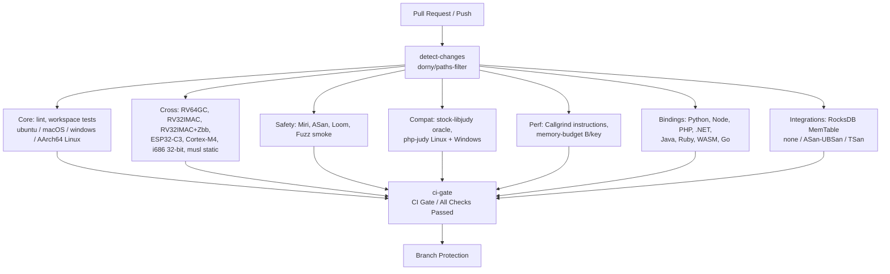

# Continuous Integration (CI) Architecture & Guidelines

> Canonical CI/CD documentation for Expanse (job catalog, rollup gate, regression gating, and the org-wide engineering standards the pipeline is built on).
> Design & Architecture: [ARCHITECTURE.md](ARCHITECTURE.md) · Testing Layers: [TESTING.md](TESTING.md) · Performance Discipline: [BENCHMARKING.md](BENCHMARKING.md) · Compatibility Gates: [COMPAT.md](COMPAT.md) · Release & Packaging: [PACKAGING.md](PACKAGING.md)

Expanse is a drop-in replacement for the 20-year-old C `libjudy` library, with bindings across many language ecosystems. It leans on `unsafe` Rust, optimistic concurrency, low-level bit manipulation and precise C ABI compatibility. The CI pipeline is therefore a layered verification harness: each job enforces a correctness, memory-safety, or performance invariant.

---

## 1. CI Pipeline Overview

Every Pull Request and push to `main` executes a matrix of parallel checks defined in [`.github/workflows/ci.yml`](../.github/workflows/ci.yml). The branch ruleset (`main-protection`) requires exactly **one** status context — **`CI Gate / All Checks Passed`** — a rollup (`ci-gate`) that `needs:` every other job and fails if any of them failed or was cancelled. Because a job omitted from that rollup would fail open (its result unobserved), completeness is asserted in **two** places:

- the `lint` job runs `python3 scripts/check_ci_gate.py`, and
- the `ci-gate` job's own **self-check** step parses `ci.yml`, builds the set of job ids, and fails if any id (other than `ci-gate`) is missing from `ci-gate`'s `needs:`.

Because the ruleset requires only the rollup context, renaming a *non-gate* job does **not** require editing branch protection (the self-check guards completeness); only renaming `ci-gate` itself would. Scheduled **Nightly** workflows ([`nightly.yml`](../.github/workflows/nightly.yml)) run the deep fuzzing and full-suite Miri validation out of band.



---

## 2. Job Catalog (rolled up by the CI Gate)

`ci.yml` defines **35 jobs** — 34 verification jobs plus the `ci-gate` rollup. They are grouped below by role. Each job gates on `detect-changes` so an unaffected subsystem's job cleanly skips (counting as passing) on a scoped PR, while `main` pushes and non-PR events run everything.

> `bench-baremetal` appears in the Performance table below for completeness but lives in `bench_baremetal.yml`; it is `/bench`-triggered and is **not** one of `ci-gate`'s dependencies.

### Change detection
| Job | Name | Role |
|---|---|---|
| `detect-changes` | Subsystems / Change Detection | `dorny/paths-filter@v4` computes per-subsystem outputs (`rust-src`, `tooling`, `perf-tooling`, `python`, `node`, `dotnet`, `java`, `docs`, `ruby`, `php`, `wasm`, `go`, `integrations`) that downstream jobs gate on. |

### Core
| Job | Name | Role |
|---|---|---|
| `lint` | Core / Linter & Formatting | `cargo clippy --workspace --all-targets -- -D warnings`, `cargo fmt --all --check`, plus repo-consistency scripts: `bump_version.py --check` (multi-ecosystem version lockstep), `check_abi_parity.py` (C ABI symbol parity across bindings and pinned symbol floor ≥100), `check_deletion_rationale.py` (fail unrationalized file deletions vs base ref), `check_test_floors.py` (workspace test count floor ≥300), `check_ci_gate.py` (gate completeness), `check_bench_suites.py` (the `/bench` suite manifest against the workflow, the docs table, the crate `[[bench]]` targets, and each callgrind suite's `arms` declarations against the `library_benchmark_group!`s its bench source declares), and the `--self-test` suites of `perf_report.py`, `bench_report.py`, `check_docs_hygiene.py`, `check_bench_suites.py`, `check_man_pages.py`, `check_man_examples.py`, `check_abi_parity.py`, `check_deletion_rationale.py`, `check_test_floors.py` (so the §8.1 fail-loud and §8.2 no-hardcoded-prose assertions cannot rot). |
| `test` | Core / Workspace Tests (ubuntu / macOS / windows) | `cargo test --workspace --exclude expanse-php` across the three host OSes (glibc, Mach-O, PE/COFF ABI), with `PROPTEST_CASES=500` (AGENTS.md §5 gate 4). `expanse-php` needs PHP headers and is covered by `test-php` / `php-judy-*`. |
| `test-aarch64` | Core / AArch64 Linux Tests & Callgrind (Neoverse N2) | `ubuntu-24.04-arm` native execution — hardware capability census (`lscpu`, `/proc/cpuinfo`, sysfs cache-line size), asserted rather than printed so a fleet rotation fails instead of silently invalidating `docs/HARDWARE.md` §2.6; full workspace tests (`PROPTEST_CASES=500`), C ABI drop-in verification, C++20 header tests, and a Callgrind instruction **regression gate** on AArch64: on pull requests the job benches the merge base (`--save-baseline=aarch64_smoke_base`, non-fatal), compares HEAD against it, and runs the same `perf_report.py --fail-on-regression --max-regression-pct 5.0` guard as `callgrind-smoke`, with the same `allow-regression: <reason>` override. NEON kernels already execute under the `test` job's `macos-latest` runner, which is arm64; what this lane adds is AArch64 **Linux/glibc** execution and Callgrind, which cannot run on macOS. |
| `man-examples` | Docs / Man Page Examples Compile and Match | Builds the C ABI, compiles each man page's `EXAMPLES` program against it, runs it, and diffs stdout against the `Example Output` block the page documents. `check_man_pages.py` validates form (troff hygiene, symbol coverage) and cannot tell whether the prose is true — it passed a page whose example printed the 3rd key while claiming the 2nd (#419). Compiling alone would not have caught it either: the wrong program compiled and exited 0. Pinning the output is what makes it a gate. |
| `msrv` | Core / MSRV 1.88 Build | `cargo check --workspace --exclude expanse-php --all-targets` on the pinned floor toolchain (`dtolnay/rust-toolchain@1.88.0`). Every other job builds on `stable`, which never exercises `rust-version`. |
| `docs-lint` | Docs / Hygiene (time estimates, PII, provenance) | `scripts/check_docs_hygiene.py` over tracked markdown **and the PR body**: fatal on time estimates (§6) and on home-directory paths / private LAN IPs / denylisted hostnames (§7); advisory warning on a document that publishes unit-bearing numbers while carrying no `(measured: …)` provenance tag anywhere (§8.7 — file-scoped on purpose: the suite READMEs state provenance once in a header covering every table below, so a proximity rule would flag them and train readers to ignore the warning). Gated on the `docs` path filter, so docs-only PRs still run a check. Hostnames come from the `DOCS_HOSTNAME_DENYLIST` repository **secret** — never committed, and a secret rather than a variable because Actions echoes job `env:` values into the public run log and only secrets are masked. Fork PRs get no secrets, so the hostname check skips there and says so. |

### Cross-compilation & 32-bit
| Job | Name | Role |
|---|---|---|
| `test-riscv64` | Cross / RV64GC Cross-Compile (Linux) | `riscv64gc-unknown-linux-gnu` build. |
| `test-rv32` | Cross / RV32IMAC Cross-Compile (Bare-Metal) | `riscv32imac-unknown-none-elf` `#![no_std]` check. |
| `test-rv32-zbb` | Cross / RV32IMAC + Zbb Cross-Compile (Bare-Metal) | Same target with the `Zbb` bit-manipulation extension enabled. |
| `test-esp32c3` | Cross / ESP32-C3 Cross-Compile (Bare-Metal RV32IMC) | `riscv32imc-unknown-none-elf` `#![no_std]` check. |
| `test-cortex-m` | Cross / ARM Cortex-M4 Cross-Compile (Bare-Metal) | `thumbv7em-none-eabihf` `#![no_std]` check. |
| `test-x86_64-none` | Cross / x86_64 Bare-Metal Cross-Compile (x86_64-unknown-none) | `x86_64-unknown-none` 64-bit `#![no_std]` core engine check. |
| `test-i686` | Cross / i686 32-bit Test Execution (Linux) | `i686-unknown-linux-gnu` — the only host-runnable 32-bit target; runs the real 32-bit trie test suite. |
| `test-musl` | Cross / Musl Static C ABI (Linux) | `x86_64-unknown-linux-musl` static build, zero glibc leak. Retained as a deliberate concurrency diversity property: musl's distinct allocator geometry, scheduling, and static linkage widen race windows that glibc's timing hides (e.g. issue #477 surfaced on musl while passing glibc). |

### Safety
| Job | Name | Role |
|---|---|---|
| `miri` | Safety / Tier 1 Miri Fast Smoke | Fast per-PR Miri smoke over the unsafe core (UB, provenance, Stacked/Tree Borrows). |
| `test-asan` | Safety / ASan Core Smoke (Ubuntu) | `-Zsanitizer=address` build-std smoke on the core. |
| `loom` | Safety / Loom Concurrency Race Model | `--cfg loom` permutation model-checking of the OCC seqlock and EBR. |
| `fuzz-smoke` | Safety / Fuzz Invariants Smoke | libFuzzer smoke (60 s/target) over every target registered in `fuzz/Cargo.toml` (discovered via `cargo fuzz list`, never hand-listed; a self-check step fails the job if `fuzz/fuzz_targets/*.rs` and the `[[bin]]` registrations differ) — currently 8: `set_ops`, `set_algebra`, `map_ops`, `bytesmap_ops`, `strmap_ops`, `blobmap_image_corrupt`, `set32_ops`, `map32_ops`. |

### Compatibility
| Job | Name | Role |
|---|---|---|
| `differential-oracle` | Compat / Stock libjudy Oracle (Linux) | Black-box differential testing of `libexpanse` vs stock C `libjudy` via `dlopen`. |
| `php-judy-compat` | Compat / PHP-Judy Extension (Linux) | Builds `php-judy` (pinned SHA) against `libexpanse.so`, runs the upstream suite. |
| `php-judy-windows` | Compat / PHP-Judy Extension (Windows x64) | Same against `expanse.dll` under MSVC. |

### Performance
| Job | Name | Role |
|---|---|---|
| `instruction-counts` | Perf / Callgrind Deterministic Instructions | Valgrind/Callgrind instruction counting + `scripts/perf_report.py` regression guard. |
| `callgrind-smoke` | Perf / Callgrind Fast Smoke (Ubuntu) | Fast scaled-down (<20s) Callgrind instruction regression smoke gate ($N = 10,000$). |
| `memory-budget` | Perf / Memory Budget Invariants | Runs `examples/bytes_per_key.rs` and `examples/bytes_per_key_32.rs`; fails if deterministic B/key exceeds architectural ceilings. |
| `bench-baremetal` | Perf / Remote Bare-Metal Benchmarks | Triggered via `workflow_dispatch` or `/bench` / `/bench extended` / `/benchmark <suite>` PR comments. The suite vocabulary is declared once in [`.github/bench-suites.json`](../.github/bench-suites.json) and tabulated in [`docs/BENCHMARKING.md` §3](BENCHMARKING.md#3-triggering-via-pr-comment); a separate hosted `resolve` job matches the argument as a whole token, refuses an unrecognised one by name without starting any run, and publishes the resolved suite as the job output that both the bench job and its `concurrency` group read. Dual-pass baseline drift reporting, Callgrind profiling, and multi-arch / population sweeps on the dedicated bare-metal reference host. Takes the host-wide bench lock (exit 75 if held), captures a system-load snapshot into the report, derives an anonymized host description from the runner, fails fast when a Callgrind suite lacks `valgrind`/`iai-callgrind-runner`, and only prints a `Base Ref` when the base pass actually produced comparable output. **Comment identity is per suite** (`<!-- expanse-bench:<suite> -->`), so two suites on one PR own two comments; the result step is `if: always()` and terminates its own comment with the actual cause (lock holder, missing Callgrind tooling, build/bench failure, cancellation) rather than leaving a `⏳` marker; a run with no numbers keeps the previous result for that suite in a collapsed block. A `concurrency:` group keyed on PR + suite supersedes an in-flight run of the same suite, and `timeout-minutes: 180` bounds how long a wedged run can hold the shared host. |

### Bindings
| Job | Name | Role |
|---|---|---|
| `test-python` | Bindings / Python Fast Smoke (Py3.12) | PyO3 binding smoke. |
| `test-node` | Bindings / Node.js (matrix) | napi-rs addon across OS × Node versions. |
| `test-php` | Bindings / PHP (matrix) | FFI binding across OS × PHP versions. |
| `test-dotnet` | Bindings / .NET (matrix) | P/Invoke binding tests. |
| `pack-dotnet` | Bindings / .NET NuGet Package | Packs the `Orieg.Expanse` `.nupkg`. |
| `test-java` | Bindings / Java 22+ Panama (matrix) | Project Panama FFM binding tests. |
| `test-ruby` | Bindings / Ruby (matrix) | magnus / C ABI extension tests. |
| `test-wasm` | Bindings / WebAssembly (wasm32) | `wasm32` binding build/test. |
| `test-wasm64` | Bindings / WebAssembly (wasm64 Memory64 Experimental) | `wasm64-unknown-unknown` build-std check and Node.js Memory64 runtime smoke test. |
| `test-go` | Bindings / Go (matrix) | Go binding tests across CGO, purego (`CGO_ENABLED=0`), and explicit `-tags expanse_purego` on Linux, macOS, and Windows. |

### Integrations
| Job | Name | Role |
|---|---|---|
| `test-rocksdb-memtable` | Integrations / RocksDB MemTable (matrix) | Builds/tests `ExpanseMemTableRep` across `sanitizer: [none, asan-ubsan, tsan]` (TSan excluded on macOS); includes a differential test vs reference structures. |

### Rollup gate
| Job | Name | Role |
|---|---|---|
| `ci-gate` | CI Gate / All Checks Passed | Runs `if: always()`, `needs:` all 35 other jobs, treats cleanly-skipped jobs as passing, and runs the completeness self-check. The **only** required branch-protection context. |

---

## 3. Scope-Based Fast Paths & Path Filtering

Turnaround stays low for non-code and localized PRs without losing required-check coverage:

- A single lightweight `detect-changes` job (`dorny/paths-filter@v4`) computes thirteen per-subsystem booleans: `rust-src`, `tooling`, `perf-tooling`, `python`, `node`, `dotnet`, `java`, `docs`, `ruby`, `php`, `wasm`, `go`, `integrations`. Downstream jobs declare `needs: [detect-changes]` and `if: needs.detect-changes.outputs.<subsystem> == 'true' || github.event_name != 'pull_request'`.
- **`rust-src` — "does Rust/C++ behaviour need re-verifying"**: `crates/**`, `include/**`, `tests/cpp/**`, `fuzz/**`, `Cargo.toml`, `Cargo.lock`, `rust-toolchain*`, plus `ci.yml` itself. It is the only filter that schedules the expensive safety lane (`miri`, `test-asan`, `fuzz-smoke`, `callgrind-smoke`) and the cross-compile matrix. It does **not** include `scripts/**`: no Rust job compiles or links a Python script (#412).
- **`tooling` — the repo guards**: `scripts/**`, `.github/workflows/**`, `.github/bench-suites.json`. Gates `lint`, which carries `bump_version.py`, `check_abi_parity.py`, `check_ci_gate.py`, `check_bench_suites.py` and the report-script self-tests. A PR that only edits the `/bench` suite manifest or `bench_baremetal.yml` therefore still runs the sync guard — without pulling in Miri, ASan, fuzz or Callgrind.
- **`perf-tooling` — the one real tooling↔Rust coupling, scoped to it**: `scripts/perf_report.py` and `scripts/bench_report.py` are executed by `instruction-counts`, `callgrind-smoke` and `test-aarch64`, so they gate those three jobs specifically rather than justifying `scripts/**` → everything.
- **`ci.yml` stays in `rust-src` deliberately.** An edit to it rewrites the build commands, flags, toolchains and `if:` gates of the safety jobs themselves, and can silently remove one; `main` is protected, so the `push` event fires only after the merge and PR time is the sole place a broken or disabled safety job is observable before it lands. Restricting it to the jobs a diff actually touches is not expressible as a path glob, so the conservative case is taken: every `ci.yml` edit runs the full matrix. `nightly.yml` and `bench_baremetal.yml` carry no such risk for `ci.yml`'s jobs and sit in `tooling` only.
- `integrations/**` is C++ outside the cargo workspace, built by exactly one job (`test-rocksdb-memtable`) and already covered by the `integrations` filter, so it is not part of `rust-src`.
- A PR touching only `docs/**`, `*.md` or `website/**` matches no Rust job and skips the Rust matrix entirely — but it does run `docs-lint`, which consumes the `docs` filter output, so a docs-only PR is never a zero-check PR.
- Known residual: `check_bench_suites.py` also asserts the generated table in `docs/BENCHMARKING.md`, but `lint` is not gated on `docs/**`, so a docs-only edit to that table is checked by the next PR that touches `rust-src` or `tooling` rather than by its own.
- The `CI Gate / All Checks Passed` rollup satisfies branch protection once its dependencies conclude (skipped jobs count as passing), so PRs never deadlock in "Pending" behind a filtered-out check.

---

## 4. Performance Regression Guard & Deterministic Benchmarking

### 4.1 Why deterministic instruction counting
Wall-clock timing on shared cloud runners exhibits large multi-tenancy / thermal / hyperthread noise, causing false-positive failures. The `instruction-counts` job instead counts **instructions retired** (and cache accesses) via Valgrind/Callgrind, which is deterministic on x86-64 Linux: the same commit yields the same instruction count on any runner, so changes as small as `0.1%` reflect real codegen/algorithmic differences.

The same determinism was measured, not assumed, on the AArch64 lane before that lane was allowed to gate. Two consecutive `ubuntu-24.04-arm` runs whose commits touched no `crates/`, `Cargo.toml` or `Cargo.lock` content produced **byte-identical counts across all 20 `smoke_instructions` arms** — zero drift, not drift below a threshold (measured: `ubuntu-24.04-arm` Neoverse-N2, runs `33124978928` and `33128212931`, both at tree `69ed1774`). That is what makes a shared ARM runner an admissible instrument under AGENTS.md §8.4: the counts are exact integers with zero variance, so co-tenant load cannot perturb them.

### 4.2 Automated failure thresholds
[`scripts/perf_report.py`](../scripts/perf_report.py) compares PR-branch instructions against a base bench (`--base`) and, with `--fail-on-regression`, turns regressions into a job failure:
1. **Single-benchmark threshold**: any benchmark above `--max-regression-pct` fails CI.
2. **Multi-benchmark threshold**: more than one benchmark above the noise floor fails CI.

The job wires `--fail-on-regression` with a deliberately loose `--max-regression-pct 5.0` (shared runners are noisy; the `0.1%` figure above is Callgrind's measurement/display resolution and the *review* threshold — see `docs/BENCHMARKING.md` and AGENTS.md §6 — not the automated failure threshold). On pull requests the job captures the merge-base bench and supplies it via `--base`, arming the guard. `callgrind-smoke` (x86-64) and `test-aarch64` (Neoverse N2) run the identical mechanism over the same `smoke_instructions` bench, so a codegen regression that only manifests on one ISA is caught on that ISA. The pipeline degrades loudly, never silently:

- **Pipefail on bench steps** — the `cargo bench … | tee` steps run with `shell: bash` (implies `set -o pipefail`), so a crashed benchmark fails its step instead of exiting `0` through `tee`.
- **Empty/near-empty head parse is a hard failure** in `--fail-on-regression` mode: a run that measured nothing (or lost most of the base's arms to a partial crash) can never render "🟢 0 Regressions".
- **Base-present/head-missing arms are reported explicitly** in the report rather than silently dropped from the comparison.
- **A base capture that fails stays non-fatal** (`|| true` on the base pass — a broken base commit must not hard-block PRs), but the report then renders a prominent "⚠️ NO BASELINE — regression gate did not run" section, not a quiet chip.
- **A missing head artifact fails the step.** The guard steps assert their inputs exist (`instruction-counts.txt` / `bytes-per-key.txt` / `vs-stock.txt`, `smoke-instruction-counts.txt`, and `aarch64-smoke-instructions.txt`) and `::error` + exit 1 when one is absent. Previously the invocation sat inside an `if [ -f … ]` wrapper, so a crashed benchmark skipped the guard and the step exited `0`.

Both report scripts ship unit-style checks for this behavior — `python3 scripts/perf_report.py --self-test` and `python3 scripts/bench_report.py --self-test` — and the `lint` job runs them on every PR.

### 4.3 Interleaved dual-arm ratios (where instruction counting is unavailable)
For end-to-end runtime comparisons (e.g. the PHP runtime, JIT paths), never compare absolute wall-clock across runs. Measure two arms — **Arm S** (pristine baseline) and **Arm C** (candidate) — in alternating interleaved rounds on the same runner, and gate on the ratio `Candidate / Baseline`. Runner slowdown scales both arms equally, keeping the ratio noise-free.

### 4.4 Controlled performance-bypass protocol
An intentional trade-off (safety hardening, new feature, metadata tagging) is approved explicitly:
- Add a literal `allow-regression: <reason>` line to the PR body — the directive must **begin its own line**, then the colon and a nonempty reason on that same line — plus a **Performance Trade-off Disclosure** section (regressed metric + load-bearing rationale + net win). `perf_report.py` accepts **only** this strict form: a bare `allow-regression` substring, `perf-override: approved`, a quoted copy of the policy text, or any mid-line prose mention (including inside a markdown table cell or an inline code span) approves nothing. Writing *about* the override in a PR body must never arm it — the line anchor is what guarantees that, and `perf_report.py --self-test` pins the cases. CI records a genuine override in the step summary and allows the PR.
- The reason must carry a **resolvable citation** — a CI run URL or a committed artifact path — and every number in it must appear in that source (AGENTS.md §6, §8.7). An override whose reason cites nothing is **void**: `perf_report.py` leaves the gate armed, exits non-zero, and reports `Regression override is void — no resolvable citation` along with the reason as given. A bare commit SHA does not qualify; it names a revision, not a measurement of it. `perf_report.py --self-test` pins both directions.
- If the regressed arm is covered by a documented exemption (`docs/BENCHMARKING.md` rule 16 — the random arms of `map_get`, `set_contains` and their C-ABI twins), cite the rule instead of opening an override. The exemption's scope is narrow; a regression on any other arm is a regression.

### 4.5 Memory density assertions (deterministic)
`memory-budget` runs `examples/bytes_per_key.rs` and `examples/bytes_per_key_32.rs`: total heap bytes ÷ key count against strict per-distribution ceilings. These are deterministic allocator-accounting numbers, unaffected by machine load, so unlike timing tables they can hard-gate a build. Raise a ceiling only deliberately, updating the `BENCHMARKING.md` row in the same commit.

### 4.6 Concurrency scaling-ratio guard (nightly, warn-only)
The instruction gates above are single-threaded and deterministic by design. They cannot catch a change that serializes concurrent readers or silently degrades the optimistic path to the mutex fallback: Callgrind serializes threads, and raw wall-clock ops/s is too noisy to threshold tightly.

The nightly `bench-report` job therefore runs `benches/concurrency.rs` — all `Sync*` types plus baselines, on a reduced sweep via `EXPANSE_BENCH_THREADS` / `EXPANSE_BENCH_WORKLOADS`. It gates on **scaling ratios**: total ops/s at max threads ÷ 1 thread, per (engine, workload). `scripts/bench_concurrency_check.py` compares those against the previous nightly's `concurrency-baseline` artifact, using the same upload/download round-trip as the `bindings-baseline`.

Ratios are robust to host-load drift, so a generous 30% relative-drop threshold flags real scaling collapses while tolerating scheduler noise. The gate is **warn-only** today (no `--fail-on-regression`); promotion to failing is gated on the baseline staying quiet across several consecutive unmodified nightlies ([#360](https://github.com/orieg/expanse/issues/360)). `/benchmark concurrency` runs the same instrument report-only on the bare-metal host. Suite and knob details: `docs/BENCHMARKING.md` §2–3.

### 4.7 File deletion rationale gate & completeness floors
A green test suite only proves that what is present passes, not that what should be present is present (#458). To prevent silent code/test shrinkage or accidental merge regressions:
- **Deletion rationale gate** ([`scripts/check_deletion_rationale.py`](../scripts/check_deletion_rationale.py)): any PR that deletes tracked files compared to the base branch (`git diff --diff-filter=D`) fails CI unless the PR body includes a line-anchored `removes: <reason>` or `deletes: <reason>` directive. Ref/diff determination failures fail loud (`EXIT=1`).
- **C ABI symbol floor** ([`scripts/check_abi_parity.py`](../scripts/check_abi_parity.py)): fails if total exported C ABI functions fall below the pinned floor (≥ 100 symbols) without an explicit `allow-symbol-shrink: <reason>` directive. The floor constant (`MIN_C_SYMBOLS = 100`) is verified against the base ref via `git show`, preventing diffs from lowering the constant without an override. The zero margin (exactly 100 symbols vs floor of 100) is deliberate: the first legitimate deprecation trips the floor and requires an explicit rationale. Renaming the constant trips base resolution and intentionally requires the override.
- **Workspace test count floor** ([`scripts/check_test_floors.py`](../scripts/check_test_floors.py)): fails if workspace test counts drop below the pinned floor (≥ 300 tests) without an explicit `allow-test-shrink: <reason>` directive. The floor constant (`MIN_WORKSPACE_TESTS = 300`) is verified against the base ref via `git show`, preventing diffs from lowering the constant without an override. The thin margin (305 tests vs floor of 300) is deliberate so substantial test deletions trip the gate immediately. Renaming the constant trips base resolution and intentionally requires the override.

---

## 5. Tiered Miri & Undefined-Behavior Prevention

- **Tier 1 (per-PR, `ci.yml`)**: `miri` runs `cargo miri test -p expanse-trie --lib` over an explicit filter list — `leaf`, `node`, `slot`, `alloc`, `bits`, `types`, plus the `blobmap`/`strmap`/`bytesmap` deferred-dispose round trips. Heavy op-sequence tests are left to proptest and fuzzing. The job skips on non-Rust diffs (§3). Catches Stacked/Tree Borrows and provenance violations before merge.
- **Tier 2 (merge gate)**: `ci-gate` requires Tier 1 Miri to pass before a PR is mergeable.
- **Tier 3 (nightly, `nightly.yml`)**: the full un-skipped Miri suite across all crate targets, including long-running randomized model sweeps (`proptest_model.rs`). Failures open/update a deduplicated GitHub issue; recovery auto-closes it (see §8).

---

## 6. Sanitizers, Differential Oracles & Concurrency Models

- **Sanitizer matrix (ASan/UBSan/TSan)**: `test-asan` covers the Rust core; `test-rocksdb-memtable` runs `sanitizer: [none, asan-ubsan, tsan]` over the C++ `ExpanseMemTableRep` (TSan catches races in atomic sibling-leaf pointers and the optimistic reader path; TSan excluded on macOS); the nightly workflow runs `test-tsan` (`-Zsanitizer=thread`) across all `Sync*` and `Sync32*` Rust concurrent primitives with storage-engine suppressions (`.github/tsan-suppressions.txt`) to allow benign OCC optimistic reader loads, paired with an inverted-exit-code canary test (`tests/tsan_canary.rs`) ensuring TSan remains armed. Storage-level unbracketed races are caught by `assert_bracketed()` debug panics and Loom model checks rather than TSan.
- **Differential oracles**: `differential-oracle` runs identical operation sequences through `libexpanse` and stock C `libjudy`; the RocksDB integration adds a differential memtable test asserting byte-for-byte state equality against reference structures.
- **Concurrency models**: `loom` (`--cfg loom`) model-checks the two `occ` protocol primitives — seqlock version ordering and EBR pin/advance retirement (a retirement waits 2 epoch advances). It does **not** model a branch split; the `sync` read path as a whole is not loom-checkable (TESTING.md, layer 6). A multi-threaded history recorder (`tests/linearizability.rs`) validates OCC linearizability.

---

## 7. Network Resilience & Thundering-Herd Mitigation

Large matrices across many runner VMs can trip upstream rate limits / `504`s. Standards used across the pipeline and sister repos:

- **Resilient curl** (never bare `curl -f`): `curl --retry 5 --retry-delay 2 --retry-max-time 60 --retry-all-errors --retry-connrefused -fsSL "$URL" -o "$OUTPUT"`.
- **Startup jitter** for concurrent matrix jobs: `sleep $(( (RANDOM % 5) + 1 ))` before the first network request.
- **`max-parallel`** throttling for heavy release matrices hitting external CDNs/registries.
- **Step-level retries** (`nick-fields/retry@v3`) wrapping flaky setup (`setup-php`, `maturin-action`, `apt-get`).

---

## 8. Automated Nightly Failure Triage

Nightly workflows run out of band with no human watching PR checks, so failures self-report to avoid silent rot. On `failure() && github.event_name == 'schedule'`, an `actions/github-script` step opens or comments on a deduplicated issue (label `nightly-failure`) with commit, run link, failing target, and a local reproduction command; on `success()` it comments and auto-closes the open issue. See `nightly.yml` for the exact script.

---

## 9. Configuration Options & Flags

- **`--fail-on-regression`** — turns `perf_report.py` regressions into blocking errors.
- **`--pr-body-file <path>`** — supplies the PR description so approval markers are parsed.
- **`--max-regression-pct <float>`** — max allowed single-benchmark instruction regression.
- **`--noise-floor <float>`** — threshold above which an instruction delta is a regression.
- **`--self-test`** — runs the unit-style checks built into `perf_report.py` / `bench_report.py` / `check_abi_parity.py` / `check_deletion_rationale.py` / `check_test_floors.py` (parse, gating, override matching, legend bands, and — for `bench_report.py` — that each ratio column's marker is graded by that column's declared direction and that an unmeasured arm renders as an absence rather than a zero) and exits.
- **`removes: <reason>` / `deletes: <reason>`** — PR body directive approving intentional file deletions.
- **`allow-symbol-shrink: <reason>`** — PR body directive approving intentional C ABI symbol shrinkage.
- **`allow-test-shrink: <reason>`** — PR body directive approving intentional test count reduction.
- **`RUSTFLAGS="--cfg loom"`** — swaps `std::sync::atomic` for Loom permutation-checked atomics.
- **`-C target-cpu=x86-64-v3`** — enables AVX2/BMI2/POPCNT for the comparative microarchitecture benches.

---

## 10. Things to Watch For & Common Pitfalls

1. **Teardown contamination in benchmarks** — in [`benches/instructions.rs`](../crates/expanse/benches/instructions.rs), data measured inside Callgrind must not run `Drop`/dealloc inside the timed block; use `core::mem::forget(data)` when measuring lookups.
2. **Zero-byte memory copies** — inserting at the end of a linear leaf (`pos == pop`) must not issue an unconditional `copy_nonoverlapping` of 0 bytes; guard with `if pos < pop`.
3. **C-vs-Rust ABI fairness** — compare `.so` against `.so` via `dlopen` (the `*_expanse_dl` arms) so static LTO doesn't skew stock-libjudy comparisons.
4. **Binary file searches** — never `grep`/`rg`/`sed` binary artifacts (`.so`, `.dll`, `.a`, `.tar.gz`); use `nm`/`objdump`/`python3`.

---

## 11. Future Improvements & Roadmap

- **Continuous flamegraph artifacts** — publish differential SVG flamegraphs on regression.
- **AArch64 Linux execution & Callgrind gating** — delivered on the GitHub-hosted ARM64 Linux runner (`ubuntu-24.04-arm`, Neoverse N2): native workspace tests, an asserted capability census, and a merge-base Callgrind regression gate (#397).
- **Apple-Silicon Callgrind & the 128 B cache line** — still open, and the half of the original AArch64 roadmap item that #397 did *not* deliver. `macos-latest` runs workspace tests but no Callgrind (valgrind does not run there), so the platform where `docs/HARDWARE.md` §2.4 records a real performance risk — 128-byte lines against `align(64)` nodes — has no instruction-count coverage.
- **Automated corpus cache sync** — promote high-coverage nightly fuzz corpora into PR smoke checks.
- **Failing concurrency scaling gate** — promote the nightly warn-only ratio guard (§4.6) to blocking once the baseline stays quiet ([#360](https://github.com/orieg/expanse/issues/360)).

---

## 12. GitHub Actions Update & Runtime Policy

To ensure high supply-chain security, fast execution, and zero runner runtime deprecation warnings across the pipeline, Expanse enforces a strict **Actions Update & Runtime Policy**:

### 12.1 Native Runtime Alignment (Node 24+)
GitHub Actions runners periodically deprecate older Node.js action runtimes (e.g. Node 20 reached end-of-life and is deprecated on runners in favor of Node 24).
- **Prohibited Workarounds**: Setting insecure stopgap flags like `ACTIONS_ALLOW_USE_UNSECURE_NODE_VERSION: "true"` is strictly prohibited. Workarounds mask technical debt and create brittle pipelines before hard runner cutoffs.
- **Mandatory Upgrades**: When runner runtimes evolve, all workflow actions MUST be promptly updated to their official major versions compiled against the active LTS runtime (Node 24+).

### 12.2 Action Pinning Standards
1. **Major Version Tags**: Pin all official and trusted community actions to their current major version tag (e.g., `actions/checkout@v7`, `dorny/paths-filter@v4`, `actions/setup-python@v7`).
2. **Strictly Prohibit `@latest`**: GitHub Actions does not support `@latest` syntax; referencing `@latest` will fail workflow execution.
3. **Canonical Action Catalog & Baseline**:
   - `actions/checkout@v7` (repository checkout with modern ESM & secure git configs)
   - `actions/github-script@v8` (Node 24 runtime with dual CommonJS / ESM compatibility)
   - `actions/setup-node@v7` (Node.js SDK installation)
   - `actions/setup-python@v7` (Python environment setup)
   - `actions/setup-dotnet@v6` (.NET SDK setup)
   - `actions/setup-java@v6` (JDK / Panama setup)
   - `actions/setup-go@v7` (Go toolchain for the cgo binding lane)
   - `actions/cache@v6` (generic cache — nightly fuzz corpus restore)
   - `actions/upload-artifact@v7` / `actions/download-artifact@v8` (v4+ artifact storage)
   - `actions/upload-pages-artifact@v5` / `actions/deploy-pages@v5` (GitHub Pages CD)
   - `dorny/paths-filter@v4` (monorepo subsystem change detection)
   - `peter-evans/find-comment@v4` / `peter-evans/create-or-update-comment@v5` (PR bot comment updates)
   - `Swatinem/rust-cache@v2` (smart cargo build artifact caching)

### 12.3 Automated Action Version Auditing
To audit whether upstream actions have newer releases or runtime migrations available:
```bash
for action in "actions/checkout" "actions/setup-node" "actions/setup-python" "actions/setup-dotnet" "actions/setup-java" "actions/setup-go" "actions/cache" "actions/upload-artifact" "actions/download-artifact" "dorny/paths-filter"; do
  echo "$action: $(gh api /repos/$action/releases/latest --jq .tag_name 2>/dev/null || echo 'manual check needed')"
done
```

---

## Appendix A — Org-Wide CI/CD Standards & New-Project Checklist

These conventions apply across Expanse and its sister repositories (`php-judy`, `judy-cache`, `judy-polyfill`, `yaml-workflows`, `gws-connectors`). They exist so a new repo inherits the same zero-regression discipline.

**Concurrency hygiene.** PR runs cancel superseded runs; `main` pushes must not:
```yaml
concurrency:
  group: ${{ github.workflow }}-${{ github.head_ref || github.run_id }}
  cancel-in-progress: ${{ github.event_name == 'pull_request' }}
```
Merges to `main` use a unique key (`github.run_id` / `github.sha`) with `cancel-in-progress: false` so every merge keeps a complete audit trail.

**New-project setup checklist:**
- [ ] Define `concurrency` with `cancel-in-progress: ${{ github.event_name == 'pull_request' }}`.
- [ ] Create a `detect-changes` job with `dorny/paths-filter@v4`.
- [ ] Gate downstream jobs on `needs: [detect-changes]` + `if: needs.detect-changes.outputs.<subsystem> == 'true'`.
- [ ] Create a `ci-gate` rollup evaluating `${{ toJson(needs) }}`, with a completeness self-check.
- [ ] Set up deterministic regression gating (Callgrind instructions or interleaved dual-arm ratios).
- [ ] Set an explicit `timeout-minutes` on every job.
- [ ] Pin actions to modern Node 24+ major releases (never use `ACTIONS_ALLOW_USE_UNSECURE_NODE_VERSION`).
- [ ] Configure branch protection to require **only** the `ci-gate` context.
- [ ] Add automated nightly issue triage / self-healing to `nightly.yml`.

**Architecture choice — native Actions vs `yaml-workflows`:** use native GitHub Actions for core PR CI (`ci.yml`) for zero setup overhead and direct diagnostic streaming; prefer the `orieg/yaml-workflow` action for DAG-based multi-artifact release packaging (`release.yml`), cross-repo nightly sweeps (`nightly.yml`), and multi-step docs portals (`pages.yml`).
