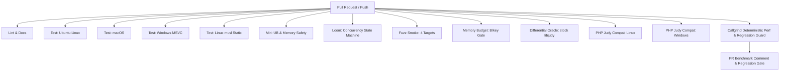

# Continuous Integration (CI) Architecture & Guidelines

> Canonical CI documentation for Expanse.
> Design & Architecture: [ARCHITECTURE.md](ARCHITECTURE.md) · Testing Layers: [TESTING.md](TESTING.md) · Performance Discipline: [BENCHMARKING.md](BENCHMARKING.md) · Compatibility Gates: [COMPAT.md](COMPAT.md)

Expanse is a zero-allocation, high-performance, drop-in replacement for the 20-year-old C `libjudy` library. Because Expanse relies heavily on `unsafe` Rust, lock-free concurrency, low-level bit manipulation, and precise C ABI compatibility, our CI pipeline is engineered as a multi-layered verification harness where each job enforces strict correctness, memory safety, or performance invariants.

---

## 1. CI Pipeline Overview

Every Pull Request and push to `main` executes a matrix of **13 required parallel checks** defined in [`.github/workflows/ci.yml`](../.github/workflows/ci.yml). In addition, scheduled **Nightly** workflows execute deep fuzzing and full-suite Miri validation.

---

## 2. Detailed Job Catalog (13 Required Checks)

| # | Job Name | Primary Tools / Flags | Purpose & Invariant Enforced | Typical Runtime |
|---|---|---|---|---|
| 1 | **`lint`** | `cargo fmt`, `cargo clippy -- -D warnings`, `cargo doc` | Formatting hygiene, strict lints across all targets, zero broken doc links. | ~25s |
| 2 | **`test (ubuntu-latest)`** | `cargo test --workspace` | Full unit test suite, model-based tests, doc-tests, visualizer synchronization tests on Linux glibc. | ~30s |
| 3 | **`test (macos-latest)`** | `cargo test --workspace` | Native macOS verification (Mach-O dynamic library loading and ABI checks). | ~40s |
| 4 | **`test (windows-latest)`** | `cargo test --workspace` | Native Windows MSVC verification (PE/COFF DLL export and calling conventions). | ~1m 15s |
| 5 | **`test-musl`** | `x86_64-unknown-linux-musl` | Static-linked musl compilation and test execution to ensure zero glibc dependency leak. | ~35s |
| 6 | **`miri`** | `cargo +nightly miri test` | Undefined Behavior (UB), pointer provenance, aliasing, and uninitialized memory check on core trie. | ~5s (fast-path) / ~2m |
| 7 | **`loom`** | `RUSTFLAGS="--cfg loom"` | Permutation testing of the Optimistic Concurrency Control (OCC) seqlock and Epoch-Based Reclamation (EBR). | ~40s |
| 8 | **`fuzz-smoke`** | `cargo +nightly fuzz run` (60s/target) | Smoke run of 4 libFuzzer targets (`set_ops`, `map_ops`, `bytesmap_ops`, `strmap_ops`). | ~4m 30s |
| 9 | **`memory-budget`** | `examples/bytes_per_key.rs` | Deterministic allocator accounting. Fails if memory per key exceeds hard architectural ceilings. | ~25s |
| 10 | **`differential-oracle`** | `libjudy-dev`, `dlopen` | Black-box behavioral equivalence testing comparing `libexpanse` against stock C `libjudy`. | ~35s |
| 11 | **`php-judy-compat`** | PHP 8.x + `php-judy` C extension | Compiles legacy `php-judy` C extension linked against `libexpanse.so` and runs upstream test suite. | ~45s |
| 12 | **`php-judy-windows`** | PHP 8.x + MSVC | Compiles and runs `php-judy` test suite linked against `libexpanse.dll` on Windows. | ~1m 30s |
| 13 | **`instruction-counts`** | Valgrind / Callgrind + Python report | Deterministic instruction counting vs base branch, vs stock libjudy, and vs `x86-64-v3`. **Enforces Regression Guard.** | ~3m 30s |

---

## 3. Performance Regression Guard & Deterministic Benchmarking

The `instruction-counts` job provides automated performance verification without runner noise.

### Why Callgrind?
Standard wall-clock microbenchmarks on shared cloud runners suffer from 5–15% thermal and hyperthread jitter. Valgrind Callgrind counts **instructions retired**, which is 100% deterministic on x86-64 Linux:
* The exact same commit yields the exact same instruction count on any runner.
* Dips or rises as small as **`0.1%`** represent real algorithmic or code generation changes.

### Automated Failure Thresholds
[`scripts/perf_report.py`](../scripts/perf_report.py) evaluates PR branch instructions against the merge base:
1. **Single-benchmark threshold**: Any benchmark showing **`> 1.5%`** instruction increase fails CI (`exit 1`).
2. **Multi-benchmark threshold**: More than **1 benchmark** showing **`> 0.5%`** instruction increase fails CI (`exit 1`).

### Human Approval & Override Protocol
If a regression is expected or represents an intentional architectural trade-off (e.g. adding safety validation or a complex feature), it must be documented and formally approved:
* Add `allow-regression: <reason>` to the PR description (e.g. `allow-regression: Adding telemetry counters to tree traversal`).
* Or include `perf-override: approved` in the PR body.
* CI will parse this metadata, acknowledge the override in the report, and allow the PR to pass.

---

## 4. Configuration Options & Flags

### Runner Environment Variables & Flags
* **`--fail-on-regression`**: Passed to [`scripts/perf_report.py`](../scripts/perf_report.py) in CI to turn regressions into blocking errors.
* **`--pr-body-file <path>`**: Supplies the PR description to the report generator to parse approval markers.
* **`--max-regression-pct <float>`** (Default: `1.5`): Maximum allowed instruction regression percentage on a single benchmark.
* **`--noise-floor <float>`** (Default: `0.5`): Threshold above which instruction delta is classified as a regression.
* **`RUSTFLAGS="--cfg loom"`**: Configures `expanse-trie` to replace `std::sync::atomic` with Loom permutation-checked atomics.
* **`-C target-cpu=x86-64-v3`**: Enables AVX2, BMI2, and hardware POPCNT instruction compilation for modern architecture comparative benches.

### Miri Execution Scope
To keep PR turnaround under 5 minutes while retaining rigorous safety:
* **Per-PR Miri**: Runs `cargo +nightly miri test --lib -- --skip model_`. Skips heavy op-sequence tests (which are covered by proptest and fuzzing) and short-circuits on non-Rust diffs.
* **Nightly Miri**: Runs the entire, un-skipped Miri suite across all crate targets.

### Scope-Based PR Fast Paths
To keep turnaround times under 30 seconds for non-code and localized PRs while preserving 100% required check coverage for branch protection:
* **Docs & Tooling PRs**: When a PR modifies only documentation, metadata, or tooling (`docs/**`, `*.md`, `LICENSE*`, `scripts/**`):
  - Heavy Rust testing jobs (`test`, `test-musl`, `loom`, `fuzz-smoke`, `memory-budget`, `differential-oracle`, `php-judy-compat`, `php-judy-windows`, `miri`) detect no Rust crate diff (`crates/`, `fuzz/`, `Cargo.*`) and exit `0` immediately.
  - `fuzz-smoke` skips libFuzzer execution unless `crates/` or `fuzz/` targets changed.
  - `instruction-counts` only executes Callgrind profiling if `crates/` or `scripts/perf_report.py` changed.
* **Format & Hygiene**: `lint` runs on all PRs to verify markdown hygiene and clean formatting.
* All 13 required status checks satisfy GitHub branch protection and report `pass` in **~5 seconds** instead of ~5 minutes.

---

## 5. Things to Watch For & Common Pitfalls

1. **Teardown Contamination in Benchmarks**:
   - In [`crates/expanse/benches/instructions.rs`](../crates/expanse/benches/instructions.rs), all data structures measured inside Callgrind must avoid running `Drop` or deallocation inside the timed block. Use `core::mem::forget(data)` inside the benchmark closure if measuring lookup only.
2. **Zero-Byte Memory Copies**:
   - When mutating linear leaves, inserting at the end (`pos == pop`) must not issue unconditional `copy_nonoverlapping` calls with 0 bytes. Guard with `if pos < pop`.
3. **C vs Rust ABI Fairness**:
   - When evaluating performance vs stock `libjudy`, always compare `.so` against `.so` via `dlopen` (the `*_expanse_dl` arms) to prevent static LTO advantages from skewing comparisons.
4. **Binary File Searches**:
   - Never use `grep`, `rg`, or `sed` on binary artifacts (`.so`, `.dll`, `.a`, `.tar.gz`). Always use format-aware tools (`nm`, `objdump`, `python3`).

---

## 6. Future Improvements & Roadmap

* **Continuous Flamegraph Artifacts**: Automatically publish differential SVG flamegraphs (`qcachegrind`/`speedscope`) for PRs on regression.
* **AArch64 / ARM NEON Runner Matrix**: Extend Callgrind instruction tracking to AWS Graviton / Apple Silicon runners.
* **Dedicated Bare-Metal Benchmark Runner**: Add a quiet bare-metal runner for nanosecond-precision wall-clock latency reporting alongside Callgrind instruction tracking.
* **Automated Corpus Cache Sync**: Automatically promote high-coverage fuzz corpora generated during nightly runs into PR smoke checks.
