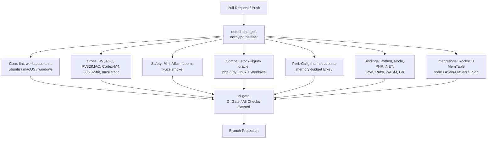

# Continuous Integration (CI) Architecture & Guidelines

> Canonical CI/CD documentation for Expanse (job catalog, rollup gate, regression gating, and the org-wide engineering standards the pipeline is built on).
> Design & Architecture: [ARCHITECTURE.md](ARCHITECTURE.md) · Testing Layers: [TESTING.md](TESTING.md) · Performance Discipline: [BENCHMARKING.md](BENCHMARKING.md) · Compatibility Gates: [COMPAT.md](COMPAT.md) · Release & Packaging: [PACKAGING.md](PACKAGING.md)

Expanse is a zero-allocation, high-performance, drop-in replacement for the 20-year-old C `libjudy` library, with bindings across many language ecosystems. Because Expanse relies heavily on `unsafe` Rust, lock-free concurrency, low-level bit manipulation, and precise C ABI compatibility, the CI pipeline is engineered as a multi-layered verification harness where each job enforces strict correctness, memory safety, or performance invariants.

---

## 1. CI Pipeline Overview

Every Pull Request and push to `main` executes a matrix of parallel checks defined in [`.github/workflows/ci.yml`](../.github/workflows/ci.yml). The branch ruleset (`main-protection`) requires exactly **one** status context — **`CI Gate / All Checks Passed`** — a rollup (`ci-gate`) that `needs:` every other job and fails if any of them failed or was cancelled. Because a job omitted from that rollup would fail open (its result unobserved), completeness is asserted in **two** places:

- the `lint` job runs `python3 scripts/check_ci_gate.py`, and
- the `ci-gate` job's own **self-check** step parses `ci.yml`, builds the set of job ids, and fails if any id (other than `ci-gate`) is missing from `ci-gate`'s `needs:`.

Because the ruleset requires only the rollup context, renaming a *non-gate* job does **not** require editing branch protection (the self-check guards completeness); only renaming `ci-gate` itself would. Scheduled **Nightly** workflows ([`nightly.yml`](../.github/workflows/nightly.yml)) run the deep fuzzing and full-suite Miri validation out of band.



---

## 2. Job Catalog (rolled up by the CI Gate)

`ci.yml` defines **29 jobs** — 28 verification jobs plus the `ci-gate` rollup. They are grouped below by role. Each job gates on `detect-changes` so an unaffected subsystem's job cleanly skips (counting as passing) on a scoped PR, while `main` pushes and non-PR events run everything.

### Change detection
| Job | Name | Role |
|---|---|---|
| `detect-changes` | Subsystems / Change Detection | `dorny/paths-filter@v3` computes per-subsystem outputs (`rust`, `python`, `node`, `dotnet`, `java`, `docs`, `ruby`, `php`, `wasm`, `go`, `integrations`) that downstream jobs gate on. |

### Core
| Job | Name | Role |
|---|---|---|
| `lint` | Core / Linter & Formatting | `cargo fmt --check`, `cargo clippy --workspace --all-targets -- -D warnings`, doc build; also runs `check_ci_gate.py`. |
| `test` | Core / Workspace Tests (ubuntu / macOS / windows) | Full `cargo test --workspace` across the three host OSes (glibc, Mach-O, PE/COFF ABI). |

### Cross-compilation & 32-bit
| Job | Name | Role |
|---|---|---|
| `test-riscv64` | Cross / RV64GC Cross-Compile (Linux) | `riscv64gc-unknown-linux-gnu` build. |
| `test-rv32` | Cross / RV32IMAC Cross-Compile (Bare-Metal) | `riscv32imac-unknown-none-elf` `#![no_std]` check. |
| `test-cortex-m` | Cross / ARM Cortex-M4 Cross-Compile (Bare-Metal) | `thumbv7em-none-eabihf` `#![no_std]` check. |
| `test-i686` | Cross / i686 32-bit Test Execution (Linux) | `i686-unknown-linux-gnu` — the only host-runnable 32-bit target; runs the real 32-bit trie test suite. |
| `test-musl` | Cross / Musl Static C ABI (Linux) | `x86_64-unknown-linux-musl` static build, zero glibc leak. |

### Safety
| Job | Name | Role |
|---|---|---|
| `miri` | Safety / Tier 1 Miri Fast Smoke | Fast per-PR Miri smoke over the unsafe core (UB, provenance, Stacked/Tree Borrows). |
| `test-asan` | Safety / ASan Core Smoke (Ubuntu) | `-Zsanitizer=address` build-std smoke on the core. |
| `loom` | Safety / Loom Concurrency Race Model | `--cfg loom` permutation model-checking of the OCC seqlock and EBR. |
| `fuzz-smoke` | Safety / Fuzz Invariants Smoke | libFuzzer smoke (60 s/target) over **7 targets**: `set_ops`, `map_ops`, `bytesmap_ops`, `strmap_ops`, `blobmap_image_corrupt`, `set32_ops`, `map32_ops`. |

### Compatibility
| Job | Name | Role |
|---|---|---|
| `differential-oracle` | Compat / Stock libjudy Oracle (Linux) | Black-box differential testing of `libexpanse` vs stock C `libjudy` via `dlopen`. |
| `php-judy-compat` | Compat / PHP-Judy Extension (Linux) | Builds `php-judy` (pinned SHA) against `libexpanse.so`, runs the upstream suite. |
| `php-judy-windows` | Compat / PHP-Judy Extension (Windows x64) | Same against `expanse.dll` under MSVC. |

### Performance
| Job | Name | Role |
|---|---|---|
| `instruction-counts` | Perf / Callgrind Deterministic Instructions | Valgrind/Callgrind instruction counting + `scripts/perf_report.py` regression guard. |
| `callgrind-smoke` | Perf / Callgrind Fast Smoke (Ubuntu) | Fast scaled-down (<20s) Callgrind instruction regression smoke gate ($N = 10,000$). |
| `memory-budget` | Perf / Memory Budget Invariants | Runs `examples/bytes_per_key.rs`; fails if deterministic B/key exceeds architectural ceilings. |

### Bindings
| Job | Name | Role |
|---|---|---|
| `test-python` | Bindings / Python Fast Smoke (Py3.12) | PyO3 binding smoke. |
| `test-node` | Bindings / Node.js (matrix) | napi-rs addon across OS × Node versions. |
| `test-php` | Bindings / PHP (matrix) | FFI binding across OS × PHP versions. |
| `test-dotnet` | Bindings / .NET (matrix) | P/Invoke binding tests. |
| `pack-dotnet` | Bindings / .NET NuGet Package | Packs the `Orieg.Expanse` `.nupkg`. |
| `test-java` | Bindings / Java 22+ Panama (matrix) | Project Panama FFM binding tests. |
| `test-ruby` | Bindings / Ruby (matrix) | magnus / C ABI extension tests. |
| `test-wasm` | Bindings / WebAssembly (wasm32) | `wasm32` binding build/test. |
| `test-go` | Bindings / Go (matrix) | CGO binding tests. |

### Integrations
| Job | Name | Role |
|---|---|---|
| `test-rocksdb-memtable` | Integrations / RocksDB MemTable (matrix) | Builds/tests `ExpanseMemTableRep` across `sanitizer: [none, asan-ubsan, tsan]` (TSan excluded on macOS); includes a differential test vs reference structures. |

### Rollup gate
| Job | Name | Role |
|---|---|---|
| `ci-gate` | CI Gate / All Checks Passed | Runs `if: always()`, `needs:` all 28 jobs, treats cleanly-skipped jobs as passing, and runs the completeness self-check. The **only** required branch-protection context. |

---

## 3. Scope-Based Fast Paths & Path Filtering

To keep turnaround low for non-code and localized PRs while preserving 100% required-check coverage:

- A single lightweight `detect-changes` job (`dorny/paths-filter@v3`) computes per-subsystem booleans. Downstream jobs declare `needs: [detect-changes]` and `if: needs.detect-changes.outputs.<subsystem> == 'true' || github.event_name != 'pull_request'`.
- **Docs & tooling PRs** (only `docs/**`, `*.md`, `LICENSE*`, `scripts/**`, etc.): heavy Rust jobs detect no crate diff and exit `0`; `fuzz-smoke` skips libFuzzer execution unless `crates/`/`fuzz/` changed; `instruction-counts` only runs Callgrind if `crates/` or `scripts/perf_report.py` changed.
- **`lint` always runs** (markdown hygiene + formatting on every PR).
- The `CI Gate / All Checks Passed` rollup satisfies branch protection once its dependencies conclude (skipped jobs count as passing), so PRs never deadlock in "Pending" behind a filtered-out check.

---

## 4. Performance Regression Guard & Deterministic Benchmarking

### 4.1 Why deterministic instruction counting
Wall-clock timing on shared cloud runners exhibits large multi-tenancy / thermal / hyperthread noise, causing false-positive failures. The `instruction-counts` job instead counts **instructions retired** (and cache accesses) via Valgrind/Callgrind, which is deterministic on x86-64 Linux: the same commit yields the same instruction count on any runner, so changes as small as `0.1%` reflect real codegen/algorithmic differences.

### 4.2 Automated failure thresholds
[`scripts/perf_report.py`](../scripts/perf_report.py) compares PR-branch instructions against a base bench (`--base`) and, with `--fail-on-regression`, turns regressions into a job failure:
1. **Single-benchmark threshold**: any benchmark above `--max-regression-pct` fails CI.
2. **Multi-benchmark threshold**: more than one benchmark above the noise floor fails CI.

The job wires `--fail-on-regression` with a deliberately loose `--max-regression-pct 5.0` (shared runners are noisy). The guard fires only once a base-branch bench is supplied to `--base`; that base capture is not produced in this job yet, so the guard is presently latent — its immediate value is that a `perf_report.py` crash is no longer swallowed by `|| true`.

### 4.3 Interleaved dual-arm ratios (where instruction counting is unavailable)
For end-to-end runtime comparisons (e.g. the PHP runtime, JIT paths), never compare absolute wall-clock across runs. Measure two arms — **Arm S** (pristine baseline) and **Arm C** (candidate) — in alternating interleaved rounds on the same runner, and gate on the ratio `Candidate / Baseline`. Runner slowdown scales both arms equally, keeping the ratio noise-free.

### 4.4 Controlled performance-bypass protocol
An intentional trade-off (safety hardening, new feature, metadata tagging) is approved explicitly:
- Add `allow-regression: <reason>` or `perf-override: approved` / the `perf-bypass-approved` label to the PR, plus a **Performance Trade-off Disclosure** section in the PR body (regressed metric + load-bearing rationale + net win). CI parses the metadata, records `PASS_OVERRIDE (Approved)` in the step summary, and allows the PR.

### 4.5 Memory density assertions (deterministic)
`memory-budget` runs `examples/bytes_per_key.rs`: total heap bytes ÷ key count against strict per-distribution ceilings. These are deterministic allocator-accounting numbers (unaffected by machine load), so unlike timing tables they can hard-gate a build. Raise a ceiling only deliberately, updating the `BENCHMARKING.md` row in the same commit.

---

## 5. Tiered Miri & Undefined-Behavior Prevention

- **Tier 1 (per-PR, `ci.yml`)**: `miri` runs a fast smoke over the unsafe core (`cargo +nightly miri test --lib`, skipping heavy op-sequence tests covered by proptest/fuzzing, and short-circuiting on non-Rust diffs). Catches Stacked/Tree Borrows and provenance violations before merge.
- **Tier 2 (merge gate)**: `ci-gate` requires Tier 1 Miri to pass before a PR is mergeable.
- **Tier 3 (nightly, `nightly.yml`)**: the full un-skipped Miri suite across all crate targets, including long-running randomized model sweeps (`proptest_model.rs`). Failures open/update a deduplicated GitHub issue; recovery auto-closes it (see §8).

---

## 6. Sanitizers, Differential Oracles & Concurrency Models

- **Sanitizer matrix (ASan/UBSan/TSan)**: `test-asan` covers the Rust core; `test-rocksdb-memtable` runs `sanitizer: [none, asan-ubsan, tsan]` over the C++ `ExpanseMemTableRep` (TSan catches races in atomic sibling-leaf pointers and the lock-free reader path; TSan excluded on macOS).
- **Differential oracles**: `differential-oracle` runs identical operation sequences through `libexpanse` and stock C `libjudy`; the RocksDB integration adds a differential memtable test asserting byte-for-byte state equality against reference structures.
- **Concurrency models**: `loom` (`--cfg loom`) model-checks atomic seqlock ordering, 2-epoch EBR retirement invariants, and branch-node promotion retry safety; a multi-threaded history recorder (`tests/linearizability.rs`) validates OCC linearizability.

---

## 7. Network Resilience & Thundering-Herd Mitigation

Large matrices across many runner VMs can trip upstream rate limits / `504`s. Standards used across the pipeline and sister repos:

- **Resilient curl** (never bare `curl -f`): `curl --retry 5 --retry-delay 2 --retry-max-time 60 --retry-all-errors --retry-connrefused -fsSL "$URL" -o "$OUTPUT"`.
- **Startup jitter** for concurrent matrix jobs: `sleep $(( (RANDOM % 5) + 1 ))` before the first network request.
- **`max-parallel`** throttling for heavy release matrices hitting external CDNs/registries.
- **Step-level retries** (`nick-fields/retry@v3`) wrapping flaky setup (`setup-php`, `maturin-action`, `apt-get`).

---

## 8. Automated Nightly Failure Triage

Nightly workflows run out of band with no human watching PR checks, so failures self-report to avoid silent rot. On `failure() && github.event_name == 'schedule'`, an `actions/github-script` step opens or comments on a deduplicated issue (label `nightly-failure`) with commit, run link, failing target, and a local reproduction command; on `success()` it comments and auto-closes the open issue. See `nightly.yml` for the exact script.

---

## 9. Configuration Options & Flags

- **`--fail-on-regression`** — turns `perf_report.py` regressions into blocking errors.
- **`--pr-body-file <path>`** — supplies the PR description so approval markers are parsed.
- **`--max-regression-pct <float>`** — max allowed single-benchmark instruction regression.
- **`--noise-floor <float>`** — threshold above which an instruction delta is a regression.
- **`RUSTFLAGS="--cfg loom"`** — swaps `std::sync::atomic` for Loom permutation-checked atomics.
- **`-C target-cpu=x86-64-v3`** — enables AVX2/BMI2/POPCNT for the comparative microarchitecture benches.

---

## 10. Things to Watch For & Common Pitfalls

1. **Teardown contamination in benchmarks** — in [`benches/instructions.rs`](../crates/expanse/benches/instructions.rs), data measured inside Callgrind must not run `Drop`/dealloc inside the timed block; use `core::mem::forget(data)` when measuring lookups.
2. **Zero-byte memory copies** — inserting at the end of a linear leaf (`pos == pop`) must not issue an unconditional `copy_nonoverlapping` of 0 bytes; guard with `if pos < pop`.
3. **C-vs-Rust ABI fairness** — compare `.so` against `.so` via `dlopen` (the `*_expanse_dl` arms) so static LTO doesn't skew stock-libjudy comparisons.
4. **Binary file searches** — never `grep`/`rg`/`sed` binary artifacts (`.so`, `.dll`, `.a`, `.tar.gz`); use `nm`/`objdump`/`python3`.

---

## 11. Future Improvements & Roadmap

- **Continuous flamegraph artifacts** — publish differential SVG flamegraphs on regression.
- **AArch64 / NEON runner matrix** — extend Callgrind tracking to Graviton / Apple Silicon.
- **Dedicated bare-metal benchmark runner** — quiet host for nanosecond wall-clock latency alongside instruction counts.
- **Automated corpus cache sync** — promote high-coverage nightly fuzz corpora into PR smoke checks.

---

## Appendix A — Org-Wide CI/CD Standards & New-Project Checklist

These conventions apply across Expanse and its sister repositories (`php-judy`, `judy-cache`, `judy-polyfill`, `yaml-workflows`, `gws-connectors`). They exist so a new repo inherits the same zero-regression discipline.

**Concurrency hygiene.** PR runs cancel superseded runs; `main` pushes must not:
```yaml
concurrency:
  group: ${{ github.workflow }}-${{ github.head_ref || github.run_id }}
  cancel-in-progress: ${{ github.event_name == 'pull_request' }}
```
Merges to `main` use a unique key (`github.run_id` / `github.sha`) with `cancel-in-progress: false` so every merge keeps a complete audit trail.

**New-project setup checklist:**
- [ ] Define `concurrency` with `cancel-in-progress: ${{ github.event_name == 'pull_request' }}`.
- [ ] Create a `detect-changes` job with `dorny/paths-filter@v3`.
- [ ] Gate downstream jobs on `needs: [detect-changes]` + `if: needs.detect-changes.outputs.<subsystem> == 'true'`.
- [ ] Create a `ci-gate` rollup evaluating `${{ toJson(needs) }}`, with a completeness self-check.
- [ ] Set up deterministic regression gating (Callgrind instructions or interleaved dual-arm ratios).
- [ ] Set an explicit `timeout-minutes` on every job.
- [ ] Configure branch protection to require **only** the `ci-gate` context.
- [ ] Add automated nightly issue triage / self-healing to `nightly.yml`.

**Architecture choice — native Actions vs `yaml-workflows`:** use native GitHub Actions for core PR CI (`ci.yml`) for zero setup overhead and direct diagnostic streaming; prefer the `orieg/yaml-workflow` action for DAG-based multi-artifact release packaging (`release.yml`), cross-repo nightly sweeps (`nightly.yml`), and multi-step docs portals (`pages.yml`).
