# Continuous Integration (CI) Architecture & Guidelines

> Canonical CI documentation for Expanse.
> Design & Architecture: [ARCHITECTURE.md](ARCHITECTURE.md) · Testing Layers: [TESTING.md](TESTING.md) · Performance Discipline: [BENCHMARKING.md](BENCHMARKING.md) · Compatibility Gates: [COMPAT.md](COMPAT.md) · Release & Packaging: [PACKAGING.md](PACKAGING.md)

Expanse is a zero-allocation, high-performance, drop-in replacement for the 20-year-old C `libjudy` library. Because Expanse relies heavily on `unsafe` Rust, lock-free concurrency, low-level bit manipulation, and precise C ABI compatibility, our CI pipeline is engineered as a multi-layered verification harness where each job enforces strict correctness, memory safety, or performance invariants.

---

## 1. CI Pipeline Overview

Every Pull Request and push to `main` executes a matrix of parallel checks defined in [`.github/workflows/ci.yml`](../.github/workflows/ci.yml). The branch ruleset requires exactly **one** status context — **`CI Gate / All Checks Passed`** — a rollup that `needs:` every other job and fails if any of them failed or was cancelled. 

Because a job omitted from that rollup would fail open (its result unobserved), the gate runs a **self-check validator** ([`scripts/check_ci_gate.py`](../scripts/check_ci_gate.py)) that parses `ci.yml` and asserts every job ID is listed in `needs`. In addition, scheduled **Nightly** workflows execute deep fuzzing and full-suite Miri validation.

```mermaid
graph TD
    PR[Pull Request / Push] --> Detect[detect-changes: dorny/paths-filter]
    
    Detect --> LINT[Hygiene: lint & cargo fmt]
    
    subgraph Platforms & Cross-Compilation
        Detect --> T_U[Test: Ubuntu Linux x86_64]
        Detect --> T_M[Test: macOS aarch64/x86_64]
        Detect --> T_W[Test: Windows MSVC]
        Detect --> T_MUSL[Test: Linux musl Static]
        Detect --> T_RV64[Cross: RISC-V 64-bit RV64GC]
        Detect --> T_RV32[Cross: RISC-V 32-bit RV32IMAC]
        Detect --> T_CM4[Cross: ARM Cortex-M4]
        Detect --> T_I686[Cross: 32-bit x86 i686]
    end

    subgraph Safety & Concurrency
        Detect --> MIRI[Miri: Tier 1 Fast Smoke]
        Detect --> ASAN[ASan: AddressSanitizer Suite]
        Detect --> LOOM[Loom: Concurrency State Machine]
        Detect --> FUZZ[Fuzz Smoke: 5 Targets]
        Detect --> MEM[Memory Budget: B/key Gate]
    end

    subgraph Parity & Benchmarks
        Detect --> ORACLE[Differential Oracle: stock libjudy]
        Detect --> PHP_L[PHP Judy Compat: Linux]
        Detect --> PHP_W[PHP Judy Compat: Windows]
        Detect --> PERF[Callgrind Deterministic Instruction Gate]
        Detect --> ROCKS[RocksDB MemTable Differential]
    end

    subgraph Language Bindings
        Detect --> B_PY[Python: PyO3 & wheels]
        Detect --> B_NODE[Node.js: N-API addons]
        Detect --> B_PHP[PHP: FFI & ext-php-rs]
        Detect --> B_NET[.NET: P/Invoke & NuGet]
        Detect --> B_JAVA[Java: Project Panama FFM]
        Detect --> B_RUBY[Ruby: FFI gem]
        Detect --> B_WASM[WebAssembly: wasm32-unknown]
        Detect --> B_GO[Go: CGO bindings]
    end

    LINT --> GATE[CI Gate: All Checks Passed]
    T_U --> GATE
    T_M --> GATE
    T_W --> GATE
    T_MUSL --> GATE
    T_RV64 --> GATE
    T_RV32 --> GATE
    T_CM4 --> GATE
    T_I686 --> GATE
    MIRI --> GATE
    ASAN --> GATE
    LOOM --> GATE
    FUZZ --> GATE
    MEM --> GATE
    ORACLE --> GATE
    PHP_L --> GATE
    PHP_W --> GATE
    PERF --> GATE
    ROCKS --> GATE
    B_PY --> GATE
    B_NODE --> GATE
    B_PHP --> GATE
    B_NET --> GATE
    B_JAVA --> GATE
    B_RUBY --> GATE
    B_WASM --> GATE
    B_GO --> GATE
```

---

## 2. Detailed Job Catalog (Rolled Up by the CI Gate)

| # | Job ID | Primary Tools / Flags | Purpose & Invariant Enforced | Typical Runtime |
|---|---|---|---|---|
| 1 | **`detect-changes`** | `dorny/paths-filter@v3` | Evaluates subsystem diffs; enables zero-compute short-circuiting on docs/tooling PRs. | ~2s |
| 2 | **`lint`** | `cargo fmt`, `clippy -D warnings`, `cargo doc`, `check_abi_parity.py` | Formatting hygiene, zero compiler/lint warnings, zero broken doc links, 100% ABI parity across 4 language SDKs. | ~25s |
| 3 | **`test` (Linux)** | `cargo test --workspace` | Full unit test suite, model-based tests, doc-tests, visualizer synchronization tests on Linux glibc. | ~30s |
| 4 | **`test` (macOS)** | `cargo test --workspace` | Native macOS verification (Mach-O dynamic library loading and ABI checks). | ~40s |
| 5 | **`test` (Windows)** | `cargo test --workspace` | Native Windows MSVC verification (PE/COFF DLL export and calling conventions). | ~1m 15s |
| 6 | **`test-riscv64`** | `riscv64gc-unknown-linux-gnu` | RV64 cross-compilation check ensuring zero x86/ARM intrinsic leakage. | ~35s |
| 7 | **`test-rv32`** | `riscv32imac-unknown-none-elf` | Embedded 32-bit RISC-V `#![no_std]` cross-compilation verification. | ~25s |
| 8 | **`test-cortex-m`** | `thumbv7em-none-eabihf` | Bare-metal ARM Cortex-M4/M7 cross-compilation and 32-byte alignment verification. | ~25s |
| 9 | **`test-i686`** | `i686-unknown-linux-gnu` | 32-bit x86 pointer packing, `Edge32`, and `ValueSlot32` verification. | ~35s |
| 10 | **`test-musl`** | `x86_64-unknown-linux-musl` | Static-linked musl compilation and test execution to ensure zero glibc dependency leak. | ~35s |
| 11 | **`miri`** | `cargo miri test --lib -- leaf:: node:: slot:: alloc:: bits:: types::` | Undefined Behavior (UB), pointer provenance, alignment, and Stacked Borrows verification on core unsafe modules. | ~45s |
| 12 | **`test-asan`** | `-Zsanitizer=address` | Fast AddressSanitizer execution over all unit tests to catch buffer bounds or memory corruption. | ~1m 30s |
| 13 | **`php-judy-compat`** | PHP 8.x + `php-judy` C extension | Compiles legacy `php-judy` C extension linked against `libexpanse.so` and runs upstream test suite. | ~45s |
| 14 | **`php-judy-windows`** | PHP 8.x + MSVC | Compiles and runs `php-judy` test suite linked against `libexpanse.dll` on Windows. | ~1m 30s |
| 15 | **`instruction-counts`** | Valgrind / Callgrind + Python report | Deterministic instruction counting vs base branch, vs stock libjudy, and vs `x86-64-v3`. **Enforces Regression Guard.** | ~3m 30s |
| 16 | **`differential-oracle`**| `libjudy-dev`, `dlopen` | Black-box behavioral equivalence testing comparing `libexpanse` against stock C `libjudy`. | ~35s |
| 17 | **`memory-budget`** | `examples/bytes_per_key.rs` | Deterministic allocator accounting. Fails if memory per key exceeds hard architectural ceilings. | ~25s |
| 18 | **`loom`** | `RUSTFLAGS="--cfg loom"` | Permutation testing of the Optimistic Concurrency Control (OCC) seqlock and Epoch-Based Reclamation (EBR). | ~40s |
| 19 | **`fuzz-smoke`** | `cargo +nightly fuzz run` (60s/target) | Smoke run of 5 libFuzzer targets (`set_ops`, `map_ops`, `bytesmap_ops`, `strmap_ops`, `blobmap_image_corrupt`). | ~4m 30s |
| 20 | **`test-python`** | `maturin develop` + `pytest` | Python 3.8–3.13 bindings, GIL-free multithreading, and range query validation. | ~45s |
| 21 | **`test-node`** | `napi build` + `npm test` | Node.js N-API native addon bindings, BigInt key handling, and buffer transfer tests. | ~35s |
| 22 | **`test-php`** | PHP 8.2..8.4 FFI + extension | Modern PHP userland FFI wrapper and `ext-php-rs` driver suite. | ~35s |
| 23 | **`test-dotnet`** | `dotnet test` (.NET 8.0/9.0) | C# P/Invoke bindings, off-heap unmanaged memory wrappers, and 64-bit word navigation. | ~40s |
| 24 | **`pack-dotnet`** | `dotnet pack` | Verifies multi-runtime native binary packaging inside `.nupkg`. | ~25s |
| 25 | **`test-java`** | OpenJDK 22+ (Panama FFM) | Java 22+ Project Panama Foreign Function & Memory downcalls, zero GC off-heap collections. | ~35s |
| 26 | **`test-rocksdb-memtable`**| C++20 + RocksDB test harness | Differential verification of `ExpanseMemTable` vs SkipList MemTable under heavy concurrent churn. | ~1m 15s |
| 27 | **`test-ruby`** | Ruby 3.3 + `ffi` gem | Ruby language bindings testing `Expanse::Set` and `Expanse::Map`. | ~30s |
| 28 | **`test-wasm`** | `wasm-pack test --node` | WebAssembly `wasm32-unknown-unknown` compilation and browser/Node test execution. | ~30s |
| 29 | **`test-go`** | `go test ./...` (CGO) | Native Go package (`expanse-go`) validation linked against `libexpanse`. | ~30s |
| 30 | **`ci-gate`** | Python 3 validator script | Rollup aggregation check verifying all dependencies succeeded; satisfies GitHub branch protection. | ~5s |

---

## 3. Performance Regression Guard & Deterministic Benchmarking

The `instruction-counts` job provides automated performance verification without runner noise.

### Why Callgrind?
Standard wall-clock microbenchmarks on shared cloud runners suffer from 5–15% thermal and hyperthread jitter. Valgrind Callgrind counts **instructions retired**, which is 100% deterministic on x86-64 Linux:
* The exact same commit yields the exact same instruction count on any runner.
* Dips or rises as small as **`0.1%`** represent real algorithmic or code generation changes.

### Automated Failure Thresholds
[`scripts/perf_report.py`](../scripts/perf_report.py) supports comparing PR branch instructions against a base bench (`--base`) and, with `--fail-on-regression`, turning regressions into a job failure:
1. **Single-benchmark threshold**: Any benchmark showing **`> max-regression-pct`** instruction increase fails CI (`exit 1`).
2. **Multi-benchmark threshold**: More than **1 benchmark** showing **`> 0.5%`** instruction increase fails CI (`exit 1`).

The `instruction-counts` job wires `--fail-on-regression` with a deliberately loose `--max-regression-pct 5.0` (shared runners are noisy). The guard only fires once a base-branch bench file is supplied to `--base`; that base capture is not produced in this job yet, so the guard is presently latent — its purpose here is that a `perf_report.py` crash is no longer swallowed by `|| true`.

### Human Approval & Override Protocol
If a regression is expected or represents an intentional architectural trade-off (e.g. adding safety validation or a complex feature), it must be documented and formally approved:
* Add `allow-regression: <reason>` to the PR description (e.g. `allow-regression: Adding telemetry counters to tree traversal`).
* Or include `perf-override: approved` in the PR body.
* CI will parse this metadata, acknowledge the override in the report, and allow the PR to pass.

---

## 4. Configuration Options & Flags

### Runner Environment Variables & Flags
* **`--fail-on-regression`**: Passed to [`scripts/perf_report.py`](../scripts/perf_report.py) in CI to turn regressions into blocking errors.
* **`--pr-body-file <path>`**: Supplies the PR description to the report generator to parse approval markers.
* **`--max-regression-pct <float>`** (Default: `1.5`): Maximum allowed instruction regression percentage on a single benchmark.
* **`--noise-floor <float>`** (Default: `0.5`): Threshold above which instruction delta is classified as a regression.
* **`RUSTFLAGS="--cfg loom"`**: Configures `expanse-trie` to replace `std::sync::atomic` with Loom permutation-checked atomics.
* **`-C target-cpu=x86-64-v3`**: Enables AVX2, BMI2, and hardware POPCNT instruction compilation for modern architecture comparative benches.

### Miri Execution Scope
To keep PR turnaround under 5 minutes while retaining rigorous safety:
* **Per-PR Miri (Tier 1)**: Runs `cargo miri test -p expanse-trie --lib -- leaf:: node:: slot:: alloc:: bits:: types::`. Validates 100% of raw pointer derivations, alignment, SIMD gates, and slab allocators in $\le 45\text{s}$.
* **Nightly Miri (Tier 3)**: Runs the entire, un-skipped Miri suite across all crate targets and heavy randomized model sweeps.

### Scope-Based PR Fast Paths
To keep turnaround times under 30 seconds for non-code and localized PRs while preserving 100% required check coverage for branch protection:
* **Docs & Tooling PRs**: When a PR modifies only documentation, metadata, or tooling (`docs/**`, `*.md`, `LICENSE*`, `scripts/**`):
  - Heavy Rust testing jobs (`test`, `test-musl`, `loom`, `fuzz-smoke`, `memory-budget`, `differential-oracle`, `php-judy-compat`, `php-judy-windows`, `miri`) detect no Rust crate diff (`crates/`, `fuzz/`, `Cargo.*`) and exit `0` immediately.
  - `fuzz-smoke` skips libFuzzer execution unless `crates/` or `fuzz/` targets changed.
  - `instruction-counts` only executes Callgrind profiling if `crates/` or `scripts/perf_report.py` changed.
* **Format & Hygiene**: `lint` runs on all PRs to verify markdown hygiene and clean formatting.
* The single `CI Gate / All Checks Passed` rollup context satisfies GitHub branch protection and reports `pass` in **~5 seconds** once its dependencies conclude (jobs cleanly skipped by path filters count as passing).

---

## 5. Things to Watch For & Common Pitfalls

1. **Teardown Contamination in Benchmarks**:
   - In [`crates/expanse/benches/instructions.rs`](../crates/expanse/benches/instructions.rs), all data structures measured inside Callgrind must avoid running `Drop` or deallocation inside the timed block. Use `core::mem::forget(data)` inside the benchmark closure if measuring lookup only.
2. **Zero-Byte Memory Copies**:
   - When mutating linear leaves, inserting at the end (`pos == pop`) must not issue unconditional `copy_nonoverlapping` calls with 0 bytes. Guard with `if pos < pop`.
3. **C vs Rust ABI Fairness**:
   - When evaluating performance vs stock `libjudy`, always compare `.so` against `.so` via `dlopen` (the `*_expanse_dl` arms) to prevent static LTO advantages from skewing comparisons.
4. **Binary File Searches**:
   - Never use `grep`, `rg`, or `sed` on binary artifacts (`.so`, `.dll`, `.a`, `.tar.gz`). Always use format-aware tools (`nm`, `objdump`, `python3`).

---

## 6. Future Improvements & Roadmap

* **Continuous Flamegraph Artifacts**: Automatically publish differential SVG flamegraphs (`qcachegrind`/`speedscope`) for PRs on regression.
* **AArch64 / ARM NEON Runner Matrix**: Extend Callgrind instruction tracking to AWS Graviton / Apple Silicon runners.
* **Dedicated Bare-Metal Benchmark Runner**: Add a quiet bare-metal runner for nanosecond-precision wall-clock latency reporting alongside Callgrind instruction tracking.
* **Automated Corpus Cache Sync**: Automatically promote high-coverage fuzz corpora generated during nightly runs into PR smoke checks.
