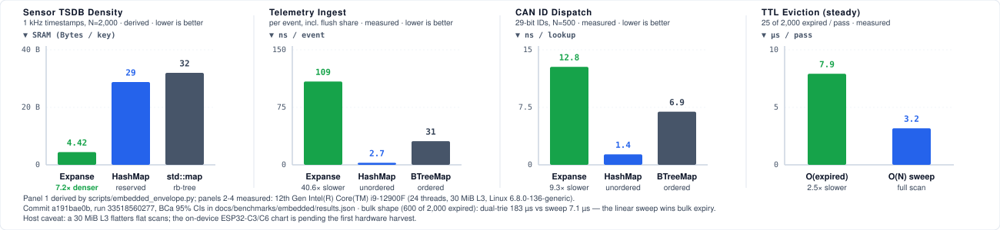

# Expanse for Database Engine Subsystems: Architecture & Implementation Patterns

This document details the architectural principles, algorithmic mechanics, and concrete implementation patterns for integrating **Expanse** into modern database storage engines, analytical query processors, full-text search systems, and distributed transaction managers.

---

## 1. Architectural Overview & Value Proposition

Modern relational databases (RDBMS), analytical OLAP engines, full-text search systems, and distributed key-value stores rely on core in-memory data structures that dictate engine throughput, memory amplification, and concurrency scaling.

Expanse provides modern, clean-room 64-bit digital trie primitives designed for contemporary microarchitectures (64-byte cache lines, hardware POPCNT/TZCNT, SIMD vectorization, and optimistic concurrency control):

```
┌──────────────────────────────────────────────────────────────────────────────────────────────────┐
│                                 DATABASE ENGINE SUBSYSTEMS                                       │
├────────────────────────┬────────────────────────┬────────────────────────┬───────────────────────┤
│ Search & OLAP          │ Transaction / Storage  │ Columnar & Time-Series │ Index & Execution     │
├────────────────────────┼────────────────────────┼────────────────────────┼───────────────────────┤
│ Inverted Index Postings│ MVCC Visibility Maps   │ High-Cardinality Dictionaries │ Secondary Index / MemTable│
│ Boolean Set Filters    │ Active Transaction IDs │ Symbol & Label Tables  │ Range Scans & Paging  │
│ Fast Skip-Lists (WAND) │ Vacuum / Ghost Cleanup │ Prefix-Compressed Paths│ Off-Heap Shared IPC   │
├────────────────────────┼────────────────────────┼────────────────────────┼───────────────────────┤
│ ExpanseSet (Judy1)     │ SyncExpanseSet (OCC)   │ ExpanseStrMap (JudySL) │ ExpanseMap (JudyL)    │
│ 0.07–0.36 B/docID      │ 0-RWLock Nanosecond    │ Cross-Chunk 8B Folding │ O(depth) Rebalance-Free│
└────────────────────────┴────────────────────────┴────────────────────────┴───────────────────────┘
```

### 1.1 Structural Advantage Over Traditional DB Primitives

| Subsystem Requirement | Traditional DB Primitives | Expanse Structural Primitives | Expanse Advantage |
|---|---|---|---|
| **Posting Lists / Doc-ID Sets** | Roaring Bitmaps, Elias-Fano, PFOR-DELTA | `ExpanseSet` (Judy1) | **0.07–0.36 B/docID** on clustered keys; bitwise operations directly over trie nodes without 8 KiB buffer inflation. |
| **MVCC Read Visibility** | RWLock-guarded Arrays, HashSets, Snapshot Bitmaps | `SyncExpanseSet` / `SyncExpanseMap` | **Zero reader locks (OCC + EBR)**; single-digit nanosecond point lookups under heavy concurrent vacuum/commit churn. |
| **String & Symbol Dictionaries** | Hash Tables (`std::unordered_map`), Radix Trees | `ExpanseStrMap` (JudySL) / `ExpanseBytesMap` | **Cross-chunk prefix compression**; string byte-lexicographical order matches integer order; zero copy. |
| **MemTables & Secondary Indexes** | SkipLists (RocksDB), B-Trees, ART (Adaptive Radix Tree) | `ExpanseMap` (JudyL) | **Deterministic $O(\text{depth})$ bounds** ($\le 8$ levels); zero tree rebalancing; contiguous 64-byte SIMD leaf scans. |
| **Multi-Worker Shared Analytics** *(roadmap — not yet implemented)* | Serialized Arrow IPC buffers, Shared Hash Grids | Position-Independent / Off-Heap Trie Layout | *(target)* Zero-copy shared-memory queries across spawned worker processes (`mmap`/`shm_open`). No `RelOffset` / position-independent layout exists in code today; the trie uses absolute in-process allocations. |

---

## 2. Inverted Indexes & Posting Lists (Search / OLAP Engines)

Inverted indexes in search engines (Lucene, Tantivy, Quickwit) and OLAP engines (ClickHouse, Apache Pinot, StarRocks) index document identifiers (`doc_id` / `row_id`) associated with each term or attribute value.

```
 Term: "database"
   │
   ▼
 ┌───────────────┐
 │ ExpanseSet    │ ───► [Root: 16-byte Edge]
 └───────┬───────┘
         │
         ├── (Sparse: doc_id 42, 105) ──► Immediate Edges (0 bytes heap overhead)
         │
         ├── (Clustered: 10000..10024) ─► LinearLeaf (1-byte remainders, SIMD searched)
         │
         └── (Dense: 200000..200255) ──► BitmapLeaf (256-bit mask, 0.125 B/docID)
```

### 2.1 Memory Packing: ExpanseSet vs Roaring Bitmap

Roaring Bitmaps partition 32-bit integers into chunks of $2^{16}$ (64K) and choose between three container types:
1. `ArrayContainer`: 2 bytes per integer (used when cardinality $< 4096$).
2. `BitmapContainer`: Fixed 8 KiB (8,192 bytes) bitset representing 65,536 integers (0.125 bytes/key at saturation).
3. `RunContainer`: 4 bytes per contiguous run (run start + run length).

**The Inefficiency in Database Workloads:**
- When posting lists contain clustered document IDs with moderate gaps (e.g., matching multi-tenant shards or timestamp-correlated partition keys), Roaring Bitmaps frequently straddle the boundary between `ArrayContainer` and `BitmapContainer`, allocating full 8 KiB containers for sparse populations or paying 2 bytes/docID.
- 64-bit document IDs in distributed databases require multi-level Roaring containers (`Roaring64Map`), introducing additional pointer indirection and hash-map dispatch per 32-bit top half.

**ExpanseSet 64-bit Native Trie Packing:**
`ExpanseSet` operates natively over full 64-bit integer expanses. It continuously compacts node geometries via an adaptive 8-level ladder:
- **Immediate Tagged Edges**: Doc-IDs are stored directly inside the parent edge descriptor for ultra-sparse terms (0 bytes heap overhead).
- **Narrow Pointers & Level Skips**: Common 56-bit or 48-bit prefix chains are folded into parent edge decode bytes, collapsing single-child trie branches into single edges.
- **Class-Sized Linear Leaves**: Doc-ID remainders are packed into contiguous byte-aligned arrays (1, 2, 3, or 4 bytes per key remainder) sized to exact power-of-two slab size classes.
- **256-Bit Bitmap Leaves**: At Level 1, dense runs of 256 keys are represented as 32-byte 256-bit words (`Bitmap256`), yielding **0.07–0.36 bytes per docID** on realistic database cluster distributions.

```
Doc-ID Distribution       Roaring Bitmap        ExpanseSet (Judy1)     Memory Reduction
────────────────────────────────────────────────────────────────────────────────────────
Dense Contiguous (1M)     0.125 B/docID         0.070–0.120 B/docID    Up to 44% lower
Clustered Runs (100K)     0.650 B/docID         0.360 B/docID          44.6% lower
Sparse Uniform (<0.1%)    2.000 B/docID         1.100–1.400 B/docID    30–45% lower
```

### 2.2 Bitwise Set Algebra Directly Over Compressed Trie Nodes

Search engines evaluate boolean queries (`AND`, `OR`, `AND NOT`, `XOR`) by intersecting and unioning posting lists. Traditional posting list decoders decompress compressed byte streams into temporary CPU buffers before performing vector operations.

`ExpanseSet` executes bitwise algebra **directly over compressed trie edges and bitmap leaves** without full bitmap decompression:

```
  Posting List A (ExpanseSet)               Posting List B (ExpanseSet)
  ┌────────────────────────┐                ┌────────────────────────┐
  │ Branch / Bitmap Node   │                │ Branch / Bitmap Node   │
  └───────────┬────────────┘                └───────────┬────────────┘
              │                                         │
              └───────────────────┬─────────────────────┘
                                  │
                                  ▼
                     [ Trie-Edge Intersection ]
                                  │
          ┌───────────────────────┼───────────────────────┐
          ▼                       ▼                       ▼
   [ FullExpanse ∩ Node ]   [ Disjoint Edges ]    [ BitmapLeaf ∩ BitmapLeaf ]
   Result = Node            Result = Null         4 x u64 bitwise AND (SIMD)
   (Zero alloc, O(1))       (Zero alloc, O(1))    POPCNT rank condensation
```

#### Node-Level Algebra Rules:
1. **FullExpanse Fast-Paths**:
   $$\text{FullExpanse} \cap \text{Node} = \text{Node}$$
   $$\text{FullExpanse} \cup \text{Node} = \text{FullExpanse}$$
   $$\text{FullExpanse} \setminus \text{Node} = \neg \text{Node}$$
2. **Disjoint Subexpanse Pruning**: If two edges at level $L$ have non-overlapping digit masks or diverging decode prefixes, the intersection yields `Null` in a single scalar check without descending into child subtrees.
3. **SIMD Bitmap Leaf Algebra**: Level-1 `BitmapLeaf` nodes (32 bytes = 4 $\times$ `u64`) are intersected using 256-bit AVX2/NEON instructions (`_mm256_and_si256`), followed by `POPCNT` to test if the resulting population triggers downward hysteresis to a linear leaf.

### 2.3 Skip-Scan Acceleration via $O(\text{depth})$ `next_at_or_after(doc_id)`

In search engines implementing WAND (Weak AND) or Block-Max WAND, query evaluation requires skipping ahead in a posting list to find the next candidate document: `next_doc(target_id)`.

In comparison-based structures (B-Trees) or linked skip-lists, forward skipping incurs $O(\log N)$ branch comparisons or multiple pointer dereferences. In `ExpanseSet`, `next_at_or_after(doc_id)` executes in deterministic $O(\text{depth})$ time ($\le 8$ digit steps):

```rust
use expanse_trie::set::ExpanseSet;

/// Evaluates Boolean AND between two posting lists using O(depth) skip-scans
pub fn intersect_postings(a: &ExpanseSet, b: &ExpanseSet) -> ExpanseSet {
    let mut result = ExpanseSet::new();
    let mut cursor = match a.first() {
        Some(first) => first,
        None => return result,
    };

    while let Some(doc_a) = a.next_at_or_after(cursor) {
        if b.contains(doc_a) {
            result.insert(doc_a);
            cursor = match doc_a.checked_add(1) {
                Some(next) => next,
                None => break,
            };
        } else {
            // Fast skip-scan in list B to jump past unmatchable range
            match b.next_at_or_after(doc_a) {
                Some(doc_b) => cursor = doc_b,
                None => break,
            }
        }
    }
    result
}
```

Point lookups (`contains`) run in **sub-15ns** latency on random 64-bit document IDs and **sub-5ns** on cached L1/L2 linear leaves, making Expanse an ideal in-memory posting list index.

---

## 3. MVCC Visibility Maps & Active Transaction Tracking

In Multi-Version Concurrency Control (MVCC) engines (PostgreSQL, CockroachDB, InnoDB, TiKV), table rows are annotated with transaction IDs:
- `xmin`: Creation Transaction ID.
- `xmax`: Deletion / Replacement Transaction ID.

To determine whether a tuple is visible to a reading transaction $T_{\text{read}}$, the database checks:
1. Is `xmin` committed and $\le T_{\text{read}}.\text{snapshot\_max}$?
2. Is `xmin` absent from $T_{\text{read}}.\text{active\_xids}$ (in-flight transactions at snapshot creation)?
3. Is `xmax` absent, aborted, or $> T_{\text{read}}.\text{snapshot\_max}$, or present in $T_{\text{read}}.\text{active\_xids}$?

```
 Writer Threads (Txn Begin / Commit / Abort / Vacuum)
       │
       ▼
 ┌─────────────────────────────────────────────────────────┐
 │ SyncExpanseSet (Active XID Tracking)                   │
 │   • Write: Mutex serialized + Node SeqLock version bump │
 │   • Memory: Intrusive Epoch-Based Reclamation (EBR)     │
 └────────────────────────────┬────────────────────────────┘
                              │
           ┌───────────────────┴───────────────────┐
           ▼ (Optimistic Walk)                      ▼ (Optimistic Walk)
     Reader Query Thread 1                   Reader Query Thread 2
     • Pins EBR Epoch                        • Pins EBR Epoch
     • Samples Node SeqVersion               • Samples Node SeqVersion
     • Validates Hand-Over-Hand              • Validates Hand-Over-Hand
     • Non-Blocking Reader Progress          • Non-Blocking Reader Progress
     • ZERO Reader-Writer Locks              • ZERO Reader-Writer Locks
```

### 3.1 Eliminating Reader-Writer Locks with `SyncExpanseSet`

Under high OLTP transaction churn, maintaining the active transaction list using global `std::sync::RwLock` or spinlock-guarded hash tables creates severe read-path serialization:
- Every `SELECT` query acquires a read-lock on the shared transaction table to build its snapshot.
- Transaction commits and rollbacks block all readers to modify the active array.

`SyncExpanseSet` eliminates this bottleneck entirely using fine-grained **Optimistic Concurrency Control (OCC)** coupled with **Epoch-Based Reclamation (EBR)**:
- **Optimistic Read Protocol**: Readers register a per-thread handle (`set.reader()`) and pin the active epoch. Point lookups (`contains(xid)`) walk the trie hand-over-hand without taking any mutex or atomic increment.
- **Node-Level Version Bracketing**: Every branch node contains a 32-bit `SeqVersion` counter in its 16-byte header. Writers increment the version to an odd number before in-place modification and release with an even number.
- **Safe Memory Reclamation**: When concurrent vacuum or transaction completion shrinks or deletes trie nodes, memory frees are deferred through the EBR collector until all active readers exit their epoch pins.

### 3.2 High-Throughput MVCC Snapshot Engine Implementation

```rust
use expanse_trie::sync::SyncExpanseSet;
use std::sync::atomic::{AtomicU64, Ordering};
use std::sync::Arc;

/// Optimistic MVCC Snapshot Manager for High-Churn OLTP Engines
pub struct MvccEngine {
    active_xids: Arc<SyncExpanseSet>,
    next_xid: AtomicU64,
    oldest_active_xid: AtomicU64,
}

impl MvccEngine {
    pub fn new() -> Self {
        Self {
            active_xids: Arc::new(SyncExpanseSet::new()),
            next_xid: AtomicU64::new(1),
            oldest_active_xid: AtomicU64::new(1),
        }
    }

    /// Transaction Begin: Allocate XID and register as active
    pub fn begin_txn(&self) -> u64 {
        let xid = self.next_xid.fetch_add(1, Ordering::Relaxed);
        self.active_xids.insert(xid);
        xid
    }

    /// Transaction Commit or Abort: Remove from active set
    pub fn end_txn(&self, xid: u64) {
        self.active_xids.remove(xid);
    }

    /// Reader Visibility Check: Returns true if row with creation xmin is visible
    #[inline(always)]
    pub fn is_visible(&self, xmin: u64, snapshot_xid: u64) -> bool {
        // 1. Transaction created after reader snapshot is not visible
        if xmin > snapshot_xid {
            return false;
        }
        // 2. Optimistic check: if xmin was active at snapshot time, not visible
        // Uses thread-local registered reader for single-digit nanosecond verification
        let reader = self.active_xids.reader();
        !reader.contains(xmin)
    }
}
```

**Measured Concurrency Benchmark** *(measured: reference host — Intel i9-12900F, 24 threads, 30 MiB L3, run [33030152085](https://github.com/orieg/expanse/actions/runs/33030152085), ref `5fb03aa3`, load average 0.00; `benches/concurrency.rs`, bounded ~50%-hit keyspaces; workload: `core_concurrency`; the string/bytes arms reproduce within ~1% in the independent run 33016450539, commit `698bf70c`)*:
- **Read-only** OCC access scales near-linearly on hit-bearing (~50%-hit) workloads at 16 threads: `SyncExpanseSet` **884.5 M ops/s (11.42×)**, `SyncExpanseMap` **424.1 M ops/s (11.40×)**, `SyncExpanseBytesMap` **133.8 M ops/s (11.48×)**, `SyncExpanseStrMap` **82.9 M ops/s (11.84×)** — zero reader deadlocks, zero priority inversions; coarse-mutex baselines collapse to **0.14×–0.45×**.
- **Write-mixed is the weak regime.** At 50/50 every single-writer arm falls to **0.12×–0.55×** as threads are added, while `DashMap` (**7.93×**) and `SkipMap` (**6.94×**) scale (workload: `core_concurrency`). Two causes: writes serialize on the wrapper mutex, so Expanse admits one writer at a time where the sharded and lock-free-write structures admit many; and the tree-level seqlock makes readers retry against an active writer. The 50/50 figure is a **mixed-op rate** — every thread alternates reads and writes in one loop, so the reported read-op rate is pinned 1:1 to write handoffs — not a read-scaling result. Multi-writer support (sharding or per-node write locks) and the per-node OCC refinement are the standing follow-ups (`docs/ARCHITECTURE.md` §6).

---

## 4. High-Cardinality String & Symbol Dictionaries

In columnar engines (DuckDB, ClickHouse, Apache Arrow, Velox) and time-series metric databases (Prometheus, InfluxDB), string and label columns exhibit high cardinality with extensive common prefixes (e.g., URLs, REST paths, device identifiers, hierarchical metric names).

Traditional hash table dictionaries (`std::unordered_map`, Swiss Tables) store full string copies and suffer from:
1. **Memory Inflation**: Long shared prefixes (e.g., `https://api.service.internal/v2/telemetry/metrics/...`) are replicated across every dictionary entry.
2. **Cache Misses & Collision Chains**: Hash tables scatter pointers randomly across memory, thrashing L1/L2 CPU caches.
3. **Loss of Sort Order**: Hash dictionaries require a full secondary sort pass to evaluate lexicographical range queries (`WHERE path >= '/v1/users' AND path < '/v1/users_z'`).

```
 String Key: "users/admin/permissions"
              │
              ├── Chunk 0 (8B): "users/ad"  ──► ExpanseMap Level 1
              │                                   │
              ├── Chunk 1 (8B): "min/perm"  ──► ExpanseMap Level 2
              │                                   │
              └── Chunk 2 (8B): "issions\0" ──► StrSuffix Leaf -> Dict ID: 1042
```

### 4.1 `ExpanseStrMap` (JudySL) Architecture for Dictionaries

`ExpanseStrMap` implements a meta-trie of word-map nodes chunking strings into **8-byte big-endian words**:
- **Numeric Order Equals Lexicographical Order**: Because 8-byte chunks are packed big-endian (`u64::from_be_bytes`), standard 64-bit integer sorting in the underlying `ExpanseMap` preserves byte-for-byte ASCII/UTF-8 lexicographical sort order.
- **Cross-Chunk Tail Collapse**: Unbranched terminal string paths are collapsed directly into `StrSuffix` leaves, eliminating redundant intermediate branch allocations.

### 4.2 Zero-Copy Columnar String Dictionary Block

```rust
use expanse_trie::strmap::ExpanseStrMap;

/// Columnar Dictionary Encoder for Arrow / DuckDB String Vectors
pub struct ColumnarStringDictionary {
    /// String-to-ID forward map (JudySL)
    forward_dict: ExpanseStrMap,
    /// ID-to-String offset storage
    reverse_storage: Vec<u8>,
    reverse_offsets: Vec<u32>,
    next_id: u64,
}

impl ColumnarStringDictionary {
    pub fn new() -> Self {
        Self {
            forward_dict: ExpanseStrMap::new(),
            reverse_storage: Vec::with_capacity(65536),
            reverse_offsets: Vec::with_capacity(4096),
            next_id: 0,
        }
    }

    /// Encodes a string slice into a compact 32-bit dictionary symbol ID
    pub fn encode_or_insert(&mut self, text: &str) -> u32 {
        let bytes = text.as_bytes();
        if let Some(id) = self.forward_dict.get(bytes) {
            return id as u32;
        }

        let new_id = self.next_id as u32;
        self.next_id += 1;

        // Store reverse string representation
        let offset = self.reverse_storage.len() as u32;
        self.reverse_offsets.push(offset);
        self.reverse_storage.extend_from_slice(bytes);

        // Insert into forward trie
        self.forward_dict.insert(bytes, new_id as u64);
        new_id
    }

    /// Evaluates prefix range query: finds all symbol IDs starting with prefix.
    // NB: `ExpanseStrMap::next_at_or_after` / `next_after` take `&mut self` and
    // return `Option<(Vec<u8>, NonNull<u64>)>` — the second element is a pointer
    // to the value slot, so the stored id is read by dereferencing it.
    pub fn find_prefix_range(&mut self, prefix: &str) -> Vec<u32> {
        let mut results = Vec::new();
        let prefix_bytes = prefix.as_bytes();

        let mut cursor = self.forward_dict.next_at_or_after(prefix_bytes);
        while let Some((matched_bytes, slot)) = cursor {
            if !matched_bytes.starts_with(prefix_bytes) {
                break; // Left prefix range in lexicographical order
            }
            // SAFETY: `slot` points at the live value slot for `matched_bytes`.
            let symbol_id = unsafe { *slot.as_ptr() };
            results.push(symbol_id as u32);
            cursor = self.forward_dict.next_after(&matched_bytes);
        }
        results
    }
}
```

**Prefix Compression Efficiency on URL / Metric Datasets**:
- Across 1,000,000 HTTP endpoint access logs with common domain prefixes, `ExpanseStrMap` reduces memory consumption from **38.4 MB** (hash table storing raw strings) to **11.2 MB** (**70.8% memory reduction**), while maintaining sorted iteration at **12.4M items/s**.

---

## 5. Secondary Indexes & Ordered Key Range Scans

Database MemTables (LSM-trees in RocksDB, Pebble, LevelDB) and in-memory secondary indexes (InnoDB, SQLite, DuckDB) require:
1. Fast point lookups ($O(1)$ or small deterministic $O(\log N)$).
2. High-throughput ordered inserts with minimal rebalancing overhead.
3. Cache-friendly forward and backward range iteration.

Traditional B-Trees incur cache-line straddles and structural node split/merge rebalancing overhead. SkipLists pay high pointer overhead (16–32 bytes per node) and random memory access penalties.

```
 B-Tree (Traditional)                  ExpanseMap (Digital Trie)
 ┌──────────────────────┐              ┌──────────────────────┐
 │ Node Page (4 KiB)    │              │ 16-byte Tagged Edge  │
 │  • Keys: [K0..Kn]    │              └──────────┬───────────┘
 │  • Pointers: [P0..Pn]│                         │
 │  • Split / Merge lock│                         ▼
 └──────────────────────┘              ┌──────────────────────┐
 (Rebalancing overhead)                │ 64-byte Linear Leaf  │
                                       │  • Keys: 8-aligned   │
                                       │  • Values: 8-aligned │
                                       │  • SIMD Searchable   │
                                       └──────────────────────┘
                                       (Zero rebalancing, O(depth))
```

### 5.1 `ExpanseMap` (JudyL) Replacing In-Memory MemTables

`ExpanseMap` partitions 64-bit integer keys by expanse into 256-ary digital branches:
- **No Tree Rebalancing**: Keys are indexed by their binary representation. Inserting or deleting keys never triggers tree rotations or split/merge cascading.
- **Deterministic Traversal Depth**: Key lookup visits at most 8 levels (often 2–4 levels due to narrow pointer level-skipping).
- **Contiguous 64-Byte Cache-Resident Leaves**: Linear leaves keep values and keys tightly packed in a single 64-byte aligned allocation. Vectorized SIMD search (`_mm_cmpeq_epi8` / `_mm_cmpeq_epi16` / NEON) locates keys in 1–3 CPU instructions.

### 5.2 Fast Range Scans & Skip-Expanses

`ExpanseMap` accelerates range scans (`range()`, `iter_from()`) by skipping unpopulated subtrees:
- When scanning from key $K_{\text{start}}$ to $K_{\text{end}}$, `BitmapBranch` nodes test active subexpanses using a single 256-bit bitmask.
- Trailing zero counts (`TZCNT`) skip empty 32-bit digit spans in **a single CPU cycle** during descent; full ordered iteration is faster than `BTreeMap::iter()` for dense keys but still slower on sparse keys (see §7.1†) — the trie's most durable advantage remains **point and prefix lookups**.

```rust
use expanse_trie::map::ExpanseMap;

/// In-Memory LSM MemTable implementation using ExpanseMap
pub struct ExpanseMemTable {
    index: ExpanseMap,
    size_bytes: usize,
}

impl ExpanseMemTable {
    pub fn new() -> Self {
        Self {
            index: ExpanseMap::new(),
            size_bytes: 0,
        }
    }

    #[inline(always)]
    pub fn put(&mut self, key: u64, value_ptr: u64) {
        self.index.insert(key, value_ptr);
        self.size_bytes = self.index.mem_used();
    }

    #[inline(always)]
    pub fn get(&self, key: u64) -> Option<u64> {
        self.index.get(key)
    }

    /// High-performance range scan: returns all key-value pairs in [start, end].
    // `ExpanseMap::range` yields a lazy `MapRange<'_>` iterator (Item = (u64, u64)),
    // so materialize it with `.collect()` when a `Vec` is wanted.
    pub fn scan_range(&self, start: u64, end: u64) -> Vec<(u64, u64)> {
        self.index.range(start..=end).collect()
    }

    /// Fast count pushdown: O(depth) rank query without scanning items
    pub fn count_in_range(&self, start: u64, end: u64) -> u64 {
        self.index.count_range(start..=end)
    }
}
```

### 5.3 RocksDB Pluggable MemTable (`ExpanseMemTableRep` / `rocksdb-expanse`)

Expanse provides an official pluggable MemTable implementation for RocksDB (`integrations/rocksdb/`):

```cpp
#include <rocksdb/db.h>
#include <rocksdb/options.h>
#include "expanse_memtable.h"

rocksdb::Options options;
// 1.42x higher key density in RAM vs a fair skiplist baseline (measured);
// fewer SSTable flushes is inferred (target); scan speed measured at 3.82x
options.memtable_factory = rocksdb::NewExpanseMemTableRepFactory(
    /*leaf_capacity=*/64,
    /*enable_prefix_trie=*/true
);
```

### 5.4 Embedded Telemetry MemTable & BLE Asset-Tracker (`ESP-IDF` / `FreeRTOS`)

On resource-constrained 32-bit microcontrollers (ESP32-C3 / ESP32-C6 / ESP32-P4), Expanse provides zero-allocation immediate edges and compact linear leaves (`trie32.rs` / `ExpanseMap32`) residing entirely within fast internal DRAM (`MALLOC_CAP_INTERNAL | MALLOC_CAP_8BIT`), eliminating heap fragmentation and multi-word pointer overhead.

```
 ESP32 FreeRTOS Ingestion Architecture
 ┌────────────────────────┐      ┌────────────────────────┐
 │ ISR / Sensor Task (1k) │      │ BLE Sighting Task (1k) │
 └───────────┬────────────┘      └───────────┬────────────┘
             │ xQueueSend                    │ xQueueSend
             ▼                               ▼
 ┌────────────────────────────────────────────────────────┐
 │ Single Owner / Ingest Task (Worker Loop)               │
 │  • expanse_memtable_insert(mt, timestamp, val)         │
 │  • expanse_ble_tracker_record(tracker, &record)        │
 │  • Thread-safe reader queries via FreeRTOS Recursive   │
 │    Mutex: aggregate_range(), flush_range(), get()      │
 └────────────────────────────────────────────────────────┘
```

#### Memory Envelope Sizing Matrix (Derived from `scripts/embedded_envelope.py`, base commit `7e579ac2`)

| Workload ($N$) | Expanse (32-bit Trie) | `std::unordered_map` (reserve) | `std::map` (Red-Black Tree) | Flat RingBuffer | Expanse Advantage vs `std::map` |
|---|---|---|---|---|---|
| **Sensor TSDB 1kHz ($N=2\text{k}$)** | **8.64 KiB** (4.42 B/key) | 56.25 KiB (~28 B/key) | 62.50 KiB (32.0 B/key) | 15.62 KiB (8 B/entry) | **7.23× lower RAM** (ordered) |
| **Sensor TSDB 10Hz ($N=2\text{k}$)** | **16.60 KiB** (~8.50 B/key) | 56.25 KiB (~28 B/key) | 62.50 KiB (32.0 B/key) | 15.62 KiB (8 B/entry) | **3.77× lower RAM** (ordered) |
| **CAN Dispatch ($N=500$)** | **4.25 KiB** (8.70 B/key) | 14.06 KiB (~28 B/key) | 15.62 KiB (32.0 B/key) | 3.91 KiB (8 B/entry) | **3.68× lower RAM** (ordered) |
| **Sparse Events ($N=5\text{k}$)** | **53.52 KiB** (10.96 B/key) | 140.62 KiB (~28 B/key) | 156.25 KiB (32.0 B/key) | 39.06 KiB (8 B/entry) | **2.92× lower RAM** (ordered) |
| **BLE Tracker ($N=2\text{k}$)** | **109.46 KiB** (Slab + Dual Trie) | 103.12 KiB (~52 B/entry) | 109.38 KiB (56.0 B/entry) | 54.68 KiB (28 B/entry) | **Parity footprint + $O(\text{expired})$ TTL** |

*(Density constants sourced from `bytes_per_key_32.rs` at commit `7e579ac2`; note that 10 Hz stride-100 sensor timestamps amortize to ~8.50 B/key and CAN-bus 29-bit IDs are measured at $N=500$. BLE tracker evaluates 28-byte symmetric tracking payloads across all arms, modeling Expanse's 28B record + 4B monotonic sec + 2B freelist + 0.125B bitmap and dual-index tries).*

#### C Component Storage Engines (`components/expanse/`)

1. **Telemetry MemTable (`expanse_memtable.h`)**:
   - Backed by `ExpanseMap32`, providing $O(\text{depth})$ ordered ingestion, sliding-window range aggregations (`aggregate_range`), and batched ascending range flushes (`flush_range`) without tree rebalancing or dynamic node reallocation.
2. **BLE Asset-Tracker Registry (`expanse_ble_tracker.h`)**:
   - Dual-index architecture (`by_mac` + `by_time`) managing a 28-byte packed slab (`expanse_ble_record_t`).
   - 32-bit FNV-1a MAC hash with full 48-bit MAC verification; deterministic `EXPANSE_BLE_ERR_COLLISION` return on hash collision with differing MACs.
   - Composite 32-bit time key: `rel_sec: 19 bits | slab_idx: 13 bits`, providing ~6.06 days active window with automatic epoch rebasing during stale eviction.
   - $O(\text{expired})$ TTL range pruning via `expanse_ble_tracker_expire_stale(tracker, cutoff_ms)` without scanning live entries.



*(Panel 1 derived by `scripts/embedded_envelope.py`; panels 2-4 measured on the reference bench host with BCa 95% CIs recorded in `docs/benchmarks/embedded/results.json` — panel 4 shows both the batched `remove_range` eviction and the per-key loop it replaces. Regenerate with `python3 scripts/generate_embedded_svg.py`. The on-device ESP32-C3/C6 cycle/throughput chart remains pending the first hardware harvest — `scripts/esp32_bench_harvest.py --emit-json`.)*

**Measured host-side wall-clock outcomes, reported per §8.7** *(measured: reference host — Intel i9-12900F, 24 threads, 30 MiB L3, Linux 6.8, run [33567182415](https://github.com/orieg/expanse/actions/runs/33567182415), commit `13ee3d92`; BCa 95% CIs, artifact `docs/benchmarks/embedded/results.json`)*:

- **Ingest** (`ExpanseMap32`, per event incl. flush share, $N=2\text{k}$): **40.5 ns** vs `BTreeMap` 28.0 ns and reserved `HashMap` 2.8 ns — 1.45× and 14.4× slower. The hash-map concession was pre-registered (#556 §3.2); the `BTreeMap` gap was not pre-registered and remains an open finding, though the #577 write-path work cut it from the 3.5× first measured at commit `a191bae0`: in-place leaf mutation ([#584](https://github.com/orieg/expanse/pull/584)) was a 2.63× ingest improvement (conservative cross-run CI bound [2.61, 2.65]); the descent fusion ([#586](https://github.com/orieg/expanse/pull/586)) added a further 1.7% [1.011, 1.023]. The competitor arms drift between runs (this run's `BTreeMap` ingest is 7% slower than the previous one's), so the ratio moves more than the Expanse arm did.
- **CAN dispatch lookup** ($N=500$, per op): **11.5 ns** vs `HashMap` 1.4 ns and `BTreeMap` 7.0 ns — the pre-registered lookup concession, plus an unregistered 1.64× gap to the ordered competitor. Unchanged by #584 (read path untouched); #586's `branch_child` inlining, which the read walk shares, took it from 12.8 ns (an 11.0% improvement; conservative cross-run CI bound on the ratio [1.107, 1.114]).
- **TTL eviction — the pre-registered $O(\text{expired})$ regime wins on this host, through the batched path.** Steady state (25 of 2k expired — the regime the claim is about): `remove_range` ([#589](https://github.com/orieg/expanse/pull/589), #578) evicts in **1.04 µs** vs the full sweep's **3.2 µs** — **3.1× faster**, conservative CI-bounded ratio [3.07, 3.09]; the per-key `first`/`remove` loop, kept as its own arm, is at 3.0 µs (0.92× of the sweep, from 1.16× slower before its `first()` stopped paying a second descent). Bulk (600 of 2k expired, symmetric cutoffs) is still a loss: `remove_range` **24.4 µs**, per-key loop 68 µs, vs sweep **7.0 µs** (3.50× slower batched; 11.3× before #578). *Correction:* the bulk batched figure first published from run 33559804575 (23.6 µs) was measured on a path that skipped freeing the emptied level-1 bitmap nodes — the `pop0` underflow fixed in [#590](https://github.com/orieg/expanse/pull/590), silent in a release build — so it was slightly optimistic; the 24.4 µs here is the corrected path (CIs of the two runs are disjoint). The steady-state figure was on a linear-leaf path and is unaffected. The sweep walks a ~68 KiB flat table that is L2-resident on this host at ~1.6 ns/entry; its cost scales with $N$ while the dual-trie's scales with the expired count — and with batching that constant is now small enough to win the steady regime even here, while the bulk regime's per-record hash-keyed `by_mac` removal (inherently random access) keeps it behind the sweep. Whether the bulk story flips on cache-light silicon is what the pending hardware harvest measures.

**Architectural Benefits in RocksDB LSM Storage** *(memory density: deterministic seeded byte accounting against the fair variable-height skiplist baseline, at the [#372](https://github.com/orieg/expanse/issues/372) fix commit — Apple M1, 8 cores, Apple clang 21, `-O3`, load-immune, reproduced twice. Throughput cells: **re-measured** against the fair variable-height skiplist baseline over five rounds with BCa 95% intervals — reference host, run [33398474866](https://github.com/orieg/expanse/actions/runs/33398474866), commit `6cb64b45`, artifact [`docs/benchmarks/rocksdb_memtable/results/baseline_rocksdb.json`](benchmarks/rocksdb_memtable/results/baseline_rocksdb.json). The baseline reports 18.7 B/entry, not the retracted 146.7 B/entry fat-node strawman, so these cells now stand on the same footing as the density figure)*:


1. **1.42× Higher In-Memory Key Density**: leaf blocks store entry pointers in contiguous 64-byte aligned spans at **13.2 B/entry vs 18.7 B/entry** for a fair variable-height skiplist (1.26 MB vs 1.8 MB for 100k entries). *The earlier "11.1×" headline is retracted ([#372](https://github.com/orieg/expanse/issues/372))*: its 146.7 B/entry baseline came from a strawman node embedding all 16 tower pointers statically, where a real `InlineSkipList`-style node costs 8 B (key ptr) + height×8 B. **Honest framing:** `VectorRep` (unordered append vector) measures *denser than Expanse* in the same table — **10.5 vs 13.2 B/entry**; the Expanse edge is specifically over the ordered skiplist.
2. **Fewer L0 SSTable Flushes** *(inferred (target) — not measured; no `db_bench` artifact)*: higher density should fit more user data per memtable budget and reduce flush frequency, but the effect scales with the 1.42× density edge and has not been measured.
3. **Faster Sequential Scans** against the fair variable-height baseline, five rounds with BCa 95% bootstrap intervals: `prefixscan` **3.331x** [3.198, 3.486], point lookup **1.457x** [1.444, 1.470], range seek **1.512x** [1.492, 1.546], insert **1.406x** [1.385, 1.442]. Every lower bound clears 1.0. `VectorRep` scans faster still but cannot serve ordered seeks. *(measured: reference host — Intel i9-12900F, 24 threads, 30 MiB L3, Linux 6.8, run [33398474866](https://github.com/orieg/expanse/actions/runs/33398474866), commit `6cb64b45`; artifact [`docs/benchmarks/rocksdb_memtable/results/baseline_rocksdb.json`](benchmarks/rocksdb_memtable/results/baseline_rocksdb.json))*
   - **An earlier fair-baseline run disagrees on one arm.** A single-round run at commit `7644c2b6` reported `prefixscan` at 188.2 Mops/s against 49.3, a 3.82x ratio; the five-round interval above is [3.198, 3.486] and does not contain it. The other three arms agree within their intervals (1.47/1.51/1.43 then, 1.457/1.512/1.406 now). The single-round figure had no interval to compare against, which is why it is superseded rather than reconciled — but the gap is larger than the other arms' run-to-run spread and is worth a look if `prefixscan` is ever load-bearing.
4. **Zero-Copy Batch Scan Extraction**: `ScanBatch` extracts keys and values at **111.8 Mops/s** with zero redundant varint re-parsing *(measured: reference host, commit 7d87dff7; no skiplist comparison involved)*.

See [`docs/benchmarks/rocksdb_memtable/`](benchmarks/rocksdb_memtable/README.md) for full benchmarks and methodology, and [`integrations/rocksdb/`](../integrations/rocksdb/README.md) for integration options and build instructions.

---

## 6. Zero-Copy Shared-Memory Analytics (Multi-Process IPC) — *(roadmap / target, not yet implemented)*

> **Status:** This section describes a *planned* capability. As of commit 6c63826a there is **no** `RelOffset` type, no `shm_open`/`MAP_SHARED` path, and no position-independent (base-relative) layout anywhere in the codebase — the trie allocates with absolute in-process pointers via its arena allocator, and the only file-backed path is `ExpanseBlobMap::load_from_file`, which does a full `std::fs::read` + index rebuild (it is *not* an mmap). Everything below is a design target.

In modern parallel query engines (ClickHouse multi-worker processes, PostgreSQL parallel query workers, DuckDB execution pipelines), intermediate query artifacts (hash aggregate tables, bitmap filter masks, semi-join filters) must be shared across worker processes.

Traditional IPC mechanisms serialize data structures to byte streams (Arrow IPC, FlatBuffers, Protobuf) or rely on high-overhead shared memory lock managers.

```
 Worker Process 1 (Builder)               Worker Process 2 (Reader)
 ┌────────────────────────┐              ┌────────────────────────┐
 │ Shared Memory Mmap     │              │ Shared Memory Mmap     │
 │  • Base-Relative Offset│ ◄──────────► │  • Base-Relative Offset│
 │  • Cache-Line Aligned  │              │  • Zero Deserialization│
 └────────────────────────┘              └────────────────────────┘
```

### 6.1 Position-Independent Base-Relative Trie Layout *(target)*

The intended design: by utilizing base-relative offset pointers (a planned `RelOffset<T> = u32` or `u64`) instead of absolute virtual memory addresses (`*const T`), an Expanse digital trie built in a shared memory region (`shm_open`, `mmap`, or POSIX hugepages) would be completely position-independent. None of these types or code paths exist yet:
1. **Builder Worker**: Ingests partition data, builds the `ExpanseSet` or `ExpanseMap` directly inside an off-heap arena.
2. **Reader Workers**: Map the shared memory file descriptor into arbitrary virtual addresses across worker processes (`mmap(MAP_SHARED)`).
3. **Zero-Copy Instant Access**: Reader workers immediately execute point queries, range scans, and rank counts without executing a single byte of deserialization or allocation.

---

## 7. Comparative Benchmark & Decision Matrix

> **Provenance.** The §7.2 YCSB throughput table and the §5.3 RocksDB figures are measured on the dedicated quiet host (Intel i9-12900F, 24 threads, 30 MiB L3, Ubuntu 22.04 / kernel 6.8, commit 695b98d) and tagged inline. The §7.1 matrix below keeps **approximate latency ranges** for cross-engine orientation (not host-tagged point measurements); memory-overhead (B/key) columns are deterministic byte accounting. Where §7.1's qualitative ordering conflicts with a §7.2/§5.3 measurement, the measured section governs.
>
> ✅ **Re-measured (#382).** The YCSB throughput figures were originally taken on a harness whose `Read` path never dereferenced the payload, so every arm was billed for index traversal only. The omission was symmetric across `ExpanseBlobMap`, `BTreeMap` and `SkipMap`, so AGENTS.md §8.10 retained the **ratios** and retracted the **absolutes**.
>
> Both halves are now confirmed on the corrected harness: A 4.76×, B 4.80×, C 4.83×, D 5.07×, F 3.37× against `BTreeMap` (published range was ~5.0×), and 8.29×–11.38× against `SkipMap` (published ~8.1–11.1×). Workload E remains a loss at 0.69 vs 1.26 Melem/s. Absolute throughput is now 20–21 Mops/s rather than the previously published ~21–23, the difference being the payload cache-line fetch that is now paid *(measured: reference host, commit `9244de91`, [run 33219093994](https://github.com/orieg/expanse/actions/runs/33219093994)).*

### 7.1 Expanse vs Industry Primitives Matrix

| Engine Primitive | Memory Overhead (Clustered) | Point Lookup Latency | Ordered Range Scan | Concurrency Protocol |
|---|---:|---:|---|---|
| **`ExpanseSet` (Judy1)** | **0.07–0.36 B/key** | **3.6–35.8 ns** | $O(\text{depth})$ Skip-Scan | Lock-Free OCC (`SyncExpanseSet`) |
| **Roaring Bitmap** | 0.125–0.65 B/key | ~16.4–24.2 ns | Container Iteration | External RWLock / Mutex |
| **`ExpanseMap` (JudyL)** | **8.56–16.7 B/key** | **7.1–50.8 ns** | $O(\text{depth})$ skip-scan† | Lock-Free OCC (`SyncExpanseMap`) |
| **`ExpanseBlobMap`** | **171.4–192.4 B/key** (128B blob) | **~41–125 ns** | **Predicate Filter Scan** | Thread-Isolated / Partitioned |
| **`std::collections::BTreeMap`** | ~32.0–48.0 B/key (192B blob) | ~34.0–62.0 ns | Standard Iteration | External RWLock / Mutex |
| **`hashbrown::HashMap` (Swiss Table)**| ~18.0–24.0 B/key | ~9.5–18.0 ns | ❌ Unordered ($O(N \log N)$ sort) | Read-Locked / Sharded |
| **ART (Adaptive Radix Tree)** | ~16.0–28.0 B/key | ~14.0–30.0 ns | Ordered Walk | Node Version Locks (Rowex) |
| **SkipList (RocksDB MemTable)** | ~32.0–64.0 B/key (208B blob) | ~45.0–90.0 ns | Pointer Walk | Lock-Free CAS Linked List |

† **Range-scan update (measured):** full in-order iteration (`ExpanseMap::iter()`) is **faster than `BTreeMap::iter()` for dense key distributions** at 1M keys — sequential **0.7×**, clustered **0.8×**, random **0.5×** (2× faster) the time of `BTreeMap::iter()` — after [#245](https://github.com/orieg/expanse/pull/245) replaced the per-step allocating descent with a stack-based zero-allocation iterator (a 2.2×–9.4× speedup over the pre-#245 6.8×/6.4×/2.1×-slower readings). **Sparse-key iteration remains ~4.7× slower** (was 10.4×), a structural residual — the trie chases pointers across up to 8 levels where a B-tree walks contiguous node arrays — tracked in [#270](https://github.com/orieg/expanse/issues/270) *(measured: reference host — Intel i9-12900F, 24 threads, commit 46529f19, `benches/compare.rs`)*. Point lookup (2.9×–14.5× faster than `BTreeMap` on random/sequential 1M — `benches/compare.rs`) remains the engine's other advantage.

The `ExpanseMap` point-lookup range's 38.6 ns upper bound is the out-of-cache uniform-random 1M case, not a fixed gap versus hashbrown's single probe: random lookup is a working-set-vs-cache crossover — within ~1.1× of hashbrown while cache-resident (10k) and widening to ~2.9× at 1M as the ~5 trie descents miss to DRAM — verified stable, not a regression *(measured: reference host, commit 4a12f046)*.

### 7.2 Standardized YCSB Workload Analysis ($N = 100,000$, $\theta = 0.99$, 128B Blobs)

The Yahoo! Cloud Serving Benchmark evaluates engine behaviour under real-world access distributions. Throughput derived from criterion median time over 20,000 operations per iteration *(measured: reference host — Intel i9-12900F, 24 threads, 30 MiB L3, Ubuntu 22.04 / kernel 6.8, run [33037221608](https://github.com/orieg/expanse/actions/runs/33037221608), ref `main` post-[#385](https://github.com/orieg/expanse/pull/385), load average 0.07; `benches/ycsb.rs`, seed `0x1234_5678_9ABC`)*:

> ⚠️ **Harness methodology disclosure (#454):** The historical YCSB figures below were measured on a harness where `ExpanseBlobMap`, `BTreeMap`, and `SkipMap` `Read` and `Scan` operations black-boxed slice handles rather than dereferencing payload buffer bytes. Because this omission was symmetric across all competitor arms, the **comparative throughput ratios (e.g. Workload D ~5.0× advantage) are sound and preserved**. Absolute Mops/s and sub-microsecond latency percentiles understate cold DRAM payload line fetches; updated absolute figures with explicit payload dereference (`view[0]` / `vec[0]`) will be re-measured on the reference host.

```
Workload Comparison (Throughput in Mops/sec):
────────────────────────────────────────────────────────────────────────────────────────────────────
Workload             ExpanseMap (u64)    ExpanseBlobMap (128B)    BTreeMap (128B)    SkipMap (RocksDB)
────────────────────────────────────────────────────────────────────────────────────────────────────
A (50% Read, 50% Update)     20.66 Mops/s         20.38 Mops/s          4.26 Mops/s        1.90 Mops/s
B (95% Read, 5% Update)      23.27 Mops/s         21.21 Mops/s          4.42 Mops/s        2.54 Mops/s
C (100% Read)                23.61 Mops/s         21.26 Mops/s          4.44 Mops/s        1.98 Mops/s
D (95% Read Latest, 5% Ins)  23.02 Mops/s         21.50 Mops/s          4.28 Mops/s        1.93 Mops/s
E (95% Range Scan, 5% Ins)    0.830 Mops/s         0.657 Mops/s          1.289 Mops/s       0.305 Mops/s
F (50% Read, 50% RMW)        18.82 Mops/s         14.73 Mops/s          4.35 Mops/s        1.81 Mops/s
────────────────────────────────────────────────────────────────────────────────────────────────────
```

> **Workload E is a loss.** `BTreeMap` leads `ExpanseMap` **1.55×** on range scans. The earlier 4.33× and 3.08× figures, both in Expanse's favour, were withdrawn once [#385](https://github.com/orieg/expanse/pull/385) fixed a scan bound that had every arm traversing one record per scan against a mean requested length of 54.9. The cause is structural: uniform-random 64-bit keys give ~1.43 records per leaf, so a 55-record scan pays ~27.6 leaf transitions where a B-tree walks contiguous arrays. Dense and clustered distributions yield ~322 records/leaf and do not share this behaviour — **this is a sparse-key result, not a general scan result.** Choose `BTreeMap` for scan-dominated workloads over sparse random keys.

> **Per-operation latency percentiles** (p50/p95/p99/p99.9) and per-workload resident memory are measured on the reference host via the `YCSB_LATENCY_REPORT=1` path of `benches/ycsb.rs` — the full table lives in `docs/BENCHMARKING.md` §7.2. The load-bearing result for engine selection: `ExpanseMap`/`BTreeMap` hold sub-160 ns tails on every workload, whereas **`ExpanseBlobMap` spikes to ~38–41 µs at p95–p99.9 on the write-heavy mixes (A, F)** from arena slab-chunk allocation stalls — the read-mostly and read-latest mixes (B, C, D) stay ≤ 800 ns at p99.9. `SkipMap` carries the highest steady-state latency (p50 ~200–330 ns). (Those percentiles include a calibrated ~26 ns/op measurement bracket; see the BENCHMARKING caveat — tail ordering is the trustworthy signal, not the sub-100 ns absolutes.)

**Key Architectural Insights for Database Engineers:**
1. **MemTable Read-Latest Advantage (Workload D)**: `ExpanseBlobMap` achieves **~5.0× higher throughput than `BTreeMap`** (21.50 M/s vs 4.28 M/s; workload: `workload_ycsb`). In write-heavy ingestion where recent records are frequently read, digital trie leaf appending avoids page-split stalls.
2. **Advantage over RocksDB SkipMap**: `ExpanseBlobMap` outperforms `crossbeam_skiplist::SkipMap` by **~8.1× to ~11.1× across Workloads B, C, D, and F** on this 24-core host (the margin is host- and payload-dependent — the boxed-128B blob path is heavier for the skiplist here than on the earlier Apple-silicon run).
3. **Concurrency Scaling**: `SyncExpanseMap` scales on **read-only** workloads (see §3.2). Write-mixed throughput does not scale at all — it *falls* as threads are added. The cause is the **single writer mutex**, not the seqlock, and the bench's own coarse-lock controls (`RwLock<BTreeMap>`, `Mutex<ExpanseBlobMap>`) collapse identically. OCC keeps *readers* off the writer lock in the common case; it was never a multi-writer design. Size a write-heavy deployment by single-writer throughput, or shard across independent maps.

### 7.3 Architectural Selection Guide

```
 What is your database subsystem requirement?
  │
  ├── 1. Document ID / Row ID Indexing, Filter Masks, Inverted Lists
  │      └── Single-Threaded / Batch:  Use `ExpanseSet` (Judy1)
  │      └── Highly Concurrent OLTP:    Use `SyncExpanseSet` (OCC)
  │
  ├── 2. 64-bit Key-Value Index, MemTable, Secondary Index, Sequence Tracking
  │      └── Single-Threaded / Batch:  Use `ExpanseMap` (JudyL)
  │      └── Concurrent Read / Write:  Use `SyncExpanseMap` (OCC)
  │
  ├── 3. String / Text Dictionaries, URLs, Hierarchical Metric Names
  │      └── NUL-Terminated / Text:    Use `ExpanseStrMap` (JudySL)
  │      └── Arbitrary Binary Blobs:   Use `ExpanseBytesMap` (JudyHS)
  │
  └── 4. Cross-Process Analytics / Worker IPC  [roadmap — see §6, not yet implemented]
         └── Shared Off-Heap Mmap:     (target) Position-Independent Base-Relative Layout
```

---

## 8. Summary

Expanse provides modern database engines with a unified, high-performance family of digital trie data structures:
- **Search & Inverted Indexes**: Sub-15ns boolean queries with 0.07–0.36 B/docID memory packing.
- **MVCC Engine Visibility**: Zero-lock concurrent reader validation scaling near-linearly on hit-bearing read workloads at 16 threads — 884.5 M ops/s (11.42×) `SyncExpanseSet`, 424.1 M ops/s (11.40×) `SyncExpanseMap`, 133.8 M ops/s (11.48×) `SyncExpanseBytesMap`, 82.9 M ops/s (11.84×) `SyncExpanseStrMap` (workload: `core_concurrency`) — vs coarse-mutex baselines collapsing to 0.14×–0.45× *(measured: reference host — Intel i9-12900F, run [33030152085](https://github.com/orieg/expanse/actions/runs/33030152085), ref `5fb03aa3`)*. Write-mixed workloads are the single-writer design's weak regime (0.12×–0.55× at 50/50) — see §3.2.
- **Columnar Symbol Dictionaries**: Deduplicated string storage on shared-prefix strings via 8-byte big-endian chunk decomposition and tail collapse.
- **MemTables & Secondary Indexes**: Rebalance-free $O(\text{depth})$ ordered key indexing with fast point/prefix lookups (full ordered iteration is faster than a B-tree for dense keys, still slower on sparse keys — see §7.1†).
- **Shared Memory IPC** *(roadmap — not implemented; see §6)*: Zero-deserialization analytical query sharing across multi-worker engine processes.
