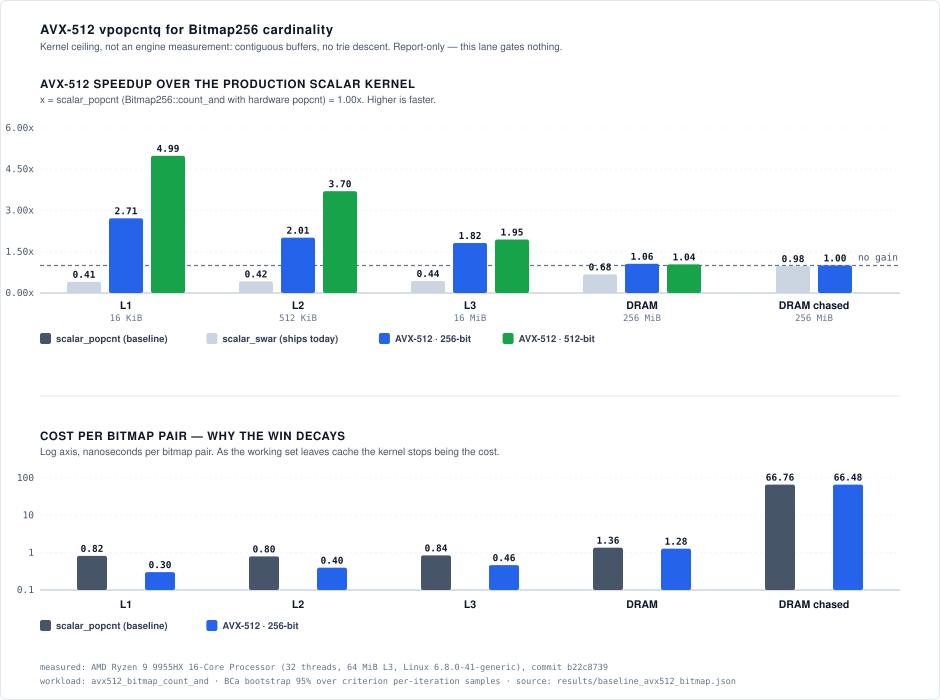

# Hardware Capability Reference & Assumption Validation

This document maps every hardware capability the Expanse engine depends on — SIMD
kernels, bit-manipulation instructions, cache-line packing, address widths — to its
**authoritative primary source** (Intel SDM, AMD APM, Arm Architecture Reference
Manual, RISC-V ISA specs, vendor TRMs), records a **validation verdict** for the
assumption the code makes, and catalogs **missed opportunities** (extensions we do
not yet use but could).

Its purpose is to make every hardware assumption in the codebase *explicit and
citable*, so a reader of `docs/ARCHITECTURE.md` / `docs/ALGORITHMS.md` or the
architecture visualizer can trace "we assume POPCNT / 64-byte lines / NEON is
present" back to the exact manual section that justifies it.

## How to read this document

- **Citations are verified, not asserted.** Every section/page number below was
  extracted from the actual manual PDF (via `pypdf` / `PyMuPDF`) and quoted verbatim.
  Where a claim rests on a secondary source (e.g. Apple publishes no Arm-ARM-style
  manual), that is stated explicitly in [§8 Honest disclosure](#8-honest-disclosure).
- **Manual PDFs are cached locally, not committed.** The corpus lives under
  `docs/research/hardware/{x86,arm,riscv,embedded}/` which is **git-ignored** — the
  PDFs are large (the Arm ARM alone is ~120 MB / 17,145 pages) and freely
  re-downloadable from the URLs in [§7 References](#7-references). Citations resolve
  by *document ID + revision + section*, not by a committed blob.
- **Page numbers** are the PDF page index that was grepped; the manual's own printed
  label (e.g. "Vol. 2B 4-405") is quoted alongside where the page carried one.

## Capability × architecture matrix

| Capability (our usage) | x86-64 | AArch64 | RISC-V (RV32/64) | Embedded (Cortex-M / ESP32) |
|---|---|---|---|---|
| 128-bit SIMD leaf scan | SSE2 ✅ baseline | NEON ✅ baseline | ❌ (RVV opt., absent on targets) | ❌ (M4 no SIMD; DSP on M4/M7) |
| Population count (`count_ones`) | POPCNT ✅ (runtime-gated) | NEON `CNT`+`ADDV` ✅ (no scalar) | ⚠️ **software** (needs Zbb) | ⚠️ software (no popcount) |
| Count-zeros (`leading/trailing_zeros`) | BSF/BSR ✅ (always correct) | `CLZ` ✅ / `RBIT`+`CLZ` for CTZ | ⚠️ software (needs Zbb) | ⚠️ software |
| 64-byte cache-line packing | ✅ fixed 64 B | ⚠️ **not architectural (Apple = 128 B)** | n/a | 32 B (M7/ESP32); M0–M4 cacheless |
| Wide address space | LA57 / 57-bit ✅ | — | Sv32 (RV32) | — |
| Software prefetch | hint, no-op on OoO ✅ removed | `PRFM` hint (impl-defined) | — | — |
| TLB reach (4 KiB vs 2 MiB vs 16 KiB) | ⚠️ 4 KiB STLB deficit @ 1M keys | ⚠️ 4 KiB deficit on Neoverse; ✅ 16 KiB default on Apple | ❌ (no MMU / Sv32) | ❌ (no MMU) |

Legend: ✅ assumption validated · ⚠️ assumption is a risk or lowers to software.

---

## 1. x86-64 (Intel / AMD)

### 1.1 SSE2 128-bit leaf kernels — **VALIDATED** (guarantee sourced from the psABI, not the CPU manual)

*Usage:* `crates/expanse/src/bits.rs` — `find_byte_16_sse2`, `find_byte_8`, and the
`lower_bound_*` kernels use `_mm_loadu_si128`, `_mm_loadl_epi64`,
`_mm_cvtsi64_si128`, `_mm_set1_epi{8,16,32}`, `_mm_cmpeq_epi{8,16,32}`,
`_mm_cmplt_epi{8,16,32}`, `_mm_xor_si128`, `_mm_movemask_epi8`, with **no runtime
detection** (SAFETY comments assert SSE2 is part of the x86-64 baseline).

*Source:* Every intrinsic maps to an instruction whose 128-bit XMM form carries the
CPUID **SSE2** feature flag — Intel SDM Vol 2 (325383): PCMPEQB `66 0F 74 /r … SSE2`
(PDF p.985); PMOVMSKB `66 0F D7 /r … SSE2` (p.1086, "Vol. 2B 4-352"); PXOR (p.1263);
MOVQ `F3 0F 7E` = `_mm_loadl_epi64` (p.842); MOVD/MOVQ `66 [REX.W] 0F 6E` =
`_mm_cvtsi64_si128` (p.790). Detection bit: Intel SDM Vol 1 (253665) p.257 §11 —
*"If CPUID.01H:EDX.SSE2[bit 26] = 1, SSE2 extensions are present"*; AMD APM Vol 1
(24592) confirms the same EDX[26] bit. SSE2 debuted with Pentium 4.

*Verdict:* **Confirmed safe** — but the guarantee that *every* x86-64 CPU has SSE2 is
not a sentence in the CPU manuals (they present SSE2 as CPUID-detectable because they
also describe pre-SSE2 32-bit parts). The mandate comes from the **x86-64 psABI /
Rust target definition**: the base `x86_64` target enables `+fxsr,+sse,+sse2`, and the
SysV/MS calling conventions *require* SSE2 (float/double args pass in XMM0–7). Cite the
CPUID bit + Pentium-4 origin from the SDM, but attribute "always present on x86-64" to
the psABI. → *Recommended code-comment precision fix in `bits.rs`.*

### 1.2 POPCNT — **VALIDATED** (runtime gate is correct)

*Usage:* `crates/expanse/src/get.rs` — `#[target_feature(enable="popcnt")]` function
clones (`test_set_popcnt`, `get_map_popcnt`, `locate_slot_popcnt`) dispatched through
`bits::popcnt_rt::available()`, with a SWAR fallback.

*Source:* Intel SDM Vol 2 (325383) POPCNT — PDF p.1139 ("Vol. 2B 4-405"): *"`#UD` If
CPUID.01H:ECX.POPCNT[Bit 23] = 0."* POPCNT is a **separate feature bit (ECX bit 23),
distinct from SSE2 (EDX bit 26)** — it is the SSE4.2 / Nehalem-era addition.

*Verdict:* **Confirmed** — POPCNT is *not* in the x86-64 baseline, so the runtime
`is_x86_feature_detected!("popcnt")` gate + SWAR fallback is exactly correct. Scalar
`u64::count_ones` lowers to hardware POPCNT only under `+popcnt`, else SWAR.

### 1.3 TZCNT / LZCNT — **ALREADY CORRECT** (no gating needed)

*Usage:* `iter.rs`, `trie32.rs`, `mutate.rs`, `Bitmap256` use `trailing_zeros()` /
`leading_zeros()` with no target-feature gating.

*Source:* Intel SDM Vol 2 (325383): TZCNT (BMI1) p.1455 — *"On processors that do not
support TZCNT, the instruction byte encoding is executed as BSF"*; LZCNT (ABM) p.732 —
*"on processors that do not support LZCNT, the instruction byte encoding is executed as
BSR"*; BSF/BSR are baseline (since i386, p.235/237) but leave the destination
*undefined* on a zero input.

*Verdict:* **Already correct** — the byte encodings degrade to BSF/BSR on parts lacking
BMI1/ABM, and Rust's `trailing/leading_zeros` handle the zero-input case in surrounding
code (they do not rely on the hardware's defined-on-zero behavior). No gating required.

### 1.4 64-byte cache line — **VALIDATED** (correct on x86)

*Usage:* `types.rs` `CACHE_LINE = 64` (+ `const _` assert `CACHE_LINE == 4*16`, "4
edges per line"); six `#[repr(C, align(64))]` node types; `alloc.rs` aligns node
classes to `CACHE_LINE`.

*Source:* Intel Optimization Manual (248966-049): *"Cache line size of 64 bytes"*
(PDF p.151, also p.391/488/673). Runtime query if ever needed: Intel SDM Vol 2 CPUID
page p.327 — `CPUID.01H:EBX[15:8] × 8` = CLFLUSH line size; per-level via leaf 04H.

*Verdict:* **Confirmed** — 64 B is correct for all mainstream x86-64; the compile-time
constant is safe for the x86 tier. (Contrast AArch64 §2.4, where 64 B is *not* safe.)

### 1.5 Software prefetch — **finding EXPLAINS the measured no-op**

*Context:* PR #242 added SW prefetch to the hot descent loops, then removed it after it
measured as a no-op on the i9-12900F reference host.

*Source:* Intel SDM Vol 2 (325383) PREFETCHh — PDF p.1148 ("Vol. 2B 4-414"): *"The
PREFETCHh instruction is merely a hint … can be overloaded or ignored by a processor
implementation."* Intel Optimization Manual (248966-049) §6.2 — PDF p.234: *"Use the
PREFETCH instruction only when data access patterns are irregular and prefetch distance
can be pre-determined."*

*Verdict:* **Removing prefetch was correct.** A trie descent is pointer-chasing — the
next node's address is data-dependent (known only after decoding the current node), so
the prefetch distance *cannot be pre-determined*, violating the optimization guide's
precondition. On an OoO core the hint issues too late to hide the miss and the extra
µop is pure overhead. (SW prefetch *can* still help the RocksDB sequential-scan path
#197, where stride is regular and distance is known.)

*Scope of the finding:* this closes prefetch **inside one descent**, where the
precondition genuinely cannot be met. It does not reach across *independent*
lookups, whose chains have no dependency on one another — the batched descent
([ALGORITHMS.md](ALGORITHMS.md) §4c, [#430](https://github.com/orieg/expanse/issues/430))
issues its hint W-1 lane visits before it is consumed, which is a
pre-determined distance. That is a different case, not a rebuttal of this one,
and it is unmeasured: no wall-clock result for it exists on the reference host
yet, so this section still records the only prefetch measurement there is.

### 1.6 LA57 / 5-level paging / 57-bit VA — **VALIDATED** (Intel side)

*Usage:* `docs/ARCHITECTURE.md` §9 (why Expanse never steals bits 48–63 of a pointer).

*Source:* Intel SDM Vol 3A (253668): `CR4.LA57` (bit 12) — PDF p.83, *"the processor
uses 5-level paging to translate 57-bit linear addresses"*; PML5 table — p.70;
detection `CPUID.(07H,0):ECX[16] LA57` — Vol 2 p.331.

*Verdict:* **Confirmed** (57-bit / 5-level). Two attributions to correct downstream:
"57-bit = 128 PiB" is arithmetic (2⁵⁷), not a verbatim SDM phrase; and "Linux keeps
allocations < 47-bit by default" is a **Linux kernel policy** (`Documentation/arch/x86/
x86_64/5level-paging.rst`), not an Intel-manual fact.

### 1.7 TLB reach & page translation — ⚠️ DEFICIT ON 4 KiB PAGES AT 1M+ RANDOM KEYS (unmeasured on reference host, #431)

*Usage:* `crates/expanse/src/alloc.rs` — allocations for size classes $\le 256$ bytes carve from 4 KiB slab pages (`SLAB_PAGE_SIZE = 4096`), backed by standard system allocation.

*Source:* Intel SDM Vol 3A (253668) §4.10 "Paging and Translation-Lookaside Buffers (TLBs)" (PDF p.117); Intel Optimization Manual (248966-049) §2.1.2 "Golden Cove Microarchitecture Memory Subsystem" (PDF p.48) and §6.3 (p.238):
- **Intel Golden Cove (Alder Lake P-core) TLB hierarchy:**
  - L1 data TLB (dTLB): 96 entries for 4 KiB translations (reach: 384 KiB); 32 entries for 2 MiB / 4 MiB translations (reach: 64 MiB); 4 entries for 1 GiB translations (reach: 4 GiB).
  - L2 shared TLB (STLB): 2,048 entries for 4 KiB and 2 MiB translations (partitioned/shared across sizes).
  - 4 KiB page translation reach: $2048 \times 4\text{ KiB} = 8,192\text{ KiB} = 8.192\text{ MB}$.
  - 2 MiB huge page translation reach: $2048 \times 2\text{ MiB} = 4,096\text{ MiB} = 4\text{ GiB}$.
- **AMD Zen 3 / Zen 4 TLB hierarchy:** L1 dTLB: 64 entries (4K); L2 STLB: 2,048 entries (4K) $\implies$ identical 8.192 MB translation reach at 4 KiB pages (Agner Fog microarchitecture guide).

*Footprint & Working Set Arithmetic:*
- `ExpanseMap` @ 1,000,000 uniform-random 64-bit keys consumes **16.70 MB** ($16.70\text{ B/key}$, gated by `test_memory_budget_matches_engine`).
- At 4 KiB pages, 16.70 MB spans **4,077 pages**.
- 4,077 pages exceed the 2,048-entry STLB reach by **$\approx 2.0\times$**.
- Random point lookups (`map_get/random`) traverse 3–5 tree levels (`BranchB` $\to$ `BranchB` $\to$ `Leaf`) across nodes dispersed over the 4,077 pages. Because keys are uniform-random, accesses scatter across the working set: each descent risks an STLB miss and a hardware page table walk (up to 4 PML4/PDPT/PD/PT memory lookups) stacked on top of data cache misses.
- At 2 MiB pages, the entire 16.70 MB working set spans only **8–9 pages**, fitting completely within the 32-entry L1 2M-dTLB (100% TLB residency).

*Interaction with Cache Hierarchy (#428, #455):*
At 1M keys, the trie is simultaneously **L3 cache-resident** (16.7 MB against 30 MiB L3 on the i9-12900F reference host) and **over STLB reach** (16.7 MB against 8.2 MB). A lookup benchmark at this population showing a memory effect may be measuring translation latency rather than DRAM latency. This compounds the mechanism investigated in [#455](https://github.com/orieg/expanse/issues/455) (stall-side line fills on random lookup).

*Density & Huge-Page Trade-off Invariant:*
Backing the slab arena with 2 MiB pages (`madvise(MADV_HUGEPAGE)` on Linux or 2 MiB aligned maps) is architecturally contained in `alloc.rs` (no node layout or `Edge`/`ValueSlot` changes). However, default-on 2 MiB pages would introduce catastrophic memory amplification for sparse and clustered keys:
- Sequential keys consume 0.07–0.36 B/key. A map holding 1,000 sequential keys requires ~70 bytes; backing it with an eager 2 MiB page represents a **$28,500\times$ footprint bloat**.
- Consequently, huge-page backing must remain an opt-in configuration or employ progressive slab growth ($4\text{ KiB} \to 64\text{ KiB} \to 2\text{ MiB}$) as the tree expands past 1M keys.

*Status:* Unmeasured on reference host; diagnostic counter `dTLB-load-misses` in `scripts/perf_counters.py` tracks translation misses under open issues [#431](https://github.com/orieg/expanse/issues/431) and [#455](https://github.com/orieg/expanse/issues/455).

---

## 2. AArch64 (Arm / Apple Silicon)

### 2.1 NEON Advanced SIMD — **VALIDATED** (SAFETY comment overstates the architecture)

*Usage:* `bits.rs` `find_byte_16_neon` / 8-byte variant use `vld1q_u8`, `vld1_u8`,
`vceqq_u8`, `vshrn_n_u16` (the movemask substitute), `vget_lane_u64`, gated only by
`#[cfg(target_arch="aarch64")]` with no runtime detection.

*Source:* Arm ARM (DDI 0487M.c) §A2.2 "FEAT_AdvSIMD" (p.A2-88): *"All Armv8-A systems
that support standard operating systems with rich application environments also provide
hardware support for Advanced SIMD instructions. … **FEAT_AdvSIMD is OPTIONAL from
Armv8.0.**"* Intrinsic→instruction mappings verified in the Arm NEON Intrinsics
Reference (IHI 0073G): `vld1q_u8`→`LD1 {Vt.16B}` (p.71), `vceqq_u8`→`CMEQ` (p.19),
`vshrn_n_u16`→`SHRN` (p.34), `vget_lane_u64`→`UMOV` (p.149).

*Verdict:* **Safe, but reword the SAFETY comment.** Advanced SIMD is architecturally
*optional*, not "mandatory / baseline." What actually makes the unconditional path safe
is (a) universal presence on OS-hosting AArch64 (per the quote) and (b) Rust's
`aarch64-*` targets baseline `+neon,+fp-armv8`. → *Recommended precision fix.*

### 2.2 Population count on AArch64 — **VALIDATED, architecturally noteworthy**

*Source:* Arm ARM (DDI 0487M.c): NEON per-byte `CNT` — §C7.2.39 (p.C7-3000); horizontal
sum `ADDV`/`UADDLV` — §C7.2.6 (p.C7-2934). **There is no scalar popcount in base A64** —
scalar `CNT` exists only under **FEAT_CSSC** (§C6.2.100, p.C6-1967), which is *"OPTIONAL
from Armv8.7 … mandatory from Armv8.9."*

*Verdict:* On base A64, `u64::count_ones` lowers to the NEON path (`FMOV`→`CNT`→`ADDV`),
not a single scalar instruction — a real codegen difference from x86 `POPCNT`, worth
documenting. Scalar popcount needs FEAT_CSSC (Armv8.9+, Neoverse-class).

### 2.3 `leading_zeros` / `trailing_zeros` — **VALIDATED, codegen difference**

*Source:* Arm ARM (DDI 0487M.c): `CLZ` base A64 (§C6.2.91, p.C6-1949); `RBIT`
(§C6.2.321, p.C6-2505); scalar `CTZ` only under FEAT_CSSC (§C6.2.144, p.C6-2163).

*Verdict:* `leading_zeros` → single `CLZ`; `trailing_zeros` on base A64 has **no direct
CTZ** → compiler emits `RBIT`+`CLZ` (two instructions) vs x86's single `TZCNT`. No
correctness issue; a one-line note in ALGORITHMS.

### 2.4 64-byte cache line — ⚠️ **PORTABILITY / PERF RISK ON ARM**

*Source:* Arm ARM (DDI 0487M.c) §D24.2.41 "CTR_EL0, Cache Type Register" (pp.D24-8621…
8624): `DminLine` / `IminLine` are *"IMPLEMENTATION DEFINED"* — **the cache-line size
is not architecturally fixed and must be read from `CTR_EL0`.** Real values: 64 B on
most Cortex-A / Neoverse (including GitHub Actions `ubuntu-24.04-arm` Neoverse N2 runners,
`CTR_EL0.DminLine = 4` = 64 B; Cortex-A9 was 32 B); **Apple Silicon M1–M4 = 128 B** (macOS
`sysctl hw.cachelinesize` — *secondary source, see §8*).

*Verdict:* **Correctness is preserved** — `align(64)` merely over-aligns on a 128 B
machine, and the `4 edges per cache line` invariant is about the 64-byte *node size*,
not the hardware line. But the **performance premise is wrong on Apple Silicon**: with a
128 B line, two 64 B nodes share a line (false-sharing risk under concurrent writes),
and "one node = one line" scans actually touch half a line. → *Recommendations:*
(a) document `CACHE_LINE = 64` as a **node-packing constant**, not a hardware
assumption; (b) if any false-sharing padding relies on it, gate a 128 B value for
`target_vendor="apple"` or read `CTR_EL0` / `hw.cachelinesize` at runtime; (c) cite
`CTR_EL0` §D24.2.41 in `types.rs` and ARCHITECTURE.md.

### 2.5 PRFM prefetch — prospective (relevant to #242)

*Source:* Arm ARM (DDI 0487M.c) `PRFM` §C6.2.315 (p.C6-2492): *"a hint to the memory
system … **The effect of a PRFM instruction is IMPLEMENTATION DEFINED.**"*

*Verdict:* Not currently emitted (grep finds prefetch only in bench comments). Same
caveat as x86 §1.5: on OoO Cortex-X / Neoverse / Apple cores with strong hardware
prefetchers, a `PRFM` for a pointer-chase can be a no-op or counterproductive; any
adoption must be measured per-microarch and guarded.

### 2.6 GitHub-hosted AArch64 runner capability census (Neoverse N2 / Cobalt 100) — **VALIDATED**

*Context:* Issue #397 established the `test-aarch64` native execution and Callgrind regression-gating lane on GitHub-hosted ARM64 Linux runners (`ubuntu-24.04-arm`).

*Runner hardware census* — everything in this list is read from the runner by the `test-aarch64` job, which **asserts** the first three so a fleet rotation fails the job rather than silently invalidating this section *(measured: GitHub `ubuntu-24.04-arm` runner, [run 33124978928](https://github.com/orieg/expanse/actions/runs/33124978928), ref `ci/aarch64-execution-lane-397`)*:

- **CPU implementer / Part:** `0x41` (Arm) / `0xd49` (Neoverse-N2). Note `/proc/cpuinfo` reports `CPU architecture: 8` — the legacy AArch64 field the kernel always sets to 8; that Neoverse-N2 is Armv9.0-A comes from Arm's product spec, not from this census.
- **Cache-line size:** 64 bytes, read as `coherency_line_size` from sysfs and confirmed by `getconf LEVEL1_DCACHE_LINESIZE`. **The census does not read `CTR_EL0`** — the equivalent `DminLine = 4` is inferred from the kernel-reported value, not observed, which is worth stating precisely because §2.4's point is that `CTR_EL0` is the authority. A concrete cloud-server data point that 64-byte alignment matches Neoverse lines, in contrast to Apple Silicon's 128 B (§2.4).
- **NEON / AdvSIMD:** `asimd`, `asimdhp`, `asimddp`, `asimdfhm` present. The Advanced SIMD kernels (`find_byte_16_neon`, `find_byte_8`, `CNT`+`ADDV` popcount) and their parity tests execute here — as they already do on the `test` job's `macos-latest` (arm64) runner. What this lane adds over that is glibc rather than macOS, and Callgrind, which does not run on macOS.
- **SVE / SVE2 status:** `sve`, `sve2`, `sveaes`, `svesha3`, `svesm4`, `svei8mm`, `svebf16` are **exposed in `/proc/cpuinfo`**. Vector length is not measured by the census; 128-bit is the Neoverse-N2 spec figure. SVE leaf scanning was implemented and **reverted** (#434 / this PR) after it measured as a regression on this very lane; the capability stays **testable** here (§6) — the hardware is available — but **no SVE code path exists yet**: `is_aarch64_feature_detected!` appears nowhere in `crates/`, and nothing in the lane exercises SVE. §6's standing caveat, that SVE is absent on Apple M-series, is unchanged by this.
- **FEAT_CSSC status:** no `cssc` flag in the runner's `Features` line, as expected (CSSC is Armv8.9/v9.4+; scalar popcount/CTZ continue lowering to NEON / `RBIT`+`CLZ`).

### 2.7 TLB hierarchy & page granule variance (Neoverse vs Apple Silicon) — **VALIDATED**

*Source:* Arm ARM (DDI 0487M.c) §D24.2; Arm Neoverse N2 TRM (102099_0000_02_en) §A3.2 "TLB organization" (L1 D-TLB 48 entries, L2 TLB 2,048 entries); Apple Silicon macOS kernel default `PAGE_SIZE = 16384` (16 KiB) with 3,072–4,096 L2 TLB entries (*secondary source, see §8*).

*Verdict:*
- **Linux AArch64 (Neoverse N2 @ 4 KiB pages):** 2,048 L2 TLB entries provide an 8.192 MB translation reach. At 1M keys (16.70 MB working set spanning 4,077 pages), Neoverse N2 faces the same $\approx 2\times$ STLB reach deficit as x86-64.
- **Apple Silicon (macOS @ 16 KiB pages):** Because macOS uses 16 KiB base pages, the 16.70 MB working set spans only **~1,044 pages**. With a 3,072–4,096 entry L2 TLB, the translation reach is **48–64 MB** — fully enclosing the 1M-key trie natively without huge pages.

---

## 3. RISC-V (RV64 + RV32)

### 3.1 Population count & count-zeros — ⚠️ **SOFTWARE on the shipped 32-bit config**

*Usage:* 20 `count_ones` sites (`bits.rs`, `trie32.rs` — the 4×u64 leaf bitmap and
`bitmap_count_range`) + 17 `leading/trailing_zeros` sites (`trie32.rs`
`bitmap_first_ge`/`bitmap_last_le`, etc.). These run on `u64` words even on RV32 (XLEN
= 32).

*Source:* RISC-V Unpriv ISA (v20240411) §2.4.2 — the complete RV32I R-type op set is
ADD/SUB, SLT[U], AND/OR/XOR, shifts — **no bit-count op** in the base ISA. Popcount /
clz / ctz live only in the **Zbb** extension: Bitmanip v1.0.0 §2.16 `cpop` (p.30, *"The
GCC builtin `__builtin_popcount` is implemented by `cpop` on RV32"*), §2.14 `clz`
(p.28), §2.18 `ctz` (p.32). Zbb ratified Nov 2021.

*Verdict:* **CI's baseline RV32 target is `riscv32imac-unknown-none-elf` (no Zbb)** and RV64 is
`riscv64gc` (no Zbb). On baseline RV32I/RV32IMAC, **all 37 popcount/clz/ctz sites in the hot `trie32` path lower to software** (a 26-instruction SWAR sequence for `u64::count_ones` across two 32-bit halves, or software CLZ/CTZ loops).

When building with `RUSTFLAGS="-C target-feature=+zbb"` on Zbb-capable hardware *(verified: `rustc 1.88.0`, `cargo rustc -p expanse-trie --lib --target riscv32imac-unknown-none-elf --release -- --emit asm`)*:
- `u32::count_ones` lowers directly to single-instruction `cpop rd, rs`.
- `u64::count_ones` on RV32 (XLEN = 32) lowers to 2 `cpop` instructions + 1 `add` (`cpop a0, a0; cpop a1, a1; add a0, a0, a1` — 3 instructions total vs 26 instructions in software SWAR).
- `leading_zeros` lowers to single-instruction `clz rd, rs`.
- `trailing_zeros` lowers to single-instruction `ctz rd, rs`.
- Bitwise logic-with-negate (`andn`, `orn`, `xnor`) and min/max (`min`, `max`, `minu`, `maxu`) lower to single instructions.

Zbb `clz`/`ctz` return XLEN (32) on zero input, matching Rust's semantics exactly. `#![no_std]` embedded targets do not support runtime extension discovery, so compile-time dispatch via `target-feature=+zbb` is the standard delivery mechanism, guarded by CI's `test-rv32-zbb` compilation lane.

### 3.2 32-bit address space (Sv32) — **VALIDATED**

RV32 XLEN = 32 → pointer width 32; the compact 8-byte-edge trie is gated on
`target_pointer_width="32"` (`lib.rs`), which Rust derives correctly from the target.

---

## 4. Embedded (Cortex-M / ESP32)

### 4.1 `align(32)` "cache line" — **VALID for cached cores, imprecise for cacheless M4**

*Usage:* `types32.rs` `CACHE_LINE_32 = 32` (comment: *"cache line size on … Cortex-M7,
ESP32 MMU cache"*); README/RFC "BranchL2_32 = 32 B = 1 cache line on Cortex-M7/ESP32."

*Source:* Cortex-M7 = 32 B line, **cache optional** — Arm DDI 0489F (r1p2) CCSIDR p.3-11
(*"0x1 … Represents 32 bytes"*), p.5-19/5-25 (32-byte burst/boundary); p.1-4 lists "no
D-cache" as a build option. **Cortex-M4 = cacheless** — Arm DDI 0439C has zero cache
descriptions. ESP32-C3 = fixed 32 B — TRM v1.4 §3.3.3.2 p.95 (*"block size is 32
bytes"*); ESP32 (LX6) = 32 B — TRM v5.8 p.71; ESP32-S3 = 16/32/64 B configurable — TRM
v1.8 p.405. No popcount on Cortex-M (ARMv7-M ARM DDI 0403E.e: `CLZ`/`RBIT` exist,
popcount does not).

*Verdict:* The RFC's hardware facts are **accurate**. Two README-level doc-vs-reality
gaps to fix (the RFC itself is honest): (a) `types32.rs`'s one-line "cache line" comment
overclaims for the **cacheless Cortex-M4 that CI actually targets** — the real
justification (AXI burst / DMA block / misaligned-SRAM-trap avoidance) lives only in the
RFC; (b) see §4.2.

### 4.2 Embedded architecture & component packaging

- **ESP-IDF component / ESP32 packaging** (`components/expanse/`, linked in #558): `CMakeLists.txt` builds `libexpanse.a` with cargo for the bare-metal RISC-V target matching `IDF_TARGET` and links it; `src/expanse_esp_idf.c` defines the `expanse_host_malloc`/`expanse_host_free` pair the `no_std` global allocator imports, routed to `MALLOC_CAP_INTERNAL` under `CONFIG_EXPANSE_SRAM_INTERNAL_ONLY`. Both ISAs: the RISC-V parts build on stable rustc against the mainline bare-metal targets, and the Xtensa ESP32/S2/S3 build against the esp-rs rustc fork (`espup`'s `esp` toolchain) with a from-source sysroot, since `xtensa-*-none-elf` is tier 3 and publishes no precompiled `core`/`alloc`. The configure step fails loudly, naming the install commands, when the fork toolchain is absent. Bare-metal ESP32-C3 (`riscv32imc-unknown-none-elf`) is checked in CI — engine, C ABI staticlib, and an assertion that the archive resolves against nothing but that host pair — alongside `riscv32imac` and `thumbv7em`. The ESP-IDF application link is verified locally for `esp32c3`, `esp32c6` and `esp32` through `integrations/esp32/` (the first attempt failed on link order — the host-allocator pair preceded the archive — and the component's CMake was corrected to register the archive as an imported library linking back to the component; the same ordering holds on Xtensa). No CI lane exercises it. The first on-device run happened on an ESP32-D0WD-V3 rev v3.1 at 160 MHz and is harvested to `docs/benchmarks/embedded/esp32.json`; it found that ESP-IDF's 3584-byte default main-task stack is too small for the trie descent under Xtensa's windowed-register ABI (peak 4388 B measured), which overflowed into the adjacent heap and surfaced as TLSF free-list corruption at a later allocation. The RISC-V parts and the S2/S3 have still not been run on hardware; #579 tracks the rest.
- **CI cross-compilation matrix**: Bare-metal RV32 (`riscv32imac-unknown-none-elf`, with and without `+zbb`), ESP32-C3 (`riscv32imc-unknown-none-elf`), and Arm Cortex-M (`thumbv7em-none-eabihf`: engine check, C ABI staticlib, and a hard-float link of the STM32H747 harness; `thumbv7m-none-eabi`: the C ABI smoke executed under QEMU `mps2-an385` on an emulated Cortex-M3, `integrations/qemu-cortex-m3/`) are verified on every PR. The Cortex-M7 half of the 32-byte-line claim above is now measured on hardware (STM32H747I-DISCO, `docs/BENCHMARKING.md` "Cortex-M7 on-target", #598): the D-cache geometry read from CCSIDR is 4-way × 128 sets × 32 B, and the cache-on/off deltas are in that section.

### 4.3 Espressif RISC-V per-part core inventory & CAS soundness — **VALIDATED**

*Usage:* the ESP-IDF component (`components/expanse/`), the README platform
table, and `docs/PACKAGING.md` name five Espressif RISC-V parts. The 32-bit
concurrent wrapper `sync32` (`crates/expanse/src/sync32.rs`) needs to know, per
part, **how many harts share the address space**; the compare-and-swap–dependent
work tracked in [#573](https://github.com/orieg/expanse/issues/573) additionally
needs to know which CAS mechanism is *sound* on each part. Until now those claims rested on
inference from a HAL manifest.

*Method:* every hardware cell below was extracted from the Espressif datasheet
or Technical Reference Manual PDF with `PyMuPDF` and is quoted verbatim in
[§4.3.1](#431-verbatim-core-count--isa-statements) with document revision,
section, and PDF page index. Target triples and `target_has_atomic` values are
`rustc --print target-list` / `rustc --print cfg --target …` output (rustc
1.98.0), not recollection. `esp-hal` is cited only as **corroboration** of a
policy choice, never as a source for a hardware fact.

| Part | ISA (HP core) | Cores HP / LP | rustc target matching the ISA | `target_has_atomic` | `AtomicU64` native | `unsafe-assume-single-core` sound? | Viable CAS path | Reclamation that fits |
|---|---|---|---|---|---|---|---|---|
| **ESP32-C2** (ESP8684) | RV32IMC (`misa.A = 0`) | **1 / 0** | `riscv32imc-unknown-none-elf` | *(none emitted)* | no | **yes** — one hart, M-mode available | `portable-atomic` `unsafe-assume-single-core` (interrupt masking) or `critical-section` — nothing else supplies CAS | quiescent-state / deferred free (`sync32`); EBR only atop a `portable-atomic` CAS |
| **ESP32-C3** | RV32IMC (`misa.A = 0`) | **1 / 0** | `riscv32imc-unknown-none-elf` | *(none emitted)* | no | **yes** — one hart, M-mode available | same as C2 | same as C2 |
| **ESP32-C6** | RV32IMAC (`misa.A = 1`) | **1 / 1** (LP CPU reaches HP SRAM) | `riscv32imac-unknown-none-elf` | 8/16/32/ptr | no | **no** as a blanket setting — the LP CPU is a second hart on the same buses; conditionally sound only in an image that never releases it (see [§4.3.2](#432-the-lp-core-question)) | native A extension (LR/SC + AMO) for ≤32-bit; `portable-atomic` `fallback` global locks (built on native CAS, no `unsafe` feature) for wider types | EBR viable (real CAS); `sync32`'s quiescent-state also fits |
| **ESP32-H2** | RV32IMAC (`misa.A = 1`) | **1 / 0** | `riscv32imac-unknown-none-elf` | 8/16/32/ptr | no | **yes** (one hart) — but **moot**: native A already supplies CAS | native A extension; `portable-atomic` `fallback` for wider types | EBR viable; `sync32`'s quiescent-state also fits |
| **ESP32-P4** | RV32IMAFC + Zc/Zb + custom (`misa.A = 1`) | **2 / 1** (LP CPU reaches L2 SRAM) | `riscv32imafc-unknown-none-elf` | 8/16/32/ptr | no | **no**, unconditionally — the HP complex is dual-core | native A extension; `portable-atomic` `fallback` global locks for wider types | EBR viable; `sync32`'s quiescent-state also fits |

`AtomicU64` is **absent natively on all five** — `riscv32imac` and `riscv32imafc`
both emit `target_has_atomic` 8/16/32/ptr and no 64 — the constraint that
[#564](https://github.com/orieg/expanse/issues/564) settled by keeping the 32-bit
concurrent surface on `occ32`/`AtomicU32` rather than porting `occ.rs`. It binds
independently of core count. `portable-atomic`'s `fallback` feature supplies the
wider types, "using global locks by default" (README, `portable-atomic` 1.15.0) —
which needs a working CAS underneath: native A on C6/H2/P4, and interrupt masking
via `unsafe-assume-single-core` on C2/C3.

#### 4.3.1 Verbatim core-count & ISA statements

| Part | Document (revision) | Section / PDF page | Verbatim |
|---|---|---|---|
| C2 | ESP8684 TRM **v1.3** | §1.1 Overview (Ch. 1 ESP-RISC-V CPU), p. 22 | *"ESP-RISC-V CPU is a 32-bit core based upon RISC-V ISA comprising base integer (I), multiplication/division (M) and compressed (C) standard extensions."* |
| C2 | ESP8684 TRM **v1.3** | Register 1.6 `misa` (0x301), p. 27 | *"Atomic Extension = 0. (RO)"* |
| C2 | ESP8684 TRM **v1.3** | §3.1 Overview (Ch. 3 System and Memory), p. 81 | *"The ESP8684 is an ultra-low-power and highly-integrated system with a 32-bit RISC-V single-core processor"* |
| C3 | ESP32-C3 TRM **v1.4** | §1.1 Overview (Ch. 1 ESP-RISC-V CPU), p. 31 | *"ESP-RISC-V CPU is a 32-bit core based upon RISC-V ISA comprising base integer (I), multiplication/division (M) and compressed (C) standard extensions."* |
| C3 | ESP32-C3 TRM **v1.4** | Register 1.6 `misa` (0x301), p. 36 | *"Atomic Extension = 0. (RO)"* |
| C3 | ESP32-C3 TRM **v1.4** | §3.1 Overview (Ch. 3 System and Memory), p. 91 | *"The ESP32-C3 is an ultra-low-power and highly-integrated system with a 32-bit RISC-V single-core processor"* |
| C3 | ESP32-C3 Datasheet **v2.4** | §4.1.1.1 High-Performance CPU, p. 33 | *"ESP32-C3 has a low-power 32-bit RISC-V single-core microprocessor … • RV32IMC ISA"* |
| C6 | ESP32-C6 TRM **v1.2** | §5.1 Overview (Ch. 5 System and Memory), p. 169 | *"ESP32-C6 is an ultra-low power and highly-integrated system that integrates: • a high-performance 32-bit RISC-V single-core processor (HP CPU) … • a low-power 32-bit RISC-V single-core processor (LP CPU) … All internal memory, external memory, and peripherals are located on the HP CPU and LP CPU buses."* |
| C6 | ESP32-C6 TRM **v1.2** | §3.7.1 Memory Access (Ch. 3 Low-Power CPU), p. 126 | *"The ESP32-C6 LP CPU can access LP SRAM and HP SRAM."* … *"The LP CPU supports the atomic instruction set. Both the LP CPU and the HP CPU can access memory through atomic instructions, thus achieving atomicity of memory access."* … *"Note that only HP SRAM supports atomic access from HP CPU and LP CPU."* |
| C6 | ESP32-C6 TRM **v1.2** | Register `misa`, p. 45 | *"Atomic Extension = 1. (RO)"* |
| C6 | ESP32-C6 Datasheet **v1.5** | §4.1.1.3 Low-Power CPU, p. 38 | *"• RV32IMAC ISA (instruction set architecture)"* … *"• Access to HP memory and LP memory"* |
| H2 | ESP32-H2 TRM **v1.1** | §1.1 Overview (Ch. 1 ESP-RISC-V CPU), p. 38 | *"ESP-RISC-V CPU is a 32-bit core based upon RISC-V instruction set architecture (ISA) comprising base integer (I), multiplication/division (M), atomic (A) and compressed (C) standard extensions."* |
| H2 | ESP32-H2 TRM **v1.1** | Register `misa`, p. 44 | *"Atomic Extension = 1. (RO)"* |
| H2 | ESP32-H2 TRM **v1.1** | §4.1 Overview (Ch. 4 System and Memory), p. 142 | *"ESP32-H2 is an ultra-low power and highly-integrated system that integrates a high-performance 32-bit RISC-V single-core processor (CPU)"* |
| P4 | ESP32-P4 TRM **Pre-release v0.7** | §2.1 Overview (Ch. 2 High-Performance CPU), p. 68 | *"The CPU Core complex consists of dual RISC-V CPU cores with a dedicated core-local interrupt controller (CLIC), a debug block, and a core-local interrupt (CLINT) timer."* |
| P4 | ESP32-P4 TRM **Pre-release v0.7** | §9.1 Overview (Ch. 9 System and Memory), p. 901 | *"ESP32-P4 integrates two processors: • a high-performance 32-bit RISC-V dual-core processor (HP CPU) … • a low-power 32-bit RISC-V single-core processor (LP CPU) … All internal memory, external memory, and peripherals are located on the HP CPU and LP CPU buses."* |
| P4 | ESP32-P4 TRM **Pre-release v0.7** | §5.8.1 Memory Access (Ch. 5 Low-Power CPU), p. 654 | *"The ESP32-P4 LP CPU can access LP ROM, LP SRAM, and L2 SRAM."* … *"Note that only L2 SRAM region supports atomic access from HP CPU and LP CPU."* |
| P4 | ESP32-P4 Datasheet **Pre-release v0.7** | §4.1.1.1 High-Performance CPU, p. 40 | *"ESP32-P4 has an HP 32-bit RISC-V dual-core processor … • RV32IMAFC ISA (instruction set architecture) • Zc extensions (Zcb, Zcmp, and Zcmt) • Zb extensions"* |
| P4 | ESP32-P4 Datasheet **Pre-release v0.7** | §4.1.3 reset types, p. 49 | *"HP CPU1 is at reset by default after chip power-up, and needs to be manually released from reset."* … *"LP CPU is at reset after chip power-up, and needs to be manually released from reset by configuring the power management unit (PMU)."* |

**Absence evidence for the zero-LP-core rows.** C2, C3, and H2 are recorded as
having no LP core because their TRMs contain **no Low-Power-CPU chapter** — the
C6 TRM v1.2 has "Chapter 3 Low-Power CPU" and the P4 TRM v0.7 has "Chapter 5
Low-Power CPU", while ESP8684 TRM v1.3, ESP32-C3 TRM v1.4 and ESP32-H2 TRM v1.1
have exactly one CPU chapter each (their "Low-power Management" chapters are PMU
chapters, not cores) and the H2 TRM defines **zero `LP_CPU*` registers**. This is
absence-of-evidence in a document that demonstrably documents the feature when
present, which is the strongest negative a TRM can give.

#### 4.3.2 The LP-core question

`portable-atomic`'s `unsafe-assume-single-core` implements CAS by disabling
interrupts on the current hart; its own README carries the warning *"Enabling
this feature/cfg for multi-core systems is always **unsound**"*
(`portable-atomic` 1.15.0). Masking interrupts on the HP CPU excludes preemption
on that hart and nothing else, so the question is whether a second hart can
touch the same words.

- **C6 — it can.** TRM v1.2 §3.7.1 states the LP CPU reads and writes HP SRAM,
  and frames the A extension as the *intended* HP↔LP coordination mechanism
  ("Both the LP CPU and the HP CPU can access memory through atomic
  instructions"). The precondition is therefore broken by design, not by
  accident. The LP CPU does start disabled — TRM v1.2 §3.1 p. 107: *"The LP CPU
  is in sleep mode by default"* — so an image that never releases it does run one
  hart; but that is a whole-firmware property no crate feature can check, so the
  blanket verdict is **unsound**. It is also unnecessary: C6 has native CAS.
- **P4 — it can, twice over.** The HP complex is genuinely dual-core (TRM v0.7
  §2.1), so `unsafe-assume-single-core` is unsound regardless of the LP CPU, and
  the LP CPU additionally reaches L2 SRAM (§5.8.1).
- **C2 / C3 / H2 — no second hart exists**, so the precondition holds.

**Placement constraint for any cross-core state.** Both multi-hart parts restrict
where HP↔LP atomics work: HP SRAM only on C6 (TRM v1.2 §3.7.1) and L2 SRAM only
on P4 (TRM v0.7 §5.8.1). Shared structures must be allocated into those regions;
the ESP-IDF component's allocator glue currently routes through
`MALLOC_CAP_INTERNAL` and has no such placement control.

#### 4.3.3 Conflicts found between primary sources

1. **ESP8684 (ESP32-C2) datasheet contradicts its own TRM on the A extension.**
   Datasheet v2.3 §4.1.1.1 (p. 27) says the HP CPU comprises *"base integer (I),
   multiplication/division (M), atomic (A) and compressed (C) standard
   extensions … • RV32IMAC ISA"*. TRM v1.3 §1.1 (p. 22) lists only I, M and C,
   and Register 1.6 `misa` (p. 27) — hardwired and read-only — reports *"Atomic
   Extension = 0"*. **The TRM's `misa` description is a statement about the
   silicon's own capability register and is taken as authoritative: the ESP32-C2
   is RV32IMC**, which is also what `riscv32imc-unknown-none-elf` (the triple the
   component already builds for it) assumes. The datasheet sentence reads as text
   carried over from a part that does have the A extension.
2. **The same ESP8684 datasheet claims a ULP that the TRM does not document.**
   §4.1.3.6 (p. 32) says *"The integrated Ultra-Low-Power (ULP) coprocessors
   allow the ESP8684 to operate in Deep-sleep mode…"*, but ESP8684 TRM v1.3 has
   no ULP/LP-CPU chapter and mentions "ULP Coprocessor" only once, in the
   abbreviations glossary (p. 514). Recorded as **0 LP cores** on the TRM's
   evidence; the datasheet line is treated as the same boilerplate carry-over.
3. **Neither prior source was wrong about H2 — they answered different
   questions.** A research pass claimed `unsafe-assume-single-core` is sound on
   C3 *and* H2; `esp-hal` enables it for `esp32c2`/`esp32c3`/`esp32s2` only. The
   datasheets reconcile these: H2 *is* single-core, so the feature would be
   sound there, and `esp-hal` omits it because H2 has the A extension and does
   not need it. The set `esp-hal` enables it for is exactly "single-core **and**
   no A extension". On C6 the two sources agreed in outcome, and the TRM confirms
   the strong reason: a second hart on the same buses.

*Corroboration (not a source):* `esp-hal` 1.2.0-rc.0 `esp-hal/Cargo.toml` enables
`portable-atomic/unsafe-assume-single-core` under the `esp32c2`, `esp32c3` and
`esp32s2` features and under no other part feature.

#### 4.3.4 What this supports

- **`sync32` runs on all five parts as shipped.** Its protocol is atomic
  load/store plus fences with no CAS and no read-modify-write
  (`crates/expanse/src/sync32.rs`), so the missing A extension on C2/C3 does not
  gate it and no `portable-atomic` feature is required anywhere. Its
  single-writer/many-reader contract is satisfied within one hart; using it
  *across* harts on C6 or P4 would additionally require the arena to sit in the
  region where cross-core atomics are defined (§4.3.2), which the component
  cannot currently express — so the supported configuration is single-hart on
  every part.
- **For the CAS-dependent futures** (the concurrent-surface work in
  [#573](https://github.com/orieg/expanse/issues/573) and anything beyond it that
  wants a real read-modify-write): C6, H2 and P4 need no
  `portable-atomic` unsafe feature at all — native A gives 32-bit CAS and the
  default `fallback` builds wider types on top of it. C2 and C3 have no CAS in
  hardware; there `unsafe-assume-single-core` is the sound and efficient choice
  (both are single-hart), with `critical-section` as the portable alternative.
  **`unsafe-assume-single-core` must never be enabled unconditionally for the
  whole Espressif family** — it is unsound on C6 and P4.
- **Target-triple correction (resolved in #581).** The ESP32-P4 HP core
  implements F (datasheet v0.7 §4.1.1.1) and ESP-IDF compiles it hard-float —
  esp-idf's `components/soc/project_include.cmake` sets `-march=rv32imafc`
  (`rv32imafcb` on newer silicon revisions) and `-mabi=ilp32f` for FPU-bearing
  cores. The component now builds `esp32p4` against
  `riscv32imafc-unknown-none-elf`; CI builds that staticlib and asserts the
  archive's `EF_RISCV_FLOAT_ABI_SINGLE` flag, since the RISC-V linker rejects
  mixed float ABIs. The ESP-IDF link itself remains without a CI lane (§4.2),
  so end-to-end P4 linking stays unverified rather than known-good.

---

## 5. Validation summary

**Assumptions confirmed (with citation):** SSE2 baseline (§1.1), POPCNT runtime-gate
(§1.2), TZCNT/LZCNT always-correct (§1.3), x86 64-byte line (§1.4), prefetch-removal
(§1.5), LA57 (§1.6), NEON presence & execution parity (§2.1, §2.6), AArch64 runner
capability census & 64-byte cache line (§2.6), 32-byte embedded alignment for cached cores
(§4.1), Espressif RISC-V per-part core counts, ISA and CAS soundness (§4.3),
RV32 pointer width (§3.2).

**Assumptions that are risks / lower to software:**
- ⚠️ **ARM 64-byte cache line (§2.4)** — not architectural; Apple Silicon is 128 B.
  Correctness holds, performance premise does not. *Highest-value finding.* The
  Neoverse-N2 runner measuring 64 B (§2.6) confirms the assumption on that part;
  it says nothing about Apple Silicon, which is where the premise fails and which
  remains untested — so the finding stands at full weight.
- ⚠️ **4 KiB TLB translation reach at 1M+ keys (§1.7, §2.7)** — at 1M uniform-random keys,
  the 16.70 MB working set spans 4,077 pages (4 KiB), exceeding the 2,048-entry L2 STLB on
  x86-64 and Neoverse N2 by ~2×. Apple Silicon avoids this due to 16 KiB native pages
  (48–64 MB reach). Tracked under open issue [#431](https://github.com/orieg/expanse/issues/431).
- ⚠️ **RV32 popcount/clz/ctz (§3.1)** — software on base `riscv32imac`; enabled with `+zbb` lane in CI.

**Recommended code-comment precision fixes (non-behavioral):**
- `bits.rs` — attribute the SSE2 "always present" guarantee to the psABI/Rust target,
  not the CPU manual (§1.1); note AArch64 `CNT` is NEON, scalar popcount needs FEAT_CSSC
  (§2.2).
- `types.rs` / ARCHITECTURE.md — document `CACHE_LINE = 64` as a node-packing constant;
  cite `CTR_EL0` for the ARM caveat (§2.4).
- `types32.rs` — reword the "cache line" comment for cacheless M-cores; point at the RFC
  (§4.1).
- `bits.rs` NEON SAFETY comment — "NEON guaranteed by Rust's aarch64 `+neon` baseline;
  FEAT_AdvSIMD is architecturally optional but universally present" (§2.1).

**Documentation status:** ESP-IDF component package, RV32 bare-metal cross-compilation lanes, and AArch64 native execution / Callgrind regression gating documented in `README.md`, `docs/PACKAGING.md`, `docs/CI.md`, and `components/expanse/README.md`.

---

## 6. Missed opportunities (prioritized, with citations)

| Opportunity | Where it helps | Priority | Key caveat |
|---|---|---|---|
| **RV32 `+zbb`** build profile | 37 popcount/clz/ctz sites → single `cpop`/`clz`/`ctz` | **High** (concrete, spec-cited) — **shipped**: `test-rv32-zbb` CI lane builds with `-C target-feature=+zbb`; codegen verified (see docs/design/32-bit-embedded.md §2.3) | embedded parts may predate Zbb — keep SW fallback |
| **`popcnt` dispatch for `algebra.rs`** | `Bitmap256::count_and` at bitmap leaves — the intersection-cardinality inner kernel | **High** — measured, portable, no new ISA requirement | `get.rs` already has the `#[target_feature(enable = "popcnt")]` entry clones; `algebra.rs` has none, so on the default portable target its `count_ones` lowers to the SWAR sequence. See §6.2 |
| **AVX-512 VPOPCNTDQ** for `Bitmap256` rank | 4×u64 bitmap → one `_mm256_popcnt_epi64` | **Measured — no engine-level win** | 4.96× in L1 decaying to no measurable difference on a pointer-chased DRAM walk, which is the engine's access pattern; and Callgrind cannot see the kernel at all. See §6.2 |
| **Huge-page slab backing / `MADV_HUGEPAGE`** | 1M+ random keys (reduces 4,077 pages → 8 pages, eliminating STLB misses) | Moderate (opt-in / progressive) | $28,500\times$ memory bloat on sparse/clustered 1k keys if default-on; must be opt-in or adaptive |
| **AVX2** 32-byte leaf scan | KB≥2 / wider sorted leaves | Low–moderate | leaves rarely > 16 lanes before bitmap switch |
| **FEAT_CSSC** scalar bit-manip (AArch64) | `count_ones`/`ctz` → single scalar op | Moderate (future) | Armv8.9+ (Neoverse-class); nightly/asm only today |
| **SVE / SVE2** VL-agnostic scan (AArch64) | additive fast leaf scan on Neoverse/Graviton | **Tried and reverted — measured negative** | implemented in #434, reverted after the AArch64 lane measured `map_get/sequential` **+9.19%**, `map_get/random` **+9.86%**, `set_contains/random` **+7.73%** *(measured: GitHub AArch64 runner Neoverse-N2, jobs 98711354227 → 98737273484; x86 byte-identical across the same commits, so the change is arch-local)*. Mechanism: the adaptive ladder promotes to bitmap before linear leaves grow, so `whilelt`/`brkb`/`cntp` setup is paid per scan over ≤16 elements and never amortises. **The same argument applies to any wide-vector leaf scan**, including the AVX2 row below. Needs runtime detection (none exists yet: no `is_aarch64_feature_detected!` in `crates/`); hardware **exposed** on the GitHub AArch64 runner (§2.6) so it is now testable, absent on Apple M-series |
| **RVV** vector leaf scan (RISC-V) | `vcpop.m`/`viota.m`/`vfirst.m` on RV64 | Low (availability) | absent on embedded RV32 targets |
| **ARMv7E-M DSP SIMD** (`SADD8`, `SEL`) on M4/M7 | 8-byte digit scan | Low | Rust stable exposes no ARM DSP intrinsics |
| **FEAT_RPRFM** range prefetch (AArch64) | contiguous node/leaf arrays | Low | hint, impl-defined; measure per-µarch |

### 6.2 Measured — AVX-512 `vpopcntq` for bitmap cardinality, and the `popcnt` gap it uncovered

`Bitmap256::count_and` is the inner kernel of the `algebra.rs` intersection walk
behind the `search_boolean` suite. A 256-bit bitmap is one `ymm` and two are one
`zmm`, so `avx512_vpopcntdq` can retire a whole pair-cardinality in one
`vpopcntq`. `crates/expanse/benches/avx512_bitmap.rs` measures that against the
scalar kernel across cache residency
*(measured: AMD Ryzen 9 9955HX, 32 threads, 64 MiB L3, Linux 6.8.0-41-generic;
`results/baseline_avx512_bitmap.json`; workload: `avx512_bitmap_count_and`;
commit `b22c8739`; BCa 95% over criterion per-iteration samples, n = 20 per arm)*.
Every cell is `scalar_popcnt` ÷ that arm, so **above 1.000× is faster than the
production scalar kernel and below it is slower**:

| Regime | Working set | `scalar_popcnt` ns/pair | `scalar_swar` | `v256` | `v512` |
|---|---|---:|---:|---:|---:|
| L1 | 16 KiB | 0.821 | 0.409× | **2.715×** | **4.990×** |
| L2 | 512 KiB | 0.795 | 0.421× | **2.011×** | **3.703×** |
| L3 | 16 MiB | 0.844 | 0.437× | **1.817×** | **1.946×** |
| DRAM, sequential | 256 MiB | 1.360 | 0.677× | **1.063×** | 1.041× |
| DRAM, pointer-chased | 256 MiB | 66.763 | 0.977× | 1.004× | — |

**The vector win is a cache-residency artifact.** The kernel is ~0.82 ns of work
per bitmap pair. On the pointer-chased walk a pair costs 66.76 ns, so the
arithmetic is well under 2% of the time — and that is roughly what the vector arm
returns there: `v256` is **1.004×**, intervals [278.53, 279.27] ms against
[279.69, 280.44] ms. They are disjoint, so the 0.4% is real rather than noise,
but it is 0.4% against 4.990× in L1. The sequential-DRAM cells (1.063× and
1.041×) sit between the two and are the smallest wins worth reporting; an earlier
run of the same sweep put `v512` there at 0.997×, i.e. a loss, which is the size
of effect this arm can resolve.

The pointer-chased arm is the one to read. The engine reaches its bitmap leaves
by chasing `Edge` pointers through a slab arena; the contiguous regimes above it
are a *kernel ceiling*, not an engine measurement, and nothing here licenses a
claim about `intersection_len` throughput. `v512` is absent from that row
because a serially dependent walk has no second independent pair with which to
fill the upper half of a `zmm`.

**Two further costs, independent of the measurement.** `core::arch`'s AVX-512
intrinsics are stable only since Rust **1.89**, so shipping any of them raises
the declared MSRV floor of 1.88 (which is why the bench keeps them behind an
off-by-default `avx512` feature). And **Callgrind, the primary regression
instrument, cannot see the kernel**: Valgrind implements no AVX-512
([KDE bug 383010](https://bugs.kde.org/show_bug.cgi?id=383010), enabling branch
on hold since 2019), so under it a runtime-dispatched kernel silently measures
its scalar fallback while an unconditional one dies with SIGILL on the EVEX
prefix. `crates/expanse/examples/avx512_probe.rs` reproduces both halves. An
AVX-512 path would therefore be ungated by every existing instruction lane — the
degradation §8.1 exists to forbid — and gateable only by wall-clock on a host
carrying the feature.

**Note on the downclock caveat.** The prior entry in the §6 table cited AVX-512
license downclock from the Intel Optimization Manual. That is an Intel-specific
concern and does not describe the host measured here: Zen 5's Fire Range parts
are Granite Ridge chiplets with full-width 512-bit datapaths. The caveat was not
wrong, it was scoped to a different microarchitecture; the `v512` arm's L1 and L2
gains over `v256` show no throttle on this part.

#### The finding that came out of the control arm

`scalar_popcnt` exists in that table because rating the vector arms against a
strawman would have inflated them (§8.3). Building it surfaced a live gap.

`Bitmap256::count_and` is `#[inline(always)]` and calls `u64::count_ones`
directly; the hardware instruction is obtained by *inlining into a
`#[target_feature(enable = "popcnt")]` caller*, which is why `popcnt_rt` and the
entry clones in `get.rs` exist — the baseline `x86-64` target has no `popcnt` and
`count_ones` otherwise lowers to a ~12-instruction SWAR sequence. **`algebra.rs`
has no such clone**: its `count_and` call site sits in a feature-less function,
so on the portable default build the intersection walk pays SWAR on every
bitmap leaf. That is what the `scalar_swar` column measures, and it costs
**2.29×–2.44× while cache-resident and 1.48× at sequential DRAM**
*(`results/baseline_avx512_bitmap.json`, workload: `avx512_bitmap_count_and`)*.
Even on the chased arm it is 1.024×, with disjoint intervals —
[286.44, 286.97] ms against [279.69, 280.44] ms. Those cache-resident figures
exceed every vector cell outside L1: on this kernel, reaching the `popcnt` the
CPU already has is worth more than reaching for a wider one.

Unlike the AVX-512 option this is portable, needs no ISA feature the baseline
target lacks, does not move the MSRV floor, and — because `popcnt` dispatch is
exactly what `popcnt_probe.rs` already verifies survives Valgrind — **is
measurable by the existing Callgrind gate**. It is tracked as the `High` row in
the §6 table above. No engine change has been made here: this section reports a
kernel measurement, and the size of the gap *in the intersection walk itself*
(as opposed to in this harness) is unmeasured.

### 6.1 Anti-finding — **do NOT adopt BMI2 PEXT/PDEP for rank/select naively**

A `PEXT`-based bitmap rank looks attractive, but it **regresses badly on AMD Zen1/Zen2**,
where `PEXT`/`PDEP` are microcoded: **latency AND reciprocal-throughput ≈ 18–19 cycles**
(Agner Fog Instruction Tables 2025-09-20: Zen1 p.90, Zen2 p.104), versus latency 3 /
1-per-cycle on Zen3+ and all Intel BMI2 parts (Haswell p.266, Zen3 p.116). Because
reciprocal throughput is also ~18, they do not pipeline in a rank loop. **The existing
POPCNT-based `Bitmap256` rank/select is the correct design choice**; a PEXT path would at
minimum need a Zen1/Zen2 exclusion. (The "~300-cycle" figure sometimes quoted for
PEXT/PDEP is *not* substantiated — the measured value is 18–19 cycles.)

**Detection consequence.** That exclusion is why `bmi2_rt::detect` reads raw CPUID leaves rather than using
`is_x86_feature_detected!`. The macro answers only *is BMI2 present*; the exclusion needs *present, but this
is an AMD family where `PEXT`/`PDEP` are microcoded* — a vendor string from leaf 0 plus a family check. No
feature-flag query can express that, so raw leaves are required on any target where BMI2 dispatch runs.

Two knock-on effects, both intended. Raw CPUID is `asm!`, which Miri cannot execute, so the detect modules
are `#[cfg(all(target_arch = "x86_64", not(miri)))]` with `available() -> false` stubs under Miri — the
portable path is what Miri verifies. And `is_x86_feature_detected!` is `std`-only, so raw CPUID also
keeps the x86-64 dispatch usable in a `no_std` build; that is a smaller reason than the family check, and
not the one to cite.

---

## 7. References

All PDFs cached under `docs/research/hardware/` (git-ignored); re-download from the URLs.

**x86-64:**
- Intel 64 and IA-32 Architectures SDM Vol 1 (253665), Vol 2A-2D combined (325383, Dec
  2022), Vol 3A (253668, Dec 2023) — `intel.com` / `cdrdv2-public.intel.com`.
- Intel 64 and IA-32 Architectures Optimization Reference Manual (248966-049, Dec 2023).
- AMD64 Architecture Programmer's Manual Vol 1 (24592) and Vol 3 (24594, rev 3.26, May
  2018). *(amd.com blocks automated fetch; obtained from established mirrors of the
  official PDFs.)*
- Agner Fog, "Instruction Tables" (agner.org, updated 2025-09-20) — measured
  PEXT/PDEP latencies.

**AArch64:**
- Arm Architecture Reference Manual for A-profile, DDI 0487, issue M.c (2026-06-26,
  17,145 pp) — `documentation-service.arm.com` (`documentation/ddi0487/latest`).
- Arm Neon Intrinsics Reference for ACLE, IHI 0073, issue G (2020Q3).
- Arm Neoverse N2 Technical Reference Manual, 102099, issue 0000-02 (2021).

**RISC-V:**
- RISC-V Instruction Set Manual Vol I: Unprivileged Architecture, v20240411 (ratified).
- RISC-V Bit-Manipulation extension (Zba/Zbb/Zbc/Zbs) v1.0.0 (ratified Nov 2021).
- RISC-V "V" Vector Extension v1.0 (ratified Nov 2021).

**Embedded:**
- Arm Cortex-M7 TRM (DDI 0489F, r1p2); Cortex-M4 TRM (DDI 0439C, r0p1); ARMv7-M
  Architecture Reference Manual (DDI 0403E.e).
- Espressif ESP32 TRM (v5.8, Xtensa LX6); ESP32-S3 TRM (v1.8, LX7) —
  `documentation.espressif.com`.
- Espressif RISC-V corpus used for §4.3, all from
  `espressif.com/sites/default/files/documentation/` (`<doc>_en.pdf` /
  `<doc>_technical_reference_manual_en.pdf`):
  ESP8684 (ESP32-C2) Datasheet v2.3 + TRM v1.3; ESP32-C3 Datasheet v2.4 + TRM
  v1.4; ESP32-C6 Datasheet v1.5 + TRM v1.2; ESP32-H2 Datasheet v1.3 + TRM v1.1;
  ESP32-P4 Datasheet Pre-release v0.7 + TRM Pre-release v0.7.
- `portable-atomic` README (crate version 1.15.0) — `unsafe-assume-single-core`,
  `unsafe-assume-privileged`, `critical-section` and `fallback` semantics.
  Corroboration only: `esp-hal` 1.2.0-rc.0 `esp-hal/Cargo.toml`.

---

## 8. Honest disclosure

Per the project's citation discipline, the following rest on **secondary sources** or
are **arithmetic/policy**, not primary-manual facts, and are labeled as such above:

- **Apple Silicon 128-byte cache line** and **Apple M-series lacks SVE** — Apple
  publishes no Arm-ARM-style manual with citable sections; sourced from Apple developer
  docs (`hw.cachelinesize`), the LLVM/Clang M4 feature list, and community measurement
  (mimalloc PR #419). The *architectural* claim (line size is IMPLEMENTATION DEFINED,
  read `CTR_EL0`) is fully primary-sourced (§2.4).
- **Apple Silicon 16 KiB base page size & L2 TLB entry count** — sourced from Apple developer
  docs, macOS `sysctl hw.pagesize`, and community microbenchmarking (Asahi Linux / Dougall
  Johnson tables); secondary source (§2.7).
- **AMD Zen 3/4 L2 STLB capacity (2,048 entries)** — sourced from Agner Fog's
  microarchitecture tables and AMD APM Vol 2 §5.4.
- **"SSE2 mandatory in x86-64"** — a real guarantee, but sourced from the x86-64 psABI /
  Rust target spec, **not** a verbatim sentence in the (2005/2016-revision) Intel/AMD
  Vol 1 manuals consulted (§1.1).
- **"57-bit VA = 128 PiB"** — arithmetic (2⁵⁷); the SDM states 57-bit / 5-level paging
  (§1.6). **"Linux keeps allocations < 47-bit by default"** — Linux kernel policy
  (`5level-paging.rst`), not the Intel SDM.
- **PEXT/PDEP "~300 cycle" figure** — unsubstantiated; the verified measured value is
  18–19 cycles on Zen1/Zen2 (§6.1).
- **AMD Software Optimization Guide** per-instruction latencies — `amd.com` blocked
  automated fetch; Agner Fog's measured tables (corroborated by uops.info) were used
  instead, which are the accepted primary measurement source.
- **Cortex-M55** cache-line (referenced in the RFC) — the M7 half is verified; the M55
  TRM (DDI 0552) was not downloaded (M55 is not a repo target).

*Every other section/page citation in this document was extracted directly from the
cached primary-source PDF and quoted verbatim with its page index.*
