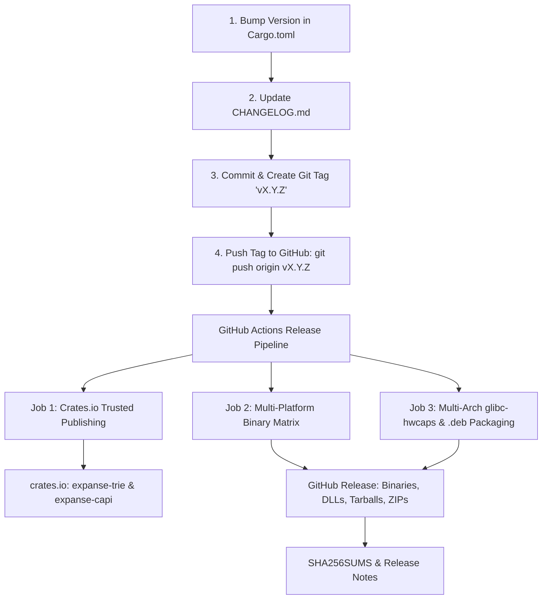

# Release Engineering & Multi-Channel Distribution Guide

> Canonical documentation for Expanse packaging, distribution channels, and automated release workflows.
> Architecture: [ARCHITECTURE.md](ARCHITECTURE.md) · CI Pipeline: [CI.md](CI.md) · C ABI Parity: [COMPAT.md](COMPAT.md)

Expanse is distributed across multiple ecosystems: as native Rust crates on [crates.io](https://crates.io), multi-arch dynamic libraries and `.deb` packages on Linux, drop-in DLLs and native NuGet/vcpkg packages on Windows, universal dynamic libraries on macOS, and upcoming Maven Central and PyPI bindings.

---

## 1. End-to-End Release Process (Step-by-Step)

The entire release process is automated via [`.github/workflows/release.yml`](../.github/workflows/release.yml) upon pushing a version tag.



### Release Steps:
1. **Version Bump**:
   - Update `version = "X.Y.Z"` in `Cargo.toml`, `crates/expanse/Cargo.toml`, and `crates/expanse-capi/Cargo.toml`.
2. **Changelog & Documentation**:
   - Record release highlights, performance deltas, and bug fixes in `CHANGELOG.md`.
3. **Commit & Tag**:
   ```bash
   git commit -am "chore(release): prepare v0.2.0"
   git tag -a v0.2.0 -m "Release v0.2.0"
   git push origin main --tags
   ```
4. **Automated Pipeline Execution**:
   - GitHub Actions automatically executes `.github/workflows/release.yml`, publishing to crates.io and creating the GitHub Release with all binary assets.

---

## 2. Distribution Channels & Package Formats

### 2.1 Rust Crates (crates.io)
- **Crates Published**:
  - [`expanse-trie`](https://crates.io/crates/expanse-trie): Core `#![no_std]` trie engine (`ExpanseSet`, `ExpanseMap`, `ExpanseStrMap`, `ExpanseBytesMap`, `SyncExpanseSet`, `SyncExpanseMap`).
  - [`expanse-capi`](https://crates.io/crates/expanse-capi): C ABI export (`libexpanse.so`, `expanse.dll`, `libexpanse.dylib`, `libexpanse.a`).
- **Trusted Publishing (OIDC)**:
  - Uses secret-less OpenID Connect authentication between GitHub Actions and crates.io (`id-token: write`). No API tokens or long-lived credentials stored in repository secrets.

---

### 2.2 Linux Debian / Ubuntu (`.deb`) & Official APT Repository

Expanse maintains an automated, official Debian/Ubuntu APT repository hosted on GitHub Pages:

#### Quick APT Setup (Debian / Ubuntu / Raspberry Pi OS / RISC-V Linux):
```bash
# 1. Add repository source
echo "deb [trusted=yes] https://orieg.github.io/expanse/apt/ stable main" | sudo tee /etc/apt/sources.list.d/expanse.list

# 2. Update and install
sudo apt-get update
sudo apt-get install -y libexpanse1 libexpanse-dev libjudy-compat
```

- **Architectures Supported in APT Repo**:
  - `amd64` (`x86-64-v1`, `v2`, `v3`, `v4` with `glibc-hwcaps`)
  - `arm64` (AArch64 Apple Silicon Linux, Graviton, Raspberry Pi 4/5)
  - `riscv64` (RV64GC embedded and server systems)

- **Packages Available**:
  - `libexpanse1`: Runtime shared libraries (`libexpanse.so.1.0.0` with `glibc-hwcaps/` variants).
  - `libexpanse-dev`: Development headers (`expanse.h`, `Judy.h`), static library (`libexpanse.a`), and pkg-config.
  - `libjudy-compat`: Drop-in replacement creating system-wide `/usr/lib/.../libJudy.so.1` symlinks to Expanse.


---

---

### 2.3 Enterprise Linux Official RPM Repository (RHEL / CentOS / Fedora / Rocky / Amazon Linux)

Expanse maintains an automated, official RPM repository hosted on GitHub Pages:

#### Quick RPM / DNF Setup:
```bash
# 1. Add repository configuration
sudo dnf config-manager --add-repo https://orieg.github.io/expanse/rpm/expanse.repo

# Or manually download repo file for older YUM / Amazon Linux:
# sudo curl -sS -o /etc/yum.repos.d/expanse.repo https://orieg.github.io/expanse/rpm/expanse.repo

# 2. Update and install
sudo dnf install -y libexpanse libexpanse-devel libjudy-compat
```

- **Architectures Supported in RPM Repo**:
  - `x86_64` (`x86-64-v1`, `v2`, `v3`, `v4` with `glibc-hwcaps`)
  - `aarch64` (AWS Graviton, ARM64 servers)
  - `riscv64` (RV64GC embedded and server systems)

- **Packages Available**:
  - `libexpanse`: Runtime shared library (`/usr/lib64/libexpanse.so.1` with `glibc-hwcaps/` variants).
  - `libexpanse-devel`: Development headers (`/usr/include/expanse.h`, `Judy.h`), static library (`libexpanse.a`), and pkg-config.
  - `libjudy-compat`: Drop-in replacement creating system-wide `/usr/lib64/libJudy.so.1` symlinks to Expanse.

### 2.4 Windows Distribution (`expanse.dll` / `expanse.lib`)
Expanse delivers first-class Windows MSVC binaries built with 64-bit calling conventions:

1. **GitHub Releases Windows ZIP Bundle**:
   - `expanse-vX.Y.Z-x86_64-pc-windows-msvc.zip` containing:
     - `bin/expanse.dll` (dynamic library)
     - `lib/expanse.lib` (MSVC import library)
     - `include/expanse.h` & `include/Judy.h` (C headers)
     - `README.txt` (MSVC build and linking instructions)
2. **Microsoft vcpkg**:
   - Port files in `extra/vcpkg/` (`vcpkg.json`, `portfile.cmake`) enable direct integration via `vcpkg install expanse` or overlay ports.
3. **NuGet Native Package**:
   - Specification in `extra/nuget/` (`expanse.nuspec`, `expanse.targets`) packages the DLL, import lib, and auto-linking MSBuild properties for Visual Studio C++ projects.

---

### 2.5 Pkg-Config & Build System Integration
Templates in `extra/pkgconfig/`:
- `expanse.pc.in` (`pkg-config --cflags --libs expanse`)
- `judy.pc.in` (`pkg-config --cflags --libs judy`)

---

### 2.6 Multi-Platform GitHub Release Archives
Every GitHub release bundles precompiled native archives:
- `expanse-vX.Y.Z-x86_64-unknown-linux-gnu.tar.gz` (glibc + hwcaps)
- `expanse-vX.Y.Z-x86_64-unknown-linux-musl.tar.gz` (static Alpine Linux)
- `expanse-vX.Y.Z-aarch64-apple-darwin.tar.gz` (Apple Silicon macOS)
- `expanse-vX.Y.Z-x86_64-apple-darwin.tar.gz` (Intel macOS)
- `expanse-vX.Y.Z-x86_64-pc-windows-msvc.zip` (Windows MSVC)
- `.deb` packages for Debian/Ubuntu
- `SHA256SUMS` cryptographic manifest

### 2.7 Python Wheels (`pip install expanse-trie`) & PyPI Distribution
Expanse is distributed on PyPI as `expanse-trie` with binary `abi3` wheels across Linux (`x86_64`, `aarch64`), macOS (`arm64`, `x86_64`), and Windows (`x86_64`).

- **Package Configuration**: `pyproject.toml` using `maturin` backend.
- **Python Crate**: `crates/expanse-py` exporting `expanse_trie._expanse`.
- **Type Stubs**: PEP 561 typed (`python/expanse_trie/py.typed` and `__init__.pyi`).
- **CI / Distribution Workflow**: [`.github/workflows/python.yml`](../.github/workflows/python.yml) builds wheels, runs the `pytest` test suite, and publishes to PyPI with trusted publishing (OIDC).
- **Full Guide**: See [docs/BINDINGS_PYTHON.md](BINDINGS_PYTHON.md).

### 2.8 Java & Scala Distribution (`io.github.orieg:expanse-java`) & Maven Central
Expanse is distributed on Maven Central as `io.github.orieg:expanse-java` with bundled multi-arch native libraries loaded via Project Panama Foreign Function & Memory (FFM) API.

- **Package Configuration**: `bindings/java/pom.xml` and `bindings/java/build.gradle`.
- **Native Loader**: `io.github.orieg.expanse.internal.NativeLoader` extracts and loads precompiled native libraries across Linux, macOS, and Windows.
- **Full Guide**: See [docs/BINDINGS_JAVA.md](BINDINGS_JAVA.md).


