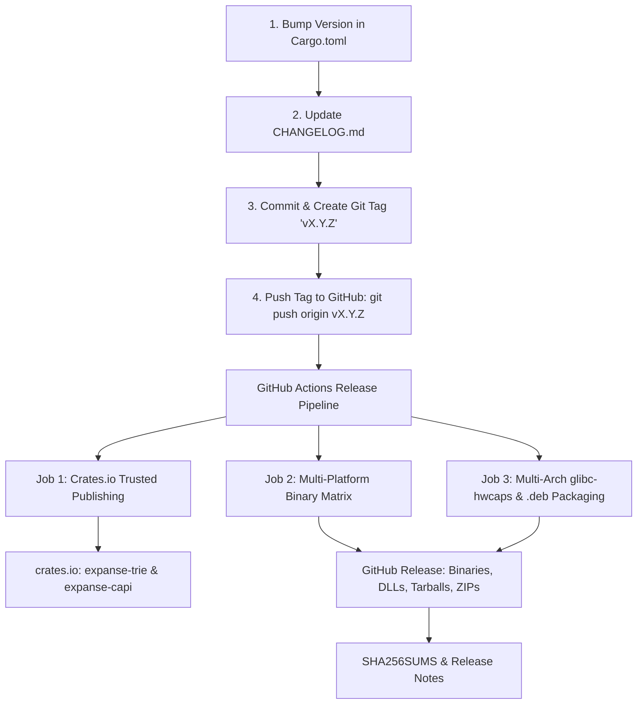

# Release Engineering & Multi-Channel Distribution Guide

> Canonical documentation for Expanse packaging, distribution channels, and automated release workflows.
> Architecture: [ARCHITECTURE.md](ARCHITECTURE.md) · CI Pipeline: [CI.md](CI.md) · C ABI Parity: [COMPAT.md](COMPAT.md)

Expanse is distributed across multiple ecosystems: as native Rust crates on [crates.io](https://crates.io), multi-arch dynamic libraries and `.deb` packages on Linux, drop-in DLLs and native NuGet/vcpkg packages on Windows, universal dynamic libraries on macOS, and upcoming Maven Central and PyPI bindings.

---

## 1. End-to-End Release Process (Step-by-Step)

The entire release process is automated via [`.github/workflows/release.yml`](../.github/workflows/release.yml) upon pushing a version tag.



### Release Steps:
1. **Version Bump**:
   - Update `version = "X.Y.Z"` in `Cargo.toml`, `crates/expanse/Cargo.toml`, and `crates/expanse-capi/Cargo.toml`.
2. **Changelog & Documentation**:
   - Record release highlights, performance deltas, and bug fixes in `CHANGELOG.md`.
3. **Commit & Tag**:
   ```bash
   git commit -am "chore(release): prepare v0.1.0"
   git tag -a v0.1.0 -m "Release v0.1.0"
   git push origin main --tags
   ```
4. **Automated Pipeline Execution**:
   - GitHub Actions automatically executes `.github/workflows/release.yml`, publishing to crates.io and creating the GitHub Release with all binary assets.

---

## 2. Distribution Channels & Package Formats

### 2.1 Rust Crates (crates.io)
- **Crates Published**:
  - [`expanse-trie`](https://crates.io/crates/expanse-trie): Core `#![no_std]` trie engine (`ExpanseSet`, `ExpanseMap`, `ExpanseStrMap`, `ExpanseBytesMap`, `SyncExpanseSet`, `SyncExpanseMap`).
  - [`expanse-capi`](https://crates.io/crates/expanse-capi): C ABI export (`libexpanse.so`, `expanse.dll`, `libexpanse.dylib`, `libexpanse.a`).
- **Trusted Publishing (OIDC)**:
  - Uses secret-less OpenID Connect authentication between GitHub Actions and crates.io (`id-token: write`). No API tokens or long-lived credentials stored in repository secrets.

---

### 2.2 Linux Debian / Ubuntu (`.deb`) & `glibc-hwcaps`
Expanse packages modern multi-architecture libraries utilizing `glibc-hwcaps` (glibc ≥ 2.33 / Ubuntu 22.04+, Debian 12+, RHEL 9+):

- **Packages Generated** via `scripts/package_deb.sh`:
  - `libexpanse1_<ver>_amd64.deb`: Runtime shared libraries containing:
    - `/usr/lib/x86_64-linux-gnu/libexpanse.so.1.0.0` (baseline `x86-64-v1` fallback)
    - `/usr/lib/x86_64-linux-gnu/glibc-hwcaps/x86-64-v2/libexpanse.so.1.0.0` (`+popcnt, +sse4.2`)
    - `/usr/lib/x86_64-linux-gnu/glibc-hwcaps/x86-64-v3/libexpanse.so.1.0.0` (`+avx2, +bmi2, +lzcnt` — **15–21% faster**)
    - `/usr/lib/x86_64-linux-gnu/glibc-hwcaps/x86-64-v4/libexpanse.so.1.0.0` (`+avx512`)
  - `libexpanse-dev_<ver>_amd64.deb`: Development package containing:
    - Headers: `/usr/include/expanse.h` and `/usr/include/Judy.h`
    - Static library: `/usr/lib/x86_64-linux-gnu/libexpanse.a`
    - Symlinks: `/usr/lib/x86_64-linux-gnu/libexpanse.so`
    - Pkg-config: `/usr/lib/x86_64-linux-gnu/pkgconfig/expanse.pc` and `judy.pc`
  - `libjudy-compat_<ver>_amd64.deb`: Drop-in replacement package:
    - Symlinks `/usr/lib/x86_64-linux-gnu/libJudy.so.1` -> `libexpanse.so.1`

---

### 2.3 Windows Distribution (`expanse.dll` / `expanse.lib`)
Expanse delivers first-class Windows MSVC binaries built with 64-bit calling conventions:

1. **GitHub Releases Windows ZIP Bundle**:
   - `expanse-vX.Y.Z-x86_64-pc-windows-msvc.zip` containing:
     - `bin/expanse.dll` (dynamic library)
     - `lib/expanse.lib` (MSVC import library)
     - `include/expanse.h` & `include/Judy.h` (C headers)
     - `README.txt` (MSVC build and linking instructions)
2. **Microsoft vcpkg**:
   - Port files in `extra/vcpkg/` (`vcpkg.json`, `portfile.cmake`) enable direct integration via `vcpkg install expanse` or overlay ports.
3. **NuGet Native Package**:
   - Specification in `extra/nuget/` (`expanse.nuspec`, `expanse.targets`) packages the DLL, import lib, and auto-linking MSBuild properties for Visual Studio C++ projects.

---

### 2.4 Pkg-Config & Build System Integration
Templates in `extra/pkgconfig/`:
- `expanse.pc.in` (`pkg-config --cflags --libs expanse`)
- `judy.pc.in` (`pkg-config --cflags --libs judy`)

---

### 2.5 Multi-Platform GitHub Release Archives
Every GitHub release bundles precompiled native archives:
- `expanse-vX.Y.Z-x86_64-unknown-linux-gnu.tar.gz` (glibc + hwcaps)
- `expanse-vX.Y.Z-x86_64-unknown-linux-musl.tar.gz` (static Alpine Linux)
- `expanse-vX.Y.Z-aarch64-apple-darwin.tar.gz` (Apple Silicon macOS)
- `expanse-vX.Y.Z-x86_64-apple-darwin.tar.gz` (Intel macOS)
- `expanse-vX.Y.Z-x86_64-pc-windows-msvc.zip` (Windows MSVC)
- `.deb` packages for Debian/Ubuntu
- `SHA256SUMS` cryptographic manifest

---

## 3. Future Ecosystem Bindings Roadmap

1. **Java / Scala ([Issue #128](https://github.com/orieg/expanse/issues/128))**:
   - Distributed via Maven Central (`io.github.orieg:expanse-java` & `expanse-scala`) as a fat-JAR with embedded multi-arch native libraries loaded via Project Panama FFM.
2. **Python ([Issue #129](https://github.com/orieg/expanse/issues/129))**:
   - Distributed via PyPI (`pip install expanse-trie`) with precompiled `manylinux`, `musllinux`, `macosx`, and `win_amd64` wheels built via `cibuildwheel`.

