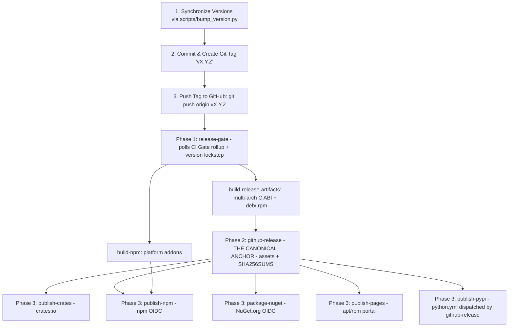

# Release Engineering & Multi-Channel Distribution Guide

> Canonical documentation for Expanse packaging, distribution channels, and automated release workflows.
> Architecture: [ARCHITECTURE.md](ARCHITECTURE.md) · CI Pipeline: [CI.md](CI.md) · C ABI Parity: [COMPAT.md](COMPAT.md)

Expanse targets multiple ecosystems: native Rust crates on [crates.io](https://crates.io), multi-arch dynamic libraries and `.deb`/`.rpm` packages on Linux, drop-in DLLs and vcpkg/NuGet packaging on Windows, and universal dynamic libraries on macOS. **Publication status varies by registry** — see the per-ecosystem sections below. As of this writing crates.io/npm/PyPI publishing is wired in the release workflow; the **.NET `Orieg.Expanse` NuGet package is wired but not yet landed** (nuget.org returns 404), and **Java/Maven Central is not yet built or published** (no release-workflow job exists for it).

---

## 1. End-to-End Release Process (Step-by-Step)

The entire release process is automated via [`.github/workflows/release.yml`](../.github/workflows/release.yml) upon pushing a version tag.

The pipeline is **anchor-first** (#313): the **GitHub Release is the canonical anchor**, created as soon as the gate and core artifacts succeed; every registry publish depends on it and runs afterwards, independently and re-runnably. A registry can therefore never carry a version the release page does not.



**Release policies** (post-v0.4.0 incident, #313):
- **Single anchor**: no workflow publishes straight off a tag push; all channels `needs: github-release`, and PyPI (`python.yml`) is **dispatched by `github-release`** with the release tag (a `GITHUB_TOKEN`-created release emits no `release` event to other workflows, so an event trigger alone can never fire from the pipeline).
- **Forward-only versions**: once *any* registry publish succeeds, that version is spent — registries are immutable. Never re-push or move a tag; fix forward (`vX.Y.Z+1`).
- **Independent recovery**: a failed Phase-3 channel is re-run individually; the anchor and sibling channels are unaffected.
- **Canary first**: run the release workflow via `workflow_dispatch` (`dry_run: true`) to exercise the gate, builds, packaging, and page generation with every outward publish skipped — before pushing a real tag.

### Release Steps:
1. **Multi-Ecosystem Version Bump**:
   - Run `python3 scripts/bump_version.py <NEW_VERSION>` to synchronize version numbers across all 10 manifests (`Cargo.toml`, `pyproject.toml`, `package.json`, `.csproj`, `pom.xml`, `build.gradle`, etc.) and regenerate `Cargo.lock`.
   - Verify lockstep sync: `python3 scripts/bump_version.py --check`.
2. **Release Notes** (automatic — no CHANGELOG file is maintained):
   - The GitHub Release generates its notes from merged PR titles, grouped by the label categories in [`.github/release.yml`](../.github/release.yml). Conventional-commit PR titles keep them readable; label PRs (`enhancement`, `bug`, `performance`, `documentation`, `ci`, …) for correct grouping.
3. **Commit & Tag**:
   ```bash
   git commit -am "chore(release): prepare v0.4.0"
   git tag -a v0.4.0 -m "Release v0.4.0"
   git push origin main --tags
   ```
4. **Automated Pipeline Execution**:
   - GitHub Actions executes `.github/workflows/release.yml`: the gate polls the tagged commit's CI rollup, core artifacts build, the **GitHub Release is created first** (the anchor), and only then do crates.io, npm, NuGet.org, and the Pages repos publish — each independently re-runnable. PyPI publishes from `python.yml` when the GitHub Release is **published**. (Java/Maven is not published by CI.)

---

## 2. Distribution Channels & Package Formats

### 2.1 Rust Crates (crates.io)
- **Crates Published**:
  - [`expanse-trie`](https://crates.io/crates/expanse-trie): Core `#![no_std]` trie engine (`ExpanseSet`, `ExpanseMap`, `ExpanseStrMap`, `ExpanseBytesMap`, `SyncExpanseSet`, `SyncExpanseMap`).
  - [`expanse-capi`](https://crates.io/crates/expanse-capi): C ABI export (`libexpanse.so`, `expanse.dll`, `libexpanse.dylib`, `libexpanse.a`).
- **Trusted Publishing (OIDC)**:
  - Uses secret-less OpenID Connect authentication between GitHub Actions and crates.io (`id-token: write`). No API tokens or long-lived credentials stored in repository secrets.

---

### 2.2 Linux Debian / Ubuntu (`.deb`) & Official APT Repository

Expanse maintains an automated, official Debian/Ubuntu APT repository hosted on GitHub Pages:

#### Quick APT Setup (Debian / Ubuntu / Raspberry Pi OS / RISC-V Linux):
```bash
# 1. Add repository source
echo "deb [trusted=yes] https://orieg.github.io/expanse/apt/ stable main" | sudo tee /etc/apt/sources.list.d/expanse.list

# 2. Update and install
sudo apt-get update
sudo apt-get install -y libexpanse1 libexpanse-dev libjudy-compat
```

- **Architectures Supported in APT Repo**:
  - `amd64` (`x86-64-v1`, `v2`, `v3`, `v4` with `glibc-hwcaps`)
  - `arm64` (AArch64 Apple Silicon Linux, Graviton, Raspberry Pi 4/5)
  - `riscv64` (RV64GC embedded and server systems)

- **Packages Available**:
  - `libexpanse1`: Runtime shared libraries (`libexpanse.so.1.0.0` with `glibc-hwcaps/` variants).
  - `libexpanse-dev`: Development headers (`expanse.h`, `Judy.h`), static library (`libexpanse.a`), pkg-config, and Section 3 man pages (`expanse(3)`, `expanse_set(3)`, etc.).
  - `libjudy-compat`: Drop-in replacement creating system-wide `/usr/lib/.../libJudy.so.1` symlinks to Expanse, pkg-config, and Judy compatibility man pages (`Judy(3)`, `Judy1(3)`, `JudyL(3)`, etc.).

---

### 2.3 Enterprise Linux Official RPM Repository (RHEL / CentOS / Fedora / Rocky / Amazon Linux)

Expanse maintains an automated, official RPM repository hosted on GitHub Pages:

#### Quick RPM / DNF Setup:
```bash
# 1. Add repository configuration
sudo dnf config-manager --add-repo https://orieg.github.io/expanse/rpm/expanse.repo

# Or manually download repo file for older YUM / Amazon Linux:
# sudo curl -sS -o /etc/yum.repos.d/expanse.repo https://orieg.github.io/expanse/rpm/expanse.repo

# 2. Update and install
sudo dnf install -y libexpanse libexpanse-devel libjudy-compat
```

- **Architectures Supported in RPM Repo**:
  - `x86_64` (`x86-64-v1`, `v2`, `v3`, `v4` with `glibc-hwcaps`)
  - `aarch64` (AWS Graviton, ARM64 servers)
  - `riscv64` (RV64GC embedded and server systems)

- **Packages Available**:
  - `libexpanse`: Runtime shared library (`/usr/lib64/libexpanse.so.1` with `glibc-hwcaps/` variants).
  - `libexpanse-devel`: Development headers (`/usr/include/expanse.h`, `Judy.h`), static library (`libexpanse.a`), pkg-config, and Section 3 man pages (`expanse(3)`, `expanse_map(3)`, etc.).
  - `libjudy-compat`: Drop-in replacement creating system-wide `/usr/lib64/libJudy.so.1` symlinks to Expanse, pkg-config, and Judy compatibility man pages (`Judy(3)`, `Judy1(3)`, `JudyL(3)`, etc.).

### 2.4 Windows Distribution (`expanse.dll` / `expanse.lib`)
Expanse delivers first-class Windows MSVC binaries built with 64-bit calling conventions:

1. **GitHub Releases Windows ZIP Bundle**:
   - `expanse-vX.Y.Z-x86_64-pc-windows-msvc.zip` containing:
     - `bin/expanse.dll` (dynamic library)
     - `lib/expanse.lib` (MSVC import library)
     - `include/expanse.h` & `include/Judy.h` (C headers)
     - `README.txt` (MSVC build and linking instructions)
2. **Microsoft vcpkg**:
   - Port files in `extra/vcpkg/` (`vcpkg.json`, `portfile.cmake`) enable direct integration via `vcpkg install expanse` or overlay ports.
3. **NuGet Native Package**:
   - Specification in `extra/nuget/` (`expanse.nuspec`, `expanse.targets`) packages the DLL, import lib, and auto-linking MSBuild properties for Visual Studio C++ projects.

---

### 2.5 Pkg-Config & Build System Integration
Templates in `extra/pkgconfig/`:
- `expanse.pc.in` (`pkg-config --cflags --libs expanse`)
- `judy.pc.in` (`pkg-config --cflags --libs judy`)

---

### 2.6 Multi-Platform GitHub Release Archives
Every GitHub release bundles precompiled native archives:
- `expanse-vX.Y.Z-x86_64-unknown-linux-gnu.tar.gz` (glibc + hwcaps)
- `expanse-vX.Y.Z-x86_64-unknown-linux-musl.tar.gz` (static Alpine Linux)
- `expanse-vX.Y.Z-aarch64-apple-darwin.tar.gz` (Apple Silicon macOS)
- `expanse-vX.Y.Z-x86_64-apple-darwin.tar.gz` (Intel macOS)
- `expanse-vX.Y.Z-x86_64-pc-windows-msvc.zip` (Windows MSVC)
- `.deb` packages for Debian/Ubuntu
- `SHA256SUMS` cryptographic manifest

### 2.7 Python Wheels (`pip install expanse-trie`) & PyPI Distribution
Expanse is distributed on PyPI as `expanse-trie` with binary `abi3` wheels across Linux (`x86_64`, `aarch64`), macOS (`arm64`, `x86_64`), and Windows (`x86_64`).

- **Package Configuration**: `pyproject.toml` using `maturin` backend (`bindings/python`).
- **Python Crate**: `crates/expanse-py` exporting `expanse_trie._expanse`.
- **Type Stubs**: PEP 561 typed (`bindings/python/expanse_trie/py.typed` and `__init__.pyi`).
- **CI / Distribution Workflow**: [`.github/workflows/python.yml`](../.github/workflows/python.yml) builds wheels, runs the `pytest` test suite, and publishes to PyPI with trusted publishing (OIDC).
- **Full Guide**: See [docs/bindings/python.md](bindings/python.md).

### 2.8 Java & Scala Distribution (`io.github.orieg:expanse-java`) & Maven Central
> **Not yet published, and no CI publish path exists.** Maven Central has zero `io.github.orieg` artifacts, and `release.yml` contains no Maven/Gradle/Sonatype build or deploy job. The following describes the *planned* distribution.

Expanse is *intended* to be distributed on Maven Central as `io.github.orieg:expanse-java` with bundled multi-arch native libraries loaded via Project Panama Foreign Function & Memory (FFM) API. Until then, build from `bindings/java` locally.

- **Package Configuration**: `bindings/java/pom.xml` and `bindings/java/build.gradle`.
- **Native Loader**: `io.github.orieg.expanse.internal.NativeLoader` extracts and loads precompiled native libraries across Linux, macOS, and Windows.
- **Full Guide**: See [docs/bindings/java.md](bindings/java.md).

---

### 2.9 Node.js / JavaScript Distribution (`@orieg/expanse`) via npm Registry
Expanse is distributed on the npm registry as [`@orieg/expanse`](https://www.npmjs.com/package/@orieg/expanse) featuring high-performance native N-API binary bindings built via `napi-rs` (`crates/expanse-node/`).

- **Package Configuration**: `crates/expanse-node/package.json` and `crates/expanse-node/Cargo.toml`.
- **Native OIDC Trusted Publishing**:
  - Eliminates long-lived, static npm automation tokens by leveraging native OpenID Connect (OIDC) identity federation between GitHub Actions and npmjs.com.
  - Configured in `.github/workflows/release.yml` with `permissions: id-token: write, contents: read`.
  - Configured on npmjs.com under **@orieg/expanse** -> **Settings** -> **Publishing Access** -> **Trusted Publishing** bound to repository `orieg/expanse`, workflow `release.yml`, and environment/tag rules.
- **Sigstore Build Provenance (`--provenance`)**:
  - Published using `npm publish --access public --provenance`.
  - Automatically generates cryptographic build attestations backed by Sigstore, linking the published tarball to the exact GitHub Actions runner, workflow run, and commit SHA.
  - Users can verify package authenticity directly on npmjs.com via the verified provenance badge.
- **Multi-Runtime Installation**:
  ```bash
  # npm
  npm install @orieg/expanse

  # pnpm
  pnpm add @orieg/expanse

  # yarn
  yarn add @orieg/expanse

  # Bun
  bun add @orieg/expanse

  # Deno
  deno add npm:@orieg/expanse
  ```
- **Quick Usage Snippet (Node.js / Bun / Deno)**:
  ```javascript
  import { ExpanseSet, ExpanseMap, ExpanseBlobMap, SyncExpanseMap } from '@orieg/expanse';

  // 1. Dynamic sparse 64-bit integer set (Judy1)
  const set = new ExpanseSet([10n, 20n, 50n, 100n]);
  console.log(set.has(20n));             // true
  console.log(set.next(25n));            // 50n
  console.log(set.countRange(10n, 50n)); // 3n

  // 2. High-performance word map (JudyL)
  const map = new ExpanseMap();
  map.set(42n, 1000n);
  console.log(map.get(42n));             // 1000n

  // 3. Off-heap polymorphic blob map (inline packing + slab arena)
  const blobMap = new ExpanseBlobMap();
  blobMap.set(1n, Buffer.from("expanse payload"), 0x01);
  const entry = blobMap.getWithMeta(1n);
  console.log(entry.isInline);           // true (0 heap allocations)

  // 4. Lock-free OCC concurrent map for worker threads
  const syncMap = new SyncExpanseMap();
  syncMap.set(100n, 5000n);
  console.log(syncMap.get(100n));        // 5000n
  ```
- **Full Guide**: See [crates/expanse-node/README.md](../crates/expanse-node/README.md).

---

#### WebAssembly: `@orieg/expanse-wasm`

The wasm-bindgen surface (`crates/expanse-wasm`) is published to npm as [`@orieg/expanse-wasm`](https://www.npmjs.com/package/@orieg/expanse-wasm) for browser/edge runtimes (Cloudflare Workers, Deno Deploy, and similar):

```bash
npm i @orieg/expanse-wasm
```

The `publish-wasm` release job (Phase 3, anchor-first per #313) builds with `wasm-pack build --release --target web --scope orieg` and publishes the generated `pkg/` via npm OIDC trusted publishing, idempotent on already-published versions.

---

### 2.10 .NET / C# Distribution (`Orieg.Expanse`) via NuGet.org
> **Wired but not yet landed.** The `release.yml` NuGet push step exists (OIDC trusted publishing, below), but `Orieg.Expanse` does not yet resolve on nuget.org (404 / `totalHits:0`). Build from `bindings/dotnet` locally until first publish.

Expanse is *intended* to be distributed on [NuGet.org](https://www.nuget.org) as [`Orieg.Expanse`](https://www.nuget.org/packages/Orieg.Expanse), providing zero-GC off-heap collections and P/Invoke bindings wrapping `libexpanse` for .NET 8.0 and .NET 9.0+.

- **Package Configuration**: `bindings/dotnet/src/Expanse.NET/Expanse.NET.csproj`.
- **OIDC Trusted Publishing on NuGet.org**:
  - NuGet.org supports secretless OpenID Connect (OIDC) authentication via **Trusted Signing & Publishing Policies**.
  - **Policy Configuration**:
    - **Policy Name**: `expanse-nuget-ci` (Active)
    - **Package Owner**: `orieg`
    - **Scopes**: Push new packages and package versions
    - **Glob Patterns & Packages**: `*` (or `Orieg.*`)
    - **Publisher**: GitHubActions (Repository Owner: `orieg`, Repository: `expanse`, Workflow: `release.yml`)
  - **Workflow Authentication**:
    - Executed in `.github/workflows/release.yml` with `permissions: id-token: write, contents: read`.
    - Authenticates via the official `NuGet/login@v1` action:
      ```yaml
      - name: NuGet login
        uses: NuGet/login@v1
        id: nuget-login
        with:
          user: orieg
      - name: Publish to NuGet.org
        env:
          NUGET_API_KEY: ${{ steps.nuget-login.outputs.NUGET_API_KEY || secrets.NUGET_API_KEY }}
        if: env.NUGET_API_KEY != ''
        run: |
          dotnet nuget push dist/nuget/*.nupkg --api-key "$NUGET_API_KEY" --source https://api.nuget.org/v3/index.json --skip-duplicate || true
      ```
    - Supports fallback authentication via GitHub repository secret `NUGET_API_KEY` when OIDC token is absent.
- **Automated Packaging Pipeline in `release.yml`**:
  - `dotnet pack bindings/dotnet/src/Expanse.NET/Expanse.NET.csproj -c Release -o dist/nuget` generates both the `.nupkg` binary package and `.snupkg` symbol package for SourceLink step-through debugging.
  - Automatically pushes to `https://api.nuget.org/v3/index.json`.
- **Installation**:
  ```bash
  # .NET CLI
  dotnet add package Orieg.Expanse

  # PackageReference (csproj)
  <PackageReference Include="Orieg.Expanse" Version="0.4.1" />
  ```
- **Quick Usage Snippet (C#)**:
  ```csharp
  using System;
  using Expanse;

  // 1. Dynamic sparse 64-bit integer set (Judy1)
  using var set = new ExpanseSet();
  set.Add(10);
  set.Add(20);
  set.Add(50);
  set.Add(100);
  Console.WriteLine(set.Contains(20));     // True
  Console.WriteLine(set.Rank(50));         // O(depth) rank

  // 2. Off-heap key-value map (JudyL)
  using var map = new ExpanseMap();
  map[42] = 1000;
  if (map.TryGet(42, out ulong val))
  {
      Console.WriteLine($"Key 42 -> {val}");
  }

  // 3. String trie (JudySL) and Binary key map (JudyHS)
  using var strMap = new ExpanseStrMap();
  strMap["metrics.cpu"] = 95;

  // 4. Large-value off-heap blob map with zero-copy views
  using var blobMap = new ExpanseBlobMap();
  blobMap.Insert(1, "payload data"u8, 0x01);

  // 5. Lock-free OCC concurrent map
  using var syncMap = new ExpanseSyncMap();
  syncMap.Insert(100, 500);
  ```
- **Full Guide**: See [bindings/dotnet/README.md](../bindings/dotnet/README.md).

---

### 2.11 PHP (Packagist & PIE Zend Extension)
Expanse provides a unified dual-driver distribution for PHP 8.1–8.5+:
- **Composer / Packagist (library)**: [`orieg/expanse`](https://packagist.org/packages/orieg/expanse) — pure-PHP userland package, subsplit from `bindings/php` to [`github.com/orieg/expanse-php-library`](https://github.com/orieg/expanse-php-library).
- **PIE (extension)**: `pie install orieg/expanse-extension` — native Zend extension compiled locally from Rust (`ext-php-rs`), subsplit from `crates/expanse-php` to [`github.com/orieg/php-expanse`](https://github.com/orieg/php-expanse). Follows the MongoDB two-package convention (library = bare name, extension = `-extension`).
- **Zero-Install FFI Fallback**: Automatically activates `\FFI` downcalls into `libexpanse` when native extension compilation is unavailable.
- **Quickstart**:
  ```bash
  composer require orieg/expanse
  ```
  ```php
  use Expanse\Set;
  use Expanse\Map;

  $set = new Set();
  $set->add(42);

  $map = new Map();
  $map->set(42, 1000);
  ```
- **Full Guide**: See [docs/bindings/php.md](bindings/php.md).

---

### 2.12 Ruby Gem (`gem install expanse`)
Expanse is distributed for Ruby 3.0+ as the `expanse` gem under `bindings/ruby`:
- **Package Configuration**: `bindings/ruby/expanse.gemspec` and `bindings/ruby/Rakefile`.
- **FFI Integration**: Uses Ruby's standard library `Fiddle` to load `libexpanse` dynamically across Linux, macOS, and Windows with zero compilation dependencies.
- **Quickstart**:
  ```bash
  gem install expanse
  ```
  ```ruby
  require "expanse"

  set = Expanse::Set.new
  set.add(42)

  map = Expanse::Map.new
  map[42] = 1000
  ```
- **Publishing**: the `publish-gem` release job (Phase 3, anchor-first per #313) pushes to rubygems.org via **OIDC trusted publishing** (`rubygems/configure-rubygems-credentials`), idempotent on already-published versions. The gem is pure Ruby — at runtime it needs `libexpanse` from the apt/rpm repositories, a GitHub Release archive, or a system install.
- **Full Guide**: See [docs/bindings/ruby.md](bindings/ruby.md).

---

### 2.13 Go Module (`github.com/orieg/expanse/bindings/go`)

The Go binding is consumed directly from the monorepo as a **nested Go module**:

```bash
go get github.com/orieg/expanse/bindings/go@v0.4.1
```

Pinned versions resolve via **`bindings/go/vX.Y.Z` tags** (Go's subdirectory-module convention), pushed automatically by the `github-release` job on every release tag. The module wraps `libexpanse` via CGO; build with `cargo build --release -p expanse-capi` available on the library path (see `bindings/go/README.md`).

---

### 2.14 Multi-Ecosystem Version Synchronization (`scripts/bump_version.py`)
Expanse maintains packaging manifests across several ecosystems (Cargo/Rust, C/C++ headers/CMake, Python/PyPI, Node.js/npm, .NET/NuGet, Java/Maven/Gradle, PHP/Composer/PIE, and Ruby/Gems) spanning 16 canonical manifests. Publication status differs per registry (see the per-ecosystem sections: crates.io / npm (+wasm) / PyPI / NuGet / RubyGems / PHP-Packagist all wired into the anchor-first release DAG; Go pinned via nested-module tags; Java/Maven not yet built or published). To guarantee version lockstep without manual error, the repository includes `scripts/bump_version.py`.

#### Synchronized Manifests:
| Manifest File | Section / Key | Description |
|---|---|---|
| `Cargo.toml` | `[workspace.package] version` | Root workspace package metadata |
| `crates/expanse/Cargo.toml` | `[package] version` | Core `expanse-trie` Rust crate |
| `crates/expanse-capi/Cargo.toml` | `[package] version`, `expanse-trie` dep | C ABI `expanse-capi` crate |
| `crates/expanse-py/Cargo.toml` | `[package] version`, `expanse-trie` dep | PyO3 Python native binding crate |
| `crates/expanse-node/Cargo.toml` | `[package] version`, `expanse-trie` dep | napi-rs Node.js native binding crate |
| `crates/expanse-php/Cargo.toml` | `[package] version`, `expanse-trie` dep | ext-php-rs PHP Zend extension crate |
| `crates/expanse-node/package.json` | `"version"` | npm package manifest (`@orieg/expanse`) |
| `bindings/php/composer.json` | `"version"` | PHP Composer package manifest (`orieg/expanse`) |
| `pyproject.toml` | `[project] version` | Python PyPI wheel manifest (`expanse-trie`) |
| `bindings/dotnet/src/Expanse.NET/Expanse.NET.csproj` | `<Version>`, `<PackageVersion>`, `<AssemblyVersion>` | .NET NuGet package manifest (`Orieg.Expanse`) |
| `bindings/java/pom.xml` | `<project><version>` | Maven Central POM manifest (`io.github.orieg:expanse-java`) |
| `bindings/java/build.gradle` | `version = '...'` | Gradle build manifest |
| `bindings/ruby/expanse.gemspec` | `spec.version` | Ruby gem specification (`expanse`) |
| `bindings/ruby/lib/expanse.rb` | `VERSION = '...'` | Ruby module version constant |
| `components/expanse/idf_component.yml` | `version: "..."` | Espressif ESP-IDF Component Manager manifest |
| `extra/vcpkg/vcpkg.json` *(extra)* | `"version"` | Microsoft vcpkg C/C++ port manifest |
| `extra/nuget/expanse.nuspec` *(extra)* | `<version>` | C++ native NuGet package specification |

#### Usage:
1. **Bump Version Across All Manifests & Re-generate `Cargo.lock`**:
   ```bash
   python3 scripts/bump_version.py 0.4.0
   ```
   This automatically updates all manifests and executes `cargo check --workspace` to update `Cargo.lock` with zero manual intervention.

2. **Dry Run (Preview Changes Without Modifying Files)**:
   ```bash
   python3 scripts/bump_version.py 0.4.0 --dry-run
   ```

3. **Verify Lockstep Synchronization (CI Gate)**:
   ```bash
   python3 scripts/bump_version.py --check
   ```
   Or verify against a specific expected version:
   ```bash
   python3 scripts/bump_version.py 0.4.0 --check
   ```
   Exits with code `0` on success, or code `1` with descriptive mismatch reports if any manifest drifts out of sync.

---

### 2.12 Espressif ESP-IDF Component (`components/expanse`)

Expanse is packaged as a first-class component for the **Espressif ESP-IDF framework** (v5.0+), providing both the modern `expanse_*` C API and the legacy `Judy1*` / `JudyL*` C ABI for 32-bit microcontrollers (ESP32, ESP32-C3, ESP32-C6, ESP32-S3).

#### Component Structure
```
components/expanse/
├── idf_component.yml      # Component Manager manifest for Espressif Registry
├── CMakeLists.txt         # ESP-IDF CMake integration
├── Kconfig                # Menuconfig configuration options
├── README.md              # Component documentation and quickstart
├── include/
│   ├── expanse.h          # Modern C API header
│   ├── Judy.h            # Legacy Judy C ABI compatibility header
│   └── expanse_esp_idf.h  # Internal SRAM capability allocator helpers
├── src/
│   └── expanse_esp_idf.c  # ESP-IDF heap capability allocation routines
└── test/
    └── test_expanse.c     # Unity test suite for ESP-IDF
```

#### Consuming in ESP-IDF Projects
Add the dependency to your project's `main/idf_component.yml`:
```yaml
dependencies:
  expanse:
    version: "^0.4.1"
```
Or clone the component directly into your project's `components/` directory.

#### Internal SRAM vs PSRAM Configuration (`Kconfig`)
ESP-IDF developers can configure memory placement via `idf.py menuconfig` under `Component config -> Expanse Embedded Digital Trie`:
- `EXPANSE_SRAM_INTERNAL_ONLY`: Forces allocations into internal high-speed DRAM (`MALLOC_CAP_INTERNAL | MALLOC_CAP_8BIT`) to eliminate SPI bus arbitration delays and maximize cache line throughput.
