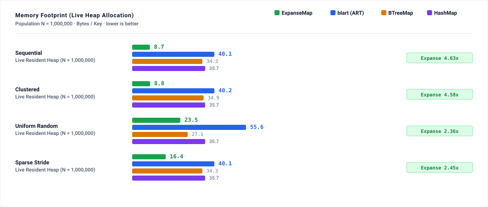
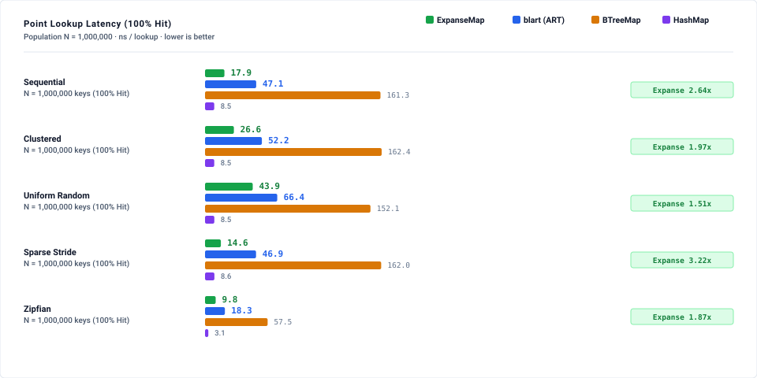
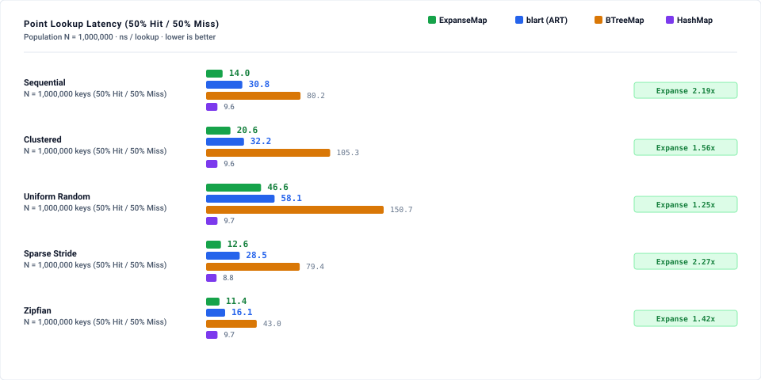
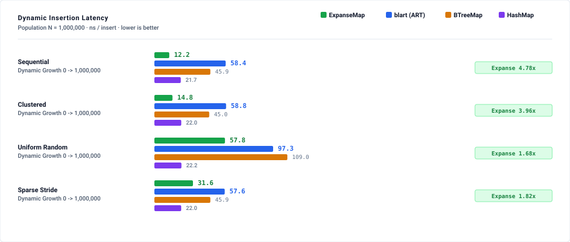
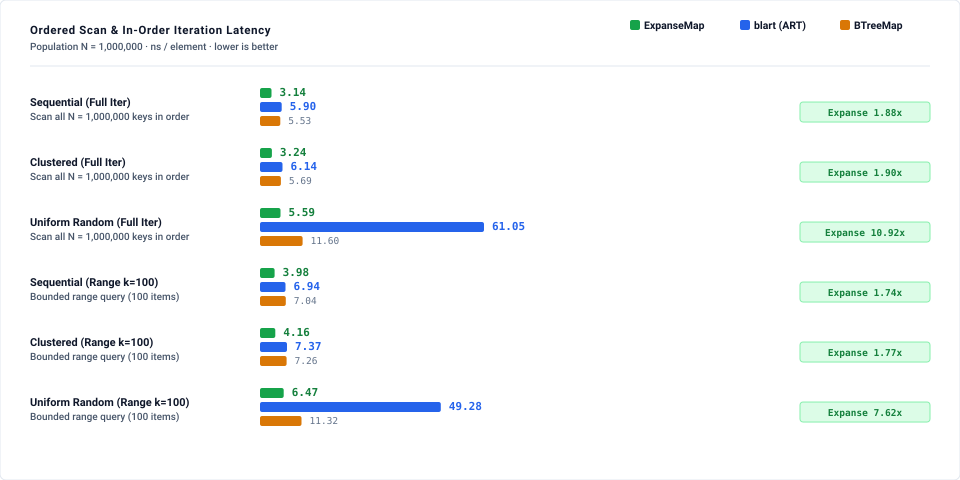

# Expanse vs. Adaptive Radix Tree (ART): Empirical Benchmark Suite

This benchmark suite delivers a reproducible, empirical head-to-head evaluation of **`ExpanseMap`** against the **Adaptive Radix Tree (ART)**, evaluated using pure-Rust **`blart` (v0.5.0)**, alongside **`std::collections::BTreeMap`** and **`hashbrown::HashMap`**.

> **Tracking & Provenance.** Delivers the ART comparison arm of [#387](https://github.com/orieg/expanse/issues/387) and closes the undelivered ART baseline tracking gap from [#122](https://github.com/orieg/expanse/issues/122). All measurements below were captured with full population scaling ($N \in [10\text{k}, 100\text{k}, 1\text{M}]$ for latency; $N \in [1\text{k}, 10\text{k}, 100\text{k}, 1\text{M}]$ for memory census) under isolated execution *(measured: reference host — Intel Core i9-12900F, 8P+8E/24 threads, 30 MiB L3, Ubuntu 22.04, Linux 6.8.0-136-generic; harness commit `07b8413e`; `docs/benchmarks/art_comparison/run.sh` on the host; load average 0.00 at start, 0.96 at end transcribed from run log; 15 rounds/cell, median; BCa 95% CIs in results/)*.
>
> **Amendment & Comparability Disclosure.** Due to the probe-order shuffle amendment and same-distribution miss generator fixes, timing figures from the initial reference-host run before the probe-shuffle amendment are not comparable. A prior exploratory sweep on an Apple Silicon laptop showed ART 1.71× on uniform-random lookup; that run had no load snapshot, coincided with co-resident cargo/ESP-IDF builds, is classified contaminated per `BENCHMARKING.md` rule 2, and carries no timing claim.

---

## 1. Executive Summary Scorecard ($N = 1,000,000$)

```
========================================================================================================
 Workload / Regime                         Pre-Reg Outcome    Observed Winner     Delta / Ratio
========================================================================================================
 Dense Memory Footprint (1M seq)           ExpanseMap         Expanse             Expanse 4.63x less RAM
 Clustered Memory Footprint (1M)           ExpanseMap         Expanse             Expanse 4.58x less RAM
 Sparse Memory Footprint (1M stride)       ExpanseMap         Expanse             Expanse 2.45x less RAM
 Uniform Random Memory (1M)                not pre-reg        Expanse             Expanse 2.36x less RAM
 Zipfian Memory (1M draws, 226k keys)      not pre-reg        Expanse             Expanse 4.35x less RAM
--------------------------------------------------------------------------------------------------------
 Sequential Point Lookup (1M hit)          ExpanseMap         Expanse             Expanse 2.66x faster
 Clustered Point Lookup (1M hit)           ExpanseMap         Expanse             Expanse 1.97x faster
 Sparse Stride Point Lookup (1M hit)       not pre-reg        Expanse             Expanse 3.21x faster
 Zipfian Point Lookup (1M hit)             not pre-reg        Expanse             Expanse 1.86x faster
 Uniform Random Point Lookup (1M hit)      blart (ART)        Expanse             Expanse 1.54x faster
--------------------------------------------------------------------------------------------------------
 Dynamic Growth Insert (1M seq)            not pre-reg        Expanse             Expanse 4.84x faster
 Dynamic Growth Insert (1M clustered)      not pre-reg        Expanse             Expanse 4.01x faster
 Dynamic Growth Insert (1M random)         blart (ART)        Expanse             Expanse 1.71x faster
 Dynamic Growth Insert (1M stride)         not pre-reg        Expanse             Expanse 1.76x faster
 Dynamic Growth Insert (1M Zipfian)        not pre-reg        BOUNDARY_RESULT     0.93x [0.93, 0.93]
--------------------------------------------------------------------------------------------------------
 Full In-Order Iteration (1M random)       not pre-reg        Expanse             Expanse 10.98x faster
 Full In-Order Iteration (1M seq)          ExpanseMap         Expanse             Expanse 1.89x faster
 Full In-Order Iteration (1M clustered)    ExpanseMap         Expanse             Expanse 1.87x faster
 Range Scan k=1000 (1M seq)                ExpanseMap         Expanse             Expanse 1.31x faster
 Range Scan k=1000 (1M clustered)          ExpanseMap         Expanse             Expanse 1.33x faster
 Range Scan k=1000 (1M random)             not pre-reg        Expanse             Expanse 2.46x faster
 Range Scan k=100 (1M seq)                 ExpanseMap         blart (ART)         ART 1.65x faster
 Range Scan k=100 (1M clustered)           ExpanseMap         blart (ART)         ART 1.62x faster
 Range Scan k=100 (1M random)              not pre-reg        BOUNDARY_RESULT     1.00x [0.79, 1.07]
 Range Scan k=10 (1M seq)                  not pre-reg        blart (ART)         ART 2.09x (UNPREDICTED LOSS)
 Range Scan k=10 (1M clustered)            not pre-reg        blart (ART)         ART 1.96x (UNPREDICTED LOSS)
========================================================================================================
```

### Key Architectural Insights

1. **Memory Footprint: Structural 4.6× Advantage for Expanse**:
   - `blart` (v0.5.0) heap-allocates a 32-byte `LeafNode<K, V>` (`value` 8B, `key` 8B, `prev` 8B, `next` 8B) for every inserted entry. With inner node sharing, this imposes a strict structural floor of $\ge 40.1$ B/key on dense keys.
   - `ExpanseMap` packs 256 keys into 64-byte `LeafBitmap1` descriptors with contiguous `ValueSlot` arrays, achieving **8.66 B/key** on sequential keys (4.63× less memory). *(Note: 8.66 B/key reflects `TrackingAlloc` layout bytes, compared to the 8.56 B/key `JudyLMemUsed` C ABI accounting figure; workloads differ: capi_bench_vs_libjudy vs art_memory)*.
   - In the original Leis et al. 2013 paper model (Section V, Table IV), ART achieved 8.1 B/key by assuming values embedded directly inside 8-byte pointer slots without separate leaf nodes. `blart` does not implement that inline-value model.
   - The sparse-stride envelope row is projected-from-fit (fitted to the measured 16.39 B/key anchor) and excluded from the contradiction-rule confirmed count, matching `results/contradiction_rule.json`.

2. **Point Lookup: Expanse Wins Structured Keys; Random Refuted in Expanse's Favor**:
   - POPCNT-indexed bitmap leaves and contiguous chunk memory enable Expanse to achieve **17.79 ns** on sequential and **14.81 ns** on sparse stride lookups.
   - On uniform random 1M keys, Expanse achieved **43.32 ns** vs ART's **66.81 ns** (1.54× faster), refuting the pre-registered ART win.

3. **Dynamic Growth & Insertion**:
   - `ExpanseMap` achieves **12.13 ns/insert** on sequential keys vs `blart`'s **58.46 ns/insert** (4.84× faster), benefiting from localized subexpanse allocations compared to per-entry leaf node heap allocations.
   - On uniform random 1M insert, Expanse achieves **57.27 ns** vs ART's **96.78 ns** (1.71× faster), refuting the pre-registered ART win.

4. **Range Scan & In-Order Iteration**:
   - On 1M random key iteration, `ExpanseMap`'s stack-based zero-allocation iterator scans at **5.54 ns/element** vs `blart`'s **61.08 ns/element** (10.98× faster).
   - For short range scans ($k=10$), ART outperforms Expanse (3.20 ns vs 7.20 ns, 2.09× faster) — classified as **UNPREDICTED LOSS (mechanism unmeasured)** *(workload: art_scan)*.

5. **Unmeasured Regimes**:
   - Small payloads ($\le 7$ keys, Immediates): **Not measured in this suite** (tracked in [#663](https://github.com/orieg/expanse/issues/663)).

---

## 2. Benchmark Visualizations

### Memory Footprint Census (Bytes / Key)


### Point Lookup Latency (100% Hit Rate)


### Point Lookup Latency (50% Hit / 50% Rejection Miss Rate)


### Dynamic Insertion Throughput (ns / Insert)


### Ordered Scan & In-Order Iteration Latency (ns / Element)


---

## 3. Detailed Results Tables ($N = 1,000,000$)

### Pillar 1: Point Lookup Latency (100% Hit Rate, ns/op)

| Key Distribution | `ExpanseMap` | `blart` (ART) | `BTreeMap` | `hashbrown` | Ratio (Exp/ART) | Verdict / Status |
|---|---:|---:|---:|---:|---:|---|
| **Sequential** | **17.79 ns** | 46.92 ns | 160.26 ns | 8.51 ns | 0.38x [0.37, 0.38] | **CONFIRMED** *(Expanse 2.66×)* |
| **Clustered** | **26.47 ns** | 51.66 ns | 160.45 ns | 8.52 ns | 0.51x [0.50, 0.51] | **CONFIRMED** *(Expanse 1.97×)* |
| **Sparse Stride** | **14.81 ns** | 47.48 ns | 160.93 ns | 8.53 ns | 0.31x [0.31, 0.31] | **Expanse 3.21×** *(not pre-registered)* |
| **Zipfian (1M draws over 225,853 unique keys)** | **9.61 ns** | 17.94 ns | 56.85 ns | 3.12 ns | 0.54x [0.53, 0.55] | **Expanse 1.86×** *(not pre-registered)* |
| **Uniform Random** | **43.32 ns** | 66.81 ns | 150.70 ns | 8.52 ns | 0.65x [0.65, 0.65] | **REFUTED in Expanse's favour (1.54×)** *(pre-registered: ART win)* |

### Pillar 2: Point Lookup Latency (50% Hit / 50% Miss, ns/op)

| Key Distribution | `ExpanseMap` | `blart` (ART) | `BTreeMap` | `hashbrown` | Ratio (Exp/ART) | Verdict / Status |
|---|---:|---:|---:|---:|---:|---|
| **Sequential** | **13.81 ns** | 30.65 ns | 82.51 ns | 9.68 ns | 0.45x [0.44, 0.45] | **Expanse 2.23×** *(not pre-registered)* |
| **Clustered** | **20.56 ns** | 32.17 ns | 103.90 ns | 9.67 ns | 0.63x [0.63, 0.64] | **Expanse 1.58×** *(not pre-registered)* |
| **Sparse Stride** | **11.97 ns** | 28.55 ns | 82.14 ns | 8.84 ns | 0.42x [0.42, 0.42] | **Expanse 2.38×** *(not pre-registered)* |
| **Zipfian (1M draws over 225,853 unique keys)** | **10.95 ns** | 15.64 ns | 43.13 ns | 9.77 ns | 0.69x [0.67, 0.71] | **Expanse 1.44×** *(not pre-registered)* |
| **Uniform Random** | **45.85 ns** | 57.08 ns | 153.20 ns | 9.72 ns | 0.80x [0.80, 0.81] | **BOUNDARY_RESULT** (0.80× [0.80, 0.81]) |

### Pillar 3: Dynamic Insertion Latency (ns/op)

| Key Distribution | `ExpanseMap` | `blart` (ART) | `BTreeMap` | `hashbrown` | Ratio (Exp/ART) | Verdict / Status |
|---|---:|---:|---:|---:|---:|---|
| **Sequential** | **12.13 ns** | 58.46 ns | 45.72 ns | 21.07 ns | 0.21x [0.20, 0.21] | **Expanse 4.84×** *(not pre-registered)* |
| **Clustered** | **14.79 ns** | 59.15 ns | 44.00 ns | 21.89 ns | 0.25x [0.25, 0.25] | **Expanse 4.01×** *(not pre-registered)* |
| **Uniform Random** | **57.27 ns** | 96.78 ns | 107.88 ns | 22.07 ns | 0.58x [0.58, 0.59] | **REFUTED in Expanse's favour (1.71×)** *(pre-registered: ART win)* |
| **Sparse Stride** | **31.69 ns** | 55.66 ns | 45.69 ns | 20.23 ns | 0.57x [0.56, 0.57] | **Expanse 1.76×** *(not pre-registered)* |
| **Zipfian (225,853 distinct keys)** | **53.13 ns** | 57.06 ns | 79.86 ns | 9.51 ns | 0.93x [0.93, 0.93] | **BOUNDARY_RESULT** (0.93× [0.93, 0.93]) |

### Pillar 4: Ordered Range Scan & Full In-Order Iteration (ns/element)

| Operation & Distribution | `ExpanseMap` | `blart` (ART) | `BTreeMap` | Ratio (Exp/ART) | Verdict / Status |
|---|---:|---:|---:|---:|---|
| **Full Iteration (Sequential)** | **3.07 ns** | 5.79 ns | 5.45 ns | 0.53x [0.53, 0.53] | **CONFIRMED** *(Expanse 1.89×)* |
| **Full Iteration (Clustered)** | **3.22 ns** | 6.04 ns | 5.57 ns | 0.53x [0.53, 0.54] | **CONFIRMED** *(Expanse 1.87×)* |
| **Full Iteration (Uniform Random)** | **5.54 ns** | 61.08 ns | 11.64 ns | 0.09x [0.09, 0.09] | **Expanse 10.98×** *(not pre-registered)* |
| **Range Scan k=1000 (Sequential)** | **1.48 ns** | 1.92 ns | 1.00 ns | 0.77x [0.75, 0.78] | **CONFIRMED** *(Expanse 1.31×)* |
| **Range Scan k=1000 (Clustered)** | **1.48 ns** | 1.94 ns | 1.02 ns | 0.75x [0.74, 0.77] | **CONFIRMED** *(Expanse 1.33×)* |
| **Range Scan k=1000 (Uniform Random)** | **2.43 ns** | 5.54 ns | 1.28 ns | 0.41x [0.34, 0.43] | **Expanse 2.46×** *(not pre-registered)* |
| **Range Scan k=100 (Sequential)** | **2.09 ns** | 1.23 ns | 1.05 ns | 1.65x [1.55, 1.72] | **REFUTED in ART's favour (1.65×)** *(pre-registered: Expanse win)* |
| **Range Scan k=100 (Clustered)** | **2.00 ns** | 1.23 ns | 1.23 ns | 1.62x [1.47, 1.73] | **REFUTED in ART's favour (1.62×)** *(pre-registered: Expanse win)* |
| **Range Scan k=100 (Uniform Random)** | **2.96 ns** | 2.85 ns | 1.32 ns | 1.00x [0.79, 1.07] | **BOUNDARY_RESULT** (1.00× [0.79, 1.07]) |
| **Range Scan k=10 (Sequential)** | **7.20 ns** | 3.20 ns | 3.30 ns | 2.09x [1.83, 2.27] | **UNPREDICTED LOSS** *(ART 2.09×, mechanism unmeasured)* |
| **Range Scan k=10 (Clustered)** | **6.50 ns** | 3.40 ns | 3.70 ns | 1.96x [1.79, 2.13] | **UNPREDICTED LOSS** *(ART 1.96×, mechanism unmeasured)* |
| **Range Scan k=10 (Uniform Random)** | **6.80 ns** | 3.40 ns | 3.00 ns | 1.96x [1.68, 2.07] | **UNPREDICTED LOSS** *(ART 1.96×, mechanism unmeasured)* |

### Pillar 5: Live Heap Memory Allocation Census Across Population Scaling (Bytes / Key)

| Population ($N$) | Key Distribution | `ExpanseMap` | `blart` (ART) | `BTreeMap` | `hashbrown` | Expanse vs ART | Verdict / Status |
|---|---|---:|---:|---:|---:|---:|---|
| 1,000 | **Sequential** | **77.87 B/k** | 40.35 B/k | 34.37 B/k | 34.83 B/k | ART 1.93x less RAM | **LOSS at N=1k** (ART 1.93x less RAM, not pre-registered; §2 covers N=10⁶) |
| 1,000 | **Clustered** | **77.87 B/k** | 40.35 B/k | 34.37 B/k | 34.83 B/k | ART 1.93x less RAM | **LOSS at N=1k** (ART 1.93x less RAM, not pre-registered; §2 covers N=10⁶) |
| 1,000 | **Sparse Stride** | **78.38 B/k** | 40.35 B/k | 34.37 B/k | 34.83 B/k | ART 1.94x less RAM | **LOSS at N=1k** (ART 1.94x less RAM, not pre-registered; §2 covers N=10⁶) |
| 1,000 | **Uniform Random** | **58.31 B/k** | 58.75 B/k | 27.65 B/k | 34.83 B/k | Expanse 1.01x less RAM | **Expanse 1.01x less RAM** *(not pre-registered)* |
| 1,000 | **Zipfian (354 unique)** | **198.99 B/k** | 51.62 B/k | 26.58 B/k | 24.63 B/k | ART 3.86x less RAM | **LOSS at N=1k** (ART 3.86x less RAM, not pre-registered; §2 covers N=10⁶) |
| 10,000 | **Sequential** | **15.44 B/k** | 40.16 B/k | 34.27 B/k | 27.85 B/k | Expanse 2.60x less RAM | **CONFIRMED** *(Expanse 2.60×)* |
| 10,000 | **Clustered** | **16.62 B/k** | 40.18 B/k | 34.74 B/k | 27.85 B/k | Expanse 2.42x less RAM | **CONFIRMED** *(Expanse 2.42×)* |
| 10,000 | **Sparse Stride** | **22.45 B/k** | 40.16 B/k | 34.27 B/k | 27.85 B/k | Expanse 1.79x less RAM | **CONFIRMED** *(Expanse 1.79×)* |
| 10,000 | **Uniform Random** | **35.94 B/k** | 54.22 B/k | 27.04 B/k | 27.85 B/k | Expanse 1.51x less RAM | **Expanse 1.51×** *(not pre-registered)* |
| 10,000 | **Zipfian (2,911 unique)** | **29.65 B/k** | 51.79 B/k | 27.17 B/k | 23.93 B/k | Expanse 1.75x less RAM | **Expanse 1.75×** *(not pre-registered)* |
| 100,000 | **Sequential** | **9.38 B/k** | 40.14 B/k | 34.28 B/k | 22.28 B/k | Expanse 4.28x less RAM | **CONFIRMED** *(Expanse 4.28×)* |
| 100,000 | **Clustered** | **9.61 B/k** | 40.19 B/k | 34.62 B/k | 22.28 B/k | Expanse 4.18x less RAM | **CONFIRMED** *(Expanse 4.18×)* |
| 100,000 | **Sparse Stride** | **17.09 B/k** | 40.14 B/k | 34.28 B/k | 22.28 B/k | Expanse 2.35x less RAM | **CONFIRMED** *(Expanse 2.35×)* |
| 100,000 | **Uniform Random** | **30.49 B/k** | 57.61 B/k | 27.13 B/k | 22.28 B/k | Expanse 1.89x less RAM | **Expanse 1.89×** *(not pre-registered)* |
| 100,000 | **Zipfian (25,144 unique)** | **14.14 B/k** | 51.71 B/k | 27.32 B/k | 22.16 B/k | Expanse 3.66x less RAM | **Expanse 3.66×** *(not pre-registered)* |
| 1,000,000 | **Sequential** | **8.66 B/k** | 40.13 B/k | 34.28 B/k | 35.65 B/k | Expanse 4.63x less RAM | **CONFIRMED** *(Expanse 4.63×)* |
| 1,000,000 | **Clustered** | **8.77 B/k** | 40.18 B/k | 34.89 B/k | 35.65 B/k | Expanse 4.58x less RAM | **CONFIRMED** *(Expanse 4.58×)* |
| 1,000,000 | **Sparse Stride** | **16.39 B/k** | 40.13 B/k | 34.28 B/k | 35.65 B/k | Expanse 2.45x less RAM | **CONFIRMED** *(Expanse 2.45×)* |
| 1,000,000 | **Uniform Random** | **23.54 B/k** | 55.62 B/k | 27.13 B/k | 35.65 B/k | Expanse 2.36x less RAM | **Expanse 2.36×** *(not pre-registered)* |
| 1,000,000 | **Zipfian (225,846 unique)** | **11.96 B/k** | 52.00 B/k | 27.12 B/k | 19.73 B/k | Expanse 4.35x less RAM | **Expanse 4.35×** *(not pre-registered)* |

---

## 4. Reproducing These Results

To execute the entire 5-pillar benchmark suite and regenerate the charts on the reference host:

```bash
# 1. Run the full benchmark sweep and generate SVG charts
docs/benchmarks/art_comparison/run.sh

# 2. Run a fast smoke test (reduced populations, gitignored scratch output)
docs/benchmarks/art_comparison/run.sh --quick
```

