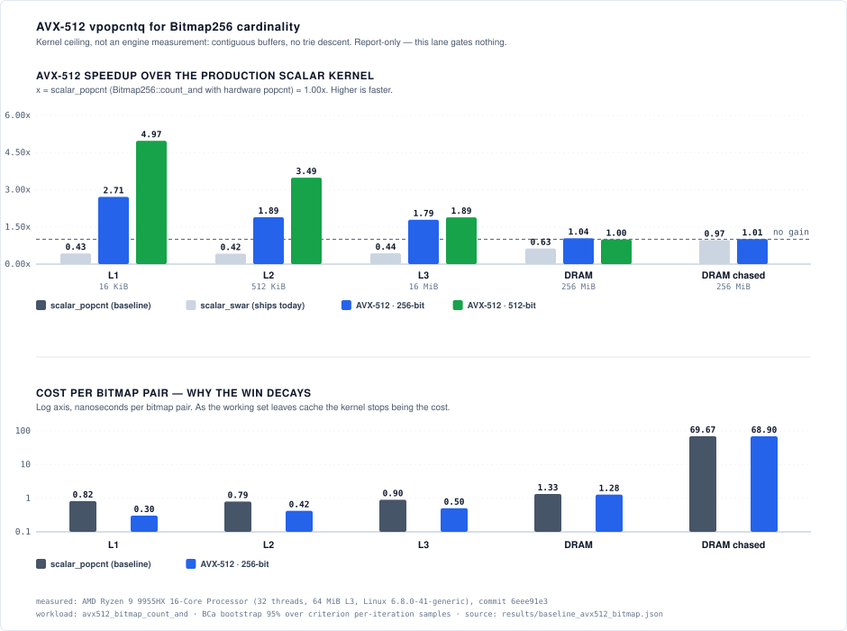

# AVX-512 `vpopcntq` for `Bitmap256` cardinality

A measured answer to the one open AVX-512 row in [`docs/HARDWARE.md`](../../HARDWARE.md) §6,
and the portable finding that came out of building its control arm.



> **Report-only.** This suite gates nothing and no regression threshold is
> written against it. It is wall-clock by necessity, not by preference — see
> [§3](#3-why-callgrind-cannot-measure-this).

---

## 1. What was asked

`Bitmap256::count_and` is the inner kernel of the `algebra.rs` intersection walk
behind the `search_boolean` suite: at a pair of aligned bitmap leaves it is four
`AND`s and four `popcnt`s. A 256-bit bitmap is one `ymm` and two of them are one
`zmm`, so a CPU with `avx512_vpopcntdq` can retire an entire pair-cardinality in
a single `vpopcntq`. `docs/HARDWARE.md` §6 carried that as an open
*"Moderate, benchmark-gated"* opportunity. This is the benchmark.

## 2. Four arms, and why the second one exists

| Arm | What it is |
|---|---|
| `scalar_swar` | `count_and` reached from a feature-less caller — what `algebra.rs` ships today, so `count_ones` lowers to the ~12-instruction SWAR sequence on the baseline `x86-64` target |
| `scalar_popcnt` | the same kernel reached from a `#[target_feature(enable = "popcnt")]` clone, the way `get::walk` reaches it — hardware `popcnt`, no new ISA requirement |
| `v256` | `vpand` + `vpopcntq` over one bitmap pair per `ymm` |
| `v512` | the same over two pairs per `zmm` |

Rating the vector arms against `scalar_swar` would credit them with a win that
is really `popcnt`-vs-SWAR. AGENTS.md §8.3 requires the baseline to be the
production configuration, so `scalar_popcnt` is the denominator throughout.
Constructing it is what surfaced [§5](#5-the-finding-from-the-control-arm).

## 3. Why Callgrind cannot measure this

Callgrind is this repository's primary regression instrument, and it is
structurally blind to AVX-512. Valgrind implements none of it
([KDE bug 383010](https://bugs.kde.org/show_bug.cgi?id=383010), opened 2017,
enabling branch put on hold in 2019). Both failure modes are reproduced by
[`crates/expanse/examples/avx512_probe.rs`](../../../crates/expanse/examples/avx512_probe.rs):

```text
$ ./avx512_probe                      $ valgrind --tool=callgrind ./avx512_probe
detect avx512f            true        detect avx512f            false
detect avx512vpopcntdq    true        detect avx512vpopcntdq    false
dispatch_taken     AVX512             dispatch_taken     scalar-fallback
```

1. **Runtime-dispatched** — Valgrind masks the `avx512*` CPUID bits, so
   `is_x86_feature_detected!` returns false and dispatch silently selects the
   scalar fallback. The `instruction-counts` job would report an AVX-512 kernel
   as *"no change"*: a degradation that renders as success, which AGENTS.md §8.1
   exists to forbid.
2. **Unconditional** (a `-C target-cpu=x86-64-v4` build) — the EVEX prefix is not
   decoded and Valgrind raises SIGILL on `vpopcntq`.

There is a second, unrelated cost: `core::arch`'s AVX-512 intrinsics are stable
only since Rust **1.89**, and the declared MSRV floor is **1.88**. The vector
arms therefore sit behind an off-by-default `avx512` cargo feature so that the
`Core / MSRV 1.88 Build` job's `cargo check --workspace --all-targets` never
compiles them.

## 4. Results

*(measured: AMD Ryzen 9 9955HX, 32 threads, 64 MiB L3, Linux 6.8.0-41-generic;
`results/baseline_avx512_bitmap.json`; workload: `avx512_bitmap_count_and`;
commit `b22c8739`; BCa 95% bootstrap over criterion per-iteration samples,
2,000 resamples, seed 42, n = 20 per arm; load average 2.83 at harvest on a 32-thread host)*

Every cell is `scalar_popcnt` ÷ that arm, so **above 1.000× is faster than the
production scalar kernel and below it is slower**:

| Regime | Working set | `scalar_popcnt` ns/pair | `scalar_swar` | `v256` | `v512` |
|---|---|---:|---:|---:|---:|
| L1 | 16 KiB | 0.821 | 0.409× | **2.715×** | **4.990×** |
| L2 | 512 KiB | 0.795 | 0.421× | **2.011×** | **3.703×** |
| L3 | 16 MiB | 0.844 | 0.437× | **1.817×** | **1.946×** |
| DRAM, sequential | 256 MiB | 1.360 | 0.677× | **1.063×** | 1.041× |
| DRAM, pointer-chased | 256 MiB | 66.763 | 0.977× | 1.004× | — |

**The vector win is a cache-residency artifact.** The kernel is ~0.82 ns of work
per bitmap pair. On the pointer-chased walk a pair costs 66.76 ns, so the
arithmetic is well under 2% of the time — and that is roughly what the vector arm
returns there: `v256` is **1.004×**, intervals [278.53, 279.27] ms against
[279.69, 280.44] ms. They are disjoint, so the 0.4% is real rather than noise,
but it is 0.4% against 4.990× in L1. The sequential-DRAM cells (1.063× and
1.041×) sit between the two and are the smallest wins worth reporting; an earlier
run of the same sweep put `v512` there at 0.997×, i.e. a loss, which is the size
of effect this arm can resolve.

The pointer-chased arm is the one to read. The engine reaches its bitmap leaves
by chasing `Edge` pointers through a slab arena; the contiguous regimes above it
are a *kernel ceiling*, not an engine measurement, and nothing here licenses a
claim about `intersection_len` throughput. `v512` is absent from that row
because a serially dependent walk has no second independent pair with which to
fill the upper half of a `zmm`.

This is the same shape as the SVE result already recorded in `docs/HARDWARE.md`
§6 — wide vectors lose where the adaptive ladder keeps the vectorizable work
small, or where the per-element cost is dominated by something other than the
arithmetic — reached by a different route. *Which* stall dominates the chased
arm is **unmeasured**: this harness reports wall clock, and attributing it to
load latency rather than, say, TLB pressure would need `perf stat` counters this
suite does not collect.

## 5. The finding from the control arm

`Bitmap256::count_and` is `#[inline(always)]` and calls `u64::count_ones`
directly. The hardware instruction is obtained by *inlining into a
`#[target_feature(enable = "popcnt")]` caller*: the baseline `x86-64` target does
not include `popcnt`, so `count_ones` otherwise lowers to a ~12-instruction SWAR
sequence. That is precisely why `bits.rs` carries `popcnt_rt` and why `get.rs`
carries entry clones with a cached CPUID dispatch.

**`algebra.rs` has no such clone.** Its `count_and` call site sits in a
feature-less function, so on the portable default build the intersection walk
pays SWAR at every bitmap leaf. The `scalar_swar` column is what that costs:
**2.29×–2.44× while cache-resident, 1.48× at sequential DRAM**, and 1.024× even
on the chased arm, where the intervals [286.44, 286.97] ms and
[279.69, 280.44] ms are disjoint
*(`results/baseline_avx512_bitmap.json`, workload: `avx512_bitmap_count_and`)*.

Against the AVX-512 option this is the better trade on every axis: it is
portable, it needs no ISA feature the baseline target lacks, it does not move
the MSRV floor, and because `popcnt` dispatch is exactly what `popcnt_probe.rs`
already verifies survives Valgrind, **it is measurable by the existing Callgrind
gate**. It is now the `High` row of the `docs/HARDWARE.md` §6 table.

No engine change is made here. This suite measures a kernel; how much of the gap
is realised *inside the intersection walk* is **unmeasured**, and that is the
next step, on `search_instructions` — the deterministic instrument, on the
reference host.

## 6. Reproducing

Requires a host with `avx512vpopcntdq`. The runner refuses to start without it
rather than publishing a scalar-only sweep as though it were the full one:

```bash
docs/benchmarks/avx512/run.sh
```

That takes the host-wide benchmark lock, records a load snapshot, demonstrates
the CPUID masking natively and under Callgrind, runs the sweep, harvests BCa
intervals into `results/baseline_avx512_bitmap.json`, and regenerates
`docs/assets/bench_avx512.svg` from it. Nothing in the chart is retyped (§8.2).

In CI the same sweep is the `AVX-512 Kernel Benchmarks` workflow
([`.github/workflows/bench_avx512.yml`](../../../.github/workflows/bench_avx512.yml)),
triggered by `workflow_dispatch` or a `/bench avx512` comment on a pull request.
It targets `runs-on: [avx512]`, a label carried only by a host with the feature
and deliberately disjoint from the bare-metal reference host's
`[self-hosted, linux]` selector — the reference host fuses AVX-512 off entirely,
every published figure in `docs/` resolves to it, and its job pool must stay
single-host.

The suite is declared `available: false` in
[`.github/bench-suites.json`](../../../.github/bench-suites.json) so that
`/bench avx512_bitmap` on the reference host is refused by name with that
reason, instead of running and reporting one arm.
