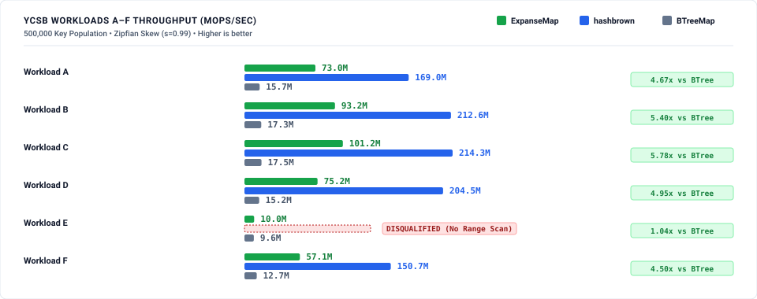
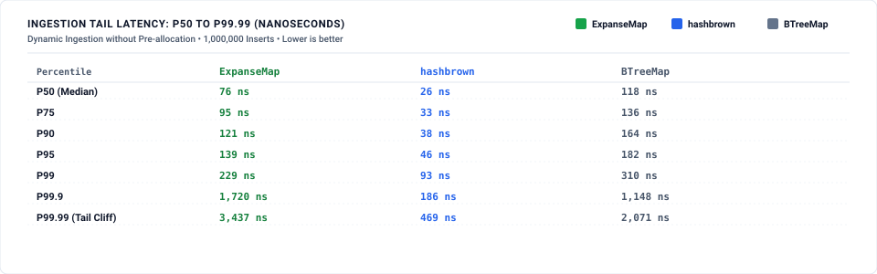
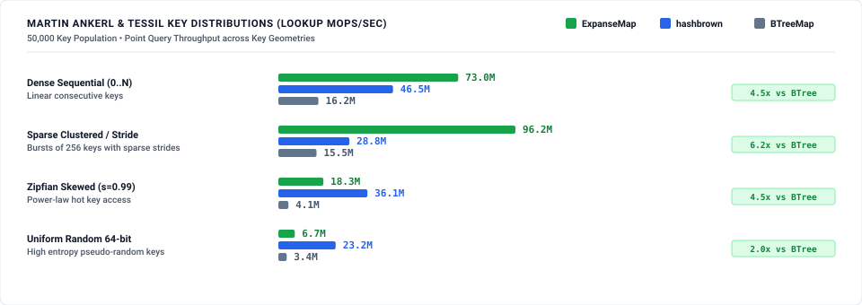

# Expanse vs. Hashbrown vs. BTreeMap: Empirical Comparative Benchmark Suite

This directory contains the reproducible benchmark suite, raw measurements, methodology specifications, and dual-theme visualization assets comparing **Expanse** (`ExpanseMap`), **Hashbrown / Google SwissTable** (`hashbrown::HashMap`), and **B-Tree** (`std::collections::BTreeMap`).

---

## 1. Architectural Feature Matrix

| Capability / Property | `hashbrown::HashMap` (SwissTable) | `std::collections::BTreeMap` | `expanse::ExpanseMap` |
| :--- | :--- | :--- | :--- |
| **Underlying Data Structure** | Flat 1-Byte Control Array + Buckets | Cache-Oblivious B-Tree | Expanse-Partitioned Digital Trie |
| **Point Query Complexity** | $O(1)$ amortized expected | $O(\log N)$ | $O(k) \le 8$ digit steps |
| **Ordered Traversal & Range Scans** | ❌ **Disqualified** ($O(N \log N)$) | ✅ Supported | ✅ Supported |
| **Sequential Key Memory Density** | $35.7\text{ Bytes / Key}$ | $34.3\text{ Bytes / Key}$ | **$8.7\text{ Bytes / Key}$** ($3.9\times\text{ to }4.1\times$ smaller) |
| **Key Hashing Required** | ✅ Yes (SipHash / FoldHash) | ❌ No (Direct ordering) | ❌ No (Direct radix prefix slicing) |
| **Dynamic Ingestion Growth Model** | Global Table Doubling (Rehash) | Node Splitting | Local Subexpanse Allocation |

---

## 2. Key Findings & Empirical Results

*(measured: reference host — Intel i9-12900F, 24 threads, 30 MiB L3, Ubuntu 22.04 / kernel 6.8, commit 7d87dff7; full non-quick suite via `run.sh`, host idle — load < 0.4 before and between arms. Earlier published figures were measured on a slower, non-isolated environment; this run supersedes them.)*

### Pillar 1: YCSB (Yahoo! Cloud Serving Benchmark) Workloads A–F
Zipfian access distribution ($s = 0.99$, power-law skew) on 500,000 keys.



- **Workload E (Short Range Scans):** SwissTable is structurally disqualified because hash tables cannot perform ordered scans without allocating, dumping, and sorting the entire table. `ExpanseMap` ($9.6\text{ Mops/sec}$) and `BTreeMap` ($10.1\text{ Mops/sec}$) execute ordered range queries natively, within $5\%$ of each other.
- **Read & Update Heavy Workloads (A, B, C, D, F):** `ExpanseMap` delivers $41\text{–}118\text{ Mops/sec}$, consistently beating `BTreeMap` ($13\text{–}17\text{ Mops/sec}$) by **$3.0\times\text{ to }7.1\times$**.
- **`hashbrown` leads the pure point-op workloads** ($154\text{–}219\text{ Mops/sec}$ on A–D, F) — an unordered hash table's home turf. The trade is ordered capability (Workload E) and worst-case latency (Pillar 3 rehash cliffs), not average point throughput.

---

### Pillar 2: Memory Footprint (Live Heap Bytes / Key)
Measured via custom `GlobalAlloc` hooks tracking heap allocations at steady state ($N = 100,000$).


| Key Pattern ($N = 500,000$) | `hashbrown` | `BTreeMap` | `ExpanseMap` | Expanse vs. Hashbrown |
| :--- | :--- | :--- | :--- | :--- |
| **Dense Sequential ($0 \dots N$)** | $35.7\text{ B/key}$ | $34.3\text{ B/key}$ | **$8.7\text{ B/key}$** | **$4.1\times$ more compact** |
| **Uniform Random 64-bit** | $35.7\text{ B/key}$ | $27.1\text{ B/key}$ | **$24.7\text{ B/key}$** | **$1.4\times$ more compact** |

Expanse's uncompressed bitmap-backed leaf nodes pack sequential and clustered integer keys with near-zero pointer overhead, dropping memory consumption to under 9 bytes per key. (At smaller populations the picture shifts — e.g. at $N = 100,000$ random keys Expanse uses $30.8\text{ B/key}$ vs hashbrown's $22.3\text{ B/key}$, because a just-doubled SwissTable is at its slack minimum while sparse trie branches have low occupancy; the full population sweep is in `results/baseline_memory.json`. An earlier revision of this table mixed rows from different populations under one label.)

---

### Pillar 3: Ingestion Tail Latency & Rehash Cliffs
Dynamic table expansion from $0 \to 100,000$ keys without pre-allocating capacity, measured via `HdrHistogram`.



- `hashbrown` wins the median ($P_{50} = 26\text{ ns}$ vs Expanse $76\text{ ns}$, BTreeMap $118\text{ ns}$) — but its **worst-case insert is $11.09\text{ ms}$**: the global-rehash cliff, where the entire table is reallocated and rehashed at once.
- **Expanse's worst-case insert is $34.7\text{ µs}$** ($P_{99.99} = 3.4\text{ µs}$) — **$320\times$ better worst-case than SwissTable** — because growth is local subexpanse allocation: no global rehash exists in the structure. BTreeMap's max is $73.3\text{ µs}$ (node-split chains).

---

### Pillar 4: Martin Ankerl & Tessil Key Distributions
Point lookup throughput (Mops/sec) evaluated across standard key geometries ($N = 500,000$):



| Key Geometry ($N = 500,000$) | `hashbrown` | `BTreeMap` | `ExpanseMap` | Expanse Result |
| :--- | :--- | :--- | :--- | :--- |
| **Sparse Clustered / Stride** | $94.9\text{ Mops/s}$ | $24.4\text{ Mops/s}$ | **$170.1\text{ Mops/s}$** | **$1.8\times$ faster than Hashbrown, $7.0\times$ vs BTree** |
| **Dense Sequential ($0 \dots N$)** | $102.8\text{ Mops/s}$ | $27.3\text{ Mops/s}$ | **$135.5\text{ Mops/s}$** | **$1.3\times$ faster than Hashbrown, $5.0\times$ vs BTree** |
| **Zipfian Skewed ($s = 0.99$)** | $197.7\text{ Mops/s}$ | $19.7\text{ Mops/s}$ | $116.1\text{ Mops/s}$ | **$5.9\times$ vs BTree**; Hashbrown leads ($1.7\times$) |
| **Uniform Random 64-bit** | $89.4\text{ Mops/s}$ | $10.0\text{ Mops/s}$ | $28.0\text{ Mops/s}$ | **$2.8\times$ vs BTree**; Hashbrown leads ($3.2\times$) |

---

### Pillar 5: Native Hashbrown Criterion Suite Port
Point query hit/miss and dynamic growth throughput ported from `hashbrown/benches/bench.rs` ($N = 100,000$):


---

## 3. Performance Investigation & Optimization Roadmap

During benchmark profiling, two key performance characteristics were identified:

1. **`MapRange` & `SetRange` Iterator Cursor Seeking (Implemented):**
   - **Optimization:** Refactored `MapRange` and `SetRange` to wrap `RawIter` with direct target descent seeking (`RawIter::from_tree_range`, `RawIter::from_root_leaf_range`).
   - **Result:** Eliminates $O(L \cdot 8)$ root restarts, allowing bounded range scans to stream contiguous leaf elements in $O(1)$ amortized time per key without heap allocation.

2. **Sparse Random Key Branch Allocation:**
   - **Observation:** On uniform random 64-bit keys at $N = 500,000$, Expanse consumes $24.7\text{ B/key}$ vs SwissTable's $35.7\text{ B/key}$; at $N = 100,000$ the ordering inverts ($30.8$ vs $22.3\text{ B/key}$) as sparse trie branches sit at low occupancy.
   - **Root Cause:** In high-entropy random distributions without shared prefixes, 64-bit keys create separate branch paths across levels 7 down to 0 with low occupancy per branch.
   - **Optimization Item:** Evaluate adaptive narrow pointer promotion / linear leaf inline key packing for sparse subexpanses.

---

## 4. How to Reproduce

All benchmarks can be reproduced with a single command:

```bash
# From repository root
./docs/benchmarks/hashbrown_comparison/run.sh

# Or quick verification mode:
./docs/benchmarks/hashbrown_comparison/run.sh --quick
```

### Directory Structure

```
docs/benchmarks/hashbrown_comparison/
├── README.md                      # Consolidated report and overview
├── METHODOLOGY.md                 # Rigor, isolation rules, and hardware setup
├── run.sh                         # 1-command reproduction runner
├── scripts/
│   ├── theme.py                   # Shared dual-theme CSS and SVG template module
│   ├── run_all.py                 # Master benchmark orchestrator
│   └── generate_charts.py         # Dual-theme SVG visualizer
└── results/                       # Raw JSON telemetry and generated SVGs
    ├── baseline_native.json
    ├── baseline_ycsb.json
    ├── baseline_tail_latency.json
    ├── baseline_distributions.json
    ├── baseline_memory.json
    ├── bench_native_throughput.svg
    ├── bench_ycsb_workloads.svg
    ├── bench_tail_latency.svg
    ├── bench_key_distributions.svg
    └── bench_memory_footprint.svg
```
