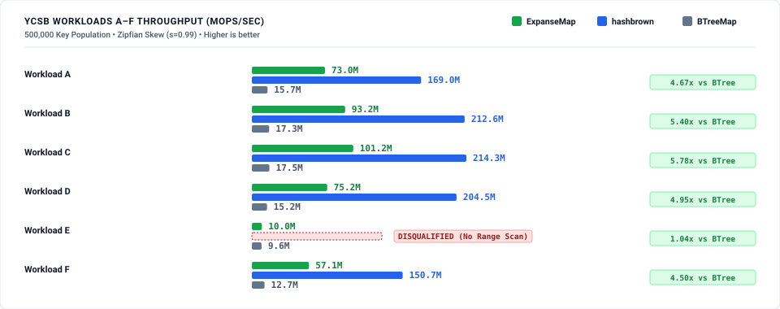
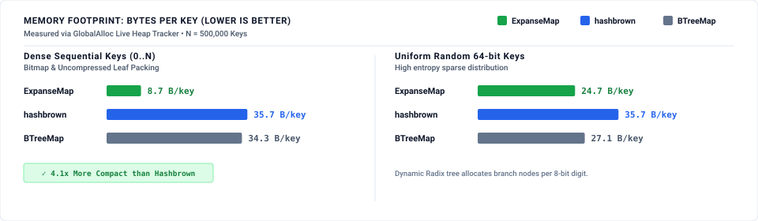
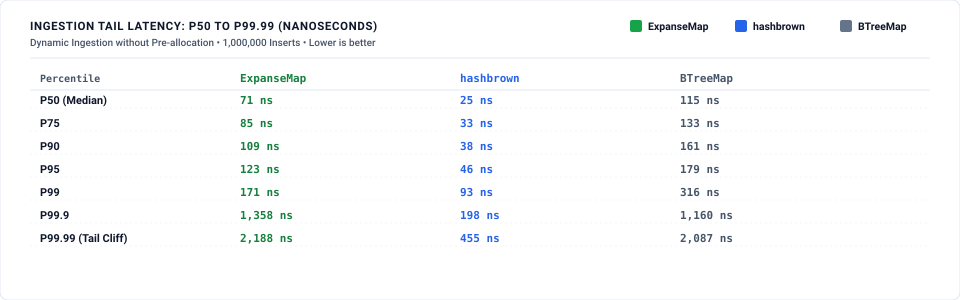
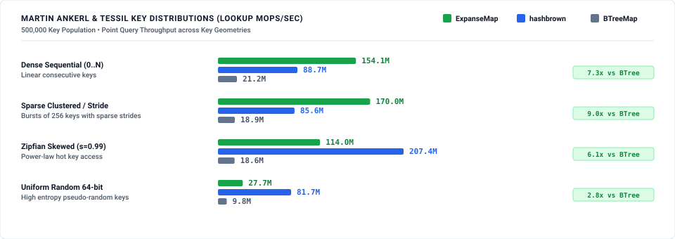
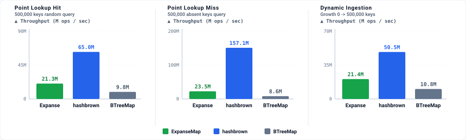

# Expanse vs. Hashbrown vs. BTreeMap: Empirical Comparative Benchmark Suite

This directory contains the reproducible benchmark suite, raw measurements, methodology specifications, and dual-theme visualization assets comparing **Expanse** (`ExpanseMap`), **Hashbrown / Google SwissTable** (`hashbrown::HashMap`), and **B-Tree** (`std::collections::BTreeMap`).

---

## 1. Architectural Feature Matrix

| Capability / Property | `hashbrown::HashMap` (SwissTable) | `std::collections::BTreeMap` | `expanse::ExpanseMap` |
| :--- | :--- | :--- | :--- |
| **Underlying Data Structure** | Flat 1-Byte Control Array + Buckets | Cache-Oblivious B-Tree | Expanse-Partitioned Digital Trie |
| **Point Query Complexity** | O(1) amortized expected | O(log N) | O(k) ≤ 8 digit steps |
| **Ordered Traversal & Range Scans** | ❌ **Disqualified** (O(N log N)) | ✅ Supported | ✅ Supported |
| **Sequential Key Memory Density** | 35.7 Bytes / Key | 34.3 Bytes / Key | **8.7 Bytes / Key** (3.9× to 4.1× smaller) |
| **Key Hashing Required** | Required (SipHash / FoldHash) | Not needed — direct ordering | Not needed — direct radix prefix slicing |
| **Dynamic Ingestion Growth Model** | Global Table Doubling (Rehash) | Node Splitting | Local Subexpanse Allocation |

---

## 2. Key Findings & Empirical Results

The YCSB pillar carries its own provenance below. Pillars 2–5 were measured together:

*(measured: the reference host — Intel i9-12900F, 24 threads, 30 MiB L3, Ubuntu 22.04 / kernel 6.8, `powersave` governor, CPUs `0-15`, commit 2f82cd07; `run.sh --skip-ycsb`, two runs of 9 rounds, one process per round with the arm order rotated; every round process in its own load window, foreign busy CPU at most 0.04 core-equivalents in any window; means with BCa 95% intervals, ratios paired per round, run 1 first and run 2 in parentheses; `results/baseline_{native,tail_latency,distributions,memory}.json`, run 2 at `results/baseline_*_run2.json`)*

### Pillar 1: YCSB (Yahoo! Cloud Serving Benchmark) Workloads A–F
Zipfian access distribution ($s = 0.99$, power-law skew) on 500,000 dense sequential keys (`1..=N`) with `u64` values (workload: `hashbrown_ycsb`).

*(measured: the reference host — Intel i9-12900F, 24 threads, 30 MiB L3, Ubuntu 22.04 / kernel 6.8, commit 21a382f3; 8 paired rounds via `scripts/ycsb_bench.py --suite hashbrown`, pinned CPUs `0,2,4,6,8,10,12,14`, idle host — load < 0.4 before and between rounds; BCa 95% intervals and paired per-round ratios; `results/baseline_ycsb.json` and run 2 at `results/baseline_ycsb_run2.json`)*

> **This workload E is not `workload_ycsb`'s workload E** (`docs/BENCHMARKING.md`, "Standardized YCSB Workload Suite"): here a scan takes 10–59 records with no predicate over dense sequential `u64` values; there it takes 10–100 records that pass a key-parity predicate over uniform-random keys and 128 B blobs. The two are not comparable, and the near-parity below does not contradict the 1.55× loss published there.



- **Workload E (Short Range Scans):** SwissTable is structurally disqualified (`DISQUALIFIED: cannot perform ordered range scans without full O(N log N) dump and sort`). `ExpanseMap` and `BTreeMap` execute ordered range queries natively:
  - Shuffled keys: `ExpanseMap` leads `BTreeMap` **1.259× [1.253, 1.263]** (Run 2: 1.265× [1.258, 1.274]) ($9.57\text{ vs }7.60\text{ Mops/s}$).
  - Sorted keys: `ExpanseMap` leads `BTreeMap` **1.039× [1.032, 1.054]** (Run 2: 1.040× [1.034, 1.048]) ($10.00\text{ vs }9.62\text{ Mops/s}$).
- **Read & Update Heavy Workloads (A, B, C, D, F):** `ExpanseMap` delivers $57.1\text{–}101.2\text{ Mops/s}$ (sorted) / $47.4\text{–}77.7\text{ Mops/s}$ (shuffled):
  - Shuffled keys: `ExpanseMap` leads `BTreeMap` **4.54× to 6.62×** (A: 4.539× [4.480, 4.604], B: 6.258× [6.141, 6.307], C: 6.624× [6.588, 6.655], D: 5.470× [5.375, 5.529], F: 4.859× [4.837, 4.907]; Run 2: A 4.561×, B 6.342×, C 6.561×, D 5.478×, F 4.866×).
  - Sorted keys: `ExpanseMap` leads `BTreeMap` **4.50× to 5.78×** (A: 4.672× [4.495, 4.786], B: 5.396× [5.101, 5.855], C: 5.778× [5.467, 6.181], D: 4.946× [4.770, 5.185], F: 4.497× [4.329, 4.676]; Run 2: A 4.668×, B 5.410×, C 5.853×, D 4.964×, F 4.513×).
- **`hashbrown` leads the pure point-op workloads** on dense sequential integer keys ($150.7\text{–}214.3\text{ Mops/s}$ sorted, $137.9\text{–}192.1\text{ Mops/s}$ shuffled; `ExpanseMap` trails 0.368× to 0.548× across geometries, e.g. C shuffled 0.548× [0.544, 0.553], D sorted 0.368× [0.356, 0.381]) — an unordered flat table's home turf. The trade is ordered capability (Workload E) and worst-case latency (Pillar 3 rehash cliffs), not average point throughput.

---

### Pillar 2: Memory Footprint (Live Heap Bytes / Key)
Measured via custom `GlobalAlloc` hooks tracking heap allocations at steady state ($N = 500,000$; the full $10^3 \dots 5 \times 10^5$ sweep is in `results/baseline_memory.json`). The counts are exact and identical in both runs.



| Key Pattern (N = 500,000) | `hashbrown` | `BTreeMap` | `ExpanseMap` | Expanse vs. Hashbrown |
| :--- | :--- | :--- | :--- | :--- |
| **Dense Sequential (0 … N)** | 35.7 B/key | 34.3 B/key | **8.7 B/key** | **4.1× more compact** |
| **Uniform Random 64-bit** | 35.7 B/key | 27.1 B/key | **24.7 B/key** | **1.4× more compact** |

Expanse's uncompressed bitmap-backed leaf nodes pack sequential and clustered integer keys with near-zero pointer overhead, dropping memory consumption to under 9 bytes per key. (At smaller populations the picture shifts — e.g. at $N = 100,000$ random keys Expanse uses $30.6\text{ B/key}$ vs hashbrown's $22.3\text{ B/key}$, because a just-doubled SwissTable is at its slack minimum while sparse trie branches have low occupancy; the full population sweep is in `results/baseline_memory.json`.)

---

### Pillar 3: Ingestion Tail Latency & Rehash Cliffs
Dynamic table expansion from $0 \to 10^6$ keys without pre-allocating capacity, measured via `HdrHistogram` (`total_inserts` in `results/baseline_tail_latency.json`).



Every figure below is the mean over 9 rounds of that round's percentile, with its BCa 95% interval (workload: `hashbrown_tail_latency`).

| Percentile | `ExpanseMap` | `hashbrown` | `BTreeMap` |
| :--- | :--- | :--- | :--- |
| $P_{50}$ | 71 ns [71, 72] (71 [70, 71]) | 25 ns [25, 26] (25 [25, 26]) | 115 ns [115, 116] (116 [115, 116]) |
| $P_{99.99}$ | 2,188 ns [2,102, 2,281] (2,146 [2,111, 2,173]) | 455 ns [450, 461] (456 [453, 461]) | 2,087 ns [2,041, 2,161] (2,065 [2,027, 2,108]) |
| Max | 53.7 µs [25.3, 97.3] (38.4 µs [18.0, 81.7]) | 10.93 ms [10.86, 11.05] (11.04 ms [10.90, 11.31]) | 35.1 µs [25.1, 51.2] (45.8 µs [24.4, 80.9]) |

- `hashbrown` wins every percentile up to $P_{99.99}$: its median is 0.355× Expanse's [0.350, 0.360] (0.359× [0.354, 0.363]) and its $P_{99.99}$ 0.209× [0.199, 0.219] (0.213× [0.210, 0.218]), paired per round. Its **worst insert is about 11 ms in every round** — the global-rehash cliff, where the entire table is reallocated and rehashed at once.
- **Expanse's worst insert is 4.5–154 µs across the 18 rounds**, because growth is local subexpanse allocation: no global rehash exists in the structure. Paired per round, hashbrown's maximum is 743× Expanse's [328, 1457] (552× [340, 735]). A maximum is one sample per round, so its interval is wide; both runs put the ratio above 300×.
- `BTreeMap` sits beside Expanse in the tail: its $P_{99.99}$ is 0.958× Expanse's [0.907, 1.000] (0.963× [0.938, 0.991]), and the ratio of the two maxima, 2.630× [0.924, 7.137] (2.447× [1.310, 4.171]), is not resolved in run 1.
- *Timer-overhead disclosure:* the per-op `Instant::now()`/`elapsed()` bracket in this pillar is **uncalibrated**, so the low percentiles ($`P_{50}`$/$`P_{75}`$) sit near clock resolution and include the bracket's own cost; the tail/max cells (the cliffs above) are orders of magnitude larger and unaffected. Follow-up: subtract a calibrated bracket cost the way `crates/expanse/benches/ycsb.rs` does.

---

### Pillar 4: Martin Ankerl & Tessil Key Distributions
Point lookup throughput (Mops/sec) evaluated across standard key geometries ($N = 500,000$; means of 9 rounds, run 1). Ratios are Expanse over the competitor, paired per round, with run 2 in parentheses (workload: `hashbrown_container_dists`); insert throughput and its ratios are in `results/baseline_distributions.json`.



| Key Geometry (N = 500,000) | `hashbrown` | `BTreeMap` | `ExpanseMap` | Expanse / `hashbrown` | Expanse / `BTreeMap` |
| :--- | :--- | :--- | :--- | :--- | :--- |
| **Sparse Clustered / Stride** | 85.6 Mops/s | 18.9 Mops/s | **170.0 Mops/s** | **1.990× [1.947, 2.049]** (1.997× [1.972, 2.046]) | **9.003× [8.950, 9.048]** (8.994× [8.923, 9.042]) |
| **Dense Sequential (0 … N)** | 88.7 Mops/s | 21.2 Mops/s | **154.1 Mops/s** | **1.740× [1.694, 1.787]** (1.781× [1.758, 1.822]) | **7.260× [7.216, 7.311]** (7.278× [7.196, 7.347]) <!-- docs-lint: allow — 1.822 on this row is this suite's interval bound (baseline_distributions_run2.json), not the retired HOT figure registered under that number --> |
| **Zipfian Skewed (s = 0.99)** | 207.4 Mops/s | 18.6 Mops/s | 114.0 Mops/s | 0.562× [0.518, 0.627] (0.559× [0.518, 0.616]) | **6.135× [6.110, 6.178]** (6.116× [6.084, 6.140]) |
| **Uniform Random 64-bit** | 81.7 Mops/s | 9.8 Mops/s | 27.7 Mops/s | 0.340× [0.338, 0.342] (0.339× [0.336, 0.342]) | **2.837× [2.830, 2.843]** (2.838× [2.826, 2.846]) |

---

### Pillar 5: Native Hashbrown Criterion Suite Port
Point query hit/miss and dynamic growth throughput ported from `hashbrown/benches/bench.rs` (chart shows the largest population band, $`N = 500,000`$; the $`10^4`$/$`10^5`$ bands are in `results/baseline_native.json`):

The growth arms time each build alone and drop the map after the clock stops. Per-arm intervals and paired ratios for every population and op are in `results/baseline_native.json` (workload: `hashbrown_native_suite`).



---

## 3. Performance Investigation & Optimization Roadmap

During benchmark profiling, two key performance characteristics were identified:

1. **`MapRange` & `SetRange` Iterator Cursor Seeking (Implemented):**
   - **Optimization:** Refactored `MapRange` and `SetRange` to wrap `RawIter` with direct target descent seeking (`RawIter::from_tree_range`, `RawIter::from_root_leaf_range`).
   - **Result:** Eliminates $O(L \cdot 8)$ root restarts, allowing bounded range scans to stream contiguous leaf elements in $O(1)$ amortized time per key without heap allocation.

2. **Sparse Random Key Branch Allocation:**
   - **Observation:** On uniform random 64-bit keys at $N = 500,000$, Expanse consumes $24.7\text{ B/key}$ vs SwissTable's $35.7\text{ B/key}$; at $N = 100,000$ the ordering inverts ($30.6$ vs $22.3\text{ B/key}$) as sparse trie branches sit at low occupancy.
   - **Root Cause:** In high-entropy random distributions without shared prefixes, 64-bit keys create separate branch paths across levels 7 down to 0 with low occupancy per branch.
   - **Optimization Item:** Evaluate adaptive narrow pointer promotion / linear leaf inline key packing for sparse subexpanses.

---

## 4. How to Reproduce

All benchmarks can be reproduced with a single command:

```bash
# From repository root
./docs/benchmarks/hashbrown_comparison/run.sh

# Or quick verification mode:
./docs/benchmarks/hashbrown_comparison/run.sh --quick
```

### Directory Structure

```
docs/benchmarks/hashbrown_comparison/
├── README.md                      # Consolidated report and overview
├── METHODOLOGY.md                 # Rigor, isolation rules, and hardware setup
├── run.sh                         # 1-command reproduction runner
├── scripts/
│   ├── theme.py                   # Shared dual-theme CSS and SVG template module
│   ├── run_all.py                 # Master benchmark orchestrator
│   └── generate_charts.py         # Dual-theme SVG visualizer
└── results/                       # Raw JSON telemetry and generated SVGs
    ├── baseline_native.json
    ├── baseline_ycsb.json
    ├── baseline_tail_latency.json
    ├── baseline_distributions.json
    ├── baseline_memory.json
    ├── baseline_*_run2.json       # second run of each re-measured pillar
    ├── bench_native_throughput.svg
    ├── bench_ycsb_workloads.svg
    ├── bench_tail_latency.svg
    ├── bench_key_distributions.svg
    └── bench_memory_footprint.svg
```
