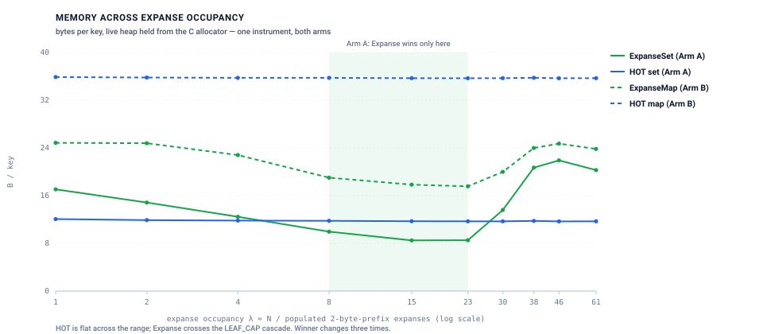
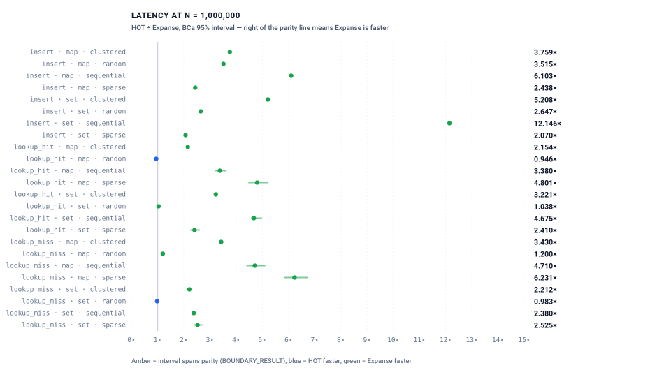
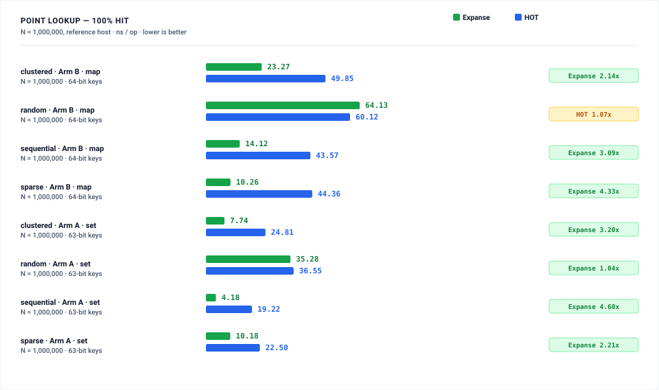
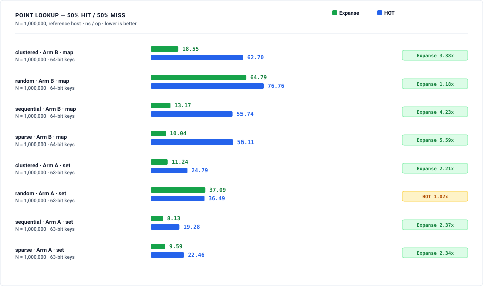
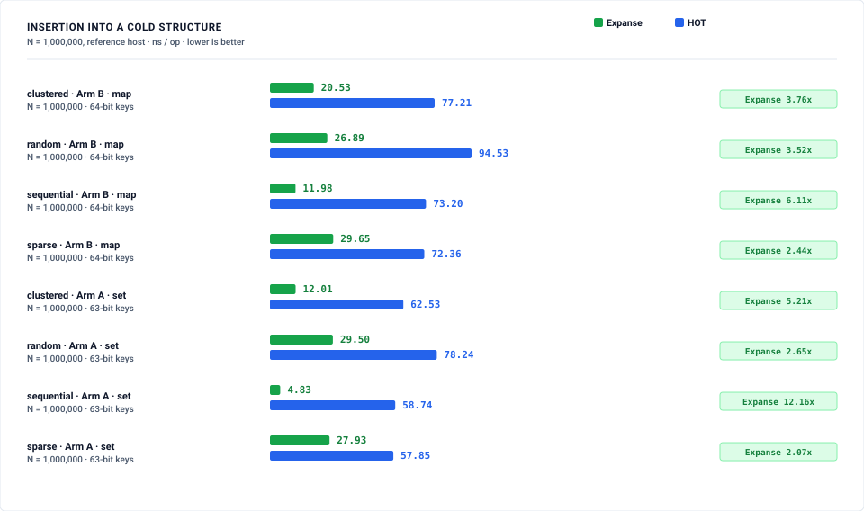
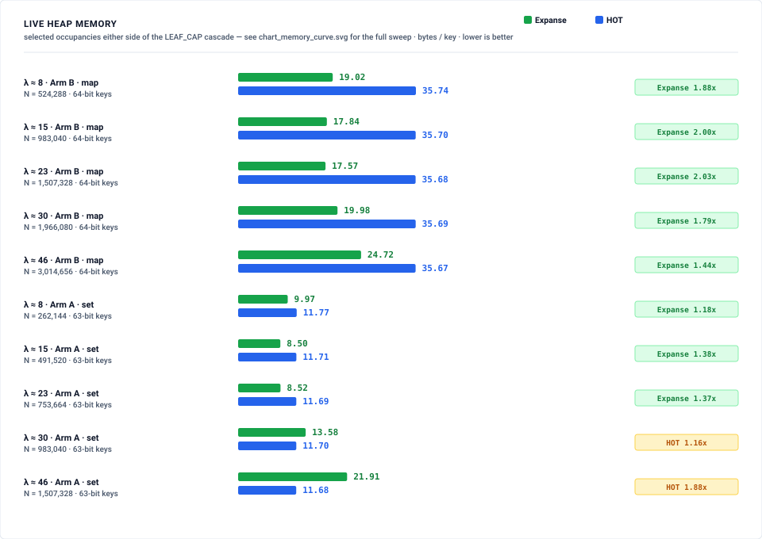
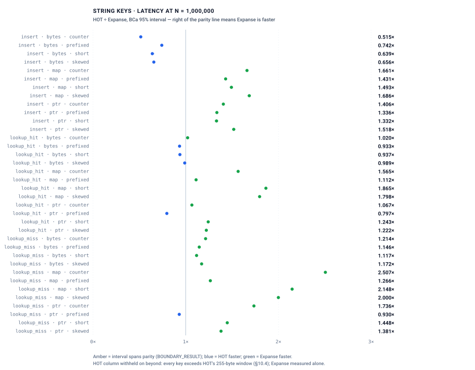
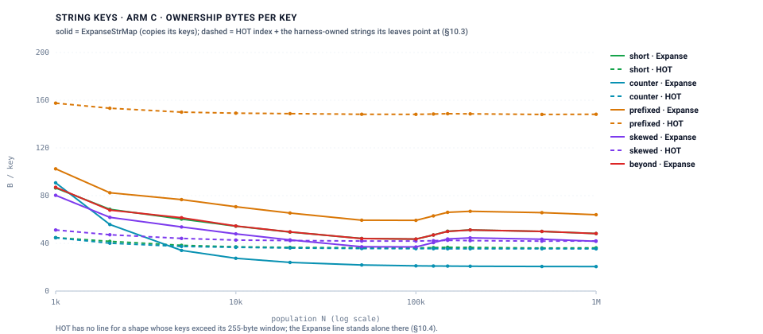
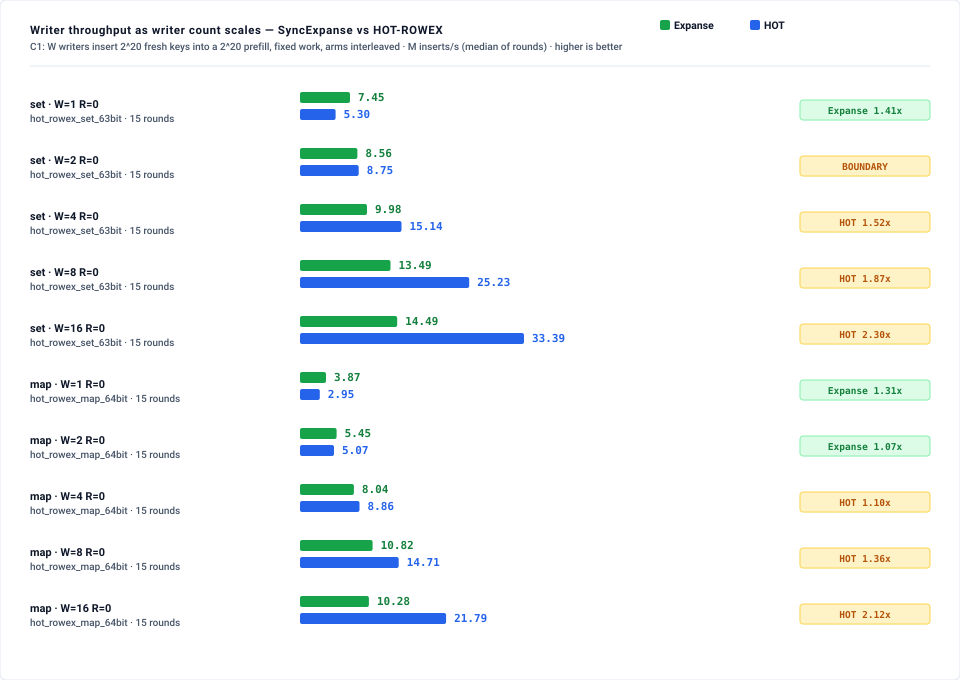
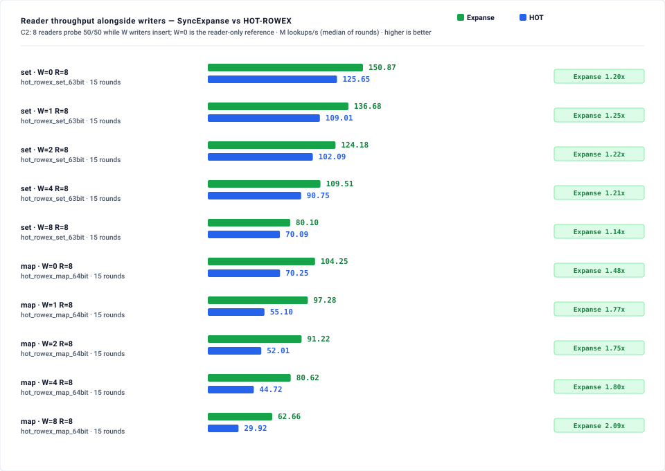

# Expanse vs. HOT (Height Optimized Trie): Empirical Benchmark Suite

Head-to-head evaluation of `ExpanseSet` and `ExpanseMap` — and, for string keys,
`ExpanseStrMap` and `ExpanseBytesMap` (§6) — against **HOT**
([Binna, Zangerle, Pichl, Specht & Leis, SIGMOD 2018](https://dl.acm.org/doi/10.1145/3506692)),
reached through a C++ FFI shim over the reference implementation.

> **Tracking & provenance.** Delivers the HOT arm of
> [#660](https://github.com/orieg/expanse/issues/660); the string-key arms
> (§6) deliver [#693](https://github.com/orieg/expanse/issues/693) and carry
> their own provenance block.
> *(measured: reference host — Intel Core i9-12900F, 8P+8E/24 threads, 30 MiB L3,
> Ubuntu 22.04; HOT [`speedskater/hot`](https://github.com/speedskater/hot) `96bf6fb`,
> ISC; harness commit `134a0471`; `docs/benchmarks/hot_comparison/run.sh`; benchmark
> shell pinned to CPUs 0-15; both arms built for one ISA target —
> `-C target-cpu=haswell` and `-march=haswell -O3 -std=c++17 -DNDEBUG`; load average
> 0.15 / 0.21 / 0.63 across the run; 15 rounds per cell, the arm timed first
> alternating per round (§12.1), median reported, BCa 95% bootstrap ratio intervals
> over 2,000 resamples in `results/`)*.
>
> Pre-registration, locked constraints and every amendment: [`METHODOLOGY.md`](METHODOLOGY.md).
> This is internal work; no external peer review has been performed on any claim here.

---

## 1. The headline: there is no single memory answer

Per-key cost for an expanse-partitioned trie is governed by **expanse occupancy**
`λ = N / (populated 2-byte-prefix expanses)`, not by population, and it is a
sawtooth rather than a curve (`METHODOLOGY.md` §9.4). So this suite publishes
memory as a **curve across λ** and refuses to publish a single cell (§9.6).

The reason is visible in the result. **Arm A's winner changes three times.**



HOT's two lines are flat; Expanse's dip into the shaded band and climb out of it
past the cascade is the whole finding. The shaded region is derived by comparing
the two arms cell by cell, not drawn by eye.


| λ | N | HOT B/key | `ExpanseSet` B/key | winner |
|---:|---:|---:|---:|---|
| 1 | 32,768 | 12.06 | 16.17 | HOT 1.34× |
| 2 | 65,536 | 11.90 | 14.89 | HOT 1.25× |
| 4 | 131,072 | 11.82 | 12.48 | HOT 1.06× |
| 8 | 262,144 | 11.77 | **9.98** | Expanse 1.18× |
| 15 | 491,520 | 11.71 | **8.26** | Expanse 1.42× |
| 23 | 753,664 | 11.69 | **8.11** | Expanse 1.44× |
| 30 | 983,040 | 11.70 | 13.37 | HOT 1.14× |
| 38 | 1,245,184 | 11.77 | 20.70 | HOT 1.76× |
| 46 | 1,507,328 | 11.68 | 21.93 | HOT 1.88× |
| 61 | 1,998,848 | 11.70 | 20.29 | HOT 1.73× |

**Expanse wins only in the band λ ∈ [8, 23].** Outside it, HOT wins — below,
because Expanse has not yet amortized its branch structure; above, because the
`LEAF_CAP = 32` overflow cascade has fired and each key costs its own 16-byte
edge (§9.4).

A single cell would have been true and misleading in either direction: at λ=15
this suite could have published *"Expanse uses 1.42× less memory than HOT"*, and
at λ=46 *"HOT uses 1.88× less memory than Expanse"*. Both are measurements of
the same two systems on the same instrument.

**HOT is flat.** 11.68–12.06 B/key across the entire swept range — a 3% spread
against Expanse's 2.7×. Holding fanout roughly constant by varying discriminative
bits per node is exactly the property its authors claim for it, and on this
instrument it delivers.

### The Expanse curve beyond this table — engine instrument, not the census

The table above is the suite's allocator instrument. The engine's own
deterministic accounting (`mem_used()`, host-independent, no wall clock) covers
a wider λ range and is what locates the teeth; the two instruments are not the
same quantity and are never mixed in one table (§9.3, §9.10.6). Set and map
flavors, uniform random keys, same PRNG and seed *(measured: deterministic
byte accounting; workload: `example_keyspace_density`;
`docs/assets/data/bench_assets.json` → `density_sweep`, commit 86daaddf; full
tables and the node census in `METHODOLOGY.md` §9.10)*:

| λ | cell | `ExpanseSet` B/key | `ExpanseMap<u64,u64>` B/key | where on the curve |
|---:|---|---:|---:|---|
| 15.26 | 1M @64 | 7.92 | 16.70 | the `memory-budget` cell |
| 19.84 | 1.3M @64 | **7.59** | 16.15 | first trough |
| 27.47 | 1.8M @64 | 10.51 | 17.58 | first knee |
| 30.52 | 2M @64 | 13.60 | 19.38 | 35.05% of expanses cascaded (census) |
| 48.83 | 800k @62 | 21.02 | 23.90 | first peak |
| 1,953 | 2M @58 | 8.80 | 18.51 | every level-6 expanse a `BranchU` |
| 4,688 | 1.2M @56 | **6.71** | 15.35 | second trough |
| 7,812 | 2M @56 | 12.98 | 18.74 | second tooth, 34.9% of sub-expanses cascaded |
| 10,547 | 2.7M @56 | 20.98 | 23.76 | second peak |

The curve repeats one byte level down at λ ≈ 256 × `LEAF_CAP`, so the memory
verdict of §1 — Expanse wins in a band and loses outside it — is a verdict
per tooth, not a verdict on "high λ". The census, seed sensitivity, the
`LEAF_CAP = 48` control with its read-path measurement, and the reconciliation
of this suite's 8.27 B/key cell with the 12.62 B/key of §9.3 are in
`METHODOLOGY.md` §9.10.

### Arm B — the value model decides it

| λ | N | HOT B/key | `ExpanseMap` B/key | Expanse advantage |
|---:|---:|---:|---:|---:|
| 1 | 65,536 | 35.88 | 23.87 | 1.50× |
| 8 | 524,288 | 35.74 | 18.99 | 1.88× |
| 23 | 1,507,328 | 35.68 | 16.26 | **2.19×** |
| 46 | 3,014,656 | 35.67 | 24.71 | 1.44× |
| 61 | 3,997,696 | 35.69 | 23.83 | 1.50× |

Expanse wins at every occupancy, and this cell is labelled
**`PASS_categorical_by_design`** rather than a win: HOT reaches its value through
a heap-allocated `std::pair` per entry, ~24 B/key of allocator-visible overhead
before any index structure, while Expanse packs the value into a `ValueSlot`.
That is a property of the value model, not evidence of an architectural
advantage, and §5.2 pre-registered it as such.

---

## 2. Latency at N = 1,000,000

Ratios are HOT ÷ Expanse, so **above 1.000 means Expanse is faster**. Every cell
is gated on the BCa 95% interval, never the point estimate (§8.4); a cell whose
interval spans parity is `BOUNDARY_RESULT` and claims no winner.



Both exceptions sit against the parity line: `lookup_hit · map · random` is the
`BOUNDARY_RESULT` at 0.993 [0.977, 1.009], and `lookup_miss · set · random` is
the one non-scan HOT win at 0.961 [0.954, 0.968].


### Point lookup, 100% hit

| Distribution | Arm | HOT ns | Expanse ns | Ratio | Verdict |
|---|---|---:|---:|---:|---|
| sequential | set | 19.25 | **4.17** | 4.651 | Expanse |
| clustered | set | 24.86 | **7.64** | 3.251 | Expanse |
| sparse | set | 21.86 | **9.83** | 2.431 | Expanse |
| random | set | 36.44 | **35.98** | 1.010 | Expanse |
| sequential | map | 43.56 | **13.84** | 3.453 | Expanse |
| clustered | map | 49.81 | **22.94** | 2.200 | Expanse |
| sparse | map | 44.14 | **10.20** | 4.872 | Expanse |
| **random** | **map** | 59.80 | 61.20 | **0.993** | **`BOUNDARY_RESULT`** |

### Point lookup, 50% hit / 50% rejection-sampled miss

| Distribution | Arm | HOT ns | Expanse ns | Ratio | Verdict |
|---|---|---:|---:|---:|---|
| sequential | set | 18.95 | **8.05** | 2.382 | Expanse |
| clustered | set | 24.07 | **11.06** | 2.189 | Expanse |
| sparse | set | 21.03 | **7.72** | 2.807 | Expanse |
| **random** | **set** | **35.83** | 37.27 | **0.961** | **HOT** |
| sequential | map | 53.14 | **10.92** | 5.277 | Expanse |
| clustered | map | 59.90 | **16.40** | 3.680 | Expanse |
| sparse | map | 53.66 | **8.27** | 6.888 | Expanse |
| random | map | 73.55 | **60.21** | 1.235 | Expanse |

**The pre-registered uniform-random loss is confirmed on Arm A only on the miss
path, and refuted on Arm B.** §5.1 registered HOT winning uniform-random point
lookup at medium-high confidence, reasoning that random keys discriminate late
and force a deep descent at a fixed 8-bit span while HOT's variable bit selection
bounds height. On the set arm the miss path is a HOT win (0.961 [0.954, 0.968])
and the hit path is a narrow Expanse win (1.010 [1.001, 1.018]) — the registered
direction holds on one of the two. On the map arm it did not hold at all: the hit
cell claims no winner (0.993 [0.977, 1.009]) and the miss cell goes to Expanse
(1.235 [1.218, 1.253]), because HOT's pointer chase to its heap pair costs more
than the descent it saves.

These four cells are the ones §12.1's arm alternation moved most. At `5232af74`,
with HOT timed first in every round and Expanse inheriting its warmed cache, the
map hit cell read 1.399 and the set hit cell 0.998; alternating the arm timed
first puts them at 0.993 and 1.010. The direction of the map hit cell reversed
and it now claims no winner, which is the largest single consequence of the
harness change *(measured: reference host, `5232af74` → `134a0471`)*.

### Insertion into a cold structure

| Distribution | Arm | HOT ns | Expanse ns | Ratio |
|---|---|---:|---:|---:|
| sequential | set | 58.63 | **4.83** | 12.133 |
| clustered | set | 62.54 | **13.16** | 4.745 |
| sparse | set | 57.79 | **29.41** | 1.959 |
| random | set | 78.23 | **30.78** | 2.541 |
| sequential | map | 73.27 | **12.89** | 5.688 |
| clustered | map | 77.34 | **21.22** | 3.642 |
| sparse | map | 72.29 | **30.62** | 2.361 |
| random | map | 95.16 | **27.01** | 3.522 |

Expanse wins every insertion cell, 1.96×–12.13×. §5.2 registered this as a *weak*
prediction; it landed stronger than registered. Every one of these is a
**sorted-order** cell — the shared generator hands both arms a sorted population
— and §4.1 publishes what the same cells do on a shuffled permutation.

---

### Per-pillar charts

Badges are driven by the cell's **verdict**, not by which bar is shorter: a cell
whose BCa interval spans parity carries a neutral `BOUNDARY` badge and claims no
winner (§8.4).

**Point lookup, 100% hit**



**Point lookup, 50% hit / 50% miss**



**Insertion into a cold structure**



**Live heap memory, selected occupancies**



Read that one against the curve above, not on its own — it samples five
occupancies either side of the cascade, and which side a cell lands on decides
its winner.

---

## 3. Ordered scan is a systematic loss, wider than predicted

**28 of this suite's 29 HOT wins are scan cells.** §5.1 registered HOT winning
short range scans at k=10 and k=100, carried forward from the loss
`art_comparison/` found unpredicted. The measurement is broader than that on two
axes, and both are recorded as **`UNPREDICTED LOSS`**:

- **k=1000 loses too**, which was not registered — `set`/`random`/100k is
  0.530 [0.528, 0.532], and `map`/`random`/100k is 0.407 [0.404, 0.410].
- **`sparse` loses as well as `random`**, also not registered.

| Arm | Dist | N | k=10 | k=100 | k=1000 |
|---|---|---:|---:|---:|---:|
| set | random | 10,000 | 0.526 | 0.428 | 0.423 |
| set | random | 100,000 | 0.752 | 0.551 | 0.530 |
| set | random | 1,000,000 | 0.839 | 0.744 | 0.731 |
| map | random | 10,000 | 0.659 | 0.500 | 0.462 |
| map | random | 100,000 | 0.760 | 0.467 | 0.407 |
| map | random | 1,000,000 | **1.803** | **1.725** | **1.619** |

The `map`/`random`/1M row is the exception and it reverses cleanly: Expanse wins
every scan width there, and by more than it did at `5232af74` (1.803 / 1.725 /
1.619 against 1.414 / 1.402 / 1.517). Scan outcome therefore depends on population as well as
on `k`, which is a second reason this suite does not publish single-population
cells.


Scan on `sequential` and `clustered` is an Expanse win throughout and does not
appear in the loss list.

---

## 4. Scorecard

144 latency cells, 20 memory cells.

| | Count |
|---|---:|
| Expanse wins (CI excludes parity) | 109 |
| HOT wins (CI excludes parity) | 29 |
| `BOUNDARY_RESULT` (interval spans parity) | 6 |

Against the pre-registration:

| Registered | Outcome |
|---|---|
| HOT wins uniform-random point lookup (§5.1, medium-high) | **CONFIRMED** on Arm A's miss path only (0.961); **REFUTED** on Arm A's hit path (1.010) and on Arm B (hit `BOUNDARY_RESULT` 0.993, miss 1.235) |
| HOT wins short range scans k=10, k=100 (§5.1, medium-high) | **CONFIRMED**, and wider — see §3 |
| HOT wins sparse-stride memory (§5.1, downgraded to low in §9.5) | **CONFIRMED** as part of the λ story: HOT wins above the cascade |
| Expanse wins Arm B memory (§5.2, high) | **CONFIRMED**, labelled `PASS_categorical_by_design` |
| Expanse wins insertion (§5.2, weak) | **CONFIRMED**, stronger than registered |
| Expanse wins sequential and sparse point lookup (§5.2, medium) | **CONFIRMED** |
| Scan losing at k=1000 and on `sparse` | **UNPREDICTED LOSS** |
| Arm A memory winner flipping three times across λ | **not pre-registered** |

### 4.1 The insert verdicts above are sorted-order verdicts (§12.2)

The shared generator sorts the population before handing it to either arm, and
every cell in §2, §3 and §6 is built in that order. That is not a neutral
choice, and it moves Expanse as well as HOT. The pair below runs the same
population in both orders at N = 10⁶ and is published with **no verdict against
the §5 or §10.7 pre-registrations** — those rows were locked on sorted order,
and reconciling them against a different workload in place is what §8.7 forbids.

**Integer arms, `random`, N = 1,000,000**

| Arm | Order | HOT alloc B/key | Expanse alloc B/key | Expanse `mem_used` B/key | `lookup_hit` HOT ÷ Expanse | `insert` HOT ÷ Expanse |
|---|---|---:|---:|---:|---:|---:|
| set | `sorted` | 11.70 | 13.95 | **13.60** | 1.010 [0.999, 1.021] | 2.532 [2.521, 2.542] |
| set | `shuffled` | 12.06 | 20.33 | **13.60** | 1.008 [0.998, 1.019] | 1.933 [1.913, 1.943] |
| map | `sorted` | 35.71 | 16.67 | **16.70** | 0.991 [0.978, 1.004] | 3.527 [3.510, 3.550] |
| map | `shuffled` | 36.22 | 23.62 | **16.70** | 1.071 [1.052, 1.105] | 2.854 [2.830, 2.879] |

**String arms, `short`, N = 1,000,000**

| Arm | Order | HOT index B/key | Expanse index B/key | Expanse `mem_used` B/key | `lookup_hit` HOT ÷ Expanse | `insert` HOT ÷ Expanse |
|---|---|---:|---:|---:|---:|---:|
| ptr | `sorted` | 12.23 | 69.16 | **50.77** | 1.173 [1.169, 1.177] | 1.168 [1.154, 1.182] |
| ptr | `shuffled` | 12.72 | 71.99 | **50.77** | 1.169 [1.165, 1.173] | 1.106 [1.102, 1.110] |
| map | `sorted` | 36.29 | 69.16 | **50.77** | 1.771 [1.766, 1.776] | 1.318 [1.300, 1.332] |
| map | `shuffled` | 36.83 | 71.97 | **50.77** | 1.772 [1.768, 1.777] | 1.536 [1.530, 1.540] |

- **`mem_used` is identical in both orders on every arm** — 16.70 B/key
  for the integer map, 50.77 for the string arms — while the allocator census moves on
  both arms. A digital trie's shape is fixed by the key set, not by the sequence
  the keys arrived in; the allocator's is not. That is the invariant
  `crates/expanse/tests/test_mem_used_order_invariant.rs` pins, and it is what
  makes the two columns readable side by side: the difference between them is
  attributable to the allocator, not to the trie.
- **Expanse's own insert cost roughly doubles on a shuffled population** —
  27.01 → 64.46 ns on the integer map — and its allocator footprint
  moves 16.67 → 23.62 B/key. The `masstree_comparison` sensitivity set
  measured `ExpanseMap` at 16.67 → 23.63 B/key on the same shape and population
  *(measured: reference host, `2ce92b7f`)*; this suite's own instrument reads
  16.67 → 23.62, an independent replication of that figure in another suite.
- **HOT moves too**, so the insert ratio narrows rather than reverses:
  3.527 → 2.854 on the integer map. Expanse still wins every insert cell in
  both orders here, unlike the Masstree arm, whose insert ratio flips from 0.760
  to 1.883 across the same pair.
- **`lookup_hit` barely moves**, as expected: the order affects the build, not
  the probe stream, which is shuffled in both cases.
- The mechanism is **unmeasured**. Nothing here attributes the shuffled-order
  cost to page faults, allocator span reuse or node-shape churn; #725's counter
  plan and #737's wrapper are what would.


---

## 5. What this suite does not claim

Stated before the numbers existed (§7) and unchanged by them:

1. **Single-threaded only.** No concurrency claim follows from this suite; HOT's
   ROWEX variant is separate scope.
2. **Integer keys in §1–§4.** Arm A is restricted to a 63-bit domain because
   HOT's inline value payload is 63 bits wide (§9.4), and is labelled
   `hot_set_63bit` throughout. String keys are §6, under their own ceiling
   (§10.9): claims attach to HOT's C-string configuration only, never to keys
   longer than 255 bytes, and an `ExpanseBytesMap` cell is a hash-indexed
   structure against a trie, not a trie comparison.
1. **§1–§4 are single-threaded.** No concurrency claim follows from them. The
   concurrent arm is §6, measured against HOT's ROWEX variant, and it carries
   its own, narrower ceiling (`METHODOLOGY.md` §11.6).
2. **Integer keys.** Arm A is restricted to a 63-bit domain because HOT's inline
   value payload is 63 bits wide (§9.4), and is labelled `hot_set_63bit`
   throughout. No string-key claim.
3. **x86-64 with AVX2 and BMI2 only.** HOT does not build on aarch64.
4. **One HOT implementation at one commit** — `speedskater/hot` `96bf6fb` built as
   documented, not "HOT" as a design, and not the SIGMOD paper's figures, which
   were measured on different hardware with a different harness.
5. **No cross-suite ratio.** A HOT-vs-Expanse ratio here is never set beside an
   ART-vs-Expanse ratio from `art_comparison/` (§8.12).
6. **The memory instrument is bytes held from the C allocator**, not the engine's
   `mem_used()`, because it is the only definition both arms satisfy. The two are
   not the same quantity and the gap is not a constant factor (§9.3) — and on
   the Expanse side it depends on **insertion order**: `hot_memory_curve` sorts
   and deduplicates its keys before inserting, so its Expanse cells carry a
   1.03× gap where a generator-order build of the same keys carries 1.59×
   (§9.10, workload: `hot_instrument_bridge`). Every allocator-instrument cell
   in this suite is a sorted-order cell; the repo's `bytes/key` table is
   generator-order and `mem_used()`, and neither is a re-measurement of the other.

---

## 6. String keys (#693): `ExpanseStrMap` and `ExpanseBytesMap` against HOT's C-string configuration

> *(measured: reference host — Intel Core i9-12900F, 8P+8E/24 threads, 30 MiB L3,
> Ubuntu 22.04 / kernel 6.8; HOT `96bf6fb`; harness commit `134a0471`;
> `docs/benchmarks/hot_comparison/run.sh strings`; benchmark shell pinned to CPUs
> 0-15; both arms `-C target-cpu=haswell` / `-march=haswell -O3 -std=c++17
> -DNDEBUG`; load average 0.63 / 0.66 / 0.78 / 1.00 at start, after the gate,
> after the memory sweep and at the end; 15 rounds per cell, the arm timed first
> alternating per round (§12.1), median reported,
> BCa 95% bootstrap ratio intervals over 2,000 resamples;
> `results/baseline_string_latency.json`, `results/baseline_string_memory.json`;
> gate transcript `results/string_validate.log`)*. Pre-registration:
> [`METHODOLOGY.md` §10](METHODOLOGY.md#10-string-key-arms-693-pre-registration).
> Tables in this section are the output of `scripts/string_tables.py` over those
> two files. Internal work; no external peer review.

Three pairings (§10.2): **Arm C** `hot_str_ptr` — HOT's shipped string
configuration, `HOTSingleThreaded<const char*, IdentityKeyExtractor>`, against
`ExpanseStrMap` storing the same key pointer as its value; **Arm D**
`hot_str_map` — HOT through a heap `std::pair<const char*, uint64_t>` against
`ExpanseStrMap` string → `u64`; **Arm E** `hot_bytes_ptr` — the same HOT
configuration against the **unordered, hash-indexed** `ExpanseBytesMap`, which is
not a trie comparison and has no scan pillar. Five key shapes (§10.5): `short`
(8–16 random alphanumerics), `counter` (`k` + 11 digits), `prefixed` (96 shared
bytes + 24 random), `skewed` (Pareto lengths, 4–192), `beyond` (256 shared bytes
+ 16 random, 272 bytes). The strings are the harness's, one heap allocation
each; the census counts them on neither side (§10.3).

### 6.1 The losses first

**Ordered scan is a loss in every cell, and it is the largest loss in this
suite.** All 72 scan cells with a HOT column go to HOT; HOT ÷ Expanse runs from
0.375 [0.373, 0.377] (`short`, Arm D, k=10, N=1M) down to 0.017 [0.017, 0.017]
(`prefixed`, Arm C, k=1000, N=100k). That is the pre-registered high-confidence
loss (§10.7) and it is a statement about the **shipped navigation surface**, not
the trie: `ExpanseStrMap` exposes `next_at_or_after` / `next_after`, each a
fresh root descent returning a heap-allocated key, against HOT's `lower_bound`
plus an incremental iterator (§10.6). A cursor iterator for `ExpanseStrMap` is an
engine change outside this suite and is the obvious follow-up.

| Arm | Shape | N | k=10 | k=100 | k=1000 |
|---|---|---:|---:|---:|---:|
| C · ptr | `counter` | 1,000,000 | 0.297 [0.295, 0.300] | 0.059 [0.057, 0.061] | 0.033 [0.033, 0.034] |
| C · ptr | `prefixed` | 1,000,000 | 0.203 [0.201, 0.205] | 0.041 [0.039, 0.042] | 0.021 [0.020, 0.021] |
| C · ptr | `short` | 1,000,000 | 0.293 [0.290, 0.296] | 0.069 [0.067, 0.072] | 0.037 [0.036, 0.038] |
| C · ptr | `skewed` | 1,000,000 | 0.272 [0.269, 0.275] | 0.060 [0.058, 0.062] | 0.032 [0.031, 0.033] |
| D · map | `counter` | 1,000,000 | 0.358 [0.356, 0.360] | 0.074 [0.073, 0.075] | 0.038 [0.037, 0.038] |
| D · map | `prefixed` | 1,000,000 | 0.218 [0.216, 0.223] | 0.051 [0.050, 0.052] | 0.025 [0.024, 0.025] |
| D · map | `short` | 1,000,000 | 0.375 [0.373, 0.377] | 0.100 [0.098, 0.101] | 0.050 [0.049, 0.051] |
| D · map | `skewed` | 1,000,000 | 0.337 [0.335, 0.340] | 0.086 [0.085, 0.087] | 0.043 [0.042, 0.044] |
| C, D | `beyond` | any | Expanse 273–326 ns/element; HOT column withheld (§10.4) | | |

The 10k and 100k rows are in `results/baseline_string_latency.json`; none is
above 0.21.

**Memory ownership on short and skewed keys goes to HOT, and the
pre-registration had it the other way.** §10.7 registered, at low-medium
confidence, that Expanse would win the `ownership` column on `short` and
`counter`. On `counter` it does; on `short` it does not, by a wide margin, and
`skewed` goes to HOT as well *(workload: `hot_str_ptr`)*:

| Shape (Arm C, N = 1M) | external (exact) | HOT index | Expanse index | **HOT ownership** | **Expanse ownership** | Expanse `mem_used` |
|---|---:|---:|---:|---:|---:|---:|
| `short` | 24.00 (13.00) | 12.23 | 69.16 | **36.23** | 69.16 | 50.77 |
| `skewed` | 29.76 (15.27) | 12.22 | 47.65 | **41.98** | 47.65 | 41.19 |
| `counter` | 24.00 (13.00) | 11.42 | 20.53 | 35.42 | **20.53** | 19.56 |
| `prefixed` | 136.00 (121.00) | 12.23 | 71.83 | 148.23 | **71.83** | 62.77 |
| `beyond` | 280.00 (273.00) | withheld | 71.84 | withheld | 71.84 | 54.78 |

`ExpanseStrMap` holds a 13-byte key in about 69 bytes: the gate's allocation
counts say why — 204,791 allocations for 100,000 `short` keys against HOT's
4,566 (`results/string_validate.log`). Every key that is not resolved inside a
terminal 8-byte chunk costs a `StrSuffix` shell plus a separate byte buffer, two
allocations, and the allocator's rounding on each; the engine's own `mem_used`
(50.77 B/key) undercounts that rounding by a further 18 B/key (§9.3 reason 1,
now on the string path). This is **`REFUTED`** against §10.7 and it is a finding
about `ExpanseStrMap`'s leaf representation, not about HOT.

**The `index` column goes to HOT on every shape, categorically.** HOT holds
11.4–12.2 B/key of index on every representable shape at N = 1M because it
stores an 8-byte pointer plus node bits and nothing else; Expanse holds the key
bytes. Registered in §10.3 as **`PASS_categorical_by_design` in HOT's favour**
and labelled so: the contest is the `ownership` column above, where HOT's
external string table is added back.

**`prefixed` point lookup on Arm C is HOT's, as registered.** 100% hit
0.765 [0.763, 0.767]; 50/50 0.896 [0.893, 0.899] (N = 1M). This is the regime
HOT is designed for — 96 shared bytes that its discriminative-bit selection
skips and `ExpanseStrMap` descends one chunk at a time — and it is the one
place in the string suite where the pre-registered loss on HOT's home ground
landed as predicted. At N = 100,000 the 50/50 cell is 1.000 [0.963, 1.041].

**`ExpanseBytesMap` (Arm E) loses insertion everywhere and most 100%-hit
lookups, and its index is the heaviest thing measured here.** Insert:
0.519 [0.517, 0.520] on `counter`, 0.640 [0.636, 0.645] on `short`,
0.655 [0.651, 0.658] on `skewed`, 0.740 [0.733, 0.742] on `prefixed` (N = 1M).
100% hit: HOT on `prefixed` 0.937 [0.934, 0.941], `short` 0.925 [0.923, 0.928],
`skewed` 0.991 [0.989, 0.994]; Expanse only on `counter` 1.027 [1.023, 1.030].
Its index costs 96.6–102.1 B/key on 12–15-byte keys and 192.7 B/key on
`prefixed` — a hash-trie entry, a boxed collision bucket, the bucket's vector,
and a boxed copy of the key. None of this was pre-registered (§10.7 declined to
predict Arm E); it is reported as `not pre-registered` and it is the largest
per-entry footprint in either HOT suite. Arm E does win every 50/50 cell at
N = 1M (1.105–1.174).

**`UNPREDICTED LOSS`: `counter` 100%-hit lookup on Arm C at small N.** §10.7
registered `counter` lookup as a high-confidence Expanse win. It is one at
N = 1M (1.068 [1.064, 1.072]) and a HOT win at N = 10,000
(0.832 [0.826, 0.842]) and N = 100,000 (0.870 [0.853, 0.882]). The
prediction was stated without a population and was wrong below a million keys.

### 6.2 Where the pre-registration was refuted in Expanse's favour

These are reported with the same prominence as the losses (§6 taxonomy). At
N = 1M, HOT ÷ Expanse:

| Cell | Registered (§10.7) | Measured | Label |
|---|---|---:|---|
| `skewed` 100% hit, Arm C | HOT wins (low) | 1.169 [1.165, 1.173] | **`REFUTED`** |
| `skewed` 100% hit, Arm D | HOT wins (low) | 1.741 [1.737, 1.746] | **`REFUTED`** |
| `skewed` 50/50, Arm C | HOT wins (low) | 1.370 [1.364, 1.375] | **`REFUTED`** |
| `skewed` 50/50, Arm D | HOT wins (low) | 1.969 [1.962, 1.976] | **`REFUTED`** |
| `prefixed` 100% hit, Arm D | HOT wins (medium-high) | 1.072 [1.070, 1.075] | **`REFUTED`** |
| `prefixed` 50/50, Arm D | HOT wins (medium-high) | 1.244 [1.241, 1.248] | **`REFUTED`** |
| `prefixed` insert, Arm C | HOT wins (medium) | 1.210 [1.207, 1.213] | **`REFUTED`** |
| `prefixed` insert, Arm D | HOT wins (medium) | 1.298 [1.293, 1.303] | **`REFUTED`** |

The `skewed` row is the one §10.7 flagged as "registered because the issue
expects it; the mechanism reading does not support it". The mechanism reading
was right and the registration was wrong, in every population and on both
`ExpanseStrMap` arms. On `prefixed`, the loss that held on Arm C reverses on
Arm D exactly as the integer arms' uniform-random loss did (§2): HOT's
per-entry heap pair costs more than the descent it saves.

### 6.3 Confirmed wins, and the rest

`counter` at N = 1M is Expanse's on both `ExpanseStrMap` arms: 100% hit
1.068 [1.064, 1.072] (C) and 1.559 [1.552, 1.565] (D); insert
1.430 [1.427, 1.434] (C) and 1.689 [1.683, 1.696] (D) — **`CONFIRMED`**, with
the small-N caveat of §6.1. `short` 100% hit on Arm C is 1.170 [1.167, 1.175],
**`CONFIRMED`**. Arm D's memory is `PASS_categorical_by_design` for Expanse on
every representable shape (HOT ownership 59.4–172.2 B/key against Expanse
20.5–71.8), as §10.7 registered. The cells §10.7 declined to predict — 50/50
lookups on `short` and `skewed`, insertion on `short` and `skewed`, and all of
Arm E — are `not pre-registered`; at N = 1M the `ExpanseStrMap` ones are
Expanse's (1.21–2.81), the Arm E ones split as described above.



### 6.4 Memory across the population sweep



| N | `counter` HOT / Expanse | `short` HOT / Expanse | `skewed` HOT / Expanse | `prefixed` HOT / Expanse | `beyond` — / Expanse |
|---:|---:|---:|---:|---:|---:|
| 1,000 | 44.7 / 91.1 | 44.8 / 106.9 | 51.2 / 84.8 | 157.5 / 109.5 | — / 109.8 |
| 10,000 | 36.6 / 27.5 | 37.0 / 75.6 | 42.7 / 53.9 | 149.1 / 78.7 | — / 78.4 |
| 100,000 | 35.5 / 21.1 | 36.1 / 64.0 | 41.9 / 42.5 | 148.1 / 66.6 | — / 66.6 |
| 125,000 | 35.5 / 21.0 | 36.4 / 68.0 | 42.2 / 46.6 | 148.4 / 70.8 | — / 70.7 |
| 150,000 | 35.5 / 20.9 | 36.7 / 71.2 | 42.5 / 49.7 | 148.7 / 73.9 | — / 73.8 |
| 200,000 | 35.5 / 20.8 | 36.5 / 71.8 | 42.3 / 50.3 | 148.5 / 74.5 | — / 74.5 |
| 1,000,000 | 35.4 / 20.5 | 36.2 / 69.2 | 42.0 / 47.7 | 148.2 / 71.8 | — / 71.8 |

Arm C ownership, B/key; the 2k, 5k, 20k and 500k rows are in
`results/baseline_string_memory.json`. **HOT is flat again** — 35.4–36.7 B/key
on every 12–15-byte shape from 10k to 1M, the string analogue of the integer
arms' 11.68–12.06 — and `counter` is the only shape where Expanse's line drops
under it.

**The registered chunk-occupancy hypothesis is consistent with the sweep and
not confirmed by it.** §10.5 predicted a `LEAF_CAP` cascade in the
discriminating chunk map near N ≈ 1.23 × 10⁵ for the random-alphanumeric
shapes and none for `counter`. Between 100k and 150k the Expanse line rises
on exactly those shapes — `short` 64.0 → 68.0 → 71.2, `prefixed`
66.6 → 70.8 → 73.9, `skewed` 42.5 → 46.6 → 49.7 — and `counter` does not
move (21.1 → 21.0 → 20.9). The step is about +11%, not the 2.7× swing of the
integer arm, because stored key bytes dominate the per-key cost. The
single-variable test that would confirm the mechanism — changing the alphabet
width and watching the step move — was not run, so the rows stay on a
population axis and the re-expression against `λ_chunk` §10.5 conditionally
promised is **not** made. Hypothesis, partially supported.

### 6.5 The 255-byte window: a capability finding about HOT

HOT discriminates C-string keys on their first 255 bytes (`MAX_STRING_KEY_LENGTH`,
measured at the boundary: 254- and 255-byte keys differing in their last byte
are two entries, 256- and 300-byte keys are one; §10.10). On `beyond`, whose
272-byte keys share a 256-byte prefix, HOT's `insert` reported 1 of 1,000 keys
new, the trie walked 1, and `lookup` found 1 — no false positive, because HOT
confirms every leaf with a full `strcmp`, but **silent population loss under a
build that reports success**, the same class as the integer arms' §3.1. Every
`beyond` cell therefore publishes the Expanse figure alone with the HOT column
withheld (45 latency cells, 36 memory cells), never a HOT number over a smaller
population. The Expanse side is unrestricted: `ExpanseStrMap` holds all 10⁶
272-byte keys at 71.84 B/key and `ExpanseBytesMap` at 352.24 B/key *(workload:
`hot_string_memory`)*; their 100%-hit lookups at N = 1M take 363.90 ns and
327.71 ns respectively *(workload: `hot_string_latency`)*.

### 6.6 Scorecard

225 latency cells, 180 memory cells. Latency cells with a HOT column: 180.

| | Count |
|---|---:|
| HOT wins (CI excludes parity) | 97 — of which 72 are scan cells |
| Expanse wins (CI excludes parity) | 75 — none is a scan cell |
| `BOUNDARY_RESULT` | 8 |
| HOT column withheld (`beyond`, §10.4) | 45 |

Against §10.7:

| Registered | Outcome |
|---|---|
| HOT wins ordered scan, every k, every shape (high) | **CONFIRMED**, 72 of 72 |
| HOT wins `prefixed` point lookup (medium-high) | **CONFIRMED** on Arm C; **REFUTED** on Arm D |
| HOT wins `prefixed` insert (medium) | **REFUTED** on both arms |
| HOT wins the `index` memory column on long and skewed keys (high, categorical) | **CONFIRMED**, `PASS_categorical_by_design` in HOT's favour, on every shape |
| HOT wins `skewed` point lookup (low) | **REFUTED** on both arms, at every population |
| Expanse wins `counter` lookup and insert (high) | **CONFIRMED** at N = 1M; **UNPREDICTED LOSS** on 100%-hit lookup at 10k and 100k |
| Expanse wins `short` 100%-hit lookup, Arm C (medium) | **CONFIRMED** |
| Expanse wins `ownership` memory on `counter` and `short` (low-medium) | **CONFIRMED** on `counter`; **REFUTED** on `short` |
| Expanse wins Arm D memory (high, categorical) | **CONFIRMED**, `PASS_categorical_by_design` |
| `λ_chunk` cascade near N ≈ 1.23 × 10⁵ (hypothesis) | consistent, not confirmed — §6.4 |
## 7. The concurrent arm: the write-concurrency loss, measured

Delivers [#692](https://github.com/orieg/expanse/issues/692): HOT's **ROWEX**
variant (concurrent insert and lookup, no deletion) against `SyncExpanseSet`
and `SyncExpanseMap`. Pre-registration, locked constraint decisions and the
expected-losses matrix are `METHODOLOGY.md` §11; nothing there was edited after
measurement.

> *(measured: reference host — Intel Core i9-12900F, 8P+8E/24 threads, 30 MiB L3,
> Ubuntu 22.04, kernel 6.8; HOT `96bf6fb` with its pinned TBB 2018 `4c73c3b`,
> built from the nested submodule, no system TBB; commit `5232af74`;
> `docs/benchmarks/hot_comparison/run.sh --only-concurrent`; benchmark shell
> pinned to CPUs 0–15 and every row records `Cpus_allowed_list 0-15`;
> writers + readers ≤ 16; both arms `-C target-cpu=haswell` / `-march=haswell`,
> both on glibc 2.35 `malloc`; load average 0.25 at start, 7.62 after — the
> sweep's own threads; 15 rounds per cell, arms interleaved per round, medians
> reported, BCa 95% bootstrap ratio intervals over 2,000 resamples;
> `results/baseline_concurrent.json`; workloads `hot_rowex_set_63bit`,
> `hot_rowex_map_64bit`)*.
>
> Both arms are measured **below any external lock**, through their native
> concurrent APIs (§8.16; `METHODOLOGY.md` §11.3 decision 4). Expanse's protocol
> is optimistic lock coupling — one writer mutex, validated readers — and is
> blocking by design (`AGENTS.md` §2.2). Ratios are **Expanse ÷ ROWEX
> throughput**, so, as everywhere in this suite, **above 1.000 means Expanse is
> faster.**

### 7.1 Writer throughput as writer count scales — the pre-registered loss, confirmed and wider than registered

W writers each insert their slice of 2²⁰ fresh keys into a 2²⁰ prefill; fixed
work, so both arms grow by exactly the same population every round.



| W | set: ROWEX M/s | set: Expanse M/s | ratio [BCa 95%] | verdict | map: ROWEX M/s | map: Expanse M/s | ratio [BCa 95%] | verdict |
|--:|---:|---:|---|---|---:|---:|---|---|
| 1 | 5.55 | **8.64** | 1.558 [1.545, 1.575] | Expanse | 2.96 | **5.22** | 1.742 [1.687, 1.786] | Expanse |
| 2 | **9.06** | 5.72 | 0.629 [0.610, 0.644] | **ROWEX** | **4.92** | 3.81 | 0.772 [0.752, 0.790] | **ROWEX** |
| 4 | **15.82** | 4.23 | 0.271 [0.267, 0.277] | **ROWEX** | **8.65** | 3.05 | 0.353 [0.345, 0.360] | **ROWEX** |
| 8 | **26.24** | 3.71 | 0.144 [0.142, 0.148] | **ROWEX** | **13.90** | 2.59 | 0.185 [0.177, 0.191] | **ROWEX** |
| 16 | **34.26** | 2.97 | 0.088 [0.086, 0.092] | **ROWEX** · *not pre-registered (SMT)* | **20.21** | 2.64 | 0.128 [0.124, 0.132] | **ROWEX** · *not pre-registered (SMT)* |

- **Expanse wins with one writer** — 1.56× (set) and 1.74× (map) —
  **`CONFIRMED`** (§11.5.2, medium-high). The concurrent wrappers keep the
  single-threaded insertion win of §2, at a smaller margin than the 2.52× /
  3.55× measured without a wrapper *(different workload: `hot_latency` builds a
  cold structure, this arm inserts into a 2²⁰ prefill — not comparable)*.
- **The crossover is at W = 2**, inside the registered W\* ∈ [2, 4] —
  **`CONFIRMED`** (§11.5.1, medium). ROWEX already wins at two writers on both
  arms, with intervals clear of parity.
- **At W ≥ 4 ROWEX wins by 3.7×–11.6×** — **`CONFIRMED`** (§11.5.1, high) and
  wider than the registration argued for. Expanse's *aggregate* writer
  throughput does not merely plateau at its single-writer rate: it **falls** as
  writers are added — set 8.64 → 5.72 → 4.23 → 3.71 → 2.97 M inserts/s
  (0.34× of one writer at sixteen), map 5.22 → 3.81 → 3.05 → 2.59 → 2.64
  (0.51×). ROWEX scales 4.7× on both arms at W = 8 and 6.2× / 6.8× at W = 16,
  where the sixteen threads occupy both SMT siblings of every P-core.

Every insert on the Expanse side takes the same writer mutex, so the aggregate
is bounded by the single-writer rate by construction; that it falls *below*
that rate is the measured part. Which share of the fall is lock hand-off and
which is the writers' cache-line traffic is **unmeasured** here — this arm
carries no hardware counters (§8.9) — and no mechanism beyond the serialization
itself is claimed.

### 7.2 Readers alongside writers

Eight readers probe a 50/50 stream against the prefill while W writers insert;
W = 0 is the reader-only reference. **The reader window is the writers' fixed
work**, so the two arms' windows differ in length by the writer ratio and the
population grows at different rates inside them — a reader column is not a
fixed-duration measurement on both arms, and W = 0 is the only row where the
two windows are the same length.



| W | set: ROWEX M/s | set: Expanse M/s | ratio [BCa 95%] | verdict | map: ROWEX M/s | map: Expanse M/s | ratio [BCa 95%] | verdict |
|--:|---:|---:|---|---|---:|---:|---|---|
| 0 | 128.21 | **150.23** | 1.175 [1.151, 1.239] | Expanse | 72.88 | **126.58** | 1.716 [1.670, 1.739] | Expanse |
| 1 | **110.56** | 15.35 | 0.136 [0.122, 0.140] | **ROWEX** | **57.31** | 25.86 | 0.387 [0.331, 0.435] | **ROWEX** |
| 2 | **104.10** | 27.64 | 0.263 [0.257, 0.268] | **ROWEX** | **53.21** | 23.77 | 0.444 [0.429, 0.458] | **ROWEX** |
| 4 | **92.57** | 24.90 | 0.266 [0.257, 0.273] | **ROWEX** | **45.56** | 23.65 | 0.519 [0.507, 0.534] | **ROWEX** |
| 8 | **71.81** | 22.74 | 0.317 [0.313, 0.324] | **ROWEX** | **31.24** | 22.34 | 0.713 [0.688, 0.727] | **ROWEX** |

- **Reader-only (W = 0):** Expanse wins on both arms. The map row is
  **`CONFIRMED`** (§11.5.2, medium). The set row was registered as
  `BOUNDARY_RESULT` and landed as an Expanse win with the interval clear of
  parity — recorded as a registered no-winner that resolved in Expanse's
  favour, not as a confirmed prediction.
- **Readers under any writer load: ROWEX wins every cell** — **`CONFIRMED`**
  (§11.5.1, medium-high), and the size at W = 1 is the finding. **One writer
  takes Expanse's eight readers from 150.2 to 15.4 M lookups/s on the set arm
  (0.10× of their reader-only rate) while ROWEX's readers keep 110.6 (0.86×)**;
  on the map arm 126.6 → 25.9 (0.20×) against 72.9 → 57.3 (0.79×). Expanse's
  reader throughput then stays roughly flat as writers are added (15 → 28 → 25
  → 23 set; 26 → 24 → 24 → 22 map) while ROWEX's declines as its writers take
  more of the machine, which is why the ratio narrows toward W = 8 without
  Expanse recovering. **The mechanism of the collapse is unmeasured.** The
  restart share cannot account for an eight-fold drop — it is 5–7% at every
  writer count (§7.3) — and `sample_spins` ÷ `read_ops`, one to two waits per
  lookup there, is the only counter this suite takes that speaks to it. No
  hardware counter was taken on either arm, so nothing here attributes the fall
  to a cache-line transfer, a futex or a bracket wait (§8.9 principle 1);
  #737's shared `perf stat` wrapper is what would take one.
- **Writers with readers present** *(not registered as a separate row;
  reported)*: the Expanse single writer drops from 8.64 to 2.29 M inserts/s
  (set) and 5.22 to 1.82 (map) when eight readers are probing; ROWEX's from
  5.55 to 3.42 and 2.96 to 2.12. Writer ratios in these cells run 0.659
  [0.618, 0.681] at W = 1 down to 0.092 [0.090, 0.095] at W = 8 (set) and
  0.835 [0.775, 0.920] down to 0.128 [0.123, 0.132] (map) — ROWEX wins every
  one, including W = 1, where it lost without readers.

### 7.3 Protocol health — event ratios from the diagnostic build

The 64-bit protocol has no `Busy` outcome; its counterpart to the 32-bit Busy
rate is the **restart share** (walk attempts that observed a moved version and
restarted) and the **fallback share** (reads that exhausted 64 restarts and took
the writer mutex), read from the engine's `occ_stats` counters on a **separate
`occ-stats` build** of the same cells, Expanse side only (§11.3, decision 5).
Nothing in this table is a timing. 5 rounds per cell; median with range.

| Arm | W | R | restart share, median [min, max] | fallback share | `sample_spins` ÷ `read_ops` (ratio of medians) | §11.5.3 |
|---|--:|--:|---|---|---:|---|
| set | 1 | 8 | 5.77% [5.67%, 5.82%] | 0 | 1.80 | rise with W: **`REFUTED`**; fallback 0 — `PASS_categorical_by_design` (needs 64 consecutive failed walks) |
| set | 2 | 8 | 5.45% [3.86%, 5.51%] | 0 | 1.67 | rise with W: **`REFUTED`**; fallback 0 — `PASS_categorical_by_design` (needs 64 consecutive failed walks) |
| set | 4 | 8 | 5.73% [5.20%, 6.24%] | 0 | 1.85 | rise with W: **`REFUTED`**; fallback 0 — `PASS_categorical_by_design` (needs 64 consecutive failed walks) |
| set | 8 | 8 | 7.21% [7.04%, 7.27%] | 0 | 1.82 | rise with W: **`REFUTED`**; fallback 0 — `PASS_categorical_by_design` (needs 64 consecutive failed walks) |
| map | 1 | 8 | 6.41% [6.31%, 6.53%] | 0 | 2.16 | rise with W: **`REFUTED`**; fallback 0 — `PASS_categorical_by_design` (needs 64 consecutive failed walks) |
| map | 2 | 8 | 6.53% [5.46%, 9.65%] | 0 | 1.95 | rise with W: **`REFUTED`**; fallback 0 — `PASS_categorical_by_design` (needs 64 consecutive failed walks) |
| map | 4 | 8 | 5.52% [4.92%, 5.92%] | 0 | 1.89 | rise with W: **`REFUTED`**; fallback 0 — `PASS_categorical_by_design` (needs 64 consecutive failed walks) |
| map | 8 | 8 | 5.33% [5.23%, 5.50%] | 0 | 1.92 | rise with W: **`REFUTED`**; fallback 0 — `PASS_categorical_by_design` (needs 64 consecutive failed walks) |

- **No reader ever took the writer mutex**: `read_fallbacks` is zero in every
  round of every cell, so the §11.5.3 starvation falsifier (fallback share
  ≥ 1%) did not fire — **`PASS_categorical_by_design`**, not `CONFIRMED`. A
  fallback needs **64 consecutive failed optimistic walks**, and at the bracket
  lengths a single writer holds, the probability of 64 in a row is negligible by
  construction. The zero is a property of the construction, not a measured
  property of the protocol: the falsifier could not have fired at these writer
  counts whatever the engine did, and a falsifier that cannot fire is not a
  measurement (AGENTS.md §8, C-b). METHODOLOGY §11.8 registers one that can.
- **The restart share does not rise monotonically with W** — set 5.77 → 5.45
  → 5.73 → 7.21%, map 6.41 → 6.53 → 5.52 → 5.33% — so that half of the
  §11.5.3 hypothesis is **`REFUTED`**. It sits between 5% and 7% at every
  writer count measured.
- The counters account for restarts and for spin iterations in
  `SeqVersion::sample` (1.7–2.2 per read op); they do not time a spin. The size
  of the §7.2 reader collapse is therefore **not attributed** by this table —
  the cause beyond the bracket wait itself is unmeasured.

### 7.4 Memory — build-only, single writer, curve across λ

Bytes held from the C allocator after a single-writer build (§11.3, decision 1),
ROWEX against the `Sync*` wrapper, swept across the §9.6 occupancy targets.
Deterministic byte counts, no interval. The census was re-validated with TBB
linked (control allocation returns to zero; every ROWEX cell counted at least
2N allocations on the map arm and N on the set arm — see `rowex_allocs` in the
artifact). **Disclosed blind spot:** `libtbb.so`'s own per-thread state is
allocated through the dynamic linker and is invisible to the link-time
interposition; it is paid once per registering thread and is independent of N.

| λ | set: ROWEX B/key | set: `SyncExpanseSet` B/key | winner | map: ROWEX B/key | map: `SyncExpanseMap` B/key | winner |
|--:|---:|---:|---|---:|---:|---|
| 1 | **12.91** | 14.14 | ROWEX 1.09× | 36.71 | **24.28** | Expanse 1.51× |
| 2 | **12.40** | 13.26 | ROWEX 1.07× | 36.31 | **24.70** | Expanse 1.47× |
| 4 | **12.00** | 12.12 | ROWEX 1.01× | 36.21 | **22.96** | Expanse 1.58× |
| 8 | 11.88 | **9.85** | Expanse 1.21× | 36.16 | **19.36** | Expanse 1.87× |
| 15 | 11.76 | **8.10** | Expanse 1.45× | 36.07 | **16.80** | Expanse 2.15× |
| 23 | 11.73 | **8.12** | Expanse 1.44× | 36.09 | **16.36** | Expanse 2.21× |
| 30 | **11.73** | 14.04 | ROWEX 1.20× | 36.05 | **20.35** | Expanse 1.77× |
| 38 | **11.80** | 21.96 | ROWEX 1.86× | 36.15 | **25.92** | Expanse 1.40× |
| 46 | **11.71** | 23.09 | ROWEX 1.97× | 36.09 | **26.78** | Expanse 1.35× |
| 61 | **11.72** | 21.06 | ROWEX 1.80× | 36.05 | **25.62** | Expanse 1.41× |

- **Set arm:** the §1 story repeats with the concurrent types — ROWEX is flat
  (11.71–12.91 B/key), Expanse wins only in the band λ ∈ [8, 23] and loses on
  both sides of it. Both §11.5 memory rows for the set arm are **`CONFIRMED`**.
- **Map arm:** Expanse wins at every occupancy, 1.35×–2.21× —
  **`CONFIRMED`** and labelled **`PASS_categorical_by_design`**: ROWEX carries
  the same heap `std::pair` per entry as the single-threaded map arm.
- The `SyncExpanseSet` cells differ from §1's `ExpanseSet` cells at the same
  λ in both directions (14.14 against 16.18 at λ = 1; 21.06 against 20.29 at
  λ = 61). The two are different types under the same instrument and the cause
  of the gap is unmeasured; they are not set side by side as one quantity.

### 7.5 Scorecard against the pre-registration

20 throughput cells (10 writer, 10 reader, plus 8 writer-under-reader
sub-cells), 8 health cells, 20 memory cells.

| Registered (`METHODOLOGY.md` §11.5) | Outcome |
|---|---|
| ROWEX wins writer throughput at W ≥ 4 (high) | **CONFIRMED**, 3.7×–11.6× |
| Crossover writer count W\* ∈ [2, 4] (medium) | **CONFIRMED**, W\* = 2 on both arms |
| ROWEX wins reader throughput under W ≥ 1 (medium-high) | **CONFIRMED**, every cell; 7.3× at W = 1 on the set arm |
| Expanse wins writer throughput at W = 1 (medium-high) | **CONFIRMED**, 1.56× / 1.74× |
| Expanse wins reader-only, map arm (medium) | **CONFIRMED**, 1.72× |
| Reader-only, set arm: `BOUNDARY_RESULT` (low-medium) | registered no-winner; **measured Expanse win** 1.175 [1.151, 1.239] |
| Memory, map arm, all λ (high) | **CONFIRMED**, `PASS_categorical_by_design` |
| Memory, set arm: Expanse wins λ ∈ [8, 23], ROWEX outside (medium) | **CONFIRMED** on both sides |
| Health: fallback share < 1% at all W (falsifier) | **`PASS_categorical_by_design`** — zero fallbacks; a fallback needs 64 consecutive failed walks, which cannot occur at these bracket lengths (§7.3) |
| Health: restart share rises monotonically with W | **REFUTED** — 5–7% at every W, not monotonic |
| W = 16 cells | `not pre-registered`; reported: 0.088 (set), 0.128 (map) |
| Writers with readers present | `not pre-registered`; reported: ROWEX wins every cell |

No `UNPREDICTED LOSS`: every cell Expanse lost was registered as a loss.

What this arm does not claim is fixed in `METHODOLOGY.md` §11.6: x86-64 at these
two commits under glibc `malloc` only (no tcmalloc claim); insert and point
lookup on uniform random integer keys only — no deletion, contended-key, scan or
string claim; at most 16 threads on 8 physical performance cores with SMT; and no
peer review.

### 7.6 Between-run spread: the C2 cells are a direction and a range, not a level (#735)

This arm has now been run twice on the reference host, at engine commits
`5232af74` and `134a0471`, both under the P-core pin with a load average of 1.06
or below at the concurrent start. The C2 reader cells are published side by side
because four of the ten do not overlap their own BCa 95% intervals between the
runs, while **every direction and every verdict held**.

| Arm | W | R | run 1 `5232af74` | run 2 `134a0471` | intervals overlap |
|---|--:|--:|---|---|---|
| set | 0 | 8 | 1.175 [1.151, 1.239] | 1.184 [1.179, 1.191] | yes |
| set | 1 | 8 | 0.136 [0.122, 0.140] | 0.137 [0.136, 0.140] | yes |
| set | 2 | 8 | 0.263 [0.257, 0.268] | 0.238 [0.230, 0.255] | **no** |
| set | 4 | 8 | 0.266 [0.257, 0.273] | 0.260 [0.247, 0.272] | yes |
| set | 8 | 8 | 0.317 [0.313, 0.324] | 0.319 [0.312, 0.324] | yes |
| map | 0 | 8 | 1.716 [1.670, 1.739] | 1.705 [1.658, 1.727] | yes |
| map | 1 | 8 | 0.387 [0.331, 0.435] | 0.277 [0.258, 0.291] | **no** |
| map | 2 | 8 | 0.445 [0.428, 0.458] | 0.479 [0.454, 0.511] | yes |
| map | 4 | 8 | 0.519 [0.507, 0.534] | 0.474 [0.457, 0.491] | **no** |
| map | 8 | 8 | 0.713 [0.688, 0.727] | 0.659 [0.633, 0.674] | **no** |

**4 of the 10 C2 reader cells moved past their own intervals** — set W = 2 from 0.263 [0.257, 0.268] to 0.238 [0.230, 0.255]; map W = 1 from 0.387 [0.331, 0.435] to 0.277 [0.258, 0.291]; map W = 4 from 0.519 [0.507, 0.534] to 0.474 [0.457, 0.491]; map W = 8 from 0.713 [0.688, 0.727] to 0.659 [0.633, 0.674]
— and so did 5 of the 10 C1 writer cells. For these cells the between-run
spread exceeds the within-run interval, so **a single run's level is not a
settled figure**: every citation of a C2 cell outside this suite states a
direction and a range. The `masstree_comparison` arm found the same thing on its
own two runs (README §7, "Between-run spread"), which is why
`docs/BENCHMARKING.md` now carries the replication rule rather than leaving each
arm to rediscover it: two runs for a concurrent cell, the claim ceiling is the
union of the two intervals, and a cell whose runs do not overlap is reported as
direction-only.

Two things this comparison is **not**. It is not a §8.4 paired claim: the two
runs are at different engine commits, so host variation and whatever changed in
the engine between `5232af74` and `134a0471` are confounded, and nothing here
separates them. And the cause is **unmeasured** — whether the spread is the host
or the engine is #568's counter plan (`perf c2c`, `xsnp_hitm`, futex counts) and
#737's wrapper, not this table.

The levels quoted in §7.2 are run 1's, unchanged; run 2's are in
`results/baseline_concurrent_run2.json` with its own provenance.

---

## 8. Reproducing

Requires an x86-64 host with AVX2 and BMI2.

```bash
git submodule update --init --depth 1 third_party/hot
docs/benchmarks/hot_comparison/run.sh                    # integer arms, full sweep -> results/
docs/benchmarks/hot_comparison/run.sh --quick            # reduced, -> gitignored results/quick/
docs/benchmarks/hot_comparison/run.sh strings            # string arms (#693) -> results/baseline_string_*.json
docs/benchmarks/hot_comparison/run.sh strings --quick    # reduced, -> gitignored results/quick/
python3 docs/benchmarks/hot_comparison/scripts/generate_charts.py   # every chart, from results/
python3 docs/benchmarks/hot_comparison/scripts/string_tables.py     # the §6 tables, from results/
docs/benchmarks/hot_comparison/run.sh            # full sweep -> results/
docs/benchmarks/hot_comparison/run.sh --quick    # reduced, -> gitignored results/quick/

# The concurrent arm (#692, METHODOLOGY.md §11) additionally needs HOT's
# nested TBB submodule; libtbb is built from it into the cargo build dir.
git -C third_party/hot submodule update --init --depth 1 third-party/tbb
docs/benchmarks/hot_comparison/run.sh --only-concurrent          # -> results/baseline_concurrent.json
docs/benchmarks/hot_comparison/run.sh --only-concurrent --quick  # -> results/quick/
```

The runner takes the host-wide benchmark lock, pins to performance cores, drives
every cell in its own process — HOT's node pool is a process-global `static` and
a warm pool undercounts by up to 3.3× (§9.2) — and snapshots load average at
start, between pillars and at the end. The string runner additionally executes
`hot_string_validate` first and records nothing if it fails (§10.8).
