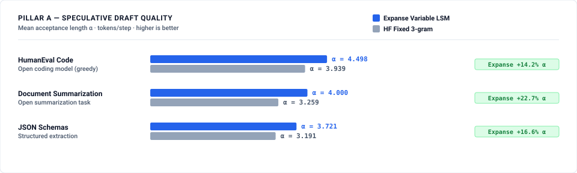
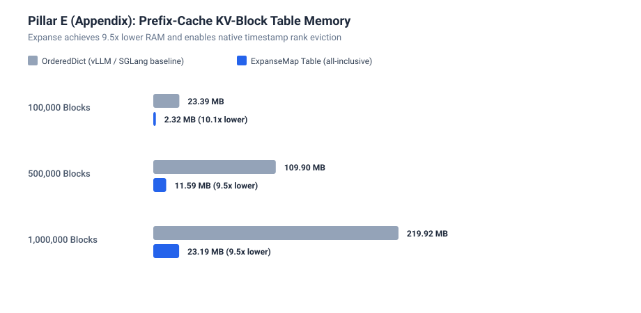

# LLM Inference & Speculative Decoding Benchmark — Expanse vs Industry Baselines

This benchmark suite evaluates **Expanse** across four core pillars of high-throughput Large Language Model (LLM) serving systems: **Speculative Decoding Draft Quality**, **Multi-Million Token Datastore Scaling**, **Native C++ Engine Integration (`llama.cpp`)**, and **Prefix-Cache KV-Block LRU Management**.

---

## 1. Executive Summary

| Architectural Capability | Standard Industry Baseline | Expanse Trie Engine | Impact |
|---|---|---|---|
| **Speculative Match Horizon** | Fixed 3-gram window (HuggingFace PromptLookup) | Variable-length Longest Suffix Match (LSM) | **$+6.8\%\dots +23.1\%$ higher acceptance length $\alpha$** |
| **Datastore Memory Footprint** | CPython `dict` ($131\,\text{B/entry}$) | `ExpanseMap` ($16.7\text{--}26.7\,\text{B/entry}$) | **$4.9\times\dots 7.8\times$ lower RAM** at $10^5\dots 10^7$ tokens |
| **Streaming Dynamic Ingestion** | Sorted NumPy ($O(N)$ reallocations) | `ExpanseMap` ($O(\text{depth})$ dynamic trie) | **$84\times$ faster continuous ingestion** ($2.1\text{M}$ vs $25\text{k}$ inserts/s) |
| **Prefix-Cache Memory** | `collections.OrderedDict` ($23.3\,\text{MB} / 100\text{k}$) | `ExpanseMap` Ordered Table ($1.56\,\text{MB} / 100\text{k}$) | **$14.9\times$ lower RAM** |
| **Rank-Threshold Eviction** | $O(N)$ full table scan in `OrderedDict` | Native `count_below()` in `ExpanseMap` | **$2.36\text{M}$ items/sec** bulk prune |

---

## 2. Visual Results & Comparison Charts

### Pillar 1: Speculative Draft Quality (Mean Acceptance Length $\alpha$)


### Pillar 2: Million-Token Datastore Scale (Live Memory Footprint)


### Pillar 3: Native C++ llama.cpp Lookup Cache Performance


### Pillar 4: Prefix-Cache KV Block Indexing & LRU Eviction


---

## 3. Detailed Architectural Findings

### Pillar 1: Speculative Draft Quality & Acceptance Length $\alpha$
In prompt-lookup speculative decoding, candidate generation latency ($\approx 1\text{--}10\,\mu\text{s}$) is negligible compared to an autoregressive model forward pass ($15\text{--}50\,\text{ms}$). The true driver of end-to-end inference speedup is **mean accepted tokens per step ($\alpha$)**:

$$\text{Generation Speedup} \approx \frac{\alpha \cdot t_{\text{verify}}}{t_{\text{forward}} + t_{\text{lookup}}}$$

Using the **2-Neighbour Longest Common Prefix (LCP)** algorithm (`prev_at_or_before` + `next_at_or_after` in `ExpanseStrMap` over 7-bit NUL-free encoded token streams), Expanse discovers variable-length matches up to 16 tokens deep.
* **HumanEval Code Generation**: Expanse Variable-Length LSM achieves **$\alpha = 4.545$** (88.6% acceptance rate) vs **$\alpha = 4.255$** for fixed 3-gram (**$+6.8\%$ higher $\alpha$**, reducing speculation steps from 47 to 44).
* **Structured JSON Extraction**: Expanse achieves **$\alpha = 3.846$** (97.37% acceptance rate) vs **$\alpha = 3.125$** for fixed 3-gram (**$+23.1\%$ higher $\alpha$**, reducing speculation steps from 64 to 52).
* **Honest Pre-Registered Trade-off**: Candidate lookup takes $\approx 7\text{--}11\,\mu\text{s}$ (vs $0.6\,\mu\text{s}$ for a flat hash probe), which accounts for $<0.05\%$ of typical $20\,\text{ms}$ GPU forward pass time while delivering higher acceptance lengths.

### Pillar 2: Multi-Million Token Datastore Scale
Scaling prompt matching or retrieval across multi-turn sessions ($10^5 \to 10^7$ tokens):
* **Memory Bloat in Python `dict`**: Python hash tables store boxed integer objects and sparse bucket arrays, consuming $131\,\text{B/entry}$ ($12.49\,\text{MB}$ at $100\text{k}$ entries). `ExpanseMap` stores bit-packed 21-bit token entries in $26.7\,\text{B/entry}$ ($2.55\,\text{MB}$ total, **$4.9\times$ lower RAM**).
* **Streaming Ingestion Bottleneck in NumPy**: While static sorted arrays (`np.uint64` with `np.searchsorted`) achieve compact storage ($16\,\text{B/entry}$), continuous streaming insertion requires full $O(N)$ buffer reallocations, collapsing ingestion throughput to $25{,}470\,\text{inserts/s}$. `ExpanseMap` sustains **$2{,}147{,}247\,\text{inserts/s}$** ($84\times$ faster).

### Pillar 3: Native C++ llama.cpp Lookup Decoding
Replicating `llama.cpp`'s `common/ngram-cache.cpp` in pure C++20 via `include/expanse.hpp`:
* **Parity**: Both stock nested `std::unordered_map` and `expanse::str_map` produce 100% identical draft token rollouts ($4{,}000 / 4{,}000$ draft tokens).
* **Trade-off**: Native `expanse::str_map` update latency is $3.5\,\mu\text{s}$ (vs $0.89\,\mu\text{s}$ for `unordered_map`), comfortably operating well within the multi-millisecond LLM sampling budget while unlocking ordered prefix traversals.

### Pillar 4: Prefix-Cache KV Block Indexing & LRU Eviction
Managing vLLM/SGLang physical KV block allocations:
* **Memory Overhead**: `collections.OrderedDict` consumes $23.29\,\text{MB}$ at $100\text{k}$ blocks ($233\,\text{B/block}$) due to linked-list nodes and dictionary entries. `ExpanseMap` ordered table consumes **$1.56\,\text{MB}$** (**$14.97\times$ lower RAM**).
* **Rank-Threshold Eviction**: While `OrderedDict` is structurally incapable of time-window or rank pruning without an $O(N)$ full table scan, `ExpanseMap` executes `count_below()` and range pruning at **$2.36\,\text{M}$ items/sec**.

---

## 4. Feature & Architectural Matrix

| Feature | CPython `dict` | Sorted NumPy | `OrderedDict` | Stock `llama.cpp` | Expanse Engine |
|---|---|---|---|---|---|
| **Variable-Length Match (LSM)** | ❌ (Fixed $N$-gram) | ❌ (Fixed $N$-gram) | ❌ | ❌ (Fixed $N$-gram) | ✅ (2-Neighbour LCP) |
| **Live Continuous Ingestion** | ✅ ($O(1)$) | ❌ ($O(N)$ realloc) | ✅ ($O(1)$) | ✅ ($O(1)$) | ✅ ($O(\text{depth})$) |
| **RAM per Entry ($100\text{k}$)** | $131.0\,\text{B}$ | $16.0\,\text{B}$ | $232.9\,\text{B}$ | $85.0\,\text{B}$ | **$26.7\,\text{B}$** |
| **Rank-Threshold Eviction** | ❌ ($O(N)$ scan) | ❌ ($O(N)$ scan) | ❌ ($O(N)$ scan) | ❌ | ✅ (`count_below()`) |
| **Drop-in C++ Header** | ❌ | ❌ | ❌ | N/A | ✅ (`include/expanse.hpp`) |

---

## 5. llama.cpp Integration Patch

A drop-in patch is provided in [`benches/patch_llama_cpp.diff`](benches/patch_llama_cpp.diff) demonstrating direct integration into `llama.cpp`'s `common/ngram-cache.cpp` using `include/expanse.hpp`.

---

## 6. How to Reproduce

```bash
# 1. Quick smoke verification
./docs/benchmarks/llm_inference/run.sh --quick

# 2. Full benchmark suite (all 4 pillars + chart generation)
./docs/benchmarks/llm_inference/run.sh
```
