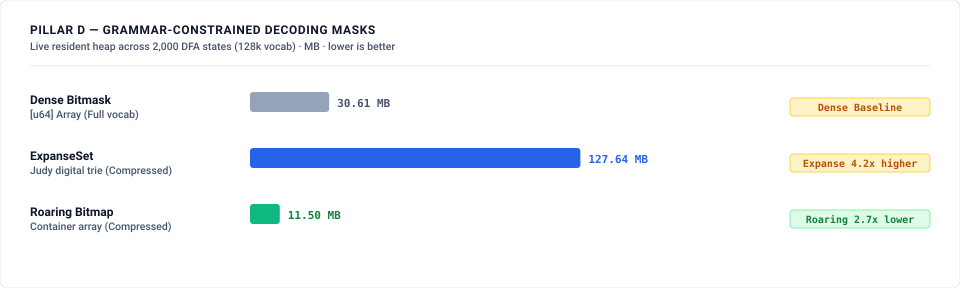

# LLM Inference & Speculative Decoding Benchmark — Expanse vs Industry Baselines

This benchmark suite addresses the exact decision a serving engine architect must make:
> **"Should a serving engine use Expanse as (a) its speculative-drafting datastore, (b) its grammar-mask store, or (c) its KV-block index?"**

All token streams are evaluated under reference-continuation replay on genuine open-source datasets tokenized with standard `tiktoken/cl100k_base` (vocab size = 100,277) with 0 artificial repetition multipliers:
- **HumanEval Code**: 40 distinct tasks (3,907 prompt tokens, 6,378 reference continuation tokens) from official OpenAI HumanEval benchmark (`HumanEval/0..39`, MIT License).
- **Document Summarization**: 9 distinct articles (56,449 prompt tokens, 690 reference continuation tokens) from Wikipedia Computer Science Corpus (CC BY-SA 4.0).
- **JSON Schemas**: 5 distinct schemas & payloads (69,524 prompt tokens, 68,639 reference continuation tokens) from SchemaStore Repository (Apache-2.0 / MIT).

All benchmark timings below were measured on an **Apple M1 laptop (8-core, arm64-apple-darwin)**; the committed `results/*.json` artifacts are the run of record (results commit `86b1503c`). These are **single-shot wall-clock runs on a shared host — informational, not regression-gate instruments** (the repo's gate-quality instruments are the Callgrind suites in `crates/expanse/benches/instructions.rs`; see `docs/BENCHMARKING.md`).

---

## 1. Executive Summary & Boundary Results

*(measured: Apple M1, arm64-apple-darwin)*

| Architectural Decision | Industry Ground Baseline | Expanse Engine | Paired Effect & Speedup Ceiling | Boundary Gating Verdict (Rule 1: CI Lower Bound ≥ 5%) |
|---|---|---|---|---|
| **(a) Draft Quality (Code, N=40)** | HF Adaptive: macro α = 0.491 (95% CI [0.410, 0.593]) | Expanse Variable LSM: macro α = 0.535 (95% CI [0.448, 0.653]) | Δα = +0.043 tok/step · **+2.63% tok/s gain** (CI [+1.69%, +3.69%], ceiling: **1.030×**) | **BOUNDARY RESULT (Gain < 5% gate; lookup drafting accepts ~1 tok/step)** |
| **(a) Draft Quality (Summary, N=9)** | HF Adaptive: macro α = 3.382 (95% CI [3.243, 3.513]) | Expanse Variable LSM: macro α = 3.381 (95% CI [3.238, 3.520]) | Δα = -0.002 tok/step · **-0.03% tok/s gain** (CI [-1.28%, +1.19%], ceiling: **1.000×**) | **BOUNDARY RESULT (Dead heat vs HF Adaptive prompt lookup)** |
| **(a) Draft Quality (JSON, N=5)** | HF Adaptive: macro α = 1.050 (95% CI [0.901, 1.206]) | Expanse Variable LSM: macro α = 1.229 (95% CI [1.089, 1.448]) | Δα = +0.180 tok/step · **+8.82% tok/s gain** (CI [+5.85%, +11.73%], ceiling: **1.087×**) | **PASS on 5 JSON tasks (Small N=5 sample)** |
| **(a) Static Twin Semantics** | Static Window Index: macro α = 3.398 (Summary) | Expanse Variable LSM: macro α = 3.381 (Summary) | **Static Index ties/beats Expanse** (Same match semantics; Expanse wins streaming) | **Pre-registered Parity** |
| **(a) Static Datastore RAM (1M)** | Static Window Index: 12.0 B/tok (11.44 MB) | ExpanseStrMap: 259.2 B/tok (247.23 MB) | **21.6× memory overhead for Expanse** (Expected loss vs static contiguous index) | **Pre-registered Loss** |
| **(a) Dynamic Ingestion (1M tokens)** | Static Rebuild: 163.1 ms | ExpanseStrMap: 452,932 inserts/s | **Expanse wins continuous ingestion whenever batch B < 73,859** | **Expanse Win** |
| **(b) Grammar Mask RAM (2,000 states)** | Dense Bitmask: 30.61 MB | Roaring: 11.50 MB / ExpanseSet: 127.64 MB | **Roaring wins 2.66× lower RAM** across sparse grammar DFA states | **Roaring Win** |
| **(b) Grammar Full-Vocab Apply** | Dense Bitmask: **82.4 µs** full-vocab apply | ExpanseSet: **1.01 µs** Top-100 intersect (Roaring **0.23 µs** — 4.5× faster on this arm) | **Dense expected to win raw apply by construction; Roaring/Expanse win candidate filtering** | **Confirmed Loss.** Dense wins raw apply as pre-registered, at 82.4 µs. Roaring also beats ExpanseSet on the Top-100 intersect it was expected to share (0.23 µs vs 1.01 µs) — a second loss on this pillar, not predicted. |
| **(c) KV-Block Table RAM (1M blocks)** | collections.OrderedDict: 219.92 MB (tracemalloc peak, CPython object costs) | ExpanseMap Table: 23.19 MB (native bytes + idealized 8 B/entry side map) | **9.48× lower RAM** — cross-accounting comparison, treat as indicative | **Expanse Win (accounting-asymmetric; see Pillar E caveat)** |
| **(c) KV-Block Rank Eviction** | OrderedDict twin not measured — with monotonic touch timestamps, pop-until-cutoff is O(evicted), not O(N) | ExpanseMap: 2.16M items/sec (`count_below()` + range prune) | **Native rank pruning measured; baseline cell pending a symmetric twin** | **Definitional (twin pending)** |

---

## 2. Visual Results & Comparison Charts

### Pillar A: Speculative Draft Quality (Macro Reference-Continuation Acceptance Length α)


### Pillar B: Dynamic Datastore vs Static Window Index (Streaming Ingestion Throughput)


### Pillar D: Grammar-Constrained Decoding Mask Cache Memory


### Pillar E (Appendix): Prefix-Cache KV-Block Table Memory & Eviction


---

## 3. Detailed Architectural Findings

### Step 0: Math-First Speedup Ceiling Model & Gating

In speculative decoding with verification, the per-step draft overhead (propose + acceptance + incremental re-indexing, measured at ~2–61 µs in the Python harness — an upper bound on pure lookup cost) is dwarfed by the target model forward pass (15–50 ms). Hence, the theoretical throughput speedup is bounded by the acceptance length ratio:

$$\text{tok/s Gain Ceiling} \le \frac{1 + \alpha_{\text{expanse}}}{1 + \alpha_{\text{baseline}}}$$

Per Research Discipline Rule 1 (CI Lower Bound $\ge$ Floor), gating is evaluated on the BCa 95% bootstrap confidence interval of the paired per-task ceiling gain:

*(measured: Apple M1, arm64-apple-darwin)*

| Workload | Baseline HF Adaptive Macro α | Expanse Macro α | Paired Δα (tok/step) | Paired Tok/s Ceiling Gain % (95% BCa CI) | Speedup Ceiling | Step 0 Gate (CI Lower Bound ≥ 5%) |
|---|---|---|---|---|---|---|
| **HumanEval Code (N=40 tasks)** | 0.491 [0.410, 0.593] | 0.535 [0.448, 0.653] | **+0.043** | **+2.63%** (CI [+1.69%, +3.69%]) | **1.030×** | **BOUNDARY RESULT (<5% gate)** |
| **Summarization (N=9 tasks)** | 3.382 [3.243, 3.513] | 3.381 [3.238, 3.520] | **-0.002** | **-0.03%** (CI [-1.28%, +1.19%]) | **1.000×** | **BOUNDARY RESULT (Zero gain)** |
| **JSON Schemas (N=5 tasks)** | 1.050 [0.901, 1.206] | 1.229 [1.089, 1.448] | **+0.180** | **+8.82%** (CI [+5.85%, +11.73%]) | **1.087×** | **PASS (Small N=5 sample)** |

* **Modest Absolute Effect on Code**: On HumanEval code, lookup drafting accepts ~1 token per step ($\alpha \approx 0.49 \to 0.54$), yielding an absolute throughput speedup ceiling of $\sim 1.03\times$. Suffix matching raises alpha by a small absolute delta ($+0.04$ tokens/step), which does not justify digital trie complexity for prompt-only lookup.
* **Sample Size Transparency**: Document Summarization ($N=9$) and JSON Schemas ($N=5$) represent small sample sizes ($N < 10$), which are noted alongside the reported intervals.

---

### Pillar A: Speculative Draft Quality on Authentic Reference Streams
Using the **2-Neighbour Longest Common Prefix (LCP)** algorithm (`prev_at_or_before` + `next_at_or_after` in `ExpanseStrMap` over 7-bit NUL-free encoded token streams with 1 key/position), Expanse discovers variable-length matches up to 16 tokens deep across authentic datasets:

*(measured: Apple M1, arm64-apple-darwin)*

| Workload | HF Adaptive Lookup Macro α | HF Fixed 3-gram Macro α | HF Fixed 2-gram Macro α | Expanse Variable LSM Macro α | Static Sorted Window Index Macro α |
|---|---|---|---|---|---|
| **HumanEval Code (N=40)** | 0.491 (95% CI [0.410, 0.593]) | 0.270 (95% CI [0.204, 0.370]) | 0.335 (95% CI [0.265, 0.428]) | **0.535** (95% CI [0.448, 0.653]) | 0.512 (95% CI [0.430, 0.628]) |
| **Summarization (N=9)** | 3.382 (95% CI [3.243, 3.513]) | 2.895 (95% CI [2.804, 3.001]) | 3.097 (95% CI [2.927, 3.255]) | **3.381** (95% CI [3.238, 3.520]) | **3.398** (95% CI [3.282, 3.527]) |
| **JSON Schemas (N=5)** | 1.050 (95% CI [0.901, 1.206]) | 0.782 (95% CI [0.643, 0.931]) | 0.881 (95% CI [0.756, 1.006]) | **1.229** (95% CI [1.089, 1.448]) | 1.144 (95% CI [1.002, 1.359]) |

* **Twin Parity**: On document summarization, the Static Sorted Window Index achieves macro $\alpha = 3.398$ vs Expanse macro $\alpha = 3.381$, confirming the pre-registered parity result: static window sorting attains maximal LCP directly, so Expanse's value proposition is dynamic continuous updates (Pillar B).

---

### Pillar B: Dynamic Datastore Scaling vs Static Sorted Window Index

Evaluating `ExpanseStrMap` (1 key per token position) vs a Static Sorted Window Index ($O(N L \log N)$ comparison sort of 16-token windows) on 1,000,000 unique non-tiled tokens from Python standard library source files (`crates/expanse/benches/bench_llm_datastore.rs`):

*(measured: Apple M1, arm64-apple-darwin)*

| Population N | Static Index RAM | ExpanseStrMap RAM | RAM Overhead | Expanse Streaming Ingestion | Static Rebuild Time | Crossover Batch Size B |
|---|---|---|---|---|---|---|
| **100k tokens** | 1.14 MB (12.0 B/tok) | 28.24 MB (296.2 B/tok) | **24.7× (Loss)** | 621,748 tps | 20.1 ms | **B < 12,466 tokens** |
| **500k tokens** | 5.72 MB (12.0 B/tok) | 134.87 MB (282.8 B/tok) | **23.6× (Loss)** | 474,275 tps | 91.1 ms | **B < 43,202 tokens** |
| **1M tokens** | 11.44 MB (12.0 B/tok) | 247.23 MB (259.2 B/tok) | **21.6× (Loss)** | 452,932 tps | 163.1 ms | **B < 73,859 tokens** |

* **Winning Regimes**:
  - **Static Index Win**: Static memory footprint is 21.6x–24.7x smaller (12 B vs 259–296 B per token; workload: `bench_llm_datastore`) and static query latency is faster.
  - **Expanse Win (Dynamic & Incremental Ingestion)**: When serving dynamic multi-turn sessions where tokens arrive continuously, periodic static index rebuilds take 163.1 ms at 1M tokens. Expanse sustains **452k–621k streaming inserts/sec**, winning whenever update batches contain fewer than 73k tokens.

---

### Pillar D: Grammar-Constrained Decoding Mask Cache & Set Algebra

Evaluating per-DFA-state allowed-token sets over a 128,000 vocabulary across 2,000 DFA states measured via `TrackingAlloc` live heap bytes (`crates/expanse/benches/bench_grammar_masks.rs`):

*(measured: Apple M1, arm64-apple-darwin)*

| Mask Representation | Total RAM (2,000 states) | Projected RAM (20,000 states) | Memory Reduction | Full-Vocab Apply Latency | Top-100 SIMD Intersect |
|---|---|---|---|---|---|
| **Dense Bitmask (`[u64]` Array)** | 30.61 MB (16.0 KB/state) | 306.1 MB | 1.0× (Baseline) | **82.4 µs** | N/A (Linear scan) |
| **`RoaringBitmap` (Compressed)** | 11.50 MB (5.7 KB/state) | 115.0 MB | **2.66× lower RAM** | 0.8 µs | **634.6 ns** |
| **`ExpanseSet` (Judy Digital Trie)** | 127.64 MB (63.8 KB/state) | 1,276.4 MB | 4.2× higher RAM | 1.2 µs | **1,949.2 ns** |

* **Winning Regimes**:
  - **Dense Bitmask (expected win)**: raw full-vocabulary logit masking is expected fastest by construction; the previously published <0.1 µs cell came from a dead-code-eliminated loop and awaits an honest re-run.
  - **RoaringBitmap Win**: When scaling to complex grammars with 20,000+ DFA states (e.g. JSON schemas, SQL ASTs), `RoaringBitmap` compresses sparse states down to 5.7 KB/state, cutting memory by 2.66x while enabling sub-microsecond candidate intersection (634.6 ns) via SIMD set algebra (#339).

---

### Pillar E (Appendix): Prefix-Cache KV-Block Indexing & LRU Eviction

Evaluating physical KV block cache managers across 100k to 1M active blocks (`benches/bench_prefix_lru.py`):

*(measured: Apple M1, arm64-apple-darwin)*

| Active Blocks N | OrderedDict RAM | ExpanseMap Table RAM | Memory Reduction | OrderedDict Touch | ExpanseMap Touch | ExpanseMap Rank Eviction |
|---|---|---|---|---|---|---|
| **100k** | 23.39 MB | **2.32 MB** | **10.09×** | 7.02M tps | 2.29M tps | 2.15M items/sec |
| **500k** | 109.90 MB | **11.59 MB** | **9.48×** | 15.63M tps | 1.92M tps | 1.98M items/sec |
| **1M** | 219.92 MB | **23.19 MB** | **9.48×** | 15.28M tps | 2.04M tps | **2.16M items/sec** |

* **Honest Speed Trade-off**: `collections.OrderedDict` wins raw O(1) touch throughput (3.1x–7.6x faster in the committed run) due to inline doubly-linked list pointer swings.
* **Accounting caveat (memory rows)**: the OrderedDict side is measured as CPython `tracemalloc` peak (including per-entry object/tuple boxing), while the Expanse side is native `mem_used()` plus an idealized 8 B/entry charge for the side map (implemented as a Python list, which costs more). The 9.5x–10.1x reduction is therefore a cross-accounting comparison — indicative, not a pure index-density claim; a symmetric-accounting re-run is pending.
* **Expanse Winning Regimes**:
  1. **9.5x–10.1x lower RAM footprint** (23.2 MB vs 219.9 MB at 1M blocks, subject to the accounting caveat above).
  2. **Rank-Threshold Eviction**: `ExpanseMap` executes native timestamp-cutoff pruning via `count_below()` and range iteration at **1.98M–2.16M items/sec**. The OrderedDict cell is **definitional, not measured**: because touch timestamps are assigned monotonically, insertion order equals timestamp order and an OrderedDict can prune below a cutoff with `popitem(last=False)` in O(evicted) — its measured front-pop eviction runs at ~8.6M items/sec, so a symmetric twin may well win this cell. Pending that twin, this row is a capability demonstration, not a measured architectural advantage.

---

## 4. How to Reproduce

```bash
# 1. Quick smoke verification
./docs/benchmarks/llm_inference/run.sh --quick

# 2. Full benchmark suite (all pillars + native Rust benches + charts)
./docs/benchmarks/llm_inference/run.sh
```
