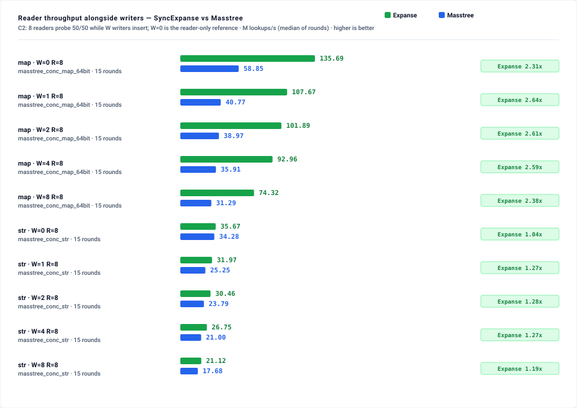
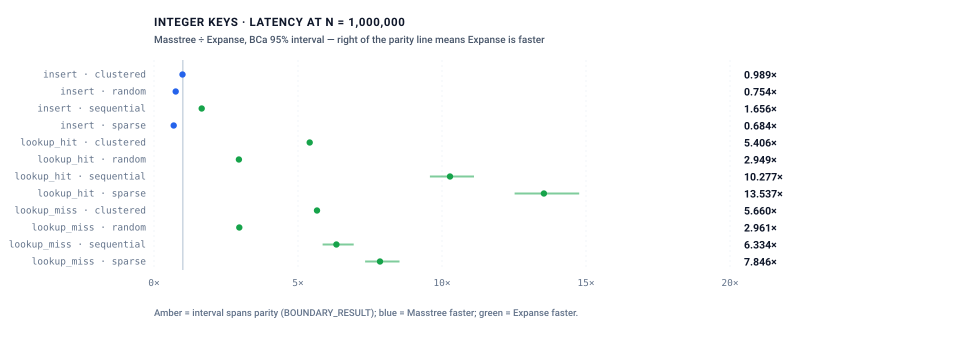
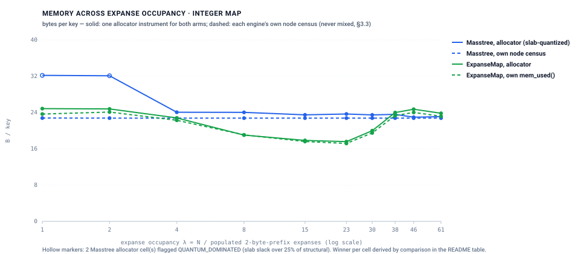
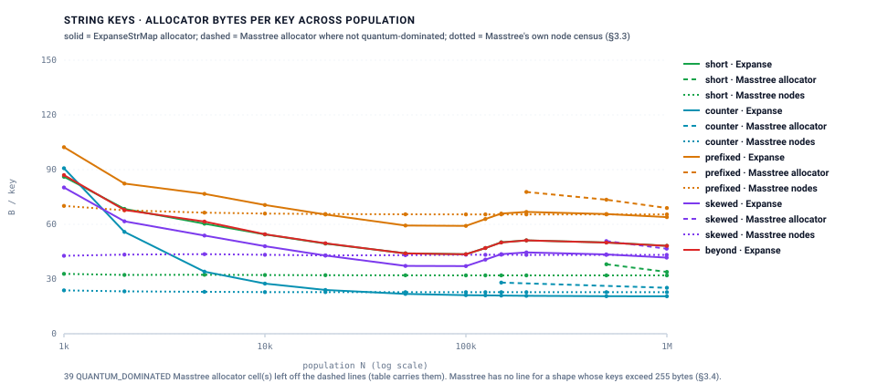
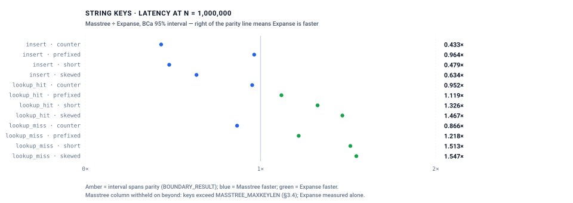

# Expanse vs. Masstree: Empirical Benchmark Suite

Head-to-head evaluation of `ExpanseMap`, `ExpanseStrMap`, `SyncExpanseMap` and
`SyncExpanseStrMap` against **Masstree**
([Mao, Kohler & Morris, EuroSys 2012](https://doi.org/10.1145/2168836.2168855)),
the trie of B+-trees, reached through a C++ FFI shim over the reference
implementation. The last of the three SOTA arms
[#387](https://github.com/orieg/expanse/issues/387) filed, and the second,
independent route to the write-concurrency loss
[#692](https://github.com/orieg/expanse/issues/692) measured against HOT-ROWEX.

> **Tracking & provenance.** Delivers
> [#661](https://github.com/orieg/expanse/issues/661).
> *(measured: reference host — Intel Core i9-12900F, 8P+8E/24 threads, 30 MiB L3, Ubuntu 22.04, kernel 6.8; Masstree [`kohler/masstree-beta`](https://github.com/kohler/masstree-beta) `1119842`, MIT with a publicity clause; harness commit `82966aae`; `docs/benchmarks/masstree_comparison/run.sh --concurrent`; benchmark shell pinned to CPUs 0-15 and every concurrent row records `Cpus_allowed_list 0-15`; both arms built for one ISA target — `-C target-cpu=haswell` and `-march=haswell -O3 -std=c++17 -DNDEBUG`, assertions off, superpages on, glibc 2.35 `malloc`; load average 0.15 / 0.15 / 0.15 / 0.28 / 0.49 / 0.95 / 0.99 across the single-threaded phases and 0.99 at the concurrent sweep's start, 4.40 after it — its own threads, which is why it runs last; 15 rounds per wall-clock cell, arms interleaved, medians reported, BCa 95% bootstrap ratio intervals over 2,000 resamples; `results/baseline_*.json`; gate transcript `results/validate.log`)*
>
> Pre-registration, locked constraints and every amendment:
> [`METHODOLOGY.md`](METHODOLOGY.md). Every table below is the output of
> `scripts/tables.py` over `results/`; no number in a table is typed by hand.
> Ratios are **Masstree ÷ Expanse for latency and Expanse ÷ Masstree for
> throughput, so above 1.000 always means Expanse is faster**; memory is
> deterministic and carries no interval. This is internal work; no external
> peer review has been performed on any claim here.

---

## 1. The losses first

**Write concurrency is a loss from two writers on integer keys and from one
writer on string keys, and it is wider than the pre-registration argued
for.** `SyncExpanseMap` serializes every writer on one mutex (optimistic lock
coupling, blocking by design — `AGENTS.md` §2.2); Masstree's per-node locks
admit them. With eight writers inserting 2²⁰ fresh keys into a 2²⁰ prefill
Masstree sustains 31.76 M inserts/s against Expanse's 2.82, ratio
0.088 [0.086, 0.091]; at sixteen, 0.075 [0.070, 0.078] *(workload:
`masstree_conc_map_64bit`)*. On `short` string keys the loss starts at one
writer — 0.890 [0.800, 0.986] — and reaches 0.020 [0.017, 0.024] at sixteen,
where the Expanse string writers fall to 0.49 M inserts/s *(workload:
`masstree_conc_str`)*. Expanse's aggregate insert rate does not plateau at its
single-writer rate: it **falls** as writers are added, 5.72 → 3.84 → 3.21 →
2.82 → 2.67 M/s on integers. Which share of the fall is lock hand-off and
which is cache-line traffic is **unmeasured** — this arm carries no hardware
counters (§8.9) — and no mechanism beyond the serialization itself is
claimed. §6.1 rows 1 and 3 are **`CONFIRMED`**; the single-writer integer cell
is Expanse's, 1.130 [1.091, 1.166], a **`REFUTED`** row in Expanse's favour,
which was the direction the ROWEX arm registered and the opposite of what this
one did.


**Readers under any writer load go to Masstree, on both arms.** One writer
takes Expanse's eight integer readers from 142.1 to 18.2 M lookups/s while
Masstree's keep 43.3 of their 60.3 — 0.419 [0.408, 0.430]; on strings from
31.5 to 3.4 against Masstree's 26.9 — 0.114 [0.095, 0.129] *(workloads:
`masstree_conc_map_64bit`, `masstree_conc_str`)*. Expanse readers restart when
the tree version moves under them; Masstree readers validate one node and
retry there. **`CONFIRMED`** (§6.1 row 3), the same mechanism #692 measured.



**Ordered scan on string keys is a loss in every cell**, 0.555 [0.543, 0.574]
at best (`prefixed`, k=10) and 0.036 [0.036, 0.037] at worst (`counter`,
k=1000) *(workload: `masstree_str_map`)* — **`CONFIRMED`** at the high
confidence registered. As in the HOT suite this measures the shipped
`ExpanseStrMap` navigation surface, which re-descends from the root and
allocates a key per visited element, against one descent and a leaf walk; a
cursor iterator for `ExpanseStrMap` is [#722](https://github.com/orieg/expanse/issues/722).

**String insertion is Masstree's on every representable shape**, 0.421
[0.418, 0.423] on `short`, 0.441 [0.439, 0.443] on `counter`, 0.595
[0.592, 0.599] on `skewed`, 0.881 [0.876, 0.886] on `prefixed`. Only
`prefixed` was registered (**`CONFIRMED`**); `counter` was registered the other
way and is an **`UNPREDICTED LOSS`**; `short` and `skewed` were not predicted.
The §10.2 sensitivity rows say what is being measured: on a shuffled
permutation of the same keys `short` insertion is 0.963 [0.961, 0.965] and
`prefixed` 1.207 [1.204, 1.211] — sorted insertion is a B+-tree's best case
(every leaf fills, no split lands mid-leaf) and the shared generator hands
both arms the population sorted.

**Integer insertion on `random`, `sparse` and `clustered` keys is Masstree's
too, in the sorted order the suite builds in** — 0.765 [0.759, 0.771], 0.662
[0.648, 0.670], 0.971 [0.962, 0.979] — three **`UNPREDICTED LOSS`** cells
against a medium-confidence registration; `sequential` is Expanse's at 1.541
[1.526, 1.558] *(workload: `masstree_map_64bit`)*. Masstree inserts at a flat
20.6–20.9 ns whatever the distribution. On the shuffled permutation the same
`random` cell is 1.877 [1.856, 1.907] in Expanse's favour, and with Masstree's
concurrent table 1.126 [1.121, 1.131] (§10.3): the registered win exists, in
the insertion order and the configuration the pre-registration did not name.

**`counter` 100%-hit string lookup at N = 10⁶ is Masstree's**, 0.937
[0.935, 0.938] — registered as a high-confidence Expanse win at exactly this
population, so an **`UNPREDICTED LOSS`** with nothing to hide behind; the
50/50 cell is a `BOUNDARY_RESULT` (0.997 [0.994, 1.002]).

**Reader-only string throughput goes to Masstree**, 0.856 [0.850, 0.876] with
eight readers and no writer *(workload: `masstree_conc_str`)* — an
**`UNPREDICTED LOSS`** against the medium-confidence registration, consistent
with the single-threaded `short` lookup being only 1.25× rather than the
larger integer margins.

**Memory at the ends of the density sweep and on `prefixed` strings goes to
Masstree by a few bytes per key.** Masstree holds 22.76 B/key structurally at
every λ (its leaves fill to 15 keys in the sorted order and its per-key cost
does not depend on key density), 23.0–24.1 B/key on the allocator instrument
outside the quantum-dominated cells. `ExpanseMap` is below that from λ = 8
(18.99) through λ = 30 (19.39), with its best at λ = 23 (16.26), and above it
at λ = 38, 46 and 61 (23.91, 24.71, 23.82) — the `LEAF_CAP` cascade
`hot_comparison` §9.4 documents. §6.2 row 1 (λ ∈ [8, 23]) is **`CONFIRMED`**;
row 2 (outside the band) is **`REFUTED`** above the cascade and parity-by-magnitude
at λ = 4 (24.05 vs 22.80). On `prefixed` strings Masstree's 69.06 B/key against
`ExpanseStrMap`'s 72.53 is a **`REFUTED`** medium-confidence row; §10.2 records
that the registration leaned on a shuffled-order figure (84.2 B/key structural,
which the sensitivity table reproduces at 88.52 allocator).

## 2. Where Expanse wins

**Integer point lookup, by 3.2× to 12.4×, on every distribution and at every
population.** At N = 10⁶ Masstree answers a lookup in 117–128 ns whatever the
distribution — a B+-tree descent of the same height regardless of key
structure — while Expanse answers `sparse` in 10.3 ns (12.370
[12.228, 12.449]), `sequential` in 13.3 (8.803 [8.692, 8.867]), `clustered` in
22.1 (5.316 [5.301, 5.329]) and `random` in 37.5 (3.196 [3.173, 3.270])
*(workload: `masstree_map_64bit`)*. `sequential`, `sparse` and `random` were
registered (**`CONFIRMED`**); `clustered` was not. The 50/50 pillar follows,
2.547 [2.527, 2.568] to 8.480 [8.204, 8.573]. Why Masstree's descent costs
what it does here is unmeasured — no counter was taken — and the cross-suite
comparison the reader will want (HOT held random 1M lookup near parity) is one
this suite does not draw (§8 item 6).



**Ordered scan on integer keys, in every cell — the registered loss
`REFUTED` in Expanse's favour.** Masstree visits an element in 3.7–16 ns
against Expanse's 1.5–9.5 through `ExpanseMap::range()`: 1.476 [1.137, 1.670]
at k = 10 on `random`, 2.486 [2.430, 2.530] at k = 1000 on `sequential`. §6.1
row 4 registered Masstree for k = 10 and k = 100 on the strength of the ART and
HOT results; Masstree's scan is driven through its visitor interface with a
key reassembled per element, and on this instrument that costs more than
Expanse's iterator. Every k = 10 and k = 100 cell at every population is **`REFUTED`**; the
k = 1000 cells were `not pre-registered`.

**Reader-only integer throughput**, 2.394 [2.359, 2.433] with eight readers —
**`CONFIRMED`**.

**Memory on structured integer keys and in the density band.** `sequential`
and `clustered` at N = 10⁶: 8.91 and 8.97 B/key against Masstree's flat 23.08
(**`CONFIRMED`**, the low-information cell §6.2 said it would be); `sparse`
16.41 against 23.08 (**`CONFIRMED`**); `random` at λ = 15 and 23: 16.72 and
16.26 against 23.48 and 23.66 (**`CONFIRMED`**).

**String point lookup on `short`, `skewed` and, narrowly, `prefixed`.**
`short` 1.253 [1.250, 1.255] (**`CONFIRMED`**), `skewed` 1.401 [1.394, 1.404]
(`not pre-registered`), and `prefixed` 1.053 [1.052, 1.054] — the issue's
stated expectation that Expanse loses on long shared-prefix keys is
**`REFUTED`**, narrowly, at the low confidence it was registered: both
structures descend the same twelve 8-byte slices (`masstree_envelope.layers_for_shared_prefix(96)`),
and the interval sits just above parity. The 50/50 `prefixed` cell is 1.157
[1.155, 1.159].

**`counter` and `short`-key memory** *(workload: `masstree_str_map`)*. `counter`: 20.53 against 25.18 B/key
(**`CONFIRMED`**). And the one string memory cell that was registered as a
loss landed as one: `short` at 33.91 against 69.17 (**`CONFIRMED`** for
Masstree), `skewed` 46.63 against 47.74 — a 1.1 B/key margin that the
pre-registration counted as a Masstree win and this suite reports as
parity-by-magnitude.

## 3. What the census says, and what it does not

Two instruments per cell, never mixed (§3.3). The allocator column is what
the process holds; on Masstree it is quantized to the 2 MiB pool slab, so at
λ = 1 and λ = 2 and on every string cell below N ≈ 150k the figure is mostly
slab and is flagged `QUANTUM_DOMINATED`. Where it is not flagged, the measured
slack above Masstree's own node census is 0.2–3.6 B/key. Masstree's structural
figure is 22.76 B/key on every integer cell: 66,667 leaves at 100% fill plus
4,448 internodes for 10⁶ keys, exactly what `masstree_envelope.structural_bytes`
gives for those counts — and 33.10 B/key at 70.7% fill on the shuffled
permutation (§10.2). The RCU settle step (§10.4) reclaimed 12.2 B/key of
superseded suffix bags on `prefixed` (81.20 → 69.00) and nothing on integer
keys, which allocate no bags.



#### Memory, integer map: two instruments per cell, bytes per key

`allocator` is what the process holds from the C allocator after a build-only population, one instrument for both arms; on Masstree it is quantized to the 2 MiB pool slab and a cell whose measured slack exceeds 25% of its structural bytes is flagged `QUANTUM_DOMINATED` (§3.3). `structural` is Masstree's own `json_stats` node census; `mem_used` is Expanse's own accounting. The engine columns are never mixed with the allocator columns in one ratio.

| Distribution | λ | N | Masstree allocator (unsettled) | Expanse allocator | Masstree structural | Expanse `mem_used` | Masstree slack | slabs | leaf fill | flag |
|---|---:|---:|---:|---:|---:|---:|---:|---:|---:|---|
| `random` | 1 | 65,536 | 32.19 (32.19) | 23.88 | 22.78 | 22.66 | 9.41 | 1 | 1.000 | `QUANTUM_DOMINATED` |
| `random` | 2 | 131,072 | 32.09 (32.09) | 24.81 | 22.77 | 24.09 | 9.33 | 2 | 1.000 | `QUANTUM_DOMINATED` |
| `random` | 4 | 262,144 | 24.05 (24.05) | 22.80 | 22.76 | 22.28 | 1.29 | 3 | 1.000 | `ok` |
| `random` | 8 | 524,288 | 24.02 (24.02) | 18.99 | 22.76 | 19.05 | 1.27 | 6 | 1.000 | `ok` |
| `random` | 15 | 983,040 | 23.48 (23.48) | 16.72 | 22.76 | 16.75 | 0.72 | 11 | 1.000 | `ok` |
| `random` | 23 | 1,507,328 | 23.66 (23.66) | 16.26 | 22.76 | 16.20 | 0.90 | 17 | 1.000 | `ok` |
| `random` | 30 | 1,966,080 | 23.47 (23.47) | 19.39 | 22.76 | 19.05 | 0.72 | 22 | 1.000 | `ok` |
| `random` | 38 | 2,490,368 | 23.58 (23.58) | 23.91 | 22.76 | 23.24 | 0.83 | 28 | 1.000 | `ok` |
| `random` | 46 | 3,014,656 | 22.96 (22.96) | 24.71 | 22.76 | 24.00 | 0.20 | 33 | 1.000 | `ok` |
| `random` | 61 | 3,997,696 | 23.09 (23.09) | 23.82 | 22.76 | 23.17 | 0.33 | 44 | 1.000 | `ok` |
| `clustered` | — | 1,000,000 | 23.08 (23.08) | 8.97 | 22.76 | 8.61 | 0.32 | 11 | 1.000 | `ok` |
| `sequential` | — | 1,000,000 | 23.08 (23.08) | 8.91 | 22.76 | 8.56 | 0.32 | 11 | 1.000 | `ok` |
| `sparse` | — | 1,000,000 | 23.08 (23.08) | 16.41 | 22.76 | 16.31 | 0.32 | 11 | 1.000 | `ok` |

#### Memory, string map: two instruments per cell, bytes per key

Both sides copy key bytes into their own nodes, so the index column is the ownership column on both (§4). Columns as the integer table.

| Shape | N | mean len | Masstree allocator (unsettled) | Expanse allocator | Masstree structural | Expanse `mem_used` | Masstree slack | layers | flag |
|---|---:|---:|---:|---:|---:|---:|---:|---:|---|
| `beyond` | 1,000,000 | 272.0 | withheld (1,000,000 keys > 255 B) | 71.84 | withheld (1,000,000 keys > 255 B) | 54.78 | withheld (1,000,000 keys > 255 B) | — | `NOT_REPRESENTABLE_MASSTREE` |
| `counter` | 1,000,000 | 12.0 | 25.18 (25.18) | 20.53 | 22.82 | 19.56 | 2.36 | 100 | `ok` |
| `prefixed` | 1,000,000 | 120.0 | 69.06 (73.21) | 72.53 | 65.43 | 62.77 | 3.63 | 12 | `ok` |
| `short` | 1,000,000 | 12.0 | 33.91 (34.02) | 69.17 | 32.02 | 50.77 | 1.89 | 0 | `ok` |
| `skewed` | 998,150 | 14.3 | 46.63 (49.26) | 47.74 | 43.24 | 41.19 | 3.38 | 0 | `ok` |

#### String map, allocator column across the population sweep (Masstree / Expanse B/key)

| N | `beyond` | `counter` | `prefixed` | `short` | `skewed` |
|---:|---:|---:|---:|---:|---:|
| 1,000 | — / 109.8 | 2109.6† / 91.1 | 4241.4† / 110.1 | 6304.4† / 106.4 | 6315.7† / 84.8 |
| 2,000 | — / 91.5 | 1054.8† / 56.0 | 2138.0† / 91.2 | 3152.1† / 89.7 | 3164.7† / 67.2 |
| 5,000 | — / 84.5 | 421.9† / 34.1 | 876.8† / 85.3 | 1261.3† / 80.8 | 1273.8† / 59.1 |
| 10,000 | — / 78.4 | 211.0† / 27.5 | 456.2† / 79.6 | 630.9† / 75.6 | 643.2† / 54.0 |
| 20,000 | — / 73.3 | 105.5† / 24.0 | 246.0† / 74.2 | 315.6† / 70.5 | 327.6† / 48.9 |
| 50,000 | — / 67.3 | 42.2† / 21.8 | 119.9† / 68.0 | 126.4† / 64.6 | 138.9† / 42.8 |
| 100,000 | — / 66.6 | 42.1† / 21.1 | 98.8† / 67.5 | 84.3† / 64.0 | 97.1† / 42.5 |
| 125,000 | — / 70.7 | 33.7† / 21.0 | 86.2† / 71.7 | 67.5† / 68.0 | 80.3† / 46.7 |
| 150,000 | — / 73.8 | 28.0 / 20.9 | 91.7† / 74.8 | 70.3† / 71.2 | 69.1† / 49.8 |
| 200,000 | — / 74.5 | 42.0† / 20.8 | 77.8 / 75.3 | 52.8† / 71.8 | 65.5† / 50.4 |
| 500,000 | — / 74.0 | 29.4† / 20.6 | 73.5 / 74.9 | 38.1 / 71.3 | 50.8 / 49.8 |
| 1,000,000 | — / 71.8 | 25.2 / 20.5 | 69.1 / 72.5 | 33.9 / 69.2 | 46.6 / 47.7 |

† `QUANTUM_DOMINATED`: the allocator figure is mostly the 2 MiB slab, not the index (§3.3).



## 4. Latency tables, integer keys

#### Point lookup, 100% hit, integer keys (N = 1,000,000)

| Distribution | λ | Masstree ns | Expanse ns | Masstree ÷ Expanse [BCa 95%] | Verdict |
|---|---:|---:|---:|---:|---|
| `clustered` | — | 117.61 | 22.12 | 5.316 [5.301, 5.329] | Expanse — `not pre-registered` |
| `random` | 15.3 | 118.96 | 37.47 | 3.196 [3.173, 3.270] | Expanse — `CONFIRMED` |
| `sequential` | — | 117.66 | 13.34 | 8.803 [8.692, 8.867] | Expanse — `CONFIRMED` |
| `sparse` | — | 128.34 | 10.31 | 12.370 [12.228, 12.449] | Expanse — `CONFIRMED` |

#### Point lookup, 50% hit / 50% rejection-sampled miss, integer keys (N = 1,000,000)

| Distribution | λ | Masstree ns | Expanse ns | Masstree ÷ Expanse [BCa 95%] | Verdict |
|---|---:|---:|---:|---:|---|
| `clustered` | — | 99.53 | 16.02 | 6.215 [6.197, 6.229] | Expanse — `not pre-registered` |
| `random` | 15.3 | 119.91 | 47.14 | 2.547 [2.527, 2.568] | Expanse — `not pre-registered` |
| `sequential` | — | 65.87 | 9.31 | 6.974 [6.680, 7.083] | Expanse — `CONFIRMED` |
| `sparse` | — | 65.68 | 7.67 | 8.480 [8.204, 8.573] | Expanse — `CONFIRMED` |

#### Insertion into a cold structure, integer keys (N = 1,000,000)

| Distribution | λ | Masstree ns | Expanse ns | Masstree ÷ Expanse [BCa 95%] | Verdict |
|---|---:|---:|---:|---:|---|
| `clustered` | — | 20.84 | 21.43 | 0.971 [0.962, 0.979] | Masstree — **`UNPREDICTED LOSS`** |
| `random` | 15.3 | 20.83 | 27.16 | 0.765 [0.759, 0.771] | Masstree — **`UNPREDICTED LOSS`** |
| `sequential` | — | 20.62 | 13.47 | 1.541 [1.526, 1.558] | Expanse — `CONFIRMED` |
| `sparse` | — | 20.85 | 31.32 | 0.662 [0.648, 0.670] | Masstree — **`UNPREDICTED LOSS`** |

#### Ordered range scan, integer keys (N = 1,000,000; Masstree ÷ Expanse per visited element)

| Distribution | k=10 | k=100 | k=1000 |
|---|---:|---:|---:|
| `sequential` | 1.812 [1.416, 2.037] · **`REFUTED`** | 2.196 [1.889, 2.339] · **`REFUTED`** | 2.486 [2.430, 2.530] · `not pre-registered` |
| `clustered` | 1.702 [1.402, 1.909] · **`REFUTED`** | 2.143 [1.910, 2.258] · **`REFUTED`** | 2.424 [2.378, 2.445] · `not pre-registered` |
| `sparse` | 1.518 [1.269, 1.680] · **`REFUTED`** | 1.201 [1.133, 1.239] · **`REFUTED`** | 1.106 [1.094, 1.120] · `not pre-registered` |
| `random` | 1.476 [1.137, 1.670] · **`REFUTED`** | 1.458 [1.252, 1.562] · **`REFUTED`** | 1.554 [1.509, 1.570] · `not pre-registered` |

## 5. Latency tables, string keys



#### Point lookup, 100% hit, string keys (N = 1,000,000)

| Shape | N held | mean len | Masstree ns | Expanse ns | Masstree ÷ Expanse [BCa 95%] | Verdict |
|---|---:|---:|---:|---:|---:|---|
| `beyond` | 1,000,000 | 272.0 | withheld (1,000,000 keys > 255 B) | 366.55 | — | no Masstree cell (§3.4) |
| `counter` | 1,000,000 | 12.0 | 143.13 | 152.73 | 0.937 [0.935, 0.938] | Masstree — **`UNPREDICTED LOSS`** |
| `prefixed` | 1,000,000 | 120.0 | 307.15 | 291.66 | 1.053 [1.052, 1.054] | Expanse — **`REFUTED`** |
| `short` | 1,000,000 | 12.0 | 171.96 | 137.16 | 1.253 [1.250, 1.255] | Expanse — `CONFIRMED` |
| `skewed` | 998,150 | 14.3 | 202.52 | 144.32 | 1.401 [1.394, 1.404] | Expanse — `not pre-registered` |

#### Point lookup, 50% hit / 50% rejection-sampled miss, string keys (N = 1,000,000)

| Shape | N held | mean len | Masstree ns | Expanse ns | Masstree ÷ Expanse [BCa 95%] | Verdict |
|---|---:|---:|---:|---:|---:|---|
| `beyond` | 1,000,000 | 272.0 | withheld (1,000,000 keys > 255 B) | 316.39 | — | no Masstree cell (§3.4) |
| `counter` | 1,000,000 | 12.0 | 81.35 | 81.59 | 0.997 [0.994, 1.002] | `BOUNDARY_RESULT` |
| `prefixed` | 1,000,000 | 120.0 | 280.89 | 242.80 | 1.157 [1.155, 1.159] | Expanse — **`REFUTED`** |
| `short` | 1,000,000 | 12.0 | 164.92 | 114.04 | 1.446 [1.444, 1.449] | Expanse — `not pre-registered` |
| `skewed` | 998,150 | 14.3 | 184.88 | 124.11 | 1.490 [1.489, 1.492] | Expanse — `not pre-registered` |

#### Insertion into a cold structure, string keys (N = 1,000,000)

| Shape | N held | mean len | Masstree ns | Expanse ns | Masstree ÷ Expanse [BCa 95%] | Verdict |
|---|---:|---:|---:|---:|---:|---|
| `beyond` | 1,000,000 | 272.0 | withheld (1,000,000 keys > 255 B) | 284.34 | — | no Masstree cell (§3.4) |
| `counter` | 1,000,000 | 12.0 | 24.81 | 56.26 | 0.441 [0.439, 0.443] | Masstree — **`UNPREDICTED LOSS`** |
| `prefixed` | 1,000,000 | 120.0 | 168.19 | 190.69 | 0.881 [0.876, 0.886] | Masstree — `CONFIRMED` |
| `short` | 1,000,000 | 12.0 | 51.35 | 122.62 | 0.421 [0.418, 0.423] | Masstree — `not pre-registered` |
| `skewed` | 998,150 | 14.3 | 66.55 | 112.07 | 0.595 [0.592, 0.599] | Masstree — `not pre-registered` |

#### Ordered range scan, string keys (N = 1,000,000; Masstree ÷ Expanse per visited element)

| Shape | k=10 | k=100 | k=1000 |
|---|---:|---:|---:|
| `short` | 0.241 [0.217, 0.287] | 0.117 [0.115, 0.121] | 0.099 [0.098, 0.100] |
| `counter` | 0.148 [0.134, 0.179] | 0.049 [0.048, 0.052] | 0.036 [0.036, 0.037] |
| `prefixed` | 0.555 [0.543, 0.574] | 0.129 [0.127, 0.132] | 0.070 [0.069, 0.070] |
| `skewed` | 0.232 [0.203, 0.295] | 0.109 [0.106, 0.115] | 0.084 [0.084, 0.085] |
| `beyond` | Expanse 301 ns; Masstree withheld | Expanse 290 ns; Masstree withheld | Expanse 287 ns; Masstree withheld |

`beyond` (272-byte keys) fails the §3.4 predicate for its whole population:
Masstree's declared contract is `MASSTREE_MAXKEYLEN = 255`, and the validation
gate records that the shim refuses every such key at the call. The Expanse
figures on that shape are published alone.

## 6. Sensitivity: insertion order and table configuration

#### Sensitivity (§10.2 insertion order, §10.3 table configuration) — both arms, same population

Sorted / single is the registered configuration every cell above was built in. Shuffled is a Fisher–Yates permutation of the same keys (Masstree's leaf fill and footprint depend on the order; Expanse's footprint does not). Concurrent is Masstree's fenced, spin-locked node version, the configuration the MC cells use, driven single-threaded here to show the protocol's own cost. Ratios are Masstree ÷ Expanse; no verdict is given against §6.

| Arm | Shape | Order | Table | N | Masstree allocator (unsettled) | Masstree structural | leaf fill | Expanse allocator | lookup_hit ratio [BCa 95%] | insert ratio [BCa 95%] |
|---|---|---|---|---:|---:|---:|---:|---:|---:|---:|
| map | `random` | sorted | single | 1,000,000 | 23.08 (23.08) | 22.76 | 1.000 | 16.67 | 3.186 [3.173, 3.199] | 0.755 [0.749, 0.761] |
| map | `random` | sorted | concurrent | 1,000,000 | 23.08 (23.08) | 22.76 | 1.000 | 16.67 | 3.581 [3.563, 3.595] | 1.126 [1.121, 1.131] |
| map | `random` | shuffled | single | 1,000,000 | 33.57 (33.57) | 33.10 | 0.707 | 23.62 | 3.546 [3.528, 3.562] | 1.877 [1.856, 1.907] |
| str | `prefixed` | sorted | single | 1,000,000 | 69.00 (81.20) | 65.43 | 1.000 | 72.48 | 1.054 [1.052, 1.056] | 0.882 [0.876, 0.885] |
| str | `prefixed` | shuffled | single | 1,000,000 | 88.52 (93.01) | 84.20 | 0.706 | 74.80 | 1.065 [1.065, 1.066] | 1.207 [1.204, 1.211] |
| str | `short` | sorted | single | 1,000,000 | 33.91 (33.95) | 32.02 | 1.000 | 69.17 | 1.277 [1.274, 1.279] | 0.418 [0.416, 0.420] |
| str | `short` | sorted | concurrent | 1,000,000 | 33.91 (34.02) | 32.02 | 1.000 | 69.17 | 1.395 [1.392, 1.397] | 0.529 [0.526, 0.533] |
| str | `short` | shuffled | single | 1,000,000 | 50.63 (50.87) | 47.99 | 0.707 | 71.99 | 1.426 [1.422, 1.430] | 0.963 [0.961, 0.965] |

The shuffled rows are the regime the Step 0 gate measured and the §6
predictions leaned on; the sorted rows are the suite's registered cells, and
the difference between them is the finding: **Masstree's insertion cost,
leaf fill and footprint depend on insertion order; Expanse's footprint does
not.** The concurrent-table rows show the protocol's own single-threaded
cost: on `random` integer keys the insertion ratio moves from 0.755
[0.749, 0.761] with the single-threaded table to 1.126 [1.121, 1.131] with the
concurrent one, and the lookup ratio from 3.186 [3.173, 3.199] to 3.581
[3.563, 3.595] — which is why the single-threaded pairings use the
single-threaded configuration (§10.3).

## 7. The concurrent arm

#### MC1 — `u64` keys, Masstree vs `SyncExpanseMap`

**C1 — writer throughput as writer count scales** (W writers insert 2²⁰ fresh keys into a 2²⁰ prefill; fixed work; Expanse ÷ Masstree)

| W | Masstree M/s | Expanse M/s | ratio [BCa 95%] | verdict |
|--:|---:|---:|---|---|
| 1 | 5.05 | 5.72 | 1.130 [1.091, 1.166] | Expanse — **`REFUTED`** (in Expanse's favour) |
| 2 | 9.79 | 3.84 | 0.401 [0.390, 0.412] | Masstree — `CONFIRMED` |
| 4 | 18.30 | 3.21 | 0.176 [0.172, 0.180] | Masstree — `CONFIRMED` |
| 8 | 31.76 | 2.82 | 0.088 [0.086, 0.091] | Masstree — `CONFIRMED` |
| 16 | 34.22 | 2.67 | 0.075 [0.070, 0.078] | Masstree — `not pre-registered` |

**C2 — reader throughput alongside writers** (8 readers probe 50/50 while W writers insert; W = 0 is the reader-only reference)

| W | Masstree readers M/s | Expanse readers M/s | ratio [BCa 95%] | verdict | Masstree writers M/s | Expanse writers M/s | writer ratio |
|--:|---:|---:|---|---|---:|---:|---|
| 0 | 60.31 | 142.14 | 2.394 [2.359, 2.433] | Expanse — `CONFIRMED` | — | — | — |
| 1 | 43.29 | 18.18 | 0.419 [0.408, 0.430] | Masstree — `CONFIRMED` | 3.83 | 1.86 | 0.489 [0.465, 0.514] |
| 2 | 40.97 | 28.36 | 0.690 [0.647, 0.729] | Masstree — `CONFIRMED` | 7.26 | 1.62 | 0.222 [0.211, 0.235] |
| 4 | 37.48 | 26.20 | 0.697 [0.683, 0.710] | Masstree — `CONFIRMED` | 13.46 | 1.58 | 0.116 [0.113, 0.118] |
| 8 | 30.56 | 23.89 | 0.768 [0.739, 0.803] | Masstree — `CONFIRMED` | 23.40 | 1.52 | 0.070 [0.065, 0.077] |

#### MC2 — `short` string keys, Masstree vs `SyncExpanseStrMap`

**C1 — writer throughput as writer count scales** (W writers insert 2²⁰ fresh keys into a 2²⁰ prefill; fixed work; Expanse ÷ Masstree)

| W | Masstree M/s | Expanse M/s | ratio [BCa 95%] | verdict |
|--:|---:|---:|---|---|
| 1 | 4.20 | 3.53 | 0.890 [0.800, 0.986] | Masstree — `CONFIRMED` |
| 2 | 7.93 | 2.58 | 0.349 [0.322, 0.381] | Masstree — `CONFIRMED` |
| 4 | 14.98 | 2.30 | 0.179 [0.164, 0.199] | Masstree — `CONFIRMED` |
| 8 | 23.81 | 2.05 | 0.103 [0.092, 0.116] | Masstree — `CONFIRMED` |
| 16 | 23.54 | 0.49 | 0.020 [0.017, 0.024] | Masstree — `not pre-registered` |

**C2 — reader throughput alongside writers** (8 readers probe 50/50 while W writers insert; W = 0 is the reader-only reference)

| W | Masstree readers M/s | Expanse readers M/s | ratio [BCa 95%] | verdict | Masstree writers M/s | Expanse writers M/s | writer ratio |
|--:|---:|---:|---|---|---:|---:|---|
| 0 | 36.99 | 31.45 | 0.856 [0.850, 0.876] | Masstree — **`UNPREDICTED LOSS`** | — | — | — |
| 1 | 26.85 | 3.38 | 0.114 [0.095, 0.129] | Masstree — `CONFIRMED` | 2.88 | 1.84 | 0.698 [0.634, 0.800] |
| 2 | 21.36 | 8.26 | 0.364 [0.343, 0.391] | Masstree — `CONFIRMED` | 4.68 | 1.25 | 0.273 [0.250, 0.300] |
| 4 | 22.39 | 7.21 | 0.326 [0.312, 0.340] | Masstree — `CONFIRMED` | 6.96 | 1.34 | 0.183 [0.161, 0.197] |
| 8 | 18.13 | 7.06 | 0.402 [0.388, 0.424] | Masstree — `CONFIRMED` | 11.43 | 1.32 | 0.106 [0.096, 0.113] |

#### H — protocol health, Expanse side only (occ-stats build; event ratios, never a timing)

| Arm | W | R | restart share, median [min, max] | fallback share, median | `sample_spins` ÷ `read_ops` (medians) | flag |
|---|--:|--:|---|---|---:|---|
| map | 1 | 8 | 7.15% [5.63%, 10.70%] | 0.0000% | 1.37 | below 1% — §6.3 holds |
| map | 2 | 8 | 5.04% [4.50%, 5.45%] | 0.0000% | 1.95 | below 1% — §6.3 holds |
| map | 4 | 8 | 5.62% [4.76%, 6.44%] | 0.0000% | 2.07 | below 1% — §6.3 holds |
| map | 8 | 8 | 5.89% [5.73%, 5.97%] | 0.0000% | 2.12 | below 1% — §6.3 holds |
| str | 1 | 8 | `NOT_INSTRUMENTED` (§10.5) | `NOT_INSTRUMENTED`; `read_fallbacks` = 0 absolute | — | not evaluable |
| str | 2 | 8 | `NOT_INSTRUMENTED` (§10.5) | `NOT_INSTRUMENTED`; `read_fallbacks` = 0 absolute | — | not evaluable |
| str | 4 | 8 | `NOT_INSTRUMENTED` (§10.5) | `NOT_INSTRUMENTED`; `read_fallbacks` = 0 absolute | — | not evaluable |
| str | 8 | 8 | `NOT_INSTRUMENTED` (§10.5) | `NOT_INSTRUMENTED`; `read_fallbacks` = 0 absolute | — | not evaluable |

The MC1 health rows replicate `hot_comparison` §7.3 on the same construction:
restart share 5–7% without rising with writer count, and **zero reads took the
writer mutex at any writer count**, so §6.3's falsifier does not fire. MC2's
rows are `NOT_INSTRUMENTED`: `StrReader::get` counts fallbacks only (§10.5) —
the zero fallbacks are real, the restart share does not exist. Instrumenting
the string reader is [#721](https://github.com/orieg/expanse/issues/721).

#### M — build-only single-writer census, Masstree vs `SyncExpanseMap` (B/key)

| λ | N | Masstree allocator | SyncExpanseMap allocator | Masstree structural | Expanse `mem_used` | flag |
|---:|---:|---:|---:|---:|---:|---|
| 1 | 65,536 | 32.19 | 24.26 | 22.78 | 22.66 | `QUANTUM_DOMINATED` |
| 2 | 131,072 | 32.09 | 24.71 | 22.77 | 24.09 | `QUANTUM_DOMINATED` |
| 4 | 262,144 | 24.05 | 22.95 | 22.76 | 22.28 | `ok` |
| 8 | 524,288 | 24.02 | 19.34 | 22.76 | 19.05 | `ok` |
| 15 | 983,040 | 23.48 | 16.80 | 22.76 | 16.75 | `ok` |
| 23 | 1,507,328 | 23.66 | 16.36 | 22.76 | 16.20 | `ok` |
| 30 | 1,966,080 | 23.47 | 20.34 | 22.76 | 19.05 | `ok` |
| 38 | 2,490,368 | 23.58 | 25.90 | 22.76 | 23.24 | `ok` |
| 46 | 3,014,656 | 22.96 | 26.77 | 22.76 | 24.00 | `ok` |
| 61 | 3,997,696 | 23.09 | 25.60 | 22.76 | 23.17 | `ok` |

**Replication of the Expanse column.** MC1's cells are the construction of
`hot_comparison` §11.4 — same generator, seeds, prefill, fresh-key stream and
thread placement — so the `SyncExpanseMap` column here is a second measurement
of #692's, on another day in another process: single writer 5.72 M/s here
against 5.22 there, eight writers 2.82 against 2.59, sixteen 2.67 against
2.64, eight readers alone 142.1 against 126.6 *(workloads differ:
`masstree_conc_map_64bit` vs `hot_rowex_map_64bit`; identical construction,
not a §8.4 paired claim)*. The direction and the shape of the fall agree; the
levels differ by 3–12%, which is the day-to-day spread of a wall-clock
instrument and is reported as such.

## 8. Scorecard against the pre-registration

#### Scorecard (wall-clock cells with a Masstree column)

| | Count |
|---|---:|
| Expanse wins (CI excludes parity) | 80 |
| Masstree wins (CI excludes parity) | 87 |
| `BOUNDARY_RESULT` | 5 |
| Masstree column withheld (§3.4, `beyond`) | 18 |

| Label | Cells |
|---|---:|
| Masstree — `CONFIRMED` | 65 |
| Expanse — `not pre-registered` | 32 |
| Expanse — **`REFUTED`** | 26 |
| Expanse — `CONFIRMED` | 21 |
| Masstree — `not pre-registered` | 12 |
| Masstree — **`UNPREDICTED LOSS`** | 10 |
| `BOUNDARY_RESULT` | 5 |
| Expanse — **`REFUTED`** (in Expanse's favour) | 1 |

| Registered (§6) | Outcome |
|---|---|
| Masstree wins C1 at W ≥ 2, both arms (high) | **CONFIRMED** on every cell |
| Masstree wins or `BOUNDARY_RESULT` at W = 1 (medium-low) | **CONFIRMED** on strings (0.890); **REFUTED in Expanse's favour** on integers (1.130) |
| Masstree wins readers under writers (medium-high) | **CONFIRMED** on every cell |
| Masstree wins integer scan at k = 10, 100 (medium-high) | **REFUTED** in Expanse's favour on every cell |
| Masstree wins string scan, every k (high) | **CONFIRMED** on every cell |
| Masstree wins `prefixed` lookup and insert (low) | insert **CONFIRMED**; lookup **REFUTED**, narrowly (1.053) |
| Masstree wins `short` / `skewed` index memory (medium) | **CONFIRMED**; `skewed` by 1.1 B/key |
| Expanse wins `random` memory, λ ∈ [8, 23] (high) | **CONFIRMED** |
| Expanse wins `random` memory outside the band (medium) | **REFUTED** at λ ≥ 38; parity-by-magnitude at λ = 4; wins at λ = 30 |
| Expanse wins `sequential` / `clustered` / `sparse` memory (high / medium) | **CONFIRMED** |
| Expanse wins integer lookup on `sequential`, `sparse`, `random` (medium-high / medium) | **CONFIRMED**, 3.2×–12.4× |
| Expanse wins integer insert (medium) | **CONFIRMED** on `sequential`; **UNPREDICTED LOSS** on `random`, `sparse`, `clustered` in sorted order |
| Expanse wins `counter` lookup and insert at 10⁶ (high) | **UNPREDICTED LOSS** on both |
| Expanse wins `short` 100%-hit lookup (low-medium) | **CONFIRMED** |
| Expanse wins `counter` / `prefixed` index memory (medium) | `counter` **CONFIRMED**; `prefixed` **REFUTED** |
| Expanse wins reader-only C2 (medium) | **CONFIRMED** on integers; **UNPREDICTED LOSS** on strings |
| H: fallback share < 1% at W ≤ 8 (hypothesis) | holds on MC1 (0%); not evaluable on MC2 (§10.5) |

Ten `UNPREDICTED LOSS` cells and 27 `REFUTED` cells (one of them in
Expanse's favour) against 86 `CONFIRMED`.
Most of the surprises share one cause the pre-registration did not name:
**insertion order**. The registration was informed by a shuffled-order Step 0
build and the suite builds sorted, which is a B+-tree's best case for
insertion cost, leaf fill and footprint alike (§10.2).

## 9. Claims this suite may and may not carry

Per `METHODOLOGY.md` §8: one Masstree commit built as documented on glibc
`malloc` with superpages on, x86-64 with AVX2/BMI2, integer keys over the
full 64-bit domain and string keys of at most 255 bytes, insert and
point-lookup concurrency on up to 16 threads of 8 physical P-cores, no
deletion under concurrency, no cross-suite ratio, no peer review. The
insertion-order and table-configuration rows are sensitivity disclosures, not
cells with verdicts.

## 10. Reproduction

```bash
git submodule update --init --depth 1 third_party/hot third_party/masstree
docs/benchmarks/masstree_comparison/run.sh --concurrent        # everything, concurrent sweep last
docs/benchmarks/masstree_comparison/run.sh --quick             # smoke, results/quick/
python3 docs/benchmarks/masstree_comparison/scripts/tables.py  # README tables from results/
python3 docs/benchmarks/masstree_comparison/scripts/generate_charts.py
```

The runner takes the host-wide benchmark lock and the P-core pin, runs the
validation gate (`masstree_validate`, 39 deterministic checks) first and
fatally, then one process per cell. Requires an x86-64 host with AVX2 and BMI2
(both arms are bound to one ISA target, §3.5), a C++17 toolchain, and the
rustup toolchain on `PATH` — the crate is edition 2024. Masstree is compiled
without autoconf from `crates/expanse-hot-bench/cpp/masstree_config/config.h`.
