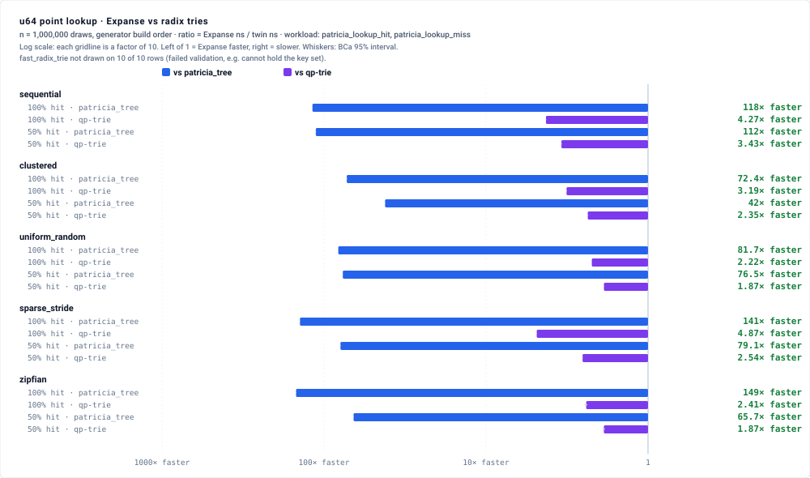
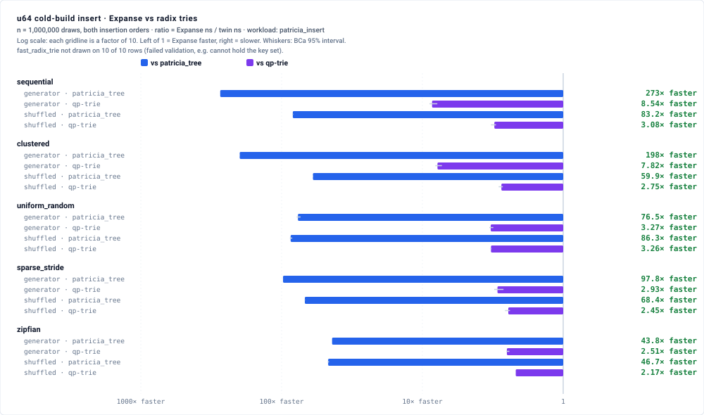
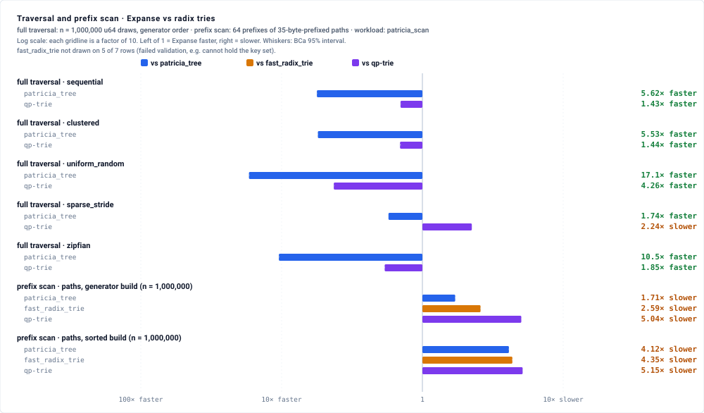
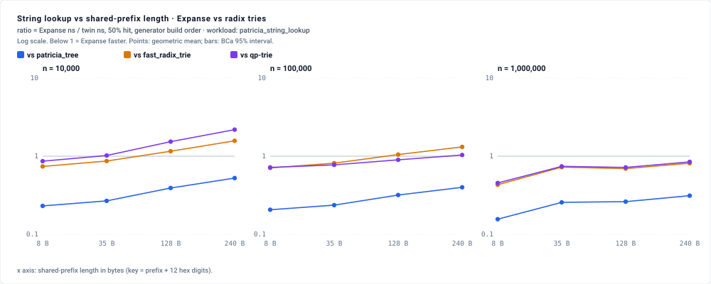
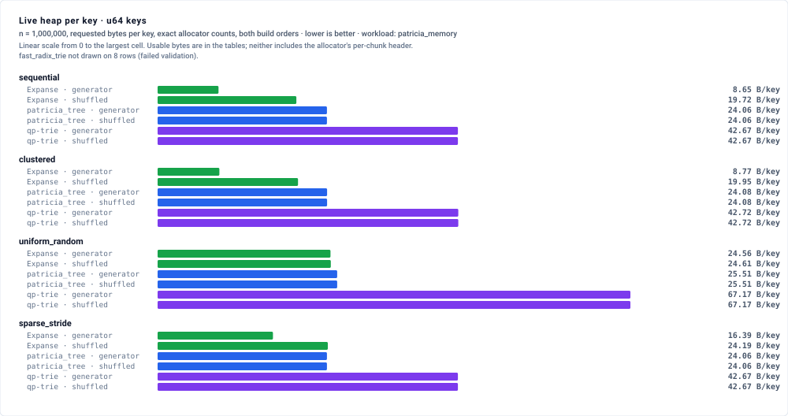
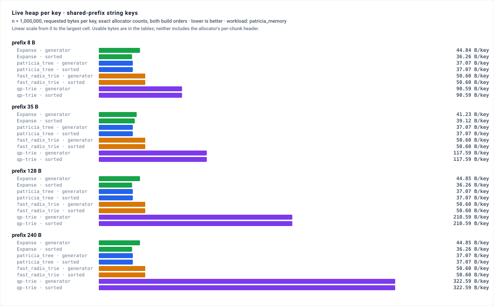

# Expanse vs. Patricia and Radix Tries

<!-- Generated by scripts/generate_readme.py from results/baseline_*.json; do not edit by hand. -->

`ExpanseMap` and `ExpanseStrMap` against three compressed radix tries that differ in how a node finds its child: [`patricia_tree`](https://github.com/sile/patricia_tree) `=0.10.2` (linked sibling list), [`fast_radix_trie`](https://github.com/bluecatengineering/fast_radix_trie) `=1.2.0` (inline child array; its `u8` child count cannot hold the `u64` key sets here, recorded `invalid`), and [`qp-trie`](https://github.com/sdleffler/qp-trie-rs) `=0.8.2` (nybble branch). Design, envelope, pre-registration and claims ceiling: [METHODOLOGY.md](METHODOLOGY.md).

## Provenance

- Host: 12th Gen Intel(R) Core(TM) i9-12900F (24 threads, 30 MiB L3, Linux 6.8.0-136-generic); core pin `0-15`; governor `powersave`.
- Commit `6000b4a1`; run https://github.com/orieg/expanse/actions/runs/36092319875.
- Load: 21 snapshots, one before every harness population and one at the end (present); largest busy-CPU delta from processes outside the run 0.03 core-equivalents (§8.17 contamination threshold: about 1).

## Pre-registered verdicts

Evaluated at n ∈ {100,000, 1,000,000}, both build orders, under METHODOLOGY.md §3 (measured: 12th Gen Intel(R) Core(TM) i9-12900F (24 threads, 30 MiB L3, Linux 6.8.0-136-generic), 6000b4a1). No independent peer review.

| Prediction | Cells | Verdict | Breakdown |
|---|---|---|---|
| P1 `patricia_lookup_hit` vs `patricia_tree` | 20 | PASS | PASS 20 |
| P2 `patricia_lookup_miss` vs `patricia_tree` | 20 | PASS | PASS 20 |
| P3 `patricia_insert` vs `patricia_tree` | 20 | PASS | PASS 20 |
| P4 `patricia_scan` full traversal vs `patricia_tree` | 20 | PASS | PASS 20 |
| P5 `fast_radix_trie` invalid on full-byte-range `u64` sets | 48 | PASS | exact |
| P6 `fast_radix_trie` valid on every path cell | 46 | PASS | exact |
| P7 `patricia_tree` requested bytes equal the census | 24 | PASS | exact |
| P8 Expanse fewer requested bytes than `patricia_tree` (sequential, clustered) | 8 | PASS | exact |
| T1 string-lookup ratio rises with prefix length | 6 | PASS | PASS 6 |

## Losses and qualifications

Every evaluated cell whose interval lies wholly above 1, where the ratio is Expanse ns ÷ twin ns (so Expanse is slower); none of them is covered by a prediction, so each is an `UNPREDICTED_LOSS`.

- T1 at n = 1,000,000 against `fast_radix_trie` passes on its 8-vs-240 rule, but the four point estimates are not monotone in prefix length.
- T1 at n = 1,000,000 against `qp_trie` passes on its 8-vs-240 rule, but the four point estimates are not monotone in prefix length.
- UNPREDICTED_LOSS — `patricia_scan` full_traversal sequential generator, n = 100,000, against `qp_trie`: 1.2888 [1.2686, 1.3037]
- UNPREDICTED_LOSS — `patricia_scan` full_traversal sequential shuffled, n = 100,000, against `qp_trie`: 1.0601 [1.0529, 1.0650]
- UNPREDICTED_LOSS — `patricia_scan` full_traversal clustered generator, n = 100,000, against `qp_trie`: 1.3004 [1.2952, 1.3056]
- UNPREDICTED_LOSS — `patricia_scan` full_traversal clustered shuffled, n = 100,000, against `qp_trie`: 1.0708 [1.0688, 1.0728]
- UNPREDICTED_LOSS — `patricia_scan` full_traversal uniform_random generator, n = 100,000, against `qp_trie`: 1.2054 [1.2014, 1.2095]
- UNPREDICTED_LOSS — `patricia_scan` full_traversal uniform_random shuffled, n = 100,000, against `qp_trie`: 1.2089 [1.2048, 1.2130]
- UNPREDICTED_LOSS — `patricia_scan` full_traversal sparse_stride generator, n = 100,000, against `qp_trie`: 4.1039 [4.0946, 4.1243]
- UNPREDICTED_LOSS — `patricia_scan` full_traversal sparse_stride shuffled, n = 100,000, against `qp_trie`: 3.3173 [3.3084, 3.3342]
- UNPREDICTED_LOSS — `patricia_scan` prefix_scan prefixed_path 35 generator, n = 100,000, against `qp_trie`: 1.3666 [1.3502, 1.3834]
- UNPREDICTED_LOSS — `patricia_scan` prefix_scan prefixed_path 35 sorted, n = 100,000, against `qp_trie`: 1.4812 [1.4754, 1.4851]
- UNPREDICTED_LOSS — `patricia_scan` full_traversal sparse_stride generator, n = 1,000,000, against `qp_trie`: 2.2346 [2.2265, 2.2518]
- UNPREDICTED_LOSS — `patricia_scan` full_traversal sparse_stride shuffled, n = 1,000,000, against `qp_trie`: 1.0636 [1.0600, 1.0681]
- UNPREDICTED_LOSS — `patricia_scan` prefix_scan prefixed_path 35 generator, n = 1,000,000, against `fast_radix_trie`: 1.1253 [1.1232, 1.1272]
- UNPREDICTED_LOSS — `patricia_scan` prefix_scan prefixed_path 35 generator, n = 1,000,000, against `qp_trie`: 2.2998 [2.2857, 2.3076]
- UNPREDICTED_LOSS — `patricia_scan` prefix_scan prefixed_path 35 sorted, n = 1,000,000, against `patricia_tree`: 1.1699 [1.1660, 1.1731]
- UNPREDICTED_LOSS — `patricia_scan` prefix_scan prefixed_path 35 sorted, n = 1,000,000, against `fast_radix_trie`: 1.2081 [1.2026, 1.2115]
- UNPREDICTED_LOSS — `patricia_scan` prefix_scan prefixed_path 35 sorted, n = 1,000,000, against `qp_trie`: 1.4511 [1.4469, 1.4553]
- UNPREDICTED_LOSS — `patricia_string_lookup` prefixed_path 128 generator, n = 100,000, against `fast_radix_trie`: 1.0968 [1.0818, 1.1026]
- UNPREDICTED_LOSS — `patricia_string_lookup` prefixed_path 128 sorted, n = 100,000, against `fast_radix_trie`: 1.1938 [1.1877, 1.1984]
- UNPREDICTED_LOSS — `patricia_string_lookup` prefixed_path 240 generator, n = 100,000, against `fast_radix_trie`: 1.2984 [1.2895, 1.3055]
- UNPREDICTED_LOSS — `patricia_string_lookup` prefixed_path 240 generator, n = 100,000, against `qp_trie`: 1.0299 [1.0270, 1.0321]
- UNPREDICTED_LOSS — `patricia_string_lookup` prefixed_path 240 sorted, n = 100,000, against `fast_radix_trie`: 1.4280 [1.4239, 1.4309]
- UNPREDICTED_LOSS — `patricia_string_lookup` prefixed_path 240 sorted, n = 100,000, against `qp_trie`: 1.0920 [1.0892, 1.0945]
- Outside the evaluated n (`NOT_PREREGISTERED`), 26 further cells have Expanse slower; they are in the tables below.

## Charts

Generated by `scripts/generate_charts.py` from the same artifacts. Timing charts use a log axis centred on 1, so bar length understates large ratios; the tables below carry every value and interval (measured: 12th Gen Intel(R) Core(TM) i9-12900F (24 threads, 30 MiB L3, Linux 6.8.0-136-generic), 6000b4a1).

## Results

(measured: 12th Gen Intel(R) Core(TM) i9-12900F (24 threads, 30 MiB L3, Linux 6.8.0-136-generic), 6000b4a1)

### Point lookup, 100% hit (workload: patricia_lookup_hit)

Ratio = Expanse ns ÷ twin ns, geometric mean of per-round ratios with its BCa 95% interval; below 1 means Expanse is faster. `invalid` = the twin failed validation and was not timed.

| n | cell | vs `patricia_tree` | vs `fast_radix_trie` | vs `qp_trie` |
|---|---|---|---|---|
| 10,000 | sequential / generator | 0.0069 [0.0067, 0.0071] | invalid | 0.3971 [0.3931, 0.4011] |
| 10,000 | sequential / shuffled | 0.0052 [0.0052, 0.0053] | invalid | 0.4046 [0.4004, 0.4078] |
| 10,000 | clustered / generator | 0.0110 [0.0109, 0.0110] | invalid | 0.5565 [0.5557, 0.5574] |
| 10,000 | clustered / shuffled | 0.0077 [0.0077, 0.0077] | invalid | 0.5591 [0.5587, 0.5596] |
| 10,000 | uniform_random / generator | 0.0114 [0.0114, 0.0114] | invalid | 0.5026 [0.5013, 0.5041] |
| 10,000 | uniform_random / shuffled | 0.0112 [0.0112, 0.0112] | invalid | 0.5000 [0.4988, 0.5013] |
| 10,000 | sparse_stride / generator | 0.0074 [0.0074, 0.0075] | invalid | 0.4088 [0.4075, 0.4104] |
| 10,000 | sparse_stride / shuffled | 0.0051 [0.0051, 0.0051] | invalid | 0.4112 [0.4093, 0.4137] |
| 100,000 | sequential / generator | 0.0076 [0.0075, 0.0076] | invalid | 0.4222 [0.4207, 0.4233] |
| 100,000 | sequential / shuffled | 0.0041 [0.0041, 0.0041] | invalid | 0.4299 [0.4291, 0.4310] |
| 100,000 | clustered / generator | 0.0156 [0.0156, 0.0156] | invalid | 0.5117 [0.5090, 0.5128] |
| 100,000 | clustered / shuffled | 0.0069 [0.0069, 0.0069] | invalid | 0.5382 [0.5371, 0.5393] |
| 100,000 | uniform_random / generator | 0.0092 [0.0092, 0.0093] | invalid | 0.6605 [0.6580, 0.6623] |
| 100,000 | uniform_random / shuffled | 0.0090 [0.0090, 0.0091] | invalid | 0.6573 [0.6559, 0.6592] |
| 100,000 | sparse_stride / generator | 0.0070 [0.0070, 0.0070] | invalid | 0.4366 [0.4354, 0.4381] |
| 100,000 | sparse_stride / shuffled | 0.0036 [0.0036, 0.0037] | invalid | 0.4364 [0.4332, 0.4384] |
| 25,177 | zipfian / generator | 0.0091 [0.0091, 0.0091] | invalid | 0.4355 [0.4339, 0.4374] |
| 25,177 | zipfian / shuffled | 0.0090 [0.0090, 0.0090] | invalid | 0.4335 [0.4317, 0.4354] |
| 1,000,000 | sequential / generator | 0.0083 [0.0083, 0.0084] | invalid | 0.2347 [0.2335, 0.2360] |
| 1,000,000 | sequential / shuffled | 0.0027 [0.0027, 0.0027] | invalid | 0.2382 [0.2371, 0.2396] |
| 1,000,000 | clustered / generator | 0.0137 [0.0137, 0.0137] | invalid | 0.3191 [0.3170, 0.3218] |
| 1,000,000 | clustered / shuffled | 0.0050 [0.0050, 0.0050] | invalid | 0.3359 [0.3341, 0.3382] |
| 1,000,000 | uniform_random / generator | 0.0120 [0.0120, 0.0121] | invalid | 0.4493 [0.4478, 0.4510] |
| 1,000,000 | uniform_random / shuffled | 0.0121 [0.0121, 0.0121] | invalid | 0.4547 [0.4539, 0.4555] |
| 1,000,000 | sparse_stride / generator | 0.0071 [0.0070, 0.0071] | invalid | 0.2083 [0.2076, 0.2090] |
| 1,000,000 | sparse_stride / shuffled | 0.0022 [0.0022, 0.0023] | invalid | 0.2129 [0.2124, 0.2134] |
| 226,479 | zipfian / generator | 0.0066 [0.0066, 0.0066] | invalid | 0.4112 [0.4024, 0.4184] |
| 226,479 | zipfian / shuffled | 0.0066 [0.0065, 0.0066] | invalid | 0.4122 [0.4028, 0.4210] |

### Point lookup, 50% hit, in-range misses (workload: patricia_lookup_miss)

Ratio = Expanse ns ÷ twin ns, geometric mean of per-round ratios with its BCa 95% interval; below 1 means Expanse is faster. `invalid` = the twin failed validation and was not timed.

| n | cell | vs `patricia_tree` | vs `fast_radix_trie` | vs `qp_trie` |
|---|---|---|---|---|
| 10,000 | sequential / generator | 0.0191 [0.0187, 0.0196] | 0.1321 [0.1313, 0.1332] | 0.5315 [0.5304, 0.5331] |
| 10,000 | sequential / shuffled | 0.0147 [0.0147, 0.0147] | 0.1224 [0.1219, 0.1229] | 0.5342 [0.5329, 0.5354] |
| 10,000 | clustered / generator | 0.0400 [0.0399, 0.0401] | 0.2074 [0.2067, 0.2080] | 0.6263 [0.6223, 0.6294] |
| 10,000 | clustered / shuffled | 0.0271 [0.0271, 0.0272] | 0.1881 [0.1875, 0.1889] | 0.6286 [0.6230, 0.6339] |
| 10,000 | uniform_random / generator | 0.0150 [0.0149, 0.0150] | invalid | 0.6646 [0.6492, 0.6776] |
| 10,000 | uniform_random / shuffled | 0.0151 [0.0151, 0.0152] | invalid | 0.6508 [0.6378, 0.6639] |
| 10,000 | sparse_stride / generator | 0.0235 [0.0234, 0.0235] | 0.1622 [0.1619, 0.1627] | 0.6416 [0.6388, 0.6433] |
| 10,000 | sparse_stride / shuffled | 0.0171 [0.0170, 0.0171] | 0.1445 [0.1440, 0.1450] | 0.6461 [0.6438, 0.6481] |
| 100,000 | sequential / generator | 0.0103 [0.0103, 0.0103] | invalid | 0.4779 [0.4770, 0.4786] |
| 100,000 | sequential / shuffled | 0.0079 [0.0078, 0.0079] | invalid | 0.4862 [0.4854, 0.4881] |
| 100,000 | clustered / generator | 0.0325 [0.0325, 0.0326] | 0.1892 [0.1888, 0.1898] | 0.6129 [0.6118, 0.6143] |
| 100,000 | clustered / shuffled | 0.0183 [0.0183, 0.0183] | 0.1484 [0.1480, 0.1486] | 0.6244 [0.6233, 0.6254] |
| 100,000 | uniform_random / generator | 0.0102 [0.0102, 0.0102] | invalid | 0.6369 [0.6329, 0.6389] |
| 100,000 | uniform_random / shuffled | 0.0102 [0.0102, 0.0102] | invalid | 0.6352 [0.6337, 0.6367] |
| 100,000 | sparse_stride / generator | 0.0132 [0.0131, 0.0132] | invalid | 0.5761 [0.5750, 0.5773] |
| 100,000 | sparse_stride / shuffled | 0.0090 [0.0090, 0.0090] | invalid | 0.5885 [0.5873, 0.5897] |
| 24,298 | zipfian / generator | 0.0238 [0.0238, 0.0239] | invalid | 0.7680 [0.7643, 0.7711] |
| 24,298 | zipfian / shuffled | 0.0234 [0.0233, 0.0234] | invalid | 0.7683 [0.7647, 0.7712] |
| 1,000,000 | sequential / generator | 0.0090 [0.0090, 0.0091] | invalid | 0.2946 [0.2932, 0.2960] |
| 1,000,000 | sequential / shuffled | 0.0060 [0.0059, 0.0060] | invalid | 0.3362 [0.3342, 0.3388] |
| 1,000,000 | clustered / generator | 0.0237 [0.0237, 0.0238] | invalid | 0.4239 [0.4216, 0.4265] |
| 1,000,000 | clustered / shuffled | 0.0108 [0.0108, 0.0109] | invalid | 0.4585 [0.4560, 0.4628] |
| 1,000,000 | uniform_random / generator | 0.0133 [0.0132, 0.0133] | invalid | 0.5435 [0.5420, 0.5448] |
| 1,000,000 | uniform_random / shuffled | 0.0132 [0.0132, 0.0133] | invalid | 0.5418 [0.5388, 0.5430] |
| 1,000,000 | sparse_stride / generator | 0.0128 [0.0128, 0.0128] | invalid | 0.4003 [0.3993, 0.4012] |
| 1,000,000 | sparse_stride / shuffled | 0.0071 [0.0071, 0.0071] | invalid | 0.4144 [0.4135, 0.4157] |
| 219,472 | zipfian / generator | 0.0154 [0.0153, 0.0154] | invalid | 0.5375 [0.5251, 0.5463] |
| 219,472 | zipfian / shuffled | 0.0154 [0.0153, 0.0154] | invalid | 0.5419 [0.5324, 0.5494] |

### Cold-build insert (generator order, then shuffled) (workload: patricia_insert)

Ratio = Expanse ns ÷ twin ns, geometric mean of per-round ratios with its BCa 95% interval; below 1 means Expanse is faster. `invalid` = the twin failed validation and was not timed.

| n | cell | vs `patricia_tree` | vs `fast_radix_trie` | vs `qp_trie` |
|---|---|---|---|---|
| 10,000 | sequential | 0.0068 [0.0068, 0.0069] 0.0310 [0.0309, 0.0311] | invalid | 0.2251 [0.2234, 0.2263] 0.4583 [0.4569, 0.4598] |
| 10,000 | clustered | 0.0092 [0.0092, 0.0092] 0.0436 [0.0435, 0.0438] | invalid | 0.2655 [0.2641, 0.2664] 0.5691 [0.5680, 0.5703] |
| 10,000 | uniform_random | 0.0406 [0.0405, 0.0407] 0.0400 [0.0399, 0.0401] | invalid | 0.8203 [0.8126, 0.8266] 0.8302 [0.8273, 0.8333] |
| 10,000 | sparse_stride | 0.0166 [0.0165, 0.0167] 0.0390 [0.0389, 0.0391] | invalid | 0.5505 [0.5491, 0.5520] 0.5774 [0.5759, 0.5787] |
| 100,000 | sequential | 0.0039 [0.0039, 0.0039] 0.0156 [0.0155, 0.0156] | invalid | 0.1698 [0.1684, 0.1728] 0.3827 [0.3769, 0.3856] |
| 100,000 | clustered | 0.0081 [0.0080, 0.0081] 0.0292 [0.0291, 0.0293] | invalid | 0.1866 [0.1853, 0.1891] 0.4554 [0.4462, 0.4600] |
| 100,000 | uniform_random | 0.0164 [0.0163, 0.0165] 0.0159 [0.0157, 0.0160] | invalid | 0.4027 [0.3993, 0.4059] 0.4324 [0.4199, 0.4387] |
| 100,000 | sparse_stride | 0.0099 [0.0099, 0.0099] 0.0188 [0.0187, 0.0189] | invalid | 0.4754 [0.4735, 0.4777] 0.4798 [0.4773, 0.4837] |
| 25,177 | zipfian | 0.0347 [0.0346, 0.0347] 0.0328 [0.0326, 0.0331] | invalid | 0.4603 [0.4587, 0.4613] 0.4578 [0.4572, 0.4588] |
| 1,000,000 | sequential | 0.0036 [0.0036, 0.0036] 0.0121 [0.0120, 0.0122] | invalid | 0.1159 [0.1111, 0.1262] 0.3258 [0.3082, 0.3348] |
| 1,000,000 | clustered | 0.0051 [0.0051, 0.0051] 0.0168 [0.0167, 0.0168] | invalid | 0.1290 [0.1244, 0.1388] 0.3658 [0.3487, 0.3746] |
| 1,000,000 | uniform_random | 0.0132 [0.0129, 0.0137] 0.0116 [0.0115, 0.0119] | invalid | 0.3054 [0.2971, 0.3185] 0.3077 [0.3037, 0.3097] |
| 1,000,000 | sparse_stride | 0.0103 [0.0103, 0.0103] 0.0147 [0.0146, 0.0147] | invalid | 0.3439 [0.3264, 0.3798] 0.4097 [0.3871, 0.4211] |
| 226,479 | zipfian | 0.0232 [0.0231, 0.0232] 0.0217 [0.0215, 0.0220] | invalid | 0.4037 [0.3996, 0.4202] 0.4645 [0.4621, 0.4659] |

### String lookup, 50% hit, by shared-prefix length (workload: patricia_string_lookup)

Ratio = Expanse ns ÷ twin ns, geometric mean of per-round ratios with its BCa 95% interval; below 1 means Expanse is faster. `invalid` = the twin failed validation and was not timed.

| n | cell | vs `patricia_tree` | vs `fast_radix_trie` | vs `qp_trie` |
|---|---|---|---|---|
| 10,000 | prefix 8 / generator | 0.2342 [0.2335, 0.2358] | 0.7513 [0.7488, 0.7550] | 0.8805 [0.8770, 0.8842] |
| 10,000 | prefix 8 / sorted | 0.2455 [0.2451, 0.2459] | 0.7808 [0.7794, 0.7822] | 0.8948 [0.8923, 0.8969] |
| 10,000 | prefix 35 / generator | 0.2594 [0.2591, 0.2597] | 0.8700 [0.8673, 0.8720] | 1.0314 [1.0302, 1.0331] |
| 10,000 | prefix 35 / sorted | 0.2731 [0.2726, 0.2739] | 0.9024 [0.9000, 0.9048] | 1.0481 [1.0462, 1.0495] |
| 10,000 | prefix 128 / generator | 0.3886 [0.3872, 0.3895] | 1.3027 [1.2970, 1.3066] | 1.5252 [1.5189, 1.5306] |
| 10,000 | prefix 128 / sorted | 0.4074 [0.4064, 0.4084] | 1.3425 [1.3372, 1.3483] | 1.5523 [1.5451, 1.5560] |
| 10,000 | prefix 240 / generator | 0.5195 [0.5187, 0.5205] | 1.5995 [1.5917, 1.6048] | 2.1749 [2.1680, 2.1823] |
| 10,000 | prefix 240 / sorted | 0.5707 [0.5702, 0.5715] | 1.7408 [1.7178, 1.7532] | 2.3299 [2.3216, 2.3338] |
| 100,000 | prefix 8 / generator | 0.2077 [0.2064, 0.2088] | 0.7134 [0.7118, 0.7151] | 0.7102 [0.7013, 0.7179] |
| 100,000 | prefix 8 / sorted | 0.2547 [0.2538, 0.2557] | 0.7797 [0.7767, 0.7831] | 0.7415 [0.7325, 0.7493] |
| 100,000 | prefix 35 / generator | 0.2303 [0.2289, 0.2313] | 0.8152 [0.8074, 0.8184] | 0.7769 [0.7646, 0.7872] |
| 100,000 | prefix 35 / sorted | 0.2817 [0.2808, 0.2823] | 0.8934 [0.8913, 0.8960] | 0.8159 [0.8064, 0.8242] |
| 100,000 | prefix 128 / generator | 0.3132 [0.3125, 0.3139] | 1.0968 [1.0818, 1.1026] | 0.8720 [0.8651, 0.8769] |
| 100,000 | prefix 128 / sorted | 0.3763 [0.3751, 0.3774] | 1.1938 [1.1877, 1.1984] | 0.9348 [0.9295, 0.9389] |
| 100,000 | prefix 240 / generator | 0.3986 [0.3971, 0.3996] | 1.2984 [1.2895, 1.3055] | 1.0299 [1.0270, 1.0321] |
| 100,000 | prefix 240 / sorted | 0.4774 [0.4752, 0.4787] | 1.4280 [1.4239, 1.4309] | 1.0920 [1.0892, 1.0945] |
| 1,000,000 | prefix 8 / generator | 0.1567 [0.1564, 0.1570] | 0.4378 [0.4370, 0.4384] | 0.4506 [0.4500, 0.4511] |
| 1,000,000 | prefix 8 / sorted | 0.2118 [0.2114, 0.2121] | 0.5159 [0.5151, 0.5164] | 0.4874 [0.4869, 0.4881] |
| 1,000,000 | prefix 35 / generator | 0.2564 [0.2558, 0.2571] | 0.7235 [0.7225, 0.7256] | 0.7431 [0.7414, 0.7446] |
| 1,000,000 | prefix 35 / sorted | 0.3456 [0.3450, 0.3463] | 0.8312 [0.8303, 0.8324] | 0.7916 [0.7897, 0.7927] |
| 1,000,000 | prefix 128 / generator | 0.2605 [0.2601, 0.2608] | 0.6921 [0.6913, 0.6928] | 0.7105 [0.7099, 0.7111] |
| 1,000,000 | prefix 128 / sorted | 0.3580 [0.3576, 0.3594] | 0.8291 [0.8277, 0.8332] | 0.7743 [0.7722, 0.7771] |
| 1,000,000 | prefix 240 / generator | 0.3082 [0.3079, 0.3084] | 0.8007 [0.7997, 0.8019] | 0.8296 [0.8287, 0.8305] |
| 1,000,000 | prefix 240 / sorted | 0.4279 [0.4268, 0.4312] | 0.9519 [0.9483, 0.9626] | 0.9085 [0.9050, 0.9177] |

### Full traversal and prefix scan (workload: patricia_scan)

Ratio = Expanse ns ÷ twin ns, geometric mean of per-round ratios with its BCa 95% interval; below 1 means Expanse is faster. `invalid` = the twin failed validation and was not timed.

| n | cell | vs `patricia_tree` | vs `fast_radix_trie` | vs `qp_trie` |
|---|---|---|---|---|
| 10,000 | full_traversal sequential / generator | 0.1862 [0.1854, 0.1872] | invalid | 1.3536 [1.3463, 1.3588] |
| 10,000 | full_traversal sequential / shuffled | 0.1359 [0.1357, 0.1362] | invalid | 1.2414 [1.2368, 1.2451] |
| 10,000 | full_traversal clustered / generator | 0.1910 [0.1904, 0.1917] | invalid | 1.3660 [1.3623, 1.3725] |
| 10,000 | full_traversal clustered / shuffled | 0.1346 [0.1342, 0.1352] | invalid | 1.2564 [1.2525, 1.2622] |
| 10,000 | full_traversal uniform_random / generator | 0.7397 [0.7371, 0.7436] | invalid | 2.0527 [2.0437, 2.0679] |
| 10,000 | full_traversal uniform_random / shuffled | 0.7396 [0.7356, 0.7420] | invalid | 2.0210 [2.0124, 2.0307] |
| 10,000 | full_traversal sparse_stride / generator | 0.5876 [0.5846, 0.5890] | invalid | 4.1878 [4.1815, 4.1946] |
| 10,000 | full_traversal sparse_stride / shuffled | 0.4075 [0.4069, 0.4085] | invalid | 3.8017 [3.7929, 3.8098] |
| 10,000 | prefix_scan prefixed_path / generator | 1.5418 [1.5304, 1.5498] | 1.7271 [1.7084, 1.7415] | 4.7126 [4.6358, 4.7998] |
| 10,000 | prefix_scan prefixed_path / sorted | 1.7018 [1.6904, 1.7112] | 1.6948 [1.6695, 1.7342] | 4.1820 [4.1410, 4.2454] |
| 100,000 | full_traversal sequential / generator | 0.1838 [0.1758, 0.1887] | invalid | 1.2888 [1.2686, 1.3037] |
| 100,000 | full_traversal sequential / shuffled | 0.0720 [0.0719, 0.0722] | invalid | 1.0601 [1.0529, 1.0650] |
| 100,000 | full_traversal clustered / generator | 0.1918 [0.1914, 0.1926] | invalid | 1.3004 [1.2952, 1.3056] |
| 100,000 | full_traversal clustered / shuffled | 0.0733 [0.0732, 0.0735] | invalid | 1.0708 [1.0688, 1.0728] |
| 100,000 | full_traversal uniform_random / generator | 0.4517 [0.4506, 0.4536] | invalid | 1.2054 [1.2014, 1.2095] |
| 100,000 | full_traversal uniform_random / shuffled | 0.4505 [0.4479, 0.4522] | invalid | 1.2089 [1.2048, 1.2130] |
| 100,000 | full_traversal sparse_stride / generator | 0.5890 [0.5882, 0.5911] | invalid | 4.1039 [4.0946, 4.1243] |
| 100,000 | full_traversal sparse_stride / shuffled | 0.2244 [0.2239, 0.2256] | invalid | 3.3173 [3.3084, 3.3342] |
| 25,177 | full_traversal zipfian / generator | 0.1491 [0.1486, 0.1497] | invalid | 0.5087 [0.5060, 0.5108] |
| 25,177 | full_traversal zipfian / shuffled | 0.1470 [0.1463, 0.1479] | invalid | 0.5098 [0.5071, 0.5133] |
| 100,000 | prefix_scan prefixed_path / generator | 0.6549 [0.6507, 0.6600] | 0.7930 [0.7859, 0.8026] | 1.3666 [1.3502, 1.3834] |
| 100,000 | prefix_scan prefixed_path / sorted | 0.8953 [0.8925, 0.8977] | 0.9223 [0.9195, 0.9259] | 1.4812 [1.4754, 1.4851] |
| 1,000,000 | full_traversal sequential / generator | 0.1831 [0.1820, 0.1846] | invalid | 0.7184 [0.7143, 0.7234] |
| 1,000,000 | full_traversal sequential / shuffled | 0.0325 [0.0319, 0.0334] | invalid | 0.3863 [0.3844, 0.3887] |
| 1,000,000 | full_traversal clustered / generator | 0.1851 [0.1833, 0.1863] | invalid | 0.7079 [0.7025, 0.7147] |
| 1,000,000 | full_traversal clustered / shuffled | 0.0330 [0.0319, 0.0345] | invalid | 0.3977 [0.3957, 0.4003] |
| 1,000,000 | full_traversal uniform_random / generator | 0.0565 [0.0560, 0.0570] | invalid | 0.2367 [0.2356, 0.2376] |
| 1,000,000 | full_traversal uniform_random / shuffled | 0.0573 [0.0568, 0.0578] | invalid | 0.2375 [0.2367, 0.2384] |
| 1,000,000 | full_traversal sparse_stride / generator | 0.5729 [0.5701, 0.5777] | invalid | 2.2346 [2.2265, 2.2518] |
| 1,000,000 | full_traversal sparse_stride / shuffled | 0.0893 [0.0884, 0.0906] | invalid | 1.0636 [1.0600, 1.0681] |
| 226,479 | full_traversal zipfian / generator | 0.0978 [0.0972, 0.0984] | invalid | 0.5394 [0.5329, 0.5430] |
| 226,479 | full_traversal zipfian / shuffled | 0.0966 [0.0950, 0.0972] | invalid | 0.5437 [0.5407, 0.5469] |
| 1,000,000 | prefix_scan prefixed_path / generator | 0.7747 [0.7705, 0.7780] | 1.1253 [1.1232, 1.1272] | 2.2998 [2.2857, 2.3076] |
| 1,000,000 | prefix_scan prefixed_path / sorted | 1.1699 [1.1660, 1.1731] | 1.2081 [1.2026, 1.2115] | 1.4511 [1.4469, 1.4553] |

### Prefix scan: `cursor_prefix` vs the unbounded walk (workload: patricia_scan)

Ratio = `cursor_prefix` ns ÷ `cursor_at_or_after` + per-key `starts_with` ns, both on `ExpanseStrMap`, each on its own map, timed in the same rounds as the twins; geometric mean of per-round ratios with its BCa 95% interval. Below 1 means `cursor_prefix` is faster.

| n | order | `cursor_prefix` ns/prefix | unbounded ns/prefix | ratio |
|---|---|---|---|---|
| 10,000 | generator | 875 | 960 | 0.9101 [0.9057, 0.9120] |
| 10,000 | sorted | 862 | 946 | 0.9137 [0.9106, 0.9226] |
| 100,000 | generator | 4,915 | 5,706 | 0.8615 [0.8553, 0.8681] |
| 100,000 | sorted | 4,361 | 5,299 | 0.8264 [0.8227, 0.8303] |
| 1,000,000 | generator | 161,445 | 173,789 | 0.9263 [0.9229, 0.9293] |
| 1,000,000 | sorted | 57,177 | 71,336 | 0.7989 [0.7947, 0.8017] |

### Live heap (workload: patricia_memory)

Requested / usable bytes per key (`malloc_usable_size`); exact counts. Usable size excludes the allocator's per-chunk header, so neither column is the full resident footprint of small nodes. Orders: `u64` generator / shuffled, paths generator / sorted.

| n | key set | `expanse` | `patricia_tree` | `fast_radix_trie` | `qp_trie` |
|---|---|---|---|---|---|
| 100,000 | sequential | 9.29 / 9.55 20.35 / 20.66 | 24.06 / 24.10 24.06 / 24.10 | invalid invalid | 42.73 / 43.27 42.73 / 43.48 |
| 100,000 | clustered | 9.56 / 9.82 20.70 / 21.00 | 24.08 / 24.13 24.08 / 24.13 | invalid invalid | 42.76 / 43.30 42.76 / 43.51 |
| 100,000 | uniform_random | 30.49 / 30.62 30.58 / 30.69 | 30.54 / 34.68 30.54 / 34.68 | invalid invalid | 64.60 / 67.62 64.60 / 67.60 |
| 100,000 | sparse_stride | 17.09 / 17.16 24.87 / 24.97 | 24.06 / 24.11 24.06 / 24.11 | invalid invalid | 42.73 / 43.27 42.73 / 43.47 |
| 100,000 | path, prefix 8 | 45.49 / 50.08 37.87 / 42.06 | 37.94 / 44.51 37.94 / 43.59 | 51.93 / 60.76 51.93 / 60.75 | 94.20 / 104.15 94.20 / 103.79 |
| 100,000 | path, prefix 35 | 46.64 / 47.87 37.91 / 39.03 | 37.94 / 43.59 37.94 / 43.60 | 51.93 / 60.75 51.93 / 60.75 | 121.20 / 135.24 121.20 / 134.76 |
| 100,000 | path, prefix 128 | 45.50 / 50.12 37.88 / 42.09 | 37.94 / 44.51 37.94 / 43.59 | 51.93 / 60.76 51.93 / 60.76 | 214.20 / 231.86 214.20 / 231.97 |
| 100,000 | path, prefix 240 | 45.50 / 50.12 37.88 / 42.10 | 37.94 / 44.51 37.94 / 43.60 | 51.93 / 60.76 51.93 / 60.77 | 326.20 / 342.77 326.20 / 342.72 |
| 1,000,000 | sequential | 8.65 / 8.91 19.72 / 20.01 | 24.06 / 24.09 24.06 / 24.09 | invalid invalid | 42.67 / 43.20 42.67 / 43.41 |
| 1,000,000 | clustered | 8.77 / 9.03 19.95 / 20.23 | 24.08 / 24.12 24.08 / 24.12 | invalid invalid | 42.72 / 43.26 42.72 / 43.47 |
| 1,000,000 | uniform_random | 24.56 / 24.81 24.61 / 24.85 | 25.51 / 26.27 25.51 / 26.27 | invalid invalid | 67.17 / 70.01 67.17 / 69.95 |
| 1,000,000 | sparse_stride | 16.39 / 16.46 24.19 / 24.28 | 24.06 / 24.10 24.06 / 24.10 | invalid invalid | 42.67 / 43.20 42.67 / 43.41 |
| 1,000,000 | path, prefix 8 | 44.84 / 49.26 36.26 / 40.53 | 37.07 / 44.27 37.07 / 42.91 | 50.60 / 58.84 50.60 / 58.84 | 90.59 / 100.40 90.59 / 100.15 |
| 1,000,000 | path, prefix 35 | 41.23 / 42.25 39.12 / 40.11 | 37.07 / 42.91 37.07 / 42.91 | 50.60 / 58.84 50.60 / 58.84 | 117.59 / 131.29 117.59 / 130.87 |
| 1,000,000 | path, prefix 128 | 44.85 / 49.26 36.26 / 40.53 | 37.07 / 44.27 37.07 / 42.91 | 50.60 / 58.86 50.60 / 58.84 | 210.59 / 228.24 210.59 / 228.29 |
| 1,000,000 | path, prefix 240 | 44.85 / 49.26 36.26 / 40.53 | 37.07 / 42.91 37.07 / 42.91 | 50.60 / 58.86 50.60 / 58.85 | 322.59 / 338.85 322.59 / 338.86 |
