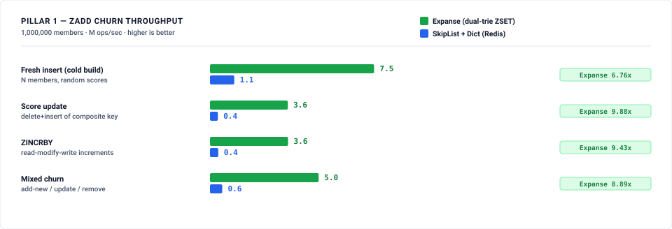
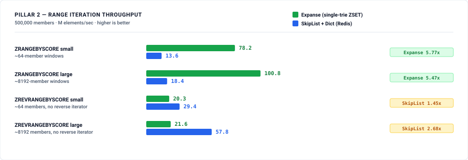
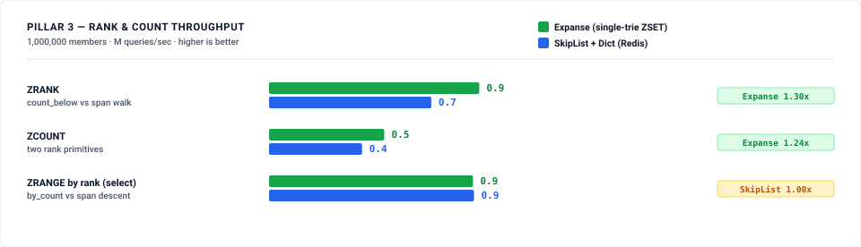
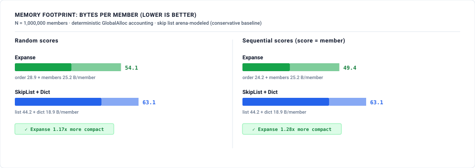

# Redis ZSET Engine: Expanse dual-trie sorted set vs SkipList + Dict

A head-to-head benchmark of an **Expanse** sorted-set engine against Redis's
actual ZSET design — a **skip list** (score ordering + rank) plus a **hash
dict** (member → score). Redis, KeyDB, Dragonfly, and Valkey all use the
skip-list + dict pair for leaderboards, rate limiters, priority queues, and
time-series indexing.

Full design derivation, claims ceiling, and pre-registered expected losses are
in [METHODOLOGY.md](METHODOLOGY.md). This page is the results.

---

## Design verdict (the claim under test)

The issue asks whether Expanse does in a **single** structure what Redis does in
two. **It does not — and this suite says so plainly.**

A sorted set needs two distinct keyings: **by member** (for `ZSCORE`, `ZREM`,
`ZINCRBY`, and the score half of `ZRANK`) and **by `(score, member)`** (for
range, rank, count). No single Expanse structure serves both: a composite-key
map cannot look up a member (member is in the key's low bits, not a prefix), and
a member-keyed map has no score order. So the Expanse ZSET is **dual**, exactly
like Redis:

* `order`: an `ExpanseMap` keyed by `(score << 32) | member` — range, rank, count.
* `members`: an `ExpanseMap` keyed by `member` — `ZSCORE`, `ZREM`, `ZINCRBY`.

What that dual buys over Redis's dual is the real thesis, and it holds up:

1. **Homogeneous & compact** — both halves are the same cache-conscious digital
   trie, versus a random-height pointer skip list + a hash table.
2. **Rank without span bookkeeping** — `ZRANK`/`ZCOUNT` come from
   `count_below`/`count_range`, an `O(depth)` walk over *precomputed* subtree
   population counters. Redis must maintain per-level span counters on every
   mutation to get `O(log n)` rank; Expanse gets it from the structure it
   already has. **A count-in-range / key→rank primitive already exists** — this
   was verified, not assumed.

**Bottom line:** "single structure" is **refuted**; "a better-shaped dual, with
native rank and a large memory win" is **supported** — with named, published
losses on `ZSCORE` of random members and rank-select. (Reverse range was a
pre-registered loss under the emulated `prev_at_or_before` re-descent; the
`range_rev` reverse ordered iterator (#341) turns it into a win — see Pillar 2.)

<!-- RESULTS_START -->
## Results

*(measured: reference host — Intel i9-12900F, 24 threads, 30 MiB L3, Ubuntu
22.04 / kernel 6.8, commit `379ac6aa`; single-threaded benches, host idle —
load 1.1–1.4 throughout; interleaved Expanse-then-SkipList arms, median of 5
rounds. Run with `run.sh`.)*

**Scorecard.** Expanse wins 9 of 13 measured cells; the 4 losses were all
pre-registered in [METHODOLOGY.md](METHODOLOGY.md) §4 before measuring.

| Pillar | Expanse wins | Expanse loses |
|---|---|---|
| ZADD churn | fresh insert, score update, ZINCRBY, mixed churn | — |
| Range | forward small + large | reverse small + large |
| Rank / count | ZRANK, ZCOUNT | ZRANGE-by-rank (select), a dead heat |
| Memory | all populations & score patterns | — |

### Pillar 1 — ZADD churn throughput (M ops/sec)



1,000,000 members, 1,000,000 ops/scenario, 5 rounds.

| scenario | Expanse | SkipList + Dict | result |
|---|--:|--:|---|
| fresh insert (cold build) | **7.51** | 1.11 | **6.76× Expanse** |
| score update (delete+insert) | **3.56** | 0.36 | **9.88× Expanse** |
| ZINCRBY | **3.57** | 0.38 | **9.43× Expanse** |
| mixed churn | **4.97** | 0.56 | **8.89× Expanse** |

Expanse wins churn outright: most trie inserts land in immediates or bitmap
leaves and allocate nothing, while every skip-list node is a heap allocation.
**Directional caveat (honest):** the reference skip list allocates its level
array as a separate `Box<[Lvl]>` — one extra allocation per node beyond Redis's
single flexible-array node — so it is allocation-bound and this gap is
*optimistic* for Expanse. A production single-allocation skip list would narrow
it; it would not close it (the trie still allocates far less per op).

### Pillar 2 — range iteration throughput (M elements/sec)



500,000 members, 5 rounds.

*(Pillar 2 re-measured for the reverse ordered iterator (#341): reference host —
Intel i9-12900F, 24 threads, 30 MiB L3, Ubuntu 22.04 / kernel 6.8, commit
`ad540acc`; single-threaded, host idle — load 0.01–0.25 throughout, no other
bench in-window; interleaved arms, median of 5 rounds. Pillars 1/3/4 remain at
the commit in the Results note above.)*

| scenario | Expanse (native) | Expanse (emulated) | SkipList + Dict | result |
|---|--:|--:|--:|---|
| ZRANGEBYSCORE, ~64-member windows | **80.5** | — | 13.6 | **5.92× Expanse** |
| ZRANGEBYSCORE, ~8192-member windows | **100.6** | — | 18.5 | **5.45× Expanse** |
| ZREVRANGEBYSCORE, ~64-member windows | **77.8** | 20.4 | 28.8 | **2.70× Expanse** (native 3.82× over emulated) |
| ZREVRANGEBYSCORE, ~8192-member windows | **90.2** | 21.7 | 55.2 | **1.63× Expanse** (native 4.16× over emulated) |

Forward iteration streams contiguous leaves and beats the skip list ~5.5×. The
reverse cells report two Expanse arms: `native` is the reverse ordered iterator
(`ExpanseMap::range_rev`, #341), an amortized descending leaf walk (`O(1)` per
member); `emulated` is the pre-#341 repeated-`prev_at_or_before` re-descent
(`O(depth)` per member). The native iterator turns both **pre-registered reverse
losses into wins** (2.70× / 1.63× over the skip list, 3.82× / 4.16× over the
emulated arm) and brings reverse throughput to within 1.2× of forward
(77.8/80.5 = 1.03×, 90.2/100.6 = 1.11×).

### Pillar 3 — rank & count throughput (M queries/sec)



1,000,000 members, 1,000,000 queries/scenario, 5 rounds.

| scenario | Expanse | SkipList + Dict | result |
|---|--:|--:|---|
| ZRANK | **0.93** (1080 ns) | 0.71 (1400 ns) | **1.30× Expanse** |
| ZCOUNT | **0.51** (1971 ns) | 0.41 (2440 ns) | **1.24× Expanse** |
| ZRANGE by rank (select) | 0.90 (1113 ns) | **0.90** (1108 ns) | dead heat (1.00×) |

The central question of the issue: Expanse's `count_below` (an `O(depth)` walk
over precomputed population counters) **beats** the skip list's `O(log n)` span
walk on ZRANK and ZCOUNT, and ties on select — while requiring *no* span
bookkeeping on mutations. Rank is not the weakness the "single structure"
framing implied it might be.

### Pillar 4 — memory footprint (bytes per member, lower is better)



Deterministic `GlobalAlloc` accounting; Expanse split into `order` + `members`
tries, SkipList+Dict into list + dict.

| pop | scores | Expanse (order+members) | SkipList+Dict (list+dict) | Expanse advantage |
|---|---|--:|--:|---|
| 100k | random | **49.5** (23.7+25.8) | 64.4 (52.6+11.8) | **1.30× smaller** |
| 100k | sequential | **50.4** (24.6+25.8) | 64.4 (52.6+11.8) | **1.28× smaller** |
| 1M | random | **54.1** (28.9+25.2) | 63.1 (44.2+18.9) | **1.17× smaller** |
| 1M | sequential | **49.4** (24.2+25.2) | 63.1 (44.2+18.9) | **1.28× smaller** |

Two compact tries beat a fat-node skip list + dict by 1.17–1.30×. **This is a
floor:** the skip list is arena-modeled (no per-node `malloc` header or
fragmentation) and members are `u32` inline, not Redis's heap `sds` strings — a
real Redis ZSET is materially larger than this baseline. At 1M random scores the
`order` trie loses some density (sparse composite keys), narrowing the gap to
1.17×; sequential-score leaderboards stay at 1.28×.

### Honest disclosure

* **Design claim:** "single structure" is **refuted** (§ Design verdict). Expanse
  is a dual-trie engine; the supported claim is a better-shaped dual.
* **Losing cells are published:** select (a dead heat) — pre-registered. Reverse
  range was a pre-registered loss (1.45–2.68× behind under emulated
  re-descent); the `range_rev` iterator (#341) now wins it (2.70× / 1.63×), and
  the emulated arm is retained in the suite for the comparison.
* **Churn magnitude is optimistic** for Expanse because the reference skip list
  double-allocates per node (disclosed above); the range/rank/count/memory wins
  do not depend on the allocation model (those paths allocate nothing, and the
  memory baseline is conservative toward the skip list).
* **Model limits:** members and scores are `u32`; Redis scores are doubles and
  members are strings. A full-fidelity port needs a 128-bit composite key or a
  monotonic double encoding — not exercised here.
* Single-author benchmark; no external peer review.
<!-- RESULTS_END -->

## Architectural comparison

| Property | SkipList + Dict (Redis) | Expanse dual-trie |
|---|---|---|
| Structures | Skip list (ordering) + hash dict (lookup) | `order` trie + `members` trie |
| Node shape | Random-height nodes, per-level `(forward, span)` | Class-sized adaptive trie nodes |
| `ZSCORE` | `O(1)` hash probe | `O(depth)` trie descent |
| `ZRANK` | `O(log n)` span accumulation | `O(depth)` `count_below` over pop counters |
| `ZRANGEBYSCORE` | `O(log n)` seek + `O(k)` forward links | `O(depth)` seek + `O(k)` leaf stream |
| `ZREVRANGEBYSCORE` | `O(k)` level-0 backward pointers | `O(depth)` seek + `O(k)` reverse leaf stream (`range_rev`, #341) |
| Rank maintenance | Hand-maintained spans every insert/delete | None — property of the trie |
| Score domain | IEEE double | `u32` (packed into the `u64` key here) |

## Reproduce

```bash
./docs/benchmarks/redis_zset_engine/run.sh          # full suite + charts
./docs/benchmarks/redis_zset_engine/run.sh --quick  # fast smoke (small N)
```

```
docs/benchmarks/redis_zset_engine/
├── README.md            # this report
├── METHODOLOGY.md       # design verdict, claims ceiling, measurement rules
├── run.sh               # 1-command reproduction
├── scripts/             # theme.py, run_all.py, generate_charts.py
└── results/             # baseline_*.json + dual-theme SVG charts
```

Benches: `crates/expanse/benches/zset_{zadd,range,rank,memory}.rs`, with the two
engine implementations and the `BTreeSet`-oracle correctness check in
`crates/expanse/benches/zset_common/mod.rs`.
