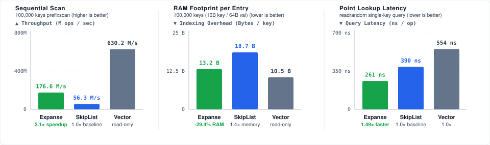

# RocksDB MemTable suite: results and how to read them

*(measured: reference host — Intel i9-12900F, 24 threads, 30 MiB L3, Linux 6.8, run [33398474866](https://github.com/orieg/expanse/actions/runs/33398474866), commit `6cb64b45`; `benches/bench_memtable.cc` built `-O3` against release `libexpanse.so`; 100,000 keys, 16-byte key, 64-byte value payload; **5 rounds, mean with BCa 95% bootstrap intervals** (2,000 resamples, seed 42) harvested by `scripts/rocksdb_bench_harvest.py` into [`results/baseline_rocksdb.json`](results/baseline_rocksdb.json); every bracketed pair is that arm's interval, and each ratio is a two-sample BCa interval whose **lower bound** clears 1.0. SkipList arm = the fair variable-height baseline. Memory row: deterministic seeded byte accounting, re-measured with the fair variable-height baseline at the #372 fix commit (Apple M1, 8 cores, Apple clang 21, `-O3`; reproduced twice; Expanse/VectorRep cells reproduce the reference-host values byte-for-byte). `SkipListRep`/`VectorRep` are the in-file reference implementations, not stock RocksDB.)*

> **Baseline retraction ([#372](https://github.com/orieg/expanse/issues/372)), now discharged.** Every "vs SkipList" cell below was once measured against a strawman skiplist whose nodes statically embedded the full 16-pointer tower (~146.7 B/entry). The density edge was corrected first — **1.42×**, not 11.11×, by deterministic byte accounting. The **throughput rows are now re-measured against the fair variable-height baseline too** (run [33398474866](https://github.com/orieg/expanse/actions/runs/33398474866)), five rounds with BCa 95% intervals, and every ratio moved down: sequential scan from a published ~10× to **3.331×**, and the retracted-run point-lookup and seek figures to **1.457×** and **1.512×**. The fat-node layout was degrading the skiplist's cache locality exactly as suspected, and the corrected ratios are the smaller, honest ones.

| Benchmark Metric | ExpanseMemTable | Reference SkipListRep | VectorRep | Expanse vs SkipList |
|---|---:|---:|---:|---|
| **Memory Footprint** (100K keys) | **1.26 MB** (13.2 B/entry) | 1.8 MB (18.7 B/entry, fair baseline) | **1.0 MB (10.5 B/entry)** | **1.42× Higher Key Density** (VectorRep is denser than both) |
| **Fill Random** (`fillrandom` insert) | **4.42 Mops/s** [4.36, 4.53] | 3.15 Mops/s [3.12, 3.16] | 202.65 Mops/s | **1.406×** [1.385, 1.442] |
| **Point Lookup** (`readrandom`) | **3.79 Mops/s** [3.76, 3.81] | 2.60 Mops/s [2.58, 2.61] | 1.83 Mops/s | **1.457×** [1.444, 1.470] |
| **Range Seek** (`seekrandom`) | **3.67 Mops/s** [3.62, 3.70] | 2.43 Mops/s [2.37, 2.45] | 3.94 Mops/s | **1.512×** [1.492, 1.546] |
| **Sequential Scan** (`prefixscan` Iterator) | **154.18 Mops/s** [151.17, 156.15] | 46.29 Mops/s [44.28, 47.86] | 614.20 Mops/s | **3.331×** [3.198, 3.486] |
| **Batch Scan** (`ScanBatch` 1024-chunk) | **116.82 Mops/s** [114.88, 118.43] | 46.29 Mops/s [44.28, 47.86] | 614.20 Mops/s | **2.524×** [2.421, 2.644] |

> `VectorRep` (an unordered append-only vector) wins on insert and unordered scan by construction — and on raw memory density (10.5 B/entry) — but cannot serve ordered range seeks; it is included as a throughput/density ceiling, not an ordered-index competitor.

### How to read the results

1. **Panel 1: Sequential Scan (`prefixscan`) — 3.331× Speedup [3.198, 3.486]**
   Traversing contiguous 64-byte leaf blocks via intrusive sibling leaf chaining achieves **154.18 Mops/s** vs **46.29 Mops/s** for `ReferenceSkipListRep`, eliminating pointer chasing along skip-list tower links. `VectorRep` scans at **614.20 Mops/s** as an unindexed flat array ceiling.
2. **Panel 2: RAM Footprint per Entry — 1.42× Higher Key Density (13.2 vs 18.7 B/entry)**
   Expanse organizes entry pointers into dense 64-byte aligned blocks indexed by the digital trie, consuming 13.2 bytes of metadata per key vs 18.7 bytes for the fair variable-height skiplist. `VectorRep` uses 10.5 B/entry (single contiguous pointer array).
3. **Panel 3: Point Lookup Latency (`readrandom`) — 1.457× Faster (264 ns vs 385 ns)**
   Bounded $O(k)$ trie descent followed by binary search within the target 64-byte leaf block reduces random read latency to **264 ns** (3.79 Mops/s) vs **385 ns** (2.60 Mops/s) for SkipList.

### Related links

- Pre-registration and methodology: [`METHODOLOGY.md`](METHODOLOGY.md)
- Raw BCa interval artifact: [`results/baseline_rocksdb.json`](results/baseline_rocksdb.json)
- Suite reproduction runner: [`run.sh`](run.sh)
- C++ MemTable implementation and build instructions: [`integrations/rocksdb/`](../../../integrations/rocksdb/README.md)
- Canonical benchmarking and database guides: [`docs/BENCHMARKING.md`](../../BENCHMARKING.md) · [`docs/DATABASE.md`](../../DATABASE.md)
