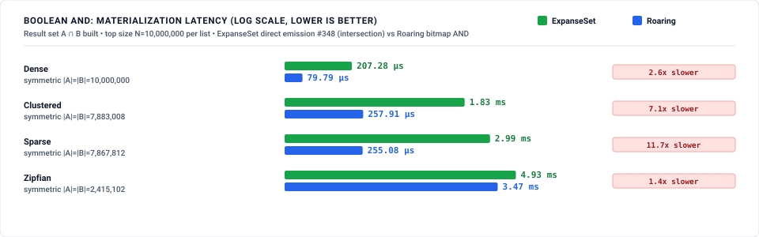

# Search / Inverted-Index Benchmark: ExpanseSet vs Roaring

Reproducible suite comparing **`ExpanseSet`** (Judy1 — an expanse-partitioned
digital trie with SIMD/SWAR bitmap leaves) against **Roaring bitmaps**
(`roaring` 0.10, `RoaringTreemap`, 64-bit) on the operations that dominate a
search-engine inverted index: Boolean posting-list algebra, WAND dynamic
skip-scan, and memory footprint.

> **Read [`METHODOLOGY.md`](METHODOLOGY.md) first — especially Step 0.** The
> Boolean pillar now reports **two Expanse arms** side by side:
>
> - **composed** — the original path this suite measured (#337): AND/OR/AND-NOT
>   built from the set's navigation primitives (merge, leapfrog, `contains`),
>   per element. This is what `ExpanseSet` forced on a posting-list backend
>   *before* it had a set-algebra kernel, and it loses every cell to Roaring by
>   4×–1413×.
> - **native** — the structural set-algebra kernel added in **#339**
>   (`ExpanseSet::intersection_len` / `union_len` / `difference_len`): descend
>   both tries in lockstep, skip whole absent subtrees, count full expanses from
>   `pop0` in O(1), and `AND` bitmap leaves word-parallel with `popcnt`.
>
> The native kernel closes the composed gap from up to **1413×** to **≤ 3.84×**
> on every symmetric cell, **beats** Roaring on the small-N and all zipfian
> large-N symmetric cells and on the dense/zipfian skewed-size AND, and still
> loses the **sparse skewed** cells (17×–24×), where Roaring's flat tiny-array
> container beats pointer-chasing a sparse trie. Every cell — wins and losses —
> is published below.
>
> **#348 adds a third, materializing arm.** The cardinality cells above build
> no result set. #348 adds direct-emission materialization: `ExpanseSet::intersection`
> etc. emit the result tree from the lockstep walk — bitmap leaves combined
> word-parallel, full expanses resolved structurally, branches assembled
> bottom-up — instead of re-inserting each key. The Boolean harness now measures
> materialization in three arms — **v2** (direct emission), **v1** (the pre-#348
> ordered-merge + per-key `insert`), and **roaring** (`&`/`|`/`-` returning a
> bitmap) — alongside the unchanged cardinality cells. **v2 is 7×–225× faster
> than v1 at N=10⁷** (floor 3.2× across the full 10⁴–10⁷ sweep, zipfian AND at
> 10⁴); it loses to roaring on the dense/clustered/sparse symmetric cells
> (1.4×–11.7×) for the same reason the cardinality pillar does — a 256-key bitmap
> leaf vs roaring's 65,536-key container — and the pre-registered targets (§2)
> are **not** met; every cell is published in §Pillar 1. The cardinality cells
> are unchanged from #339 (this pillar's kernel did not change). A prefetch +
> SIMD `BranchU` step was tried and **dropped** — a controlled +61 % dense
> regression; see §2 and `ALGORITHMS.md` §3.4.

---

## 1. Architectural feature matrix

| Capability / property | `roaring::RoaringTreemap` | `expanse::ExpanseSet` |
| :--- | :--- | :--- |
| **Underlying structure** | 32-bit-keyed map of 2^16 containers (array / bitmap) | Expanse-partitioned digital trie, SIMD/SWAR bitmap leaves |
| **Native Boolean algebra** | ✅ `intersection_len` / `union_len` / `difference_len`, `&` `\|` `-` `^` | ✅ **native structural kernel** (#339) — `intersection_len` / `union_len` / `difference_len`, `&` `\|` `-` `^` (was composed from navigation primitives) |
| **Skip-scan / advance-to-target** | ✅ `iter().advance_to(n)` (stateful cursor) | ✅ `next_at_or_after(n)` (stateless O(depth) re-descent) **and `cursor().advance_to(n)` (stateful path-reuse cursor, #340)** |
| **Ordered iteration / range** | ✅ | ✅ `iter` / `range` |
| **Rank / select** | ✅ `rank` / `select` | ✅ `count_below` / `by_count` |
| **Run containers (dense RLE)** | ❌ not in `roaring-rs` 0.10 (CRoaring only) | n/a (trie compresses runs structurally) |
| **64-bit docIDs** | via `RoaringTreemap` (map of 32-bit bitmaps) | native |
| **Serialization** | ✅ portable format | ❌ none today (`mem_used` accounting only) |

---

## 2. Key findings

*(measured: reference host — Intel i9-12900F, 24 threads, 30 MiB L3, Ubuntu 22.04 / kernel 6.8. **Pillar 1 (Boolean)** re-measured at commit `9c0026c8` (#348) with the materialization arm, window 2026-08-26T14:03:19Z → 14:07:21Z, host idle (load 0.04 before → 0.98 after — a single thread; no concurrent bench process; host-wide lock held via `run.sh`). Sanity gate: native cardinality at this commit reproduces #347 (`c129836d`) within the run-to-run band — dense 10⁷ AND 59.9 µs vs 56.5 µs (+6%), clustered 577 µs vs 572 µs (+1%), sparse 590 µs vs 502 µs (+17%), zipfian 2.23 ms (+0%) — #348 did not change this pillar's kernel. The sparse +17% was **run-to-run variance, not a regression**, and layout was ruled out by an interleaved same-window A/B (owner `348-ab`, 2026-08-26T14:35Z–14:51Z, A = `origin/main`, B = the algebra_build split): B reproduces A's native cardinality within ±1% on every cell — dense **1.001×**, sparse **1.010×**, clustered **0.996×**, zipfian **0.991×** (per-arm median of 3 interleaved rounds, both arms measuring sparse at ~525 µs, not 590 µs; the 6-hour gap between the sanity-gate run and #347 is the `docs/BENCHMARKING.md` rule-1 cross-run hazard). A prefetch + SIMD `BranchU` step measured at an earlier commit (`4d720b0c`) was a controlled +61% dense-cardinality regression and was dropped (§2.1, `ALGORITHMS.md` §3.4). **Pillar 2 (WAND)** was re-measured at commit `5bd7bdda` with the stateful `advance_to` cursor arm (#340) in the window 2026-08-26T09:28:47Z → 09:31:30Z, host idle (load 0.01 before → 1.01 after — a single thread; max load 1.03 across the run, no concurrent bench process; host-wide lock held). **Pillar 3 (memory)** is unchanged from the #337 baseline (commit `29f86ddc`, measured on the same host in the 08:05Z–08:07Z window, also idle) — the cursor does not touch footprint. Full non-quick suite via `run.sh`. The Boolean harness is `median_ns_per_op` (custom: 5 batches each grown to ≥ 60 ms), not criterion, identical to #337's config — the composed / native / roaring cells are same-methodology comparable. Deterministic instruction counts (`search_instructions`, iai-callgrind) require valgrind and run in the `instruction-counts` CI job, not on this host.)*

<!-- RESULTS:START -->

**Summary of who wins each pillar (measured, not projected):**

| Pillar | Winner | Margin | Notes |
|---|---|---|---|
| **1. Boolean AND / OR / AND-NOT** | **Mixed** (native kernel #339, materialization #348) | cardinality: **native ≤ 3.84× slower, wins 15/48**; materialization: **v2 7×–225× faster than v1 insert at N=10⁷; 1.4×–11.7× vs roaring** | #348 makes materialization structural — direct emission is **7×–225× faster than the pre-#348 per-key insert path at N=10⁷** (3.2× floor across the full sweep). Cardinality is unchanged from #339 (native within 3.84× of roaring, faster at small N and all zipfian large-N; skewed AND faster on dense/zipfian, loses sparse). Neither cardinality nor materialization reaches roaring on dense/clustered/sparse symmetric cells, and the **#348 vs-roaring targets are not met** — gap = the deferred L2 65,536-key bitmap leaf. A prefetch + SIMD `BranchU` step was **dropped** (+61% dense regression). |
| **2. WAND skip-scan** | **Mixed** (stateful cursor, #340) | stateless 2×–4× slower; **cursor 0.53×–1.64× vs Roaring** | The stateless `next_at_or_after` re-descends per call and loses every cell (the refuted Step-0 hypothesis). The #340 cursor reuses its descent path: it **beats or ties Roaring on all 6 dense cells and on clustered shallow/medium (down to 0.53× — 1.9× faster)**, is within 1.2× in 14/18 cells, and meets the near-skip target (dense 10^6 shallow **6.60 ns ≤ 8 ns**, faster than Roaring). Only the sparse deep-skip cells trail (1.40×–1.64×); sparse/10^6/deep at 1.64× is the sole cell past the 1.5× goal. |
| **3. Memory (bits/docID)** | **Mixed** | see below | Roaring wins most cells; **Expanse wins `shard` @ 10^5 (1.4× more compact)** and **ties dense/shard @ 10^6** (within ~4%). Small-N and sparse are Expanse losses. |

### Pillar 1 — Boolean posting-list algebra


Cardinality is reported in two Expanse arms per cell: **composed** (the pre-#339
path — AND as adaptive iterator-merge/leapfrog, OR as iterator merge, AND-NOT as
a `contains` probe, all per-element) and **native** (the #339 structural kernel —
`intersection_len` and its `union_len`/`difference_len` derivations, descending
both tries in lockstep, skipping absent subtrees, counting full expanses from
`pop0` in O(1), and `AND`-ing bitmap leaves word-parallel with `popcnt`). The
native kernel turns a uniform 4×–1413× loss into a contest: **≤ 3.84× slower on
every symmetric cell, faster than Roaring on 15 of 48**, and faster on the
dense/zipfian skewed-size AND. It still loses the sparse cells, where Roaring's
flat containers beat a sparse trie's pointer-chasing. #348 adds a **materialization**
arm — the result *set* built, not just counted — measured in three ways (v2
direct emission, v1 insert, roaring bitmap) below.

**AND cardinality (symmetric, |A| = |B|)** — `composed` / `native` / `roaring`,
native-vs-Roaring ratio, and composed-vs-Roaring in the last column
*(measured: #348 run, commit `9c0026c8`; native cardinality reproduces #339
within the run-to-run band — see §2 sanity gate)*:

| Distribution | Size | Composed | Native | Roaring | Native vs Roaring | Composed vs Roaring |
|---|--:|--:|--:|--:|---|--:|
| dense | 10,000 | 9.39 µs | 0.25 µs | 0.52 µs | **2.07× faster** | 18× |
| dense | 100,000 | 90.40 µs | 1.09 µs | 1.02 µs | 1.07× slower | 89× |
| dense | 1,000,000 | 905.69 µs | 6.45 µs | 4.58 µs | 1.41× slower | 198× |
| dense | 10,000,000 | 9.07 ms | 59.94 µs | 38.82 µs | 1.54× slower | 234× |
| clustered | 10,000 | 17.57 µs | 0.39 µs | 0.52 µs | **1.32× faster** | 34× |
| clustered | 100,000 | 175.93 µs | 3.00 µs | 2.76 µs | 1.09× slower | 64× |
| clustered | 1,000,000 | 1.80 ms | 44.66 µs | 15.59 µs | 2.86× slower | 115× |
| clustered | 10,000,000 | 18.07 ms | 577.10 µs | 154.41 µs | 3.74× slower | 117× |
| sparse | 10,000 | 65.60 µs | 0.75 µs | 0.52 µs | 1.46× slower | 127× |
| sparse | 100,000 | 791.36 µs | 6.02 µs | 3.03 µs | 1.99× slower | 261× |
| sparse | 1,000,000 | 8.06 ms | 59.29 µs | 15.59 µs | 3.80× slower | 517× |
| sparse | 10,000,000 | 80.26 ms | 590.23 µs | 153.66 µs | 3.84× slower | 522× |
| zipfian | 10,000 | 13.86 µs | 1.74 µs | 3.86 µs | **2.22× faster** | 4× |
| zipfian | 100,000 | 288.32 µs | 15.78 µs | 5.60 µs | 2.82× slower | 51× |
| zipfian | 1,000,000 | 2.76 ms | 212.85 µs | 271.52 µs | **1.28× faster** | 10× |
| zipfian | 10,000,000 | 25.27 ms | 2.23 ms | 3.09 ms | **1.39× faster** | 8× |

**OR** and **AND-NOT** cardinality track AND (both derive from the same
`intersection_len` walk plus O(1) populations); native worst symmetric cell is
**3.84× slower** (sparse 10⁷), and native beats Roaring on **15 of 48** symmetric
cells (small-N across distributions and all large-N zipfian). Composed is the
largest loss (to **1413×**, AND-NOT dense 10⁷). All 54 cells are in
[`results/baseline_boolean.json`](results/baseline_boolean.json).

**Materialization (#348) — the result set built, at N=10⁷** — `v2` direct
emission / `v1` pre-#348 ordered-merge + `insert` / `roaring` bitmap:



| Distribution | Op | v2 direct | v1 insert | roaring | v1 / v2 | v2 vs roaring | v2 vs its card cell |
|---|---|--:|--:|--:|--:|---|--:|
| dense | and | 207.28 µs | 29.92 ms | 79.79 µs | **144×** | 2.60× slower | 3.5× |
| dense | or | 356.12 µs | 76.77 ms | 101.36 µs | **216×** | 3.51× slower | 6.0× |
| dense | andnot | 140.19 µs | 31.61 ms | 96.81 µs | **225×** | 1.45× slower | 2.4× |
| clustered | and | 1.83 ms | 36.77 ms | 257.91 µs | **20×** | 7.11× slower | 3.2× |
| clustered | or | 2.63 ms | 81.04 ms | 265.65 µs | **31×** | 9.90× slower | 4.5× |
| clustered | andnot | 2.12 ms | 46.60 ms | 262.73 µs | **22×** | 8.06× slower | 3.7× |
| sparse | and | 2.99 ms | 136.92 ms | 255.08 µs | **46×** | 11.72× slower | 5.1× |
| sparse | or | 2.94 ms | 141.36 ms | 253.33 µs | **48×** | 11.62× slower | 5.0× |
| sparse | andnot | 2.94 ms | 133.43 ms | 255.47 µs | **45×** | 11.53× slower | 5.0× |
| zipfian | and | 4.93 ms | 36.22 ms | 3.47 ms | **7×** | 1.42× slower | 2.2× |
| zipfian | or | 7.40 ms | 71.75 ms | 4.49 ms | **10×** | 1.65× slower | 3.3× |
| zipfian | andnot | 8.26 ms | 57.14 ms | 3.18 ms | **7×** | 2.60× slower | 3.7× |

Direct emission is **7×–225× faster than the pre-#348 per-key `insert` path** it
replaces at N=10⁷ (the table above); across the full 10⁴–10⁷ sweep the floor is
3.2× (zipfian AND at 10⁴) — that is the #348 deliverable. Against Roaring it is closest on
dense-AND-NOT (1.45×) and all zipfian (1.4×–2.6×), and loses the dense/clustered/
sparse cells (2.6×–11.7×) for the same reason the cardinality pillar does: an
Expanse bitmap leaf covers 256 keys where a Roaring container covers 65,536, so
each op pays orders of magnitude more edge decodes. **The pre-registered targets
(§2) are not met** — dense 2.6× (target ≤ 1.2×), clustered 7.1× (≤ 1.5×), worst
symmetric 11.7× (≤ 2×), v2/cardinality 2.2×–6.0× (≤ 2×). Closing them needs the
deferred level-2 65,536-key bitmap leaf, out of #348 scope (a new node form with
its own density-crossover design note).

**Skewed-size AND (|B| = |A|/1000)** — a tiny B intersected into a huge A; the
native kernel drives the recursion from B's few present children, so absent
A-subtrees are never walked. Faster than Roaring on dense/zipfian, loses only
`sparse` (scattered probes each cost a cache-missing descent):

| Distribution | \|A\| | \|B\| | Composed | Native | Roaring | Native vs Roaring |
|---|--:|--:|--:|--:|--:|---|
| dense | 1,000,000 | 1,000 | 29.72 µs | 0.07 µs | 0.29 µs | **3.97× faster** |
| zipfian | 266,218 | 733 | 41.87 µs | 4.22 µs | 21.66 µs | **5.14× faster** |
| sparse | 786,944 | 999 | 57.47 µs | 9.59 µs | 0.41 µs | 23.57× slower |
| dense | 10,000,000 | 10,000 | 261.66 µs | 0.23 µs | 0.74 µs | **3.23× faster** |
| zipfian | 2,415,102 | 6,491 | 352.45 µs | 38.65 µs | 221.58 µs | **5.73× faster** |
| sparse | 7,867,812 | 9,997 | 600.63 µs | 121.29 µs | 7.27 µs | 16.68× slower |

> **Verdict:** #348's win is materialization — direct emission is **7×–225×
> faster than the pre-#348 insert path at N=10⁷** (3.2× floor across the full
> sweep), making the materializing ops structural
> as #339 intended. `ExpanseSet` stays a viable posting-list Boolean backend
> (cardinality within 3.84× of Roaring on every symmetric cell, faster on 15/48
> and on the dense/zipfian skewed AND), but neither cardinality nor
> materialization reaches Roaring on the dense/clustered/sparse symmetric cells,
> and the #348 vs-Roaring targets are not met: the gap is the 256-key bitmap leaf
> vs Roaring's 65,536-key container, closable only by the deferred level-2 bitmap
> leaf. A prefetch + SIMD `BranchU` step was tried and **dropped** (controlled
> +61% dense-cardinality regression — see §2 and `ALGORITHMS.md` §3.4). A
> `croaring` run-container arm and the L2 bitmap leaf are future work.

### Pillar 2 — WAND dynamic skip-scan


Three arms now: the **stateless** `next_at_or_after` (re-descends from the root
every call), the **#340 cursor** `cursor().advance_to` (keeps its descent path,
re-descending only from the deepest ancestor whose expanse still covers the next
target — leaf-local for near skips), and Roaring's **`advance_to`** cursor. The
stateless and cursor arms answer the same "smallest docID `≥ target`" query per
target and their sinks are bit-identical (hard-asserted every run), so between
those two the difference is purely *how* the query is served. The roaring
cursor *consumes* the key it yields — a startup verification pass (#374)
hard-asserts every well-defined step of it against a consuming reference model;
see the §3 disclosure for the two shallow cells where that consuming semantics
diverges.

The Step-0 hypothesis — that a fixed-depth re-descent would beat the warm cursor
on deep skips — was **refuted for the stateless arm** (it loses every cell 2×–4×,
its cost notably *flat* at ~14 ns dense regardless of stride). #340 resolves it:
the stateful cursor **beats or ties Roaring across all six dense cells and on
clustered shallow/medium** (down to 3.27 ns on clustered shallow — **1.9× faster
than Roaring** and **6.7× faster than the stateless re-descent**), meets the
near-skip target (dense 10^6 shallow **6.60 ns ≤ 8 ns**), and stays within 1.2×
of Roaring in 14 of 18 cells. Where it still trails is the **sparse deep-skip**
regime — few long-range skips over uniform-random 64-bit docIDs, where
consecutive far targets rarely share an ancestor so the cursor pays near-full
re-descents while Roaring's outer map skips containers directly (sparse/10^6/deep
1.64×, the sole cell past the 1.5× goal; sparse/10^7/deep 1.40×). Published in
full below; every cell, including the losses.

ns per advance — **stateless / cursor #340 / Roaring** (lower is better); the
last column is cursor ÷ Roaring (< 1 = cursor faster):

| List dist | Size | Regime | skips | Stateless | Cursor #340 | Roaring | Cursor vs Roaring |
|---|--:|---|--:|--:|--:|--:|---|
| dense | 1,000,000 | shallow | 666,641 | 14.31 ns | **6.60 ns** | 7.01 ns | **0.94× (faster)** |
| dense | 1,000,000 | medium | 15,464 | 14.48 ns | **5.87 ns** | 8.44 ns | **0.70× (faster)** |
| dense | 1,000,000 | deep | 1,967 | 14.57 ns | 7.50 ns | 7.25 ns | 1.03× |
| dense | 10,000,000 | shallow | 6,666,150 | 14.23 ns | **6.67 ns** | 6.79 ns | **0.98× (faster)** |
| dense | 10,000,000 | medium | 155,499 | 14.20 ns | **6.07 ns** | 8.46 ns | **0.72× (faster)** |
| dense | 10,000,000 | deep | 2,047 | 14.52 ns | **8.05 ns** | 9.16 ns | **0.88× (faster)** |
| clustered | 1,000,000 | shallow | 1,333,713 | 21.94 ns | **3.27 ns** | 6.15 ns | **0.53× (1.9× faster)** |
| clustered | 1,000,000 | medium | 31,061 | 26.83 ns | **8.90 ns** | 10.24 ns | **0.87× (faster)** |
| clustered | 1,000,000 | deep | 1,969 | 32.33 ns | 15.13 ns | 12.60 ns | 1.20× |
| clustered | 10,000,000 | shallow | 13,332,173 | 20.85 ns | **3.30 ns** | 5.95 ns | **0.55× (1.8× faster)** |
| clustered | 10,000,000 | medium | 310,615 | 25.96 ns | **9.08 ns** | 10.46 ns | **0.87× (faster)** |
| clustered | 10,000,000 | deep | 2,005 | 33.99 ns | 17.60 ns | 16.04 ns | 1.10× |
| sparse | 1,000,000 | shallow | 1,333,794 | 15.24 ns | 6.83 ns | 6.29 ns | 1.09× |
| sparse | 1,000,000 | medium | 31,065 | 15.54 ns | 9.65 ns | 8.64 ns | 1.12× |
| sparse | 1,000,000 | deep | 1,969 | 16.59 ns | 12.45 ns | 7.59 ns | 1.64× |
| sparse | 10,000,000 | shallow | 13,332,249 | 17.47 ns | 6.84 ns | 6.08 ns | 1.13× |
| sparse | 10,000,000 | medium | 310,616 | 17.72 ns | 9.82 ns | 8.79 ns | 1.12× |
| sparse | 10,000,000 | deep | 2,005 | 18.28 ns | 13.98 ns | 10.01 ns | 1.40× |

Across the board the cursor is **1.3×–6.7× faster than the stateless
re-descent** it replaces. Deterministic retired-instruction counts for the same
skip-scan (`search_instructions`, iai-callgrind) are the noise-free cross-check;
they require valgrind and run in the `instruction-counts` CI job.

### Pillar 3 — Memory footprint (live-heap bits per docID)


The one pillar with Expanse wins. Roaring is more compact at small populations
(the trie pays fixed branch overhead that Roaring's flat containers do not), but
**the gap closes sharply with N**: at 10^6 dense the two are within 4% (1.10 vs
1.06 bits/docID = 0.137 vs 0.132 B/docID — Expanse's figure lands inside the
0.07–0.36 B/docID range the issue cites), and Expanse is **more compact than
Roaring on `shard` at 10^5** because shared high-bit tenant prefixes collapse in
the trie while Roaring allocates a container per populated 2^16 block. The
engine's own `mem_used()` accounting (excluding allocator overhead) is roughly
half the tracked heap — e.g. 0.52 bits/docID on dense 10^6.

| Distribution | Size | Expanse (heap) | Roaring (heap) | Roaring (serialized) | Expanse vs Roaring heap |
|---|--:|--:|--:|--:|---|
| dense | 10,000 | 52.84 | 6.91 | 6.58 | 8× slower |
| dense | 100,000 | 6.39 | 1.35 | 1.31 | 5× slower |
| dense | 1,000,000 | 1.10 | 1.06 | 1.05 | ~tie (1.04×) |
| clustered | 1,000,000 | 4.06 | 2.59 | 2.58 | 2× slower |
| sparse | 1,000,000 | 7.21 | 2.60 | 2.58 | 3× slower |
| shard | 10,000 | 69.02 | 28.70 | 16.26 | 2× slower |
| shard | 100,000 | 7.48 | 10.73 | 10.51 | **1.4× more compact** |
| shard | 1,000,000 | 1.22 | 1.07 | 1.05 | ~tie (1.15×) |

Full per-size data (including 10^4/10^5 rows for every distribution) is in
[`results/baseline_memory.json`](results/baseline_memory.json).

<!-- RESULTS:END -->

## 3. Honest disclosure

* **Pillar 1 now IS a native-kernel comparison (#339).** `ExpanseSet` gained a
  native structural set-algebra kernel (`intersection_len` / `union_len` /
  `difference_len`, `&` `|` `-` `^`), reported as the **native** arm. The
  **composed** arm (adaptive merge/leapfrog for AND, iterator merge for OR,
  `contains` probe for AND-NOT) is retained as a second arm so the before/after
  is in one table. Both arms measure set-operation *cardinality* (no result set
  is built), isolating algebra compute from allocation, and are timed with the
  same `median_ns_per_op` harness config on the same host.
* **Baseline is `roaring-rs` 0.10, not CRoaring.** `roaring-rs` has only array
  and bitmap containers (no run containers). CRoaring's run containers would
  compress dense/contiguous data further; this suite makes **no** claim about
  CRoaring. A `croaring` arm is future work.
* **Cardinality *and* materialization (#348).** Pillar 1's cardinality cells
  build no result set, isolating algebra compute from allocation. #348 adds a
  materializing arm that builds the result set in three ways — v2 direct
  emission, v1 ordered-merge + `insert`, and roaring bitmap `&`/`|`/`-` — so the
  cost of producing (not just counting) the Boolean result is measured, not
  inferred. Every arm asserts the same cardinality as the count cells.
* **WAND roaring-arm consuming semantics (#374).** Roaring's `advance_to`
  cursor consumes the key it yields (one key per target), so in the two shallow
  cells where targets outnumber keys — clustered and sparse (1,333,713 /
  1,333,794 targets vs 10⁶ keys; 13,332,173 / 13,332,249 vs 10⁷, per the
  committed `skips` counts) — the roaring arm exhausts the set before the
  target stream ends. At least 25% of its timed advances there
  ($\geq (\text{skips} - N)/\text{skips}$) run past exhaustion, where
  `roaring-rs` 0.10's `advance_to` observably wraps around and yields keys from
  the start of the set again, while the Expanse arms keep answering real
  queries. The published roaring numbers for those two cells therefore time a
  partially different reduction. The harness now runs a non-timed startup
  verification pass that hard-asserts every pre-exhaustion roaring answer
  against a consuming reference model (previously a `debug_assert`, which never
  ran in the release builds that produced these numbers) and prints the
  unverified tail count each run; re-measuring the shallow cells with an
  exhaustion-free target stream is follow-up work.
* **Wall-clock numbers are single-host, idle.** Load was snapshotted before and
  between arms (see the run log). The deterministic instruction-count arm is the
  noise-free cross-check and lives in CI.
* **No synthetic peer review.** These are direct measurements; no LLM panel
  reviewed them.

---

## 4. How to reproduce

```bash
# Full suite + charts (from repository root):
./docs/benchmarks/search_inverted_index/run.sh

# Quick smoke (10^4, 10^5 only):
./docs/benchmarks/search_inverted_index/run.sh --quick

# Deterministic instruction counts (Linux + valgrind):
cargo bench -p expanse-trie --bench search_instructions
```

### Directory structure

```
docs/benchmarks/search_inverted_index/
├── README.md                    # This report
├── METHODOLOGY.md               # Rigor, Step 0 claims ceiling, expected losses
├── run.sh                       # 1-command reproduction runner
├── scripts/
│   ├── theme.py                 # Shared dual-theme SVG styling
│   ├── run_all.py               # Master orchestrator (3 wall-clock benches + charts)
│   └── generate_charts.py       # Dual-theme SVG generator (self-labels wins/losses)
└── results/                     # Raw JSON telemetry + generated SVGs
    ├── baseline_boolean.json
    ├── baseline_wand.json
    ├── baseline_memory.json
    ├── bench_boolean_and.svg
    ├── bench_boolean_and_materialize.svg
    ├── bench_wand_skipscan.svg
    └── bench_memory_bits.svg
```

The criterion/custom harnesses live in `crates/expanse/benches/search_*.rs`
(`search_boolean`, `search_wand`, `search_memory`, `search_instructions`) with
shared generators in `crates/expanse/benches/search_common/`.
