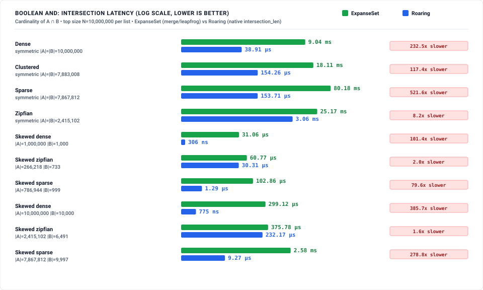
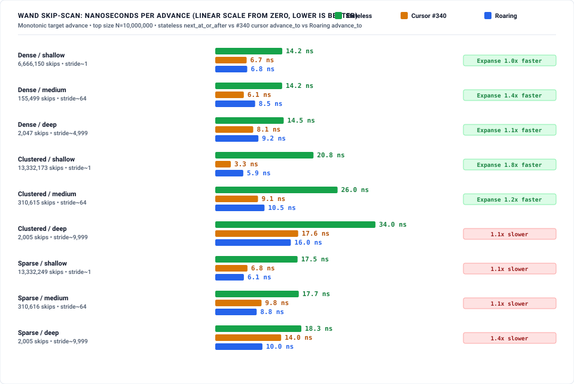
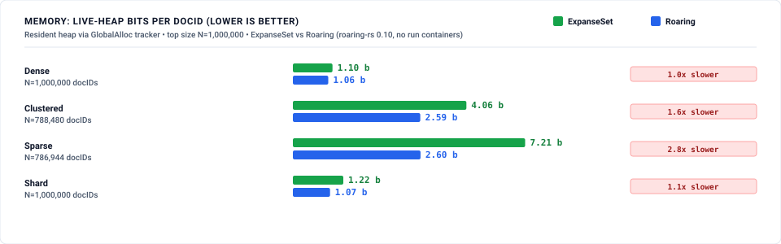

# Search / Inverted-Index Benchmark: ExpanseSet vs Roaring

Reproducible suite comparing **`ExpanseSet`** (Judy1 — an expanse-partitioned
digital trie with SIMD/SWAR bitmap leaves) against **Roaring bitmaps**
(`roaring` 0.10, `RoaringTreemap`, 64-bit) on the operations that dominate a
search-engine inverted index: Boolean posting-list algebra, WAND dynamic
skip-scan, and memory footprint.

> **Read [`METHODOLOGY.md`](METHODOLOGY.md) first — especially Step 0.** The
> Boolean pillar now reports **two Expanse arms** side by side:
>
> - **composed** — the original path this suite measured (#337): AND/OR/AND-NOT
>   built from the set's navigation primitives (merge, leapfrog, `contains`),
>   per element. This is what `ExpanseSet` forced on a posting-list backend
>   *before* it had a set-algebra kernel, and it loses every cell to Roaring by
>   4×–1406×.
> - **native** — the structural set-algebra kernel added in **#339**
>   (`ExpanseSet::intersection_len` / `union_len` / `difference_len`): descend
>   both tries in lockstep, skip whole absent subtrees, count full expanses from
>   `pop0` in O(1), and `AND` bitmap leaves word-parallel with `popcnt`.
>
> The native kernel closes the composed gap from up to **1406×** to **≤ 3.70×**
> on every symmetric cell, **beats** Roaring on the small-N and all zipfian
> large-N symmetric cells and on the dense/zipfian skewed-size AND, and still
> loses the **sparse skewed** cells (17×–23×), where Roaring's flat tiny-array
> container beats pointer-chasing a sparse trie. Every cell — wins and losses —
> is published below.

---

## 1. Architectural feature matrix

| Capability / property | `roaring::RoaringTreemap` | `expanse::ExpanseSet` |
| :--- | :--- | :--- |
| **Underlying structure** | 32-bit-keyed map of 2^16 containers (array / bitmap) | Expanse-partitioned digital trie, SIMD/SWAR bitmap leaves |
| **Native Boolean algebra** | ✅ `intersection_len` / `union_len` / `difference_len`, `&` `\|` `-` `^` | ✅ **native structural kernel** (#339) — `intersection_len` / `union_len` / `difference_len`, `&` `\|` `-` `^` (was composed from navigation primitives) |
| **Skip-scan / advance-to-target** | ✅ `iter().advance_to(n)` (stateful cursor) | ✅ `next_at_or_after(n)` (stateless O(depth) re-descent) |
| **Ordered iteration / range** | ✅ | ✅ `iter` / `range` |
| **Rank / select** | ✅ `rank` / `select` | ✅ `count_below` / `by_count` |
| **Run containers (dense RLE)** | ❌ not in `roaring-rs` 0.10 (CRoaring only) | n/a (trie compresses runs structurally) |
| **64-bit docIDs** | via `RoaringTreemap` (map of 32-bit bitmaps) | native |
| **Serialization** | ✅ portable format | ❌ none today (`mem_used` accounting only) |

---

## 2. Key findings

*(measured: reference host — Intel i9-12900F, 24 threads, 30 MiB L3, Ubuntu 22.04 / kernel 6.8. **Pillar 1 (Boolean)** re-measured at commit `c129836d` with the native set-algebra kernel arm (#339) in the window 2026-08-26T08:13:34Z → 08:15:28Z, host idle (load 0.00 before → 0.90 after — a single thread; no concurrent bench process during the window). **Pillars 2–3 (WAND, memory)** are unchanged from the #337 baseline (commit `29f86ddc`, measured on the same host in the 08:05Z–08:07Z window, also idle) — the set-algebra kernel does not touch skip-scan or footprint. Full non-quick suite via `run.sh`. The Boolean harness is `median_ns_per_op` (custom: 5 batches each grown to ≥ 60 ms), not criterion, identical to #337's config — the composed / native / roaring cells are same-methodology comparable. Deterministic instruction counts (`search_instructions`, iai-callgrind) require valgrind and run in the `instruction-counts` CI job, not on this host.)*

<!-- RESULTS:START -->

**Summary of who wins each pillar (measured, not projected):**

| Pillar | Winner | Margin | Notes |
|---|---|---|---|
| **1. Boolean AND / OR / AND-NOT** | **Mixed** (native kernel, #339) | composed 4×–1406× slower; **native ≤ 3.70× slower, wins 7/16 symmetric cells** | The native structural kernel replaces per-element composition. Symmetric: within 3.70× everywhere, faster than Roaring at small N and on all zipfian large-N. Skewed AND: **faster** on dense/zipfian, loses only sparse (17×–23×). |
| **2. WAND skip-scan** | **Roaring** | 2× – 4× | Every cell. Expanse's `next_at_or_after` cost is notably *flat* (~13.6 ns dense, independent of stride/size) — a real O(depth) property — but the warm cursor still wins. |
| **3. Memory (bits/docID)** | **Mixed** | see below | Roaring wins most cells; **Expanse wins `shard` @ 10^5 (1.4× more compact)** and **ties dense/shard @ 10^6** (within ~4%). Small-N and sparse are Expanse losses. |

### Pillar 1 — Boolean posting-list algebra



Two Expanse arms are reported per cell: **composed** (the pre-#339 path — AND as
adaptive iterator-merge/leapfrog, OR as iterator merge, AND-NOT as a `contains`
probe, all per-element) and **native** (the #339 structural kernel —
`intersection_len` and its `union_len`/`difference_len` derivations, descending
both tries in lockstep, skipping absent subtrees, counting full expanses from
`pop0` in O(1), and `AND`-ing bitmap leaves word-parallel with `popcnt`). The
native kernel turns a uniform 4×–1406× loss into a contest: **≤ 3.70× slower on
every symmetric cell, faster than Roaring on 7 of 16**, and faster on the
dense/zipfian skewed-size AND. It still loses the sparse cells, where Roaring's
flat containers beat a sparse trie's pointer-chasing.

**AND (symmetric, |A| = |B|)** — `composed` / `native` / `roaring`, and the
native-vs-Roaring ratio (the composed-vs-Roaring ratio is the last column):

| Distribution | Size | Composed | Native | Roaring | Native vs Roaring | Composed vs Roaring |
|---|--:|--:|--:|--:|---|--:|
| dense | 10,000 | 9.45 µs | 0.25 µs | 0.52 µs | **2.08× faster** | 18× |
| dense | 100,000 | 91.43 µs | 1.09 µs | 1.02 µs | 1.07× slower | 90× |
| dense | 1,000,000 | 909.85 µs | 6.21 µs | 4.57 µs | 1.36× slower | 199× |
| dense | 10,000,000 | 9.13 ms | 56.49 µs | 38.93 µs | 1.45× slower | 235× |
| clustered | 10,000 | 17.59 µs | 0.38 µs | 0.51 µs | **1.37× faster** | 34× |
| clustered | 100,000 | 175.93 µs | 2.99 µs | 2.77 µs | 1.08× slower | 63× |
| clustered | 1,000,000 | 1.79 ms | 47.63 µs | 15.62 µs | 3.05× slower | 115× |
| clustered | 10,000,000 | 18.12 ms | 572.17 µs | 154.51 µs | 3.70× slower | 117× |
| sparse | 10,000 | 63.57 µs | 0.75 µs | 0.51 µs | 1.46× slower | 123× |
| sparse | 100,000 | 802.22 µs | 5.33 µs | 3.03 µs | 1.76× slower | 264× |
| sparse | 1,000,000 | 8.20 ms | 50.17 µs | 15.58 µs | 3.22× slower | 526× |
| sparse | 10,000,000 | 82.04 ms | 502.34 µs | 153.64 µs | 3.27× slower | 534× |
| zipfian | 10,000 | 13.64 µs | 1.73 µs | 3.86 µs | **2.23× faster** | 4× |
| zipfian | 100,000 | 294.04 µs | 15.65 µs | 5.62 µs | 2.78× slower | 52× |
| zipfian | 1,000,000 | 2.80 ms | 212.37 µs | 265.87 µs | **1.25× faster** | 11× |
| zipfian | 10,000,000 | 25.71 ms | 2.23 ms | 3.08 ms | **1.38× faster** | 8× |

**OR** and **AND-NOT** track AND almost exactly for the native kernel — both
derive from the same `intersection_len` walk plus O(1) populations, so their
native cost equals AND's to within noise (native worst is **3.70× slower**,
clustered 10^7, for all three ops; native is faster than Roaring on the same 7
cells). For the composed path they are the largest losses (OR to 803×, AND-NOT
to **1406×** at dense 10^7). Full per-size, per-op data (all 54 cells) is in
[`results/baseline_boolean.json`](results/baseline_boolean.json).

**Skewed-size AND (|B| = |A|/1000)** — the subtree-skipping case (METHODOLOGY
§2.3): a tiny B intersected into a huge A. The native kernel drives the
recursion from B's few present children, so absent A-subtrees are never walked —
it is **faster than Roaring on dense and zipfian**, and loses only `sparse`,
where B's ~1000 scattered keys each cost a cache-missing descent into A while
Roaring answers from a flat 1-key array container:

| Distribution | \|A\| | \|B\| | Composed | Native | Roaring | Native vs Roaring |
|---|--:|--:|--:|--:|--:|---|
| dense | 1,000,000 | 1,000 | 32.35 µs | 0.07 µs | 0.29 µs | **4.08× faster** |
| sparse | 786,944 | 999 | 58.04 µs | 9.50 µs | 0.41 µs | 23.05× slower |
| zipfian | 266,218 | 733 | 41.22 µs | 4.15 µs | 21.68 µs | **5.22× faster** |
| dense | 10,000,000 | 10,000 | 274.84 µs | 0.26 µs | 0.74 µs | **2.83× faster** |
| sparse | 7,867,812 | 9,997 | 598.55 µs | 120.85 µs | 6.92 µs | 17.46× slower |
| zipfian | 2,415,102 | 6,491 | 353.14 µs | 39.10 µs | 221.41 µs | **5.66× faster** |

> **Verdict:** with the #339 native kernel, `ExpanseSet` is a viable
> posting-list Boolean backend — within 3.70× of Roaring on every symmetric
> cell and faster on 7 of 16, and faster on the dense/zipfian skewed AND where
> subtree skipping pays off. The remaining losses are the **sparse** cells
> (uniform-random keys over a wide universe): the trie has no shared structure
> to skip, so each probe is a cache-missing descent, which Roaring's flat
> containers beat. A `croaring` run-container arm and a sparse-probe fast path
> are future work.

### Pillar 2 — WAND dynamic skip-scan



A genuine contest — Expanse's `next_at_or_after` is a real O(depth) skip — but
Roaring's stateful `advance_to` cursor wins every regime by **2× – 4×**. The
Step 0 hypothesis that deep, long-range skips over a large list would favour the
fixed-depth re-descent is **refuted**: Roaring skips whole containers via its
outer map just as cheaply. The one architectural point in Expanse's favour is
**stride-independence** — dense skip cost is a flat ~13.6 ns whether advancing
by 1 or by 5,000 — whereas Roaring's cursor cost grows slightly with stride.

| List dist | Size | Regime | skips | Expanse | Roaring | Expanse vs Roaring |
|---|--:|---|--:|--:|--:|---|
| dense | 1,000,000 | shallow | 666,641 | 13.6 ns | 7.0 ns | 2× slower |
| dense | 1,000,000 | deep | 1,967 | 13.8 ns | 7.3 ns | 2× slower |
| dense | 10,000,000 | shallow | 6,666,150 | 13.7 ns | 6.9 ns | 2× slower |
| dense | 10,000,000 | deep | 2,047 | 14.5 ns | 8.9 ns | 2× slower |
| clustered | 10,000,000 | shallow | 13,332,173 | 20.9 ns | 6.0 ns | 3× slower |
| clustered | 10,000,000 | deep | 2,005 | 34.2 ns | 16.1 ns | 2× slower |
| sparse | 10,000,000 | shallow | 13,332,249 | 17.1 ns | 6.2 ns | 3× slower |
| sparse | 10,000,000 | deep | 2,005 | 18.2 ns | 10.1 ns | 2× slower |

Deterministic retired-instruction counts for the same skip-scan
(`search_instructions`, iai-callgrind) are the noise-free cross-check; they
require valgrind and run in the `instruction-counts` CI job.

### Pillar 3 — Memory footprint (live-heap bits per docID)



The one pillar with Expanse wins. Roaring is more compact at small populations
(the trie pays fixed branch overhead that Roaring's flat containers do not), but
**the gap closes sharply with N**: at 10^6 dense the two are within 4% (1.10 vs
1.06 bits/docID = 0.137 vs 0.132 B/docID — Expanse's figure lands inside the
0.07–0.36 B/docID range the issue cites), and Expanse is **more compact than
Roaring on `shard` at 10^5** because shared high-bit tenant prefixes collapse in
the trie while Roaring allocates a container per populated 2^16 block. The
engine's own `mem_used()` accounting (excluding allocator overhead) is roughly
half the tracked heap — e.g. 0.52 bits/docID on dense 10^6.

| Distribution | Size | Expanse (heap) | Roaring (heap) | Roaring (serialized) | Expanse vs Roaring heap |
|---|--:|--:|--:|--:|---|
| dense | 10,000 | 52.84 | 6.91 | 6.58 | 8× slower |
| dense | 100,000 | 6.39 | 1.35 | 1.31 | 5× slower |
| dense | 1,000,000 | 1.10 | 1.06 | 1.05 | ~tie (1.04×) |
| clustered | 1,000,000 | 4.06 | 2.59 | 2.58 | 2× slower |
| sparse | 1,000,000 | 7.21 | 2.60 | 2.58 | 3× slower |
| shard | 10,000 | 69.02 | 28.70 | 16.26 | 2× slower |
| shard | 100,000 | 7.48 | 10.73 | 10.51 | **1.4× more compact** |
| shard | 1,000,000 | 1.22 | 1.07 | 1.05 | ~tie (1.15×) |

Full per-size data (including 10^4/10^5 rows for every distribution) is in
[`results/baseline_memory.json`](results/baseline_memory.json).

<!-- RESULTS:END -->disclosure

* **Pillar 1 now IS a native-kernel comparison (#339).** `ExpanseSet` gained a
  native structural set-algebra kernel (`intersection_len` / `union_len` /
  `difference_len`, `&` `|` `-` `^`), reported as the **native** arm. The
  **composed** arm (adaptive merge/leapfrog for AND, iterator merge for OR,
  `contains` probe for AND-NOT) is retained as a second arm so the before/after
  is in one table. Both arms measure set-operation *cardinality* (no result set
  is built), isolating algebra compute from allocation, and are timed with the
  same `median_ns_per_op` harness config on the same host.
* **Baseline is `roaring-rs` 0.10, not CRoaring.** `roaring-rs` has only array
  and bitmap containers (no run containers). CRoaring's run containers would
  compress dense/contiguous data further; this suite makes **no** claim about
  CRoaring. A `croaring` arm is future work.
* **Cardinality, not materialization.** Pillar 1 measures set-operation
  *cardinality* (no result set is built), isolating algebra compute from
  allocation on both sides.
* **Wall-clock numbers are single-host, idle.** Load was snapshotted before and
  between arms (see the run log). The deterministic instruction-count arm is the
  noise-free cross-check and lives in CI.
* **No synthetic peer review.** These are direct measurements; no LLM panel
  reviewed them.

---

## 4. How to reproduce

```bash
# Full suite + charts (from repository root):
./docs/benchmarks/search_inverted_index/run.sh

# Quick smoke (10^4, 10^5 only):
./docs/benchmarks/search_inverted_index/run.sh --quick

# Deterministic instruction counts (Linux + valgrind):
cargo bench -p expanse-trie --bench search_instructions
```

### Directory structure

```
docs/benchmarks/search_inverted_index/
├── README.md                    # This report
├── METHODOLOGY.md               # Rigor, Step 0 claims ceiling, expected losses
├── run.sh                       # 1-command reproduction runner
├── scripts/
│   ├── theme.py                 # Shared dual-theme SVG styling
│   ├── run_all.py               # Master orchestrator (3 wall-clock benches + charts)
│   └── generate_charts.py       # Dual-theme SVG generator (self-labels wins/losses)
└── results/                     # Raw JSON telemetry + generated SVGs
    ├── baseline_boolean.json
    ├── baseline_wand.json
    ├── baseline_memory.json
    ├── bench_boolean_and.svg
    ├── bench_wand_skipscan.svg
    └── bench_memory_bits.svg
```

The criterion/custom harnesses live in `crates/expanse/benches/search_*.rs`
(`search_boolean`, `search_wand`, `search_memory`, `search_instructions`) with
shared generators in `crates/expanse/benches/search_common/`.
