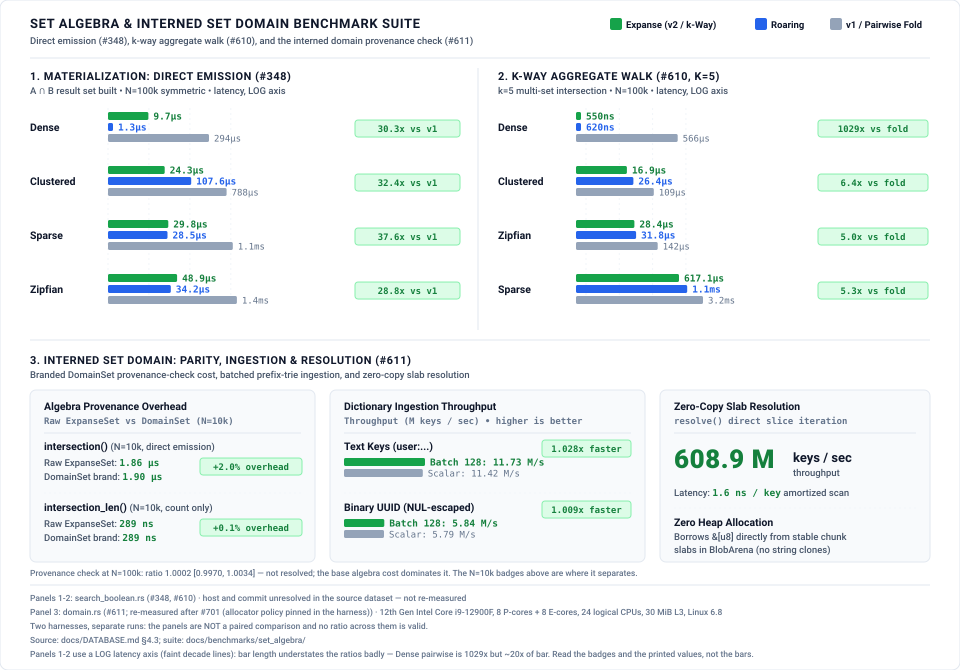

# Set algebra — engine kernels and the interned set domain

The entry point for every measurement of `crates/expanse/src/algebra.rs` and
`algebra_build.rs`: the native `AND` / `OR` / `AND-NOT` / `XOR` kernels that
descend two tries in lockstep by expanse, the $k$-way aggregate walk, direct
emission materialization, and the interned set domain built on top of them.

**Why this directory exists.** Set algebra is exercised by five harnesses that
publish into four different places. Nothing routed from the engine module to
its measurements, so "where are the algebra benchmarks?" had no answer. This
suite owns the one harness that had no home and **routes to the other four
where they already live** — it does not re-home them, and it does not restate
their numbers. Each owning suite remains the authority on its own cells.

---

## 1. Where each algebra measurement lives

| Harness | `/benchmark` token | Owner | What it measures |
|---|---|---|---|
| [`benches/domain.rs`](../../../crates/expanse/benches/domain.rs) | `domain` | **this suite** | Interned set domain: provenance-check overhead vs raw `ExpanseSet`, batched vs scalar ingestion, zero-copy slab resolution |
| [`benches/search_boolean.rs`](../../../crates/expanse/benches/search_boolean.rs) | `search_boolean` | [`search_inverted_index/`](../search_inverted_index/README.md) **Pillar 1** | Boolean posting-list algebra and materialization against `roaring` |
| [`benches/search_instructions.rs`](../../../crates/expanse/benches/search_instructions.rs) | `search_instructions` | [`search_inverted_index/`](../search_inverted_index/README.md) **Pillar 2** | Deterministic Callgrind counts for the same kernels — the noise-free cross-check |
| [`benches/bench_grammar_masks.rs`](../../../crates/expanse/benches/bench_grammar_masks.rs) | `bench_grammar_masks` | [`llm_inference/`](../llm_inference/README.md) | Grammar-constrained decoding mask cache and its set algebra vs roaring and dense bitmaps |
| [`benches/avx512_bitmap.rs`](../../../crates/expanse/benches/avx512_bitmap.rs) | `avx512_bitmap` | [`avx512/`](../avx512/README.md) | `Bitmap256::count_and`, the inner kernel of the intersection walk, across cache residency |

**Ownership does not move.** `search_boolean` and `search_instructions` are
Pillars 1 and 2 of the search suite's pre-registration; `bench_grammar_masks`
is an `llm_inference` arm; `avx512_bitmap` is the `avx512` suite's subject.
Reassigning any of them here would strip a suite of a pillar it pre-registered
and invalidate its claims ceiling. The table above is the routing this
repository lacked, not a transfer of ownership.

## 2. What this suite measures directly (`domain`)

`benches/domain.rs` (workload `domain_interned_set`) carries three groups:

| Group | Arms | Question |
|---|---|---|
| `domain_set_algebra_overhead` | `raw_expanse_set_intersection`, `domain_set_intersection`, `raw_expanse_set_intersection_len`, `domain_set_intersection_len` | Does the `DomainSet` provenance check cost anything over raw `ExpanseSet` algebra? |
| `domain_ingestion` | `scalar_insert_text`, `batch_insert_text`, `scalar_insert_uuid`, `batch_insert_uuid` | What does chunk amortisation buy over scalar interning, on text and on NUL-bearing binary keys? |
| `domain_resolution` | `resolve_full_scan` | What does a borrowed-slice scan out of the stable slab arena cost? |

Populations 10k / 50k / 100k; the parity group is symmetric by construction —
both arms intersect the same key sequences, and the domain arm differs only by
the provenance check under test.

## 3. Results



*(rendered from [`results/bench_domain_algebra.json`](results/bench_domain_algebra.json) by `scripts/generate_charts.py`; panel 3 is this suite's own measurement, panels 1–2 are the `search_boolean` cells routed here in §1)*

`(measured: reference host — Intel i9-12900F, 8 P-cores + 8 E-cores, 24 logical CPUs, 30 MiB L3,
Linux 6.8, rustc 1.98.1, commit fcca1c0d; 5 independent whole-harness runs through run.sh --reps 5,
bench lock held, P-core pin, load 1.0–2.6 at each start; paired ratio per repetition, 95% percentile
bootstrap over repetitions; results/bench_domain_algebra.json via scripts/harvest_domain.py)`

### Provenance-check cost (H1)

| Arm | Raw `ExpanseSet` | `DomainSet` | Ratio (95% CI) | Verdict |
|---|---|---|---|---|
| `intersection()` N=10k | 1860.2 ns | 1897.1 ns | 1.0199 [1.0165, 1.0226] | **+2.0%** |
| `intersection_len()` N=10k | 288.9 ns | 289.2 ns | 1.0013 [1.0009, 1.0015] | **+0.1%** |
| `intersection()` N=100k | 10925.2 ns | 10926.9 ns | 1.0002 [0.9970, 1.0034] | not resolved |
| `intersection_len()` N=100k | 1657.3 ns | 1648.3 ns | 0.9946 [0.9835, 1.0019] | not resolved |

**H1 is refuted at N=10k on `intersection()` and holds at N=100k.** The methodology
pre-registered H1 as a null — the pass condition being overlapping intervals. That holds at
N=100k, where the base algebra cost dominates. It fails at N=10k on `intersection()`, where the
check is a reproducible 2.0% [1.65%, 2.26%] over five independent runs; on `intersection_len()`
at N=10k the interval also excludes 1.0, but at +0.1% [0.09%, 0.15%] the effect is at the edge of
what the instrument resolves. Reporting the refutation rather than the population where the null
survives is the point of pre-registering it (§8.7).

**Correction.** These cells were re-measured at `fcca1c0d` after #701, which pinned the harness's
allocator policy (glibc heap trimming off, a top pad) so the measured region no longer depends on
which arms ran earlier in the process; the earlier cells, taken at `c4b1817f`, are superseded
rather than overwritten silently. The `intersection()` ratios reproduce within the between-run
interval. The `intersection_len()` N=10k cell does not: it was published as a resolved overhead of
about 5% and now reads 0.1%, and its absolute time fell by 11%. The cardinality walk changed
between the two measurements — #638 gave it runtime `popcnt` dispatch — so the two cells are
different code, not a drift; which of the two changes moved the ratio is not separated here.
The previous figures are registered in `.github/superseded-figures.json` so they cannot be
republished.

### Ingestion (H2, H3)

| Keys | Scalar | Batch-128 | Speedup (95% CI) |
|---|---|---|---|
| Text, N=10k | 11.42 M keys/s | 11.73 M keys/s | 1.028× [1.026, 1.029] |
| Text, N=50k | 10.91 M keys/s | 11.14 M keys/s | 1.021× [1.017, 1.025] |
| Binary UUID, N=10k | 5.79 M keys/s | 5.84 M keys/s | 1.009× [1.005, 1.013] |
| Binary UUID, N=50k | 5.97 M keys/s | 6.02 M keys/s | 1.008× [1.007, 1.009] |

H2 and H3 predicted batching would win, and it does — by 1%–3%. H3 further predicted the UUID
margin would be *narrower* than text because byte-stuffing is per-key work amortisation cannot
remove; measured 1.008×–1.009× against 1.021×–1.028×, so H3 holds in direction and magnitude.

### Resolution (H4)

608.9 M keys/s (1.642 ns/key) at N=10k; 615.8 M keys/s (1.624 ns/key) at N=100k; zero heap
allocations during traversal.

### Cardinality walk `popcnt` dispatch (#638)

`(measured: Linux x86_64, CI job 100925987629, commit fed9c7cb; Callgrind instruction simulation, N=50,000)`

Set cardinality walks (`intersection_len`, `intersection_len_many`, `union_len_many`) execute with runtime CPUID dispatch for hardware `popcnt` on `x86_64` (#638). Because `Bitmap256` counting intrinsics lower to ~12-instruction SWAR sequences when compiled without `-C target-feature=+popcnt`, specialized inlined descent emits single-cycle `popcntq`/`popcntl` instructions across the trie walk.

Measured via `search_instructions::boolean::expanse_native_and` against the pre-dispatch merge base:

| Workload Distribution | Baseline SWAR (Retired Ir) | With Runtime `popcnt` Dispatch (Retired Ir) | Delta | Reduction Ratio |
|---|:---:|:---:|:---:|:---:|
| `sparse` | 85,391 | 73,367 | −12,024 | **−14.08%** (−1.16×) |
| `clustered` | 43,257 | 38,421 | −4,836 | **−11.18%** (−1.13×) |
| `zipfian` | 163,259 | 151,327 | −11,932 | **−7.31%** (−1.08×) |
| `dense` | 17,282 | 17,068 | −214 | **−1.24%** (−1.01×) |

Sparse and clustered distributions exhibit double-digit retired instruction reductions because they spend significant time intersecting bitmap leaves word-parallel; dense lists benefit primarily from earlier full-branch and full-expanse shortcuts.

### Measurement notes

- **Criterion's within-run interval is not the uncertainty.** It reads 0.2%–0.5% on these arms,
  while between-run spread on a *clean* second host reaches 2.3%–3.6%. Single-run figures
  therefore appear separated when they are not; every interval above is a bootstrap over
  independent runs (§8.4).
- **One host gates.** The reference host holds absolute CV 0.08%–0.38%. A 32-thread Ryzen 9
  9955HX measures 2.3%–3.6% when clean, and a 72-thread Xeon that also runs a git server and a
  database measures 2.6%–9.3%; both corroborate the *direction* at N=10k and can resolve nothing
  finer. No aarch64 arm was taken.
- **The harness could not run at all before [#647](https://github.com/orieg/expanse/pull/647)**,
  which fixed a per-iteration leak that reached 94.9 GB RSS at N=100k. Every figure here
  post-dates that fix.

## 4. Reproduction

```bash
docs/benchmarks/set_algebra/run.sh          # full sweep
docs/benchmarks/set_algebra/run.sh --quick  # smoke, writes to a scratch path
```

Wall-clock arms are gated per §8.4 on the BCa 95% CI lower bound, on the quiet
reference host — never on a development machine's point estimates. The
deterministic cross-check for the shared kernels is `search_instructions`,
which needs valgrind and runs in the `instruction-counts` CI job.

## 5. Chart renderer

`scripts/generate_domain_algebra_svg.py` still writes to `docs/assets/` and has
not moved into this suite's `scripts/`; that move is tracked with the rest of
the chart-asset consolidation in
[#643](https://github.com/orieg/expanse/issues/643).
