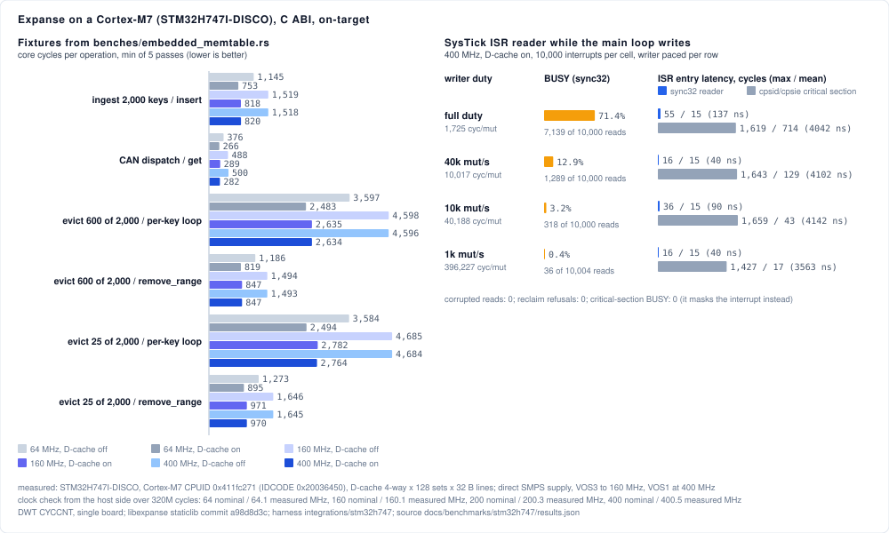
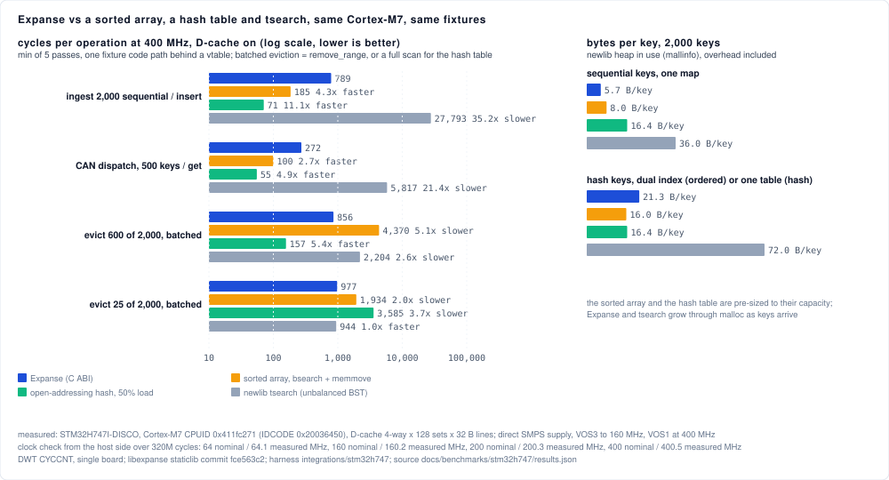
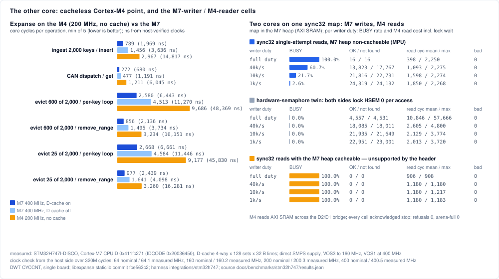
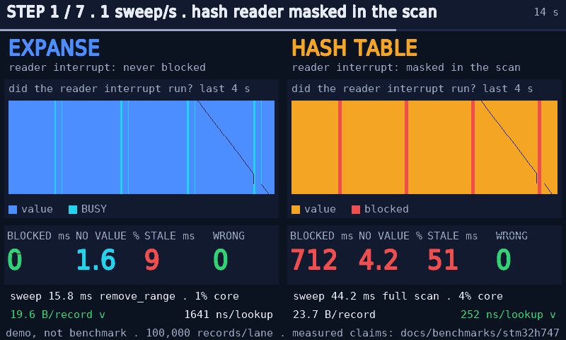

# STM32H747I-DISCO on-target suite: results and how to read them

*(measured: STM32H747I-DISCO, silicon rev V; Cortex-M7 at 64 MHz HSI, 160 MHz PLL1/VOS3 and 400 MHz PLL1/VOS1, D-cache 4-way × 128 sets × 32-byte lines, off and on; Cortex-M4 at 200 MHz HCLK, no cache; clocks host-verified over 320M cycles at 64.1 / 160.1 / 400.5 / 200.3 MHz; libexpanse staticlib commit `a98d8d3c` (engine source identical to `fce563c2`), harness `integrations/stm32h747` with the DWT-profile rows; DWT cycles per operation, min of 5 passes, one board; source `docs/benchmarks/stm32h747/results/results.json`, transcript alongside; every chart value is derived from that file by `docs/benchmarks/stm32h747/scripts/generate_charts.py`, and every table in this README by `docs/benchmarks/stm32h747/scripts/render_tables.py`. The full record is the second half of this page; the pre-registration record is [`METHODOLOGY.md`](METHODOLOGY.md); the firmware and the flash/capture flow are [`integrations/stm32h747/`](../../../integrations/stm32h747/README.md); `run.sh` here reproduces the run with the board attached.)*

> **Paired on the same board: `22908c15` → `fce563c2`.** The engine at `22908c15`
> and at `fce563c2` (`main` carrying #667, #686, #694 and #698) were built into
> the same harness firmware from the same toolchain and flashed control,
> treatment, treatment, control in one sitting. The harness sources are
> byte-identical at both commits, so the engine archive is the only difference
> between the two images. This pairing was taken with the harness *before* the
> DWT-profile rows below were added; its absolute cells therefore differ from
> the current artifact by the code placement that change caused (up to 4.8% on
> the M7 `can_dispatch` cell, same engine source), and its verdicts stand.
>
> **How to read the verdict.** The three alternatives in a row — sorted array,
> open-addressing hash, `tsearch` — are byte-identical C in both arms and run
> the same board, so any movement *they* show between the two runs is noise:
> layout, thermal, timing. The **noise floor** column is the largest such
> movement in that row. An Expanse movement smaller than it is not claimed; one
> larger than it is attributed to the engine change — a loss as readily as a
> win. Re-flashing the identical image moved no Expanse cell by more than 0.51%.
>
> | core | MHz | D-cache | fixture | `22908c15` | `fce563c2` | Δ | noise floor | verdict |
> |---|---:|---|---|---:|---:|---:|---:|---|
> | `m7` | 400 | on | `evict_steady_range` | 1,285 | **977** | **−24.0%** | 1.3% | outside noise — attributed |
> | `m7` | 400 | on | `evict_bulk_range` | 1,071 | **856** | **−20.1%** | 2.1% | outside noise — attributed |
> | `m7` | 400 | on | `evict_bulk_loop` | 2,923 | **2,580** | **−11.7%** | 2.0% | outside noise — attributed |
> | `m7` | 400 | on | `evict_steady_loop` | 3,000 | **2,668** | **−11.1%** | 3.4% | outside noise — attributed |
> | `m7` | 400 | on | `ingest` | 743 | **789** | **+6.2%** | 5.8% | outside noise — moved up (5.7% against a 5.7% floor in the reversed order) |
> | `m7` | 400 | on | `can_dispatch` | 252 | **272** | **+8.0%** | 4.5% | outside noise — moved up; placement, per the sweep below |
> | `m7` | 400 | off | `evict_steady_range` | 1,958 | **1,641** | **−16.2%** | 0.4% | outside noise — attributed |
> | `m7` | 400 | off | `evict_bulk_range` | 1,713 | **1,495** | **−12.7%** | 0.1% | outside noise — attributed |
> | `m7` | 400 | off | `evict_bulk_loop` | 4,864 | **4,513** | **−7.2%** | 0.1% | outside noise — attributed |
> | `m7` | 400 | off | `evict_steady_loop` | 4,903 | **4,584** | **−6.5%** | 0.8% | outside noise — attributed |
> | `m7` | 400 | off | `ingest` | 1,437 | **1,456** | **+1.3%** | 0.0% | outside noise — moved up |
> | `m7` | 400 | off | `can_dispatch` | 436 | **477** | **+9.3%** | 0.0% | outside noise — moved up; placement, per the sweep below |
> | `m4` | 200 | off | `evict_steady_range` | 4,050 | **3,260** | **−19.5%** | 0.8% | outside noise — attributed |
> | `m4` | 200 | off | `evict_bulk_range` | 3,866 | **3,234** | **−16.3%** | 0.5% | outside noise — attributed |
> | `m4` | 200 | off | `evict_steady_loop` | 10,594 | **9,177** | **−13.4%** | 0.5% | outside noise — attributed |
> | `m4` | 200 | off | `evict_bulk_loop` | 10,836 | **9,686** | **−10.6%** | 0.3% | outside noise — attributed |
> | `m4` | 200 | off | `ingest` | 3,050 | 2,967 | −2.7% | 7.3% | inside noise (`tsearch` moved 7.3% in this row; the other two twins 0.0% and 0.4%) |
> | `m4` | 200 | off | `can_dispatch` | 1,241 | **1,211** | **−2.4%** | 0.0% | outside noise — attributed |
>
> The 64 and 160 MHz cells, both flash orders and the run-to-run pairs of
> identical images are in
> [`results/pairing_fce563c2/pairing.txt`](results/pairing_fce563c2/pairing.txt);
> the four captures are alongside, with the archive and image hashes in
> `archives.txt`. The four eviction fixtures are the removal path #667 and #698
> shortened (`read_rem` and `set_immed_keys` given constant lengths on native
> targets; host Callgrind `set32_remove` −4.31% and −7.66%), and they fall 6–24%
> on both cores at every clock and cache state. The `ingest` cells moved inside
> or at their twin floors and carry no verdict; host `map32_insert
> sensor_timestamps` is −3.34% across the same range (#667).
>
> **Where the M7 `can_dispatch` cycles went.** The one cell that moved the wrong
> way — up 8–9% on the M7 while the M4's fell 2.4% and the host Callgrind arm for
> the same fixture shape, `map32_get can_dispatch`, held **106,341 instructions at
> every engine PR in the range** (#631, #642, #667, #686, #694, #698) — was
> re-paired with the harness's DWT-profile arm, which reads the five ARMv7-M
> event counters around each operation and derives the instruction count from
> `cycles = instructions + CPI + EXC + SLEEP + LSU − FOLD`. Same two engines,
> both flash orders, no `can_dispatch` operation reached the 8-bit wrap
> *(measured: [`results/pairing_dwt_a98d8d3c/`](results/pairing_dwt_a98d8d3c/pairing.txt);
> the bracket's own 7 cycles per op are subtracted)*:
>
> | `can_dispatch`, per get | cycles | instructions (derived) | `CPICNT` (fetch stalls + multi-cycle instructions) | `LSUCNT` (data stalls) | folded |
> |---|---:|---:|---:|---:|---:|
> | `m7` 400 MHz, D-cache on | 253.1 → 281.6 (**+28.5**) | 255.6 → 250.7 (−5.0) | 67.1 → 101.9 (**+34.8**) | 21.0 → 21.0 (0.0) | 90.6 → 92.0 (+1.3) |
> | `m7` 400 MHz, D-cache off | 402.0 → 433.7 (**+31.6**) | 255.6 → 250.7 (−5.0) | 67.1 → 102.7 (**+35.6**) | 169.9 → 172.3 (+2.3) | 90.6 → 92.0 (+1.3) |
> | `m7` 64 MHz, D-cache on | 253.1 → 263.8 (+10.7) | 255.6 → 251.6 (−4.0) | 67.1 → 84.8 (+17.7) | 21.0 → 21.0 (0.0) | 90.6 → 93.6 (+3.0) |
> | `m4` 200 MHz | 1,223.5 → 1,219.9 (−3.6) | 1,021.6 → 1,022.6 (+1.0) | 176.9 → 168.3 (−8.6) | 29.0 → 33.0 (+4.0) | 4.0 → 4.0 (0.0) |
>
> The reversed flash order reproduces every cell to within 3 cycles. The
> movement is therefore not an instruction-count change (five fewer per get,
> agreeing with the host arm) and not a data-side change (`LSUCNT` flat cache
> on, +2 cache off): it is 35 more cycles of `CPICNT` per get on the M7, the
> counter that bundles instruction-fetch stalls with multi-cycle instructions.
> The treatment's `trie32::map_get` is 37 Thumb instructions shorter with two
> fewer `memcpy` calls and no new table branch or literal load (`archives.txt`).
> The `ingest` rows of the profile are wrap-suspect (a promoting insert stalls
> for more than 255 cycles) and carry no decomposition.
>
> **The layout-controlled build: it was placement.** To find out whether those
> `CPICNT` cycles belong to the new code or to where the linker put it, the same
> two archives were relinked 23 ways each with the harness unchanged — a uniform
> shift of 0–56 bytes in steps of 8 before all code, and a gap of 512–7,680
> bytes between the library's code and the harness's — and the M7 `can_dispatch`
> cell was timed and profiled at every placement, control then treatment at each
> point *(measured: STM32H747I-DISCO, 400 MHz, 46 images, one sitting;
> [`results/layout_sweep_a98d8d3c/sweep.txt`](results/layout_sweep_a98d8d3c/sweep.txt),
> one JSON and transcript per image, `archives.txt`; `integrations/stm32h747/layout_sweep.sh`)*:
>
> | `can_dispatch`, per get, 400 MHz | control `22908c15`, 23 placements | treatment `a98d8d3c`, 23 placements |
> |---|---:|---:|
> | timed cycles, D-cache off | **423–463** | 429–468 |
> | timed cycles, D-cache on | **247–307** | 252–298 |
> | `CPICNT`, D-cache off / on | 63–105 / 64–122 | 66–94 / 76–103 |
> | `LSUCNT`, D-cache off / on | 167–183 / 19–21 | 171–187 / 20–22 |
> | unattributed cycles (instructions when every stall is counted) | 265.6 at 18 of 23 placements | 260.6 at 19 of 23 placements |
>
> | paired difference at a fixed placement, treatment − control | D-cache off | D-cache on |
> |---|---:|---:|
> | range over the 23 placements | −18 to +28 cycles | −43 to +38 cycles |
> | placements where the treatment is faster | 9 of 23 | 10 of 23 |
>
> One unchanged engine spans 10% (cache off) and 24% (cache on) of its own
> cost across placements; the two engines' ranges overlap almost entirely; the
> sign of the paired difference depends on the placement; the uniform shift
> repeats with a 32-byte period to within 2%; and the relative shift alone,
> alignment held, moves the control's `CPICNT` between 75 and 105. The five
> fewer instructions hold at every placement. **Verdict: the +8–9% in the
> pairing above, and the +11–15% under the DWT harness, were code placement,
> not the code.** The engine change is neutral on this cell within a placement
> envelope wider than the movement it was asked to explain. The consequence for
> the method is recorded in `METHODOLOGY.md` §3: a single-placement pairing of a
> read cell this small cannot attribute a movement below that envelope on the
> M7 — the twin floor bounds the twins' placement, not the engine's — so such a
> movement is attributed only when it exceeds the envelope or reproduces across
> placements. Which structure the placement effect lives in (I-cache sets, the
> branch target buffer, fetch alignment) the DWT cannot say and is unmeasured;
> the four eviction cells, which moved 6–24% with `LSUCNT`-heavy bodies, are
> outside any envelope this sweep saw and keep their verdicts.
>
> **Earlier pairings on this board, kept as history.** The two steps below were
> measured the same way; their artifact (`22908c15`) is superseded, and the
> numbers here describe those steps, not the current engine.
>
> | core | MHz | D-cache | `28dd572e` | `22908c15` | Δ | noise floor | verdict |
> |---|---:|---|---:|---:|---:|---:|---|
> | `m7` | 64 | off | 1,397 | **1,097** | **-21.5%** | 0.1% | outside noise — attributed |
> | `m7` | 64 | on | 965 | **718** | **-25.5%** | 0.5% | outside noise — attributed |
> | `m7` | 160 | off | 1,762 | **1,438** | **-18.4%** | 0.0% | outside noise — attributed |
> | `m7` | 160 | on | 1,006 | **745** | **-26.0%** | 0.7% | outside noise — attributed |
> | `m7` | 400 | off | 1,762 | **1,438** | **-18.4%** | 0.0% | outside noise — attributed |
> | `m7` | 400 | on | 1,008 | **745** | **-26.1%** | 0.6% | outside noise — attributed |
> | `m4` | 200 | off | 4,145 | **3,037** | **-26.7%** | 1.0% | outside noise — attributed |
>
> `28dd572e` is `main` immediately before #625, whose insert path is what the
> `ingest` arm reaches. The artifact before that (`05575498`) predated #622 as
> well; paired against the same control on the same board, that step —
> cap-classing the 32-bit bitmap subarrays — had until then been measured on the
> ESP32 only (#624):
>
> | core | MHz | D-cache | `05575498` | `28dd572e` | Δ | noise floor | verdict |
> |---|---:|---|---:|---:|---:|---:|---|
> | `m7` | 64 | off | 1,762 | **1,397** | **-20.7%** | 2.3% | outside noise — attributed |
> | `m7` | 64 | on | 1,176 | **965** | **-17.9%** | 3.5% | outside noise — attributed |
> | `m7` | 160 | off | 2,249 | **1,762** | **-21.7%** | 0.0% | outside noise — attributed |
> | `m7` | 160 | on | 1,199 | **1,006** | **-16.1%** | 6.9% | outside noise — attributed |
> | `m7` | 400 | off | 2,249 | **1,762** | **-21.6%** | 0.0% | outside noise — attributed |
> | `m7` | 400 | on | 1,199 | **1,008** | **-15.9%** | 6.8% | outside noise — attributed |
> | `m4` | 200 | off | 5,074 | **4,145** | **-18.3%** | 6.8% | outside noise — attributed |

### 1. Expanse on the M7: does it run, and does the cache-line node layout pay off?

**Left panel.** Six fixtures (rows), six bars each: the same code at three clocks, with the data cache off and on. A bar is the number of core cycles one operation costs; shorter is better. Two patterns matter more than any absolute value. Within a row, the cache-on bars stay the same length as the clock rises while the cache-off bars grow — once the core outruns the SRAM every miss costs more cycles, and the ratio between the two is the payoff of the 32-byte node geometry the design doc sized for this core (`docs/design/32-bit-embedded.md` §2.1.4). The DWT decomposition below puts that whole difference in `LSUCNT`, the data-stall counter, at an identical instruction count. Across rows, `remove_range` is about a third of the per-key eviction loop: the batched eviction from #578, on hardware.

**Right panel.** The interrupt-handler contract. The main loop mutates a `sync32` map while a SysTick interrupt reads it; rows are how hard the writer works, from flat-out down to a thousand mutations per second. The orange bar is how often the interrupt's single-attempt read came back BUSY (it landed inside a write). The two grey/blue bars are how long the interrupt waited before it could run: blue with Expanse's optimistic reader, grey with the conventional `cpsid`/`cpsie` critical section around each write. Blue is a sliver at every duty; grey is one whole mutation long.

| reading | what it means |
|---|---|
| cache-on bars flat from 160 to 400 MHz; cache-off/cache-on ratio 1.7–1.9× at 2:1 core:bus | the working set fits the 16 KB D-cache; the node layout does its job |
| `remove_range` ≈ ⅓ of the per-key loop (the loop costs 2.9–3.1× the range call) | batched ordered eviction holds on the target |
| BUSY 71% flat-out, 13 / 3 / 0.4% at 40k / 10k / 1k mutations/s | single-attempt reads are practical at realistic write rates |
| ISR entry latency ceiling 16–55 cycles vs 1,427–1,659 for the critical section | interrupt latency bounded 29–103× tighter than masking interrupts |

### 2. Expanse against a sorted array, an open-addressing hash table and `tsearch`

**Left panel, log scale** — each gridline is 10× the previous, so a bar twice as long is far more than twice as slow. Four fixtures, four bars each: Expanse (blue), a sorted array with `bsearch` + `memmove` (orange), an open-addressing hash table at ≤ 50% load (green), newlib's `tsearch` (grey); every non-Expanse bar is labelled with its ratio to Expanse. Read it as an honest scorecard: the hash table wins point lookups and unordered inserts outright and the sorted array wins them too — Expanse is an ordered structure that allocates as it grows, and loses those on purpose. Bulk expiry (600 of 2,000) goes to the hash table's full scan because most records are expiring anyway. Steady-state expiry (25 of 2,000), the shape a real TTL index lives in, goes to Expanse, because the hash table must scan everything and the sorted array must shuffle memory. Disregard `tsearch`'s win in that row: an unbalanced tree over ascending keys degenerates into a list whose head is the minimum, and the same degeneracy makes its inserts 34× slower than Expanse's.

**Right panel.** Heap bytes per stored key (newlib `mallinfo`, allocator overhead included for all four). Expanse is the densest on dense sequential keys, middle of the pack on random keys, `tsearch` the worst by far. The sorted array and the hash table are pre-sized to capacity; Expanse and `tsearch` grow through `malloc`.

| shape | winner on this core |
|---|---|
| unordered inserts, point lookups | hash table (11.9× / 5.1×), then sorted array (4.5× / 2.8×) |
| bulk expiry, most records expiring | hash-table scan (5.4×) |
| steady-state expiry, few expiring | Expanse (3.7× over the scan, 2.0× over the sorted array) |
| bytes per key, sequential keys | Expanse (5.7 vs 8.0 / 16.4 / 36.0) |
| interrupt-safe single-attempt reads | of the four structures measured, only the Expanse wrapper ships one; a seqlock around a hash table would offer the same protocol |

### 3. The other core, and two cores on one map

**Left panel.** The Expanse fixtures with a third bar (orange) for the Cortex-M4, which has no cache and runs at half the clock: every operation costs 3.3–4.4× the M7's cache-on cycles. The alternatives pay more for the move (4.5–7.2×), so the scorecard above holds on the small core with narrower gaps, and the interrupt contract holds there with a wider margin (a 96–98-cycle ceiling against 26 µs of masked interrupts).

**Right panel.** The experiment the `sync32` header explicitly marks unsupported, run to find out what happens: the M7 writes the map, the M4 reads it across the D2/D1 bridge, at each writer duty. Three blocks. **Blue**, M7 heap non-cacheable (MPU): correct — no wrong value ever, hits split as the key set dictates — but an M4 read of the M7's memory costs about 9 µs, so it is told BUSY far more often than the same-core interrupt was, and always when the writer is flat-out. **Grey**, the hardware-semaphore twin, the conventional cross-core method with a lock around every access: never BUSY, but a read waits up to about 290 µs when the writer is flat-out. **Orange**, M7 heap cacheable, the unsupported case: in this capture every read came back BUSY at the two high duties and **wrong values came back at the two low ones** (9,515 and 10,156 corrupted reads of about 55,000). Earlier captures of this cell had returned BUSY on every read, and the page said the configuration "fails safe"; it does not — see the record below.

| reading | what it means |
|---|---|
| M4 cycles 3.3–4.4× the M7 cache-on, 2.0–2.5× the M7 cache-off | the simpler in-order pipeline, not memory (its heap runs at core speed) |
| non-cacheable heap: BUSY 100 / 60 / 21 / 2.5% at full / 40k / 10k / 1k mutations/s, 0 corrupted | the protocol is correct across cores; the second core's slow reads make it impractical at high write rates |
| HSEM twin: 0 BUSY, lock wait up to 58.6k cycles (293 µs) flat-out, ≈1.4k (7.2 µs) at ≤ 10k/s | the lock trades BUSY for a bounded-but-long wait |
| cacheable heap: 100% BUSY at full duty and 40k/s; 11% and 6% BUSY with 9,515 and 10,156 corrupted reads at 10k/s and 1k/s | the unsupported configuration returns wrong values; the header's restriction is load-bearing |

**In one paragraph.** Expanse runs correctly on both cores; the cache-line node layout measurably pays off on the M7; and its interrupt-safe reads bound interrupt latency in a way that masking interrupts cannot. Against a sorted array, an open-addressing hash table and `tsearch` it loses raw point lookups and unordered inserts, and wins steady-state ordered expiry, memory density on dense keys, and the interrupt contract. Across two cores it is correct only with an uncached shared heap — with a cached one it returns wrong values — and even then the second core's slow reads limit it to modest write rates.

### 4. The demo: the interrupt contract at human timescale

*(measured: STM32H747I-DISCO, Cortex-M7 at 400 MHz, D-cache on, engine `a98d8d3c` (`thumbv7em-none-eabihf` staticlib), demo firmware `integrations/stm32h747/demo/`; one run of the whole program, transcript [`demo/transcript.txt`](demo/transcript.txt), per-step JSON [`demo/demo.json`](demo/demo.json), one frame grab per step under [`demo/frames/`](demo/frames/); no `CHECK` line in the transcript.)*

**Demo, not benchmark.** The same tracker workload on two structures, one core, each with its own 1 kHz reader interrupt; the screen's numbers are the firmware's counters for the step being shown, and the design is the one reviewed in #605. A solid band means the reader interrupt ran and read a value every millisecond; red means it could not run; cyan means a `sync32` read was told BUSY. The four numbers are the same on both sides. The step table is transcribed from `demo.json`, each step's last `RESULT` line, which the firmware prints up to a second before the step ends; the summary frame ([`frame_8_summary.png`](demo/frames/frame_8_summary.png)) shows the counters at the step's end, so its blocked totals run slightly higher:

| step | sweeps/s | hash reader | Expanse blocked · stale · BUSY · wrong | hash blocked · stale · wrong · mask max | sweep Expanse / hash | B/record E / H | ns/lookup E / H |
|---|---:|---|---|---|---:|---:|---:|
| 1 | 1 | masked in the scan | 0 ms · 9 ms · 1,248 (1.6%) · 0 | 840 ms · 51 ms · 0 · 51.2 ms | 15.6 / 43.0 ms | 20.0 / 23.9 | 1,470 / 159 |
| 2 | 5 | masked in the scan | 0 ms · 6 ms · 1,000 (1.3%) · 0 | 3,837 ms · 44 ms · 0 · 43.4 ms | 3.5 / 40.4 ms | 19.2 / 24.0 | 1,588 / 172 |
| 3 | 10 | masked in the scan | 0 ms · 4 ms · 876 (1.1%) · 0 | 7,724 ms · 45 ms · 0 · 45.1 ms | 0.0 / 42.4 ms | 18.9 / 21.3 | 1,371 / 240 |
| 4 | 10 | masked per write | 0 ms · 3 ms · 844 (1.1%) · 0 | 0 ms · 1 ms · 0 · 0.0 ms | 1.4 / 43.9 ms | 18.5 / 21.0 | 1,317 / 218 |
| 5 | 10 | not masked | 0 ms · 3 ms · 788 (1.0%) · 0 | 0 ms · 1 ms · 0 · 0.0 ms | 1.3 / 43.0 ms | 18.1 / 21.0 | 1,236 / 164 |
| 6 | 10 | masked per write, growth from empty | 0 ms · 5 ms · 648 (0.9%) · 0 | 159 ms · 49 ms · 0 · 48.4 ms | 0.0 / 44.7 ms | 18.8 / 22.1 | 1,368 / 158 |
| 7 | 10 | not masked, growth from empty | 0 ms · 5 ms · 720 (0.9%) · 0 | 0 ms · 1 ms · 0 · 0.0 ms | 0.0 / 41.2 ms | 18.8 / 21.9 | 1,475 / 202 |

Reading, over 20 s per step. With the hash reader masked for its whole scan, the hash lane's interrupt loses 840 ms per 20 s at one sweep a second and 7.7 s at ten (40% of its milliseconds), the longest gap 44–51 ms; the Expanse interrupt loses nothing at any rate, its worst entry wait across the run 2.1 µs, and its cost is BUSY: 0.9–1.6% of milliseconds, in bursts during its own `remove_range` sweep, for a longest stale run of 9 ms at one sweep a second. Masking the hash reader only around each write (step 4) removes the gaps entirely, and the two lanes then differ only in the sweep line: 44 ms per full scan against 0.0–1.4 ms per `remove_range` at ten sweeps a second, 44% of the core against 1%. Not masking at all (step 5) also produced no wrong read: with word-sized slot updates and in-place re-registration, the unmasked hash reader is correct at steady state on this core, which refutes the amendment's expectation of phantom not-found reads (the earlier remove-then-insert re-registration would have produced them, and was the wrong operation for an unchanged key). The write that does block a per-write-masked reader is the rehash: filling both tables from empty (step 6), each doubling of the hash table is one masked write, measured at 3, 6, 12, 19 and 42 ms for 4,097 to 65,537 moved entries (0.64 µs per moved entry on the largest), while Expanse grows node by node with no gap. Running the same growth with the hash reader unmasked (step 7) was added to give the WRONG column a chance to move, and it did not: fourteen doublings under a 1 kHz reader produced no wrong read, because the table swap is three word stores and the old arrays stay valid until freed — a window of nanoseconds per doubling, not a guarantee, and a use-after-free that the 20 s did not reach. Both zeros are what the firmware measured and are recorded as such. The ledger rows the hash table wins are on screen throughout: 158–240 ns per lookup against 1.2–1.6 µs through the `sync32` reader path; bytes per record at this population go the other way, 21–24 for the 262,144-slot table against 18–20 for Expanse including its by-time index. Every figure above is the step's last `RESULT` line; the frame grabs were read from the live framebuffer without halting the core, so a moving element can smear across the ~200 ms read — the faint diagonal in the bands is the strip cursor. The previous version of this screen, whose failure the redesign answered, is kept as [`demo/frames/previous_step3_screen.png`](demo/frames/previous_step3_screen.png); the phone recording of the program is held outside the repository.

## Cortex-M7 on-target: the full measured record

*(measured: STM32H747I-DISCO, silicon rev V (`DBGMCU_IDCODE` `0x20036450`); Cortex-M7 CPUID `0x411fc271` with D-cache 4-way × 128 sets × 32-byte lines read from CCSIDR, at 64 MHz HSI, 160 MHz PLL1/VOS3 and 400 MHz PLL1/VOS1 over the direct-SMPS supply the board is wired for; Cortex-M4 CPUID `0x410fc241`, no cache, at the 200 MHz HCLK; host-timed calibration over 320M cycles gives 64.1 / 160.1 / 400.5 MHz for the M7 and 200.3 MHz for the M4, and every nanosecond figure below uses those measured clocks; libexpanse staticlib commit `a98d8d3c`, `thumbv7em-none-eabihf`, narrow C ABI; harness [`integrations/stm32h747/`](../../../integrations/stm32h747/README.md); artifacts [`docs/benchmarks/stm32h747/results/transcript.txt`](results/transcript.txt) and [`results.json`](results/results.json); charts [`bench_stm32h747.svg`](results/bench_stm32h747.svg), [`bench_stm32h747_alternatives.svg`](results/bench_stm32h747_alternatives.svg) and [`bench_stm32h747_dualcore.svg`](results/bench_stm32h747_dualcore.svg) from `docs/benchmarks/stm32h747/scripts/generate_charts.py`; tables from `docs/benchmarks/stm32h747/scripts/render_tables.py`; #598.)*

The first execution of the engine on ARM, the first on a part with a data cache, and the first across two cores. Numbers are DWT core cycles per operation, min of 5 passes, one board. Pass-to-pass spread is ≤ 0.5% for most Expanse cells; the widest in this capture are `evict_steady_range` at 64 MHz cache off (3.6%) and `can_dispatch` at 400 MHz cache on (2.5%), which is why the cell is the minimum and not the mean. Every in-firmware check passed on both cores (no `CHECK` line; the cacheable-heap dual-core cell's corrupted reads are a counted outcome of that cell, not a harness fault, and every dual-core cell acknowledged). VOS0 / 480 MHz is not reachable on this board: it needs the LDO supply path.

**Provenance.** Every table below is derived from the committed artifact, taken at engine `a98d8d3c` on one board in one sitting with the DWT-profile harness, by `scripts/render_tables.py`. The engine source is identical to the previous artifact's (`fce563c2`); the harness gained the DWT-profile rows, and that alone moved the M7 cells by up to 4.8% (`can_dispatch`, cache off) and the M4 cells by up to 2.2% — code placement, the same effect the pairing at the top of the page attributes and bounds. The previous artifact's cells are superseded by these. The ISR and dual-core tables of the version before `fce563c2` were carried over from an older capture and did not match their artifact; since `fce563c2` every table is rendered from the artifact.

| fixture (`embedded_memtable.rs` shape, via the C ABI) | 64 MHz off | 64 MHz on | 160 MHz off | 160 MHz on | 400 MHz off | 400 MHz on (ns) |
|---|---:|---:|---:|---:|---:|---:|
| ingest, 2,000 sequential inserts (per insert) | 1,145 | 753 | 1,519 | 818 | 1,518 | 820 (2,047 ns) |
| CAN dispatch, 500 gets (per get) | 376 | 266 | 488 | 289 | 500 | 282 (703 ns) |
| BLE evict 600 of 2,000, per-key `first`/`remove` loop (per evicted) | 3,597 | 2,483 | 4,598 | 2,635 | 4,596 | 2,634 (6,577 ns) |
| BLE evict 600 of 2,000, `remove_range` (per evicted) | 1,186 | 819 | 1,494 | 847 | 1,493 | 847 (2,115 ns) |
| BLE evict 25 of 2,000, per-key loop (per evicted) | 3,584 | 2,494 | 4,685 | 2,782 | 4,684 | 2,764 (6,901 ns) |
| BLE evict 25 of 2,000, `remove_range` (per evicted) | 1,273 | 895 | 1,646 | 971 | 1,645 | 970 (2,421 ns) |

Reading. The cache-on cycle counts are the same at 160 and 400 MHz (the working set fits the 16 KB D-cache, so nothing is bus-bound once cached), and the cache-off counts are the same at those two clocks too — both run the AXI SRAM at core/2, so the miss cost in cycles is identical; only 64 MHz (bus at core/1) is cheaper. The cache-on/cache-off ratio therefore reads 1.9× (ingest), 1.8× (CAN) and 1.7–1.8× (evictions) at the 2:1 ratio, versus 1.4–1.5× at 1:1 — that ratio is the measurement of the 32-byte-line node geometry in `docs/design/32-bit-embedded.md` §2.1.4, and it is the number a design that straddled lines would lose. The per-key loop costs 2.9–3.1× `remove_range` in both eviction shapes, consistent with the host result. At 400 MHz a point lookup is 703 ns and a sequential insert 2.0 µs.

**Where the cycles of one operation go** (DWT profiling counters `CPICNT`, `EXCCNT`, `SLEEPCNT`, `LSUCNT`, `FOLDCNT` read around each operation; per op, the pass with the fewest cycles, the empty bracket's 7 cycles on the M7 and 20 on the M4 subtracted; instructions derived from `cycles = instructions + CPI + EXC + SLEEP + LSU − FOLD`; the counters are 8-bit, so a row whose per-op maximum reached 255 is marked wrap-suspect and its split is not to be read):

| fixture | core | D-cache | impl | cycles | instructions (derived) | CPI stalls | LSU stalls | folded | per-op max CPI / LSU | counter integrity |
|---|---|---|---|---:|---:|---:|---:|---:|---:|---|
| `can_dispatch` | `m4` | off | expanse | 1,219.9 | 1,022.6 | 168.3 | 33.0 | 4.0 | 178 / 62 | clean |
| `can_dispatch` | `m4` | off | open_hash | 335.8 | 77.0 | 184.7 | 76.0 | 2.0 | 247 / 118 | clean |
| `can_dispatch` | `m4` | off | sorted_array | 562.1 | 368.8 | 111.3 | 84.0 | 2.0 | 112 / 111 | clean |
| `can_dispatch` | `m4` | off | tsearch | 21,261.0 | 21,033.6 | 127.8 | 101.6 | 2.0 | 255 / 255 | **wrap-suspect** |
| `can_dispatch` | `m7` | on | expanse | 281.6 | 250.7 | 101.9 | 21.0 | 92.0 | 184 / 21 | clean |
| `can_dispatch` | `m7` | on | open_hash | 57.2 | 64.1 | 18.8 | 2.0 | 27.8 | 38 / 2 | clean |
| `can_dispatch` | `m7` | on | sorted_array | 100.9 | 114.8 | 36.0 | 2.0 | 51.9 | 44 / 2 | clean |
| `can_dispatch` | `m7` | on | tsearch | 5,832.5 | 5,816.0 | 126.6 | 10.6 | 120.8 | 255 / 126 | **wrap-suspect** |
| `can_dispatch` | `m7` | off | expanse | 433.7 | 250.7 | 102.7 | 172.3 | 92.0 | 177 / 183 | clean |
| `can_dispatch` | `m7` | off | open_hash | 130.8 | 64.1 | 18.8 | 75.6 | 27.8 | 38 / 142 | clean |
| `can_dispatch` | `m7` | off | sorted_array | 222.7 | 114.8 | 36.0 | 123.8 | 51.9 | 41 / 124 | clean |
| `can_dispatch` | `m7` | off | tsearch | 14,121.0 | 13,988.1 | 125.6 | 128.0 | 120.7 | 255 / 255 | **wrap-suspect** |
| `ingest` | `m4` | off | expanse | 2,937.4 | 2,637.6 | 167.0 | 137.4 | 4.6 | 255 / 254 | **wrap-suspect** |
| `ingest` | `m4` | off | open_hash | 376.0 | 98.9 | 202.1 | 76.9 | 2.0 | 242 / 166 | clean |
| `ingest` | `m4` | off | sorted_array | 961.2 | 688.6 | 112.6 | 161.0 | 1.0 | 248 / 190 | clean |
| `ingest` | `m4` | off | tsearch | 89,257.0 | 89,030.8 | 127.4 | 100.8 | 2.0 | 255 / 255 | **wrap-suspect** |
| `ingest` | `m7` | on | expanse | 824.2 | 750.5 | 166.7 | 39.7 | 132.7 | 255 / 251 | **wrap-suspect** |
| `ingest` | `m7` | on | open_hash | 75.8 | 81.2 | 23.7 | 8.4 | 37.4 | 49 / 34 | clean |
| `ingest` | `m7` | on | sorted_array | 192.1 | 181.9 | 56.0 | 27.2 | 72.9 | 62 / 55 | clean |
| `ingest` | `m7` | on | tsearch | 27,818.8 | 27,706.2 | 126.4 | 106.9 | 120.7 | 255 / 255 | **wrap-suspect** |
| `ingest` | `m7` | off | expanse | 1,532.1 | 1,350.5 | 167.9 | 146.5 | 132.8 | 255 / 255 | **wrap-suspect** |
| `ingest` | `m7` | off | open_hash | 172.0 | 101.1 | 23.7 | 84.6 | 37.4 | 49 / 251 | clean |
| `ingest` | `m7` | off | sorted_array | 325.7 | 187.8 | 56.0 | 154.8 | 72.9 | 60 / 164 | clean |
| `ingest` | `m7` | off | tsearch | 56,563.7 | 56,429.0 | 125.9 | 129.1 | 120.3 | 255 / 255 | **wrap-suspect** |

Reading. The instrument checks itself: the derived instruction count of a `can_dispatch` get is the same at every clock and both cache states for every implementation (250.7 Expanse, 64.1 hash, 114.8 sorted array), which is what an instruction count must do; the twins' identical splits between the two engine builds of the pairing are its second check. The cache-off/cache-on difference on the M7 is `LSUCNT` alone — 21 data-stall cycles per Expanse get with the cache on against 172 without, at an unchanged 102 `CPICNT` and 251 instructions — so the geometry claim of §2.1.4 is now a counter, not a ratio. An Expanse get retires 3.9× the hash table's instructions and 2.2× the sorted array's, and stalls 5.4× longer on `CPICNT`; the cacheless M4 spends 14% of an Expanse get in `CPICNT` and 3% in `LSUCNT` (its D2 SRAM runs at core speed, so the data side is nearly free there and the in-order pipeline is the cost). The `ingest` rows for Expanse and `tsearch` are wrap-suspect because a promoting insert or a `malloc` stalls the pipeline for more than 255 cycles in one operation; their splits are printed for completeness and are not read.

**Expanse against a sorted array, an open-addressing hash table and newlib `tsearch`** (400 MHz, D-cache on; every implementation behind the same vtable and fixture code; the sorted array and the hash table pre-sized to capacity like the host suite's `HashMap::with_capacity`, Expanse and `tsearch` growing through newlib `malloc` as keys arrive):

| fixture | Expanse (C ABI) | sorted array, `bsearch` + `memmove` | open-addressing hash, FNV-1a, ≤ 50% load | newlib `tsearch` (unbalanced BST) |
|---|---:|---:|---:|---:|
| ingest, 2,000 sequential inserts | 820 / 2,047 ns | 184 / 459 ns (4.5× faster) | 69 / 172 ns (11.9× faster) | 27,825 / 69,476 ns (33.9× slower) |
| CAN dispatch, 500 gets | 282 / 703 ns | 99 / 247 ns (2.8× faster) | 55 / 138 ns (5.1× faster) | 5,829 / 14,555 ns (20.7× slower) |
| evict 600 of 2,000, batched (`remove_range`; scan for the hash) | 847 / 2,115 ns | 4,371 / 10,913 ns (5.2× slower) | 156 / 389 ns (5.4× faster) | 2,182 / 5,449 ns (2.6× slower) |
| evict 25 of 2,000, batched | 970 / 2,421 ns | 1,931 / 4,821 ns (2.0× slower) | 3,540 / 8,839 ns (3.7× slower) | 933 / 2,329 ns (1.0× faster) |
| evict 600 of 2,000, per-key loop | 2,634 / 6,577 ns | 15,369 / 38,375 ns (5.8× slower) | n/a | 2,294 / 5,728 ns (1.1× faster) |
| evict 25 of 2,000, per-key loop | 2,764 / 6,901 ns | 11,930 / 29,788 ns (4.3× slower) | n/a | 994 / 2,482 ns (2.8× faster) |

| bytes per key, 2,000 keys (newlib heap in use via `mallinfo`, allocator overhead included; requested bytes in parentheses) | sequential keys, one map | BLE index: hash keys, dual index (ordered) or one table (hash) |
|---|---:|---:|
| Expanse (C ABI) | 5.7 (3.9) | 21.3 (17.2) |
| sorted array, `bsearch` + `memmove` | 8.0 (8.0) | 16.0 (16.0) |
| open-addressing hash, FNV-1a, ≤ 50% load | 16.4 (16.4) | 16.4 (16.4) |
| newlib `tsearch` (unbalanced BST) | 36.0 (12.0) | 72.0 (24.0) |

Verdict, stated as plainly as the wins. The hash table is the right structure for point lookups and unordered ingest on this core, by 5.1× and 12×; the sorted array beats Expanse on lookup (2.8×) and on sequential-append ingest (4.5×) and is denser on random keys. Expanse's case on an MCU is the same as on the host: the ordered operations at steady state — the 25-of-2,000 eviction where the hash table must scan 4,096 slots to find 25 expired records (3.7× slower) and the sorted array must `memmove` the survivors (2.0× slower) — plus the densest footprint on dense keys (5.7 heap bytes/key, 3.9 requested) and the interrupt contract below, which none of the three twins offers. Two losses are new relative to the host suite: the sorted array's lookup win (the `bsearch` over 500 keys is 9 probes of contiguous memory) and the 12× ingest gap to the hash table, because Expanse's inserts allocate through newlib `malloc` while the pre-sized twins never allocate. `tsearch` degenerates on sequential keys (an unbalanced tree over ascending timestamps is a linked list: 27.8k cycles per insert, 5.8k per lookup) and its eviction wins are an artefact of the same degeneracy — the smallest key is the root, so `first` and its removal are O(1); it should not be read as an ordered-index result.

**The interrupt-handler contract, on real interrupts** (400 MHz, D-cache on): a SysTick ISR every 20,000 cycles calls `expanse_sync32_map_reader_try_get` while the main loop mutates the map, at full duty and paced to three mutation rates with jittered gaps (commensurate periods made the ISR alias into the pacing spin and report 0 BUSY — measured, and discarded). The twin is what bare-metal firmware actually does: `cpsid i`/`cpsie i` around a plain `expanse_map_t`, plain `expanse_map_get` in the ISR. 10,000 interrupts per cell.

| writer duty (mutations/s) | `sync32` single-attempt BUSY | `sync32` ISR entry latency max / mean (max in ns) | critical-section ISR entry latency max / mean (max in ns) | writer cycles per mutation `sync32` / critical section |
|---|---:|---:|---:|---:|
| full duty (~232k/s) | 71.4% | 55 / 15 (137 ns) | 1,619 / 714 (4,042 ns) | 1,725 / 1,451 |
| 40k/s | 12.9% | 16 / 15 (40 ns) | 1,643 / 129 (4,102 ns) | 10,017 / 10,014 |
| 10k/s | 3.2% | 36 / 15 (90 ns) | 1,659 / 43 (4,142 ns) | 40,188 / 40,050 |
| 1k/s | 0.4% | 16 / 15 (40 ns) | 1,427 / 17 (3,563 ns) | 396,227 / 401,084 |

Against the expected-loss matrix pre-registered in #598: the critical section is 16% cheaper per mutation at full duty and never returns BUSY; the optimistic surface holds the ISR entry-latency ceiling at 16–55 cycles (40–137 ns) at every duty, versus 1,427–1,659 cycles (3.6–4.1 µs) for the critical section — a 29× bound at full duty and 46–103× at the paced duties, and the number an interrupt budget is written against. The `sync32` maximum is the one ISR figure that varies between captures of the same image (the full-duty cell read 55 to 72 cycles across today's captures, and a paced cell can carry one 36-cycle outlier as here); the means do not. The BUSY rate is the writer's bracket occupancy and falls with duty; it too moves between captures of one image (71% and 75% at full duty today), because the SysTick's phase against the writer's jittered gaps is not controlled. Zero corrupted values, zero reclaim refusals, zero arena-full over every cell.

**The other core: Cortex-M4, no cache, 200 MHz** (same fixtures, same four implementations, same ISR arms, run by the M4 into a shared-memory text buffer while the M7 relays its calibration to the host):

| fixture (Expanse, C ABI) | M7 400 MHz, cache on (ns) | M7 400 MHz, cache off | M4 200 MHz (ns) | M4 / M7 cache-on, cycles | M4 / M7 cache-on, time |
|---|---:|---:|---:|---:|---:|
| ingest, 2,000 sequential inserts (per insert) | 820 (2,047 ns) | 1,518 | 2,964 (14,804 ns) | 3.6× | 7.2× |
| CAN dispatch, 500 gets (per get) | 282 (703 ns) | 500 | 1,237 (6,177 ns) | 4.4× | 8.8× |
| BLE evict 600 of 2,000, `remove_range` (per evicted) | 847 (2,115 ns) | 1,493 | 3,213 (16,047 ns) | 3.8× | 7.6× |
| BLE evict 25 of 2,000, `remove_range` (per evicted) | 970 (2,421 ns) | 1,645 | 3,248 (16,222 ns) | 3.4× | 6.7× |

The alternatives pay more for the move than Expanse does (4.5–7.2× in cycles for the sorted array and the hash table against Expanse's 3.3–4.4×), so the relative picture on the M4 is the M7's with the gaps narrowed: the hash table's ingest lead is 7.4× (403 vs 2,964) and its lookup lead 3.5× (354 vs 1,237; the hash's own M4 lookup cell moved from 287 to 354 cycles between the two harness builds of the same C, the largest placement movement of any twin cell); the sorted array's lookup lead is 2.1× (580), its ingest lead 3.0× (988), and its batched bulk eviction 9.7× slower (31,308); `tsearch` is 1.2× slower than Expanse on the steady eviction (4,058 vs 3,248) for the degenerate-tree reason above. The like-for-like cacheless comparison is the M7's cache-off column: the M4 needs 2.0–2.5× the cycles of the M7 with its D-cache off, which is the simpler in-order pipeline, not memory (its heap is D2 SRAM at core speed; the DWT split above shows 3% of an Expanse get in data stalls on the M4 against 40% on the M7 with its cache off).

| M4 ISR arm, writer duty | `sync32` BUSY | `sync32` ISR entry latency max / mean (max in ns) | critical-section max / mean (max in ns) | writer cycles per mutation `sync32` / critical section |
|---|---:|---:|---:|---:|
| full duty (~33k/s) | 82.6% | 96 / 73 (479 ns) | 5,218 / 2,623 (26,057 ns) | 6,051 / 5,570 |
| 40k/s (not reachable: also full duty, jittered) | 66.3% | 98 / 73 (489 ns) | 5,218 / 2,576 (26,057 ns) | 6,209 / 5,687 |
| 10k/s | 22.0% | 96 / 71 (479 ns) | 5,218 / 719 (26,057 ns) | 20,059 / 19,989 |
| 1k/s | 2.3% | 98 / 71 (489 ns) | 5,218 / 134 (26,057 ns) | 196,584 / 200,242 |

The contract holds on the smaller core with a wider margin: a 96–98-cycle ceiling (479–489 ns) against 5,218 cycles (26.1 µs) for masking interrupts around a 6,000–6,200-cycle mutation — a 53–54× bound; and the same BUSY-vs-duty curve.

**Two cores on one map** — the M7 mutates a `sync32` map in its own AXI SRAM heap while the M4 reads it across the D2/D1 bridge, per writer duty; three series: the M7 heap **non-cacheable** (MPU), the same with a **hardware-semaphore twin** (HSEM 0 around every mutation and every read, which is what firmware does across cores), and the heap **cacheable** — the configuration the `sync32` header marks unsupported, measured rather than assumed. The first version of this cell put the map in an SRAM4 arena and read zero hits: the `sync32` arena only holds node *handles*, every node body is a heap `Box`, so the M4 was reading the M7's cached heap; that cell was discarded and the design corrected.

| M7 heap | reads | writer duty | M4 reads | OK / not found | BUSY | corrupted (M4 / writer) | M4 read cycles mean / max (max in ns) | lock wait mean / max | writer cycles per mutation |
|---|---|---|---:|---:|---:|---:|---:|---:|---:|
| non-cacheable | `sync32` single-attempt | full duty | 187,840 | 2 / 1 | 100.0% | 0 / 0 | 402 / 2,211 (11,041 ns) | — | 2,702 |
| non-cacheable | `sync32` single-attempt | 40k/s | 81,856 | 14,362 / 18,376 | 60.0% | 0 / 0 | 1,081 / 2,233 (11,151 ns) | — | 10,018 |
| non-cacheable | `sync32` single-attempt | 10k/s | 58,048 | 22,357 / 23,332 | 21.3% | 0 / 0 | 1,572 / 2,229 (11,131 ns) | — | 39,704 |
| non-cacheable | `sync32` single-attempt | 1k/s | 50,880 | 24,905 / 24,700 | 2.5% | 0 / 0 | 1,813 / 2,227 (11,121 ns) | — | 387,585 |
| non-cacheable | HSEM-locked twin | full duty | 8,896 | 4,467 / 4,429 | 0.0% | 0 / 0 | 11,087 / 60,886 (304,049 ns) | 9,178 / 58,613 | 3,068 |
| non-cacheable | HSEM-locked twin | 40k/s | 36,736 | 18,420 / 18,316 | 0.0% | 0 / 0 | 2,564 / 4,798 (23,960 ns) | 658 / 2,525 | 10,021 |
| non-cacheable | HSEM-locked twin | 10k/s | 44,224 | 22,149 / 22,075 | 0.0% | 0 / 0 | 2,102 / 3,718 (18,567 ns) | 198 / 1,445 | 39,829 |
| non-cacheable | HSEM-locked twin | 1k/s | 46,528 | 23,333 / 23,195 | 0.0% | 0 / 0 | 1,994 / 3,718 (18,567 ns) | 89 / 1,445 | 394,835 |
| cacheable | `sync32` single-attempt | full duty | 106,496 | 0 / 0 | 100.0% | 0 / 0 | 809 / 813 (4,060 ns) | — | 1,561 |
| cacheable | `sync32` single-attempt | 40k/s | 106,496 | 0 / 0 | 100.0% | 0 / 0 | 809 / 809 (4,040 ns) | — | 10,017 |
| cacheable | `sync32` single-attempt | 10k/s | 56,064 | 420 / 39,786 | 11.3% | **9,515** / 0 | 1,640 / 2,242 (11,196 ns) | — | 40,089 |
| cacheable | `sync32` single-attempt | 1k/s | 54,080 | 0 / 40,612 | 6.1% | **10,156** / 0 | 1,704 / 2,211 (11,041 ns) | — | 401,757 |

Evaluation, not a claim (this is #598 step 3, and the header keeps saying unsupported). With the M7 heap non-cacheable the protocol is correct across cores — every successful read returned the right value, found and not-found split evenly as the key set dictates, no reclamation refusal — but a single-attempt read from the M4 costs 1,813 cycles (9.1 µs) at low duty against 282 for the M7 reading its own heap and 1,237 for the M4 reading its own D2 SRAM: that is the D2→D1 bridge, and the 6× longer read window is why BUSY at a given duty is ~5× the same-core ISR arm's (60% vs 13% at 40k mutations/s), reaching 100% at full duty. The optimistic reader's worst case is a BUSY answer in 2.2k cycles; the semaphore twin's worst case is a 58.6k-cycle (293 µs) wait at full duty and 1.4k (7.2 µs) at ≤ 10k/s, with reads costing 2.0–2.6k cycles on average at the paced duties and 11.1k flat-out, including the lock.

**With the heap cacheable the outcome is not reproducible between captures, and it includes wrong values.** Across the eight captures taken on this board in one sitting (four for the `22908c15` → `fce563c2` pairing, four for the DWT pairing; all in `results/pairing_*/`), five returned BUSY on every read at every duty, one returned 25% BUSY and the rest not-found at 1k/s with no wrong value, and two returned **wrong values** — 55 corrupted reads at 10k/s in one, and in the published capture above 9,515 at 10k/s and 10,156 at 1k/s, about a fifth of the reads at each duty. The M7 writer's own reads were correct in every one of them. The earlier version of this page read "fails safe rather than silently wrong" from captures that had all landed in the all-BUSY mode; that statement is **retracted**. What the M4 sees in AXI SRAM while the M7's D-cache holds dirty lines of the version word and the node bodies depends on when those lines are evicted, and is exactly the condition the header's restriction exists for: the cacheable configuration can return a wrong value, so it is unsupported in the strong sense. Lifting the restriction would need either a non-cacheable heap for the map (what the first series does, at the M7's cost of running that heap uncached) or explicit clean/invalidate around the version bracket; neither is in the library today.

Not covered: VOS0 / 480 MHz (board wiring), a balanced-tree twin (the toolchain ships none), M4 as writer, external-reviewer replication, and which structure carries the placement effect the layout sweep measured (I-cache sets, branch target buffer or fetch alignment — the DWT cannot separate them).
