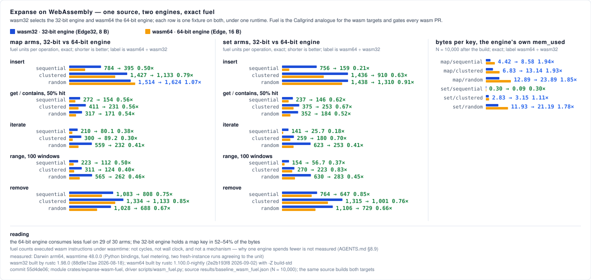

# WebAssembly suite: exact fuel on wasm32 and wasm64, and a Node wall-clock harness

*(measured: local macOS arm64 host, wasmtime 48.0.0 Python bindings, `rustc 1.98.0` for wasm32 and `rustc 1.100.0-nightly (2026-09-02)` with `-Z build-std` for wasm64, commit `55d4de06`; artifact `results/baseline_wasm_fuel.json`, regenerated by `scripts/wasm_fuel.py --save-baseline`)*

Two instruments, with different standing.

- **Fuel** is the deterministic one. `crates/expanse-wasm-fuel` is one Rust module built for `wasm32-unknown-unknown` and `wasm64-unknown-unknown`; `scripts/wasm_fuel.py` instantiates it under wasmtime with fuel metering and reads back the exact fuel each export consumed. Fuel is charged per executed WebAssembly instruction and is deterministic for a given module and runtime version, so every number below is an integer with no variance. The driver runs each export twice on fresh instances and refuses to report unless the two readings agree to the unit. This is the wasm analogue of the Callgrind arms in `crates/expanse/benches/instructions.rs`, and it gates every PR that touches the wasm crates in the `wasm-fuel` CI job.
- **Wall clock** is indicative. `crates/expanse-wasm/tests/bench.js` runs the shipped `@orieg/expanse-wasm` package under Node against three baselines with a winning regime each. Its numbers are a laptop's minimum of three rounds and are not published here: a wall-clock claim needs BCa 95% intervals from the quiet host (`AGENTS.md` §8.4), and no such run exists yet. The harness, its arms and what each cell can claim are described at the end so a future quiet-host run has its shape fixed in advance.

**What the pairing is.** On a 32-bit target the public aliases point at the 32-bit engine (`ExpanseMap` is `ExpanseMap32`, 8-byte `Edge32`); on wasm64 they point at the 64-bit engine (16-byte `Edge`). The fuel module's source is byte-identical across the two builds, so each row below is one fixture on the two engines under one runtime. That comparison exists nowhere else in the repository.

**Superseded when** `results/baseline_wasm_fuel.json` changes: the artifact is authoritative and these tables are its rendering. Regenerate them with `scripts/wasm_fuel.py --build wasm32 --markdown` and `--build wasm64 --markdown`, re-render the chart with `scripts/generate_wasm_svg.py`, and replace the tables, the chart and the provenance line together.

**Left and middle panels.** One row per arm and key distribution, two bars: the 32-bit engine on wasm32 (blue) and the 64-bit engine on wasm64 (amber), scaled to the panel's largest value; the label is the two fuel counts and their ratio. Shorter is better. **Right panel.** The same pair for bytes per key by the engine's own accounting after the build. The footer carries the runtime, both compilers and the commit; everything drawn is read from the artifact by `scripts/generate_wasm_svg.py`.

## Fuel per operation, N = 10,000

Fuel units per operation, `fuel(phase 1) − fuel(phase 0)` divided by N. Lower is better. `random` keys are XorShift64 seed `0x0DDB_1A5E_5EED_0001` truncated to the key width; `sequential` is 0..N; `clustered` is runs of 8 keys 4,096 apart. `get` and `contains` run at 50% hit with misses drawn from the same generator and rejected on membership; `iterate` walks every key once; `range` is 100 windows that tile the key space; `remove` deletes every key once in a seeded shuffled order. (workload: `wasm_fuel`)

| arm | wasm32, 32-bit engine | wasm64, 64-bit engine | wasm64 ÷ wasm32 |
|---|---:|---:|---:|
| `map_insert/sequential` | 783.7 | 395.5 | 0.50× |
| `map_insert/clustered` | 1,427.3 | 1,132.9 | 0.79× |
| `map_insert/random` | 1,513.7 | 1,623.9 | 1.07× |
| `map_get/sequential` | 272.4 | 153.8 | 0.56× |
| `map_get/clustered` | 411.5 | 231.3 | 0.56× |
| `map_get/random` | 317.2 | 170.9 | 0.54× |
| `map_iterate/sequential` | 210.3 | 80.1 | 0.38× |
| `map_iterate/clustered` | 300.1 | 89.2 | 0.30× |
| `map_iterate/random` | 559.0 | 231.8 | 0.41× |
| `map_range/sequential` | 222.6 | 112.4 | 0.50× |
| `map_range/clustered` | 311.0 | 123.9 | 0.40× |
| `map_range/random` | 565.2 | 261.7 | 0.46× |
| `map_remove/sequential` | 1,083.1 | 807.7 | 0.75× |
| `map_remove/clustered` | 1,334.1 | 1,132.7 | 0.85× |
| `map_remove/random` | 1,028.4 | 687.6 | 0.67× |
| `set_insert/sequential` | 756.0 | 159.5 | 0.21× |
| `set_insert/clustered` | 1,436.0 | 909.9 | 0.63× |
| `set_insert/random` | 1,438.0 | 1,309.5 | 0.91× |
| `set_contains/sequential` | 237.4 | 146.0 | 0.62× |
| `set_contains/clustered` | 375.5 | 252.7 | 0.67× |
| `set_contains/random` | 351.7 | 183.9 | 0.52× |
| `set_iterate/sequential` | 141.3 | 25.7 | 0.18× |
| `set_iterate/clustered` | 259.1 | 180.3 | 0.70× |
| `set_iterate/random` | 623.2 | 253.1 | 0.41× |
| `set_range/sequential` | 153.6 | 56.7 | 0.37× |
| `set_range/clustered` | 269.8 | 223.4 | 0.83× |
| `set_range/random` | 629.5 | 283.4 | 0.45× |
| `set_remove/sequential` | 764.4 | 646.9 | 0.85× |
| `set_remove/clustered` | 1,315.4 | 1,000.6 | 0.76× |
| `set_remove/random` | 1,105.5 | 729.2 | 0.66× |

## Bytes per key after the build, the engine's own `mem_used`

Deterministic byte accounting, no allocator overhead included on either side. (workload: `wasm_fuel`)

| structure / keys | wasm32, 32-bit engine | wasm64, 64-bit engine | wasm64 ÷ wasm32 |
|---|---:|---:|---:|
| `map/sequential` | 4.424 | 8.584 | 1.94× |
| `map/clustered` | 6.826 | 13.142 | 1.93× |
| `map/random` | 12.893 | 23.888 | 1.85× |
| `set/sequential` | 0.299 | 0.091 | 0.30× |
| `set/clustered` | 2.826 | 3.146 | 1.11× |
| `set/random` | 11.929 | 21.187 | 1.78× |

## Reading

**The 64-bit engine does less work per operation on wasm, and the 32-bit engine stores fewer bytes per key.** Across the 30 arms the 64-bit engine consumes less fuel in 29; the one exception is `map_insert/random` at 1.07×. The ordered walks show the widest gap, 0.18× to 0.41× on `iterate`, and the point operations sit at 0.52× to 0.67×. Against that, the 32-bit engine's map holds a key in 52% to 54% of the bytes across the three distributions, and its random-key set in 56%; the sequential set is the one cell where the 64-bit engine is denser, at 0.30×.

**What the number is, and is not.** Fuel counts executed WebAssembly instructions. It is not a cycle count, not a wall-clock figure, and not native instruction retirement: the same source lowers differently on the two targets (i32 versus i64 address arithmetic, memory64 bounds checks, and the two engines' different node forms and handle arena), and fuel adds all of that up without separating it. Why one engine spends fewer instructions than the other on a given arm is not measured here and is not claimed; §8.9 of `AGENTS.md` applies. What the table does establish, exactly, is the cost of each arm on each engine under this runtime, which is what a regression gate needs.

**How the gate reads it.** `scripts/wasm_fuel.py --check-baseline results/baseline_wasm_fuel.json` mirrors `perf_report.py`: a single arm more than 5% above its baseline fails, and so do two or more arms above the 0.5% floor. The floor is not noise, fuel has none; it is there so a one-unit codegen ripple on an arm a change did not touch is reported without failing the PR on its own. A baseline arm missing from a run is coverage loss and fails. The driver's `--self-test` pins each of those rules fail-then-pass.

**Cache and prefetch effects are invisible.** wasmtime executes the module natively; fuel does not model a cache hierarchy the way Callgrind's simulation does. A change that trades instructions for locality will show as a fuel increase here and must make its case on a wall-clock instrument with intervals.

## The Node harness

`crates/expanse-wasm/tests/bench.js` measures the shipped package under Node. Two families of rows:

- **u32 rows** measure the 32-bit engine through `WasmExpanseMap32` / `WasmExpanseSet32` with plain JS numbers at the boundary, against the in-wasm `std::BTreeMap` behind `WasmBTreeMap32` (same boundary cost, ordered), the native JS `Map` / `Set` (unordered, no boundary), and a JS sorted array with binary search (ordered, no boundary, O(n) removal). Arms: `insert`, `lookup_hit50` (50% hit, misses generator-drawn and rejected on membership), `iter`, `range` (100 windows through `batch_range_scan`, which both wasm classes share), `remove`, and bytes per key. Losing cells are kept: the Expanse `iter` cell crosses the JS boundary once per element because the package has no batch walk, so it measures the boundary as much as the engine, and the JS baselines beat it there by an order of magnitude; the JS baselines' bytes-per-key column is a post-GC `heapUsed` delta and the in-wasm BTree's is n/a, never 0, because JS heap accounting cannot see linear memory and that class exposes no `mem_used`.
- **legacy rows** (`wasm_map` / `js_map`, u64 `BigInt` keys through `WasmExpanseMap`, 100% hit) are kept byte-for-byte so `scripts/bench_bindings.py` and the nightly bindings baseline keep their history.

Run it as `node --expose-gc tests/bench.js --quick --json` from `crates/expanse-wasm` after `wasm-pack build --release --target nodejs crates/expanse-wasm`; the harness exits non-zero without the package rather than benchmark a JS stand-in. Its shape table is in the file header and in the harness audit table of [`docs/BENCHMARKING.md`](../../BENCHMARKING.md) under Group 6. A quiet-host run with `scripts/bca_bootstrap.py` intervals is the precondition for publishing any of its cells; until then its only published output is this description.

**wasm64 under Node** is not measured: `wasm-pack` cannot emit the JS glue for memory64, and the raw-instantiation path the smoke test uses stubs the imports the binding needs. The fuel module covers wasm64 without glue, which is why it is the instrument for the width comparison.
