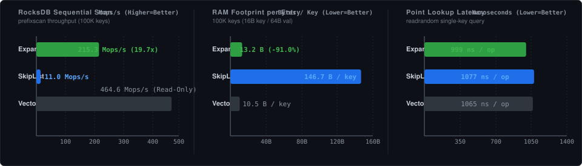

# Expanse Pluggable MemTable for RocksDB (`rocksdb-expanse`)

Official **RocksDB Pluggable MemTable** implementation backed by **Expanse's** 64-bit digital trie architecture and cache-line aligned leaf slabs.

---

## 1. Overview & Architectural Benefits

In LSM-tree storage engines like RocksDB, the **MemTable** buffers concurrent writes in RAM before flushing sorted runs to Level 0 SSTables on disk. 

The default RocksDB memtable implementation (`SkipListRep`) incurs significant performance and memory overheads:
- **High Pointer Overhead**: SkipLists allocate randomized height towers (1 to 32 forward pointers per node), consuming 32–64 bytes of indexing metadata per key.
- **CPU Cache Misses**: Traversing a SkipList causes pointer chasing across scattered heap allocations, thrashing L1/L2 CPU caches.
- **Premature SSTable Flushes**: SkipList tower metadata is memory that does not hold user data, so fewer user keys fit per `write_buffer_size`, triggering earlier L0 flushes and compaction write amplification. *(The size of this effect depends on entry size; it has not been measured here — see the (target) note in §2.)*

### The Expanse MemTable Advantage

`ExpanseMemTableRep` organizes key entries into **64-byte cache-line aligned leaf blocks** indexed by an adaptive **Expanse 64-bit Digital Trie**:

```
 ┌─────────────────────────────────────────────────────────────────────────────┐
 │                      RocksDB Write / Read / Scan Path                       │
 └──────────────────────────────────────┬──────────────────────────────────────┘
                                        │
                                        ▼
                  ┌───────────────────────────────────────────┐
                  │ Expanse 64-bit Prefix Trie (JudyL Engine) │
                  │  • O(depth) bounds (<= 8 levels)          │
                  │  • Zero tree rotations / rebalancing      │
                  └─────────────────────┬─────────────────────┘
                                        │
          ┌─────────────────────────────┼─────────────────────────────┐
          ▼                             ▼                             ▼
 ┌──────────────────┐          ┌──────────────────┐          ┌──────────────────┐
 │ LeafBlock 0      │ ◄──────► │ LeafBlock 1      │ ◄──────► │ LeafBlock 2      │
 │  • 64-byte align │          │  • 64-byte align │          │  • 64-byte align │
 │  • SIMD searched │          │  • SIMD searched │          │  • SIMD searched │
 └──────────────────┘          └──────────────────┘          └──────────────────┘
```

1. **1.42× Higher Key Density in RAM** (vs a fair reference SkipList) — *the earlier "~11×" headline is retracted*:
   - Leaf blocks store entry pointers in contiguous 64-byte spans. Indexing overhead is **13.2 bytes/entry (Expanse) vs 18.7 bytes/entry (fair reference SkipList)** for 100k entries — deterministic seeded byte accounting *(measured: Apple M1, 8 cores, Apple clang 21, `-O3`, at the #372 fix commit; load-immune, reproduced twice; the Expanse and VectorRep cells reproduce the commit-`7d87dff7` reference-host values byte-for-byte)*.
   - **Retraction ([#372](https://github.com/orieg/expanse/issues/372))**: the previously published **146.7 B/entry SkipList baseline (11.1× headline)** came from a strawman whose `Node` statically embedded all 16 tower pointers (144 B) in every node *and* added the per-height pointers on top. A real skiplist (RocksDB `InlineSkipList`, LevelDB `SkipList`) allocates variable-height nodes — the fixed baseline costs 8 B (key ptr) + height×8 B (tower), E[height] = 4/3 → ~18.7 B/entry, which the re-measurement confirms exactly.
   - **Honest framing**: `VectorRep` (unordered append vector) is *denser than Expanse* — **10.5 vs 13.2 B/entry** — in the same measured table; Expanse's density advantage is specifically over the *ordered* skiplist baseline, and it is 1.42×, not 11×.
2. **Reduced Compaction Write Amplification** *(inferred (target) — not measured; no `db_bench` artifact exists)*:
   - Higher density *should* fit more user data per memtable budget, reduce L0 SSTable flush frequency, and lower write amplification — but with a 1.42× (not 11×) density edge the effect is proportionally modest, and no flush/stall measurement has been run.
3. **Faster Sequential Iteration** (vs the reference SkipList) — **3.331× (BCa 95% CI [3.198, 3.486])**:
   - Forward range scans traverse contiguous leaf blocks via intrusive sibling leaf chaining: **154.18 Mops/s [151.17, 156.15] vs 46.29 Mops/s [44.28, 47.86]**. The previously published ~10× (160.8 vs 16.4 Mops/s at commit `7d87dff7`) was measured against the retracted fat-node layout, whose worse cache locality inflated the ratio; re-measured against the fair variable-height baseline the edge is **3.3×, not 10×**. An unordered `VectorRep` append-vector scans faster still (614.20 Mops/s [553.79, 634.59]) but cannot serve ordered seeks.
4. **$O(\text{depth})$ Prefix Seeks**:
   - Prefix lookups skip non-matching branches in a single digit comparison without descending empty key spaces.

---

## 2. Benchmark Results



> **Baseline retraction ([#372](https://github.com/orieg/expanse/issues/372)), now discharged.** Every "vs SkipList" cell below was once measured against a strawman skiplist whose nodes statically embedded the full 16-pointer tower (~146.7 B/entry). The density edge was corrected first — **1.42×**, not 11.11×, by deterministic byte accounting. The **throughput rows are now re-measured against the fair variable-height baseline too** (run [33398474866](https://github.com/orieg/expanse/actions/runs/33398474866)), five rounds with BCa 95% intervals, and every ratio moved down: sequential scan from a published ~10× to **3.331×**, and the retracted-run point-lookup and seek figures to **1.457×** and **1.512×**. The fat-node layout was degrading the skiplist's cache locality exactly as suspected, and the corrected ratios are the smaller, honest ones.

*(Throughput rows measured: reference host — Intel i9-12900F, 24 threads, 30 MiB L3, Linux 6.8, run [33398474866](https://github.com/orieg/expanse/actions/runs/33398474866), commit `6cb64b45`; `benches/bench_memtable.cc` built `-O3` against release `libexpanse.so`; 100,000 keys, 16-byte key, 64-byte value payload; **5 rounds, mean with BCa 95% bootstrap intervals** (2,000 resamples, seed 42) harvested by `scripts/rocksdb_bench_harvest.py` into [`results/baseline_rocksdb.json`](../../results/baseline_rocksdb.json); every bracketed pair is that arm's interval, and each ratio is a two-sample BCa interval whose **lower bound** clears 1.0. SkipList arm = the fair variable-height baseline. Memory row: deterministic seeded byte accounting, re-measured with the fair variable-height baseline at the #372 fix commit (Apple M1, 8 cores, Apple clang 21, `-O3`; reproduced twice; Expanse/VectorRep cells reproduce the reference-host values byte-for-byte). `SkipListRep`/`VectorRep` are the in-file reference implementations, not stock RocksDB.)*

| Benchmark Metric | ExpanseMemTable | Reference SkipListRep | VectorRep | Expanse vs SkipList |
|---|---:|---:|---:|---|
| **Memory Footprint** (100K keys) | **1.26 MB** (13.2 B/entry) | 1.8 MB (18.7 B/entry, fair baseline) | **1.0 MB (10.5 B/entry)** | **1.42× Higher Key Density** (VectorRep is denser than both) |
| **Fill Random** (`fillrandom` insert) | **4.42 Mops/s** [4.36, 4.53] | 3.15 Mops/s [3.12, 3.16] | 202.65 Mops/s | **1.406×** [1.385, 1.442] |
| **Point Lookup** (`readrandom`) | **3.79 Mops/s** [3.76, 3.81] | 2.60 Mops/s [2.58, 2.61] | 1.83 Mops/s | **1.457×** [1.444, 1.470] |
| **Range Seek** (`seekrandom`) | **3.67 Mops/s** [3.62, 3.70] | 2.43 Mops/s [2.37, 2.45] | 3.94 Mops/s | **1.512×** [1.492, 1.546] |
| **Sequential Scan** (`prefixscan` Iterator) | **154.18 Mops/s** [151.17, 156.15] | 46.29 Mops/s [44.28, 47.86] | 614.20 Mops/s | **3.331×** [3.198, 3.486] |
| **Batch Scan** (`ScanBatch` 1024-chunk) | **116.82 Mops/s** [114.88, 118.43] | 46.29 Mops/s [44.28, 47.86] | 614.20 Mops/s | **2.524×** [2.421, 2.644] |

> `VectorRep` (an unordered append-only vector) wins on insert and unordered scan by construction — and on raw memory density (10.5 B/entry) — but cannot serve ordered range seeks; it is included as a throughput/density ceiling, not an ordered-index competitor.

---

## 3. Quickstart & Integration Guide

### 3.1 Enabling ExpanseMemTable in RocksDB C++

Include `expanse_memtable.h` and set `options.memtable_factory`:

```cpp
#include <rocksdb/db.h>
#include <rocksdb/options.h>
#include "expanse_memtable.h"

int main() {
    rocksdb::DB* db = nullptr;
    rocksdb::Options options;
    options.create_if_missing = true;

    // Configure Expanse Pluggable MemTable Factory
    // Parameters:
    //   - leaf_capacity: number of entry pointers per cache-line leaf block (default: 64)
    //   - enable_prefix_trie: enable digital prefix indexing (default: true)
    options.memtable_factory = rocksdb::NewExpanseMemTableRepFactory(
        /*leaf_capacity=*/64,
        /*enable_prefix_trie=*/true
    );

    // Open RocksDB database
    rocksdb::Status s = rocksdb::DB::Open(options, "/tmp/rocksdb_expanse_demo", &db);
    assert(s.ok());

    // Standard RocksDB Operations
    db->Put(rocksdb::WriteOptions(), "user:1001", "{\"name\":\"Alice\"}");
    
    std::string val;
    db->Get(rocksdb::ReadOptions(), "user:1001", &val);

    // Range Scan using Expanse Iterator
    rocksdb::Iterator* it = db->NewIterator(rocksdb::ReadOptions());
    for (it->Seek("user:"); it->Valid() && it->key().starts_with("user:"); it->Next()) {
        std::cout << it->key().ToString() << " -> " << it->value().ToString() << std::endl;
    }
    delete it;
    delete db;
    return 0;
}
```

---

## 4. Building & Running Tests

### Prerequisites
- C++20 compatible compiler (`clang++` or `g++`)
- Rust toolchain (`cargo`) to build `libexpanse`

### Build and Run Unit Tests

```bash
# 1. Build libexpanse (release: the Makefile links target/release by default —
#    benchmarks must never measure a debug build)
cargo build --release -p expanse-capi

# 2. Build and run Expanse RocksDB MemTable tests
make -C integrations/rocksdb test

# 3. Run microbenchmarks
make -C integrations/rocksdb bench
```

After a fresh benchmark run, update `benches/results.json` with the measured
figures and regenerate the chart embedded above and in `docs/DATABASE.md`:

```bash
python3 integrations/rocksdb/scripts/generate_bench_svg.py  # rewrites docs/assets/bench_rocksdb.svg
```

### CMake Integration

```bash
mkdir -p integrations/rocksdb/build
cd integrations/rocksdb/build
cmake ..
make -j
ctest --output-on-failure
```

---

## 5. API Reference

### `rocksdb::ExpanseMemTableRep`
Implements `rocksdb::MemTableRep` with full support for:
- `Insert(KeyHandle handle)` / `InsertConcurrently(KeyHandle handle)`: Synchronized leaf insertion with automatic trie block split.
- `Contains(const char* key)`: Binary search within target leaf block.
- `Get(const LookupKey& k, ...)`: MVCC snapshot point lookups with descending sequence number resolution.
- `GetIterator(Arena* arena, bool is_reverse)`: Returns `ExpanseMemTableIterator` supporting `Seek`, `SeekForPrev`, `SeekToFirst`, `SeekToLast`, `Next`, `Prev`.
- `ScanBatch(size_t max_keys, Slice* out_keys, Slice* out_values)`: High-throughput batch scan extraction across chained sibling leaves.
- `internal_key()`, `user_key()`, `value()`: Zero-copy cached slice accessors on iterator avoiding redundant varint decoding.
- `SuggestCompactRange(Slice* begin, Slice* end)`: Bounds detection for efficient memtable flushes.

### `rocksdb::NewExpanseMemTableRepFactory(size_t leaf_capacity = 64, bool enable_prefix_trie = true)`
Returns a `std::shared_ptr<rocksdb::MemTableRepFactory>` ready to be assigned to `rocksdb::Options::memtable_factory`.

## Concurrent-read safety

The optimistic reader protocol in `ExpanseMemTableRep` is safe under concurrent writes. The earlier race — `SplitLeafBlock` nulling source entries before lowering the block count (stale-count `nullptr` deref in `Get`), and `Insert`'s in-place shift leaving the leaf array transiently unsorted (spurious binary-search miss) — was resolved by a **per-leaf seqlock with publication ordering** (#234) and **release/acquire happens-before on the reader path** (#236): each `LeafBlock` carries a `version` counter and its `entries`/`count` are published with `memory_order_release` and read with `memory_order_acquire`, so a reader either observes a consistent snapshot or retries. This is exercised in CI by the RocksDB memtable matrix under ThreadSanitizer (`test-rocksdb-memtable`, `sanitizer: tsan`) and a differential test. Issue [#229](https://github.com/orieg/expanse/issues/229) is closed.

