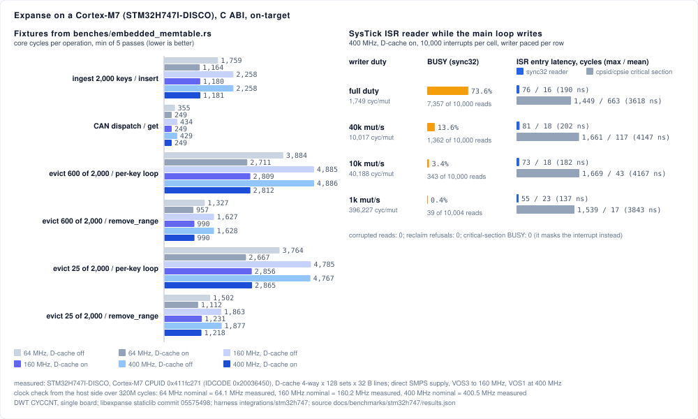
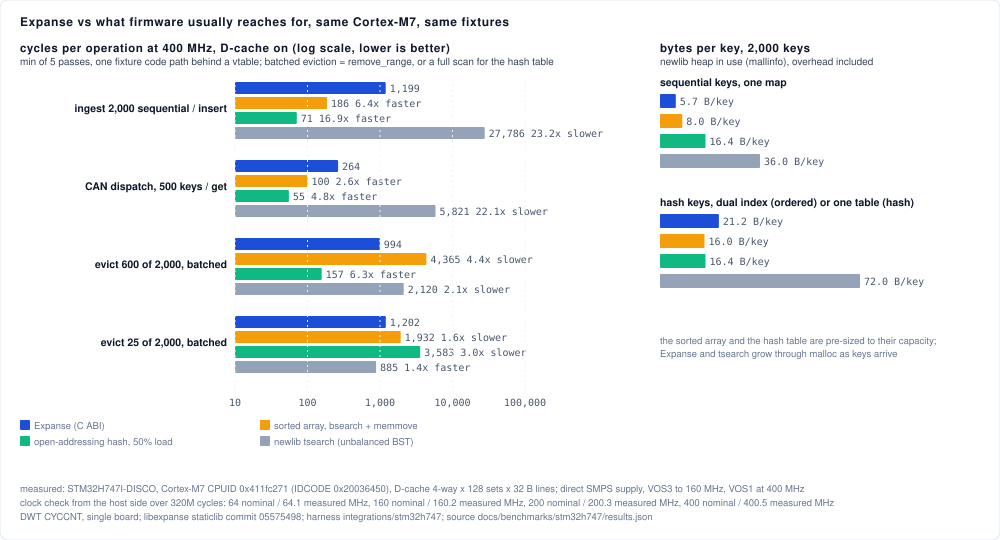
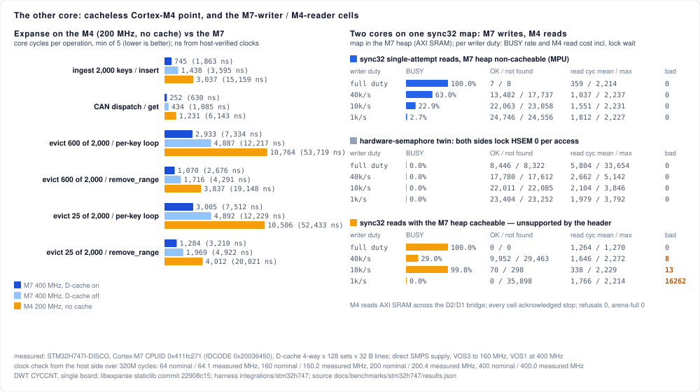

# STM32H747I-DISCO harness (Cortex-M7 + Cortex-M4, bare metal)

The on-target execution lane for the ARM Cortex-M tier: a Cube-free
firmware for both cores of an STM32H747I-DISCO that links `libexpanse.a`
(narrow surface, `thumbv7em-none-eabihf`) and runs the
`benches/embedded_memtable.rs` fixtures — for Expanse and three alternatives
— plus the `sync32` interrupt-handler contract on each core and the
cross-core reader cells, reporting DWT cycle counts over the ST-LINK V3
virtual COM port. Tracking issue: #598. Measured results and their reading
live in `docs/BENCHMARKING.md` ("Cortex-M7 on-target"); the committed
artifacts are `docs/benchmarks/stm32h747/{transcript.txt,results.json}` and
the derived charts `docs/assets/bench_stm32h747*.svg`
(`scripts/generate_stm32_svg.py`).

## Results and how to read them

*(measured: STM32H747I-DISCO, silicon rev V; Cortex-M7 at 64 MHz HSI, 160 MHz PLL1/VOS3 and 400 MHz PLL1/VOS1, D-cache 4-way × 128 sets × 32-byte lines, off and on; Cortex-M4 at 200 MHz HCLK, no cache; clocks host-verified over 320M cycles at 64.1 / 160.2 / 400.5 / 200.3 MHz; libexpanse staticlib commit `05575498`; DWT cycles per operation, min of 5 passes, one board; source `docs/benchmarks/stm32h747/results.json`, transcript alongside; every chart value is derived from that file by `scripts/generate_stm32_svg.py`. The full tables and the verdict against the #598 pre-registration are in `docs/BENCHMARKING.md`, "Cortex-M7 on-target".)*

### 1. Expanse on the M7: does it run, and does the cache-line node layout pay off?



**Left panel.** Six fixtures (rows), six bars each: the same code at three clocks, with the data cache off and on. A bar is the number of core cycles one operation costs; shorter is better. Two patterns matter more than any absolute value. Within a row, the cache-on bars stay the same length as the clock rises while the cache-off bars grow — once the core outruns the SRAM every miss costs more cycles, and the ratio between the two is the payoff of the 32-byte node geometry the design doc sized for this core (`docs/design/32-bit-embedded.md` §2.1.4). Across rows, `remove_range` is about a third of the per-key eviction loop: the batched eviction from #578, on hardware.

**Right panel.** The interrupt-handler contract. The main loop mutates a `sync32` map while a SysTick interrupt reads it; rows are how hard the writer works, from flat-out down to a thousand mutations per second. The orange bar is how often the interrupt's single-attempt read came back BUSY (it landed inside a write). The two grey/blue bars are how long the interrupt waited before it could run: blue with Expanse's optimistic reader, grey with the conventional `cpsid`/`cpsie` critical section around each write. Blue is a sliver at every duty; grey is one whole mutation long.

| reading | what it means |
|---|---|
| cache-on bars flat from 160 to 400 MHz; cache-off/cache-on ratio 1.6–1.9× at 2:1 core:bus | the working set fits the 16 KB D-cache; the node layout does its job |
| `remove_range` ≈ ⅓ of the per-key loop | batched ordered eviction holds on the target |
| BUSY 71% flat-out, 15 / 4 / 0.4% at 40k / 10k / 1k mutations/s | single-attempt reads are practical at realistic write rates |
| ISR entry latency ceiling 49–83 cycles vs 1,551–1,728 for the critical section | interrupt latency bounded 18–35× tighter than masking interrupts |

### 2. Against what firmware usually reaches for



**Left panel, log scale** — each gridline is 10× the previous, so a bar twice as long is far more than twice as slow. Four fixtures, four bars each: Expanse (blue), a sorted array with `bsearch` + `memmove` (orange), an open-addressing hash table at ≤ 50% load (green), newlib's `tsearch` (grey); every non-Expanse bar is labelled with its ratio to Expanse. Read it as an honest scorecard: the hash table wins point lookups and unordered inserts outright and the sorted array wins them too — Expanse is an ordered structure that allocates as it grows, and loses those on purpose. Bulk expiry (600 of 2,000) goes to the hash table's full scan because most records are expiring anyway. Steady-state expiry (25 of 2,000), the shape a real TTL index lives in, goes to Expanse, because the hash table must scan everything and the sorted array must shuffle memory. Disregard `tsearch`'s win in that row: an unbalanced tree over ascending keys degenerates into a list whose head is the minimum, and the same degeneracy makes its inserts 23× slower.

**Right panel.** Heap bytes per stored key (newlib `mallinfo`, allocator overhead included for all four). Expanse is the densest on dense sequential keys, middle of the pack on random keys, `tsearch` the worst by far. The sorted array and the hash table are pre-sized to capacity; Expanse and `tsearch` grow through `malloc`.

| shape | winner on this core |
|---|---|
| unordered inserts, point lookups | hash table (17× / 4.8×), then sorted array (6.4× / 2.6×) |
| bulk expiry, most records expiring | hash-table scan (6.3×) |
| steady-state expiry, few expiring | Expanse (3.0× over the scan, 1.6× over the sorted array) |
| bytes per key, sequential keys | Expanse (5.7 vs 8.0 / 16.4 / 36.0) |
| interrupt-safe reads | only Expanse offers them |

### 3. The other core, and two cores on one map



**Left panel.** The Expanse fixtures with a third bar (orange) for the Cortex-M4, which has no cache and runs at half the clock: every operation costs 3.3–4.7× the M7's cache-on cycles. The alternatives pay more for the move (5.2–7.2×), so the scorecard above holds on the small core with narrower gaps, and the interrupt contract holds there with a wider margin (a 91–98-cycle ceiling against 24 µs of masked interrupts).

**Right panel.** The experiment the `sync32` header explicitly marks unsupported, run to find out what happens: the M7 writes the map, the M4 reads it across the D2/D1 bridge, at each writer duty. Three blocks. **Blue**, M7 heap non-cacheable (MPU): correct — no wrong value ever, hits split as the key set dictates — but an M4 read of the M7's memory costs about 9 µs, so it is told BUSY far more often than the same-core interrupt was, and always when the writer is flat-out. **Grey**, the hardware-semaphore twin, the conventional cross-core method with a lock around every access: never BUSY, but a read waits up to about 150 µs when the writer is flat-out. **Orange**, M7 heap cacheable, the unsupported case: every read comes back BUSY and none comes back wrong — it fails safe.

| reading | what it means |
|---|---|
| M4 cycles 3.3–4.7× the M7 cache-on, 2.3–2.5× the M7 cache-off | the simpler in-order pipeline, not memory (its heap runs at core speed) |
| non-cacheable heap: BUSY 100 / 62 / 23 / 2.7% at full / 40k / 10k / 1k mutations/s, 0 corrupted | the protocol is correct across cores; the second core's slow reads make it impractical at high write rates |
| HSEM twin: 0 BUSY, lock wait up to 28.8k cycles (144 µs) flat-out, ≈1.5k (7.6 µs) at ≤ 10k/s | the lock trades BUSY for a bounded-but-long wait |
| cacheable heap: 100% BUSY at every duty, 0 corrupted | the unsupported configuration fails safe; the header's restriction stands, now with numbers |

**In one paragraph.** Expanse runs correctly on both cores; the cache-line node layout measurably pays off on the M7; and its interrupt-safe reads bound interrupt latency in a way that masking interrupts cannot. Against the structures firmware usually reaches for it loses raw point lookups and unordered inserts, and wins steady-state ordered expiry, memory density on dense keys, and the interrupt contract. Across two cores it is correct only with an uncached shared heap, and even then the second core's slow reads limit it to modest write rates.

## What runs

| stage | what | output line |
|---|---|---|
| calibration | 320M cycles of spin between `TICK`/`TOCK` at each clock; `capture.py` times it on the host, which pins the core clock independently of the firmware's belief and lets `harvest.py` derive nanoseconds | `CALIB` |
| fixtures | ingest (2,000 sequential inserts), CAN dispatch (500 gets), BLE TTL eviction in the bulk (600/2,000) and steady (25/2,000) shapes, each via the per-key `first`/`remove` loop and via `remove_range` (or a full scan for the hash table); 5 passes; at 64 MHz HSI, 160 MHz PLL1 (VOS3) and 400 MHz PLL1 (VOS1), D-cache off and on; for **four implementations** behind one vtable (`alts.c`): Expanse's C ABI, a sorted array with `bsearch`+`memmove`, an open-addressing hash table (same FNV-1a, ≤ 50% load), and newlib's `tsearch` | `RESULT name=… impl=… sysclk=… dcache=… pass=… cycles=… ops=…` |
| bytes/key | newlib heap in use (`mallinfo`) and requested bytes around building each structure with 2,000 keys, sequential-key map and the BLE dual index | `RESULT name=bytes impl=… shape=…` |
| ISR arm | SysTick every 20,000 cycles calls `expanse_sync32_map_reader_try_get` while the main loop mutates a `sync32` map at full duty and at three paced rates (jittered gaps, so the writer cannot alias with the timer); counts OK / NOT_FOUND / BUSY, value-corruption checks, reclaim refusals, ISR entry latency (from the SysTick counter at entry) and ISR body cycles | `RESULT name=isr_sync32 …` |
| twin | the same, with `cpsid i`/`cpsie i` around a plain `expanse_map_t` and a plain `expanse_map_get` in the ISR | `RESULT name=isr_critical_section …` |

Every `CHECK` line is a failed in-firmware assertion; a clean run prints none
and ends with `DONE`. Core clock is 64 MHz HSI after reset, then 160 MHz from
PLL1 inside the reset VOS3 envelope, then 400 MHz at VOS1 after selecting the
direct-SMPS supply the DISCO is wired for (`PWR_CR3` already reads SDEN=1,
LDOEN=0 on this board). VOS0 / 480 MHz needs the LDO path and a board
modification, so it is not attempted. All numbers are core cycles per
operation; `harvest.py` converts to ns with the host-measured clocks.

The alternatives are deliberately plain: the sorted array and the hash table
are pre-sized to capacity (like the host suite's `HashMap::with_capacity`),
Expanse and `tsearch` grow through `malloc`; `tsearch` degenerates on
sequential keys (unbalanced), which the docs section says out loud.

## Both cores

`main.c` is built twice: `-DCORE_M7` for flash bank 1 and `-DCORE_M4` for
bank 2 (`startup.c` serves both; the M4 variant enables its D2 SRAM and the
D3 SRAM4 clocks with registers only, before its stack exists). After the M7
finishes its own cells at 400 MHz it hands the M4 a turn through the SRAM4
mailbox (`dual.h`): the M4 — 200 MHz HCLK, no cache — runs the same
calibration (relayed by the M7 as `TICK`/`TOCK` so the host times it too),
the same fixtures for all four implementations and the same ISR arms, into a
16 KB text buffer the M7 dumps to the VCP with `core=m4` on every line.

Then the dual-core cells. The M7 allocates a `sync32` map in its own heap
(AXI SRAM — every node body is a heap `Box`, the arena only holds handles,
which is why an SRAM4 bump arena was the wrong shared region the first
time), prefills it, and mutates it at each writer duty while the M4 serves
single-attempt `try_get`s from its reader handle across the D2/D1 bridge,
counting OK / not-found / BUSY / corrupted values, read cycles and lock
waits. Three series: the M7 heap **non-cacheable** (MPU region 2; region 0
keeps all of SRAM4 non-cacheable so the mailbox never sits in the D-cache);
the same with a **hardware-semaphore twin** (HSEM 0 around every mutation
and every read — what firmware does across cores); and the heap
**cacheable** — the configuration the `sync32` header marks unsupported —
measured rather than assumed. `QUICK=1 sh build.sh` skips the fixture
passes so the dual cells can be iterated in under a minute.

## Files

- `main.c` — harness for both cores; `startup.c`; `m7.ld` (flash bank 1,
  DTCM data/stack, 512 KB AXI SRAM heap via `_sbrk`), `m4.ld` (flash bank 2,
  SRAM3 data/stack, SRAM1+2 heap); `dual.h` — mailbox layout and protocol.
- `alts.{h,c}` — the alternatives and the allocation accounting.
- `build.sh` — builds both images against
  `target/thumbv7em-none-eabihf/release/libexpanse.a` and asserts the
  hard-float ABI tag on each; CI runs it. `run.sh` — flashes both banks over
  the on-board ST-LINK (`STM32_Programmer_CLI`), resets, captures the VCP
  with `capture.py`, and summarises with `harvest.py` (table + JSON).

## Running it

```bash
cargo build --release -p expanse-capi --no-default-features \
  --features embedded-panic-handler --target thumbv7em-none-eabihf
sh integrations/stm32h747/build.sh
sh integrations/stm32h747/run.sh docs/benchmarks/stm32h747/transcript.txt
```

Needs the Arm GNU toolchain (`arm-none-eabi-gcc`) and STM32CubeProgrammer.
Board notes that cost a detour the first time: the debugger is the micro-USB
**CN2 (STLK)** on the edge next to the RCA jack, not the micro-USB by the
audio jacks (CN14, 5 V power input only) and not the USB-C (application USB).
When the link is up macOS mounts `DIS_H747XI` and `st-info --probe` finds the
programmer. `run.sh` writes **both** flash banks, replacing whatever was there.
On macOS, `stty` settings are dropped when the port closes, which reads as a
silent board; `capture.py` holds the port open through termios instead.

Superseded when a probe-rs / QEMU lane replaces the CubeProgrammer flow, or
when the harness grows a second board and moves under a shared directory.
